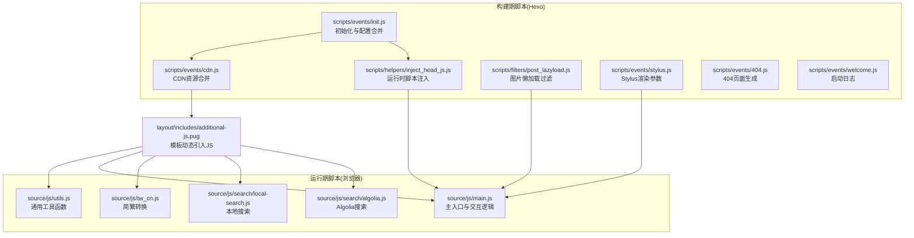
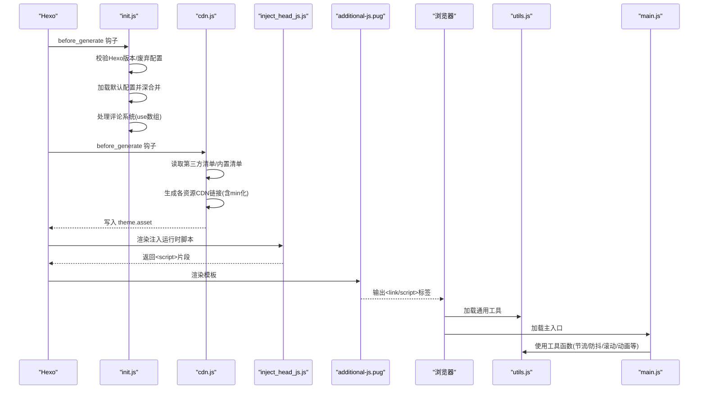
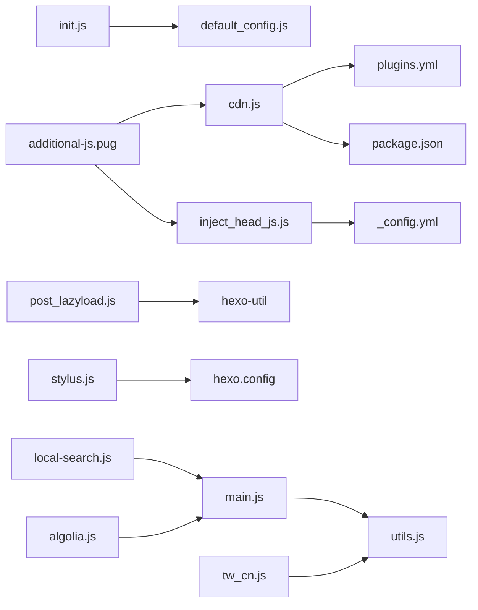

# JavaScript模块

<cite>
**本文引用的文件**   
- [themes/butterfly/scripts/events/init.js](file://themes/butterfly/scripts/events/init.js)
- [themes/butterfly/scripts/events/cdn.js](file://themes/butterfly/scripts/events/cdn.js)
- [themes/butterfly/scripts/common/default_config.js](file://themes/butterfly/scripts/common/default_config.js)
- [themes/butterfly/scripts/helpers/inject_head_js.js](file://themes/butterfly/scripts/helpers/inject_head_js.js)
- [themes/butterfly/scripts/filters/post_lazyload.js](file://themes/butterfly/scripts/filters/post_lazyload.js)
- [themes/butterfly/scripts/events/stylus.js](file://themes/butterfly/scripts/events/stylus.js)
- [themes/butterfly/scripts/events/404.js](file://themes/butterfly/scripts/events/404.js)
- [themes/butterfly/scripts/events/welcome.js](file://themes/butterfly/scripts/events/welcome.js)
- [themes/butterfly/layout/includes/additional-js.pug](file://themes/butterfly/layout/includes/additional-js.pug)
- [themes/butterfly/_config.yml](file://themes/butterfly/_config.yml)
- [themes/butterfly/source/js/main.js](file://themes/butterfly/source/js/main.js)
- [themes/butterfly/source/js/utils.js](file://themes/butterfly/source/js/utils.js)
- [themes/butterfly/source/js/tw_cn.js](file://themes/butterfly/source/js/tw_cn.js)
- [themes/butterfly/source/js/search/local-search.js](file://themes/butterfly/source/js/search/local-search.js)
- [themes/butterfly/source/js/search/algolia.js](file://themes/butterfly/source/js/search/algolia.js)
</cite>

## 目录
1. [简介](#简介)
2. [项目结构](#项目结构)
3. [核心组件](#核心组件)
4. [架构总览](#架构总览)
5. [详细组件分析](#详细组件分析)
6. [依赖分析](#依赖分析)
7. [性能考虑](#性能考虑)
8. [故障排查指南](#故障排查指南)
9. [结论](#结论)
10. [附录](#附录)

## 简介
本文件面向Butterfly主题的前端JavaScript模块系统，系统化梳理主题脚本的架构设计、事件处理机制、模块加载顺序与功能扩展方法。重点覆盖以下方面：
- 初始化流程与Hexo环境校验
- CDN资源合并与链接生成
- 默认配置注入与运行时配置合并
- 通用工具函数与事件绑定
- 搜索（本地/Algolia）与暗黑模式切换、图片懒加载、中英简繁转换等核心功能
- 自定义开发指南与调试技巧

## 项目结构
主题的JavaScript模块主要分为两类：
- 构建期脚本（Hexo过滤器/事件/助手）：在站点生成阶段完成配置合并、CDN链接生成、注入运行时脚本等
- 运行期脚本（浏览器端）：在页面加载后执行，负责交互、动画、滚动处理、搜索、主题切换等

图表来源
- [themes/butterfly/scripts/events/init.js:1-87](file://themes/butterfly/scripts/events/init.js#L1-L87)
- [themes/butterfly/scripts/events/cdn.js:1-96](file://themes/butterfly/scripts/events/cdn.js#L1-L96)
- [themes/butterfly/scripts/helpers/inject_head_js.js:1-156](file://themes/butterfly/scripts/helpers/inject_head_js.js#L1-L156)
- [themes/butterfly/scripts/filters/post_lazyload.js:1-41](file://themes/butterfly/scripts/filters/post_lazyload.js#L1-L41)
- [themes/butterfly/scripts/events/stylus.js:1-25](file://themes/butterfly/scripts/events/stylus.js#L1-L25)
- [themes/butterfly/layout/includes/additional-js.pug:1-61](file://themes/butterfly/layout/includes/additional-js.pug#L1-L61)
- [themes/butterfly/source/js/utils.js:1-339](file://themes/butterfly/source/js/utils.js#L1-L339)
- [themes/butterfly/source/js/main.js:1-988](file://themes/butterfly/source/js/main.js#L1-L988)
- [themes/butterfly/source/js/tw_cn.js:1-118](file://themes/butterfly/source/js/tw_cn.js#L1-L118)
- [themes/butterfly/source/js/search/local-search.js:1-568](file://themes/butterfly/source/js/search/local-search.js#L1-L568)
- [themes/butterfly/source/js/search/algolia.js:1-563](file://themes/butterfly/source/js/search/algolia.js#L1-L563)

章节来源
- [themes/butterfly/layout/includes/additional-js.pug:1-61](file://themes/butterfly/layout/includes/additional-js.pug#L1-L61)
- [themes/butterfly/scripts/events/init.js:1-87](file://themes/butterfly/scripts/events/init.js#L1-L87)
- [themes/butterfly/scripts/events/cdn.js:1-96](file://themes/butterfly/scripts/events/cdn.js#L1-L96)
- [themes/butterfly/scripts/helpers/inject_head_js.js:1-156](file://themes/butterfly/scripts/helpers/inject_head_js.js#L1-L156)
- [themes/butterfly/scripts/filters/post_lazyload.js:1-41](file://themes/butterfly/scripts/filters/post_lazyload.js#L1-L41)
- [themes/butterfly/scripts/events/stylus.js:1-25](file://themes/butterfly/scripts/events/stylus.js#L1-L25)

## 核心组件
- 初始化与配置合并
  - 在站点生成前进行Hexo版本检查与废弃配置提示，并将默认配置与用户配置深度合并，同时处理评论系统的冲突与去重
- CDN资源合并
  - 读取第三方插件清单与内置资源清单，按提供商生成最终资源链接（支持本地、jsDelivr、unpkg、cdnjs、自定义格式），并剔除空值
- 注入运行时脚本
  - 动态生成包含本地存储、脚本/CSS加载、全局函数注册、暗黑模式、侧栏状态、Apple设备检测等能力的运行时脚本
- 图片懒加载过滤
  - 在HTML渲染或文章渲染后，将图片替换为占位或原生lazy属性，以减少首屏压力
- Stylus渲染参数
  - 将高亮方案与语言设置注入到样式渲染上下文
- 模板动态引入
  - 根据主题配置与页面类型，按需引入utils、main、translate、lightbox、instantpage、lazyload、snackbar、math、comments、pjax、umami、busuanzi、search等脚本

章节来源
- [themes/butterfly/scripts/events/init.js:1-87](file://themes/butterfly/scripts/events/init.js#L1-L87)
- [themes/butterfly/scripts/events/cdn.js:1-96](file://themes/butterfly/scripts/events/cdn.js#L1-L96)
- [themes/butterfly/scripts/helpers/inject_head_js.js:1-156](file://themes/butterfly/scripts/helpers/inject_head_js.js#L1-L156)
- [themes/butterfly/scripts/filters/post_lazyload.js:1-41](file://themes/butterfly/scripts/filters/post_lazyload.js#L1-L41)
- [themes/butterfly/scripts/events/stylus.js:1-25](file://themes/butterfly/scripts/events/stylus.js#L1-L25)
- [themes/butterfly/layout/includes/additional-js.pug:1-61](file://themes/butterfly/layout/includes/additional-js.pug#L1-L61)

## 架构总览
下面的序列图展示“构建期 → 运行期”的关键数据流与控制流：

图表来源
- [themes/butterfly/scripts/events/init.js:79-87](file://themes/butterfly/scripts/events/init.js#L79-L87)
- [themes/butterfly/scripts/events/cdn.js:11-95](file://themes/butterfly/scripts/events/cdn.js#L11-L95)
- [themes/butterfly/scripts/helpers/inject_head_js.js:3-155](file://themes/butterfly/scripts/helpers/inject_head_js.js#L3-L155)
- [themes/butterfly/layout/includes/additional-js.pug:1-61](file://themes/butterfly/layout/includes/additional-js.pug#L1-L61)
- [themes/butterfly/source/js/utils.js:1-339](file://themes/butterfly/source/js/utils.js#L1-L339)
- [themes/butterfly/source/js/main.js:1-988](file://themes/butterfly/source/js/main.js#L1-L988)

## 详细组件分析

### 初始化与配置合并（init.js）
- 功能要点
  - 校验Hexo版本（要求≥5.3.0），否则抛出错误并记录日志
  - 检测废弃配置文件（butterfly.yml），提示迁移至_config.butterfly.yml
  - 缓存默认配置，避免重复读取
  - 深度合并默认配置与用户配置
  - 规范化评论系统use字段（字符串/数组/逗号分隔），并处理Disqus与Disqusjs冲突，仅保留第一个
- 性能与健壮性
  - 缓存默认配置，减少文件IO
  - 对use数组进行trim/大小写规范化，提升容错
- 典型影响范围
  - 影响后续所有基于theme.config的功能（CDN、注入、渲染）

章节来源
- [themes/butterfly/scripts/events/init.js:1-87](file://themes/butterfly/scripts/events/init.js#L1-L87)
- [themes/butterfly/scripts/common/default_config.js:1-602](file://themes/butterfly/scripts/common/default_config.js#L1-L602)

### CDN资源合并（cdn.js）
- 功能要点
  - 读取plugins.yml作为第三方源清单，内置main/utils/tw_cn/local_search/algolia_js
  - 支持provider：local/jsDelivr/unpkg/cdnjs/custom
  - 自动生成min化路径与版本参数，支持内部资源与外部CDN
  - 删除option中的null值，保证最终theme.asset稳定
- 关键算法
  - createCDNLink：遍历资源清单，构造name/version/file/min等字段，再根据provider生成最终URL
  - minFile：通过正则将.js/.css替换为.min.js/.min.css
- 典型影响范围
  - 影响模板additional-js.pug的资源输出与加载顺序

章节来源
- [themes/butterfly/scripts/events/cdn.js:1-96](file://themes/butterfly/scripts/events/cdn.js#L1-L96)

### 注入运行时脚本（inject_head_js.js）
- 功能要点
  - 提供saveToLocal（带TTL）、getScript/getCSS、addGlobalFn等通用能力
  - 注入暗黑模式切换函数（activateDarkMode/activateLightMode），并根据autoChangeMode策略自动切换
  - 注入aside隐藏状态恢复逻辑
  - 注入Apple设备检测（添加apple类）
- 关键策略
  - autoChangeMode支持三种模式：跟随系统/固定时间段/手动
  - 通过localStorage持久化主题与aside状态
- 典型影响范围
  - 影响main.js中的主题切换、滚动百分比、右下角按钮行为等

章节来源
- [themes/butterfly/scripts/helpers/inject_head_js.js:1-156](file://themes/butterfly/scripts/helpers/inject_head_js.js#L1-L156)

### 图片懒加载过滤（post_lazyload.js）
- 功能要点
  - 当启用native时，直接为<img添加loading="lazy"
  - 否则将src替换为占位图与data-lazy-src，结合运行时加载策略实现懒加载
  - 支持站点级与文章级两种触发场景
- 性能收益
  - 减少首屏资源请求，降低带宽与CPU占用

章节来源
- [themes/butterfly/scripts/filters/post_lazyload.js:1-41](file://themes/butterfly/scripts/filters/post_lazyload.js#L1-L41)

### Stylus渲染参数（stylus.js）
- 功能要点
  - 将高亮方案（highlight.js/prismjs）与行号开关注入到Stylus上下文，供样式条件编译使用
  - 兼容新版本Hexo的syntax_highlighter配置

章节来源
- [themes/butterfly/scripts/events/stylus.js:1-25](file://themes/butterfly/scripts/events/stylus.js#L1-L25)

### 模板动态引入（additional-js.pug）
- 功能要点
  - 按配置引入utils/main/translate/lightbox/instantpage/lazyload/snackbar等脚本
  - 条件引入数学、ABC音乐、最新评论、评论系统、Pjax、Umami、Busuanzi、搜索等
  - 通过fragment_cache与partial优化缓存与包含

章节来源
- [themes/butterfly/layout/includes/additional-js.pug:1-61](file://themes/butterfly/layout/includes/additional-js.pug#L1-L61)

### 运行期脚本总览（utils.js + main.js）
- utils.js
  - 提供防抖/节流、滚动到目标位置、平滑动画、溢出遮罩、Snackbar、日期差计算、IntersectionObserver懒加载、图片灯箱、加载指示器、锚点更新、滚动百分比、事件绑定（含Pjax清理）、评论切换等工具
- main.js
  - 页面DOM加载完成后初始化：头部自适应、侧边栏开关、代码块工具栏、图片灯箱、Justified Gallery无限滚动、右侧栏滚动百分比、TOC与锚点联动、暗黑/阅读模式切换、复制版权、运行时间/最后更新、表格溢出、移动端菜单、翻译按钮等
  - 通过btf.addGlobalFn注册生命周期回调，配合Pjax实现页面切换时的状态清理与重新初始化

章节来源
- [themes/butterfly/source/js/utils.js:1-339](file://themes/butterfly/source/js/utils.js#L1-L339)
- [themes/butterfly/source/js/main.js:1-988](file://themes/butterfly/source/js/main.js#L1-L988)

### 搜索功能（local-search.js + algolia.js）
- 本地搜索（local-search.js）
  - 支持XML/JSON数据源，预处理标题/内容，高亮关键词，支持分页与命中统计
  - 提供URL高亮参数回显，支持Safari高度修正与Esc关闭
- Algolia搜索（algolia.js）
  - 支持v4/v5客户端，按hitsPerPage分页，内容截断与HTML标签平衡，统计信息展示
  - 提供防抖搜索与事件委托分页

章节来源
- [themes/butterfly/source/js/search/local-search.js:1-568](file://themes/butterfly/source/js/search/local-search.js#L1-L568)
- [themes/butterfly/source/js/search/algolia.js:1-563](file://themes/butterfly/source/js/search/algolia.js#L1-L563)

### 中英简繁转换（tw_cn.js）
- 功能要点
  - 维护简繁字符映射表，支持延迟转换、Cookie持久化目标编码、动态lang属性切换
  - 提供translatePage/Traditionalized/Simplized/translateInitialization等接口
  - 通过btf.addGlobalFn注册Pjax完成后的初始化回调

章节来源
- [themes/butterfly/source/js/tw_cn.js:1-118](file://themes/butterfly/source/js/tw_cn.js#L1-L118)

### 其他事件与辅助
- 404页面生成（404.js）
  - 当开启时生成独立404页面，禁用顶部图与评论
- 启动日志（welcome.js）
  - 生成主题版本欢迎信息

章节来源
- [themes/butterfly/scripts/events/404.js:1-21](file://themes/butterfly/scripts/events/404.js#L1-L21)
- [themes/butterfly/scripts/events/welcome.js:1-14](file://themes/butterfly/scripts/events/welcome.js#L1-L14)

## 依赖分析
- 构建期依赖
  - init.js依赖default_config.js与hexo-util；依赖hexo.locals获取废弃配置检测
  - cdn.js依赖plugins.yml与package.json版本；依赖path拼接与正则替换
  - inject_head_js.js依赖主题配置（darkmode/aside/pjax/theme_color）与全局变量
  - post_lazyload.js依赖hexo-util.url_for与配置项
  - stylus.js依赖hexo.config语法高亮配置
- 运行期依赖
  - main.js依赖utils.js提供的工具函数；依赖全局配置对象（GLOBAL_CONFIG/GLOBAL_CONFIG_SITE）
  - search模块依赖main.js中的事件绑定与Pjax刷新
  - tw_cn.js依赖utils.js的全局函数与Snackbar配置

图表来源
- [themes/butterfly/scripts/events/init.js:1-87](file://themes/butterfly/scripts/events/init.js#L1-L87)
- [themes/butterfly/scripts/events/cdn.js:1-96](file://themes/butterfly/scripts/events/cdn.js#L1-L96)
- [themes/butterfly/scripts/helpers/inject_head_js.js:1-156](file://themes/butterfly/scripts/helpers/inject_head_js.js#L1-L156)
- [themes/butterfly/scripts/filters/post_lazyload.js:1-41](file://themes/butterfly/scripts/filters/post_lazyload.js#L1-L41)
- [themes/butterfly/scripts/events/stylus.js:1-25](file://themes/butterfly/scripts/events/stylus.js#L1-L25)
- [themes/butterfly/layout/includes/additional-js.pug:1-61](file://themes/butterfly/layout/includes/additional-js.pug#L1-L61)
- [themes/butterfly/source/js/main.js:1-988](file://themes/butterfly/source/js/main.js#L1-L988)
- [themes/butterfly/source/js/utils.js:1-339](file://themes/butterfly/source/js/utils.js#L1-L339)
- [themes/butterfly/source/js/search/local-search.js:1-568](file://themes/butterfly/source/js/search/local-search.js#L1-L568)
- [themes/butterfly/source/js/search/algolia.js:1-563](file://themes/butterfly/source/js/search/algolia.js#L1-L563)
- [themes/butterfly/source/js/tw_cn.js:1-118](file://themes/butterfly/source/js/tw_cn.js#L1-L118)

## 性能考虑
- 资源加载
  - 优先使用CDN与min化文件，减少体积与网络往返
  - 按需引入：仅在启用时加载lazyload、instantpage、snackbar、busuanzi、pjax、math、comments等
- 渲染优化
  - 代码块工具栏与展开按钮采用条件渲染，避免不必要的DOM
  - Justified Gallery使用InfiniteGrid分组加载与“加载更多”按钮，避免一次性渲染大量图片
- 交互优化
  - 滚动处理使用节流（throttle）与防抖（debounce），降低高频事件开销
  - 暗黑模式切换与aside状态通过本地存储持久化，避免每次进入都重新计算
- 懒加载
  - native模式使用loading="lazy"；非native模式使用占位图与data-lazy-src，结合IntersectionObserver或滚动事件触发真实src加载

## 故障排查指南
- 启动失败（Hexo版本过低）
  - 现象：生成时报错并终止
  - 排查：确认Hexo版本≥5.3.0；检查日志中的废弃配置提示并迁移至新文件
  - 参考
    - [themes/butterfly/scripts/events/init.js:10-32](file://themes/butterfly/scripts/events/init.js#L10-L32)
- CDN链接异常
  - 现象：资源404或加载缓慢
  - 排查：核对CDN.provider与version选项；检查plugins.yml与内置清单；确认min化规则与版本参数
  - 参考
    - [themes/butterfly/scripts/events/cdn.js:48-95](file://themes/butterfly/scripts/events/cdn.js#L48-L95)
- 暗黑模式不生效
  - 现象：切换无效或刷新后恢复默认
  - 排查：确认autoChangeMode策略与localStorage中theme值；检查meta[name="theme-color"]更新
  - 参考
    - [themes/butterfly/scripts/helpers/inject_head_js.js:64-126](file://themes/butterfly/scripts/helpers/inject_head_js.js#L64-L126)
- 图片未懒加载
  - 现象：首屏图片立即加载
  - 排查：确认lazyload.enable与field设置；native模式需确保浏览器支持loading="lazy"
  - 参考
    - [themes/butterfly/scripts/filters/post_lazyload.js:11-41](file://themes/butterfly/scripts/filters/post_lazyload.js#L11-L41)
- 搜索无结果或高亮异常
  - 现象：本地搜索空白或Algolia返回为空
  - 排查：确认search.use与数据源路径；检查algolia appId/apiKey/indexName；查看分页与防抖设置
  - 参考
    - [themes/butterfly/source/js/search/local-search.js:173-197](file://themes/butterfly/source/js/search/local-search.js#L173-L197)
    - [themes/butterfly/source/js/search/algolia.js:218-232](file://themes/butterfly/source/js/search/algolia.js#L218-L232)

章节来源
- [themes/butterfly/scripts/events/init.js:10-32](file://themes/butterfly/scripts/events/init.js#L10-L32)
- [themes/butterfly/scripts/events/cdn.js:48-95](file://themes/butterfly/scripts/events/cdn.js#L48-L95)
- [themes/butterfly/scripts/helpers/inject_head_js.js:64-126](file://themes/butterfly/scripts/helpers/inject_head_js.js#L64-L126)
- [themes/butterfly/scripts/filters/post_lazyload.js:11-41](file://themes/butterfly/scripts/filters/post_lazyload.js#L11-L41)
- [themes/butterfly/source/js/search/local-search.js:173-197](file://themes/butterfly/source/js/search/local-search.js#L173-L197)
- [themes/butterfly/source/js/search/algolia.js:218-232](file://themes/butterfly/source/js/search/algolia.js#L218-L232)

## 结论
Butterfly主题的JavaScript模块系统通过“构建期配置与资源管理 + 运行期交互与功能扩展”的双层设计，实现了高性能、可维护与可扩展的前端体验。建议在二次开发中遵循以下原则：
- 在构建期完成资源与配置的标准化，运行期专注交互与用户体验
- 使用utils.js提供的统一工具，避免重复造轮子
- 通过addGlobalFn与Pjax生命周期，确保页面切换时的状态一致性
- 针对性能敏感场景（滚动、搜索、图片）采用节流/防抖与懒加载策略

## 附录
- 自定义开发指南
  - 新增功能模块
    - 在构建期：新增事件/过滤器/助手，写入theme.config或生成静态资源
    - 在运行期：在utils.js中封装通用能力，在main.js中注册事件与生命周期回调
  - 修改现有功能
    - 暗黑模式：调整autoChangeMode策略或meta主题色
    - 懒加载：切换native模式或调整占位图
    - 搜索：切换本地/Algolia，调整分页与高亮策略
  - 调试技巧
    - 利用console输出与浏览器开发者工具定位事件绑定与Pjax刷新问题
    - 通过切换data-theme验证暗黑模式切换逻辑
    - 使用IntersectionObserver与节流函数测试滚动性能