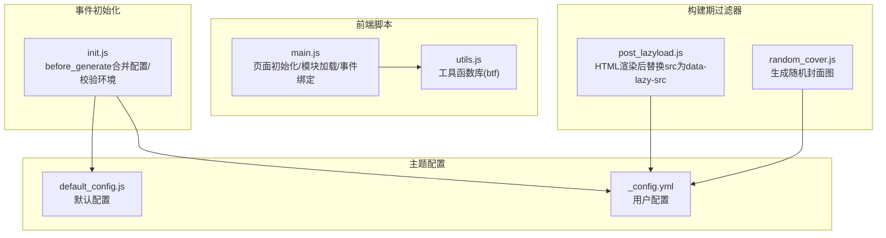
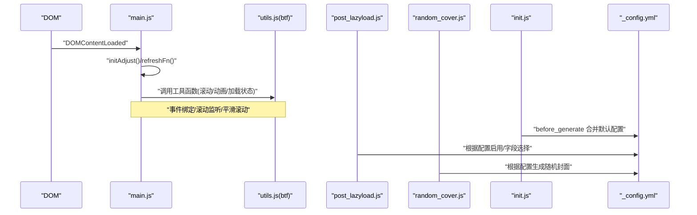
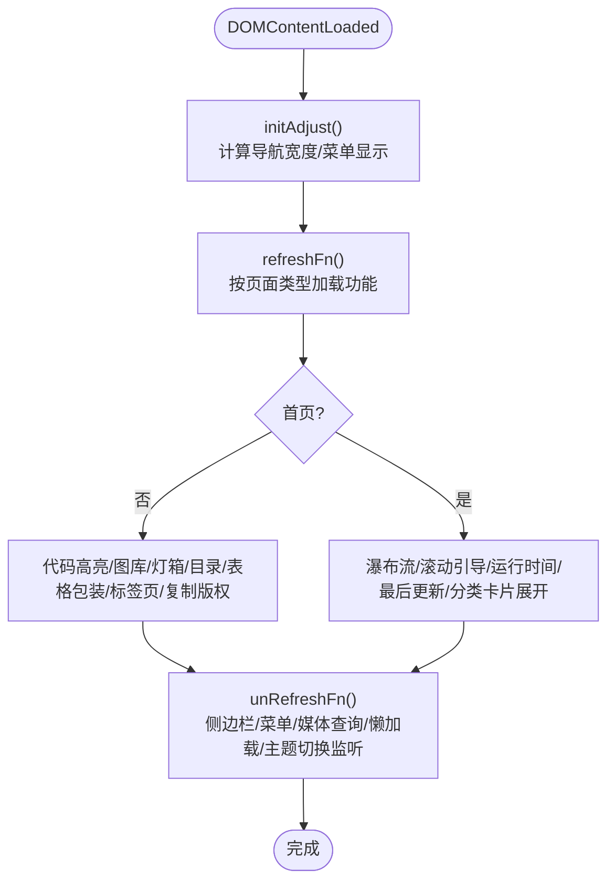
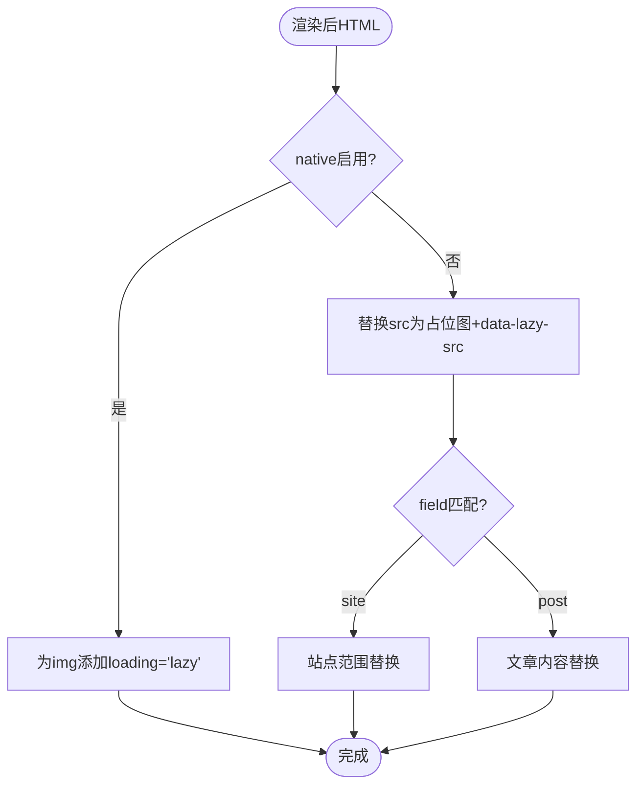
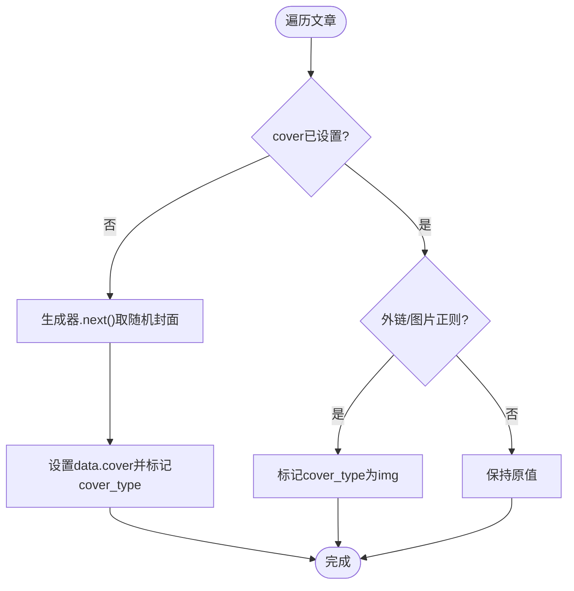
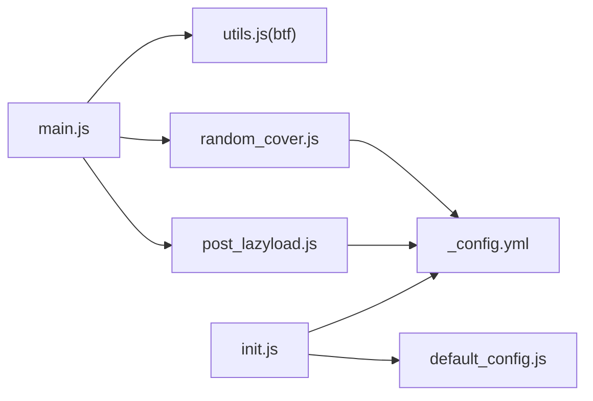

# 主脚本功能

<cite>
**本文引用的文件**
- [main.js](file://themes/butterfly/source/js/main.js)
- [utils.js](file://themes/butterfly/source/js/utils.js)
- [post_lazyload.js](file://themes/butterfly/scripts/filters/post_lazyload.js)
- [random_cover.js](file://themes/butterfly/scripts/filters/random_cover.js)
- [init.js](file://themes/butterfly/scripts/events/init.js)
- [default_config.js](file://themes/butterfly/scripts/common/default_config.js)
- [_config.yml](file://themes/butterfly/_config.yml)
</cite>

## 目录
1. [简介](#简介)
2. [项目结构](#项目结构)
3. [核心组件](#核心组件)
4. [架构总览](#架构总览)
5. [详细组件分析](#详细组件分析)
6. [依赖关系分析](#依赖关系分析)
7. [性能考量](#性能考量)
8. [故障排查指南](#故障排查指南)
9. [结论](#结论)
10. [附录](#附录)

## 简介
本文件面向Butterfly主题的主脚本（main.js）进行系统化技术文档梳理，重点覆盖以下方面：
- 页面初始化流程与模块化加载策略
- 功能模块的职责划分与事件绑定机制
- 图片懒加载过滤器的工作原理与配置项
- 随机封面图生成机制与主题配置联动
- 前端模块化架构（工具函数、事件处理、滚动与交互）
- 扩展方法与自定义开发指南
- 浏览器兼容性说明与最佳实践

## 项目结构
Butterfly主题前端脚本位于themes/butterfly/source/js目录，核心入口为main.js，配套工具函数在utils.js中集中实现；构建期的图片懒加载与随机封面图由scripts/filters下的过滤器完成；主题默认配置在scripts/common/default_config.js与主题配置文件_config.yml中定义；事件初始化逻辑在scripts/events/init.js中。

图表来源
- [main.js:1-988](file://themes/butterfly/source/js/main.js#L1-L988)
- [utils.js:1-339](file://themes/butterfly/source/js/utils.js#L1-L339)
- [post_lazyload.js:1-41](file://themes/butterfly/scripts/filters/post_lazyload.js#L1-L41)
- [random_cover.js:1-91](file://themes/butterfly/scripts/filters/random_cover.js#L1-L91)
- [init.js:1-87](file://themes/butterfly/scripts/events/init.js#L1-L87)
- [default_config.js:1-602](file://themes/butterfly/scripts/common/default_config.js#L1-L602)
- [_config.yml:1-1140](file://themes/butterfly/_config.yml#L1-L1140)

章节来源
- [main.js:1-988](file://themes/butterfly/source/js/main.js#L1-L988)
- [utils.js:1-339](file://themes/butterfly/source/js/utils.js#L1-L339)
- [post_lazyload.js:1-41](file://themes/butterfly/scripts/filters/post_lazyload.js#L1-L41)
- [random_cover.js:1-91](file://themes/butterfly/scripts/filters/random_cover.js#L1-L91)
- [init.js:1-87](file://themes/butterfly/scripts/events/init.js#L1-L87)
- [default_config.js:1-602](file://themes/butterfly/scripts/common/default_config.js#L1-L602)
- [_config.yml:1-1140](file://themes/butterfly/_config.yml#L1-L1140)

## 核心组件
- 页面初始化与刷新：DOMContentLoaded触发后执行初始化与刷新流程，分别负责首页与文章页的不同功能集合。
- 功能模块：导航栏自适应、侧边栏、滚动行为、TOC锚点、代码高亮工具、相册网格、图片灯箱、复制版权、运行时间与最后更新等。
- 工具函数库（btf）：防抖/节流、滚动动画、平滑滚动、加载状态、轻提示、图片缩放、历史URL更新、滚动百分比计算、事件绑定与清理等。
- 构建期过滤器：图片懒加载替换、随机封面图生成。
- 配置系统：默认配置与用户配置合并，主题配置项覆盖默认值。

章节来源
- [main.js:1-988](file://themes/butterfly/source/js/main.js#L1-L988)
- [utils.js:1-339](file://themes/butterfly/source/js/utils.js#L1-L339)
- [post_lazyload.js:1-41](file://themes/butterfly/scripts/filters/post_lazyload.js#L1-L41)
- [random_cover.js:1-91](file://themes/butterfly/scripts/filters/random_cover.js#L1-L91)
- [init.js:1-87](file://themes/butterfly/scripts/events/init.js#L1-L87)
- [default_config.js:1-602](file://themes/butterfly/scripts/common/default_config.js#L1-L602)
- [_config.yml:1-1140](file://themes/butterfly/_config.yml#L1-L1140)

## 架构总览
整体采用“构建期过滤器 + 运行时主脚本 + 工具函数库”的分层架构：
- 构建期：通过过滤器对HTML进行二次加工（懒加载属性替换、随机封面注入），减少运行时开销。
- 运行时：主脚本负责DOM就绪后的模块初始化、事件绑定、交互增强与动态功能挂载。
- 工具函数：提供跨模块复用的通用能力，避免重复实现。

图表来源
- [main.js:1-988](file://themes/butterfly/source/js/main.js#L1-L988)
- [utils.js:1-339](file://themes/butterfly/source/js/utils.js#L1-L339)
- [post_lazyload.js:1-41](file://themes/butterfly/scripts/filters/post_lazyload.js#L1-L41)
- [random_cover.js:1-91](file://themes/butterfly/scripts/filters/random_cover.js#L1-L91)
- [init.js:1-87](file://themes/butterfly/scripts/events/init.js#L1-L87)
- [_config.yml:1-1140](file://themes/butterfly/_config.yml#L1-L1140)

## 详细组件分析

### 页面初始化与刷新流程
- 初始化阶段：计算导航宽度、控制菜单显示/隐藏、设置导航可见性类名、注册滚动事件。
- 刷新阶段：按页面类型（首页/文章页）加载不同功能集，如首页的瀑布流、滚动引导；文章页的代码高亮、图库、灯箱、目录与锚点、表格包裹、标签页切换等。
- 事件绑定：统一通过btf.addEventListenerPjax进行绑定，确保PJAX场景下事件正确清理与重建。

图表来源
- [main.js:1-988](file://themes/butterfly/source/js/main.js#L1-L988)

章节来源
- [main.js:1-988](file://themes/butterfly/source/js/main.js#L1-L988)

### 导航栏自适应与侧边栏
- 自适应逻辑：根据博客标题与菜单宽度计算，当窗口宽度或总宽度不足时隐藏菜单，保证移动端体验。
- 侧边栏：打开/关闭时添加/移除body溢出控制、遮罩动画、类名切换，移动端自动关闭。

章节来源
- [main.js:1-988](file://themes/butterfly/source/js/main.js#L1-L988)

### 滚动行为与右侧按钮
- 滚动方向检测：根据当前scrollTop与上次位置判断上下滚动，控制导航固定与右侧按钮显隐。
- 右侧百分比：可选显示滚动百分比，支持首页与文章页不同开关。
- 回到顶部：平滑滚动至顶部，考虑导航固定时的偏移。

章节来源
- [main.js:440-503](file://themes/butterfly/source/js/main.js#L440-L503)

### TOC与锚点
- 目录点击：点击目录项平滑滚动到对应标题，移动端自动关闭目录面板。
- 锚点更新：根据滚动位置更新URL哈希，支持自动更新与点击滚动两种模式。

章节来源
- [main.js:508-624](file://themes/butterfly/source/js/main.js#L508-L624)

### 代码高亮工具
- 功能：为代码块添加工具条（复制/语言标识/展开/全屏）、高度限制展开、Mac样式装饰。
- 适配：支持highlight.js与prismjs两种渲染方案，自动识别语言并插入工具条。
- 交互：复制按钮、展开按钮、全屏按钮的事件委托处理。

章节来源
- [main.js:57-242](file://themes/butterfly/source/js/main.js#L57-L242)

### 图库网格与灯箱
- JustifiedInfiniteGrid：按分组加载图片，支持“加载更多”按钮与首屏限制。
- 灯箱：支持mediumZoom与fancybox两种服务，自动为图片包裹链接并绑定事件。
- 相册延迟加载：首次进入视口时再加载图库，提升首屏性能。

章节来源
- [main.js:280-420](file://themes/butterfly/source/js/main.js#L280-L420)
- [utils.js:172-258](file://themes/butterfly/source/js/utils.js#L172-L258)

### 复制版权与运行时间
- 复制版权：在复制文本超过阈值时附加作者、链接、来源等信息。
- 运行时间与最后更新：计算站点运行天数与文章最后更新时间，支持相对/绝对日期显示。

章节来源
- [main.js:755-795](file://themes/butterfly/source/js/main.js#L755-L795)
- [utils.js:84-103](file://themes/butterfly/source/js/utils.js#L84-L103)

### 工具函数库（btf）
- 防抖/节流：debounce/throttle，用于滚动/窗口尺寸变化等高频事件。
- 滚动动画：animateIn/animateOut，过渡动画封装。
- 平滑滚动：scrollToDest，兼容scroll-behavior与requestAnimationFrame降级。
- 加载状态：setLoading，插入/移除加载指示器。
- 图片缩放：loadLightbox，支持mediumZoom与fancybox。
- 历史更新：updateAnchor，使用history.replaceState更新锚点。
- 滚动百分比：getScrollPercent，计算滚动进度百分比。
- 事件绑定：addEventListenerPjax，PJAX场景下自动解绑旧事件。

章节来源
- [utils.js:1-339](file://themes/butterfly/source/js/utils.js#L1-L339)

### 图片懒加载过滤器
- 工作原理：
  - 若启用原生懒加载，则在img标签上添加loading="lazy"属性。
  - 否则将src替换为占位图与data-lazy-src，运行时由LazyLoad实例接管加载。
- 配置项：
  - enable：是否启用
  - native：是否使用原生懒加载
  - field：应用范围（site/post）
  - placeholder：占位图URL或base64
  - blur：占位图模糊效果（由主题CSS配合）
- 触发时机：after_render:html（站点范围）与after_post_render（文章范围）

图表来源
- [post_lazyload.js:1-41](file://themes/butterfly/scripts/filters/post_lazyload.js#L1-L41)
- [_config.yml:1014-1024](file://themes/butterfly/_config.yml#L1014-L1024)

章节来源
- [post_lazyload.js:1-41](file://themes/butterfly/scripts/filters/post_lazyload.js#L1-L41)
- [_config.yml:1014-1024](file://themes/butterfly/_config.yml#L1014-L1024)

### 随机封面图生成
- 生成策略：
  - 使用生成器函数维护一个“最近未出现索引”的历史队列，避免连续重复。
  - 支持单值、数组、禁用三种模式，默认封面为空时回退到固定值。
- 数据来源：
  - 从主题配置的default_cover读取封面列表。
  - 当post_asset_folder启用时，自动为相对路径的图片补全路径。
- 注入逻辑：
  - 在文章数据上设置cover_type（img/非img），便于模板渲染时区分展示方式。

图表来源
- [random_cover.js:1-91](file://themes/butterfly/scripts/filters/random_cover.js#L1-L91)
- [_config.yml:98-106](file://themes/butterfly/_config.yml#L98-L106)

章节来源
- [random_cover.js:1-91](file://themes/butterfly/scripts/filters/random_cover.js#L1-L91)
- [_config.yml:98-106](file://themes/butterfly/_config.yml#L98-L106)

### 事件初始化与配置合并
- 环境检查：要求Hexo版本≥5.3，禁止使用已弃用的配置文件格式。
- 默认配置：缓存默认配置，避免重复读取。
- 用户配置合并：deepMerge默认配置与用户配置，确保用户项优先。
- 评论系统处理：规范化comments.use数组，避免冲突。

章节来源
- [init.js:1-87](file://themes/butterfly/scripts/events/init.js#L1-L87)
- [default_config.js:1-602](file://themes/butterfly/scripts/common/default_config.js#L1-L602)
- [_config.yml:1-1140](file://themes/butterfly/_config.yml#L1-L1140)

## 依赖关系分析
- 主脚本依赖工具函数库（btf）提供的通用能力，降低重复实现。
- 构建期过滤器与主题配置强耦合，配置项直接影响运行时行为。
- PJAX场景下，所有事件均通过addEventListenerPjax绑定并在pjaxSendOnce时解绑，避免内存泄漏。

图表来源
- [main.js:1-988](file://themes/butterfly/source/js/main.js#L1-L988)
- [utils.js:1-339](file://themes/butterfly/source/js/utils.js#L1-L339)
- [post_lazyload.js:1-41](file://themes/butterfly/scripts/filters/post_lazyload.js#L1-L41)
- [random_cover.js:1-91](file://themes/butterfly/scripts/filters/random_cover.js#L1-L91)
- [init.js:1-87](file://themes/butterfly/scripts/events/init.js#L1-L87)
- [default_config.js:1-602](file://themes/butterfly/scripts/common/default_config.js#L1-L602)
- [_config.yml:1-1140](file://themes/butterfly/_config.yml#L1-L1140)

章节来源
- [main.js:1-988](file://themes/butterfly/source/js/main.js#L1-L988)
- [utils.js:1-339](file://themes/butterfly/source/js/utils.js#L1-L339)
- [post_lazyload.js:1-41](file://themes/butterfly/scripts/filters/post_lazyload.js#L1-L41)
- [random_cover.js:1-91](file://themes/butterfly/scripts/filters/random_cover.js#L1-L91)
- [init.js:1-87](file://themes/butterfly/scripts/events/init.js#L1-L87)
- [default_config.js:1-602](file://themes/butterfly/scripts/common/default_config.js#L1-L602)
- [_config.yml:1-1140](file://themes/butterfly/_config.yml#L1-L1140)

## 性能考量
- 懒加载：构建期替换src为data-lazy-src，运行时由LazyLoad接管，减少首屏资源压力。
- 防抖/节流：滚动、窗口尺寸变化等高频事件使用throttle/debounce，降低重绘频率。
- 惰性加载：图库与灯箱仅在需要时加载，结合IntersectionObserver优化加载时机。
- 事件清理：PJAX场景下统一解绑旧事件，避免重复绑定导致的性能问题。
- CSS/JS按需：主题配置项控制功能开关，减少不必要的脚本与样式加载。

[本节为通用性能建议，无需特定文件引用]

## 故障排查指南
- 图片不懒加载
  - 检查主题配置lazyload.enable/native/field是否正确开启。
  - 确认构建期过滤器是否生效（查看渲染后HTML中是否包含data-lazy-src或loading属性）。
- 随机封面未生效
  - 检查主题配置default_cover是否设置，post_asset_folder启用时注意相对路径补全。
  - 查看文章数据中cover_type是否被标记为img。
- 目录/锚点异常
  - 确认文章标题层级与ID是否存在，滚动事件是否正常绑定。
- 灯箱不工作
  - 检查主题配置lightbox选择（medium_zoom/fancybox），确认对应脚本已加载。
- PJAX后事件失效
  - 确保使用addEventListenerPjax绑定事件，避免直接addEventListener。

章节来源
- [post_lazyload.js:1-41](file://themes/butterfly/scripts/filters/post_lazyload.js#L1-L41)
- [random_cover.js:1-91](file://themes/butterfly/scripts/filters/random_cover.js#L1-L91)
- [main.js:1-988](file://themes/butterfly/source/js/main.js#L1-L988)
- [utils.js:1-339](file://themes/butterfly/source/js/utils.js#L1-L339)

## 结论
Butterfly主题主脚本以模块化设计为核心，结合构建期过滤器与工具函数库，实现了高性能、可扩展的前端交互体验。通过合理的事件绑定与清理策略，确保在PJAX场景下的稳定性；通过懒加载与惰性加载策略，有效降低首屏成本。主题配置与过滤器的紧密协作，使得图片懒加载与随机封面等功能具备良好的可配置性与可维护性。

[本节为总结性内容，无需特定文件引用]

## 附录

### 主要配置项速览（与主脚本相关）
- 懒加载：lazyload.enable/native/field/placeholder/blur
- 灯箱：lightbox
- 代码高亮：code_blocks.theme/macStyle/height_limit/copy/language/shrink/fullpage
- 目录：toc.post/page/number/expand/style_simple/scroll_percent
- 右侧按钮：rightside_scroll_percent/rightside_item_order/rightside_config_animation
- 评论系统：comments.use/lazyload/count/card_post_count
- 其他：pjax.enable/exclude、snackbar.enable/position/bg_light/bg_dark、translate.enable/default/defaultEncoding等

章节来源
- [_config.yml:1014-1024](file://themes/butterfly/_config.yml#L1014-L1024)
- [_config.yml:911-916](file://themes/butterfly/_config.yml#L911-L916)
- [_config.yml:194-201](file://themes/butterfly/_config.yml#L194-L201)
- [_config.yml:396-410](file://themes/butterfly/_config.yml#L396-L410)
- [_config.yml:532-547](file://themes/butterfly/_config.yml#L532-L547)
- [_config.yml:989-993](file://themes/butterfly/_config.yml#L989-L993)
- [_config.yml:1000-1008](file://themes/butterfly/_config.yml#L1000-L1008)
- [_config.yml:366-377](file://themes/butterfly/_config.yml#L366-L377)

### 浏览器兼容性说明
- 平滑滚动：优先使用scroll-behavior，不支持时回退到requestAnimationFrame动画。
- IntersectionObserver：用于懒加载与评论区加载，不支持时直接回调加载。
- Promise/fetch：构建期过滤器使用fetch，运行时图片懒加载依赖LazyLoad。
- 事件模型：统一使用addEventListener，兼容现代浏览器。

章节来源
- [utils.js:119-142](file://themes/butterfly/source/js/utils.js#L119-L142)
- [utils.js:105-117](file://themes/butterfly/source/js/utils.js#L105-L117)
- [post_lazyload.js:1-41](file://themes/butterfly/scripts/filters/post_lazyload.js#L1-L41)
- [main.js:885-895](file://themes/butterfly/source/js/main.js#L885-L895)

### 扩展与自定义开发指南
- 新增功能模块
  - 在main.js中新增功能函数，按需调用（如addJustifiedGallery/runLightbox等）。
  - 使用btf.addEventListenerPjax绑定事件，确保PJAX场景下正确清理。
- 修改工具函数
  - 在utils.js中扩展btf对象，提供跨模块复用能力。
- 构建期扩展
  - 新增过滤器：参考post_lazyload.js与random_cover.js的注册方式，在after_render或generator阶段处理。
  - 合并配置：在init.js中处理新配置项，确保与默认配置一致。
- 主题配置
  - 在_config.yml中新增配置项，或在default_config.js中补充默认值，保持一致性。

章节来源
- [main.js:1-988](file://themes/butterfly/source/js/main.js#L1-L988)
- [utils.js:1-339](file://themes/butterfly/source/js/utils.js#L1-L339)
- [post_lazyload.js:1-41](file://themes/butterfly/scripts/filters/post_lazyload.js#L1-L41)
- [random_cover.js:1-91](file://themes/butterfly/scripts/filters/random_cover.js#L1-L91)
- [init.js:1-87](file://themes/butterfly/scripts/events/init.js#L1-L87)
- [default_config.js:1-602](file://themes/butterfly/scripts/common/default_config.js#L1-L602)
- [_config.yml:1-1140](file://themes/butterfly/_config.yml#L1-L1140)