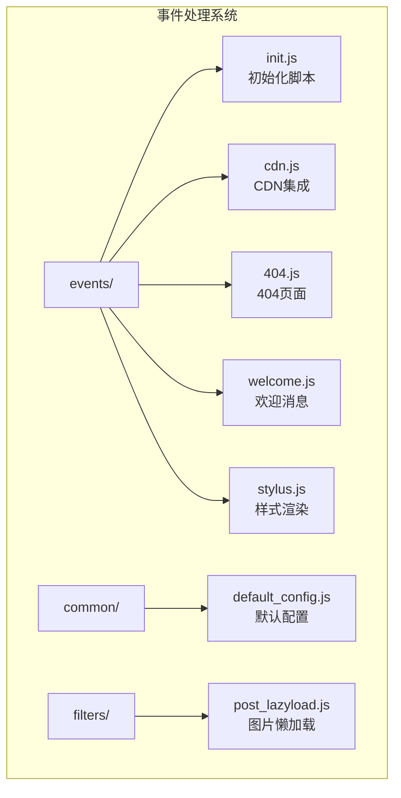
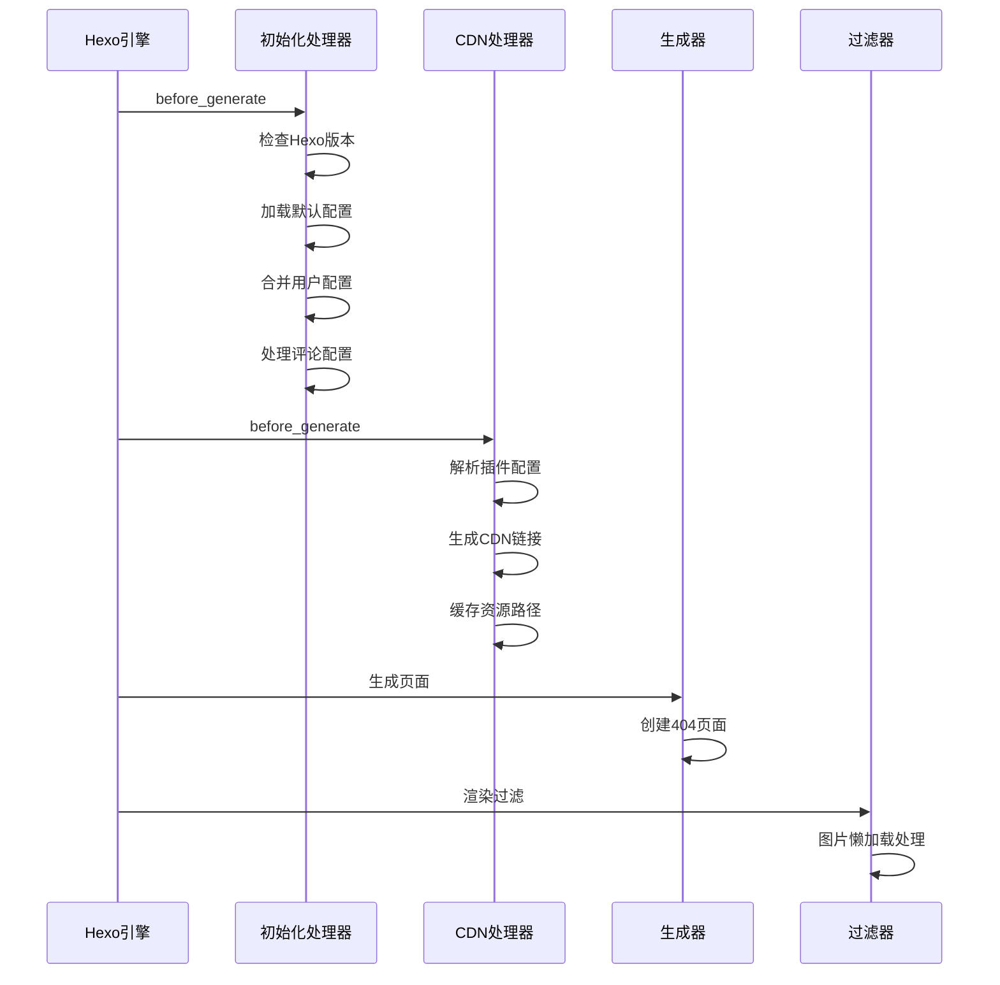
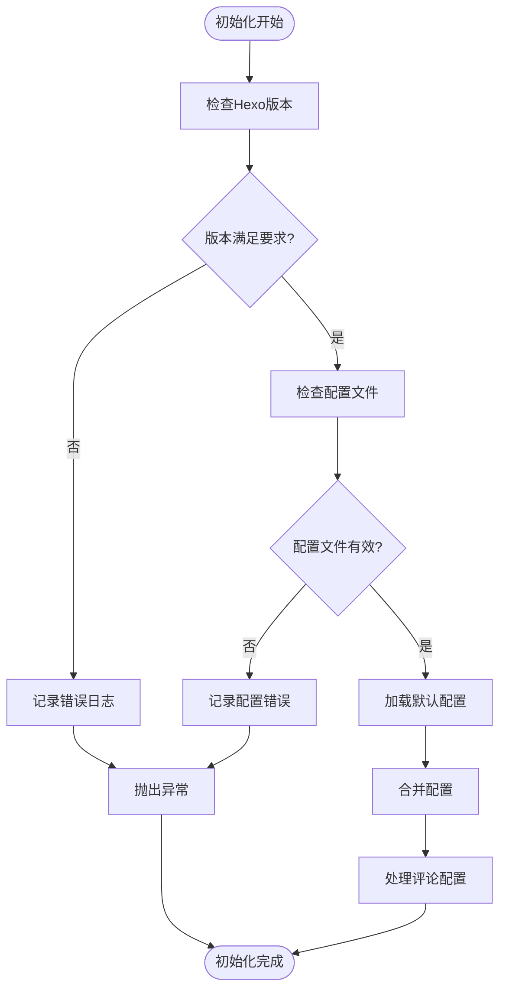
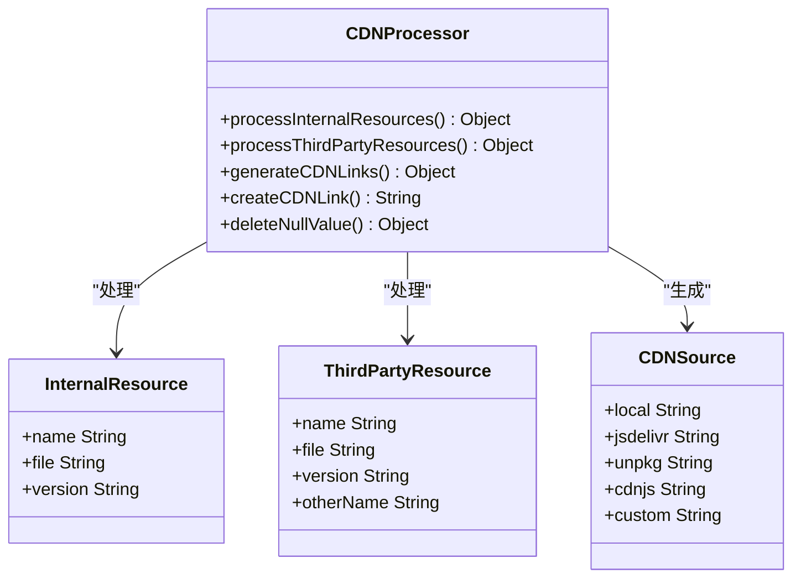
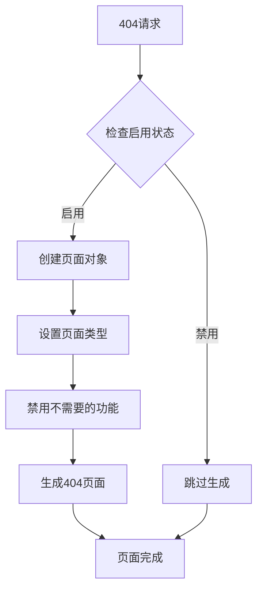
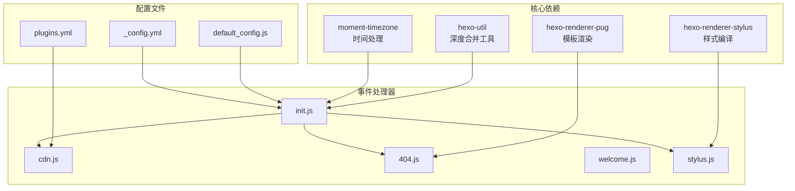

# 事件处理机制

<cite>
**本文档引用的文件**
- [init.js](file://themes/butterfly/scripts/events/init.js)
- [cdn.js](file://themes/butterfly/scripts/events/cdn.js)
- [404.js](file://themes/butterfly/scripts/events/404.js)
- [welcome.js](file://themes/butterfly/scripts/events/welcome.js)
- [stylus.js](file://themes/butterfly/scripts/events/stylus.js)
- [default_config.js](file://themes/butterfly/scripts/common/default_config.js)
- [default_config.yml](file://themes/butterfly/_config.yml)
- [plugins.yml](file://themes/butterfly/plugins.yml)
- [package.json](file://themes/butterfly/package.json)
- [post_lazyload.js](file://themes/butterfly/scripts/filters/post_lazyload.js)
</cite>

## 目录
1. [简介](#简介)
2. [项目结构](#项目结构)
3. [核心组件](#核心组件)
4. [架构概览](#架构概览)
5. [详细组件分析](#详细组件分析)
6. [依赖关系分析](#依赖关系分析)
7. [性能考虑](#性能考虑)
8. [故障排除指南](#故障排除指南)
9. [结论](#结论)

## 简介

Butterfly主题的事件处理系统是基于Hexo框架的生命周期钩子构建的，通过注册各种过滤器和生成器来实现主题功能的初始化、配置管理和资源优化。该系统涵盖了从Hexo启动到站点生成的完整生命周期，包括版本检查、配置合并、CDN集成、404页面处理和欢迎消息显示等功能。

## 项目结构

Butterfly主题的事件处理系统主要位于`themes/butterfly/scripts/events/`目录下，采用模块化设计，每个事件处理器负责特定的功能领域：

**图表来源**
- [init.js:1-87](file://themes/butterfly/scripts/events/init.js#L1-L87)
- [cdn.js:1-96](file://themes/butterfly/scripts/events/cdn.js#L1-L96)
- [404.js:1-21](file://themes/butterfly/scripts/events/404.js#L1-L21)

**章节来源**
- [init.js:1-87](file://themes/butterfly/scripts/events/init.js#L1-L87)
- [cdn.js:1-96](file://themes/butterfly/scripts/events/cdn.js#L1-L96)
- [404.js:1-21](file://themes/butterfly/scripts/events/404.js#L1-L21)
- [welcome.js:1-14](file://themes/butterfly/scripts/events/welcome.js#L1-L14)

## 核心组件

Butterfly主题事件处理系统由以下核心组件构成：

### 1. 初始化处理器 (init.js)
负责Hexo环境检查、配置文件验证和默认配置合并，确保主题在正确的环境中运行。

### 2. CDN集成处理器 (cdn.js)
管理静态资源的CDN替换逻辑，支持多种CDN提供商和自定义格式化选项。

### 3. 错误页面处理器 (404.js)
处理404错误页面的生成，提供可配置的错误页面功能。

### 4. 欢迎消息处理器 (welcome.js)
在Hexo启动时显示主题版本信息和欢迎消息。

### 5. 样式渲染处理器 (stylus.js)
处理Stylus样式的渲染，传递配置变量到CSS编译过程。

**章节来源**
- [init.js:7-32](file://themes/butterfly/scripts/events/init.js#L7-L32)
- [cdn.js:11-95](file://themes/butterfly/scripts/events/cdn.js#L11-L95)
- [404.js:8-20](file://themes/butterfly/scripts/events/404.js#L8-L20)
- [welcome.js:1-13](file://themes/butterfly/scripts/events/welcome.js#L1-L13)
- [stylus.js:7-24](file://themes/butterfly/scripts/events/stylus.js#L7-L24)

## 架构概览

Butterfly主题的事件处理系统遵循Hexo的生命周期模式，通过注册不同类型的钩子来实现功能扩展：

**图表来源**
- [init.js:79-86](file://themes/butterfly/scripts/events/init.js#L79-L86)
- [cdn.js:11-95](file://themes/butterfly/scripts/events/cdn.js#L11-L95)
- [404.js:8-20](file://themes/butterfly/scripts/events/404.js#L8-L20)
- [post_lazyload.js:29-40](file://themes/butterfly/scripts/filters/post_lazyload.js#L29-L40)

## 详细组件分析

### 初始化处理器 (init.js)

初始化处理器是整个事件处理系统的核心，负责确保主题在正确的环境中运行：

#### 版本检查机制
处理器会检查当前Hexo版本是否满足最低要求（5.3.0及以上），并验证配置文件的兼容性。

#### 配置文件验证
- 检测已弃用的配置文件格式（butterfly.yml）
- 提供向后兼容的迁移指导
- 记录详细的错误日志

#### 默认配置合并
使用深度合并策略将默认配置与用户配置合并，确保所有配置项都有合理的默认值。

**图表来源**
- [init.js:10-32](file://themes/butterfly/scripts/events/init.js#L10-L32)
- [init.js:79-86](file://themes/butterfly/scripts/events/init.js#L79-L86)

**章节来源**
- [init.js:10-32](file://themes/butterfly/scripts/events/init.js#L10-L32)
- [init.js:37-45](file://themes/butterfly/scripts/events/init.js#L37-L45)
- [init.js:50-77](file://themes/butterfly/scripts/events/init.js#L50-L77)
- [init.js:79-86](file://themes/butterfly/scripts/events/init.js#L79-L86)

### CDN集成处理器 (cdn.js)

CDN集成处理器提供了灵活的静态资源管理功能：

#### 插件配置解析
处理器会读取`plugins.yml`文件，解析第三方插件的CDN配置信息。

#### 内部资源管理
管理主题内部的JavaScript和CSS文件，包括：
- 主要脚本文件：main.js, utils.js, tw_cn.js
- 搜索功能：本地搜索和Algolia搜索
- 其他内置资源

#### CDN提供商支持
支持多种CDN提供商：
- **JsDelivr**: 默认CDN提供商
- **Unpkg**: npm包分发服务
- **CDNJS**: JavaScript库CDN
- **Local**: 本地资源
- **Custom**: 自定义格式化

**图表来源**
- [cdn.js:15-42](file://themes/butterfly/scripts/events/cdn.js#L15-L42)
- [cdn.js:48-79](file://themes/butterfly/scripts/events/cdn.js#L48-L79)

**章节来源**
- [cdn.js:11-95](file://themes/butterfly/scripts/events/cdn.js#L11-L95)
- [plugins.yml:1-208](file://themes/butterfly/plugins.yml#L1-L208)

### 404页面处理器 (404.js)

404页面处理器提供了可配置的错误页面功能：

#### 条件生成
只有当`error_404.enable`设置为true时才会生成404页面。

#### 页面数据配置
为404页面设置特定的数据：
- 类型标识：`type: '404'`
- 禁用顶部图片：`top_img: false`
- 禁用评论系统：`comments: false`
- 禁用侧边栏：`aside: false`

**图表来源**
- [404.js:8-20](file://themes/butterfly/scripts/events/404.js#L8-L20)

**章节来源**
- [404.js:8-20](file://themes/butterfly/scripts/events/404.js#L8-L20)
- [default_config.yml:112-117](file://themes/butterfly/_config.yml#L112-L117)

### 欢迎消息处理器 (welcome.js)

欢迎消息处理器在Hexo启动时显示主题信息：

#### 启动事件监听
使用`hexo.on('ready')`事件监听器，在Hexo完全启动后执行。

#### 版本信息显示
显示当前主题版本号，使用ASCII艺术字体美化输出格式。

**章节来源**
- [welcome.js:1-13](file://themes/butterfly/scripts/events/welcome.js#L1-L13)
- [package.json](file://themes/butterfly/package.json#L3)

### 样式渲染处理器 (stylus.js)

样式渲染处理器负责将配置信息传递给Stylus编译器：

#### 高亮配置传递
将代码高亮相关的配置传递到CSS编译过程中：
- 是否启用高亮显示
- 是否显示行号
- 当前语言设置

#### 版本兼容性
处理Hexo 7.0+的语法高亮器变更，自动适配新的配置结构。

**章节来源**
- [stylus.js:7-24](file://themes/butterfly/scripts/events/stylus.js#L7-L24)

## 依赖关系分析

Butterfly主题事件处理系统具有清晰的依赖关系：

**图表来源**
- [package.json:25-30](file://themes/butterfly/package.json#L25-L30)
- [init.js](file://themes/butterfly/scripts/events/init.js#L1)
- [cdn.js](file://themes/butterfly/scripts/events/cdn.js#L8)
- [default_config.js:1-602](file://themes/butterfly/scripts/common/default_config.js#L1-L602)

**章节来源**
- [package.json:25-30](file://themes/butterfly/package.json#L25-L30)
- [default_config.js:1-602](file://themes/butterfly/scripts/common/default_config.js#L1-L602)
- [plugins.yml:1-208](file://themes/butterfly/plugins.yml#L1-L208)

## 性能考虑

Butterfly主题事件处理系统在设计时充分考虑了性能优化：

### 缓存策略
- **默认配置缓存**: 使用内存缓存避免重复读取配置文件
- **CDN链接缓存**: 生成的CDN链接会被缓存在`themeConfig.asset`中

### 异步处理
- 使用异步文件读取避免阻塞主线程
- 合理的错误处理机制防止单点故障

### 资源优化
- CDN集成减少带宽消耗
- 按需加载配置避免不必要的计算

## 故障排除指南

### 常见问题及解决方案

#### Hexo版本不兼容
**问题**: 启动时报错提示需要更新Hexo版本
**解决方案**: 将Hexo升级到5.3.0或更高版本

#### 配置文件格式错误
**问题**: 报告butterfly.yml已弃用
**解决方案**: 迁移到_config.butterfly.yml格式

#### CDN资源加载失败
**问题**: 静态资源无法从CDN加载
**解决方案**: 
1. 检查网络连接
2. 切换到其他CDN提供商
3. 使用本地资源模式

#### 404页面未显示
**问题**: 访问不存在页面时没有404页面
**解决方案**: 确保`error_404.enable`设置为true

**章节来源**
- [init.js:17-31](file://themes/butterfly/scripts/events/init.js#L17-L31)
- [cdn.js:11-95](file://themes/butterfly/scripts/events/cdn.js#L11-L95)
- [404.js:8-20](file://themes/butterfly/scripts/events/404.js#L8-L20)

## 结论

Butterfly主题的事件处理系统通过精心设计的模块化架构，实现了完整的Hexo生命周期管理。系统不仅提供了基础的初始化、配置管理和资源优化功能，还具备良好的扩展性和维护性。

### 主要优势
1. **模块化设计**: 每个事件处理器职责单一，便于维护和测试
2. **配置灵活性**: 支持多种CDN提供商和自定义配置
3. **错误处理**: 完善的错误检测和日志记录机制
4. **性能优化**: 合理的缓存策略和异步处理

### 扩展建议
开发者可以通过以下方式扩展事件处理系统：
1. 添加新的过滤器处理器
2. 实现自定义的生成器
3. 开发特定场景的事件监听器
4. 集成新的CDN提供商

该系统为Butterfly主题提供了稳定可靠的基础架构，确保了主题功能的完整性和用户体验的一致性。