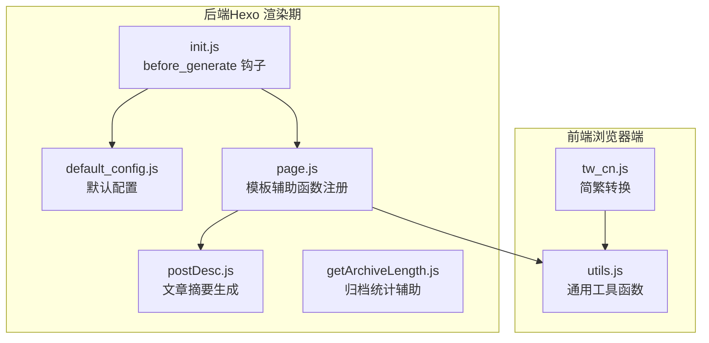
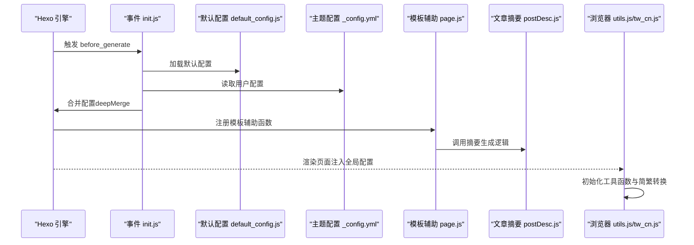
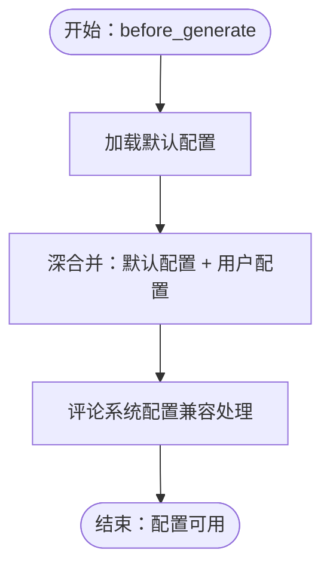
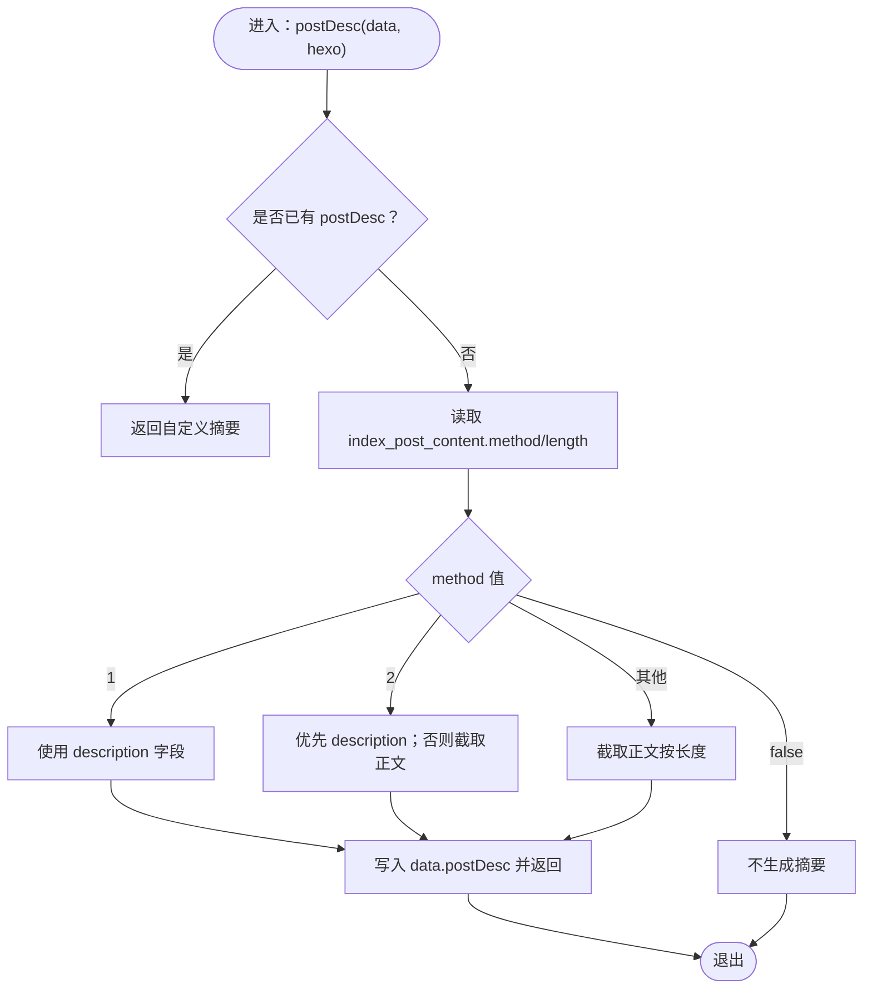
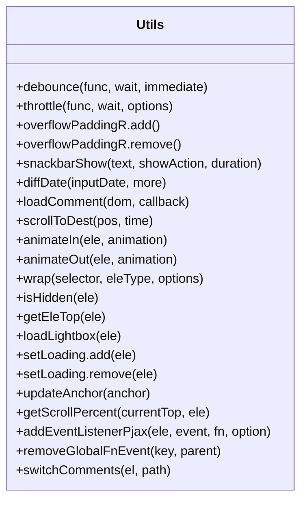
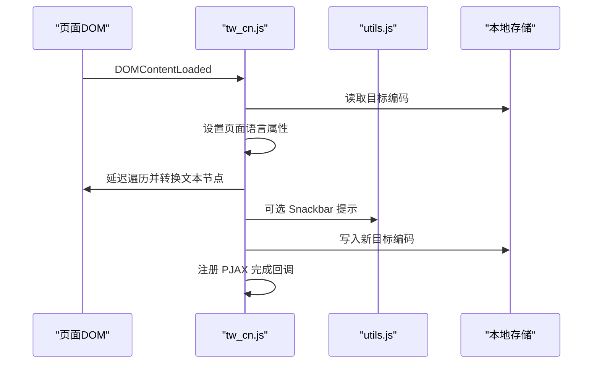
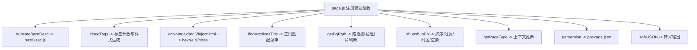
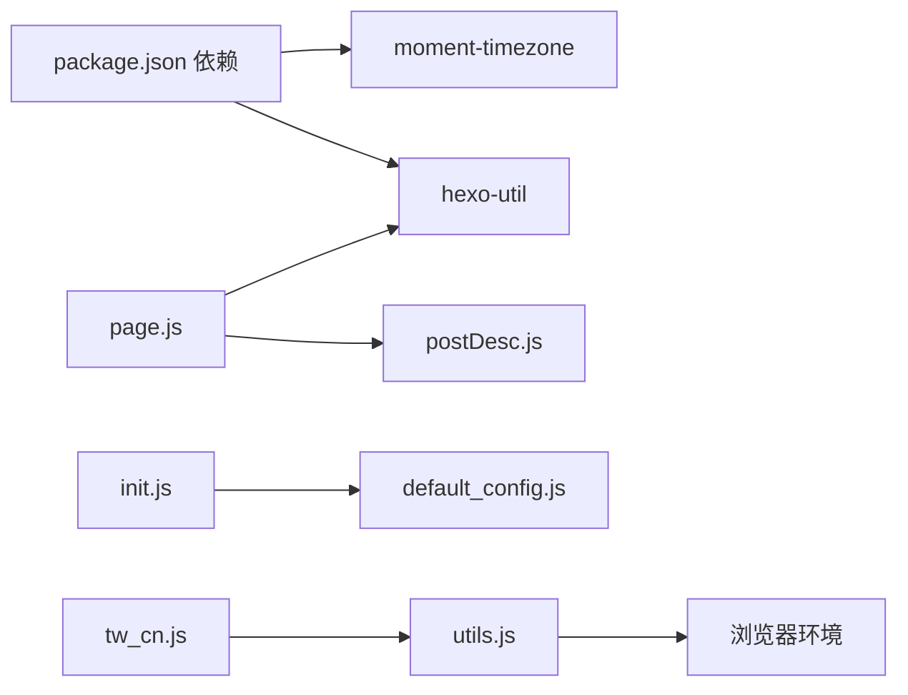

# 工具函数库

<cite>
**本文引用的文件**
- [default_config.js](file://themes/butterfly/scripts/common/default_config.js)
- [postDesc.js](file://themes/butterfly/scripts/common/postDesc.js)
- [utils.js](file://themes/butterfly/source/js/utils.js)
- [tw_cn.js](file://themes/butterfly/source/js/tw_cn.js)
- [_config.yml](file://themes/butterfly/_config.yml)
- [page.js](file://themes/butterfly/scripts/helpers/page.js)
- [getArchiveLength.js](file://themes/butterfly/scripts/helpers/getArchiveLength.js)
- [init.js](file://themes/butterfly/scripts/events/init.js)
- [package.json](file://themes/butterfly/package.json)
</cite>

## 目录
1. [简介](#简介)
2. [项目结构](#项目结构)
3. [核心组件](#核心组件)
4. [架构总览](#架构总览)
5. [详细组件分析](#详细组件分析)
6. [依赖关系分析](#依赖关系分析)
7. [性能考量](#性能考量)
8. [故障排查指南](#故障排查指南)
9. [结论](#结论)
10. [附录：自定义工具函数开发指南](#附录自定义工具函数开发指南)

## 简介
本文件面向Butterfly主题的工具函数库，系统梳理通用配置管理与文章描述处理两大机制，覆盖配置合并、字符串处理、日期格式化、简繁转换等能力，并给出调用方式、扩展方法、最佳实践与性能优化建议。读者可据此快速定位实现位置、理解运行流程并安全地进行二次开发。

## 项目结构
工具函数库主要分布在以下位置：
- 后端（Hexo渲染期）：scripts/common（默认配置与文章摘要生成）、scripts/helpers（模板辅助函数）、scripts/events（初始化与配置合并）
- 前端（浏览器端）：source/js（通用工具与简繁转换）

**图表来源**
- [default_config.js:1-602](file://themes/butterfly/scripts/common/default_config.js#L1-L602)
- [postDesc.js:1-38](file://themes/butterfly/scripts/common/postDesc.js#L1-L38)
- [page.js:1-194](file://themes/butterfly/scripts/helpers/page.js#L1-L194)
- [getArchiveLength.js:1-47](file://themes/butterfly/scripts/helpers/getArchiveLength.js#L1-L47)
- [init.js:1-87](file://themes/butterfly/scripts/events/init.js#L1-L87)
- [utils.js:1-339](file://themes/butterfly/source/js/utils.js#L1-L339)
- [tw_cn.js:1-118](file://themes/butterfly/source/js/tw_cn.js#L1-L118)

**章节来源**
- [default_config.js:1-602](file://themes/butterfly/scripts/common/default_config.js#L1-L602)
- [postDesc.js:1-38](file://themes/butterfly/scripts/common/postDesc.js#L1-L38)
- [page.js:1-194](file://themes/butterfly/scripts/helpers/page.js#L1-L194)
- [getArchiveLength.js:1-47](file://themes/butterfly/scripts/helpers/getArchiveLength.js#L1-L47)
- [init.js:1-87](file://themes/butterfly/scripts/events/init.js#L1-L87)
- [utils.js:1-339](file://themes/butterfly/source/js/utils.js#L1-L339)
- [tw_cn.js:1-118](file://themes/butterfly/source/js/tw_cn.js#L1-L118)

## 核心组件
- 默认配置管理：在渲染前加载默认配置并与用户配置合并，确保主题行为一致且可预期。
- 文章描述处理：根据主题配置选择优先策略，生成或截取文章摘要，支持加密文章保护。
- 前端通用工具：防抖/节流、滚动与动画、图片灯箱、Snackbar提示、锚点更新、滚动百分比计算等。
- 简繁转换：基于字符映射表在DOM层面批量转换简繁文本，支持延迟与状态持久化。

**章节来源**
- [default_config.js:1-602](file://themes/butterfly/scripts/common/default_config.js#L1-L602)
- [postDesc.js:1-38](file://themes/butterfly/scripts/common/postDesc.js#L1-L38)
- [utils.js:1-339](file://themes/butterfly/source/js/utils.js#L1-L339)
- [tw_cn.js:1-118](file://themes/butterfly/source/js/tw_cn.js#L1-L118)

## 架构总览
配置与数据流的关键路径如下：

**图表来源**
- [init.js:79-86](file://themes/butterfly/scripts/events/init.js#L79-L86)
- [default_config.js:1-602](file://themes/butterfly/scripts/common/default_config.js#L1-L602)
- [_config.yml:1-1140](file://themes/butterfly/_config.yml#L1-L1140)
- [page.js:14-18](file://themes/butterfly/scripts/helpers/page.js#L14-L18)
- [postDesc.js:11-35](file://themes/butterfly/scripts/common/postDesc.js#L11-L35)
- [utils.js:1-339](file://themes/butterfly/source/js/utils.js#L1-L339)
- [tw_cn.js:1-118](file://themes/butterfly/source/js/tw_cn.js#L1-L118)

## 详细组件分析

### 组件A：默认配置管理与合并
- 职责
  - 提供主题全量默认配置字典，避免缺失字段导致的渲染异常。
  - 在渲染前通过事件钩子将默认配置与用户配置深度合并，保证用户配置优先。
- 关键点
  - 使用工具库提供的深合并函数执行合并。
  - 缓存默认配置以减少重复读取。
  - 对评论系统配置做兼容性处理（如Disqus与Disqusjs冲突去重）。
- 典型调用
  - 渲染前事件触发，随后模板辅助函数与页面逻辑读取合并后的配置。

**图表来源**
- [init.js:37-86](file://themes/butterfly/scripts/events/init.js#L37-L86)
- [default_config.js:1-602](file://themes/butterfly/scripts/common/default_config.js#L1-L602)

**章节来源**
- [init.js:1-87](file://themes/butterfly/scripts/events/init.js#L1-L87)
- [default_config.js:1-602](file://themes/butterfly/scripts/common/default_config.js#L1-L602)

### 组件B：文章描述处理（postDesc）
- 职责
  - 根据主题配置决定摘要来源与长度，支持直接使用已有description、截取正文或两者结合。
  - 对加密文章返回空串，避免泄露内容。
- 处理流程
  - 优先使用已存在的postDesc字段。
  - 读取主题配置中的摘要策略与长度。
  - 按策略选择或组合生成结果，并回填到data对象以便后续模板使用。

**图表来源**
- [postDesc.js:11-35](file://themes/butterfly/scripts/common/postDesc.js#L11-L35)
- [_config.yml:180-189](file://themes/butterfly/_config.yml#L180-L189)

**章节来源**
- [postDesc.js:1-38](file://themes/butterfly/scripts/common/postDesc.js#L1-L38)
- [_config.yml:180-189](file://themes/butterfly/_config.yml#L180-L189)

### 组件C：前端通用工具函数（utils.js）
- 分类与用途
  - 防抖与节流：debounce/throttle，用于高频事件（如滚动、窗口大小变化）降噪。
  - 滚动与动画：平滑滚动至目标位置、元素入场/出场动画。
  - DOM与布局：溢出右侧留白处理、元素包裹、可见性检测、获取元素顶部距离。
  - 图片灯箱：支持medium_zoom与fancybox两种方案，自动绑定与选项适配。
  - 加载与提示：插入/移除加载容器、Snackbar提示（根据主题色动态选择背景）。
  - 锚点与滚动进度：更新锚点、计算滚动百分比。
  - 事件绑定：与PJAX生命周期集成的事件绑定与解绑。
  - 切换评论：在切换按钮点击时加载其他评论系统。
- 性能要点
  - 使用requestAnimationFrame实现平滑滚动，避免主线程阻塞。
  - IntersectionObserver用于懒加载与延迟初始化，降低CPU占用。
  - 对频繁调用的计算采用闭包缓存（如滚动百分比内部缓存）。

**图表来源**
- [utils.js:1-339](file://themes/butterfly/source/js/utils.js#L1-L339)

**章节来源**
- [utils.js:1-339](file://themes/butterfly/source/js/utils.js#L1-L339)

### 组件D：简繁转换（tw_cn.js）
- 功能概述
  - 基于字符映射表在DOM节点上批量转换简繁文本，支持延迟与状态持久化。
  - 支持设置页面语言属性（zh-TW/zh-CN），并根据当前/目标编码动态更新按钮文案。
- 实现要点
  - 维护两个映射字符串（简->繁、繁->简），遍历DOM节点，跳过特定标签与输入类型。
  - 将转换结果写回对应节点的title/alt/placeholder/value/text。
  - 使用本地存储记录目标编码，支持PJAX页面切换后的初始化。
- 调用入口
  - 页面加载完成后初始化；可通过暴露的window.translateFn接口调用转换函数。

**图表来源**
- [tw_cn.js:1-118](file://themes/butterfly/source/js/tw_cn.js#L1-L118)
- [utils.js:71-82](file://themes/butterfly/source/js/utils.js#L71-L82)

**章节来源**
- [tw_cn.js:1-118](file://themes/butterfly/source/js/tw_cn.js#L1-L118)
- [_config.yml:365-378](file://themes/butterfly/_config.yml#L365-L378)

### 组件E：模板辅助函数（page.js）
- 注册的工具函数
  - 截取摘要：truncate（包装hexo-util的truncate）
  - 文章摘要：postDesc（调用postDesc.js）
  - 云标签：cloudTags（按标签数量生成字号与颜色样式）
  - URL规范化：urlNoIndex（去除默认index后缀）
  - MD5：md5（生成资源指纹）
  - 注入HTML：injectHtml（拼接数组为HTML）
  - 归档标题：findArchivesTitle（根据菜单匹配归档标题）
  - 背景路径解析：getBgPath（颜色/绝对/相对/简单文件判断）
  - 说说处理：shuoshuoFN（时间排序、限制数量/时间、时区修正、Markdown渲染）
  - 页面类型：getPageType（根据page上下文推断）
  - 版本信息：getVersion（返回Hexo与主题版本）
  - 安全JSON：safeJSON（转义特殊字符）
- 与工具函数的关系
  - 截取与摘要由postDesc.js提供；云标签样式由utils.js中的颜色生成逻辑配合使用。
  - URL与MD5等工具直接依赖hexo-util与node内置模块。

**图表来源**
- [page.js:14-194](file://themes/butterfly/scripts/helpers/page.js#L14-L194)
- [postDesc.js:1-38](file://themes/butterfly/scripts/common/postDesc.js#L1-L38)
- [package.json:1-35](file://themes/butterfly/package.json#L1-L35)

**章节来源**
- [page.js:1-194](file://themes/butterfly/scripts/helpers/page.js#L1-L194)
- [postDesc.js:1-38](file://themes/butterfly/scripts/common/postDesc.js#L1-L38)
- [package.json:1-35](file://themes/butterfly/package.json#L1-L35)

## 依赖关系分析
- 运行时依赖
  - hexo-util：提供字符串处理、URL美化、深合并、截取等能力。
  - moment-timezone：用于时区修正与时序处理。
- 主题内部依赖
  - default_config.js被init.js在渲染前加载并合并。
  - page.js注册的辅助函数依赖postDesc.js与hexo-util。
  - tw_cn.js依赖utils.js中的Snackbar与本地存储封装。
- 版本要求
  - 要求Hexo版本不低于5.3.0，否则抛错并终止生成。

**图表来源**
- [package.json:25-29](file://themes/butterfly/package.json#L25-L29)
- [init.js:1-87](file://themes/butterfly/scripts/events/init.js#L1-L87)
- [page.js:1-194](file://themes/butterfly/scripts/helpers/page.js#L1-L194)
- [postDesc.js:1-38](file://themes/butterfly/scripts/common/postDesc.js#L1-L38)
- [utils.js:1-339](file://themes/butterfly/source/js/utils.js#L1-L339)
- [tw_cn.js:1-118](file://themes/butterfly/source/js/tw_cn.js#L1-L118)

**章节来源**
- [package.json:1-35](file://themes/butterfly/package.json#L1-L35)
- [init.js:1-87](file://themes/butterfly/scripts/events/init.js#L1-L87)
- [page.js:1-194](file://themes/butterfly/scripts/helpers/page.js#L1-L194)

## 性能考量
- 防抖与节流
  - 对resize/scroll等高频事件使用debounce/throttle，减少重排与重绘。
- IntersectionObserver
  - 用于懒加载与延迟初始化，避免不必要的计算。
- requestAnimationFrame
  - 平滑滚动与动画使用rAF，提升交互流畅度。
- DOM遍历与缓存
  - 简繁转换遍历DOM时跳过无关节点，减少开销；滚动百分比内部缓存高度与窗口尺寸。
- 字符映射
  - 使用预置映射字符串，避免正则替换带来的额外成本。
- 配置合并
  - 默认配置缓存一次，避免重复读取；深合并仅在before_generate阶段执行一次。

[本节为通用指导，无需列出具体文件来源]

## 故障排查指南
- 生成失败（Hexo版本过低）
  - 现象：启动或生成时报错，提示升级Hexo版本。
  - 处理：将Hexo升级至5.3.0及以上。
  - 参考：[init.js:10-21](file://themes/butterfly/scripts/events/init.js#L10-L21)
- 配置文件弃用警告
  - 现象：检测到butterfly.yml被弃用，提示改用_config.butterfly.yml。
  - 处理：迁移配置到正确文件。
  - 参考：[init.js:23-31](file://themes/butterfly/scripts/events/init.js#L23-L31)
- 评论系统冲突
  - 现象：同时启用Disqus与Disqusjs导致冲突。
  - 处理：系统自动保留第一个，或手动调整配置。
  - 参考：[init.js:69-74](file://themes/butterfly/scripts/events/init.js#L69-L74)
- 文章摘要为空
  - 现象：首页未显示摘要。
  - 排查：确认index_post_content.method与length配置；检查文章是否加密。
  - 参考：[postDesc.js:17-35](file://themes/butterfly/scripts/common/postDesc.js#L17-L35)，[_config.yml:180-189](file://themes/butterfly/_config.yml#L180-L189)
- 简繁转换无效
  - 现象：切换按钮无反应或文本未转换。
  - 排查：确认translate.enable与defaultEncoding；检查按钮ID与延迟设置；查看本地存储键值。
  - 参考：[tw_cn.js:1-118](file://themes/butterfly/source/js/tw_cn.js#L1-L118)，[_config.yml:365-378](file://themes/butterfly/_config.yml#L365-L378)

**章节来源**
- [init.js:10-31](file://themes/butterfly/scripts/events/init.js#L10-L31)
- [postDesc.js:17-35](file://themes/butterfly/scripts/common/postDesc.js#L17-L35)
- [tw_cn.js:1-118](file://themes/butterfly/source/js/tw_cn.js#L1-L118)
- [_config.yml:180-189](file://themes/butterfly/_config.yml#L180-L189)

## 结论
Butterfly主题的工具函数库以“渲染前配置合并 + 模板辅助函数 + 浏览器端通用工具”为核心，形成前后端协同的数据与行为体系。默认配置与摘要生成保障了站点一致性与可维护性；前端工具函数提供了良好的交互体验与性能表现；简繁转换则满足多语言场景下的内容适配需求。遵循本文的调用方式与扩展规范，可在不破坏主题结构的前提下安全地进行二次开发。

[本节为总结性内容，无需列出具体文件来源]

## 附录：自定义工具函数开发指南
- 命名规范
  - 后端（helpers）：以语义化英文命名，如cloudTags、urlNoIndex、getPageType。
  - 前端（utils）：采用btf命名空间下的驼峰式方法，如scrollToDest、snackbarShow。
  - 简繁转换：对外暴露window.translateFn，内部方法使用简短语义名如Traditionalized、Simplized。
- 参数处理
  - 提供默认参数与类型校验，必要时进行标准化（如数组/字符串/对象统一处理）。
  - 对外部输入（如URL、颜色、路径）进行合法性判断与容错处理。
- 扩展方式
  - 后端：在scripts/helpers中新增辅助函数并通过hexo.extend.helper.register注册；如需依赖默认配置，在事件中提前读取并注入。
  - 前端：在utils.js中新增方法并挂载到btf对象；如需跨页面持久化，使用btf.saveToLocal或Cookie。
  - 简繁转换：在tw_cn.js中新增映射或规则，注意与现有遍历逻辑保持兼容。
- 使用示例（路径指引）
  - 注册摘要辅助函数：[page.js:14-18](file://themes/butterfly/scripts/helpers/page.js#L14-L18)
  - 使用防抖/节流：[utils.js:3-46](file://themes/butterfly/source/js/utils.js#L3-L46)
  - 平滑滚动：[utils.js:119-142](file://themes/butterfly/source/js/utils.js#L119-L142)
  - Snackbar提示：[utils.js:71-82](file://themes/butterfly/source/js/utils.js#L71-L82)
  - 简繁转换初始化：[tw_cn.js:95-116](file://themes/butterfly/source/js/tw_cn.js#L95-L116)
- 性能优化建议
  - 高频事件使用节流/防抖；大范围DOM遍历分批处理。
  - 缓存计算结果（如滚动百分比、映射表）；合理使用IntersectionObserver。
  - 避免在循环中进行昂贵操作（如正则、DOM查询），尽量批量处理。

**章节来源**
- [page.js:14-194](file://themes/butterfly/scripts/helpers/page.js#L14-L194)
- [utils.js:1-339](file://themes/butterfly/source/js/utils.js#L1-L339)
- [tw_cn.js:1-118](file://themes/butterfly/source/js/tw_cn.js#L1-L118)