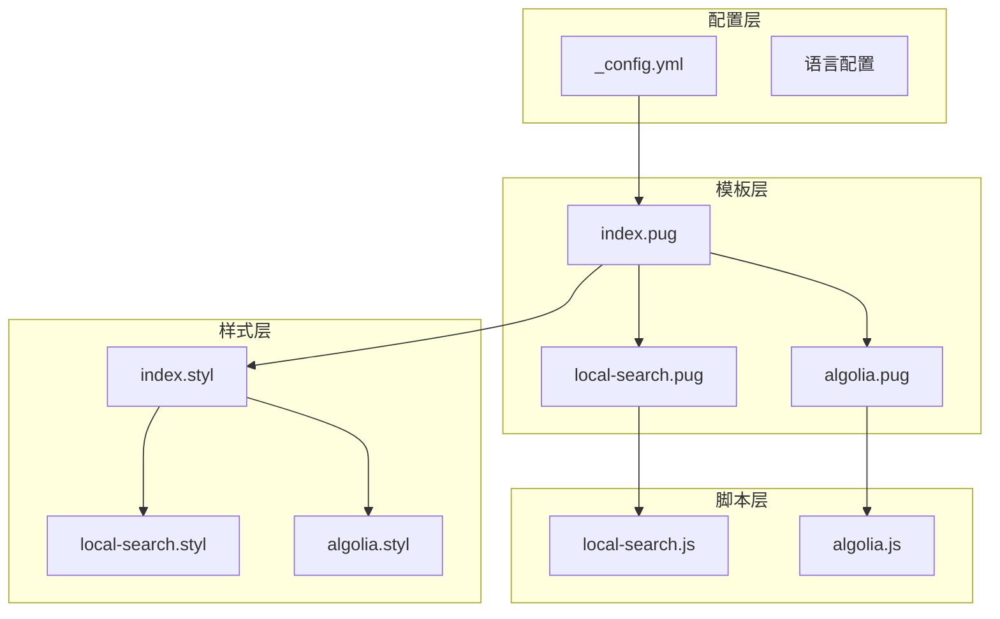
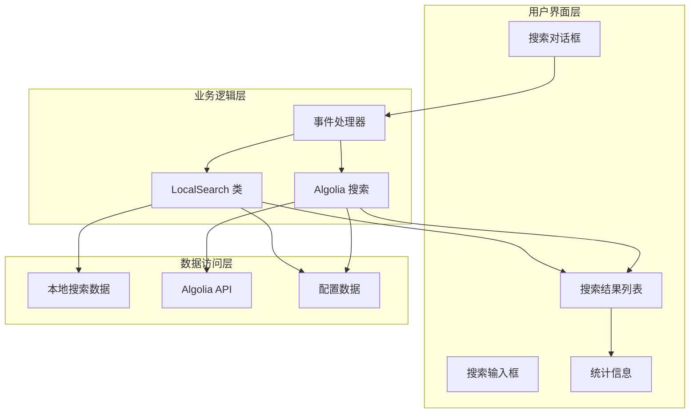
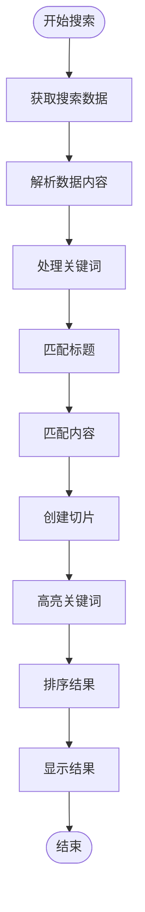
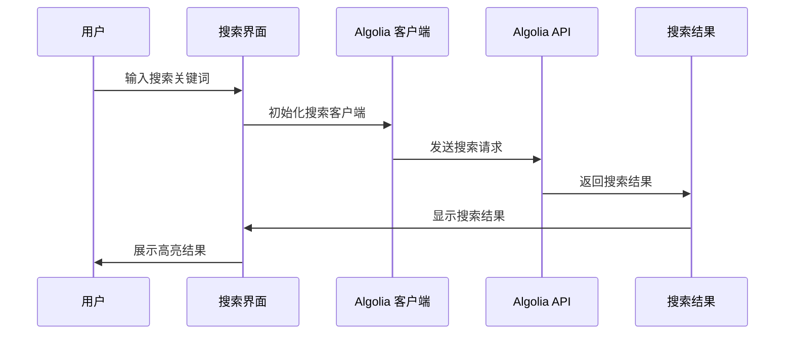
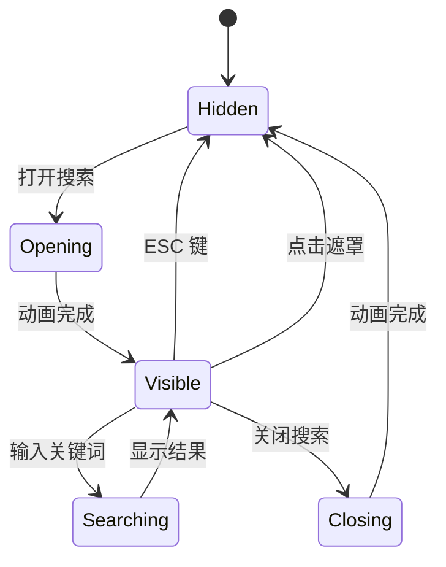
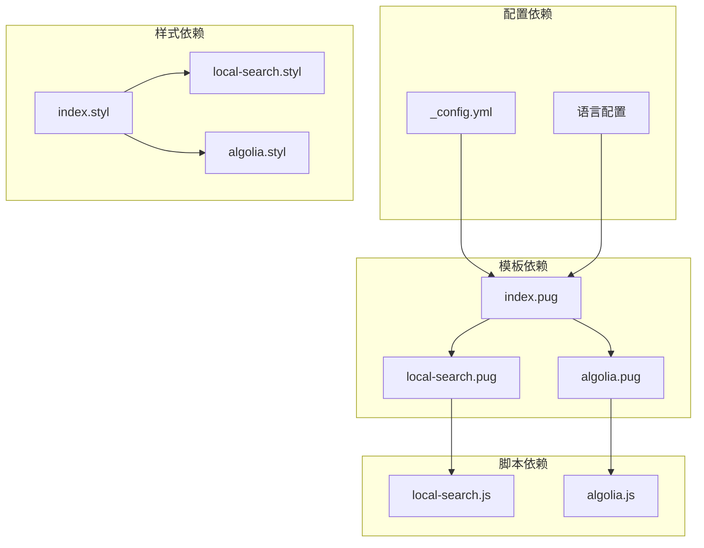

# 搜索功能实现

<cite>
**本文档引用的文件**
- [local-search.js](file://themes/butterfly/source/js/search/local-search.js)
- [algolia.js](file://themes/butterfly/source/js/search/algolia.js)
- [index.pug](file://themes/butterfly/layout/includes/third-party/search/index.pug)
- [local-search.pug](file://themes/butterfly/layout/includes/third-party/search/local-search.pug)
- [algolia.pug](file://themes/butterfly/layout/includes/third-party/search/algolia.pug)
- [index.styl](file://themes/butterfly/source/css/_search/index.styl)
- [local-search.styl](file://themes/butterfly/source/css/_search/local-search.styl)
- [algolia.styl](file://themes/butterfly/source/css/_search/algolia.styl)
- [_config.yml](file://themes/butterfly/_config.yml)
- [default.yml](file://themes/butterfly/languages/default.yml)
- [zh-CN.yml](file://themes/butterfly/languages/zh-CN.yml)
</cite>

## 目录
1. [简介](#简介)
2. [项目结构](#项目结构)
3. [核心组件](#核心组件)
4. [架构概览](#架构概览)
5. [详细组件分析](#详细组件分析)
6. [依赖关系分析](#依赖关系分析)
7. [性能考虑](#性能考虑)
8. [故障排除指南](#故障排除指南)
9. [结论](#结论)
10. [附录](#附录)

## 简介

Butterfly 主题提供了两种搜索实现方案：本地搜索和 Algolia 搜索。这两种方案在技术架构、性能表现和使用场景上存在显著差异。

本地搜索基于浏览器端的全文检索算法，无需外部服务，适合小型网站或对隐私有严格要求的场景。Algolia 搜索则是一个云端搜索服务，提供更强大的搜索功能和更好的用户体验，但需要付费订阅。

## 项目结构

搜索功能的实现涉及多个层次的文件组织：

**图表来源**
- [index.pug:1-7](file://themes/butterfly/layout/includes/third-party/search/index.pug#L1-L7)
- [local-search.pug:1-24](file://themes/butterfly/layout/includes/third-party/search/local-search.pug#L1-L24)
- [algolia.pug:1-34](file://themes/butterfly/layout/includes/third-party/search/algolia.pug#L1-L34)

**章节来源**
- [index.pug:1-7](file://themes/butterfly/layout/includes/third-party/search/index.pug#L1-L7)
- [local-search.pug:1-24](file://themes/butterfly/layout/includes/third-party/search/local-search.pug#L1-L24)
- [algolia.pug:1-34](file://themes/butterfly/layout/includes/third-party/search/algolia.pug#L1-L34)

## 核心组件

### 配置系统

Butterfly 主题通过 `_config.yml` 文件管理搜索配置，支持三种搜索方式的选择和参数设置。

**章节来源**
- [_config.yml:472-508](file://themes/butterfly/_config.yml#L472-L508)

### 本地搜索实现

本地搜索通过 `LocalSearch` 类实现完整的全文检索功能，包括索引构建、关键词匹配和结果高亮显示。

**章节来源**
- [local-search.js:7-235](file://themes/butterfly/source/js/search/local-search.js#L7-L235)

### Algolia 搜索实现

Algolia 搜索通过专门的 JavaScript 文件实现，集成了 Algolia 的搜索客户端，提供云端搜索服务。

**章节来源**
- [algolia.js:1-563](file://themes/butterfly/source/js/search/algolia.js#L1-L563)

## 架构概览

搜索功能的整体架构分为三个主要层次：

**图表来源**
- [local-search.js:237-567](file://themes/butterfly/source/js/search/local-search.js#L237-L567)
- [algolia.js:1-562](file://themes/butterfly/source/js/search/algolia.js#L1-L562)

## 详细组件分析

### 本地搜索算法实现

本地搜索的核心算法基于精确的字符串匹配和智能切片处理：

#### 关键算法流程

**图表来源**
- [local-search.js:104-171](file://themes/butterfly/source/js/search/local-search.js#L104-L171)

#### 索引构建过程

本地搜索的数据处理流程包括：

1. **数据获取**：从指定路径获取搜索数据（支持 XML 和 JSON 格式）
2. **数据解析**：提取标题、内容和 URL 信息
3. **数据清洗**：去除 HTML 标签，标准化文本格式
4. **索引生成**：为每个关键词建立位置索引

**章节来源**
- [local-search.js:173-197](file://themes/butterfly/source/js/search/local-search.js#L173-L197)

#### 结果排序算法

本地搜索采用多维度排序策略：

1. **关键词包含数量**：优先显示包含更多关键词的文章
2. **命中次数**：其次考虑关键词的总命中次数
3. **文章 ID**：最后按文章顺序排序

**章节来源**
- [local-search.js:462-469](file://themes/butterfly/source/js/search/local-search.js#L462-L469)

### Algolia 搜索集成

Algolia 搜索提供了更高级的搜索功能和更好的用户体验：

#### 搜索客户端初始化

**图表来源**
- [algolia.js:218-231](file://themes/butterfly/source/js/search/algolia.js#L218-L231)

#### 内容截取算法

Algolia 搜索实现了智能的内容截取算法，确保高亮显示的上下文完整性：

**章节来源**
- [algolia.js:63-201](file://themes/butterfly/source/js/search/algolia.js#L63-L201)

### 前端交互实现

搜索功能的前端交互包括搜索框控制、结果展示和用户体验优化：

#### 搜索对话框管理

**图表来源**
- [local-search.js:26-52](file://themes/butterfly/source/js/search/local-search.js#L26-L52)

**章节来源**
- [local-search.js:492-519](file://themes/butterfly/source/js/search/local-search.js#L492-L519)

## 依赖关系分析

搜索功能的依赖关系展现了清晰的分层架构：

**图表来源**
- [index.pug:1-7](file://themes/butterfly/layout/includes/third-party/search/index.pug#L1-L7)
- [local-search.pug:1-24](file://themes/butterfly/layout/includes/third-party/search/local-search.pug#L1-L24)
- [algolia.pug:1-34](file://themes/butterfly/layout/includes/third-party/search/algolia.pug#L1-L34)

**章节来源**
- [index.styl:237-240](file://themes/butterfly/source/css/_search/index.styl#L237-L240)

## 性能考虑

### 本地搜索性能优化

本地搜索在性能方面采取了多项优化措施：

1. **预加载机制**：支持在页面加载时预加载搜索数据
2. **分页显示**：大型站点使用分页避免一次性渲染大量结果
3. **智能缓存**：缓存搜索结果减少重复计算
4. **延迟加载**：仅在需要时才进行数据获取

**章节来源**
- [local-search.js:528-531](file://themes/butterfly/source/js/search/local-search.js#L528-L531)

### Algolia 搜索性能特性

Algolia 搜索具有以下性能优势：

1. **CDN 加速**：全球 CDN 分发提升响应速度
2. **智能缓存**：服务器端智能缓存热门搜索
3. **异步处理**：非阻塞的异步搜索请求
4. **结果预处理**：服务器端高亮和截取处理

**章节来源**
- [algolia.js:510-515](file://themes/butterfly/source/js/search/algolia.js#L510-L515)

## 故障排除指南

### 常见问题诊断

#### 本地搜索问题

1. **搜索数据加载失败**
   - 检查数据文件路径配置
   - 验证数据格式正确性
   - 确认跨域访问权限

2. **搜索结果为空**
   - 确认关键词长度足够
   - 检查文本编码格式
   - 验证索引构建过程

#### Algolia 搜索问题

1. **API 配置错误**
   - 验证 App ID、API Key、Index Name
   - 检查网络连接状态
   - 确认 API 权限设置

2. **搜索结果异常**
   - 检查索引数据完整性
   - 验证搜索参数配置
   - 确认高亮标签设置

**章节来源**
- [algolia.js:5-7](file://themes/butterfly/source/js/search/algolia.js#L5-L7)

## 结论

Butterfly 主题的搜索功能提供了灵活的解决方案，满足不同规模和需求的网站：

1. **本地搜索**适合小型网站和个人博客，无需外部依赖，隐私性好
2. **Algolia 搜索**适合大型网站和企业应用，功能强大，性能优异
3. **混合方案**可根据实际需求选择最适合的搜索方式

两种方案都提供了良好的用户体验和可扩展性，开发者可以根据具体情况进行选择和定制。

## 附录

### 配置选项详解

#### 本地搜索配置参数

| 参数名 | 类型 | 默认值 | 描述 |
|--------|------|--------|------|
| preload | boolean | false | 是否预加载搜索数据 |
| top_n_per_article | number | 1 | 每篇文章显示的摘要数量 |
| unescape | boolean | false | 是否转义 HTML 字符串 |
| pagination.enable | boolean | false | 是否启用分页 |
| pagination.hitsPerPage | number | 8 | 每页显示的结果数量 |

#### Algolia 搜索配置参数

| 参数名 | 类型 | 默认值 | 描述 |
|--------|------|--------|------|
| hitsPerPage | number | 6 | 每页显示的结果数量 |
| appId | string | - | Algolia 应用 ID |
| apiKey | string | - | Algolia API 密钥 |
| indexName | string | - | 搜索索引名称 |

**章节来源**
- [_config.yml:481-508](file://themes/butterfly/_config.yml#L481-L508)

### 多语言支持

搜索功能支持多种语言环境，包括：

1. **默认语言**：英文支持
2. **中文语言**：简体中文支持
3. **其他语言**：可通过语言文件扩展

**章节来源**
- [default.yml:37-47](file://themes/butterfly/languages/default.yml#L37-L47)
- [zh-CN.yml:38-47](file://themes/butterfly/languages/zh-CN.yml#L38-L47)