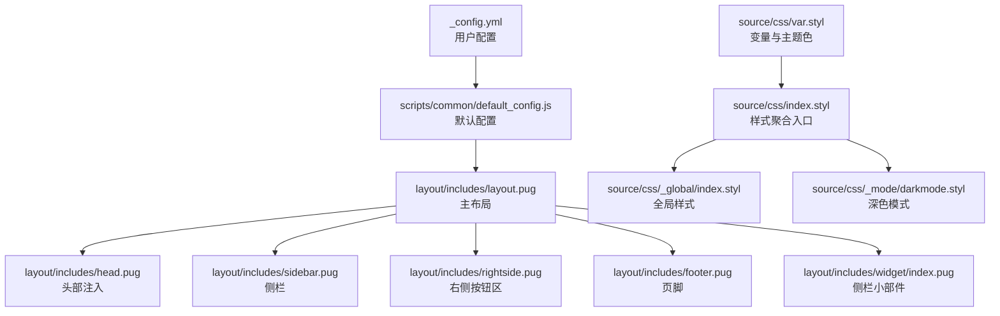
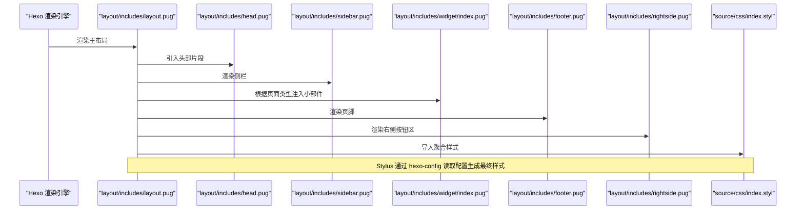
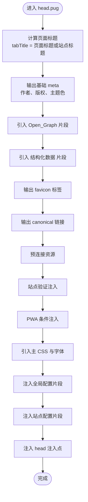
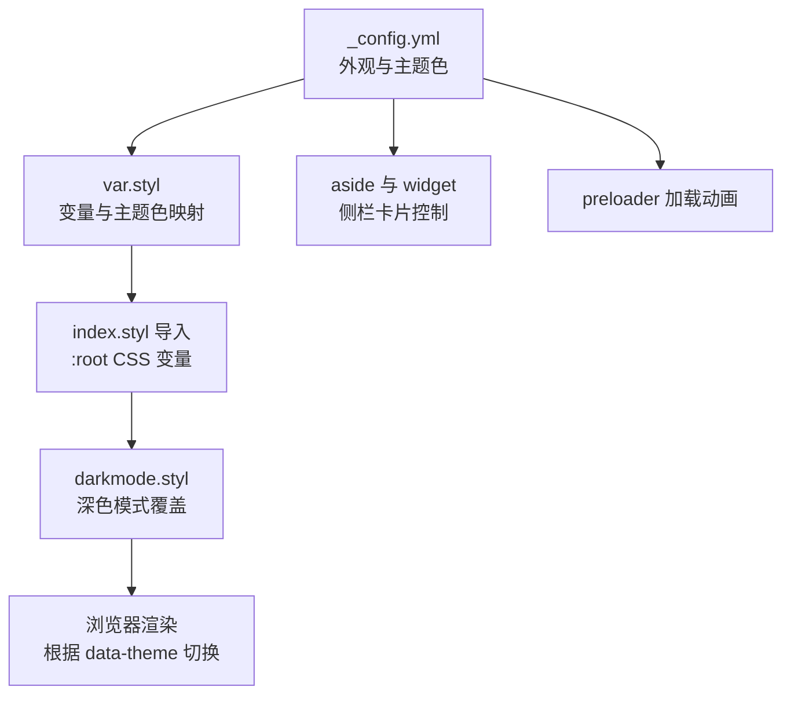
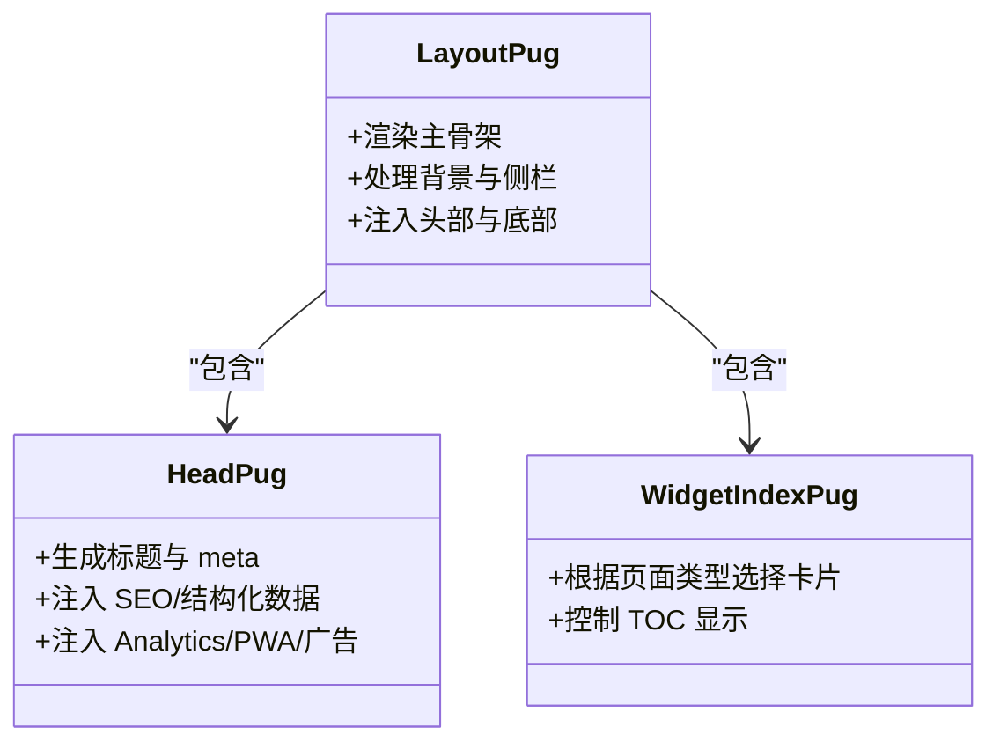
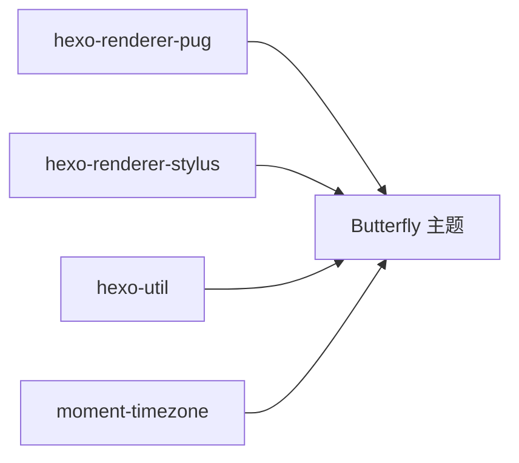

# 主题配置

<cite>
**本文引用的文件**
- [_config.yml](file://themes/butterfly/_config.yml)
- [default_config.js](file://themes/butterfly/scripts/common/default_config.js)
- [package.json](file://themes/butterfly/package.json)
- [var.styl](file://themes/butterfly/source/css/var.styl)
- [index.styl](file://themes/butterfly/source/css/index.styl)
- [index.styl（全局）](file://themes/butterfly/source/css/_global/index.styl)
- [darkmode.styl](file://themes/butterfly/source/css/_mode/darkmode.styl)
- [layout.pug](file://themes/butterfly/layout/includes/layout.pug)
- [head.pug](file://themes/butterfly/layout/includes/head.pug)
- [nav.pug](file://themes/butterfly/layout/includes/header/nav.pug)
- [widget/index.pug](file://themes/butterfly/layout/includes/widget/index.pug)
- [index.pug](file://themes/butterfly/layout/index.pug)
- [post.pug](file://themes/butterfly/layout/post.pug)
- [page.pug](file://themes/butterfly/layout/page.pug)
- [archive.pug](file://themes/butterfly/layout/archive.pug)
- [category.pug](file://themes/butterfly/layout/category.pug)
- [tag.pug](file://themes/butterfly/layout/tag.pug)
</cite>

## 目录
1. [简介](#简介)
2. [项目结构](#项目结构)
3. [核心组件](#核心组件)
4. [架构总览](#架构总览)
5. [详细组件分析](#详细组件分析)
6. [依赖分析](#依赖分析)
7. [性能考虑](#性能考虑)
8. [故障排查指南](#故障排查指南)
9. [结论](#结论)
10. [附录](#附录)

## 简介
本指南面向使用 Butterfly 主题的 Hexo 用户，系统性讲解主题配置文件的各项参数与行为边界，覆盖导航菜单、响应式与外观定制、Pug 模板系统、布局组件组织与渲染流程、CSS 变量系统与颜色主题、动画与加载效果，并提供可操作的配置示例路径与常见问题解决方案。目标是帮助读者在不深入源码的前提下，完成从基础到进阶的完整配置与优化。

## 项目结构
Butterfly 主题采用“模块化布局 + Stylus 样式 + Pug 模板”的组合方式：
- 布局与模板：layout 目录下按页面类型拆分（首页、文章页、分类页、标签页、归档页等），并通过 includes 组织公共片段（头部、侧栏、小部件、第三方集成等）
- 样式系统：source/css 下以 Stylus 分层组织（全局、页面、布局、标签插件、模式切换等），通过 var.styl 定义变量，index.styl 聚合导入
- 主题配置：根级 _config.yml 提供用户配置；scripts/common/default_config.js 提供默认值与类型约束；package.json 描述依赖与脚手架

图表来源
- [layout.pug:1-59](file://themes/butterfly/layout/includes/layout.pug#L1-L59)
- [head.pug:1-78](file://themes/butterfly/layout/includes/head.pug#L1-L78)
- [widget/index.pug:1-36](file://themes/butterfly/layout/includes/widget/index.pug#L1-L36)
- [var.styl:1-233](file://themes/butterfly/source/css/var.styl#L1-L233)
- [index.styl:1-15](file://themes/butterfly/source/css/index.styl#L1-L15)
- [index.styl（全局）:1-287](file://themes/butterfly/source/css/_global/index.styl#L1-L287)
- [darkmode.styl:1-205](file://themes/butterfly/source/css/_mode/darkmode.styl#L1-L205)

章节来源
- [layout.pug:1-59](file://themes/butterfly/layout/includes/layout.pug#L1-L59)
- [head.pug:1-78](file://themes/butterfly/layout/includes/head.pug#L1-L78)
- [widget/index.pug:1-36](file://themes/butterfly/layout/includes/widget/index.pug#L1-L36)
- [var.styl:1-233](file://themes/butterfly/source/css/var.styl#L1-L233)
- [index.styl:1-15](file://themes/butterfly/source/css/index.styl#L1-L15)
- [index.styl（全局）:1-287](file://themes/butterfly/source/css/_global/index.styl#L1-L287)
- [darkmode.styl:1-205](file://themes/butterfly/source/css/_mode/darkmode.styl#L1-L205)

## 核心组件
- 主题配置入口：用户在 _config.yml 中设置导航、封面、图片、主页布局、文章元信息、TOC、评论、搜索、分享、统计、广告、主题色、UI 效果等
- 默认配置与校验：default_config.js 提供默认值与字段类型，确保配置项存在且具备合理缺省
- 渲染管线：Hexo 渲染器（Pug/Stylus）将模板与变量编译为 HTML/CSS；Stylus 通过 hexo-config 读取配置，生成最终样式
- 样式变量系统：var.styl 定义颜色、字体、间距、UI 开关等变量；index.styl 聚合导入；darkmode.styl 在深色模式下覆盖变量
- 布局与小部件：layout.pug 组织页面骨架；widget/index.pug 根据页面类型动态注入侧栏卡片；head.pug 注入 SEO、Analytics、PWA、广告等

章节来源
- [_config.yml:1-1140](file://themes/butterfly/_config.yml#L1-L1140)
- [default_config.js:1-602](file://themes/butterfly/scripts/common/default_config.js#L1-L602)
- [layout.pug:1-59](file://themes/butterfly/layout/includes/layout.pug#L1-L59)
- [widget/index.pug:1-36](file://themes/butterfly/layout/includes/widget/index.pug#L1-L36)
- [head.pug:1-78](file://themes/butterfly/layout/includes/head.pug#L1-L78)
- [var.styl:1-233](file://themes/butterfly/source/css/var.styl#L1-L233)
- [index.styl:1-15](file://themes/butterfly/source/css/index.styl#L1-L15)
- [darkmode.styl:1-205](file://themes/butterfly/source/css/_mode/darkmode.styl#L1-L205)

## 架构总览
下面用序列图展示一次页面渲染的关键调用链：从布局到头部注入、侧栏与小部件、再到底部与附加脚本。

图表来源
- [layout.pug:1-59](file://themes/butterfly/layout/includes/layout.pug#L1-L59)
- [head.pug:1-78](file://themes/butterfly/layout/includes/head.pug#L1-L78)
- [widget/index.pug:1-36](file://themes/butterfly/layout/includes/widget/index.pug#L1-L36)
- [index.styl:1-15](file://themes/butterfly/source/css/index.styl#L1-L15)

## 详细组件分析

### 导航与菜单配置
- 导航条设置：logo、标题显示、文章页标题显示、固定导航等
- 菜单列表：支持层级菜单与图标，格式为“名称: 路径 || 图标”
- 社交链接：支持图标、链接、颜色
- 头部渲染：head.pug 动态生成标题、Open Graph、结构化数据、站点验证、PWA、主 CSS、字体、全局配置注入等

图表来源
- [head.pug:1-78](file://themes/butterfly/layout/includes/head.pug#L1-L78)

章节来源
- [_config.yml:12-51](file://themes/butterfly/_config.yml#L12-L51)
- [head.pug:1-78](file://themes/butterfly/layout/includes/head.pug#L1-L78)
- [nav.pug:1-26](file://themes/butterfly/layout/includes/header/nav.pug#L1-L26)

### 响应式设计与外观定制
- 基础外观：全局字体、字号、行高、圆角开关、对齐方式、遮罩开关
- 主题色系统：通过 theme_color.* 字段启用主题色覆盖；var.styl 将其映射为 Stylus 变量，再由 CSS 变量暴露给 :root
- 深色模式：darkmode.styl 在 data-theme='dark' 下重写 :root 变量，适配暗色背景与低对比度元素
- 侧栏与卡片：aside 的显示/隐藏、位置、移动端可见性、各卡片开关与排序
- 加载动画：preloader 支持全屏与 Pace 两种实现

图表来源
- [var.styl:1-233](file://themes/butterfly/source/css/var.styl#L1-L233)
- [index.styl:1-15](file://themes/butterfly/source/css/index.styl#L1-L15)
- [darkmode.styl:1-205](file://themes/butterfly/source/css/_mode/darkmode.styl#L1-L205)
- [widget/index.pug:1-36](file://themes/butterfly/layout/includes/widget/index.pug#L1-L36)

章节来源
- [_config.yml:759-800](file://themes/butterfly/_config.yml#L759-L800)
- [var.styl:1-233](file://themes/butterfly/source/css/var.styl#L1-L233)
- [index.styl（全局）:1-287](file://themes/butterfly/source/css/_global/index.styl#L1-L287)
- [darkmode.styl:1-205](file://themes/butterfly/source/css/_mode/darkmode.styl#L1-L205)
- [widget/index.pug:1-36](file://themes/butterfly/layout/includes/widget/index.pug#L1-L36)

### Pug 模板系统与布局组织
- 主布局：layout.pug 决定页面骨架、背景、侧栏显示逻辑、页脚背景、右侧按钮与附加脚本
- 页面类型：通过 getPageType 判定首页/文章/分类/标签/归档/404，驱动不同渲染策略
- 小部件：widget/index.pug 根据页面类型与 toc 显示情况，动态选择作者公告、近期文章、目录、系列、分类、标签、归档、站点信息等卡片
- 头部与第三方：head.pug 负责 SEO、Analytics、Adsense、PWA、注入点；第三方如搜索、数学公式、聊天工具通过条件分支引入对应片段

图表来源
- [layout.pug:1-59](file://themes/butterfly/layout/includes/layout.pug#L1-L59)
- [head.pug:1-78](file://themes/butterfly/layout/includes/head.pug#L1-L78)
- [widget/index.pug:1-36](file://themes/butterfly/layout/includes/widget/index.pug#L1-L36)

章节来源
- [layout.pug:1-59](file://themes/butterfly/layout/includes/layout.pug#L1-L59)
- [widget/index.pug:1-36](file://themes/butterfly/layout/includes/widget/index.pug#L1-L36)
- [head.pug:1-78](file://themes/butterfly/layout/includes/head.pug#L1-L78)

### CSS 变量系统与颜色主题
- 变量来源：var.styl 读取主题配置（如 theme_color.*、font.*、blog_title_font.* 等），生成 Stylus 变量
- CSS 变量暴露：index.styl 导入 var.styl 后，将关键变量提升为 :root CSS 变量，供全局样式使用
- 深色覆盖：darkmode.styl 在 data-theme='dark' 时重写 :root 变量，适配暗色主题
- 全局样式：_global/index.styl 使用 CSS 变量与 Stylus 变量统一控制排版、滚动条、表格、块引用等

章节来源
- [var.styl:1-233](file://themes/butterfly/source/css/var.styl#L1-L233)
- [index.styl:1-15](file://themes/butterfly/source/css/index.styl#L1-L15)
- [index.styl（全局）:1-287](file://themes/butterfly/source/css/_global/index.styl#L1-L287)
- [darkmode.styl:1-205](file://themes/butterfly/source/css/_mode/darkmode.styl#L1-L205)

### 动画与加载效果
- 加载动画：preloader.enable 控制开启；source=1 使用全屏加载，否则使用 Pace；通过 layout/includes/loading/* 片段引入
- 滚动条与过渡：全局样式中定义滚动条与过渡；部分特效（如烟花、彩带、点击爱心等）通过配置项开启
- 深色模式滤镜：darkmode.styl 对图片、评论框、图表等元素应用亮度/对比度滤镜，保证可读性

章节来源
- [_config.yml:797-800](file://themes/butterfly/_config.yml#L797-L800)
- [layout.pug:1-59](file://themes/butterfly/layout/includes/layout.pug#L1-L59)
- [darkmode.styl:1-205](file://themes/butterfly/source/css/_mode/darkmode.styl#L1-L205)

### 扩展机制与自定义开发
- 注入点：head 与底部支持注入自定义 HTML/CSS/JS（inject.head/bottom）
- 第三方集成：搜索（Algolia/本地/Docsearch）、数学（MathJax/KaTeX/Mermaid/Chart.js）、评论（多平台）、聊天（Chatra/Tidio/Crisp）、分析（百度/Google/Cloudflare/Microsoft/Umami）、广告（Adsense）
- 样式扩展：通过修改 var.styl 或新增 Stylus 文件，在 index.styl 中聚合导入；注意保持与现有变量体系一致
- 模板扩展：在 layout 下新增或替换 .pug 片段，遵循现有命名与组织方式；避免破坏页面类型判断与小部件注入逻辑

章节来源
- [_config.yml:471-756](file://themes/butterfly/_config.yml#L471-L756)
- [head.pug:1-78](file://themes/butterfly/layout/includes/head.pug#L1-L78)
- [index.styl:1-15](file://themes/butterfly/source/css/index.styl#L1-L15)

## 依赖分析
- 渲染器依赖：hexo-renderer-pug、hexo-renderer-stylus
- 工具类：hexo-util、moment-timezone
- 主题版本与仓库信息：package.json 提供主题元数据与依赖

图表来源
- [package.json:25-30](file://themes/butterfly/package.json#L25-L30)

章节来源
- [package.json:1-35](file://themes/butterfly/package.json#L1-L35)

## 性能考虑
- 样式聚合：index.styl 聚合导入，减少请求；仅在需要时加载第三方样式（如 Snackbar、Fancybox）
- 资源懒加载：可通过 default_config.js 中的 lazyload 字段开启图片懒加载与模糊占位
- 深色模式：darkmode.styl 仅在启用时生效，避免不必要的样式计算
- 第三方脚本：按需启用搜索、数学、聊天、分析与广告，避免阻塞首屏
- 预连接：head.pug 中的预连接片段可加速外部资源加载

章节来源
- [index.styl:1-15](file://themes/butterfly/source/css/index.styl#L1-L15)
- [head.pug:40-78](file://themes/butterfly/layout/includes/head.pug#L40-L78)
- [default_config.js:566-572](file://themes/butterfly/scripts/common/default_config.js#L566-L572)

## 故障排查指南
- 样式未生效
  - 检查主题配置中的主题色与外观开关是否正确启用
  - 确认 var.styl 与 index.styl 的导入顺序与变量名一致
  - 深色模式下检查 data-theme 属性与 darkmode.styl 是否被正确加载
- 导航/菜单异常
  - 确认 _config.yml 中菜单格式与图标名称正确
  - 检查 head.pug 中的标题与 Open Graph 生成逻辑
- 侧栏/小部件不显示
  - 核对 aside.enable、aside.hide、aside.display.* 与页面类型判断
  - 检查 widget/index.pug 的条件分支与 toc 显示逻辑
- 加载动画无效
  - 确认 preloader.enable 与 source 设置
  - 检查 layout/includes/loading/* 片段是否被正确引入
- 第三方服务不可用
  - 搜索：确认 search.use 与对应 provider 的配置项
  - 数学：确认 math.use 与 per_page 设置
  - 评论/聊天/分析/广告：核对各 provider 的必填参数

章节来源
- [_config.yml:12-51](file://themes/butterfly/_config.yml#L12-L51)
- [head.pug:1-78](file://themes/butterfly/layout/includes/head.pug#L1-L78)
- [widget/index.pug:1-36](file://themes/butterfly/layout/includes/widget/index.pug#L1-L36)
- [layout.pug:1-59](file://themes/butterfly/layout/includes/layout.pug#L1-L59)

## 结论
Butterfly 主题通过清晰的配置入口、默认配置与模板/样式分层，提供了高度可定制的外观与交互体验。掌握主题配置文件、Pug 布局组织与 Stylus 变量系统，即可在不改动核心代码的前提下完成从基础到高级的个性化配置与性能优化。

## 附录
- 页面类型与模板映射参考
  - 首页：layout/index.pug
  - 文章页：layout/post.pug
  - 页面（非文章）：layout/page.pug
  - 归档页：layout/archive.pug
  - 分类页：layout/category.pug
  - 标签页：layout/tag.pug

章节来源
- [index.pug](file://themes/butterfly/layout/index.pug)
- [post.pug](file://themes/butterfly/layout/post.pug)
- [page.pug](file://themes/butterfly/layout/page.pug)
- [archive.pug](file://themes/butterfly/layout/archive.pug)
- [category.pug](file://themes/butterfly/layout/category.pug)
- [tag.pug](file://themes/butterfly/layout/tag.pug)