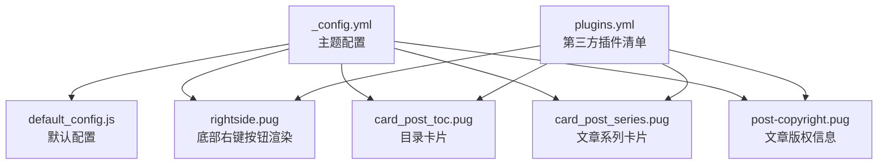
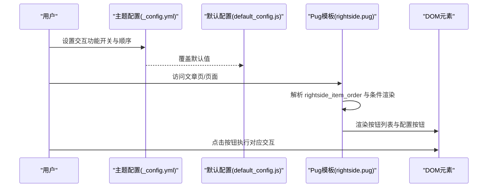
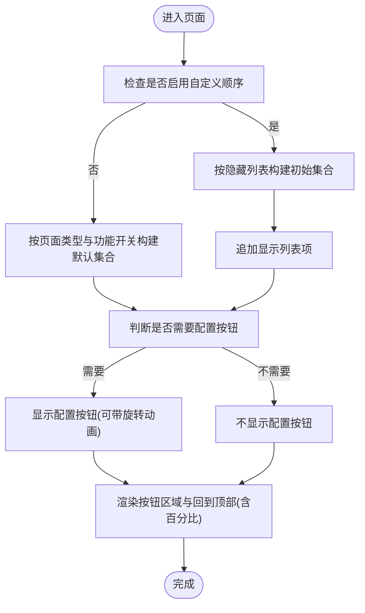
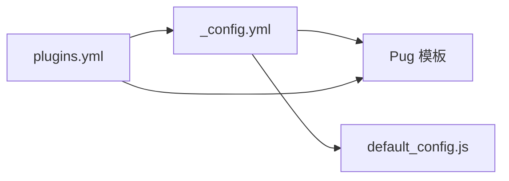

# 交互功能配置

<cite>
**本文引用的文件**
- [_config.yml](file://themes/butterfly/_config.yml)
- [default_config.js](file://themes/butterfly/scripts/common/default_config.js)
- [rightside.pug](file://themes/butterfly/layout/includes/rightside.pug)
- [card_post_toc.pug](file://themes/butterfly/layout/includes/widget/card_post_toc.pug)
- [card_post_series.pug](file://themes/butterfly/layout/includes/widget/card_post_series.pug)
- [post-copyright.pug](file://themes/butterfly/layout/includes/post/post-copyright.pug)
- [plugins.yml](file://themes/butterfly/plugins.yml)
</cite>

## 目录
1. [简介](#简介)
2. [项目结构](#项目结构)
3. [核心组件](#核心组件)
4. [架构总览](#架构总览)
5. [详细组件分析](#详细组件分析)
6. [依赖关系分析](#依赖关系分析)
7. [性能考量](#性能考量)
8. [故障排查指南](#故障排查指南)
9. [结论](#结论)
10. [附录](#附录)

## 简介
本文件聚焦于 Butterfly 主题中的“交互功能配置”，围绕底部右键按钮（右侧悬浮工具栏）的按钮顺序、动画效果与显示隐藏控制进行深入解析；同时覆盖阅读模式、简繁转换、滚动百分比等交互能力；并说明文章目录、相关文章、文章分页等导航功能的配置方式；最后提供社交分享、聊天服务、评论系统等第三方集成的配置要点与最佳实践。

## 项目结构
与交互功能直接相关的配置主要分布在以下位置：
- 主题配置文件：用于声明全局交互开关与默认值
- 默认配置脚本：用于在未显式配置时提供默认行为
- Pug 模板：负责渲染底部右键按钮、目录卡片、系列卡片等 UI 组件
- 插件清单：声明第三方库版本与文件路径，影响分享、评论、聊天等功能的加载

图表来源
- [_config.yml](file://themes/butterfly/_config.yml)
- [default_config.js](file://themes/butterfly/scripts/common/default_config.js)
- [rightside.pug](file://themes/butterfly/layout/includes/rightside.pug)
- [card_post_toc.pug](file://themes/butterfly/layout/includes/widget/card_post_toc.pug)
- [card_post_series.pug](file://themes/butterfly/layout/includes/widget/card_post_series.pug)
- [post-copyright.pug](file://themes/butterfly/layout/includes/post/post-copyright.pug)
- [plugins.yml](file://themes/butterfly/plugins.yml)

章节来源
- [_config.yml](file://themes/butterfly/_config.yml)
- [default_config.js](file://themes/butterfly/scripts/common/default_config.js)
- [rightside.pug](file://themes/butterfly/layout/includes/rightside.pug)
- [card_post_toc.pug](file://themes/butterfly/layout/includes/widget/card_post_toc.pug)
- [card_post_series.pug](file://themes/butterfly/layout/includes/widget/card_post_series.pug)
- [post-copyright.pug](file://themes/butterfly/layout/includes/post/post-copyright.pug)
- [plugins.yml](file://themes/butterfly/plugins.yml)

## 核心组件
- 底部右键按钮（右侧悬浮工具栏）
  - 控制项：按钮顺序、动画、显示隐藏、滚动百分比
  - 关键配置：右侧按钮间距、简繁转换、阅读模式、深色模式、隐藏侧边栏、目录、聊天、评论等
- 阅读模式与简繁转换
  - 开关与默认文案、编码策略、延迟
- 文章目录与滚动百分比
  - 是否展示目录、是否展示滚动百分比、目录样式简化
- 导航与分页
  - 相关文章数量与排序、文章分页方向
- 第三方集成
  - 社交分享、评论系统、聊天服务、统计分析等

章节来源
- [_config.yml](file://themes/butterfly/_config.yml)
- [default_config.js](file://themes/butterfly/scripts/common/default_config.js)
- [rightside.pug](file://themes/butterfly/layout/includes/rightside.pug)
- [card_post_toc.pug](file://themes/butterfly/layout/includes/widget/card_post_toc.pug)

## 架构总览
下图展示了“底部右键按钮”在模板层的渲染流程与配置驱动关系：

图表来源
- [_config.yml](file://themes/butterfly/_config.yml)
- [default_config.js](file://themes/butterfly/scripts/common/default_config.js)
- [rightside.pug](file://themes/butterfly/layout/includes/rightside.pug)

## 详细组件分析

### 底部右键按钮（右侧悬浮工具栏）
- 功能入口与顺序控制
  - 通过“显示/隐藏”两个数组控制按钮顺序与可见性
  - 当启用自定义顺序时，按“隐藏列表”优先，再按“显示列表”追加
  - 未启用自定义顺序时，根据页面类型与功能开关动态拼接默认列表
- 可用按钮项
  - 阅读模式、简繁转换、深色模式、隐藏侧边栏、目录、聊天、评论、回到顶部（含滚动百分比）
- 动画与显示
  - 配置按钮可选旋转动画
  - 回到顶部按钮支持显示滚动百分比
- 布局与间距
  - 支持设置按钮距离底部的距离（单位为像素）

图表来源
- [rightside.pug](file://themes/butterfly/layout/includes/rightside.pug)
- [_config.yml](file://themes/butterfly/_config.yml)

章节来源
- [rightside.pug](file://themes/butterfly/layout/includes/rightside.pug)
- [_config.yml](file://themes/butterfly/_config.yml)
- [default_config.js](file://themes/butterfly/scripts/common/default_config.js)

### 阅读模式
- 开关与按钮
  - 全局开启/关闭阅读模式
  - 文章页中显示“阅读模式”按钮
- 用户体验建议
  - 在长文场景下建议默认开启阅读模式
  - 结合深色模式使用以降低夜间阅读疲劳

章节来源
- [_config.yml](file://themes/butterfly/_config.yml)
- [rightside.pug](file://themes/butterfly/layout/includes/rightside.pug)

### 简繁转换
- 功能开关与文案
  - 启用后在右下角显示切换按钮
  - 默认按钮文案、简繁互换文案可配置
- 编码策略
  - 支持设定默认语言（繁体/简体）
  - 支持切换延时
- 用户体验建议
  - 对于双语内容站点，建议保留简繁切换按钮
  - 合理设置切换延时避免频繁切换造成干扰

章节来源
- [_config.yml](file://themes/butterfly/_config.yml)
- [rightside.pug](file://themes/butterfly/layout/includes/rightside.pug)

### 深色模式
- 开关与自动切换
  - 全局开关、按钮开关
  - 自动切换模式（跟随系统或指定时间段）
- 用户体验建议
  - 夜间场景建议开启自动切换
  - 提供手动切换按钮便于用户快速调整

章节来源
- [_config.yml](file://themes/butterfly/_config.yml)
- [rightside.pug](file://themes/butterfly/layout/includes/rightside.pug)

### 隐藏侧边栏
- 功能开关
  - 仅在允许显示侧边栏且页面未禁用侧边栏时显示
- 用户体验建议
  - 在窄屏设备上可作为临时收起空间的手段

章节来源
- [_config.yml](file://themes/butterfly/_config.yml)
- [rightside.pug](file://themes/butterfly/layout/includes/rightside.pug)

### 目录与滚动百分比
- 目录卡片
  - 支持展开/折叠、数字编号、简化样式
  - 文章页展示，支持滚动百分比显示
- 滚动百分比
  - 回到顶部按钮支持显示当前滚动百分比
- 用户体验建议
  - 长文档建议开启目录与滚动百分比
  - 简化样式适合移动端紧凑布局

章节来源
- [_config.yml](file://themes/butterfly/_config.yml)
- [card_post_toc.pug](file://themes/butterfly/layout/includes/widget/card_post_toc.pug)
- [rightside.pug](file://themes/butterfly/layout/includes/rightside.pug)

### 文章目录（TOC）
- 展示范围与样式
  - 文章页/页面页分别控制
  - 数字编号、展开/折叠、简化样式
- 滚动百分比
  - 与目录卡片联动显示
- 用户体验建议
  - 大纲复杂的文章建议开启数字编号与展开
  - 移动端可考虑简化样式减少占用

章节来源
- [_config.yml](file://themes/butterfly/_config.yml)
- [card_post_toc.pug](file://themes/butterfly/layout/includes/widget/card_post_toc.pug)

### 相关文章
- 数量与排序
  - 控制显示数量与按创建时间/更新时间排序
- 用户体验建议
  - 推荐在内容密度较高时开启，帮助读者发现相似内容

章节来源
- [_config.yml](file://themes/butterfly/_config.yml)

### 文章分页
- 方向控制
  - 1：下一篇文章链接指向较旧文章
  - 2：下一篇文章链接指向较新文章
  - false：禁用分页
- 用户体验建议
  - 博客类建议使用“较新文章”以保持阅读连贯性

章节来源
- [_config.yml](file://themes/butterfly/_config.yml)

### 第三方集成配置

#### 社交分享
- 选择器
  - 支持 share.js 或 AddToAny
- 分享平台
  - share.js：可配置多个平台（如微信、微博、QQ 等）
  - AddToAny：可配置多种渠道（如 Facebook、邮件、复制链接等）
- 用户体验建议
  - 根据目标受众选择主流平台组合
  - 尽量避免过多平台导致按钮拥挤

章节来源
- [_config.yml](file://themes/butterfly/_config.yml)
- [plugins.yml](file://themes/butterfly/plugins.yml)

#### 评论系统
- 支持系统
  - 支持多种评论系统（如 Giscus、Waline、Twikoo 等）
  - 可配置默认显示名称、懒加载、评论计数等
- 用户体验建议
  - 选择与 GitHub 生态契合的系统（如 Giscus）可提升技术读者参与度
  - 懒加载可显著降低首屏资源压力

章节来源
- [_config.yml](file://themes/butterfly/_config.yml)
- [plugins.yml](file://themes/butterfly/plugins.yml)

#### 聊天服务
- 支持服务
  - 支持 Chatra、Tidio、Crisp 等
- 右侧按钮与隐藏策略
  - 可在右下角显示聊天按钮
  - 支持滚动时显示/隐藏策略
- 用户体验建议
  - 企业级站点建议开启“滚动隐藏”以减少视觉干扰

章节来源
- [_config.yml](file://themes/butterfly/_config.yml)
- [plugins.yml](file://themes/butterfly/plugins.yml)

#### 统计与分析
- 支持服务
  - 百度统计、Google Analytics、Cloudflare Analytics、Microsoft Clarity、Umami Analytics 等
- 用户体验建议
  - 遵循隐私合规要求，提供清晰的隐私政策与用户同意机制

章节来源
- [_config.yml](file://themes/butterfly/_config.yml)
- [plugins.yml](file://themes/butterfly/plugins.yml)

### 文章版权信息
- 版权模块
  - 可配置是否启用、作者信息、许可协议与链接
- 用户体验建议
  - 明确版权信息有助于保护原创内容权益

章节来源
- [post-copyright.pug](file://themes/butterfly/layout/includes/post/post-copyright.pug)
- [_config.yml](file://themes/butterfly/_config.yml)

## 依赖关系分析
- 配置驱动渲染
  - 主题配置决定默认行为与可用功能
  - 默认配置脚本提供兜底值
  - Pug 模板依据配置与页面上下文渲染 UI
- 第三方库
  - 插件清单统一管理第三方库版本与文件路径
  - 不同第三方功能依赖对应插件文件存在

图表来源
- [_config.yml](file://themes/butterfly/_config.yml)
- [default_config.js](file://themes/butterfly/scripts/common/default_config.js)
- [plugins.yml](file://themes/butterfly/plugins.yml)

章节来源
- [_config.yml](file://themes/butterfly/_config.yml)
- [default_config.js](file://themes/butterfly/scripts/common/default_config.js)
- [plugins.yml](file://themes/butterfly/plugins.yml)

## 性能考量
- 懒加载与按需加载
  - 评论系统支持懒加载，减少首屏资源消耗
  - 目录与相关文章等组件按需渲染
- 动画与交互
  - 配置按钮旋转动画仅在需要时启用
  - 滚动百分比计算应避免高频重绘
- 第三方资源
  - 合理选择第三方服务，避免过多外部依赖
  - 使用 CDN 时注意版本与缓存策略

## 故障排查指南
- 底部按钮未显示
  - 检查是否启用了自定义顺序，确认“隐藏列表/显示列表”配置
  - 确认页面类型与功能开关是否满足渲染条件
- 简繁转换按钮无效
  - 检查简繁转换开关与默认编码设置
  - 确认按钮文案与切换延时配置
- 目录不显示
  - 检查文章页 TOC 开关与目录样式设置
  - 确认文章内容是否包含标题层级
- 评论系统不加载
  - 检查评论系统配置与懒加载设置
  - 确认第三方服务密钥与域名配置正确
- 聊天按钮不出现
  - 检查聊天服务开关与右侧按钮显示设置
  - 确认滚动隐藏策略与页面滚动行为

章节来源
- [rightside.pug](file://themes/butterfly/layout/includes/rightside.pug)
- [_config.yml](file://themes/butterfly/_config.yml)
- [plugins.yml](file://themes/butterfly/plugins.yml)

## 结论
通过主题配置与默认配置的协同，结合 Pug 模板的条件渲染，可以灵活地定制底部右键按钮的顺序、动画与显示策略，并实现阅读模式、简繁转换、目录与滚动百分比等交互功能。第三方集成方面，建议根据目标用户与合规要求选择合适的社交分享、评论与聊天方案，并合理使用懒加载与 CDN 以优化性能。

## 附录
- 快速定位配置项
  - 底部按钮顺序与显示隐藏：[rightside_item_order](file://themes/butterfly/_config.yml)
  - 配置按钮动画：[rightside_config_animation](file://themes/butterfly/_config.yml)
  - 阅读模式：[readmode](file://themes/butterfly/_config.yml)
  - 简繁转换：[translate](file://themes/butterfly/_config.yml)
  - 目录与滚动百分比：[toc](file://themes/butterfly/_config.yml)
  - 相关文章：[related_post](file://themes/butterfly/_config.yml)
  - 文章分页：[post_pagination](file://themes/butterfly/_config.yml)
  - 社交分享：[share](file://themes/butterfly/_config.yml)
  - 评论系统：[comments](file://themes/butterfly/_config.yml)
  - 聊天服务：[chat](file://themes/butterfly/_config.yml)
  - 统计分析：[baidu_analytics/google_analytics/cloudflare_analytics/microsoft_clarity/umami_analytics](file://themes/butterfly/_config.yml)
  - 默认配置参考：[default_config.js](file://themes/butterfly/scripts/common/default_config.js)
  - 第三方插件清单：[plugins.yml](file://themes/butterfly/plugins.yml)