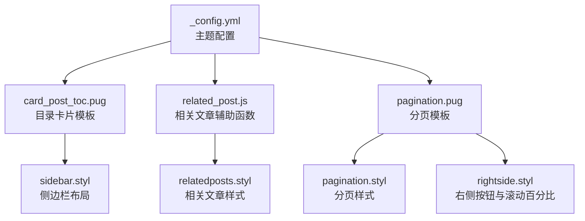
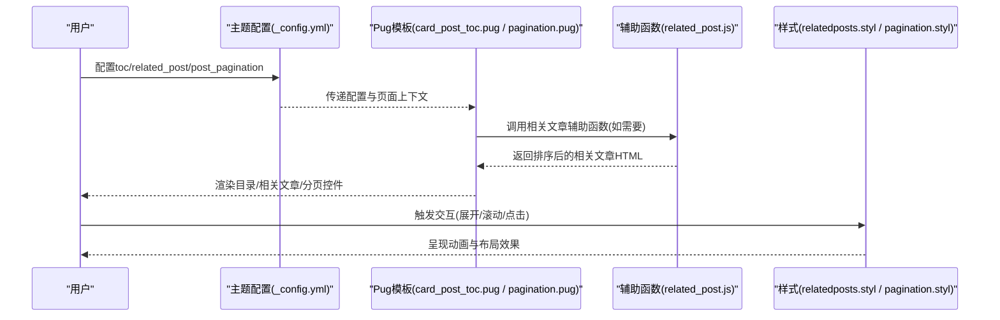
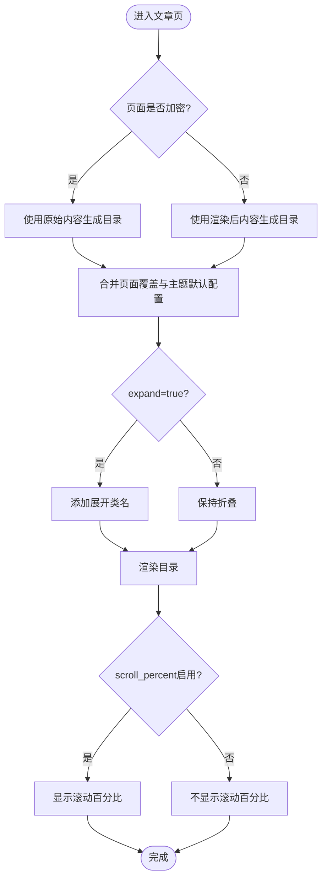
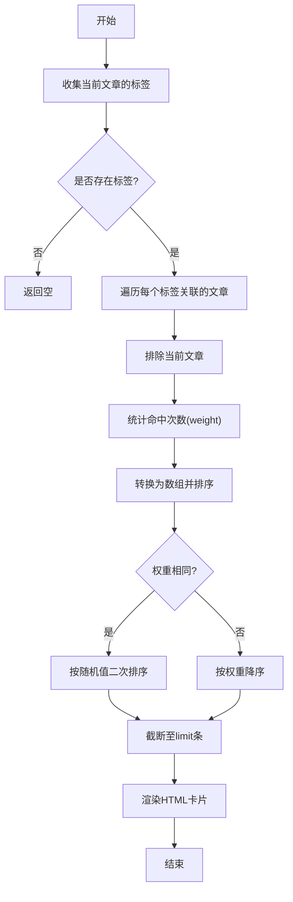
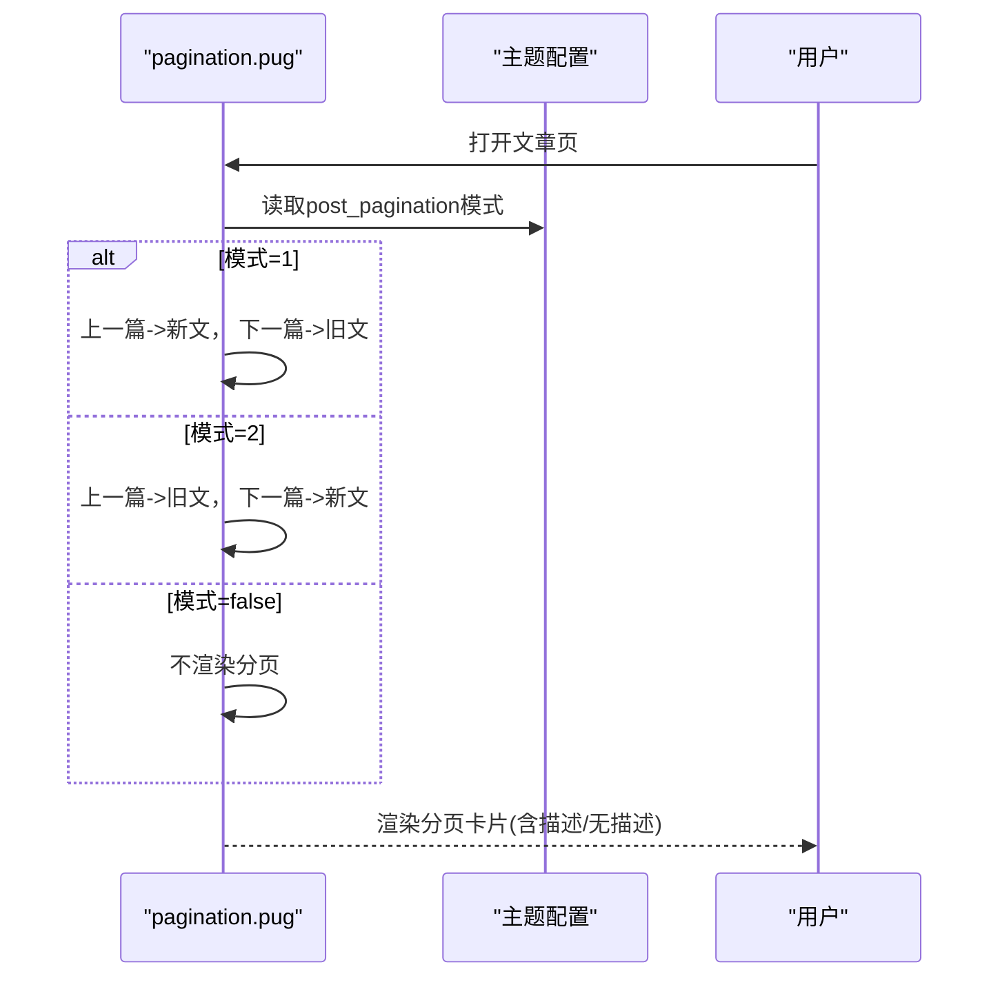
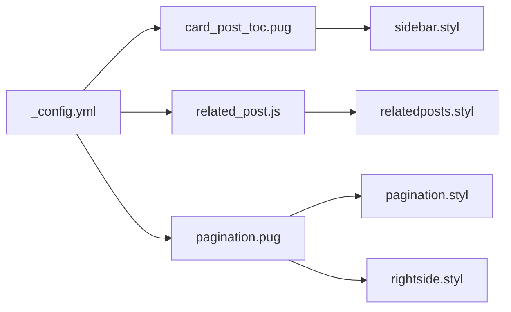

# 导航功能配置

<cite>
**本文引用的文件**
- [_config.yml](file://themes/butterfly/_config.yml)
- [card_post_toc.pug](file://themes/butterfly/layout/includes/widget/card_post_toc.pug)
- [related_post.js](file://themes/butterfly/scripts/helpers/related_post.js)
- [pagination.pug](file://themes/butterfly/layout/includes/pagination.pug)
- [pagination.styl](file://themes/butterfly/source/css/_layout/pagination.styl)
- [relatedposts.styl](file://themes/butterfly/source/css/_layout/relatedposts.styl)
- [sidebar.styl](file://themes/butterfly/source/css/_layout/sidebar.styl)
- [rightside.styl](file://themes/butterfly/source/css/_layout/rightside.styl)
</cite>

## 目录
1. [简介](#简介)
2. [项目结构](#项目结构)
3. [核心组件](#核心组件)
4. [架构总览](#架构总览)
5. [详细组件分析](#详细组件分析)
6. [依赖关系分析](#依赖关系分析)
7. [性能考虑](#性能考虑)
8. [故障排查指南](#故障排查指南)
9. [结论](#结论)
10. [附录](#附录)

## 简介
本文件聚焦于 Hexo 主题 Butterfly 的导航功能配置，围绕以下目标展开：
- 文章目录（toc）的完整配置与行为：目录显示控制（post、page）、编号显示（number）、展开收缩（expand）、简化样式（style_simple）、滚动百分比（scroll_percent）
- 相关文章推荐（related_post）的配置：启用/禁用、推荐数量限制、排序方式
- 文章分页（post_pagination）的三种模式：按发布时间顺序、按创建时间顺序、禁用分页
- 提供导航功能的性能优化与用户体验提升建议

## 项目结构
与导航功能直接相关的配置与实现主要分布在如下位置：
- 主题配置文件：用于声明 toc、related_post、post_pagination 等开关与参数
- Pug 模板：负责渲染目录卡片、相关文章列表、分页控件
- Stylus 样式：负责布局、交互动画与响应式适配
- 辅助函数：负责相关文章的计算与排序逻辑

图表来源
- [_config.yml](file://themes/butterfly/_config.yml)
- [card_post_toc.pug](file://themes/butterfly/layout/includes/widget/card_post_toc.pug)
- [related_post.js](file://themes/butterfly/scripts/helpers/related_post.js)
- [pagination.pug](file://themes/butterfly/layout/includes/pagination.pug)
- [relatedposts.styl](file://themes/butterfly/source/css/_layout/relatedposts.styl)
- [pagination.styl](file://themes/butterfly/source/css/_layout/pagination.styl)
- [sidebar.styl](file://themes/butterfly/source/css/_layout/sidebar.styl)
- [rightside.styl](file://themes/butterfly/source/css/_layout/rightside.styl)

章节来源
- [_config.yml](file://themes/butterfly/_config.yml)
- [card_post_toc.pug](file://themes/butterfly/layout/includes/widget/card_post_toc.pug)
- [related_post.js](file://themes/butterfly/scripts/helpers/related_post.js)
- [pagination.pug](file://themes/butterfly/layout/includes/pagination.pug)
- [relatedposts.styl](file://themes/butterfly/source/css/_layout/relatedposts.styl)
- [pagination.styl](file://themes/butterfly/source/css/_layout/pagination.styl)
- [sidebar.styl](file://themes/butterfly/source/css/_layout/sidebar.styl)
- [rightside.styl](file://themes/butterfly/source/css/_layout/rightside.styl)

## 核心组件
- 文章目录（toc）
  - 显示控制：post/page 开关决定在文章页或页面中是否展示目录
  - 编号显示：number 控制是否为目录项添加序号
  - 展开/收缩：expand 控制初始是否展开；模板中通过类名切换
  - 简化样式：style_simple 控制目录样式是否简化
  - 滚动百分比：scroll_percent 控制滚动进度指示是否显示
- 相关文章推荐（related_post）
  - 启用/禁用：enable 控制是否渲染相关文章模块
  - 数量限制：limit 控制最多展示条数
  - 排序方式：date_type 支持 created 或 updated，优先按标签权重排序，其次随机打散
- 文章分页（post_pagination）
  - 模式选择：1 表示“下一篇文章”指向较新的文章；2 表示“下一篇文章”指向较旧的文章；false 表示禁用分页

章节来源
- [_config.yml](file://themes/butterfly/_config.yml)
- [card_post_toc.pug](file://themes/butterfly/layout/includes/widget/card_post_toc.pug)
- [related_post.js](file://themes/butterfly/scripts/helpers/related_post.js)
- [pagination.pug](file://themes/butterfly/layout/includes/pagination.pug)

## 架构总览
从配置到渲染的整体流程如下：
- 主题配置文件定义开关与默认值
- Pug 模板根据配置与页面上下文决定是否渲染目录、相关文章与分页
- 辅助函数对相关文章进行标签匹配、权重计算与排序
- 样式层负责布局、动画与响应式表现

图表来源
- [_config.yml](file://themes/butterfly/_config.yml)
- [card_post_toc.pug](file://themes/butterfly/layout/includes/widget/card_post_toc.pug)
- [related_post.js](file://themes/butterfly/scripts/helpers/related_post.js)
- [pagination.pug](file://themes/butterfly/layout/includes/pagination.pug)
- [relatedposts.styl](file://themes/butterfly/source/css/_layout/relatedposts.styl)
- [pagination.styl](file://themes/butterfly/source/css/_layout/pagination.styl)

## 详细组件分析

### 文章目录（toc）配置与行为
- 配置项与默认值
  - post/page：控制目录在文章页/页面的显示
  - number：是否显示目录序号
  - expand：是否默认展开
  - style_simple：是否使用简化样式
  - scroll_percent：是否显示滚动百分比
- 渲染逻辑要点
  - 目录卡片模板会合并页面级覆盖与主题级默认配置
  - 当页面内容加密时，目录基于原始内容生成，避免密文影响
  - 展开状态由类名控制，支持动态切换
  - 滚动百分比由右侧按钮与样式共同实现

图表来源
- [card_post_toc.pug](file://themes/butterfly/layout/includes/widget/card_post_toc.pug)
- [_config.yml](file://themes/butterfly/_config.yml)
- [rightside.styl](file://themes/butterfly/source/css/_layout/rightside.styl)

章节来源
- [_config.yml](file://themes/butterfly/_config.yml)
- [card_post_toc.pug](file://themes/butterfly/layout/includes/widget/card_post_toc.pug)
- [rightside.styl](file://themes/butterfly/source/css/_layout/rightside.styl)

### 相关文章推荐（related_post）配置与算法
- 配置项与默认值
  - enable：是否启用
  - limit：最大展示数量
  - date_type：日期类型 created 或 updated
- 计算与排序逻辑
  - 基于当前文章的标签集合，遍历每个标签关联的文章
  - 排除当前文章自身，统计命中次数作为权重
  - 先按权重降序，再按随机值打破平局，保证结果稳定但略有变化
  - 最终截断至 limit 条并渲染为卡片列表

图表来源
- [related_post.js](file://themes/butterfly/scripts/helpers/related_post.js)
- [_config.yml](file://themes/butterfly/_config.yml)
- [relatedposts.styl](file://themes/butterfly/source/css/_layout/relatedposts.styl)

章节来源
- [related_post.js](file://themes/butterfly/scripts/helpers/related_post.js)
- [_config.yml](file://themes/butterfly/_config.yml)
- [relatedposts.styl](file://themes/butterfly/source/css/_layout/relatedposts.styl)

### 文章分页（post_pagination）模式
- 模式说明
  - 1：下一篇文章链接指向更新较早的文章（旧文在前）
  - 2：下一篇文章链接指向更新较近的文章（新文在前）
  - false：禁用分页
- 渲染差异
  - 在文章页，模板会根据模式调整“上一篇/下一篇”的顺序与样式类名
  - 若存在描述信息，卡片会包含额外信息区域；否则采用无描述样式

图表来源
- [pagination.pug](file://themes/butterfly/layout/includes/pagination.pug)
- [_config.yml](file://themes/butterfly/_config.yml)
- [pagination.styl](file://themes/butterfly/source/css/_layout/pagination.styl)

章节来源
- [pagination.pug](file://themes/butterfly/layout/includes/pagination.pug)
- [_config.yml](file://themes/butterfly/_config.yml)
- [pagination.styl](file://themes/butterfly/source/css/_layout/pagination.styl)

## 依赖关系分析
- 配置到模板的依赖
  - toc 配置影响目录卡片模板的渲染策略（编号、展开、滚动百分比）
  - related_post 配置影响相关文章辅助函数的输出（数量、日期类型）
  - post_pagination 配置影响分页模板的顺序与样式
- 模板到样式的依赖
  - 目录卡片与分页卡片共享统一的卡片样式与悬停动画
  - 右侧按钮与滚动百分比由独立样式控制，与目录卡片解耦
- 辅助函数到配置的依赖
  - 相关文章的 limit 与 date_type 直接来自主题配置

图表来源
- [_config.yml](file://themes/butterfly/_config.yml)
- [card_post_toc.pug](file://themes/butterfly/layout/includes/widget/card_post_toc.pug)
- [related_post.js](file://themes/butterfly/scripts/helpers/related_post.js)
- [pagination.pug](file://themes/butterfly/layout/includes/pagination.pug)
- [relatedposts.styl](file://themes/butterfly/source/css/_layout/relatedposts.styl)
- [pagination.styl](file://themes/butterfly/source/css/_layout/pagination.styl)
- [sidebar.styl](file://themes/butterfly/source/css/_layout/sidebar.styl)
- [rightside.styl](file://themes/butterfly/source/css/_layout/rightside.styl)

章节来源
- [_config.yml](file://themes/butterfly/_config.yml)
- [card_post_toc.pug](file://themes/butterfly/layout/includes/widget/card_post_toc.pug)
- [related_post.js](file://themes/butterfly/scripts/helpers/related_post.js)
- [pagination.pug](file://themes/butterfly/layout/includes/pagination.pug)
- [relatedposts.styl](file://themes/butterfly/source/css/_layout/relatedposts.styl)
- [pagination.styl](file://themes/butterfly/source/css/_layout/pagination.styl)
- [sidebar.styl](file://themes/butterfly/source/css/_layout/sidebar.styl)
- [rightside.styl](file://themes/butterfly/source/css/_layout/rightside.styl)

## 性能考虑
- 目录生成
  - 使用页面内容而非原始内容生成目录可减少不必要的解析成本；仅在加密页面才回退到原始内容
  - 展开/折叠通过类名切换，避免频繁 DOM 重建
- 相关文章
  - 基于标签的权重计算为线性复杂度；建议合理设置 limit，避免渲染过多卡片
  - 随机打散仅在权重相同时触发，整体开销可控
- 分页
  - 模式切换仅影响顺序与样式类名，不引入额外请求
- 样式与交互
  - 右侧按钮的滚动百分比为纯 CSS 动画，避免 JS 频繁计算
  - 卡片悬停动画使用 CSS 过渡，尽量避免使用昂贵属性

## 故障排查指南
- 目录未显示
  - 检查 toc.post/toc.page 是否开启
  - 确认页面内容是否加密（加密时使用原始内容生成目录）
  - 展开/折叠类名是否正确应用
- 目录编号异常
  - 检查 toc.number 是否开启
- 相关文章为空
  - 当前文章是否包含标签；若无标签则不会生成推荐
  - 检查 related_post.enable、limit、date_type 设置
- 分页方向不符合预期
  - 检查 post_pagination 设置为 1 还是 2
  - 确认“上一篇/下一篇”标题与链接是否符合预期
- 滚动百分比不显示
  - 检查 rightside_scroll_percent 配置与右侧按钮样式

章节来源
- [_config.yml](file://themes/butterfly/_config.yml)
- [card_post_toc.pug](file://themes/butterfly/layout/includes/widget/card_post_toc.pug)
- [related_post.js](file://themes/butterfly/scripts/helpers/related_post.js)
- [pagination.pug](file://themes/butterfly/layout/includes/pagination.pug)
- [rightside.styl](file://themes/butterfly/source/css/_layout/rightside.styl)

## 结论
- toc、related_post、post_pagination 三者分别从“导航可见性与样式”“内容关联推荐”“阅读连续性”三个维度增强导航体验
- 通过合理的配置与样式优化，可在保证性能的同时显著提升用户阅读效率与连贯性

## 附录
- 配置项速览
  - toc.post/page/number/expand/style_simple/scroll_percent
  - related_post.enable/limit/date_type
  - post_pagination: 1/2/false