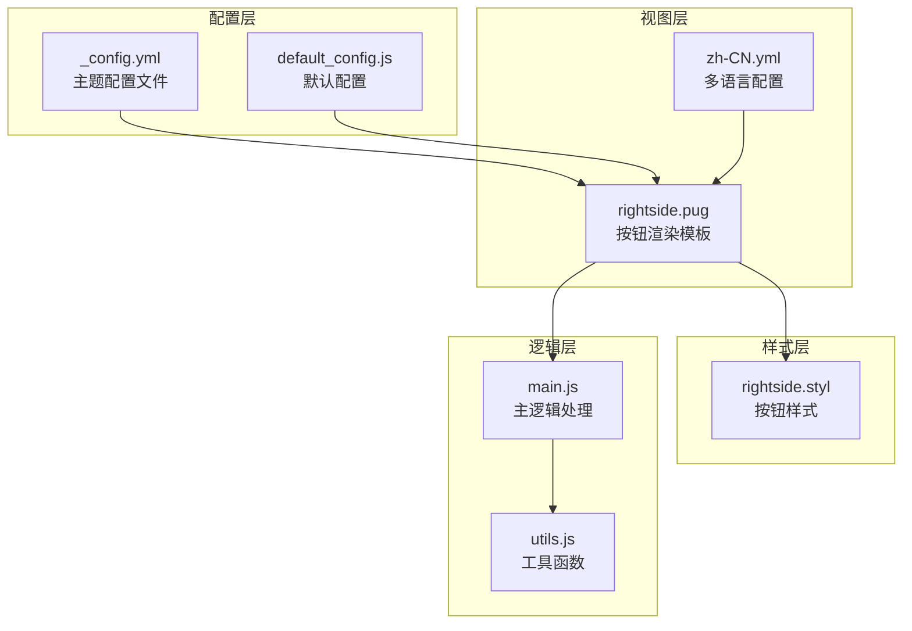
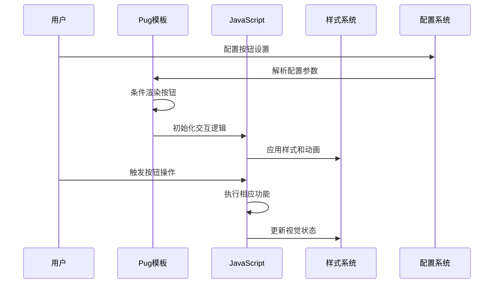
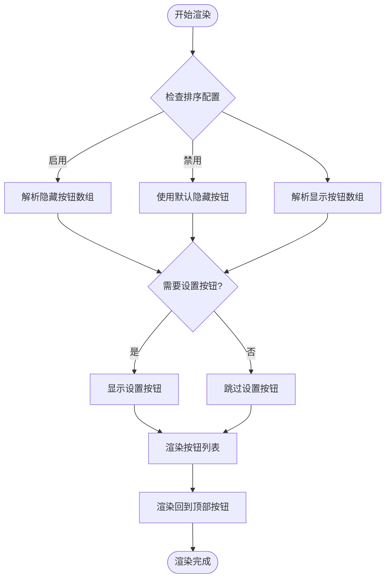
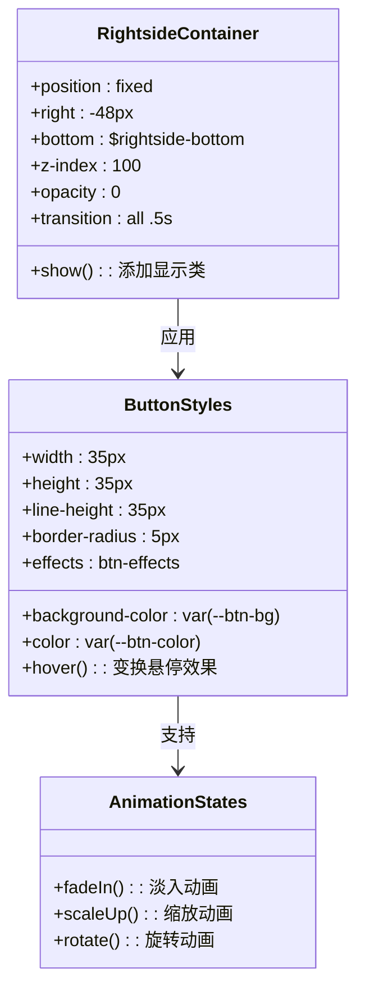
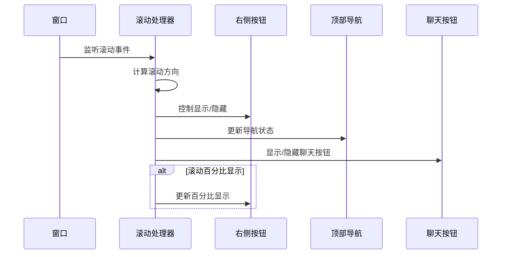
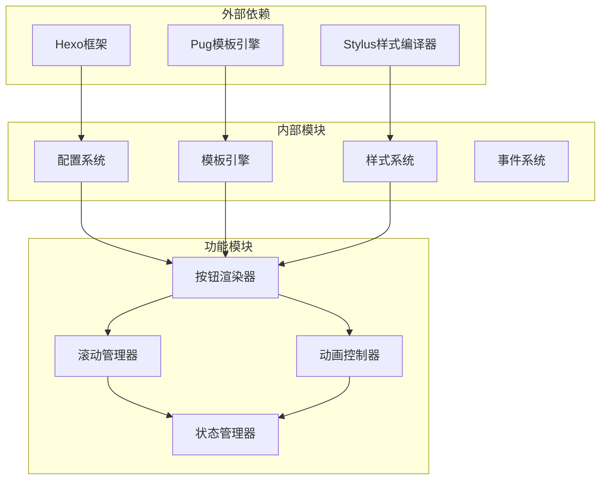

# 底部右键按钮配置

<cite>
**本文档引用的文件**
- [_config.yml](file://themes/butterfly/_config.yml)
- [rightside.pug](file://themes/butterfly/layout/includes/rightside.pug)
- [rightside.styl](file://themes/butterfly/source/css/_layout/rightside.styl)
- [default_config.js](file://themes/butterfly/scripts/common/default_config.js)
- [zh-CN.yml](file://themes/butterfly/languages/zh-CN.yml)
- [main.js](file://themes/butterfly/source/js/main.js)
- [utils.js](file://themes/butterfly/source/js/utils.js)
</cite>

## 目录
1. [简介](#简介)
2. [项目结构](#项目结构)
3. [核心组件](#核心组件)
4. [架构概览](#架构概览)
5. [详细组件分析](#详细组件分析)
6. [依赖关系分析](#依赖关系分析)
7. [性能考虑](#性能考虑)
8. [故障排除指南](#故障排除指南)
9. [结论](#结论)

## 简介

本文档深入解析Hexo主题Butterfly中底部右键按钮的完整配置系统。该系统提供了丰富的交互式功能，包括阅读模式、简繁转换、暗黑模式、侧边栏控制、文章目录导航、聊天服务和评论系统等核心功能按钮。

底部右键按钮系统采用模块化设计，支持灵活的按钮排序控制、条件显示逻辑和动画效果配置。通过配置文件和模板引擎的结合，实现了高度可定制的用户体验。

## 项目结构

底部右键按钮系统的实现涉及多个层次的文件组织：

**图表来源**
- [rightside.pug:1-54](file://themes/butterfly/layout/includes/rightside.pug#L1-L54)
- [rightside.styl:1-109](file://themes/butterfly/source/css/_layout/rightside.styl#L1-L109)
- [default_config.js:208-232](file://themes/butterfly/scripts/common/default_config.js#L208-L232)

**章节来源**
- [rightside.pug:1-54](file://themes/butterfly/layout/includes/rightside.pug#L1-L54)
- [rightside.styl:1-109](file://themes/butterfly/source/css/_layout/rightside.styl#L1-L109)
- [default_config.js:208-232](file://themes/butterfly/scripts/common/default_config.js#L208-L232)

## 核心组件

底部右键按钮系统由以下核心组件构成：

### 配置管理系统
- **基础配置**：位置调整、显示控制、动画设置
- **功能配置**：各功能按钮的启用状态和参数
- **排序配置**：按钮显示顺序的精确控制

### 渲染引擎
- **条件渲染**：基于页面类型和配置状态的动态显示
- **模板系统**：Pug模板引擎实现的按钮生成逻辑
- **国际化支持**：多语言标题和提示文本

### 交互控制系统
- **滚动监听**：智能显示/隐藏逻辑
- **百分比显示**：回到顶部按钮的进度指示
- **动画效果**：平滑的展开收起动画

**章节来源**
- [_config.yml:359-411](file://themes/butterfly/_config.yml#L359-L411)
- [rightside.pug:34-47](file://themes/butterfly/layout/includes/rightside.pug#L34-L47)

## 架构概览

底部右键按钮系统采用分层架构设计，确保了良好的可维护性和扩展性：

**图表来源**
- [rightside.pug:1-54](file://themes/butterfly/layout/includes/rightside.pug#L1-L54)
- [main.js:440-503](file://themes/butterfly/source/js/main.js#L440-L503)

系统架构的关键特点：
- **配置驱动**：所有行为都由配置文件驱动
- **条件渲染**：根据上下文动态决定按钮显示
- **事件驱动**：交互操作通过事件机制处理
- **响应式设计**：适配不同屏幕尺寸和设备

## 详细组件分析

### 配置参数详解

#### 基础位置配置
| 参数名 | 类型 | 默认值 | 描述 |
|--------|------|--------|------|
| rightside_bottom | 数值 | null | 底部按钮距离底部的距离（像素） |
| rightside_scroll_percent | 布尔值 | false | 是否在回到顶部按钮上显示滚动百分比 |

#### 按钮排序控制
| 参数名 | 类型 | 默认值 | 描述 |
|--------|------|--------|------|
| rightside_item_order.enable | 布尔值 | false | 是否启用自定义排序 |
| rightside_item_order.hide | 字符串 | "readmode,translate,darkmode,hideAside" | 隐藏区域的按钮列表 |
| rightside_item_order.show | 字符串 | "toc,chat,comment" | 显示区域的按钮列表 |

#### 动画效果配置
| 参数名 | 类型 | 默认值 | 描述 |
|--------|------|--------|------|
| rightside_config_animation | 布尔值 | true | 设置按钮的旋转动画效果 |

**章节来源**
- [_config.yml:362-410](file://themes/butterfly/_config.yml#L362-L410)
- [default_config.js:208-232](file://themes/butterfly/scripts/common/default_config.js#L208-L232)

### 功能按钮配置

#### 阅读模式按钮 (readmode)
- **启用条件**：全局配置为true且当前页面为文章页
- **图标**：书本打开图标
- **功能**：切换到专注阅读模式
- **配置路径**：`readmode: true`

#### 简繁转换按钮 (translate)
- **启用条件**：简繁转换功能已启用
- **文本内容**：根据默认编码自动切换
- **图标**：语言转换图标
- **配置参数**：
  - `enable: false` - 启用简繁转换
  - `default: "繁"` - 默认显示文本
  - `defaultEncoding: 2` - 默认语言编码

#### 暗黑模式按钮 (darkmode)
- **启用条件**：暗黑模式功能启用且按钮可见
- **图标**：调节盘图标
- **功能**：切换日间/夜间模式
- **配置参数**：
  - `enable: true` - 启用暗黑模式
  - `button: true` - 显示切换按钮
  - `autoChangeMode: false` - 自动切换模式

#### 侧边栏隐藏按钮 (hideAside)
- **启用条件**：侧边栏功能启用且按钮可见
- **图标**：水平箭头图标
- **功能**：切换单栏/双栏布局
- **配置路径**：`aside.button: true`

#### 文章目录按钮 (toc)
- **启用条件**：文章包含目录内容
- **图标**：列表图标
- **功能**：显示/隐藏文章目录
- **移动端适配**：仅在小屏幕设备显示

#### 聊天按钮 (chat)
- **启用条件**：聊天服务配置且启用右侧按钮
- **图标**：消息图标
- **功能**：集成第三方聊天服务
- **配置参数**：
  - `rightside_button: false` - 启用右侧聊天按钮
  - `button_hide_show: false` - 滚动时显示/隐藏

#### 评论按钮 (comment)
- **启用条件**：评论系统已加载
- **图标**：评论图标
- **功能**：跳转到评论区域
- **目标定位**：自动滚动到评论区

**章节来源**
- [rightside.pug:6-32](file://themes/butterfly/layout/includes/rightside.pug#L6-L32)
- [_config.yml:379-397](file://themes/butterfly/_config.yml#L379-L397)

### 渲染逻辑分析

底部按钮的渲染采用条件判断和数组遍历相结合的方式：

**图表来源**
- [rightside.pug:34-50](file://themes/butterfly/layout/includes/rightside.pug#L34-L50)

**章节来源**
- [rightside.pug:34-50](file://themes/butterfly/layout/includes/rightside.pug#L34-L50)

### 样式系统分析

底部按钮的样式系统采用CSS变量和响应式设计：

**图表来源**
- [rightside.styl:1-109](file://themes/butterfly/source/css/_layout/rightside.styl#L1-L109)

关键样式特性：
- **CSS变量支持**：使用`var(--btn-bg)`等变量实现主题定制
- **响应式设计**：针对不同屏幕尺寸的适配
- **过渡动画**：平滑的显示/隐藏效果
- **悬停效果**：鼠标悬停时的颜色变化

**章节来源**
- [rightside.styl:1-109](file://themes/butterfly/source/css/_layout/rightside.styl#L1-L109)

### 交互逻辑分析

滚动监听和按钮状态管理是系统的核心交互逻辑：

**图表来源**
- [main.js:440-503](file://themes/butterfly/source/js/main.js#L440-L503)

**章节来源**
- [main.js:440-503](file://themes/butterfly/source/js/main.js#L440-L503)

## 依赖关系分析

底部右键按钮系统的依赖关系体现了清晰的分层架构：

**图表来源**
- [rightside.pug:1-54](file://themes/butterfly/layout/includes/rightside.pug#L1-L54)
- [default_config.js:1-602](file://themes/butterfly/scripts/common/default_config.js#L1-L602)

**章节来源**
- [rightside.pug:1-54](file://themes/butterfly/layout/includes/rightside.pug#L1-L54)
- [default_config.js:1-602](file://themes/butterfly/scripts/common/default_config.js#L1-L602)

## 性能考虑

### 渲染优化
- **条件渲染**：仅在必要时渲染按钮，减少DOM节点数量
- **懒加载**：评论按钮采用延迟加载策略
- **虚拟滚动**：长列表内容的优化处理

### 事件处理优化
- **节流处理**：滚动事件使用300ms节流间隔
- **事件委托**：统一的事件处理机制
- **内存管理**：PJAX页面切换时清理事件监听

### 样式优化
- **CSS变量**：减少重复样式定义
- **硬件加速**：关键动画使用transform属性
- **最小重绘**：优化的布局计算策略

## 故障排除指南

### 常见问题及解决方案

#### 按钮不显示
**可能原因**：
- 配置文件中相关功能被禁用
- 页面类型不匹配导致条件渲染失败
- CSS样式冲突

**解决步骤**：
1. 检查配置文件中的对应功能开关
2. 验证页面类型是否满足显示条件
3. 检查浏览器开发者工具中的样式覆盖

#### 滚动百分比不显示
**可能原因**：
- `rightside_scroll_percent`配置为false
- 滚动事件监听异常
- 样式计算错误

**解决步骤**：
1. 确认配置项已启用
2. 检查JavaScript控制台是否有错误
3. 验证CSS动画相关的样式规则

#### 动画效果异常
**可能原因**：
- CSS变量未正确设置
- 浏览器兼容性问题
- 动画冲突

**解决步骤**：
1. 检查CSS变量定义
2. 测试不同浏览器的兼容性
3. 禁用其他动画效果排查冲突

**章节来源**
- [rightside.styl:59-109](file://themes/butterfly/source/css/_layout/rightside.styl#L59-L109)
- [main.js:425-435](file://themes/butterfly/source/js/main.js#L425-L435)

## 结论

底部右键按钮系统展现了现代前端开发的最佳实践，通过配置驱动的设计理念实现了高度的灵活性和可维护性。系统的关键优势包括：

### 设计优势
- **模块化架构**：清晰的分层设计便于维护和扩展
- **配置驱动**：所有行为都可通过配置文件控制
- **响应式设计**：适配多种设备和屏幕尺寸
- **性能优化**：合理的渲染和事件处理策略

### 扩展性特点
- **插件化设计**：易于添加新的功能按钮
- **主题定制**：通过CSS变量实现深度定制
- **国际化支持**：完整的多语言配置体系
- **无障碍访问**：符合Web标准的可访问性设计

该系统为用户提供了丰富而直观的交互体验，同时保持了代码的简洁性和可维护性，是Hexo主题开发的优秀范例。