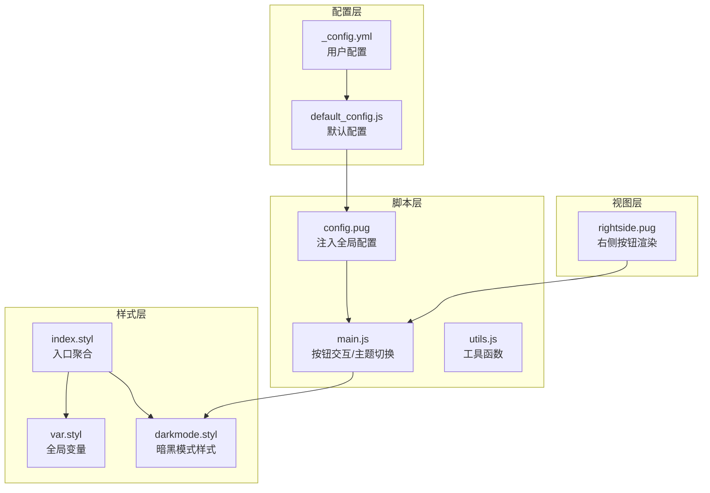
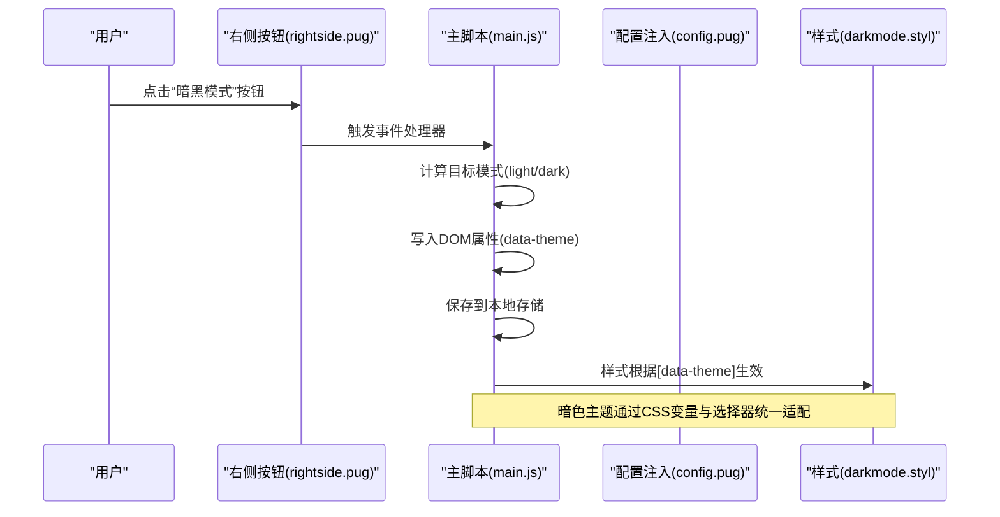
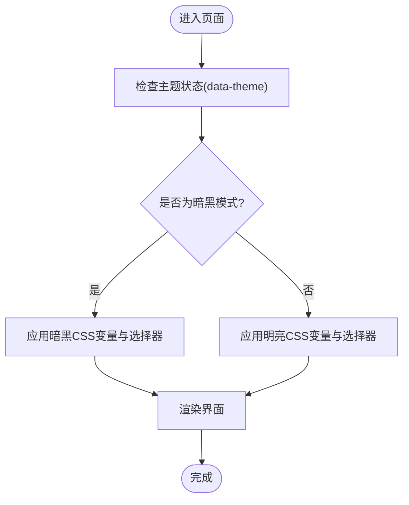
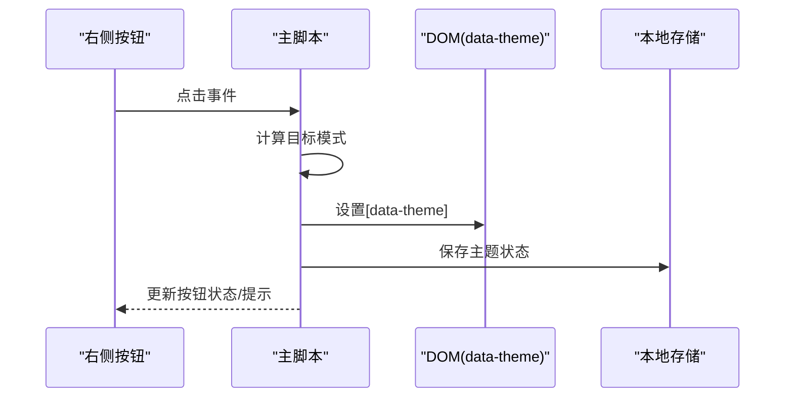
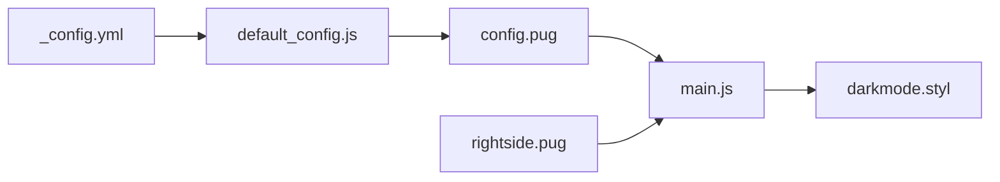

# 暗黑模式配置

<cite>
**本文引用的文件**
- [_config.yml](file://themes/butterfly/_config.yml)
- [default_config.js](file://themes/butterfly/scripts/common/default_config.js)
- [darkmode.styl](file://themes/butterfly/source/css/_mode/darkmode.styl)
- [var.styl](file://themes/butterfly/source/css/var.styl)
- [index.styl](file://themes/butterfly/source/css/index.styl)
- [main.js](file://themes/butterfly/source/js/main.js)
- [utils.js](file://themes/butterfly/source/js/utils.js)
- [rightside.pug](file://themes/butterfly/layout/includes/rightside.pug)
- [config.pug](file://themes/butterfly/layout/includes/head/config.pug)
</cite>

## 目录
1. [简介](#简介)
2. [项目结构](#项目结构)
3. [核心组件](#核心组件)
4. [架构总览](#架构总览)
5. [详细组件分析](#详细组件分析)
6. [依赖关系分析](#依赖关系分析)
7. [性能考量](#性能考量)
8. [故障排查指南](#故障排查指南)
9. [结论](#结论)
10. [附录](#附录)

## 简介
本文件系统性梳理 Butterfly 主题的暗黑模式配置体系，覆盖以下关键点：
- 启用/禁用开关（enable）
- 按钮显示控制（button）
- 自动切换模式（autoChangeMode）及其三种模式
- 时间段设置（start、end）
- 按钮位置与样式定制
- 主题适配、CSS 变量定制与跨设备兼容最佳实践

目标是帮助读者在不深入源码的情况下，也能正确配置并扩展暗黑模式。

## 项目结构
与暗黑模式相关的关键文件分布如下：
- 配置层：主题配置文件与默认配置脚本
- 样式层：全局变量与暗黑模式样式
- 脚本层：页面初始化、按钮交互与自动切换逻辑
- 视图层：右侧悬浮按钮的渲染与条件展示

**图表来源**
- [_config.yml](file://themes/butterfly/_config.yml)
- [default_config.js](file://themes/butterfly/scripts/common/default_config.js)
- [index.styl](file://themes/butterfly/source/css/index.styl)
- [var.styl](file://themes/butterfly/source/css/var.styl)
- [darkmode.styl](file://themes/butterfly/source/css/_mode/darkmode.styl)
- [config.pug](file://themes/butterfly/layout/includes/head/config.pug)
- [main.js](file://themes/butterfly/source/js/main.js)
- [utils.js](file://themes/butterfly/source/js/utils.js)
- [rightside.pug](file://themes/butterfly/layout/includes/rightside.pug)

**章节来源**
- [_config.yml](file://themes/butterfly/_config.yml)
- [default_config.js](file://themes/butterfly/scripts/common/default_config.js)
- [index.styl](file://themes/butterfly/source/css/index.styl)
- [var.styl](file://themes/butterfly/source/css/var.styl)
- [darkmode.styl](file://themes/butterfly/source/css/_mode/darkmode.styl)
- [config.pug](file://themes/butterfly/layout/includes/head/config.pug)
- [main.js](file://themes/butterfly/source/js/main.js)
- [utils.js](file://themes/butterfly/source/js/utils.js)
- [rightside.pug](file://themes/butterfly/layout/includes/rightside.pug)

## 核心组件
- 用户配置（_config.yml）
  - enable：启用/禁用暗黑模式
  - button：是否显示“切换暗黑/明亮”按钮
  - autoChangeMode：自动切换模式（1=跟随系统；2=固定时间段；false=手动）
  - start/end：时间段起止（小时，0-24）
- 默认配置（default_config.js）
  - 提供默认值，确保未配置时行为一致
- 样式（darkmode.styl、var.styl、index.styl）
  - 使用 CSS 变量与[data-theme='dark']统一管理暗色主题
- 脚本（main.js、utils.js、config.pug）
  - 注入全局配置（如 autoDarkmode），处理按钮点击与主题切换，保存到本地存储
- 视图（rightside.pug）
  - 条件渲染“暗黑模式”按钮，并支持排序/隐藏/显示

**章节来源**
- [_config.yml](file://themes/butterfly/_config.yml)
- [default_config.js](file://themes/butterfly/scripts/common/default_config.js)
- [darkmode.styl](file://themes/butterfly/source/css/_mode/darkmode.styl)
- [var.styl](file://themes/butterfly/source/css/var.styl)
- [index.styl](file://themes/butterfly/source/css/index.styl)
- [config.pug](file://themes/butterfly/layout/includes/head/config.pug)
- [main.js](file://themes/butterfly/source/js/main.js)
- [utils.js](file://themes/butterfly/source/js/utils.js)
- [rightside.pug](file://themes/butterfly/layout/includes/rightside.pug)

## 架构总览
暗黑模式从“配置 → 注入 → 渲染 → 切换 → 样式应用”的闭环流程如下：

**图表来源**
- [rightside.pug](file://themes/butterfly/layout/includes/rightside.pug)
- [main.js](file://themes/butterfly/source/js/main.js)
- [darkmode.styl](file://themes/butterfly/source/css/_mode/darkmode.styl)

**章节来源**
- [rightside.pug](file://themes/butterfly/layout/includes/rightside.pug)
- [main.js](file://themes/butterfly/source/js/main.js)
- [darkmode.styl](file://themes/butterfly/source/css/_mode/darkmode.styl)

## 详细组件分析

### 配置项详解
- enable（启用/禁用）
  - 控制是否允许暗黑模式生效
- button（按钮显示）
  - 控制是否在右侧悬浮栏显示“暗黑模式”按钮
- autoChangeMode（自动切换模式）
  - 1：跟随系统深色模式（若系统不支持，则退化为时间段模式）
  - 2：固定时间段模式（由 start/end 决定）
  - false：仅手动切换（需点击按钮）
- start/end（时间段设置）
  - 单位：小时（0-24），用于时间段模式的夜间时段判定

上述配置来源于用户配置文件与默认配置脚本，最终被注入到前端全局配置中参与运行时逻辑。

**章节来源**
- [_config.yml](file://themes/butterfly/_config.yml)
- [default_config.js](file://themes/butterfly/scripts/common/default_config.js)
- [config.pug](file://themes/butterfly/layout/includes/head/config.pug)

### 自动切换模式的三种模式
- 跟随系统设置（autoChangeMode: 1）
  - 优先使用系统深色偏好；若系统不支持深色模式，则回退到时间段模式
- 固定时间段切换（autoChangeMode: 2）
  - 在 start 到 end 的时间段内启用暗黑模式，其余时间启用明亮模式
- 手动切换（autoChangeMode: false）
  - 不进行自动切换，仅通过按钮手动切换

注意：具体的时间段判定与系统偏好监听逻辑在当前上下文中未直接暴露于单一文件，但配置入口与按钮交互已明确。

**章节来源**
- [_config.yml](file://themes/butterfly/_config.yml)
- [config.pug](file://themes/butterfly/layout/includes/head/config.pug)
- [main.js](file://themes/butterfly/source/js/main.js)

### 按钮位置与样式定制
- 按钮位置
  - 右侧悬浮栏（rightside），按钮在渲染时受配置控制
- 按钮显示控制
  - 由配置中的 darkmode.enable 与 darkmode.button 共同决定
- 样式定制
  - 暗黑模式样式通过 CSS 变量与[data-theme='dark']选择器集中管理
  - 可结合主题颜色配置（theme_color.*）与全局变量（var.styl）进行统一风格定制

**章节来源**
- [rightside.pug](file://themes/butterfly/layout/includes/rightside.pug)
- [darkmode.styl](file://themes/butterfly/source/css/_mode/darkmode.styl)
- [var.styl](file://themes/butterfly/source/css/var.styl)

### 主题适配与CSS变量定制
- CSS变量驱动
  - 暗黑模式通过[data-theme='dark']作用于大量CSS变量，统一调整背景、文字、边框、滚动条等
- 样式组织
  - index.styl 聚合引入全局样式、页面样式、布局样式、标签插件样式与模式样式
- 适配范围
  - 评论区、代码块、侧栏、导航、提示卡片、第三方组件等均按暗色主题进行适配

**图表来源**
- [index.styl](file://themes/butterfly/source/css/index.styl)
- [darkmode.styl](file://themes/butterfly/source/css/_mode/darkmode.styl)
- [var.styl](file://themes/butterfly/source/css/var.styl)

**章节来源**
- [index.styl](file://themes/butterfly/source/css/index.styl)
- [darkmode.styl](file://themes/butterfly/source/css/_mode/darkmode.styl)
- [var.styl](file://themes/butterfly/source/css/var.styl)

### 按钮交互与切换流程
- 右侧按钮渲染
  - 根据配置动态生成“暗黑模式”按钮
- 点击切换
  - 切换目标模式（light/dark），写入DOM属性并保存到本地存储
  - 触发主题变更回调，通知评论系统等模块同步主题

**图表来源**
- [rightside.pug](file://themes/butterfly/layout/includes/rightside.pug)
- [main.js](file://themes/butterfly/source/js/main.js)

**章节来源**
- [rightside.pug](file://themes/butterfly/layout/includes/rightside.pug)
- [main.js](file://themes/butterfly/source/js/main.js)

## 依赖关系分析
- 配置依赖
  - 用户配置文件与默认配置共同决定运行时行为
- 运行时依赖
  - 配置注入（config.pug）将配置映射到前端全局对象
  - 主脚本读取全局配置并执行切换逻辑
  - 样式层依据 data-theme 与 CSS 变量生效
- 视图依赖
  - 右侧按钮的显示与否取决于配置与页面类型

**图表来源**
- [_config.yml](file://themes/butterfly/_config.yml)
- [default_config.js](file://themes/butterfly/scripts/common/default_config.js)
- [config.pug](file://themes/butterfly/layout/includes/head/config.pug)
- [main.js](file://themes/butterfly/source/js/main.js)
- [darkmode.styl](file://themes/butterfly/source/css/_mode/darkmode.styl)
- [rightside.pug](file://themes/butterfly/layout/includes/rightside.pug)

**章节来源**
- [_config.yml](file://themes/butterfly/_config.yml)
- [default_config.js](file://themes/butterfly/scripts/common/default_config.js)
- [config.pug](file://themes/butterfly/layout/includes/head/config.pug)
- [main.js](file://themes/butterfly/source/js/main.js)
- [darkmode.styl](file://themes/butterfly/source/css/_mode/darkmode.styl)
- [rightside.pug](file://themes/butterfly/layout/includes/rightside.pug)

## 性能考量
- 样式层面
  - 使用 CSS 变量与选择器集中管理，避免重复计算与重绘
- 交互层面
  - 按钮点击切换采用轻量级 DOM 属性变更与本地存储，避免复杂动画
- 自动切换
  - 若启用系统跟随或时间段模式，建议合理设置更新频率，避免频繁重绘

[本节为通用指导，无需特定文件引用]

## 故障排查指南
- 暗黑模式按钮不显示
  - 检查配置：darkmode.enable 与 darkmode.button 是否开启
  - 检查视图：rightside.pug 中的条件渲染逻辑
- 切换无效或立即恢复
  - 检查本地存储是否被清理或受限
  - 检查 data-theme 属性是否被其他脚本覆盖
- 自动切换不符合预期
  - 检查 autoChangeMode 配置与时间段设置
  - 确认系统深色模式状态与浏览器支持情况

**章节来源**
- [rightside.pug](file://themes/butterfly/layout/includes/rightside.pug)
- [main.js](file://themes/butterfly/source/js/main.js)
- [utils.js](file://themes/butterfly/source/js/utils.js)

## 结论
通过“配置 → 注入 → 渲染 → 切换 → 样式”的清晰链路，Butterfly 主题实现了灵活且可扩展的暗黑模式体系。用户可通过少量配置项实现从手动到自动的多种模式，并借助 CSS 变量与全局样式实现一致的主题适配。建议在生产环境中结合系统偏好与时间段策略，平衡用户体验与性能表现。

[本节为总结性内容，无需特定文件引用]

## 附录
- 快速对照表
  - enable：控制是否启用暗黑模式
  - button：控制是否显示按钮
  - autoChangeMode：1=跟随系统；2=固定时间段；false=手动
  - start/end：时间段起止（小时，0-24）

[本节为补充信息，无需特定文件引用]