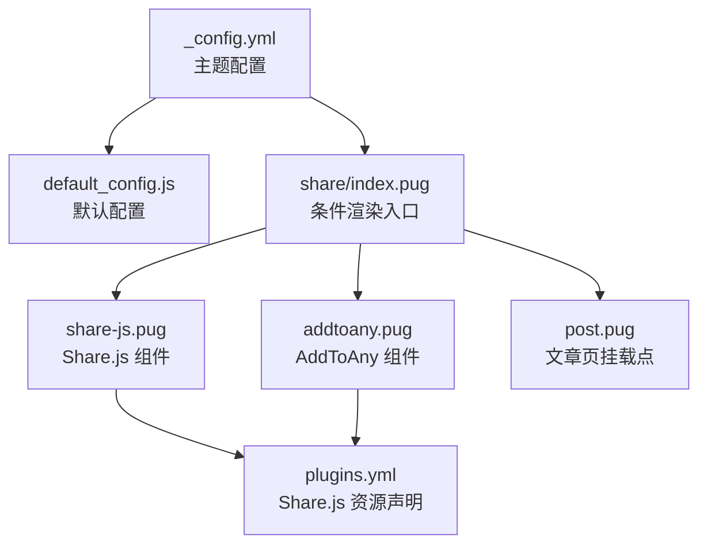
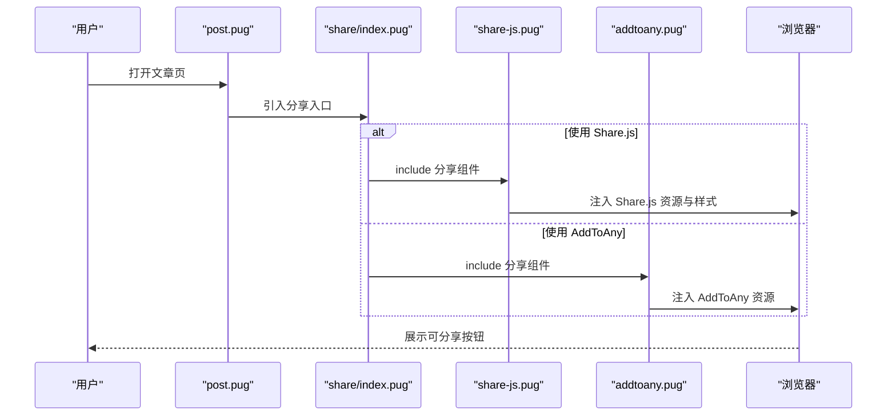
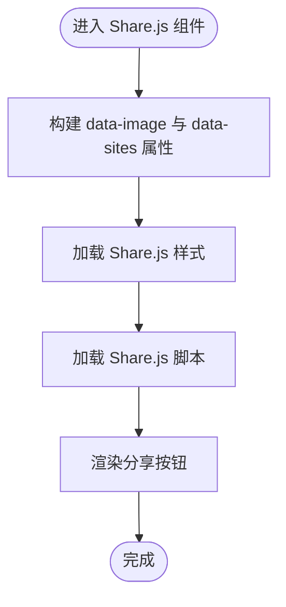
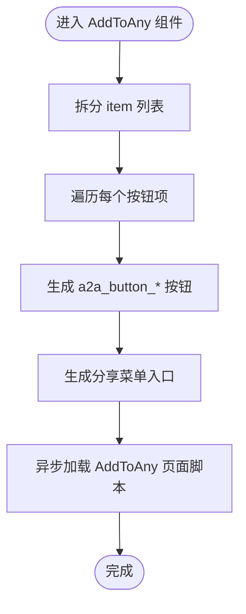
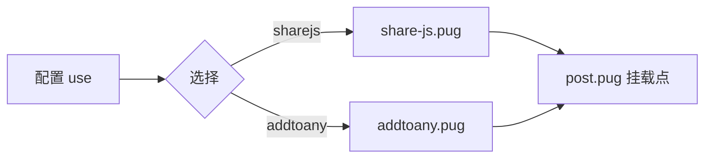
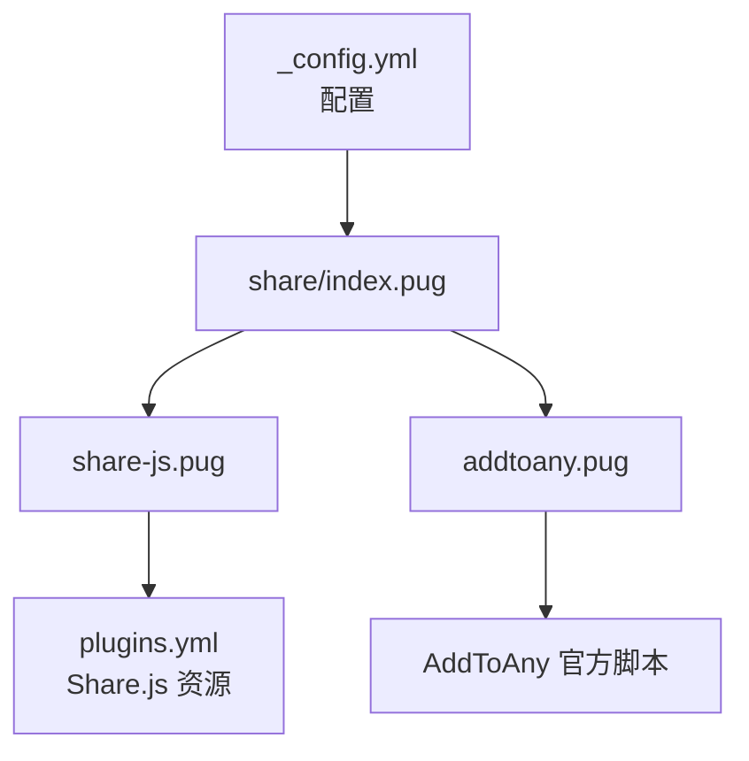

# 社交分享配置

<cite>
**本文引用的文件**
- [_config.yml](file://themes/butterfly/_config.yml)
- [default_config.js](file://themes/butterfly/scripts/common/default_config.js)
- [plugins.yml](file://themes/butterfly/plugins.yml)
- [index.pug](file://themes/butterfly/layout/includes/third-party/share/index.pug)
- [share-js.pug](file://themes/butterfly/layout/includes/third-party/share/share-js.pug)
- [addtoany.pug](file://themes/butterfly/layout/includes/third-party/share/addtoany.pug)
- [post.pug](file://themes/butterfly/layout/post.pug)
</cite>

## 目录
1. [简介](#简介)
2. [项目结构](#项目结构)
3. [核心组件](#核心组件)
4. [架构总览](#架构总览)
5. [详细组件分析](#详细组件分析)
6. [依赖关系分析](#依赖关系分析)
7. [性能考虑](#性能考虑)
8. [故障排查指南](#故障排查指南)
9. [结论](#结论)
10. [附录](#附录)

## 简介
本文件面向使用 Butterfly 主题的 Hexo 博客作者，系统性梳理社交分享功能的配置与实现。重点覆盖以下方面：
- 分享平台选择：支持 Share.js 与 AddToAny 两种方案
- 分享按钮配置：站点列表与按钮项列表
- 分享服务提供商设置：CDN 资源路径与加载策略
- 两种分享服务的差异与适用场景
- 样式定制、位置调整与主题适配
- 隐私设置、性能优化与多平台兼容的最佳实践

## 项目结构
社交分享功能由主题配置驱动，通过模板片段按需渲染。核心文件分布如下：
- 配置层：主题配置文件与默认配置脚本
- 渲染层：Pug 模板根据配置动态输出分享组件
- 资产层：通过插件配置声明第三方资源路径

图表来源
- [_config.yml:510-527](file://themes/butterfly/_config.yml#L510-L527)
- [default_config.js:291-299](file://themes/butterfly/scripts/common/default_config.js#L291-L299)
- [index.pug:1-9](file://themes/butterfly/layout/includes/third-party/share/index.pug#L1-L9)
- [share-js.pug:1-4](file://themes/butterfly/layout/includes/third-party/share/share-js.pug#L1-L4)
- [addtoany.pug:1-11](file://themes/butterfly/layout/includes/third-party/share/addtoany.pug#L1-L11)
- [plugins.yml:169-176](file://themes/butterfly/plugins.yml#L169-L176)
- [post.pug:14-19](file://themes/butterfly/layout/post.pug#L14-L19)

章节来源
- [_config.yml:510-527](file://themes/butterfly/_config.yml#L510-L527)
- [default_config.js:291-299](file://themes/butterfly/scripts/common/default_config.js#L291-L299)
- [index.pug:1-9](file://themes/butterfly/layout/includes/third-party/share/index.pug#L1-L9)
- [share-js.pug:1-4](file://themes/butterfly/layout/includes/third-party/share/share-js.pug#L1-L4)
- [addtoany.pug:1-11](file://themes/butterfly/layout/includes/third-party/share/addtoany.pug#L1-L11)
- [plugins.yml:169-176](file://themes/butterfly/plugins.yml#L169-L176)
- [post.pug:14-19](file://themes/butterfly/layout/post.pug#L14-L19)

## 核心组件
- 分享系统开关与模式选择
  - 在主题配置中通过字段选择分享方式，支持 sharejs 与 addtoany；留空则不启用分享。
- Share.js 配置
  - 支持的站点列表在 sharejs.sites 中配置，以逗号分隔。
- AddToAny 配置
  - 支持的按钮项在 addtoany.item 中配置，以逗号分隔。
- 默认配置与回退
  - 若未在主题配置中显式设置，将采用默认配置脚本中的默认值。

章节来源
- [_config.yml:513-526](file://themes/butterfly/_config.yml#L513-L526)
- [default_config.js:291-299](file://themes/butterfly/scripts/common/default_config.js#L291-L299)

## 架构总览
分享系统采用“配置驱动 + 条件渲染”的架构：
- 配置层决定使用哪种分享服务
- 模板层根据配置分支渲染对应组件
- 组件层负责注入第三方资源与生成按钮 HTML
- 文章页通过挂载点将分享组件插入到页面合适位置

图表来源
- [post.pug:14-19](file://themes/butterfly/layout/post.pug#L14-L19)
- [index.pug:1-9](file://themes/butterfly/layout/includes/third-party/share/index.pug#L1-L9)
- [share-js.pug:1-4](file://themes/butterfly/layout/includes/third-party/share/share-js.pug#L1-L4)
- [addtoany.pug:1-11](file://themes/butterfly/layout/includes/third-party/share/addtoany.pug#L1-L11)

## 详细组件分析

### Share.js 组件
- 渲染逻辑
  - 通过 data-image 与 data-sites 属性传递封面图与站点列表给 Share.js。
  - 动态引入 Share.js 样式与脚本资源。
- 资源路径
  - 样式与脚本路径由插件配置声明，最终由模板通过 url_for 解析为可用 URL。
- 典型用途
  - 快速集成常见社交平台的分享按钮，适合国内常用平台组合。

图表来源
- [share-js.pug:1-4](file://themes/butterfly/layout/includes/third-party/share/share-js.pug#L1-L4)

章节来源
- [share-js.pug:1-4](file://themes/butterfly/layout/includes/third-party/share/share-js.pug#L1-L4)
- [plugins.yml:169-176](file://themes/butterfly/plugins.yml#L169-L176)

### AddToAny 组件
- 渲染逻辑
  - 将配置中的按钮项拆分为数组，逐个生成对应的 a2a_button_* 按钮元素。
  - 最后插入一个分享菜单入口链接，并异步加载 AddToAny 的页面脚本。
- 典型用途
  - 提供更丰富的平台与按钮样式选项，适合需要灵活扩展的场景。

图表来源
- [addtoany.pug:1-11](file://themes/butterfly/layout/includes/third-party/share/addtoany.pug#L1-L11)

章节来源
- [addtoany.pug:1-11](file://themes/butterfly/layout/includes/third-party/share/addtoany.pug#L1-L11)

### 分享入口与文章页挂载
- 分享入口
  - share/index.pug 根据配置选择渲染 Share.js 或 AddToAny 组件。
- 文章页挂载点
  - post.pug 在文章标签区域下方引入分享入口，确保分享按钮出现在文章内容附近。

图表来源
- [index.pug:1-9](file://themes/butterfly/layout/includes/third-party/share/index.pug#L1-L9)
- [post.pug:14-19](file://themes/butterfly/layout/post.pug#L14-L19)

章节来源
- [index.pug:1-9](file://themes/butterfly/layout/includes/third-party/share/index.pug#L1-L9)
- [post.pug:14-19](file://themes/butterfly/layout/post.pug#L14-L19)

## 依赖关系分析
- 配置依赖
  - share.use 决定渲染分支；share.sharejs.sites 与 share.addtoany.item 决定按钮集合。
- 模板依赖
  - share/index.pug 依赖 share-js.pug 与 addtoany.pug 的存在。
- 资源依赖
  - Share.js 组件依赖 plugins.yml 中的样式与脚本路径声明。
- 运行时依赖
  - AddToAny 组件依赖其官方页面脚本的可用性与网络环境。

图表来源
- [_config.yml:513-526](file://themes/butterfly/_config.yml#L513-L526)
- [index.pug:1-9](file://themes/butterfly/layout/includes/third-party/share/index.pug#L1-L9)
- [share-js.pug:1-4](file://themes/butterfly/layout/includes/third-party/share/share-js.pug#L1-L4)
- [addtoany.pug:1-11](file://themes/butterfly/layout/includes/third-party/share/addtoany.pug#L1-L11)
- [plugins.yml:169-176](file://themes/butterfly/plugins.yml#L169-L176)

章节来源
- [_config.yml:513-526](file://themes/butterfly/_config.yml#L513-L526)
- [index.pug:1-9](file://themes/butterfly/layout/includes/third-party/share/index.pug#L1-L9)
- [share-js.pug:1-4](file://themes/butterfly/layout/includes/third-party/share/share-js.pug#L1-L4)
- [addtoany.pug:1-11](file://themes/butterfly/layout/includes/third-party/share/addtoany.pug#L1-L11)
- [plugins.yml:169-176](file://themes/butterfly/plugins.yml#L169-L176)

## 性能考虑
- 资源加载策略
  - Share.js 脚本采用延迟加载，避免阻塞首屏渲染。
  - AddToAny 脚本采用异步加载，减少对页面性能的影响。
- 样式加载
  - Share.js 样式通过媒体属性切换，确保样式在脚本加载完成后生效。
- 按需启用
  - 仅在需要时开启分享功能，避免不必要的资源请求。
- CDN 与缓存
  - 建议结合主题的 CDN 配置与浏览器缓存策略，提升资源加载效率。

章节来源
- [share-js.pug:2-4](file://themes/butterfly/layout/includes/third-party/share/share-js.pug#L2-L4)
- [addtoany.pug:8-8](file://themes/butterfly/layout/includes/third-party/share/addtoany.pug#L8-L8)
- [_config.yml:513-516](file://themes/butterfly/_config.yml#L513-L516)

## 故障排查指南
- 分享按钮不显示
  - 检查 share.use 是否正确设置且非空。
  - 确认 share.sharejs.sites 或 share.addtoany.item 已配置有效值。
- 资源加载失败
  - 检查 plugins.yml 中 Share.js 资源路径是否正确。
  - 确认网络可访问 AddToAny 官方脚本地址。
- 样式异常
  - 确认 Share.js 样式已正确加载，必要时检查媒体属性切换逻辑。
- 平台不支持
  - Share.js 与 AddToAny 支持的平台列表不同，需根据实际需求选择合适的平台列表。

章节来源
- [_config.yml:513-526](file://themes/butterfly/_config.yml#L513-L526)
- [plugins.yml:169-176](file://themes/butterfly/plugins.yml#L169-L176)
- [share-js.pug:2-4](file://themes/butterfly/layout/includes/third-party/share/share-js.pug#L2-L4)
- [addtoany.pug:8-8](file://themes/butterfly/layout/includes/third-party/share/addtoany.pug#L8-L8)

## 结论
- Share.js 与 AddToAny 各有侧重：前者集成度高、国内平台覆盖广；后者生态丰富、按钮样式灵活。
- 通过配置即可快速切换与定制分享体验，建议结合站点受众与平台特性进行选择。
- 注意资源加载策略与网络环境，确保分享功能在多平台上稳定运行。

## 附录

### 配置项速览
- 分享系统开关与模式
  - 字段：share.use
  - 取值：sharejs | addtoany | 留空（禁用）
  - 默认：sharejs
- Share.js 配置
  - 字段：share.sharejs.sites
  - 示例：facebook,x,wechat,weibo,qq
- AddToAny 配置
  - 字段：share.addtoany.item
  - 示例：facebook,x,wechat,sina_weibo,facebook_messenger,email,copy_link

章节来源
- [_config.yml:513-526](file://themes/butterfly/_config.yml#L513-L526)
- [default_config.js:291-299](file://themes/butterfly/scripts/common/default_config.js#L291-L299)