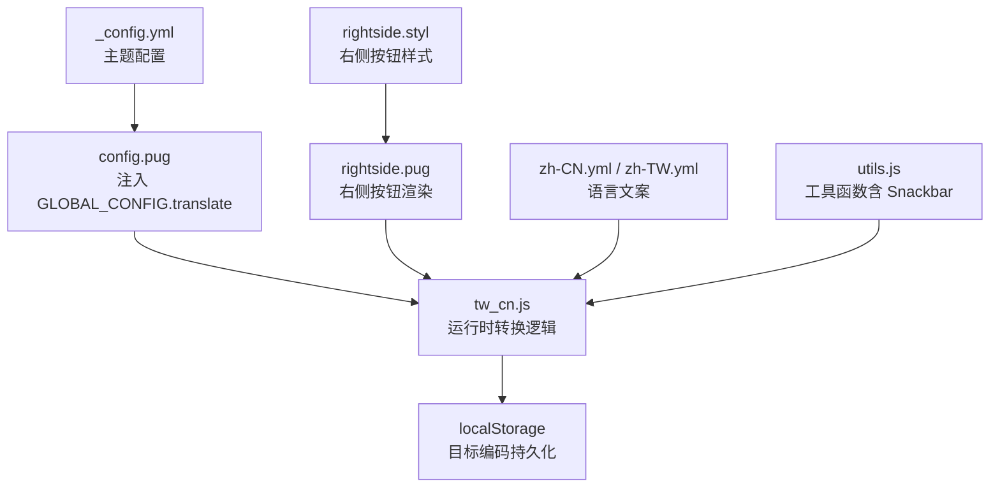
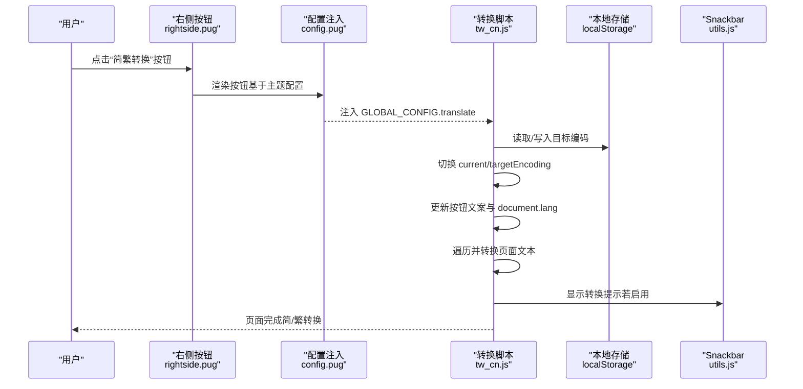
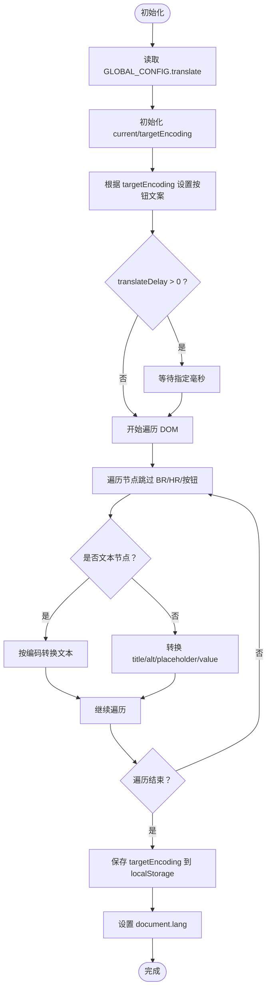
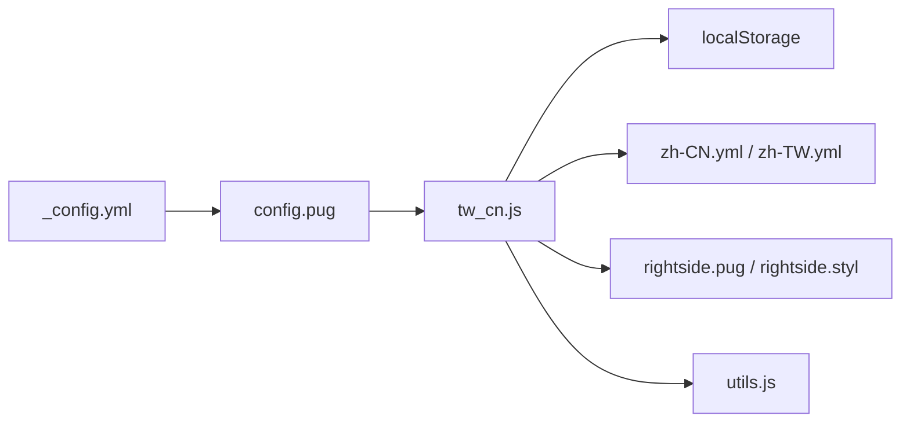

# 简繁转换配置

<cite>
**本文引用的文件**
- [_config.yml](file://themes/butterfly/_config.yml)
- [default_config.js](file://themes/butterfly/scripts/common/default_config.js)
- [tw_cn.js](file://themes/butterfly/source/js/tw_cn.js)
- [config.pug](file://themes/butterfly/layout/includes/head/config.pug)
- [rightside.pug](file://themes/butterfly/layout/includes/rightside.pug)
- [zh-CN.yml](file://themes/butterfly/languages/zh-CN.yml)
- [zh-TW.yml](file://themes/butterfly/languages/zh-TW.yml)
- [utils.js](file://themes/butterfly/source/js/utils.js)
- [rightside.styl](file://themes/butterfly/source/css/_layout/rightside.styl)
</cite>

## 目录
1. [简介](#简介)
2. [项目结构](#项目结构)
3. [核心组件](#核心组件)
4. [架构总览](#架构总览)
5. [详细组件分析](#详细组件分析)
6. [依赖关系分析](#依赖关系分析)
7. [性能考量](#性能考量)
8. [故障排查指南](#故障排查指南)
9. [结论](#结论)
10. [附录](#附录)

## 简介
本文件面向 Hexo 主题 Butterfly 的简繁转换功能，系统性梳理配置项、工作原理、转换规则、语言环境表现、自动转换模式（与简繁转换同域的暗色模式自动切换配置）以及性能优化与多语言最佳实践。读者无需深入前端即可理解如何启用、定制与优化简繁转换体验。

## 项目结构
简繁转换涉及配置、模板注入、运行时脚本与语言文案四个层面：
- 配置层：主题配置文件定义开关、默认编码、按钮文案与延迟等参数
- 模板层：通过 Pug 注入全局配置对象，供前端脚本使用
- 运行时层：前端脚本负责 DOM 遍历、字符映射与状态持久化
- 语言层：多语言文案控制按钮提示与 Snackbar 提示文本

**图表来源**
- [themes/butterfly/_config.yml](file://themes/butterfly/_config.yml)
- [themes/butterfly/layout/includes/head/config.pug](file://themes/butterfly/layout/includes/head/config.pug)
- [themes/butterfly/source/js/tw_cn.js](file://themes/butterfly/source/js/tw_cn.js)
- [themes/butterfly/layout/includes/rightside.pug](file://themes/butterfly/layout/includes/rightside.pug)
- [themes/butterfly/languages/zh-CN.yml](file://themes/butterfly/languages/zh-CN.yml)
- [themes/butterfly/languages/zh-TW.yml](file://themes/butterfly/languages/zh-TW.yml)
- [themes/butterfly/source/js/utils.js](file://themes/butterfly/source/js/utils.js)
- [themes/butterfly/source/css/_layout/rightside.styl](file://themes/butterfly/source/css/_layout/rightside.styl)

**章节来源**
- [themes/butterfly/_config.yml](file://themes/butterfly/_config.yml)
- [themes/butterfly/layout/includes/head/config.pug](file://themes/butterfly/layout/includes/head/config.pug)
- [themes/butterfly/source/js/tw_cn.js](file://themes/butterfly/source/js/tw_cn.js)
- [themes/butterfly/layout/includes/rightside.pug](file://themes/butterfly/layout/includes/rightside.pug)
- [themes/butterfly/languages/zh-CN.yml](file://themes/butterfly/languages/zh-CN.yml)
- [themes/butterfly/languages/zh-TW.yml](file://themes/butterfly/languages/zh-TW.yml)
- [themes/butterfly/source/js/utils.js](file://themes/butterfly/source/js/utils.js)
- [themes/butterfly/source/css/_layout/rightside.styl](file://themes/butterfly/source/css/_layout/rightside.styl)

## 核心组件
- 配置项（主题配置）
  - 启用/禁用：translate.enable
  - 默认语言（编码）：translate.defaultEncoding（1=繁体，2=简体）
  - 按钮文本：translate.default、translate.msgToTraditionalChinese、translate.msgToSimplifiedChinese
  - 转换延迟：translate.translateDelay（毫秒）
- 运行时脚本（tw_cn.js）
  - 解析 GLOBAL_CONFIG.translate
  - 维护当前/目标编码状态
  - DOM 遍历与文本节点转换
  - 按钮文案与 Snackbar 提示联动
- 模板注入（config.pug）
  - 将主题配置序列化为 GLOBAL_CONFIG.translate
- 右侧按钮（rightside.pug）
  - 条件渲染“简繁转换”按钮
- 语言文案（zh-CN.yml / zh-TW.yml）
  - 控制按钮提示与 Snackbar 文案
- 工具函数（utils.js）
  - Snackbar 展示与主题色适配

**章节来源**
- [themes/butterfly/_config.yml](file://themes/butterfly/_config.yml)
- [themes/butterfly/scripts/common/default_config.js](file://themes/butterfly/scripts/common/default_config.js)
- [themes/butterfly/layout/includes/head/config.pug](file://themes/butterfly/layout/includes/head/config.pug)
- [themes/butterfly/source/js/tw_cn.js](file://themes/butterfly/source/js/tw_cn.js)
- [themes/butterfly/layout/includes/rightside.pug](file://themes/butterfly/layout/includes/rightside.pug)
- [themes/butterfly/languages/zh-CN.yml](file://themes/butterfly/languages/zh-CN.yml)
- [themes/butterfly/languages/zh-TW.yml](file://themes/butterfly/languages/zh-TW.yml)
- [themes/butterfly/source/js/utils.js](file://themes/butterfly/source/js/utils.js)

## 架构总览
简繁转换的端到端流程如下：

**图表来源**
- [themes/butterfly/layout/includes/rightside.pug](file://themes/butterfly/layout/includes/rightside.pug)
- [themes/butterfly/layout/includes/head/config.pug](file://themes/butterfly/layout/includes/head/config.pug)
- [themes/butterfly/source/js/tw_cn.js](file://themes/butterfly/source/js/tw_cn.js)
- [themes/butterfly/source/js/utils.js](file://themes/butterfly/source/js/utils.js)

## 详细组件分析

### 配置项详解
- 启用/禁用（translate.enable）
  - 控制是否渲染右侧“简繁转换”按钮与启用转换逻辑
- 默认语言（translate.defaultEncoding）
  - 1 表示繁体（zh-TW），2 表示简体（zh-CN）
  - 初始化时决定页面初始语言属性与按钮文案
- 按钮文本（translate.default、translate.msgToTraditionalChinese、translate.msgToSimplifiedChinese）
  - default：按钮初始显示文本
  - msgToTraditionalChinese：切换至繁体时按钮文本
  - msgToSimplifiedChinese：切换至简体时按钮文本
- 转换延迟（translate.translateDelay）
  - 以毫秒为单位，用于在页面内容完全加载后再执行转换，避免闪烁或遗漏
- 默认值参考
  - 主题默认配置中提供默认值，可在主题配置覆盖

**章节来源**
- [themes/butterfly/_config.yml](file://themes/butterfly/_config.yml)
- [themes/butterfly/scripts/common/default_config.js](file://themes/butterfly/scripts/common/default_config.js)

### 运行时转换逻辑
- 状态管理
  - currentEncoding：当前编码（由 defaultEncoding 决定）
  - targetEncoding：目标编码（来自本地存储或 defaultEncoding）
  - 通过点击按钮在两者之间切换，并持久化到 localStorage
- 文本转换
  - 递归遍历 DOM，跳过特定标签与按钮自身
  - 对文本节点与部分元素属性（title/alt/placeholder/value）进行转换
  - 使用内置字符映射表实现简/繁对照
- 语言属性与提示
  - 切换时同步设置 document.documentElement.lang
  - 若启用 Snackbar，则显示对应提示文案

**图表来源**
- [themes/butterfly/source/js/tw_cn.js](file://themes/butterfly/source/js/tw_cn.js)

**章节来源**
- [themes/butterfly/source/js/tw_cn.js](file://themes/butterfly/source/js/tw_cn.js)

### 模板注入与按钮渲染
- 配置注入（config.pug）
  - 当 translate.enable 为真时，将 defaultEncoding、translateDelay、msgToTraditionalChinese、msgToSimplifiedChinese 注入 GLOBAL_CONFIG.translate
- 按钮渲染（rightside.pug）
  - 条件渲染“简繁转换”按钮，初始文本来自主题配置的 default
- 语言文案（zh-CN.yml / zh-TW.yml）
  - 控制按钮提示文本（如“简繁转换”）

**章节来源**
- [themes/butterfly/layout/includes/head/config.pug](file://themes/butterfly/layout/includes/head/config.pug)
- [themes/butterfly/layout/includes/rightside.pug](file://themes/butterfly/layout/includes/rightside.pug)
- [themes/butterfly/languages/zh-CN.yml](file://themes/butterfly/languages/zh-CN.yml)
- [themes/butterfly/languages/zh-TW.yml](file://themes/butterfly/languages/zh-TW.yml)

### 自动转换模式说明
- 注意：简繁转换配置项中不存在“autoChangeMode”。与之同域的“自动切换暗色模式”配置项位于暗色模式区域，其含义与简繁转换无关。
- 暗色模式自动切换（darkmode.autoChangeMode）
  - 1：跟随系统设置；若系统不支持，则在指定时间段（start/end）自动切换
  - 2：固定时间段自动切换
  - false：关闭自动切换
- 该配置与简繁转换互不影响，但共同出现在主题配置中，易造成混淆。

**章节来源**
- [themes/butterfly/_config.yml](file://themes/butterfly/_config.yml)

## 依赖关系分析
- 配置到脚本的依赖
  - config.pug 将主题配置注入为 GLOBAL_CONFIG.translate，tw_cn.js 读取该对象
- 脚本到存储的依赖
  - tw_cn.js 通过 btf.saveToLocal 读写目标编码，实现跨页面持久化
- 脚本到语言的依赖
  - zh-CN.yml / zh-TW.yml 提供 Snackbar 文案与按钮提示
- 脚本到 UI 的依赖
  - rightside.pug 渲染按钮，rightside.styl 提供样式

**图表来源**
- [themes/butterfly/_config.yml](file://themes/butterfly/_config.yml)
- [themes/butterfly/layout/includes/head/config.pug](file://themes/butterfly/layout/includes/head/config.pug)
- [themes/butterfly/source/js/tw_cn.js](file://themes/butterfly/source/js/tw_cn.js)
- [themes/butterfly/layout/includes/rightside.pug](file://themes/butterfly/layout/includes/rightside.pug)
- [themes/butterfly/source/css/_layout/rightside.styl](file://themes/butterfly/source/css/_layout/rightside.styl)
- [themes/butterfly/languages/zh-CN.yml](file://themes/butterfly/languages/zh-CN.yml)
- [themes/butterfly/languages/zh-TW.yml](file://themes/butterfly/languages/zh-TW.yml)
- [themes/butterfly/source/js/utils.js](file://themes/butterfly/source/js/utils.js)

**章节来源**
- [themes/butterfly/_config.yml](file://themes/butterfly/_config.yml)
- [themes/butterfly/layout/includes/head/config.pug](file://themes/butterfly/layout/includes/head/config.pug)
- [themes/butterfly/source/js/tw_cn.js](file://themes/butterfly/source/js/tw_cn.js)
- [themes/butterfly/layout/includes/rightside.pug](file://themes/butterfly/layout/includes/rightside.pug)
- [themes/butterfly/source/css/_layout/rightside.styl](file://themes/butterfly/source/css/_layout/rightside.styl)
- [themes/butterfly/languages/zh-CN.yml](file://themes/butterfly/languages/zh-CN.yml)
- [themes/butterfly/languages/zh-TW.yml](file://themes/butterfly/languages/zh-TW.yml)
- [themes/butterfly/source/js/utils.js](file://themes/butterfly/source/js/utils.js)

## 性能考量
- 转换延迟（translate.translateDelay）
  - 建议在复杂页面或大段文本场景设置合理延迟，避免首次渲染闪烁
- DOM 遍历范围
  - 脚本已跳过 BR/HR 与按钮自身，尽量减少不必要的处理
- 字符映射效率
  - 使用内置映射表进行字符级转换，避免正则替换带来的额外开销
- 本地存储
  - 仅在按钮切换时写入一次，避免频繁 I/O
- 建议
  - 在高流量站点，可结合缓存策略与延迟加载，进一步降低首屏压力
  - 如需更高效的大规模文本处理，可考虑服务端预转换或按需转换

[本节为通用性能建议，不直接分析具体文件]

## 故障排查指南
- 按钮不显示
  - 检查主题配置中 translate.enable 是否开启
  - 确认 rightside.pug 中条件渲染逻辑生效
- 切换无效
  - 确认 GLOBAL_CONFIG.translate 已被注入（config.pug）
  - 检查浏览器 localStorage 是否可用
- 文案不正确
  - 检查 zh-CN.yml / zh-TW.yml 中 Snackbar 与按钮提示文案
- 转换延迟导致闪烁
  - 适当提高 translate.translateDelay，确保内容完全加载后再执行转换
- 语言属性未更新
  - 确认脚本已设置 document.documentElement.lang 并与目标编码一致

**章节来源**
- [themes/butterfly/layout/includes/rightside.pug](file://themes/butterfly/layout/includes/rightside.pug)
- [themes/butterfly/layout/includes/head/config.pug](file://themes/butterfly/layout/includes/head/config.pug)
- [themes/butterfly/source/js/tw_cn.js](file://themes/butterfly/source/js/tw_cn.js)
- [themes/butterfly/languages/zh-CN.yml](file://themes/butterfly/languages/zh-CN.yml)
- [themes/butterfly/languages/zh-TW.yml](file://themes/butterfly/languages/zh-TW.yml)

## 结论
简繁转换在 Butterfly 主题中通过“配置—注入—脚本—存储—语言”的链路实现，具备良好的可配置性与跨页面持久化能力。遵循本文的配置要点、工作原理与优化建议，可在多语言环境下稳定地提供简繁互转体验。

[本节为总结性内容，不直接分析具体文件]

## 附录

### 配置项速查表
- translate.enable：启用/禁用简繁转换
- translate.defaultEncoding：默认编码（1=繁体，2=简体）
- translate.default：按钮初始文本
- translate.msgToTraditionalChinese：切换至繁体时按钮文本
- translate.msgToSimplifiedChinese：切换至简体时按钮文本
- translate.translateDelay：转换延迟（毫秒）

**章节来源**
- [themes/butterfly/_config.yml](file://themes/butterfly/_config.yml)
- [themes/butterfly/scripts/common/default_config.js](file://themes/butterfly/scripts/common/default_config.js)