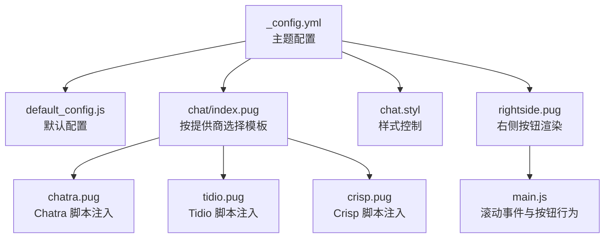
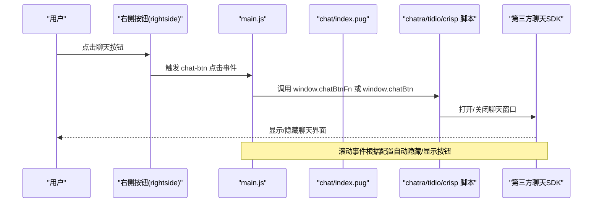
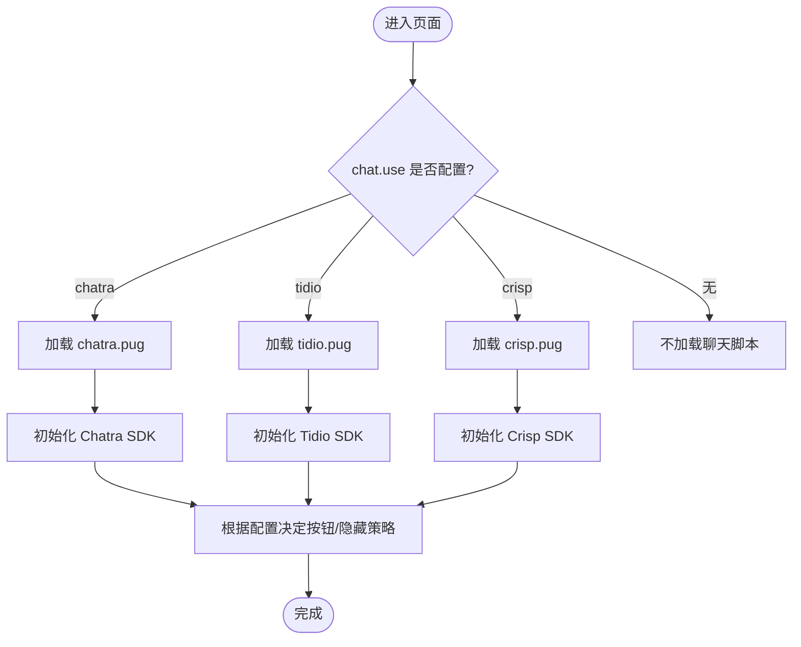
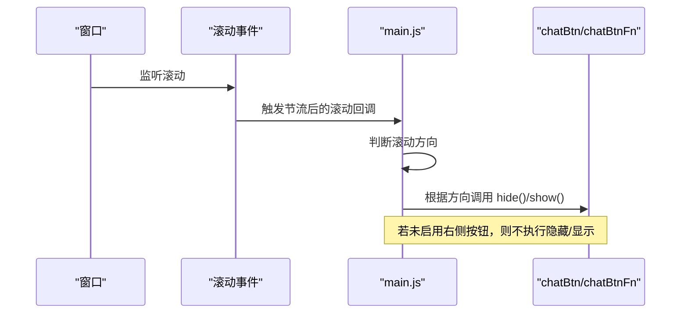
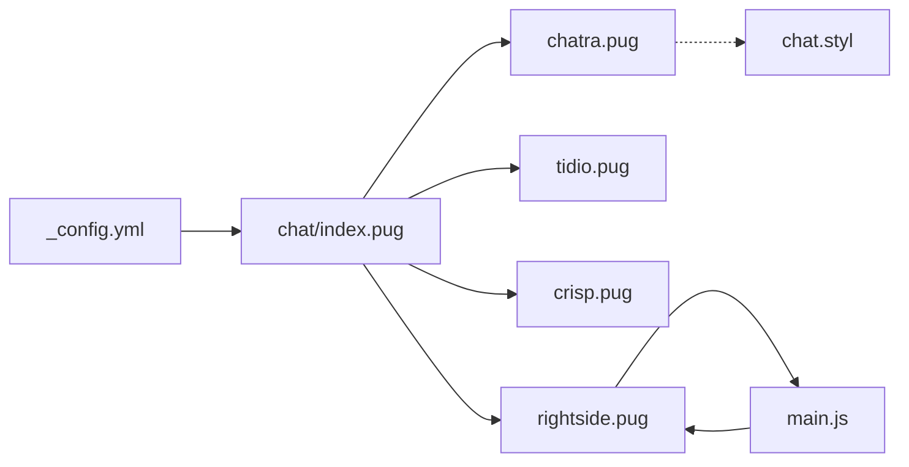

# 聊天服务配置

<cite>
**本文引用的文件**
- [_config.yml](file://themes/butterfly/_config.yml)
- [default_config.js](file://themes/butterfly/scripts/common/default_config.js)
- [chat.styl](file://themes/butterfly/source/css/_layout/chat.styl)
- [main.js](file://themes/butterfly/source/js/main.js)
- [rightside.pug](file://themes/butterfly/layout/includes/rightside.pug)
- [chat/index.pug](file://themes/butterfly/layout/includes/third-party/chat/index.pug)
- [chatra.pug](file://themes/butterfly/layout/includes/third-party/chat/chatra.pug)
- [tidio.pug](file://themes/butterfly/layout/includes/third-party/chat/tidio.pug)
- [crisp.pug](file://themes/butterfly/layout/includes/third-party/chat/crisp.pug)
</cite>

## 目录
1. [简介](#简介)
2. [项目结构](#项目结构)
3. [核心组件](#核心组件)
4. [架构总览](#架构总览)
5. [详细组件分析](#详细组件分析)
6. [依赖关系分析](#依赖关系分析)
7. [性能考虑](#性能考虑)
8. [故障排查指南](#故障排查指南)
9. [结论](#结论)

## 简介
本文件系统性梳理并解读主题中“聊天服务”的完整配置体系，覆盖以下关键点：
- 服务提供商选择：支持 chatra、tidio、crisp 三类第三方聊天服务
- 聊天按钮配置：底部右侧按钮启用、滚动时显示/隐藏行为
- 各平台具体设置：API 密钥与初始化参数差异
- 隐私保护、性能优化与用户体验最佳实践

## 项目结构
围绕聊天服务的相关文件组织如下：
- 配置入口：主题配置文件定义聊天服务开关与按钮行为
- 默认配置：提供未显式配置时的缺省值
- 模板集成：根据配置动态引入对应聊天脚本
- 样式控制：在特定模式下对原生聊天控件进行隐藏或尺寸调整
- 行为控制：通过滚动事件控制聊天按钮的显示/隐藏

**图表来源**
- [_config.yml](file://themes/butterfly/_config.yml)
- [default_config.js](file://themes/butterfly/scripts/common/default_config.js)
- [chat/index.pug](file://themes/butterfly/layout/includes/third-party/chat/index.pug)
- [chatra.pug](file://themes/butterfly/layout/includes/third-party/chat/chatra.pug)
- [tidio.pug](file://themes/butterfly/layout/includes/third-party/chat/tidio.pug)
- [crisp.pug](file://themes/butterfly/layout/includes/third-party/chat/crisp.pug)
- [chat.styl](file://themes/butterfly/source/css/_layout/chat.styl)
- [rightside.pug](file://themes/butterfly/layout/includes/rightside.pug)
- [main.js](file://themes/butterfly/source/js/main.js)

**章节来源**
- [_config.yml](file://themes/butterfly/_config.yml)
- [default_config.js](file://themes/butterfly/scripts/common/default_config.js)
- [chat/index.pug](file://themes/butterfly/layout/includes/third-party/chat/index.pug)
- [chatra.pug](file://themes/butterfly/layout/includes/third-party/chat/chatra.pug)
- [tidio.pug](file://themes/butterfly/layout/includes/third-party/chat/tidio.pug)
- [crisp.pug](file://themes/butterfly/layout/includes/third-party/chat/crisp.pug)
- [chat.styl](file://themes/butterfly/source/css/_layout/chat.styl)
- [rightside.pug](file://themes/butterfly/layout/includes/rightside.pug)
- [main.js](file://themes/butterfly/source/js/main.js)

## 核心组件
- 主题配置区段：定义聊天服务提供商、按钮行为与各平台密钥字段
- 默认配置：当用户未在主题配置中填写时的缺省值
- 模板分发：根据提供商选择加载对应脚本模板
- 样式控制：针对 Chatra 的原生控件在特定模式下的可见性处理
- 右侧按钮与滚动逻辑：统一管理聊天按钮的显示/隐藏与交互

**章节来源**
- [_config.yml](file://themes/butterfly/_config.yml)
- [default_config.js](file://themes/butterfly/scripts/common/default_config.js)
- [chat/index.pug](file://themes/butterfly/layout/includes/third-party/chat/index.pug)
- [chat.styl](file://themes/butterfly/source/css/_layout/chat.styl)
- [rightside.pug](file://themes/butterfly/layout/includes/rightside.pug)
- [main.js](file://themes/butterfly/source/js/main.js)

## 架构总览
聊天服务从“配置—模板—脚本—行为”四个层面协同工作：
- 配置层：确定使用哪个提供商、是否启用右侧按钮、是否启用滚动显示/隐藏
- 模板层：按提供商动态包含对应的脚本注入模板
- 脚本层：加载第三方 SDK，并在需要时暴露统一的 open/close 接口或封装 show/hide
- 行为层：滚动事件驱动聊天按钮的显示/隐藏；点击按钮触发统一的 open/close

**图表来源**
- [rightside.pug](file://themes/butterfly/layout/includes/rightside.pug)
- [main.js](file://themes/butterfly/source/js/main.js)
- [chat/index.pug](file://themes/butterfly/layout/includes/third-party/chat/index.pug)
- [chatra.pug](file://themes/butterfly/layout/includes/third-party/chat/chatra.pug)
- [tidio.pug](file://themes/butterfly/layout/includes/third-party/chat/tidio.pug)
- [crisp.pug](file://themes/butterfly/layout/includes/third-party/chat/crisp.pug)

## 详细组件分析

### 配置项总览与默认值
- 服务提供商选择：chat.use 支持 chatra/tidio/crisp
- 右侧按钮：chat.rightside_button 控制是否启用统一按钮
- 滚动显示/隐藏：chat.button_hide_show 控制滚动时自动隐藏/显示
- 各平台密钥字段：
  - Chatra：chatra.id
  - Tidio：tidio.public_key
  - Crisp：crisp.website_id

默认配置中，上述键位均为空值，表示未启用任何聊天服务。

**章节来源**
- [_config.yml](file://themes/butterfly/_config.yml)
- [default_config.js](file://themes/butterfly/scripts/common/default_config.js)

### 模板分发与脚本注入
- 模板分发：根据 chat.use 的值选择对应的提供商模板
- Chatra：加载 SDK 并在需要时提供 open/close 与 show/hide 封装
- Tidio：通过 window.tidioChatApi 提供 open/show/hide/on 等接口
- Crisp：通过 window.$crisp 提供 push 方法与可见性判断

**图表来源**
- [chat/index.pug](file://themes/butterfly/layout/includes/third-party/chat/index.pug)
- [chatra.pug](file://themes/butterfly/layout/includes/third-party/chat/chatra.pug)
- [tidio.pug](file://themes/butterfly/layout/includes/third-party/chat/tidio.pug)
- [crisp.pug](file://themes/butterfly/layout/includes/third-party/chat/crisp.pug)

**章节来源**
- [chat/index.pug](file://themes/butterfly/layout/includes/third-party/chat/index.pug)
- [chatra.pug](file://themes/butterfly/layout/includes/third-party/chat/chatra.pug)
- [tidio.pug](file://themes/butterfly/layout/includes/third-party/chat/tidio.pug)
- [crisp.pug](file://themes/butterfly/layout/includes/third-party/chat/crisp.pug)

### 聊天按钮与滚动控制
- 右侧按钮渲染：当启用 chat.rightside_button 且已配置提供商时，渲染聊天按钮
- 点击行为：统一通过 window.chatBtnFn 或 window.chatBtn 对象控制打开/关闭
- 滚动控制：滚动时根据配置自动隐藏/显示按钮；若启用右侧按钮，会在滚动方向变化时调用 chatBtn.hide()/show()

**图表来源**
- [rightside.pug](file://themes/butterfly/layout/includes/rightside.pug)
- [main.js](file://themes/butterfly/source/js/main.js)

**章节来源**
- [rightside.pug](file://themes/butterfly/layout/includes/rightside.pug)
- [main.js](file://themes/butterfly/source/js/main.js)

### 各平台配置要点与差异

- Chatra
  - 关键配置：chatra.id
  - 初始化方式：加载 SDK 后通过 Chatra API 控制显示/隐藏与打开
  - 按钮策略：可同时支持“统一按钮”和“滚动显示/隐藏”
  - 样式控制：当启用右侧按钮且使用 Chatra 时，样式层会针对原生控件做尺寸与可见性处理

- Tidio
  - 关键配置：tidio.public_key
  - 初始化方式：通过 window.tidioChatApi 提供 open/show/hide/on 等接口
  - 按钮策略：可同时支持“统一按钮”和“滚动显示/隐藏”

- Crisp
  - 关键配置：crisp.website_id
  - 初始化方式：通过 window.$crisp.push 与可见性判断控制显示/隐藏
  - 按钮策略：可同时支持“统一按钮”和“滚动显示/隐藏”

**章节来源**
- [_config.yml](file://themes/butterfly/_config.yml)
- [chatra.pug](file://themes/butterfly/layout/includes/third-party/chat/chatra.pug)
- [tidio.pug](file://themes/butterfly/layout/includes/third-party/chat/tidio.pug)
- [crisp.pug](file://themes/butterfly/layout/includes/third-party/chat/crisp.pug)
- [chat.styl](file://themes/butterfly/source/css/_layout/chat.styl)

## 依赖关系分析
- 配置到模板：主题配置决定加载哪个提供商模板
- 模板到脚本：模板负责异步加载对应 SDK，并在成功后绑定按钮或隐藏逻辑
- 模板到样式：Chatra 在启用右侧按钮时，样式层会作用于原生控件
- 模板到行为：统一通过 window.chatBtnFn/window.chatBtn 控制聊天窗口
- 行为到滚动：滚动事件根据配置自动隐藏/显示按钮

**图表来源**
- [_config.yml](file://themes/butterfly/_config.yml)
- [chat/index.pug](file://themes/butterfly/layout/includes/third-party/chat/index.pug)
- [chatra.pug](file://themes/butterfly/layout/includes/third-party/chat/chatra.pug)
- [tidio.pug](file://themes/butterfly/layout/includes/third-party/chat/tidio.pug)
- [crisp.pug](file://themes/butterfly/layout/includes/third-party/chat/crisp.pug)
- [chat.styl](file://themes/butterfly/source/css/_layout/chat.styl)
- [rightside.pug](file://themes/butterfly/layout/includes/rightside.pug)
- [main.js](file://themes/butterfly/source/js/main.js)

**章节来源**
- [_config.yml](file://themes/butterfly/_config.yml)
- [chat/index.pug](file://themes/butterfly/layout/includes/third-party/chat/index.pug)
- [chatra.pug](file://themes/butterfly/layout/includes/third-party/chat/chatra.pug)
- [tidio.pug](file://themes/butterfly/layout/includes/third-party/chat/tidio.pug)
- [crisp.pug](file://themes/butterfly/layout/includes/third-party/chat/crisp.pug)
- [chat.styl](file://themes/butterfly/source/css/_layout/chat.styl)
- [rightside.pug](file://themes/butterfly/layout/includes/rightside.pug)
- [main.js](file://themes/butterfly/source/js/main.js)

## 性能考虑
- 异步加载：各提供商脚本通过工具函数异步加载，避免阻塞首屏渲染
- 节流滚动：滚动事件采用节流，降低频繁计算带来的性能压力
- 条件渲染：仅在启用右侧按钮或配置提供商时才渲染按钮与注入脚本
- 按需隐藏：滚动时自动隐藏按钮，减少不必要的 DOM 交互

[本节为通用建议，无需特定文件引用]

## 故障排查指南
- 未显示聊天按钮
  - 检查是否启用 chat.rightside_button 且已配置 chat.use
  - 确认对应提供商的密钥字段已正确填写
  - 查看浏览器控制台是否存在脚本加载失败

- 滚动时不显示/隐藏按钮
  - 检查 chat.button_hide_show 是否启用
  - 确认页面内容高度大于视口高度，否则不会触发显示逻辑

- Chatra 原生控件遮挡或溢出
  - 当启用右侧按钮且使用 Chatra 时，样式层会对原生控件做尺寸与可见性处理
  - 如出现异常，检查样式层条件是否满足

- 第三方 SDK 初始化失败
  - 检查网络连通性与脚本加载路径
  - 确认提供商密钥有效且未被 CSP 策略拦截

**章节来源**
- [_config.yml](file://themes/butterfly/_config.yml)
- [chat.styl](file://themes/butterfly/source/css/_layout/chat.styl)
- [main.js](file://themes/butterfly/source/js/main.js)
- [chatra.pug](file://themes/butterfly/layout/includes/third-party/chat/chatra.pug)
- [tidio.pug](file://themes/butterfly/layout/includes/third-party/chat/tidio.pug)
- [crisp.pug](file://themes/butterfly/layout/includes/third-party/chat/crisp.pug)

## 结论
该聊天服务配置体系以“配置—模板—脚本—行为”四层解耦实现，具备良好的扩展性与可控性：
- 通过统一配置入口选择提供商并控制按钮行为
- 模板层按提供商注入脚本，屏蔽 SDK 差异
- 行为层统一暴露 open/close 接口，配合滚动事件提升可用性
- 样式层在必要时对原生控件进行适配，确保页面布局稳定

建议在生产环境优先启用右侧按钮与滚动显示/隐藏，以获得更佳的移动端体验；同时结合平台隐私政策与合规要求，合理配置数据收集与存储策略。