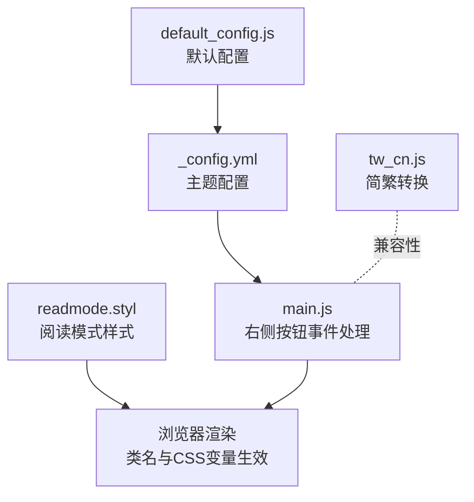
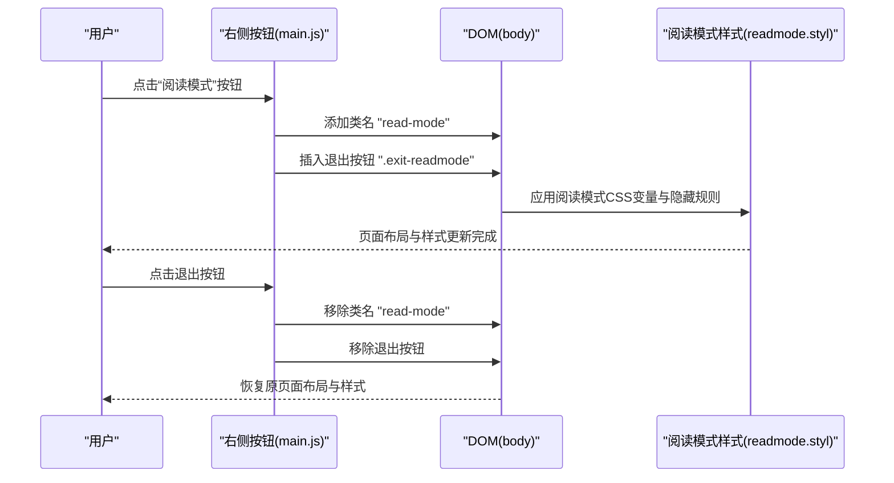
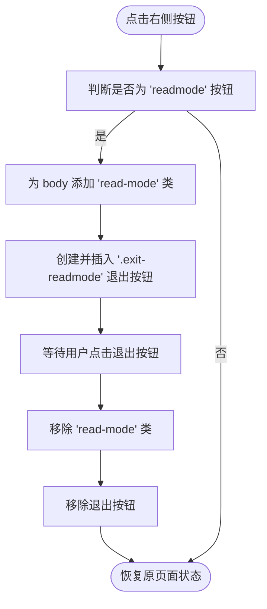
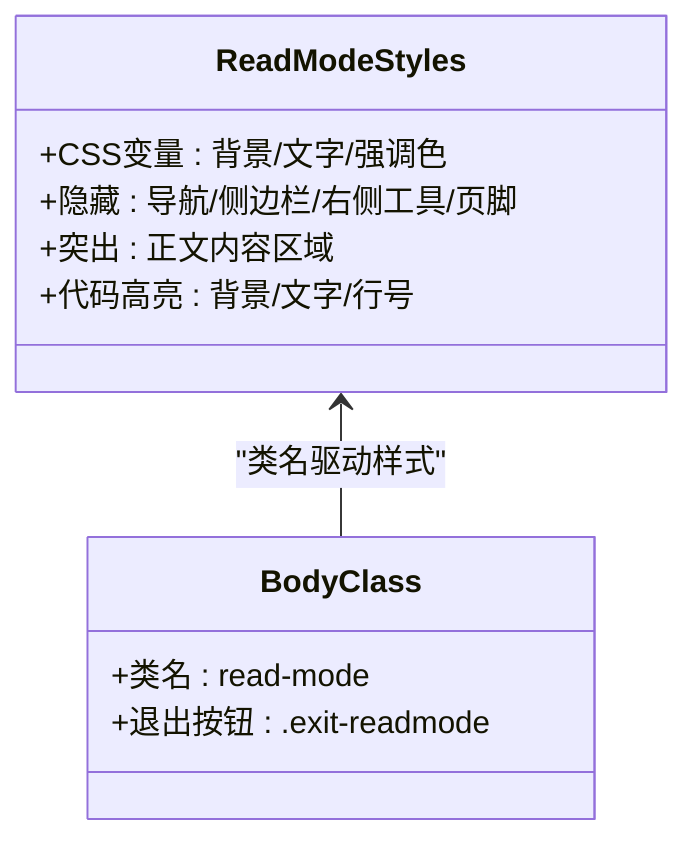
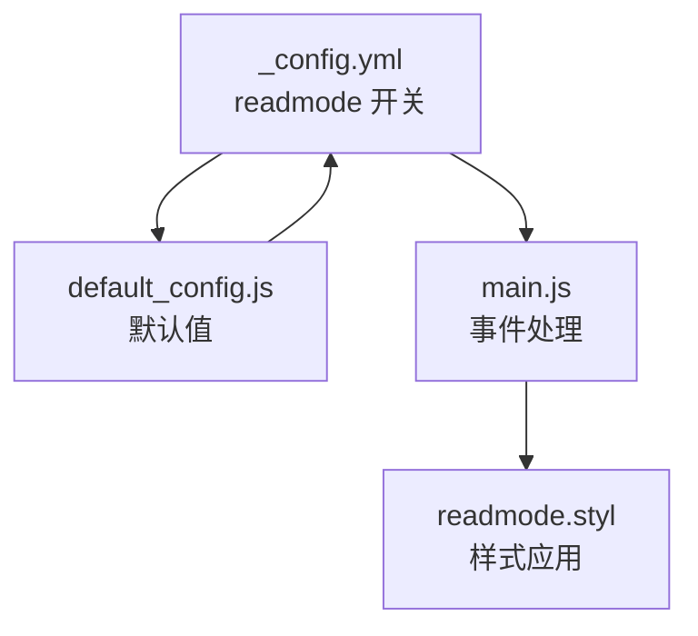

# 阅读模式配置

<cite>
**本文引用的文件**
- [_config.yml](file://themes/butterfly/_config.yml)
- [readmode.styl](file://themes/butterfly/source/css/_mode/readmode.styl)
- [main.js](file://themes/butterfly/source/js/main.js)
- [default_config.js](file://themes/butterfly/scripts/common/default_config.js)
- [tw_cn.js](file://themes/butterfly/source/js/tw_cn.js)
- [post.pug](file://themes/butterfly/layout/post.pug)
</cite>

## 目录
1. [简介](#简介)
2. [项目结构](#项目结构)
3. [核心组件](#核心组件)
4. [架构概览](#架构概览)
5. [详细组件分析](#详细组件分析)
6. [依赖关系分析](#依赖关系分析)
7. [性能考量](#性能考量)
8. [故障排除指南](#故障排除指南)
9. [结论](#结论)
10. [附录](#附录)

## 简介
本文件系统化梳理并解读 Butterfly 主题中的“阅读模式”（readmode）配置与实现，覆盖以下关键维度：
- 启用与禁用配置：如何通过配置文件控制阅读模式开关
- 触发方式：右下角按钮如何触发阅读模式，以及退出机制
- 界面变化效果：阅读模式下的布局、背景、导航、侧边栏、代码高亮等样式调整
- 字体大小与可读性：阅读模式对字号、行高、段落间距的优化策略
- 与其他功能的兼容性：与暗黑模式、简繁转换等的交互与冲突处理
- 用户体验优化：页面布局、背景色、滚动行为、焦点管理等
- 最佳实践与偏好设置建议：如何根据个人需求定制阅读模式

## 项目结构
阅读模式涉及的文件主要分布在配置、样式与前端逻辑三个层面：
- 配置层：主题配置文件中开启/关闭阅读模式
- 样式层：阅读模式专用样式，定义全局变量与目标元素隐藏/显示规则
- 逻辑层：右侧按钮点击事件，动态添加/移除阅读模式类名与退出按钮

**图表来源**
- [_config.yml:379-381](file://themes/butterfly/_config.yml#L379-L381)
- [main.js:646-663](file://themes/butterfly/source/js/main.js#L646-L663)
- [readmode.styl:1-187](file://themes/butterfly/source/css/_mode/readmode.styl#L1-L187)
- [default_config.js:217-218](file://themes/butterfly/scripts/common/default_config.js#L217-L218)
- [tw_cn.js:1-118](file://themes/butterfly/source/js/tw_cn.js#L1-L118)

**章节来源**
- [_config.yml:379-381](file://themes/butterfly/_config.yml#L379-L381)
- [default_config.js:217-218](file://themes/butterfly/scripts/common/default_config.js#L217-L218)

## 核心组件
- 配置开关：在主题配置中设置 readmode，默认值来自默认配置脚本
- 样式模块：通过 CSS 变量与选择器，统一控制阅读模式下的颜色、背景、布局与可见性
- 交互逻辑：右侧按钮点击后，向 body 添加 read-mode 类，并插入一个退出按钮；再次点击退出按钮或页面刷新即可恢复

关键要点：
- 配置项位于主题配置文件中，且默认配置脚本提供默认值
- 样式文件按需加载，仅在配置启用时生效
- 交互逻辑在页面初始化后注册，支持 PJAX 刷新场景

**章节来源**
- [_config.yml:379-381](file://themes/butterfly/_config.yml#L379-L381)
- [default_config.js:217-218](file://themes/butterfly/scripts/common/default_config.js#L217-L218)
- [readmode.styl:1-187](file://themes/butterfly/source/css/_mode/readmode.styl#L1-L187)
- [main.js:646-663](file://themes/butterfly/source/js/main.js#L646-L663)

## 架构概览
阅读模式的运行时架构由“配置 -> 样式 -> 交互”三层组成，形成“配置驱动样式、交互驱动状态”的闭环。

**图表来源**
- [main.js:646-663](file://themes/butterfly/source/js/main.js#L646-L663)
- [readmode.styl:1-187](file://themes/butterfly/source/css/_mode/readmode.styl#L1-L187)

## 详细组件分析

### 配置与默认值
- 主题配置文件提供 readmode 开关项，用于控制是否启用阅读模式
- 默认配置脚本提供默认值，确保未手动配置时仍能正确工作

最佳实践：
- 在主题配置中明确开启/关闭阅读模式，避免依赖默认值
- 若需要全局默认开启，可在自定义配置中设置为 true

**章节来源**
- [_config.yml:379-381](file://themes/butterfly/_config.yml#L379-L381)
- [default_config.js:217-218](file://themes/butterfly/scripts/common/default_config.js#L217-L218)

### 触发机制与交互流程
- 右侧按钮点击事件委托到容器上，命中 id 为 readmode 的处理器
- 处理器执行以下步骤：
  - 为 body 添加 read-mode 类
  - 动态创建并插入退出按钮，点击后移除 read-mode 类并销毁按钮
- 该逻辑在页面初始化完成后注册，支持 PJAX 刷新场景

**图表来源**
- [main.js:646-663](file://themes/butterfly/source/js/main.js#L646-L663)

**章节来源**
- [main.js:646-663](file://themes/butterfly/source/js/main.js#L646-L663)

### 界面变化效果与布局调整
阅读模式通过 CSS 变量与选择器，对页面元素进行统一的视觉与布局调整：

- 背景色与对比度
  - 使用 CSS 变量统一管理背景色与文字色，适配明/暗两种主题
  - 退出按钮采用独立的背景色与悬停色，保证可识别性

- 导航与侧边栏
  - 顶部导航、侧边栏、右侧工具条、页脚等非必要元素被隐藏
  - 仅保留正文区域，最大化阅读焦点

- 文章内容区域
  - 居中布局、透明背景、去除阴影
  - 标题、列表、代码块、引用、标签等元素的颜色与边框按阅读优先原则重新设定

- 代码高亮
  - 代码块背景与文字颜色按主题自动切换
  - 行号、工具栏等细节按阅读模式进行简化

- 其他元素
  - Canvas 绘制元素隐藏
  - 非正文内容（如公告、分类卡片等）隐藏

**图表来源**
- [readmode.styl:1-187](file://themes/butterfly/source/css/_mode/readmode.styl#L1-L187)

**章节来源**
- [readmode.styl:1-187](file://themes/butterfly/source/css/_mode/readmode.styl#L1-L187)

### 字体大小与可读性优化
- 阅读模式通过样式文件统一调整正文区域的字体颜色、背景色与对比度，减少视觉干扰
- 代码块背景与文字颜色按主题切换，提升代码阅读体验
- 列表、标题、引用等元素的边框与背景按阅读优先原则进行简化与统一

注意：
- 阅读模式不直接修改全局字体大小，若需调整可通过主题配置中的字体相关设置进行全局优化

**章节来源**
- [readmode.styl:1-187](file://themes/butterfly/source/css/_mode/readmode.styl#L1-L187)

### 与其他功能的兼容性

#### 与暗黑模式的交互
- 阅读模式使用 CSS 变量统一管理颜色，暗黑模式通过 data-theme 属性切换主题
- 样式文件针对暗黑主题提供对应的变量值，确保在阅读模式下也能保持一致的对比度与可读性

建议：
- 在暗黑模式下启用阅读模式时，优先使用暗黑主题的变量值，以获得更好的阅读体验

**章节来源**
- [readmode.styl:16-29](file://themes/butterfly/source/css/_mode/readmode.styl#L16-L29)

#### 与简繁转换的兼容性
- 简繁转换功能通过独立脚本实现，不影响阅读模式的启用/禁用
- 在阅读模式下，简繁转换仍可正常工作，但不会改变阅读模式的布局与样式

注意事项：
- 若简繁转换导致页面内容变化，建议在切换语言后再进入阅读模式，以避免不必要的重排

**章节来源**
- [tw_cn.js:1-118](file://themes/butterfly/source/js/tw_cn.js#L1-L118)

#### 与页面布局的关系
- 阅读模式仅作用于文章页（post 页面），首页与其它页面不受影响
- 文章页的布局由模板决定，阅读模式通过 CSS 选择器对特定元素进行隐藏/显示

**章节来源**
- [post.pug:1-36](file://themes/butterfly/layout/post.pug#L1-L36)

### 用户体验优化
- 页面布局：隐藏非必要元素，突出正文，提升专注度
- 背景色设置：使用高对比度的背景与文字色，降低长时间阅读疲劳
- 滚动行为：阅读模式不改变滚动行为，但更清晰的布局有助于滚动定位
- 焦点管理：退出按钮固定在右上角，便于快速退出

最佳实践：
- 在阅读长文时启用阅读模式，获得更纯粹的阅读体验
- 结合暗黑模式使用，减少夜间阅读的眩光

**章节来源**
- [readmode.styl:30-86](file://themes/butterfly/source/css/_mode/readmode.styl#L30-L86)
- [main.js:646-663](file://themes/butterfly/source/js/main.js#L646-L663)

## 依赖关系分析
阅读模式的依赖关系如下：
- 配置层依赖默认配置脚本提供默认值
- 样式层依赖配置开关，仅在启用时加载
- 交互层依赖 DOM 结构与事件委托，支持 PJAX 刷新

**图表来源**
- [_config.yml:379-381](file://themes/butterfly/_config.yml#L379-L381)
- [default_config.js:217-218](file://themes/butterfly/scripts/common/default_config.js#L217-L218)
- [main.js:646-663](file://themes/butterfly/source/js/main.js#L646-L663)
- [readmode.styl:1-187](file://themes/butterfly/source/css/_mode/readmode.styl#L1-L187)

**章节来源**
- [_config.yml:379-381](file://themes/butterfly/_config.yml#L379-L381)
- [default_config.js:217-218](file://themes/butterfly/scripts/common/default_config.js#L217-L218)
- [main.js:646-663](file://themes/butterfly/source/js/main.js#L646-L663)
- [readmode.styl:1-187](file://themes/butterfly/source/css/_mode/readmode.styl#L1-L187)

## 性能考量
- 样式按需加载：仅在启用阅读模式时生效，避免对其他页面造成额外渲染负担
- 事件绑定：通过事件委托减少重复绑定，提高交互性能
- PJAX 支持：在页面切换时保持交互逻辑稳定，避免频繁重建 DOM

建议：
- 避免在阅读模式下启用过多动态效果，以免影响阅读流畅性
- 如需全局字体优化，建议通过主题配置统一设置，减少样式重排

[本节为通用指导，无需引用具体文件]

## 故障排除指南
常见问题与解决方案：
- 阅读模式未生效
  - 检查主题配置中 readmode 是否为 true
  - 确认样式文件已正确加载
- 退出按钮无法点击
  - 检查右侧按钮事件是否被其他脚本覆盖
  - 确认 DOM 中存在 .exit-readmode 元素
- 暗黑模式与阅读模式叠加异常
  - 确保 data-theme 属性正确切换
  - 检查 CSS 变量是否按主题正确赋值

**章节来源**
- [main.js:646-663](file://themes/butterfly/source/js/main.js#L646-L663)
- [readmode.styl:16-29](file://themes/butterfly/source/css/_mode/readmode.styl#L16-L29)

## 结论
阅读模式通过“配置驱动 + 样式隔离 + 交互解耦”的设计，在不改变主题整体结构的前提下，为用户提供专注阅读的体验。结合暗黑模式与简繁转换，可进一步满足多样化的阅读偏好。建议在实际使用中根据个人习惯调整字体与对比度，并在夜间或弱光环境下优先启用暗黑模式与阅读模式。

[本节为总结性内容，无需引用具体文件]

## 附录

### 配置项速览
- readmode：控制是否启用阅读模式
- darkmode：控制暗黑模式的启用与自动切换
- translate：控制简繁转换的启用与默认编码

**章节来源**
- [_config.yml:379-381](file://themes/butterfly/_config.yml#L379-L381)
- [_config.yml:365-378](file://themes/butterfly/_config.yml#L365-L378)
- [_config.yml:382-395](file://themes/butterfly/_config.yml#L382-L395)