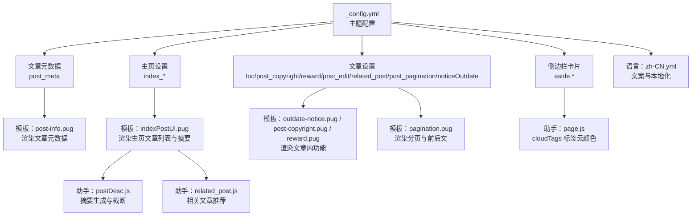
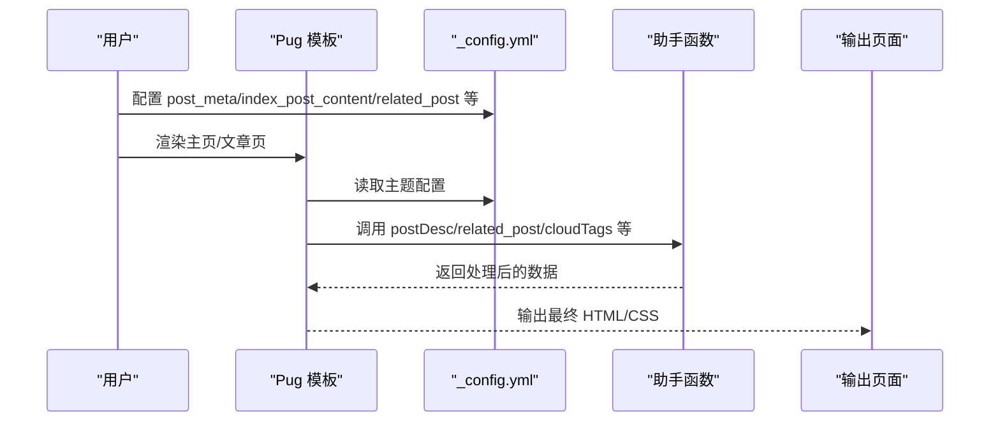
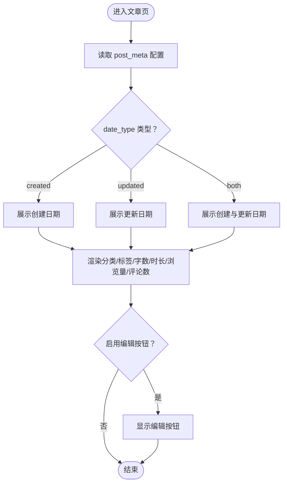
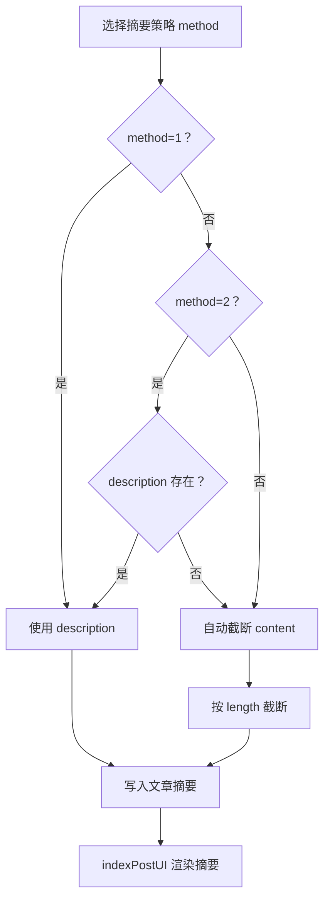
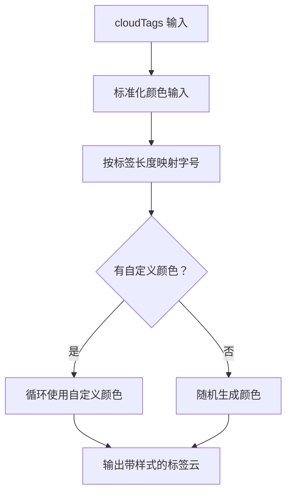
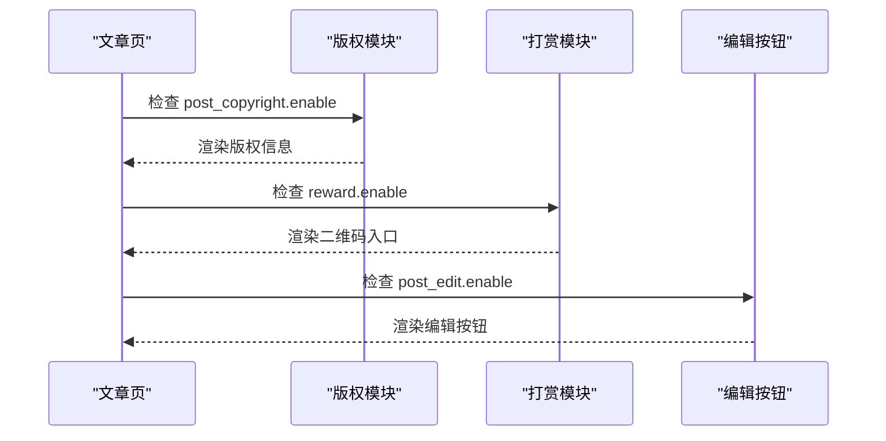
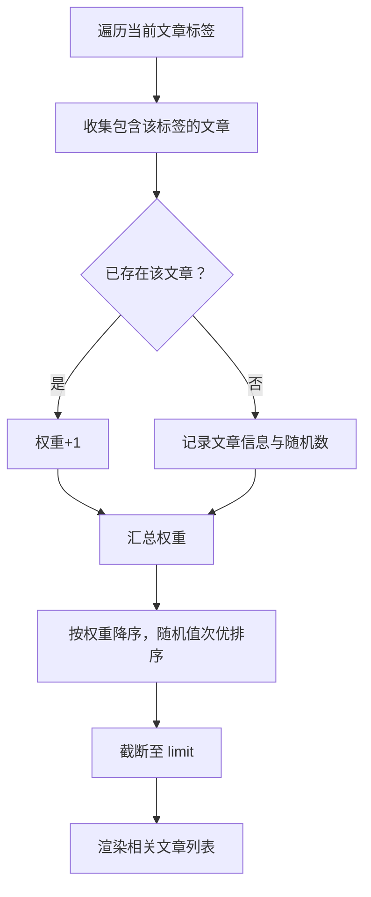
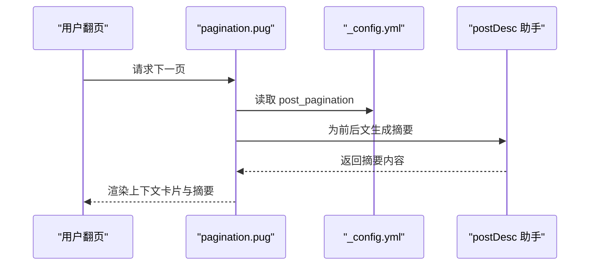
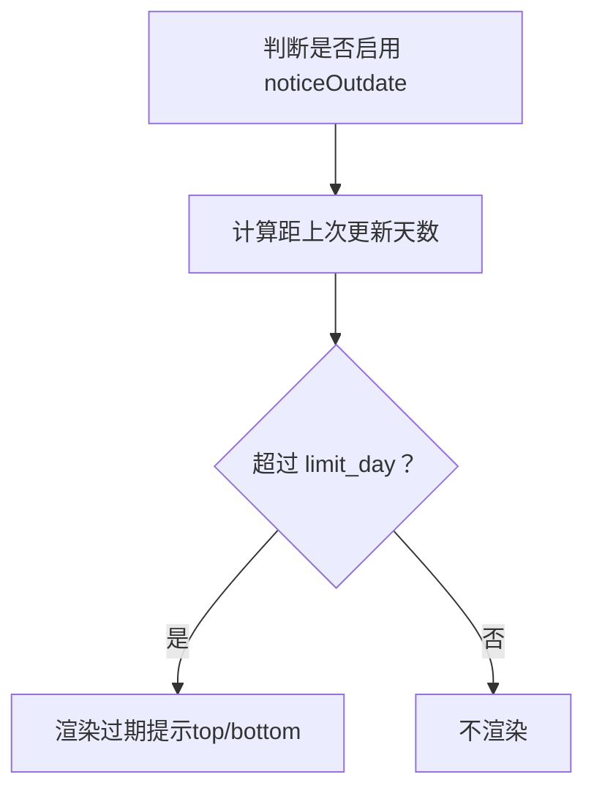
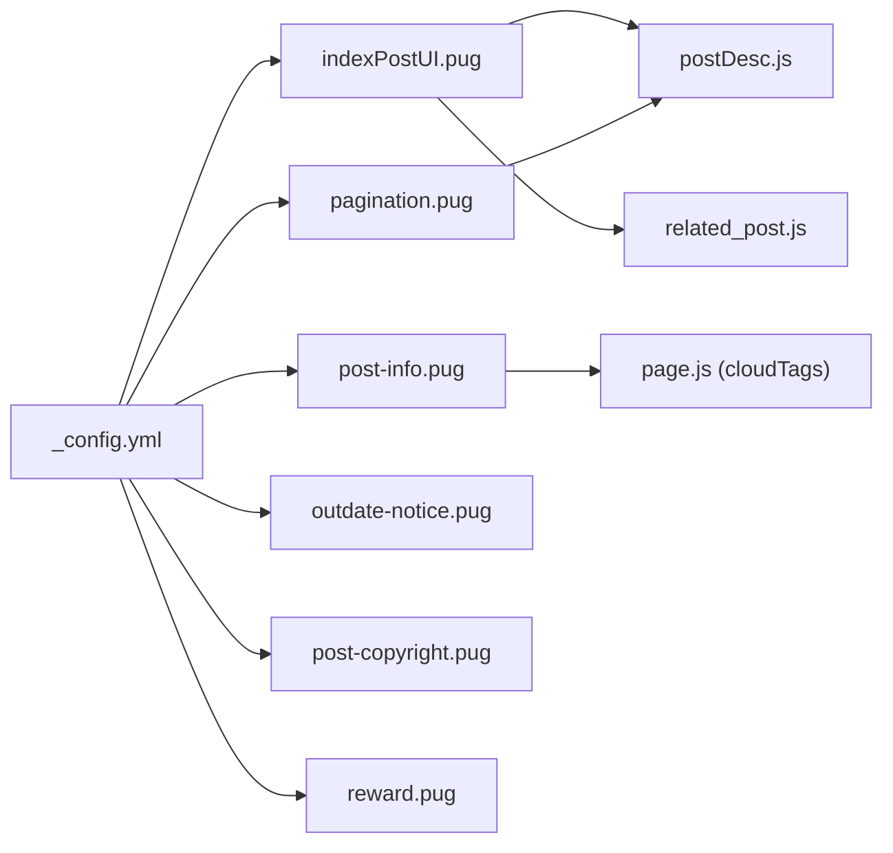

# 内容展示设置

<cite>
**本文引用的文件**
- [_config.yml](file://themes/butterfly/_config.yml)
- [post-info.pug](file://themes/butterfly/layout/includes/header/post-info.pug)
- [indexPostUI.pug](file://themes/butterfly/layout/includes/mixins/indexPostUI.pug)
- [postDesc.js](file://themes/butterfly/scripts/common/postDesc.js)
- [related_post.js](file://themes/butterfly/scripts/helpers/related_post.js)
- [pagination.pug](file://themes/butterfly/layout/includes/pagination.pug)
- [outdate-notice.pug](file://themes/butterfly/layout/includes/post/outdate-notice.pug)
- [post-copyright.pug](file://themes/butterfly/layout/includes/post/post-copyright.pug)
- [reward.pug](file://themes/butterfly/layout/includes/post/reward.pug)
- [page.js](file://themes/butterfly/scripts/helpers/page.js)
- [zh-CN.yml](file://themes/butterfly/languages/zh-CN.yml)
</cite>

## 目录
1. [简介](#简介)
2. [项目结构](#项目结构)
3. [核心组件](#核心组件)
4. [架构总览](#架构总览)
5. [详细组件分析](#详细组件分析)
6. [依赖关系分析](#依赖关系分析)
7. [性能考量](#性能考量)
8. [故障排查指南](#故障排查指南)
9. [结论](#结论)
10. [附录](#附录)

## 简介
本文件面向使用 Butterfly 主题的 Hexo 博客作者，系统化梳理“内容展示设置”的配置与实现机制，覆盖以下方面：
- 文章元数据：日期显示格式、分类/标签显示位置与样式、标签颜色策略
- 主页摘要：生成方式与长度限制
- 文章内功能：版权信息、打赏、编辑按钮、过期提示
- 相关文章推荐、文章分页、过期提示等
- 提供完整配置项清单与可视化图示，帮助快速定位与个性化定制

## 项目结构
围绕内容展示的相关文件主要分布在以下区域：
- 主题配置：_config.yml（全局开关与参数）
- 模板渲染：Pug 混入与包含文件（如 indexPostUI、post-info、pagination、outdate-notice、post-copyright、reward）
- 助手函数：JavaScript（如 postDesc、related_post、cloudTags 等）
- 语言文案：zh-CN.yml（用于国际化文案）

图表来源
- [_config.yml](file://themes/butterfly/_config.yml)
- [post-info.pug](file://themes/butterfly/layout/includes/header/post-info.pug)
- [indexPostUI.pug](file://themes/butterfly/layout/includes/mixins/indexPostUI.pug)
- [postDesc.js](file://themes/butterfly/scripts/common/postDesc.js)
- [related_post.js](file://themes/butterfly/scripts/helpers/related_post.js)
- [pagination.pug](file://themes/butterfly/layout/includes/pagination.pug)
- [outdate-notice.pug](file://themes/butterfly/layout/includes/post/outdate-notice.pug)
- [post-copyright.pug](file://themes/butterfly/layout/includes/post/post-copyright.pug)
- [page.js](file://themes/butterfly/scripts/helpers/page.js)
- [zh-CN.yml](file://themes/butterfly/languages/zh-CN.yml)

章节来源
- [_config.yml](file://themes/butterfly/_config.yml)
- [post-info.pug](file://themes/butterfly/layout/includes/header/post-info.pug)
- [indexPostUI.pug](file://themes/butterfly/layout/includes/mixins/indexPostUI.pug)
- [postDesc.js](file://themes/butterfly/scripts/common/postDesc.js)
- [related_post.js](file://themes/butterfly/scripts/helpers/related_post.js)
- [pagination.pug](file://themes/butterfly/layout/includes/pagination.pug)
- [outdate-notice.pug](file://themes/butterfly/layout/includes/post/outdate-notice.pug)
- [post-copyright.pug](file://themes/butterfly/layout/includes/post/post-copyright.pug)
- [page.js](file://themes/butterfly/scripts/helpers/page.js)
- [zh-CN.yml](file://themes/butterfly/languages/zh-CN.yml)

## 核心组件
- 文章元数据渲染（post-info.pug）：控制文章页的日期类型、相对/绝对时间、分类、标签、字数统计、阅读时长、浏览量、评论数等显示与顺序。
- 主页文章布局与摘要（indexPostUI.pug + postDesc.js）：决定主页文章的封面/信息排版、摘要生成策略与长度限制。
- 相关文章推荐（related_post.js）：基于标签权重排序并限制数量。
- 文章内功能（outdate-notice.pug、post-copyright.pug、reward.pug）：过期提示、版权信息、打赏入口。
- 分页（pagination.pug）：上一页/下一页与摘要联动。
- 标签云颜色（page.js cloudTags）：标签字号与颜色策略。

章节来源
- [post-info.pug](file://themes/butterfly/layout/includes/header/post-info.pug)
- [indexPostUI.pug](file://themes/butterfly/layout/includes/mixins/indexPostUI.pug)
- [postDesc.js](file://themes/butterfly/scripts/common/postDesc.js)
- [related_post.js](file://themes/butterfly/scripts/helpers/related_post.js)
- [pagination.pug](file://themes/butterfly/layout/includes/pagination.pug)
- [outdate-notice.pug](file://themes/butterfly/layout/includes/post/outdate-notice.pug)
- [post-copyright.pug](file://themes/butterfly/layout/includes/post/post-copyright.pug)
- [reward.pug](file://themes/butterfly/layout/includes/post/reward.pug)
- [page.js](file://themes/butterfly/scripts/helpers/page.js)

## 架构总览
内容展示从“配置—模板—助手函数”三层协作完成。配置项在 _config.yml 中定义，模板负责结构与展示，助手函数处理数据计算与逻辑。

图表来源
- [_config.yml](file://themes/butterfly/_config.yml)
- [post-info.pug](file://themes/butterfly/layout/includes/header/post-info.pug)
- [indexPostUI.pug](file://themes/butterfly/layout/includes/mixins/indexPostUI.pug)
- [postDesc.js](file://themes/butterfly/scripts/common/postDesc.js)
- [related_post.js](file://themes/butterfly/scripts/helpers/related_post.js)
- [page.js](file://themes/butterfly/scripts/helpers/page.js)

## 详细组件分析

### 文章元数据配置与显示
- 配置入口：主题配置中的 post_meta 字段，分别针对主页（page）与文章页（post）设置日期类型、日期格式、分类/标签显示、标签位置等。
- 显示逻辑：
  - 文章页：根据 date_type（created/updated/both）与 date_format（date/relative）决定日期展示；分类与标签按配置显示；可叠加字数统计与阅读时长。
  - 主页：同样支持日期类型与分类/标签显示，且可与摘要联动。
- 编辑按钮：当启用 post_edit 时，标题旁出现编辑入口，点击跳转至源码仓库对应路径。
- 评论计数与浏览量：在满足条件时显示评论数或浏览量（依赖评论系统配置）。

图表来源
- [post-info.pug](file://themes/butterfly/layout/includes/header/post-info.pug)
- [_config.yml](file://themes/butterfly/_config.yml)

章节来源
- [_config.yml](file://themes/butterfly/_config.yml)
- [post-info.pug](file://themes/butterfly/layout/includes/header/post-info.pug)
- [zh-CN.yml](file://themes/butterfly/languages/zh-CN.yml)

### 主页文章摘要生成与长度限制
- 生成策略：index_post_content.method 支持三种模式：
  - 1：仅使用文章 description 字段
  - 2：优先 description，不存在则回退到自动截断
  - 3：强制自动截断正文
- 截断逻辑：postDesc.js 使用 hexo-util 的 stripHTML 与 truncate，去除 HTML 标签并将换行替换为空格，再按 length 截断。
- 长度限制：通过 index_post_content.length 控制截断长度。
- 展示位置：indexPostUI.pug 在文章信息下方渲染 content，若存在摘要则显示。

图表来源
- [postDesc.js](file://themes/butterfly/scripts/common/postDesc.js)
- [indexPostUI.pug](file://themes/butterfly/layout/includes/mixins/indexPostUI.pug)
- [_config.yml](file://themes/butterfly/_config.yml)

章节来源
- [_config.yml](file://themes/butterfly/_config.yml)
- [postDesc.js](file://themes/butterfly/scripts/common/postDesc.js)
- [indexPostUI.pug](file://themes/butterfly/layout/includes/mixins/indexPostUI.pug)

### 标签颜色与显示位置
- 标签显示位置：主页与文章页均可通过 post_meta.page/tags 与 post_meta.post/categories/tags 控制是否显示及位置分隔符。
- 标签颜色：
  - 侧边栏标签云：cloudTags 助手支持自定义颜色数组（custom_colors），或随机生成颜色；按标签数量进行字号映射。
  - 文章页标签：直接使用主题默认样式或背景色（由模板渲染）。
- 排序与限制：侧边栏标签云支持 orderby（random/name/length）与 order（asc/desc），以及 limit 限制数量。

图表来源
- [page.js](file://themes/butterfly/scripts/helpers/page.js)
- [indexPostUI.pug](file://themes/butterfly/layout/includes/mixins/indexPostUI.pug)
- [post-info.pug](file://themes/butterfly/layout/includes/header/post-info.pug)

章节来源
- [page.js](file://themes/butterfly/scripts/helpers/page.js)
- [indexPostUI.pug](file://themes/butterfly/layout/includes/mixins/indexPostUI.pug)
- [post-info.pug](file://themes/butterfly/layout/includes/header/post-info.pug)

### 版权信息、打赏与编辑按钮
- 版权信息：当启用 post_copyright 时，文章页底部渲染作者、链接与版权声明，支持自定义许可协议与链接。
- 打赏：启用 reward 后显示二维码入口，支持多组二维码与描述文本。
- 编辑按钮：启用 post_edit 并配置 url 后，在文章标题旁显示编辑入口，点击跳转至源码编辑地址。

图表来源
- [post-copyright.pug](file://themes/butterfly/layout/includes/post/post-copyright.pug)
- [reward.pug](file://themes/butterfly/layout/includes/post/reward.pug)
- [post-info.pug](file://themes/butterfly/layout/includes/header/post-info.pug)
- [_config.yml](file://themes/butterfly/_config.yml)

章节来源
- [_config.yml](file://themes/butterfly/_config.yml)
- [post-copyright.pug](file://themes/butterfly/layout/includes/post/post-copyright.pug)
- [reward.pug](file://themes/butterfly/layout/includes/post/reward.pug)
- [post-info.pug](file://themes/butterfly/layout/includes/header/post-info.pug)

### 相关文章推荐
- 规则：基于标签交集计算权重，相同标签越多权重越高；若权重相同则以随机值微调排序。
- 数量与日期类型：由 related_post.limit 与 related_post.date_type 控制显示数量与日期字段（created/updated）。
- 模板渲染：related_posts 助手返回 HTML 结构，包含封面、日期、标题与摘要（若有）。

图表来源
- [related_post.js](file://themes/butterfly/scripts/helpers/related_post.js)
- [_config.yml](file://themes/butterfly/_config.yml)

章节来源
- [_config.yml](file://themes/butterfly/_config.yml)
- [related_post.js](file://themes/butterfly/scripts/helpers/related_post.js)

### 文章分页与前后文
- 分页方向：post_pagination 支持 1（旧文在前）、2（新文在前）、false（禁用）。
- 模板联动：pagination.pug 根据全局页面类型与配置决定渲染样式，并在存在摘要时附加摘要块。
- 与摘要联动：前后文卡片会尝试注入摘要（postDesc）以增强可读性。

图表来源
- [pagination.pug](file://themes/butterfly/layout/includes/pagination.pug)
- [_config.yml](file://themes/butterfly/_config.yml)
- [postDesc.js](file://themes/butterfly/scripts/common/postDesc.js)

章节来源
- [_config.yml](file://themes/butterfly/_config.yml)
- [pagination.pug](file://themes/butterfly/layout/includes/pagination.pug)
- [postDesc.js](file://themes/butterfly/scripts/common/postDesc.js)

### 过期提示
- 触发条件：启用 noticeOutdate 后，根据文章更新时间与 limit_day 判断是否显示过期提示。
- 位置与样式：position 支持 top/bottom，style 支持 simple/flat。
- 模板：outdate-notice.pug 通过 data 属性传递必要信息，并在指定位置插入提示元素。

图表来源
- [outdate-notice.pug](file://themes/butterfly/layout/includes/post/outdate-notice.pug)
- [_config.yml](file://themes/butterfly/_config.yml)

章节来源
- [_config.yml](file://themes/butterfly/_config.yml)
- [outdate-notice.pug](file://themes/butterfly/layout/includes/post/outdate-notice.pug)

## 依赖关系分析
- 配置依赖：所有展示行为均受 _config.yml 中相应字段控制，模板层仅做渲染，逻辑层通过助手函数实现。
- 模板耦合：indexPostUI.pug 与 post-info.pug 分别负责主页与文章页元数据渲染；pagination.pug 与 outdate-notice.pug 独立负责分页与过期提示。
- 助手函数：postDesc.js 与 related_post.js 作为数据处理层，被模板调用；page.js 的 cloudTags 为标签云提供颜色与尺寸策略。

图表来源
- [_config.yml](file://themes/butterfly/_config.yml)
- [indexPostUI.pug](file://themes/butterfly/layout/includes/mixins/indexPostUI.pug)
- [post-info.pug](file://themes/butterfly/layout/includes/header/post-info.pug)
- [pagination.pug](file://themes/butterfly/layout/includes/pagination.pug)
- [outdate-notice.pug](file://themes/butterfly/layout/includes/post/outdate-notice.pug)
- [post-copyright.pug](file://themes/butterfly/layout/includes/post/post-copyright.pug)
- [reward.pug](file://themes/butterfly/layout/includes/post/reward.pug)
- [postDesc.js](file://themes/butterfly/scripts/common/postDesc.js)
- [related_post.js](file://themes/butterfly/scripts/helpers/related_post.js)
- [page.js](file://themes/butterfly/scripts/helpers/page.js)

章节来源
- [_config.yml](file://themes/butterfly/_config.yml)
- [indexPostUI.pug](file://themes/butterfly/layout/includes/mixins/indexPostUI.pug)
- [post-info.pug](file://themes/butterfly/layout/includes/header/post-info.pug)
- [pagination.pug](file://themes/butterfly/layout/includes/pagination.pug)
- [outdate-notice.pug](file://themes/butterfly/layout/includes/post/outdate-notice.pug)
- [post-copyright.pug](file://themes/butterfly/layout/includes/post/post-copyright.pug)
- [reward.pug](file://themes/butterfly/layout/includes/post/reward.pug)
- [postDesc.js](file://themes/butterfly/scripts/common/postDesc.js)
- [related_post.js](file://themes/butterfly/scripts/helpers/related_post.js)
- [page.js](file://themes/butterfly/scripts/helpers/page.js)

## 性能考量
- 摘要截断：postDesc.js 对 HTML 去除与字符串截断，建议合理设置 index_post_content.length，避免过长导致渲染压力。
- 相关文章：related_post.js 基于标签集合计算权重，标签数量较多时建议控制 related_post.limit，减少排序与渲染开销。
- 评论计数与浏览量：在评论系统懒加载开启时，不会预加载计数脚本，有助于首屏性能。
- 标签云颜色：cloudTags 会为每个标签生成样式，建议限制 limit 并合理设置字体范围，避免过多 DOM 样式计算。

## 故障排查指南
- 摘要未显示
  - 检查 index_post_content.method 是否为 false（禁用摘要）
  - 确认文章是否存在 description 或 content 是否足够长
  - 参考：[postDesc.js](file://themes/butterfly/scripts/common/postDesc.js)，[indexPostUI.pug](file://themes/butterfly/layout/includes/mixins/indexPostUI.pug)
- 标签颜色异常
  - 自定义颜色需为合法颜色值；检查 custom_colors 输入是否规范
  - 参考：[page.js](file://themes/butterfly/scripts/helpers/page.js)
- 编辑按钮不显示
  - 确认 post_edit.enable 已开启且 url 配置正确
  - 参考：[post-info.pug](file://themes/butterfly/layout/includes/header/post-info.pug)，[_config.yml](file://themes/butterfly/_config.yml)
- 过期提示不生效
  - 检查 noticeOutdate.enable、limit_day 与 position 配置
  - 参考：[outdate-notice.pug](file://themes/butterfly/layout/includes/post/outdate-notice.pug)，[_config.yml](file://themes/butterfly/_config.yml)
- 分页方向不符合预期
  - 检查 post_pagination 设置（1/2/false）
  - 参考：[pagination.pug](file://themes/butterfly/layout/includes/pagination.pug)，[_config.yml](file://themes/butterfly/_config.yml)

章节来源
- [postDesc.js](file://themes/butterfly/scripts/common/postDesc.js)
- [indexPostUI.pug](file://themes/butterfly/layout/includes/mixins/indexPostUI.pug)
- [page.js](file://themes/butterfly/scripts/helpers/page.js)
- [post-info.pug](file://themes/butterfly/layout/includes/header/post-info.pug)
- [_config.yml](file://themes/butterfly/_config.yml)
- [outdate-notice.pug](file://themes/butterfly/layout/includes/post/outdate-notice.pug)
- [pagination.pug](file://themes/butterfly/layout/includes/pagination.pug)

## 结论
通过 _config.yml 的集中配置与模板/助手函数的清晰分工，Butterfly 主题实现了对内容展示的高度可定制。建议在生产环境：
- 明确摘要策略与长度，兼顾 SEO 与阅读体验
- 合理设置相关文章数量与日期字段，提升关联质量
- 优化标签云颜色与数量，平衡美观与性能
- 按需启用版权、打赏与编辑按钮，完善文章内功能链路

## 附录

### 配置项速查（节选）
- 文章元数据（post_meta）
  - page：date_type（created/updated/both）、date_format（date/relative）、categories、tags、label
  - post：position（left/center）、date_type/date_format/categories/tags/label
  - 参考：[_config.yml](file://themes/butterfly/_config.yml)
- 主页摘要（index_post_content）
  - method（1/2/3/false）、length
  - 参考：[_config.yml](file://themes/butterfly/_config.yml)
- 文章内功能
  - toc：post/page/number/expand/style_simple/scroll_percent
  - post_copyright：enable/decode/license/license_url/author_href
  - reward：enable/text/QR_code（多组）
  - post_edit：enable/url
  - related_post：enable/limit/date_type
  - post_pagination：1/2/false
  - noticeOutdate：enable/style/limit_day/position/message_prev/message_next
  - 参考：[_config.yml](file://themes/butterfly/_config.yml)

### 实际显示效果说明
- 文章页元数据：按配置显示创建/更新日期、分类、标签、字数、阅读时长、浏览量、评论数；编辑按钮在启用时显示。
- 主页摘要：依据策略与长度生成摘要，支持多种布局（index_layout）与封面/信息组合。
- 标签云：按标签数量映射字号，支持自定义颜色或随机颜色。
- 文章内功能：版权信息、打赏二维码、过期提示按配置显示；分页前后文卡片可带摘要。

章节来源
- [_config.yml](file://themes/butterfly/_config.yml)
- [post-info.pug](file://themes/butterfly/layout/includes/header/post-info.pug)
- [indexPostUI.pug](file://themes/butterfly/layout/includes/mixins/indexPostUI.pug)
- [postDesc.js](file://themes/butterfly/scripts/common/postDesc.js)
- [page.js](file://themes/butterfly/scripts/helpers/page.js)
- [related_post.js](file://themes/butterfly/scripts/helpers/related_post.js)
- [pagination.pug](file://themes/butterfly/layout/includes/pagination.pug)
- [outdate-notice.pug](file://themes/butterfly/layout/includes/post/outdate-notice.pug)
- [post-copyright.pug](file://themes/butterfly/layout/includes/post/post-copyright.pug)
- [reward.pug](file://themes/butterfly/layout/includes/post/reward.pug)
- [zh-CN.yml](file://themes/butterfly/languages/zh-CN.yml)