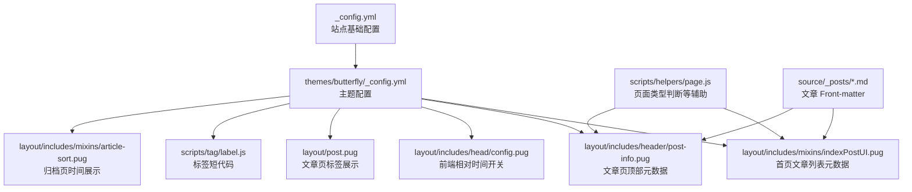
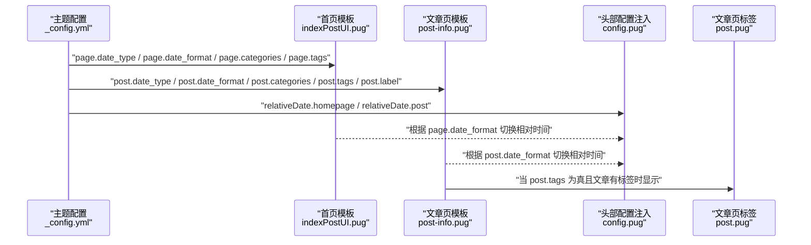
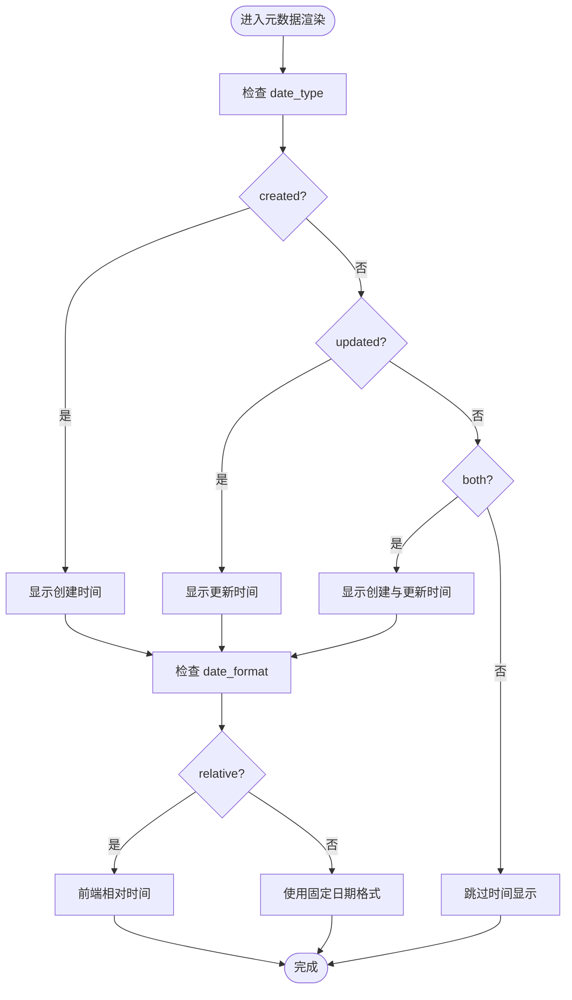
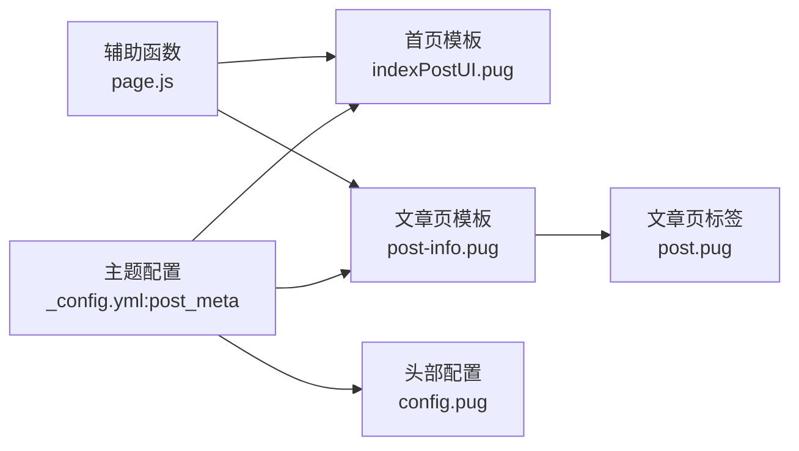

# 文章元数据配置

<cite>
**本文引用的文件**
- [_config.yml](file://_config.yml)
- [themes/butterfly/_config.yml](file://themes/butterfly/_config.yml)
- [themes/butterfly/layout/includes/head/config.pug](file://themes/butterfly/layout/includes/head/config.pug)
- [themes/butterfly/layout/includes/mixins/indexPostUI.pug](file://themes/butterfly/layout/includes/mixins/indexPostUI.pug)
- [themes/butterfly/layout/includes/header/post-info.pug](file://themes/butterfly/layout/includes/header/post-info.pug)
- [themes/butterfly/layout/post.pug](file://themes/butterfly/layout/post.pug)
- [themes/butterfly/scripts/tag/label.js](file://themes/butterfly/scripts/tag/label.js)
- [themes/butterfly/layout/includes/mixins/article-sort.pug](file://themes/butterfly/layout/includes/mixins/article-sort.pug)
- [themes/butterfly/scripts/helpers/page.js](file://themes/butterfly/scripts/helpers/page.js)
- [source/_posts/Vscode-Github-Copilot接入MATLAB.md](file://source/_posts/Vscode-Github-Copilot接入MATLAB.md)
- [source/_posts/Windows系统如何删除nul文件.md](file://source/_posts/Windows系统如何删除nul文件.md)
</cite>

## 目录
1. [简介](#简介)
2. [项目结构](#项目结构)
3. [核心组件](#核心组件)
4. [架构总览](#架构总览)
5. [详细组件分析](#详细组件分析)
6. [依赖关系分析](#依赖关系分析)
7. [性能考量](#性能考量)
8. [故障排除指南](#故障排除指南)
9. [结论](#结论)
10. [附录](#附录)

## 简介
本文件聚焦于 Hexo 主题 Butterfly 的“文章元数据”配置，系统性解析 post_meta 配置段落，涵盖主页与文章页的显示差异；详解 date_type 选项（created/updated/both）对发布时间显示的影响，date_format 选项（date/relative）对时间格式化的作用；解释 categories 与 tags 在不同页面的显示控制，以及 label 参数对标签样式的控制。同时提供完整的配置示例与实际显示效果对比，并说明 Front-matter 中元数据覆盖配置的方法与优先级规则。

## 项目结构
本项目采用 Hexo + Butterfly 主题的典型结构，主题配置位于 themes/butterfly/_config.yml，页面模板位于 themes/butterfly/layout 下，辅助逻辑位于 scripts 目录。文章内容位于 source/_posts 下，采用 Front-matter 定义元数据。

图表来源
- [themes/butterfly/_config.yml:118-138](file://themes/butterfly/_config.yml#L118-L138)
- [themes/butterfly/layout/includes/mixins/indexPostUI.pug:26-61](file://themes/butterfly/layout/includes/mixins/indexPostUI.pug#L26-L61)
- [themes/butterfly/layout/includes/header/post-info.pug:9-53](file://themes/butterfly/layout/includes/header/post-info.pug#L9-L53)
- [themes/butterfly/layout/includes/head/config.pug:98-101](file://themes/butterfly/layout/includes/head/config.pug#L98-L101)
- [themes/butterfly/layout/post.pug:14-19](file://themes/butterfly/layout/post.pug#L14-L19)
- [themes/butterfly/scripts/tag/label.js:1-15](file://themes/butterfly/scripts/tag/label.js#L1-L15)
- [themes/butterfly/layout/includes/mixins/article-sort.pug:19-22](file://themes/butterfly/layout/includes/mixins/article-sort.pug#L19-L22)
- [scripts/helpers/page.js:167-179](file://themes/butterfly/scripts/helpers/page.js#L167-L179)

章节来源
- [themes/butterfly/_config.yml:118-138](file://themes/butterfly/_config.yml#L118-L138)
- [themes/butterfly/layout/includes/mixins/indexPostUI.pug:26-61](file://themes/butterfly/layout/includes/mixins/indexPostUI.pug#L26-L61)
- [themes/butterfly/layout/includes/header/post-info.pug:9-53](file://themes/butterfly/layout/includes/header/post-info.pug#L9-L53)
- [themes/butterfly/layout/includes/head/config.pug:98-101](file://themes/butterfly/layout/includes/head/config.pug#L98-L101)
- [themes/butterfly/layout/post.pug:14-19](file://themes/butterfly/layout/post.pug#L14-L19)
- [themes/butterfly/scripts/tag/label.js:1-15](file://themes/butterfly/scripts/tag/label.js#L1-L15)
- [themes/butterfly/layout/includes/mixins/article-sort.pug:19-22](file://themes/butterfly/layout/includes/mixins/article-sort.pug#L19-L22)
- [themes/butterfly/scripts/helpers/page.js:167-179](file://themes/butterfly/scripts/helpers/page.js#L167-L179)

## 核心组件
- 主题配置入口：themes/butterfly/_config.yml 中的 post_meta 段落，定义主页与文章页的元数据显示策略。
- 首页元数据渲染：layout/includes/mixins/indexPostUI.pug 负责遍历文章并按配置输出日期、分类、标签等。
- 文章页元数据渲染：layout/includes/header/post-info.pug 负责文章页顶部的时间、分类、字数统计等。
- 相对时间开关：layout/includes/head/config.pug 注入前端配置，决定是否启用相对时间显示。
- 标签样式：scripts/tag/label.js 提供标签短代码，配合样式实现自定义标签外观。
- 归档页时间：layout/includes/mixins/article-sort.pug 展示归档页的创建时间。
- 页面类型辅助：scripts/helpers/page.js 提供 getPageType 等辅助函数，影响元数据在不同页面的呈现。

章节来源
- [themes/butterfly/_config.yml:118-138](file://themes/butterfly/_config.yml#L118-L138)
- [themes/butterfly/layout/includes/mixins/indexPostUI.pug:26-61](file://themes/butterfly/layout/includes/mixins/indexPostUI.pug#L26-L61)
- [themes/butterfly/layout/includes/header/post-info.pug:9-53](file://themes/butterfly/layout/includes/header/post-info.pug#L9-L53)
- [themes/butterfly/layout/includes/head/config.pug:98-101](file://themes/butterfly/layout/includes/head/config.pug#L98-L101)
- [themes/butterfly/scripts/tag/label.js:1-15](file://themes/butterfly/scripts/tag/label.js#L1-L15)
- [themes/butterfly/layout/includes/mixins/article-sort.pug:19-22](file://themes/butterfly/layout/includes/mixins/article-sort.pug#L19-L22)
- [themes/butterfly/scripts/helpers/page.js:167-179](file://themes/butterfly/scripts/helpers/page.js#L167-L179)

## 架构总览
post_meta 的生效链路如下：
- 主题配置决定默认行为（主页 page 与文章页 post）。
- 模板根据配置渲染日期、分类、标签等元素。
- 前端根据配置切换相对时间显示。
- 文章页标签展示由 post.pug 控制。
- 归档页时间由 article-sort.pug 渲染。
- 辅助函数为页面类型判断提供支撑。

图表来源
- [themes/butterfly/_config.yml:118-138](file://themes/butterfly/_config.yml#L118-L138)
- [themes/butterfly/layout/includes/mixins/indexPostUI.pug:26-61](file://themes/butterfly/layout/includes/mixins/indexPostUI.pug#L26-L61)
- [themes/butterfly/layout/includes/header/post-info.pug:9-53](file://themes/butterfly/layout/includes/header/post-info.pug#L9-L53)
- [themes/butterfly/layout/includes/head/config.pug:98-101](file://themes/butterfly/layout/includes/head/config.pug#L98-L101)
- [themes/butterfly/layout/post.pug:14-19](file://themes/butterfly/layout/post.pug#L14-L19)

## 详细组件分析

### post_meta 配置段落与页面差异
- 主页（page）
  - date_type：支持 created/updated/both，分别控制仅显示创建时间、仅显示更新时间、或同时显示两者。
  - date_format：支持 date/relative，分别控制使用固定日期格式或相对时间。
  - categories/tags/label：控制分类、标签与标签样式的显示。
- 文章页（post）
  - date_type/date_format/categories/tags/label：与主页类似，但文章页还包含位置（position）等布局相关配置。
  - 文章页顶部元数据由 post-info.pug 渲染，受 post_meta.post 配置影响。

章节来源
- [themes/butterfly/_config.yml:118-138](file://themes/butterfly/_config.yml#L118-L138)
- [themes/butterfly/layout/includes/header/post-info.pug:9-53](file://themes/butterfly/layout/includes/header/post-info.pug#L9-L53)

### 时间显示逻辑（date_type 与 date_format）
- date_type 决定显示哪类时间：
  - created：显示文章创建时间。
  - updated：显示文章最后更新时间。
  - both：同时显示创建与更新时间。
- date_format 决定时间格式：
  - date：使用站点配置中的日期格式（如 YYYY-MM-DD）。
  - relative：启用相对时间显示（由前端根据配置切换）。
- 首页与文章页分别读取各自配置，互不影响。

图表来源
- [themes/butterfly/layout/includes/mixins/indexPostUI.pug:26-45](file://themes/butterfly/layout/includes/mixins/indexPostUI.pug#L26-L45)
- [themes/butterfly/layout/includes/header/post-info.pug:10-27](file://themes/butterfly/layout/includes/header/post-info.pug#L10-L27)
- [themes/butterfly/layout/includes/head/config.pug:98-101](file://themes/butterfly/layout/includes/head/config.pug#L98-L101)

章节来源
- [themes/butterfly/layout/includes/mixins/indexPostUI.pug:26-45](file://themes/butterfly/layout/includes/mixins/indexPostUI.pug#L26-L45)
- [themes/butterfly/layout/includes/header/post-info.pug:10-27](file://themes/butterfly/layout/includes/header/post-info.pug#L10-L27)
- [themes/butterfly/layout/includes/head/config.pug:98-101](file://themes/butterfly/layout/includes/head/config.pug#L98-L101)

### 分类与标签显示控制（categories/tags）
- 主页（indexPostUI.pug）
  - categories：当开启且文章存在分类时显示分类链接。
  - tags：当开启且文章存在标签时显示标签链接。
- 文章页（post-info.pug）
  - categories：当开启且文章存在分类时显示分类链接。
  - tags：由文章页模板 post.pug 控制，当文章存在标签且配置允许时显示。
- 归档页（article-sort.pug）
  - 仅展示创建时间，不涉及 categories/tags 的显示控制。

章节来源
- [themes/butterfly/layout/includes/mixins/indexPostUI.pug:45-61](file://themes/butterfly/layout/includes/mixins/indexPostUI.pug#L45-L61)
- [themes/butterfly/layout/includes/header/post-info.pug:28-37](file://themes/butterfly/layout/includes/header/post-info.pug#L28-L37)
- [themes/butterfly/layout/post.pug:14-19](file://themes/butterfly/layout/post.pug#L14-L19)
- [themes/butterfly/layout/includes/mixins/article-sort.pug:19-22](file://themes/butterfly/layout/includes/mixins/article-sort.pug#L19-L22)

### 标签样式控制（label 参数）
- label 参数用于控制标签样式的显示与否，通常与标签短代码配合使用。
- 标签短代码由 scripts/tag/label.js 实现，支持传入文本与样式类名，渲染为带样式的标记元素。
- 样式类名可结合主题样式表实现自定义外观。

章节来源
- [themes/butterfly/_config.yml:127](file://themes/butterfly/_config.yml#L127)
- [themes/butterfly/scripts/tag/label.js:1-15](file://themes/butterfly/scripts/tag/label.js#L1-L15)

### Front-matter 元数据覆盖与优先级
- Front-matter 可在单篇文章中覆盖部分元数据字段（如 categories/tags），但 post_meta 的全局配置仍决定元数据的整体显示策略与格式。
- 具体到时间显示与分类/标签的可见性，优先遵循 post_meta 的 page/post 设置；若文章页模板中对标签有额外控制（如 post.pug 的条件），则以模板逻辑为准。
- 示例文章 Front-matter 展示了 categories 与 tags 的声明方式，便于验证分类与标签在不同页面的显示效果。

章节来源
- [source/_posts/Vscode-Github-Copilot接入MATLAB.md:1-10](file://source/_posts/Vscode-Github-Copilot接入MATLAB.md#L1-L10)
- [source/_posts/Windows系统如何删除nul文件.md:1-9](file://source/_posts/Windows系统如何删除nul文件.md#L1-L9)
- [themes/butterfly/layout/post.pug:14-19](file://themes/butterfly/layout/post.pug#L14-L19)

## 依赖关系分析
- 配置依赖：post_meta 的 page/post 字段直接影响模板渲染。
- 模板依赖：indexPostUI.pug 与 post-info.pug 分别依赖各自配置；post.pug 依赖 post_meta.post.tags 与文章标签数据。
- 前端依赖：config.pug 注入相对时间开关，影响时间显示。
- 辅助依赖：page.js 的 getPageType 等辅助函数为页面类型判断提供支持。

图表来源
- [themes/butterfly/_config.yml:118-138](file://themes/butterfly/_config.yml#L118-L138)
- [themes/butterfly/layout/includes/mixins/indexPostUI.pug:26-61](file://themes/butterfly/layout/includes/mixins/indexPostUI.pug#L26-L61)
- [themes/butterfly/layout/includes/header/post-info.pug:9-53](file://themes/butterfly/layout/includes/header/post-info.pug#L9-L53)
- [themes/butterfly/layout/includes/head/config.pug:98-101](file://themes/butterfly/layout/includes/head/config.pug#L98-L101)
- [themes/butterfly/layout/post.pug:14-19](file://themes/butterfly/layout/post.pug#L14-L19)
- [themes/butterfly/scripts/helpers/page.js:167-179](file://themes/butterfly/scripts/helpers/page.js#L167-L179)

章节来源
- [themes/butterfly/_config.yml:118-138](file://themes/butterfly/_config.yml#L118-L138)
- [themes/butterfly/layout/includes/mixins/indexPostUI.pug:26-61](file://themes/butterfly/layout/includes/mixins/indexPostUI.pug#L26-L61)
- [themes/butterfly/layout/includes/header/post-info.pug:9-53](file://themes/butterfly/layout/includes/header/post-info.pug#L9-L53)
- [themes/butterfly/layout/includes/head/config.pug:98-101](file://themes/butterfly/layout/includes/head/config.pug#L98-L101)
- [themes/butterfly/layout/post.pug:14-19](file://themes/butterfly/layout/post.pug#L14-L19)
- [themes/butterfly/scripts/helpers/page.js:167-179](file://themes/butterfly/scripts/helpers/page.js#L167-L179)

## 性能考量
- 相对时间显示依赖前端计算，合理使用可减少服务端处理负担，但需确保前端脚本加载与初始化正确。
- 分类与标签的渲染在首页与文章页均存在，建议在大量文章场景下关注模板循环与链接生成的开销。
- 标签云与颜色随机生成在标签页可能带来额外计算，需结合实际需求调整。

## 故障排除指南
- 相对时间未生效
  - 检查主题配置中 date_format 是否为 relative。
  - 确认头部配置注入是否正确传递到前端。
- 时间显示不符合预期
  - 确认 date_type 设置（created/updated/both）与期望一致。
  - 检查站点配置中的日期格式（如 YYYY-MM-DD）是否符合预期。
- 分类/标签未显示
  - 确认对应页面的 categories/tags 开关已开启。
  - 检查文章 Front-matter 是否声明了分类/标签。
- 标签样式异常
  - 检查标签短代码使用是否正确。
  - 确认样式类名与主题样式表匹配。

章节来源
- [themes/butterfly/layout/includes/head/config.pug:98-101](file://themes/butterfly/layout/includes/head/config.pug#L98-L101)
- [themes/butterfly/layout/includes/mixins/indexPostUI.pug:45-61](file://themes/butterfly/layout/includes/mixins/indexPostUI.pug#L45-L61)
- [themes/butterfly/layout/includes/header/post-info.pug:28-37](file://themes/butterfly/layout/includes/header/post-info.pug#L28-L37)
- [themes/butterfly/scripts/tag/label.js:1-15](file://themes/butterfly/scripts/tag/label.js#L1-L15)

## 结论
post_meta 提供了灵活而清晰的元数据显示控制，通过 page/post 两套配置分别适配首页与文章页的不同需求。date_type 与 date_format 的组合可满足多种时间展示场景，categories/tags 的开关控制保证了信息密度与可读性的平衡。Front-matter 可覆盖局部元数据，但整体显示策略仍由主题配置主导。结合模板与前端配置，可实现从首页到文章页的一致且可定制的元数据体验。

## 附录

### 配置示例与效果对比
- 主页（page）
  - 示例：date_type=created，date_format=date，categories=true，tags=false，label=true
  - 效果：首页文章列表显示创建时间与分类，不显示标签。
- 文章页（post）
  - 示例：date_type=both，date_format=relative，categories=true，tags=true，label=true
  - 效果：文章页顶部同时显示创建与更新时间（相对时间），并显示分类与标签。

章节来源
- [themes/butterfly/_config.yml:118-138](file://themes/butterfly/_config.yml#L118-L138)
- [themes/butterfly/layout/includes/mixins/indexPostUI.pug:26-61](file://themes/butterfly/layout/includes/mixins/indexPostUI.pug#L26-L61)
- [themes/butterfly/layout/includes/header/post-info.pug:9-53](file://themes/butterfly/layout/includes/header/post-info.pug#L9-L53)