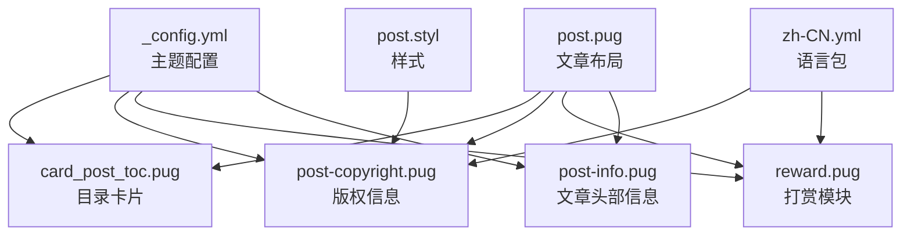
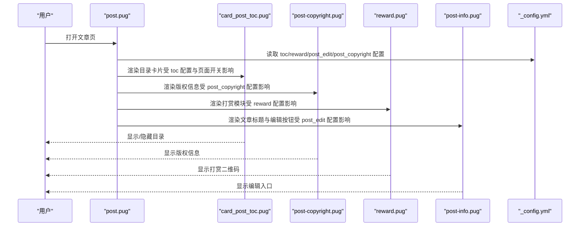
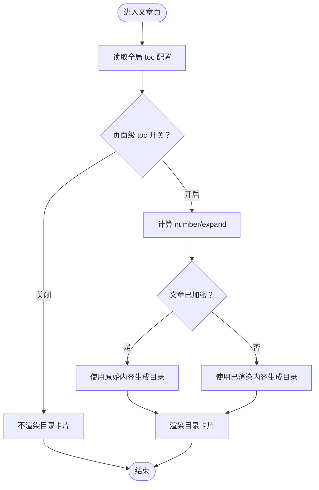
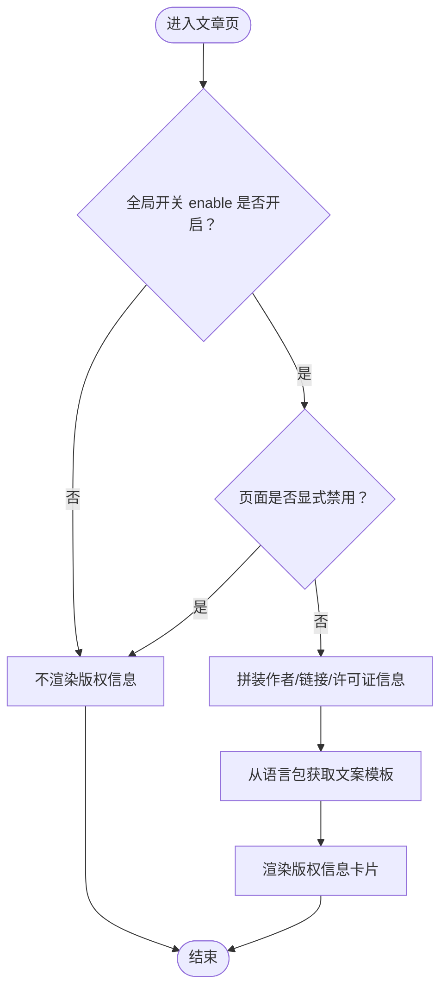
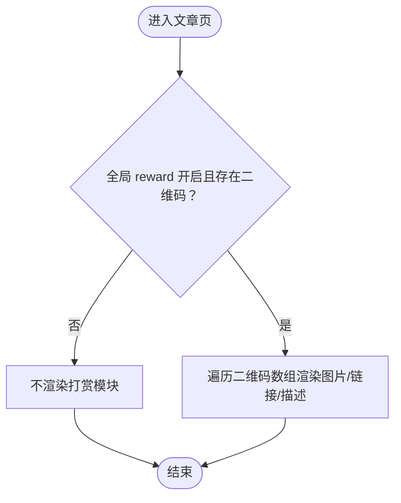
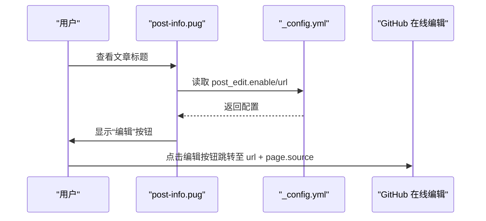
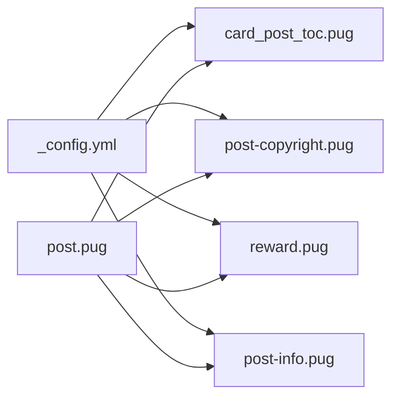

# 文章功能配置

<cite>
**本文引用的文件**
- [themes/butterfly/_config.yml](file://themes/butterfly/_config.yml)
- [themes/butterfly/layout/includes/widget/card_post_toc.pug](file://themes/butterfly/layout/includes/widget/card_post_toc.pug)
- [themes/butterfly/layout/includes/post/post-copyright.pug](file://themes/butterfly/layout/includes/post/post-copyright.pug)
- [themes/butterfly/layout/includes/post/reward.pug](file://themes/butterfly/layout/includes/post/reward.pug)
- [themes/butterfly/layout/post.pug](file://themes/butterfly/layout/post.pug)
- [themes/butterfly/layout/includes/header/post-info.pug](file://themes/butterfly/layout/includes/header/post-info.pug)
- [themes/butterfly/languages/zh-CN.yml](file://themes/butterfly/languages/zh-CN.yml)
- [themes/butterfly/source/css/_layout/post.styl](file://themes/butterfly/source/css/_layout/post.styl)
</cite>

## 目录
1. [简介](#简介)
2. [项目结构](#项目结构)
3. [核心组件](#核心组件)
4. [架构总览](#架构总览)
5. [详细组件分析](#详细组件分析)
6. [依赖关系分析](#依赖关系分析)
7. [性能考量](#性能考量)
8. [故障排查指南](#故障排查指南)
9. [结论](#结论)
10. [附录](#附录)

## 简介
本文面向使用 Hexo Butterfly 主题的用户，系统化梳理“文章功能配置”，重点覆盖以下方面：
- 目录（toc）配置：post/page 启用、number 编号显示、expand 展开模式、样式与滚动百分比等
- 版权信息（post_copyright）配置：enable 开关、decode 解码、author_href 作者链接、license 许可证类型与链接
- 打赏（reward）配置：enable 开关、QR_code 多二维码支持、text 自定义文案
- 编辑按钮（post_edit）：在文章标题旁显示 GitHub 在线编辑入口的配置方法
- 各功能启用示例与最佳实践建议

## 项目结构
围绕“文章功能配置”相关的配置项主要集中在主题配置文件中，模板渲染逻辑分布在 Pug 模板与语言包中。下图展示关键文件与它们之间的关系：

图表来源
- [themes/butterfly/_config.yml](file://themes/butterfly/_config.yml)
- [themes/butterfly/layout/includes/widget/card_post_toc.pug](file://themes/butterfly/layout/includes/widget/card_post_toc.pug)
- [themes/butterfly/layout/includes/post/post-copyright.pug](file://themes/butterfly/layout/includes/post/post-copyright.pug)
- [themes/butterfly/layout/includes/post/reward.pug](file://themes/butterfly/layout/includes/post/reward.pug)
- [themes/butterfly/layout/post.pug](file://themes/butterfly/layout/post.pug)
- [themes/butterfly/layout/includes/header/post-info.pug](file://themes/butterfly/layout/includes/header/post-info.pug)
- [themes/butterfly/languages/zh-CN.yml](file://themes/butterfly/languages/zh-CN.yml)
- [themes/butterfly/source/css/_layout/post.styl](file://themes/butterfly/source/css/_layout/post.styl)

章节来源
- [themes/butterfly/_config.yml](file://themes/butterfly/_config.yml)
- [themes/butterfly/layout/post.pug](file://themes/butterfly/layout/post.pug)

## 核心组件
- 目录（toc）
  - 支持对文章（post）与页面（page）分别控制；可开启编号（number）、默认展开（expand），以及右侧滚动百分比显示（scroll_percent）
  - 目录卡片在文章布局中按条件渲染，并根据页面级开关决定是否显示
- 版权信息（post_copyright）
  - 可通过开关控制显示；支持作者链接、链接解码、许可证类型与链接
  - 版权文案由语言包提供，支持多语言
- 打赏（reward）
  - 支持多二维码配置，每个二维码可设置图片、跳转链接与描述文案
  - 可自定义按钮文案
- 编辑按钮（post_edit）
  - 在文章标题旁显示“编辑”入口，点击后跳转至指定仓库的在线编辑页面

章节来源
- [themes/butterfly/_config.yml](file://themes/butterfly/_config.yml)
- [themes/butterfly/layout/includes/widget/card_post_toc.pug](file://themes/butterfly/layout/includes/widget/card_post_toc.pug)
- [themes/butterfly/layout/includes/post/post-copyright.pug](file://themes/butterfly/layout/includes/post/post-copyright.pug)
- [themes/butterfly/layout/includes/post/reward.pug](file://themes/butterfly/layout/includes/post/reward.pug)
- [themes/butterfly/layout/includes/header/post-info.pug](file://themes/butterfly/layout/includes/header/post-info.pug)

## 架构总览
下图展示文章页面中“目录/版权/打赏/编辑按钮”的装配流程与数据来源：

图表来源
- [themes/butterfly/layout/post.pug](file://themes/butterfly/layout/post.pug)
- [themes/butterfly/layout/includes/widget/card_post_toc.pug](file://themes/butterfly/layout/includes/widget/card_post_toc.pug)
- [themes/butterfly/layout/includes/post/post-copyright.pug](file://themes/butterfly/layout/includes/post/post-copyright.pug)
- [themes/butterfly/layout/includes/post/reward.pug](file://themes/butterfly/layout/includes/post/reward.pug)
- [themes/butterfly/layout/includes/header/post-info.pug](file://themes/butterfly/layout/includes/header/post-info.pug)
- [themes/butterfly/_config.yml](file://themes/butterfly/_config.yml)

## 详细组件分析

### 目录（toc）配置
- 配置项位置与含义
  - post/page：控制文章与页面是否显示目录
  - number：是否显示层级编号
  - expand：是否默认展开目录
  - style_simple：目录样式变体（布尔开关）
  - scroll_percent：是否显示滚动百分比
- 渲染逻辑要点
  - 目录卡片会根据页面级开关与全局配置共同决定是否渲染
  - 目录内容来源：加密文章使用原始内容（origin），否则使用已渲染内容（content）
  - 编号与展开状态由模板参数传递
- 最佳实践
  - 对长文章开启 number 与 expand，提升可读性
  - 若希望更简洁，可开启 style_simple
  - scroll_percent 适合长文阅读体验优化

图表来源
- [themes/butterfly/layout/includes/widget/card_post_toc.pug](file://themes/butterfly/layout/includes/widget/card_post_toc.pug)
- [themes/butterfly/_config.yml](file://themes/butterfly/_config.yml)

章节来源
- [themes/butterfly/_config.yml](file://themes/butterfly/_config.yml)
- [themes/butterfly/layout/includes/widget/card_post_toc.pug](file://themes/butterfly/layout/includes/widget/card_post_toc.pug)

### 版权信息（post_copyright）配置
- 配置项位置与含义
  - enable：是否显示版权信息
  - decode：是否对链接进行解码显示
  - author_href：作者链接地址
  - license / license_url：许可证类型与链接
- 渲染逻辑要点
  - 版权信息卡片仅在全局开关开启且页面未显式禁用时显示
  - 作者名、作者链接、文章链接、版权说明均由模板拼装
  - 版权说明文案来自语言包，支持多语言
- 最佳实践
  - 建议明确 license 与 license_url，便于读者了解再传播规则
  - 如需在特定文章屏蔽版权信息，可在 Front Matter 中设置对应字段

图表来源
- [themes/butterfly/layout/includes/post/post-copyright.pug](file://themes/butterfly/layout/includes/post/post-copyright.pug)
- [themes/butterfly/languages/zh-CN.yml](file://themes/butterfly/languages/zh-CN.yml)
- [themes/butterfly/_config.yml](file://themes/butterfly/_config.yml)

章节来源
- [themes/butterfly/_config.yml](file://themes/butterfly/_config.yml)
- [themes/butterfly/layout/includes/post/post-copyright.pug](file://themes/butterfly/layout/includes/post/post-copyright.pug)
- [themes/butterfly/languages/zh-CN.yml](file://themes/butterfly/languages/zh-CN.yml)

### 打赏（reward）配置
- 配置项位置与含义
  - enable：是否显示打赏模块
  - text：按钮自定义文案
  - QR_code：二维码数组，每项包含图片、链接、描述
- 渲染逻辑要点
  - 仅当 enable 开启且存在至少一个二维码时才渲染
  - 每个二维码支持独立链接与描述
- 最佳实践
  - 建议提供清晰的二维码图片与说明文字
  - 如需在部分文章隐藏打赏，可在该文章 Front Matter 中调整或通过条件渲染控制

图表来源
- [themes/butterfly/layout/includes/post/reward.pug](file://themes/butterfly/layout/includes/post/reward.pug)
- [themes/butterfly/_config.yml](file://themes/butterfly/_config.yml)

章节来源
- [themes/butterfly/_config.yml](file://themes/butterfly/_config.yml)
- [themes/butterfly/layout/includes/post/reward.pug](file://themes/butterfly/layout/includes/post/reward.pug)

### 编辑按钮（post_edit）配置
- 配置项位置与含义
  - enable：是否显示编辑按钮
  - url：GitHub 在线编辑地址模板（需包含仓库分支与子目录）
- 渲染逻辑要点
  - 标题旁出现“编辑”图标，点击后跳转至 url + page.source 的编辑页面
  - 适用于在 GitHub 上托管源文件的场景
- 最佳实践
  - 正确填写 url，确保其指向目标仓库的分支与子目录
  - 保持链接可访问，避免 404

图表来源
- [themes/butterfly/layout/includes/header/post-info.pug](file://themes/butterfly/layout/includes/header/post-info.pug)
- [themes/butterfly/_config.yml](file://themes/butterfly/_config.yml)

章节来源
- [themes/butterfly/_config.yml](file://themes/butterfly/_config.yml)
- [themes/butterfly/layout/includes/header/post-info.pug](file://themes/butterfly/layout/includes/header/post-info.pug)

## 依赖关系分析
- 配置到模板的依赖
  - 目录：card_post_toc.pug 依赖 _config.yml 中 toc.* 与页面级开关
  - 版权：post-copyright.pug 依赖 _config.yml 中 post_copyright.* 与语言包
  - 打赏：reward.pug 依赖 _config.yml 中 reward.* 与页面渲染上下文
  - 编辑：post-info.pug 依赖 _config.yml 中 post_edit.*
- 布局装配
  - post.pug 统一协调目录、版权、打赏与编辑按钮的渲染时机与条件

图表来源
- [themes/butterfly/_config.yml](file://themes/butterfly/_config.yml)
- [themes/butterfly/layout/post.pug](file://themes/butterfly/layout/post.pug)
- [themes/butterfly/layout/includes/widget/card_post_toc.pug](file://themes/butterfly/layout/includes/widget/card_post_toc.pug)
- [themes/butterfly/layout/includes/post/post-copyright.pug](file://themes/butterfly/layout/includes/post/post-copyright.pug)
- [themes/butterfly/layout/includes/post/reward.pug](file://themes/butterfly/layout/includes/post/reward.pug)
- [themes/butterfly/layout/includes/header/post-info.pug](file://themes/butterfly/layout/includes/header/post-info.pug)

章节来源
- [themes/butterfly/_config.yml](file://themes/butterfly/_config.yml)
- [themes/butterfly/layout/post.pug](file://themes/butterfly/layout/post.pug)

## 性能考量
- 目录渲染
  - 对长文使用编号与展开可能增加 DOM 结构复杂度，建议在移动端适度简化（如开启 style_simple）
- 版权与打赏
  - 仅在需要时渲染，避免不必要的资源加载
- 编辑按钮
  - 仅在 post_edit 启用时显示，减少无关交互

## 故障排查指南
- 目录未显示
  - 检查全局 toc.post 是否开启；确认文章未设置页面级关闭
  - 若文章已加密，目录将基于原始内容生成，确认加密状态
- 版权信息未显示
  - 检查 post_copyright.enable 是否开启；确认文章未显式禁用
  - 确认语言包中版权文案键值存在
- 打赏模块未显示
  - 检查 reward.enable 是否开启且 QR_code 数组非空
- 编辑按钮不可见
  - 检查 post_edit.enable 是否开启，url 是否正确配置

章节来源
- [themes/butterfly/layout/includes/widget/card_post_toc.pug](file://themes/butterfly/layout/includes/widget/card_post_toc.pug)
- [themes/butterfly/layout/includes/post/post-copyright.pug](file://themes/butterfly/layout/includes/post/post-copyright.pug)
- [themes/butterfly/layout/includes/post/reward.pug](file://themes/butterfly/layout/includes/post/reward.pug)
- [themes/butterfly/layout/includes/header/post-info.pug](file://themes/butterfly/layout/includes/header/post-info.pug)

## 结论
通过主题配置文件与模板的协同，Butterfly 主题实现了对目录、版权、打赏与编辑按钮的灵活控制。合理设置各功能开关与参数，既能提升用户体验，又能兼顾性能与可维护性。

## 附录
- 各功能启用示例与最佳实践建议
  - 目录（toc）
    - 示例：在文章中开启编号与默认展开，适合长文
    - 建议：移动端可考虑开启 style_simple 以简化结构
  - 版权信息（post_copyright）
    - 示例：开启 enable，设置 license 与 license_url，作者链接 author_href
    - 建议：统一许可证类型，避免歧义
  - 打赏（reward）
    - 示例：开启 enable，配置 text 与 QR_code 数组
    - 建议：为每个二维码提供清晰描述与可用链接
  - 编辑按钮（post_edit）
    - 示例：开启 enable，配置 url 指向仓库分支与子目录
    - 建议：确保链接可访问，便于协作维护

章节来源
- [themes/butterfly/_config.yml](file://themes/butterfly/_config.yml)
- [themes/butterfly/layout/post.pug](file://themes/butterfly/layout/post.pug)
- [themes/butterfly/source/css/_layout/post.styl](file://themes/butterfly/source/css/_layout/post.styl)