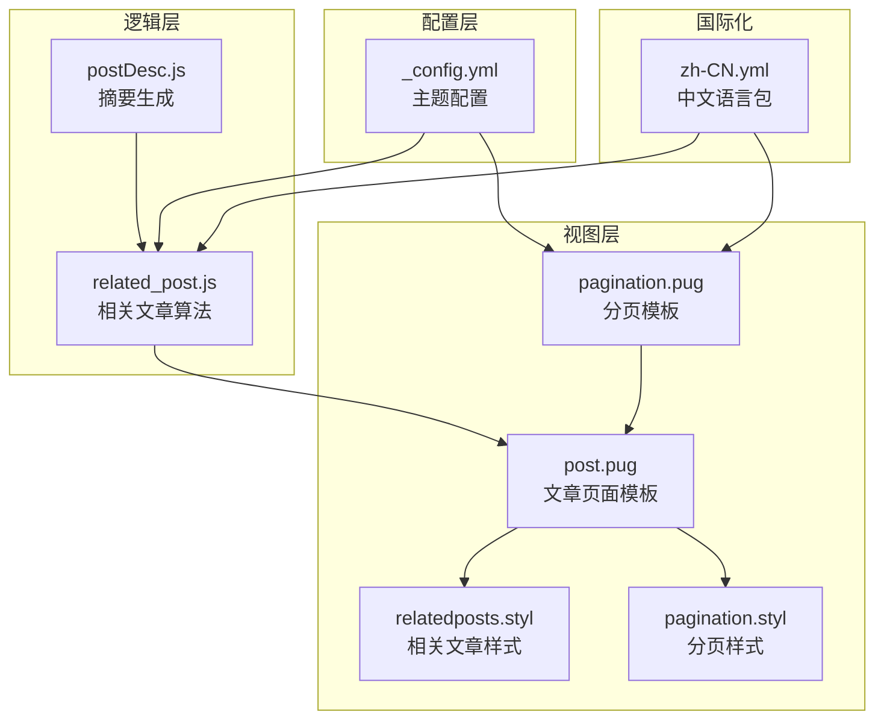
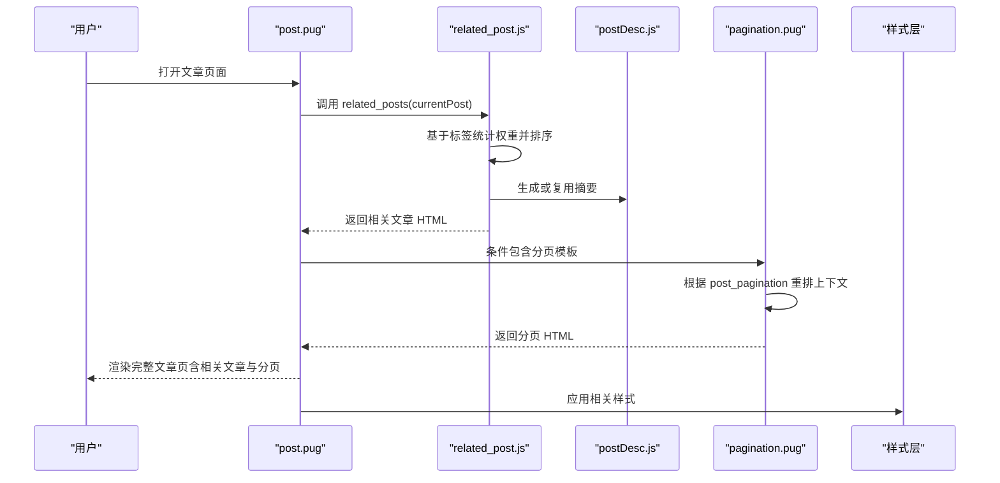
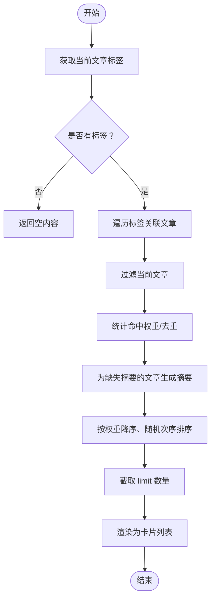
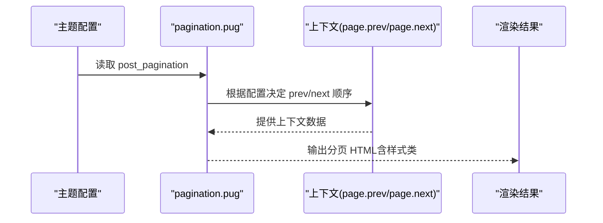
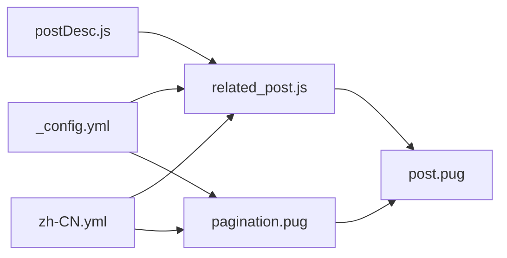

# 相关文章与分页

<cite>
**本文引用的文件**
- [主题配置 _config.yml](file://themes/butterfly/_config.yml)
- [相关文章辅助函数 related_post.js](file://themes/butterfly/scripts/helpers/related_post.js)
- [分页模板 pagination.pug](file://themes/butterfly/layout/includes/pagination.pug)
- [文章页面模板 post.pug](file://themes/butterfly/layout/post.pug)
- [相关文章样式 relatedposts.styl](file://themes/butterfly/source/css/_layout/relatedposts.styl)
- [分页样式 pagination.styl](file://themes/butterfly/source/css/_layout/pagination.styl)
- [摘要生成工具 postDesc.js](file://themes/butterfly/scripts/common/postDesc.js)
- [中文语言包 zh-CN.yml](file://themes/butterfly/languages/zh-CN.yml)
</cite>

## 目录
1. [简介](#简介)
2. [项目结构](#项目结构)
3. [核心组件](#核心组件)
4. [架构概览](#架构概览)
5. [详细组件分析](#详细组件分析)
6. [依赖关系分析](#依赖关系分析)
7. [性能考量](#性能考量)
8. [故障排除指南](#故障排除指南)
9. [结论](#结论)

## 简介
本文档聚焦于 Butterfly 主题中的“相关文章”与“文章分页”两大功能模块，围绕以下目标展开：
- 深入解析 related_post 配置项：enable 开关、limit 数量限制、date_type 日期类型选择
- 详解 post_pagination 分页设置：1/2/false 三种模式对文章导航的影响
- 解释“下一篇文章”链接逻辑：按旧文章/新文章排序的区别
- 提供相关文章推荐算法说明与自定义方法
- 给出分页样式与用户体验优化建议

## 项目结构
与“相关文章与分页”直接相关的文件组织如下：
- 主题配置：用于开启/关闭相关文章与分页，并设置相关参数
- 辅助函数：负责计算相关文章列表
- 模板：负责渲染相关文章与分页区域
- 样式：负责相关文章与分页的视觉呈现
- 语言包：提供国际化文案（如“相关推荐”、“上一篇/下一篇”）

图表来源
- [_config.yml](file://themes/butterfly/_config.yml)
- [related_post.js](file://themes/butterfly/scripts/helpers/related_post.js)
- [postDesc.js](file://themes/butterfly/scripts/common/postDesc.js)
- [post.pug](file://themes/butterfly/layout/post.pug)
- [pagination.pug](file://themes/butterfly/layout/includes/pagination.pug)
- [relatedposts.styl](file://themes/butterfly/source/css/_layout/relatedposts.styl)
- [pagination.styl](file://themes/butterfly/source/css/_layout/pagination.styl)
- [zh-CN.yml](file://themes/butterfly/languages/zh-CN.yml)

章节来源
- [主题配置 _config.yml](file://themes/butterfly/_config.yml)
- [相关文章辅助函数 related_post.js](file://themes/butterfly/scripts/helpers/related_post.js)
- [分页模板 pagination.pug](file://themes/butterfly/layout/includes/pagination.pug)
- [文章页面模板 post.pug](file://themes/butterfly/layout/post.pug)
- [相关文章样式 relatedposts.styl](file://themes/butterfly/source/css/_layout/relatedposts.styl)
- [分页样式 pagination.styl](file://themes/butterfly/source/css/_layout/pagination.styl)
- [摘要生成工具 postDesc.js](file://themes/butterfly/scripts/common/postDesc.js)
- [中文语言包 zh-CN.yml](file://themes/butterfly/languages/zh-CN.yml)

## 核心组件
- 相关文章配置与渲染
  - 配置项：related_post.enable、related_post.limit、related_post.date_type
  - 渲染入口：post.pug 中调用 related_posts 辅助函数
  - 推荐算法：基于标签交集统计权重，按权重降序、随机次序排序，截取 limit 数量
- 文章分页配置与渲染
  - 配置项：post_pagination（1/2/false）
  - 渲染入口：post.pug 中条件包含 pagination.pug
  - 导航逻辑：根据 post_pagination 决定“上一篇/下一篇”的顺序与显示

章节来源
- [主题配置 _config.yml](file://themes/butterfly/_config.yml)
- [文章页面模板 post.pug](file://themes/butterfly/layout/post.pug)
- [相关文章辅助函数 related_post.js](file://themes/butterfly/scripts/helpers/related_post.js)
- [分页模板 pagination.pug](file://themes/butterfly/layout/includes/pagination.pug)

## 架构概览
下图展示了从配置到渲染的整体流程，以及相关文章与分页在页面中的位置。

图表来源
- [post.pug](file://themes/butterfly/layout/post.pug)
- [related_post.js](file://themes/butterfly/scripts/helpers/related_post.js)
- [postDesc.js](file://themes/butterfly/scripts/common/postDesc.js)
- [pagination.pug](file://themes/butterfly/layout/includes/pagination.pug)
- [relatedposts.styl](file://themes/butterfly/source/css/_layout/relatedposts.styl)
- [pagination.styl](file://themes/butterfly/source/css/_layout/pagination.styl)

## 详细组件分析

### 相关文章配置与算法
- 配置项说明
  - enable：控制是否显示相关文章区域
  - limit：限制展示数量，默认值来自主题配置
  - date_type：控制显示“创建时间/更新时间”，默认“创建时间”
- 算法流程
  - 收集当前文章的标签集合
  - 遍历每个标签关联的文章，跳过当前文章自身
  - 使用 Map 统计命中次数作为“权重”，重复命中权重+1
  - 若某篇文章未预生成摘要，则通过摘要工具生成
  - 按权重降序、随机次序排序，截取 limit 数量
  - 渲染为卡片列表，支持图片封面或纯色背景
- 自定义建议
  - 可在辅助函数中引入更多特征（如分类、内容相似度、阅读时长等）进行加权
  - 可扩展 date_type 的可选值，增加“最近访问”等维度
  - 可加入缓存机制，避免重复计算

图表来源
- [相关文章辅助函数 related_post.js](file://themes/butterfly/scripts/helpers/related_post.js)
- [摘要生成工具 postDesc.js](file://themes/butterfly/scripts/common/postDesc.js)

章节来源
- [主题配置 _config.yml](file://themes/butterfly/_config.yml)
- [相关文章辅助函数 related_post.js](file://themes/butterfly/scripts/helpers/related_post.js)
- [摘要生成工具 postDesc.js](file://themes/butterfly/scripts/common/postDesc.js)

### 文章分页配置与导航逻辑
- 配置项说明
  - post_pagination：1/2/false
    - 1：下一篇文章指向“更旧”的文章（按时间升序）
    - 2：下一篇文章指向“更新”的文章（按时间降序）
    - false：禁用分页
- 渲染逻辑
  - 当 globalPageType 为 post 且存在分页时，模板会根据配置重排 prev/next 的顺序
  - 同时根据是否存在摘要动态添加样式类，影响布局与交互
- “下一篇文章”排序区别
  - 1 模式：用户点击“下一篇文章”时，跳转到时间更早的一篇
  - 2 模式：用户点击“下一篇文章”时，跳转到时间更新的一篇
- 样式与交互
  - 分页容器使用“pagination-post”类，移动端与桌面端布局不同
  - hover 时可显示摘要信息，提升可读性

图表来源
- [分页模板 pagination.pug](file://themes/butterfly/layout/includes/pagination.pug)
- [主题配置 _config.yml](file://themes/butterfly/_config.yml)

章节来源
- [主题配置 _config.yml](file://themes/butterfly/_config.yml)
- [分页模板 pagination.pug](file://themes/butterfly/layout/includes/pagination.pug)
- [文章页面模板 post.pug](file://themes/butterfly/layout/post.pug)

### 样式与布局要点
- 相关文章区域
  - 容器类名：relatedPosts
  - 列表项：卡片布局，支持图片封面与纯色背景
  - 摘要存在时显示第二层信息，hover 时切换显示
- 文章分页
  - 容器类名：pagination-post
  - 移动端与桌面端布局差异
  - 根据是否存在摘要动态添加 no-desc 类以调整宽度

章节来源
- [相关文章样式 relatedposts.styl](file://themes/butterfly/source/css/_layout/relatedposts.styl)
- [分页样式 pagination.styl](file://themes/butterfly/source/css/_layout/pagination.styl)

## 依赖关系分析
- 配置依赖
  - 相关文章：依赖主题配置中的 related_post.enable/limit/date_type
  - 分页：依赖主题配置中的 post_pagination
- 模块依赖
  - related_post.js 依赖 postDesc.js 生成摘要
  - post.pug 同时依赖 pagination.pug 与 related_post.js
- 国际化依赖
  - zh-CN.yml 提供“相关推荐”“上一篇/下一篇”等文案

图表来源
- [主题配置 _config.yml](file://themes/butterfly/_config.yml)
- [相关文章辅助函数 related_post.js](file://themes/butterfly/scripts/helpers/related_post.js)
- [摘要生成工具 postDesc.js](file://themes/butterfly/scripts/common/postDesc.js)
- [文章页面模板 post.pug](file://themes/butterfly/layout/post.pug)
- [分页模板 pagination.pug](file://themes/butterfly/layout/includes/pagination.pug)
- [中文语言包 zh-CN.yml](file://themes/butterfly/languages/zh-CN.yml)

章节来源
- [主题配置 _config.yml](file://themes/butterfly/_config.yml)
- [相关文章辅助函数 related_post.js](file://themes/butterfly/scripts/helpers/related_post.js)
- [摘要生成工具 postDesc.js](file://themes/butterfly/scripts/common/postDesc.js)
- [文章页面模板 post.pug](file://themes/butterfly/layout/post.pug)
- [分页模板 pagination.pug](file://themes/butterfly/layout/includes/pagination.pug)
- [中文语言包 zh-CN.yml](file://themes/butterfly/languages/zh-CN.yml)

## 性能考量
- 相关文章
  - 标签遍历与权重统计的时间复杂度与标签数量、文章数量相关，建议合理控制标签密度与文章规模
  - 摘要生成涉及内容处理，可在辅助函数中加入缓存策略
- 分页
  - 分页仅在存在上下文时渲染，避免不必要的 DOM 结构
  - 样式层使用 CSS 控制 hover 效果，减少 JS 交互成本

## 故障排除指南
- 相关文章不显示
  - 检查 related_post.enable 是否启用
  - 确认文章至少有一个标签
  - 检查 limit 是否过大导致为空
- 分页不显示
  - 检查 post_pagination 是否设为 false
  - 确认当前文章存在上一篇或下一篇文章
- 文案显示异常
  - 检查 zh-CN.yml 中对应键值是否正确
- 样式错乱
  - 确认容器类名与样式文件一致
  - 检查移动端/桌面端断点下的样式覆盖

章节来源
- [主题配置 _config.yml](file://themes/butterfly/_config.yml)
- [文章页面模板 post.pug](file://themes/butterfly/layout/post.pug)
- [分页模板 pagination.pug](file://themes/butterfly/layout/includes/pagination.pug)
- [相关文章样式 relatedposts.styl](file://themes/butterfly/source/css/_layout/relatedposts.styl)
- [分页样式 pagination.styl](file://themes/butterfly/source/css/_layout/pagination.styl)
- [中文语言包 zh-CN.yml](file://themes/butterfly/languages/zh-CN.yml)

## 结论
- related_post 提供了基于标签的简单而有效的相关文章推荐，可通过 limit 与 date_type 精细控制展示效果
- post_pagination 通过 1/2/false 三种模式灵活适配不同的阅读节奏与内容组织方式
- 样式层提供了良好的响应式与交互体验，建议结合业务需求进一步扩展算法与配置项