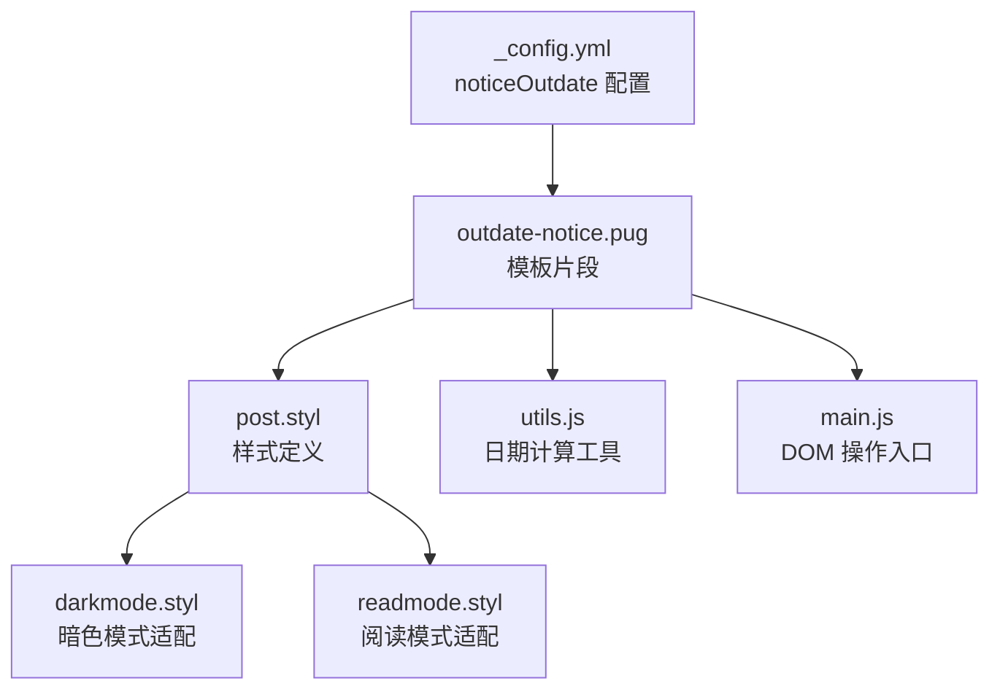
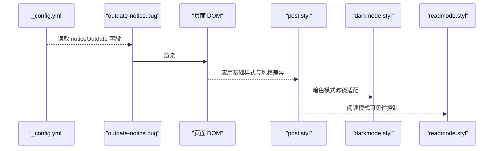
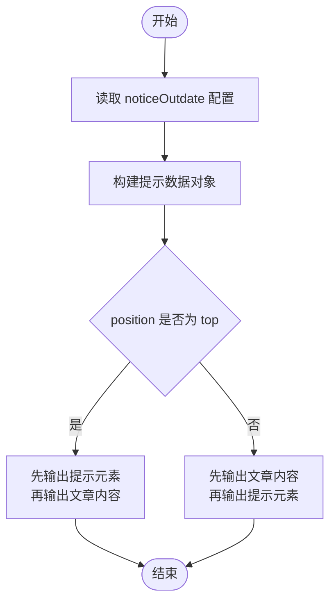
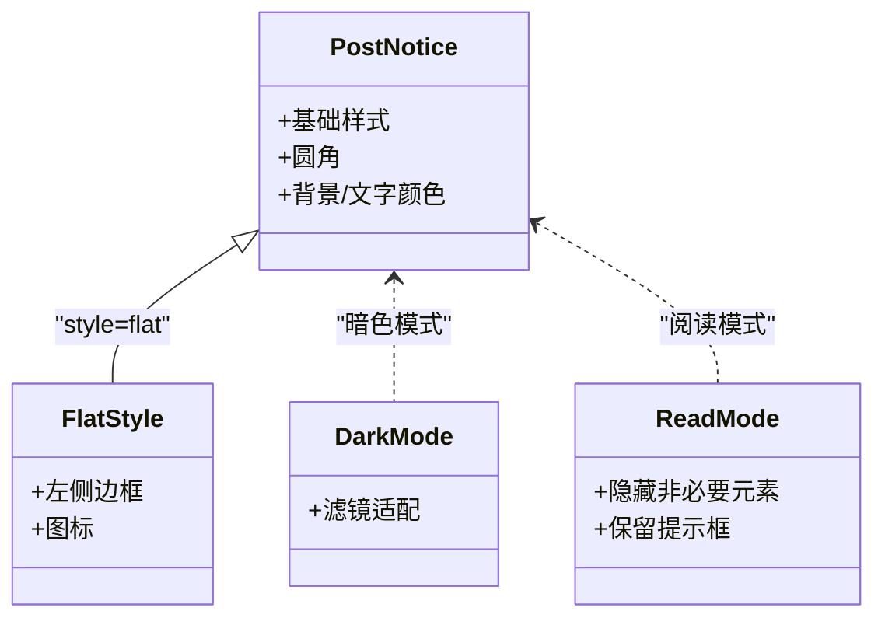
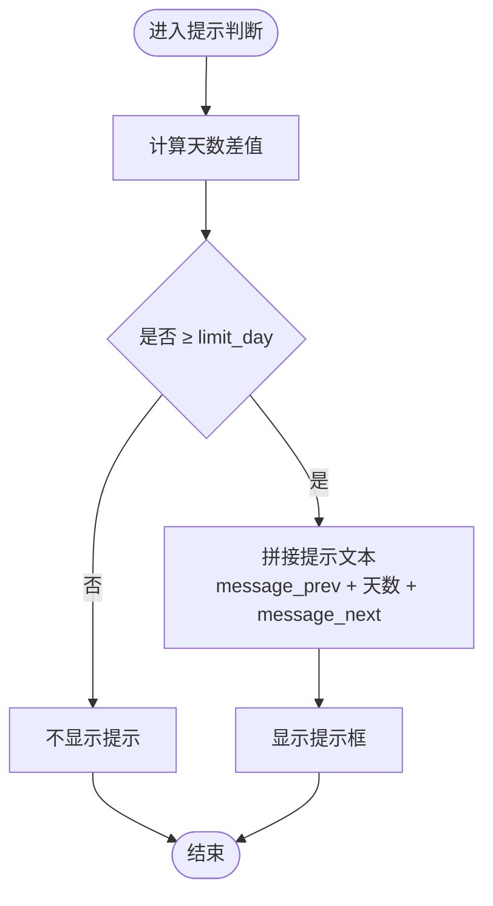
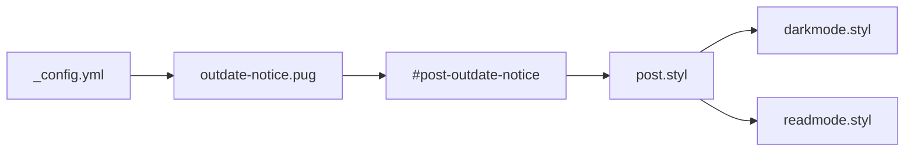

# 过期提示配置

<cite>
**本文引用的文件**
- [_config.yml](file://themes/butterfly/_config.yml)
- [outdate-notice.pug](file://themes/butterfly/layout/includes/post/outdate-notice.pug)
- [post.styl](file://themes/butterfly/source/css/_layout/post.styl)
- [darkmode.styl](file://themes/butterfly/source/css/_mode/darkmode.styl)
- [readmode.styl](file://themes/butterfly/source/css/_mode/readmode.styl)
- [utils.js](file://themes/butterfly/source/js/utils.js)
- [main.js](file://themes/butterfly/source/js/main.js)
</cite>

## 目录
1. [简介](#简介)
2. [项目结构](#项目结构)
3. [核心组件](#核心组件)
4. [架构总览](#架构总览)
5. [详细组件分析](#详细组件分析)
6. [依赖关系分析](#依赖关系分析)
7. [性能考量](#性能考量)
8. [故障排查指南](#故障排查指南)
9. [结论](#结论)
10. [附录](#附录)

## 简介
本文件聚焦于 Hexo 主题 Butterfly 中“过期提示”功能的配置与实现细节，围绕 noticeOutdate 配置段落进行系统化说明，包括：
- enable 开关控制是否启用
- style 样式类型（simple/flat）
- limit_day 过期天数阈值
- position 位置设置（top/bottom）对提示框显示位置的影响
- message_prev/message_next 自定义提示信息的配置方法
- 不同过期策略的适用场景与用户体验考虑
- 提示框 CSS 样式定制方法

## 项目结构
与过期提示相关的核心文件分布如下：
- 配置文件：themes/butterfly/_config.yml
- 模板片段：themes/butterfly/layout/includes/post/outdate-notice.pug
- 样式文件：themes/butterfly/source/css/_layout/post.styl、themes/butterfly/source/css/_mode/darkmode.styl、themes/butterfly/source/css/_mode/readmode.styl
- 前端工具与脚本：themes/butterfly/source/js/utils.js、themes/butterfly/source/js/main.js

图表来源
- [_config.yml:244-254](file://themes/butterfly/_config.yml#L244-L254)
- [outdate-notice.pug:1-8](file://themes/butterfly/layout/includes/post/outdate-notice.pug#L1-L8)
- [post.styl:239-262](file://themes/butterfly/source/css/_layout/post.styl#L239-L262)
- [darkmode.styl:134-140](file://themes/butterfly/source/css/_mode/darkmode.styl#L134-L140)
- [readmode.styl:81-85](file://themes/butterfly/source/css/_mode/readmode.styl#L81-L85)
- [utils.js:84-103](file://themes/butterfly/source/js/utils.js#L84-L103)
- [main.js:873-873](file://themes/butterfly/source/js/main.js#L873-L873)

章节来源
- [_config.yml:244-254](file://themes/butterfly/_config.yml#L244-L254)
- [outdate-notice.pug:1-8](file://themes/butterfly/layout/includes/post/outdate-notice.pug#L1-L8)

## 核心组件
- 配置段落 noticeOutdate
  - enable：布尔开关，控制是否渲染过期提示
  - style：字符串，可选 simple 或 flat，决定提示样式风格
  - limit_day：数值，单位天，超过该阈值时显示提示
  - position：字符串，可选 top 或 bottom，决定提示在文章内容前或后显示
  - message_prev/message_next：字符串，用于拼接提示文本
- 模板片段 outdate-notice.pug
  - 从主题配置读取上述字段并构造数据对象
  - 根据 position 决定提示元素的插入顺序
- 样式层 post.styl
  - 定义 #post-outdate-notice 的基础样式与两种风格的差异化
  - 当 style=flat 时，使用左侧边框与图标增强视觉提示
- 模式适配
  - darkmode.styl：在暗色模式下对提示框进行滤镜适配
  - readmode.styl：在阅读模式下隐藏除必要内容外的所有元素，确保提示可见性

章节来源
- [_config.yml:244-254](file://themes/butterfly/_config.yml#L244-L254)
- [outdate-notice.pug:1-8](file://themes/butterfly/layout/includes/post/outdate-notice.pug#L1-L8)
- [post.styl:239-262](file://themes/butterfly/source/css/_layout/post.styl#L239-L262)
- [darkmode.styl:134-140](file://themes/butterfly/source/css/_mode/darkmode.styl#L134-L140)
- [readmode.styl:81-85](file://themes/butterfly/source/css/_mode/readmode.styl#L81-L85)

## 架构总览
从配置到渲染的整体流程如下：

图表来源
- [_config.yml:244-254](file://themes/butterfly/_config.yml#L244-L254)
- [outdate-notice.pug:1-8](file://themes/butterfly/layout/includes/post/outdate-notice.pug#L1-L8)
- [post.styl:239-262](file://themes/butterfly/source/css/_layout/post.styl#L239-L262)
- [darkmode.styl:134-140](file://themes/butterfly/source/css/_mode/darkmode.styl#L134-L140)
- [readmode.styl:81-85](file://themes/butterfly/source/css/_mode/readmode.styl#L81-L85)

## 详细组件分析

### 配置项详解
- enable
  - 作用：全局开关，关闭时模板不渲染提示元素
  - 影响：完全移除 #post-outdate-notice 的生成
- style
  - simple：默认基础样式，强调简洁
  - flat：扁平风格，带左侧边框与图标，适合需要突出警示的场景
- limit_day
  - 作用：以天为单位的阈值，超过即触发提示
  - 影响：与当前时间差比较，决定是否显示
- position
  - top：提示位于文章内容之前
  - bottom：提示位于文章内容之后
  - 影响：决定 #post-outdate-notice 在 DOM 中的前后顺序
- message_prev/message_next
  - 作用：自定义提示文本的前后半部分，最终组合成完整提示语
  - 影响：文案风格与本地化需求

章节来源
- [_config.yml:244-254](file://themes/butterfly/_config.yml#L244-L254)
- [outdate-notice.pug:1-8](file://themes/butterfly/layout/includes/post/outdate-notice.pug#L1-L8)

### 模板渲染逻辑
- 数据准备
  - 从主题配置读取 limit_day、message_prev、message_next、position
  - 将页面更新时间通过辅助函数转换为可展示格式
- 位置控制
  - position=top：先输出提示元素，再输出文章内容
  - position=bottom：先输出文章内容，再输出提示元素
- 输出结构
  - 提示元素具有固定 ID，便于后续脚本定位与交互

图表来源
- [outdate-notice.pug:1-8](file://themes/butterfly/layout/includes/post/outdate-notice.pug#L1-L8)

章节来源
- [outdate-notice.pug:1-8](file://themes/butterfly/layout/includes/post/outdate-notice.pug#L1-L8)

### 样式与主题适配
- 基础样式
  - 定位、间距、背景、颜色、圆角等
- 风格差异
  - style=flat：增加左侧边框与图标，提升警示感
- 暗色模式适配
  - 对提示框应用滤镜，保证对比度与可读性
- 阅读模式适配
  - 隐藏非必要元素，保留提示框，优化专注阅读体验

图表来源
- [post.styl:239-262](file://themes/butterfly/source/css/_layout/post.styl#L239-L262)
- [darkmode.styl:134-140](file://themes/butterfly/source/css/_mode/darkmode.styl#L134-L140)
- [readmode.styl:81-85](file://themes/butterfly/source/css/_mode/readmode.styl#L81-L85)

章节来源
- [post.styl:239-262](file://themes/butterfly/source/css/_layout/post.styl#L239-L262)
- [darkmode.styl:134-140](file://themes/butterfly/source/css/_mode/darkmode.styl#L134-L140)
- [readmode.styl:81-85](file://themes/butterfly/source/css/_mode/readmode.styl#L81-L85)

### 日期计算与提示时机
- 工具函数
  - 计算当前时间与文章更新时间的差值，返回天数或更精细的时间单位
  - 支持“仅天数”和“人性化描述”两种模式
- 提示时机
  - 当差值大于等于 limit_day 时，显示提示
  - 文案由 message_prev 与 message_next 组合生成

图表来源
- [utils.js:84-103](file://themes/butterfly/source/js/utils.js#L84-L103)

章节来源
- [utils.js:84-103](file://themes/butterfly/source/js/utils.js#L84-L103)

## 依赖关系分析
- 配置到模板
  - noticeOutdate 配置被 outdate-notice.pug 读取并注入数据
- 模板到样式
  - 提示元素遵循 post.styl 的样式规则，并受主题模式影响
- 样式到模式
  - darkmode.styl 与 readmode.styl 分别对提示框进行滤镜与可见性处理

图表来源
- [_config.yml:244-254](file://themes/butterfly/_config.yml#L244-L254)
- [outdate-notice.pug:1-8](file://themes/butterfly/layout/includes/post/outdate-notice.pug#L1-L8)
- [post.styl:239-262](file://themes/butterfly/source/css/_layout/post.styl#L239-L262)
- [darkmode.styl:134-140](file://themes/butterfly/source/css/_mode/darkmode.styl#L134-L140)
- [readmode.styl:81-85](file://themes/butterfly/source/css/_mode/readmode.styl#L81-L85)

章节来源
- [_config.yml:244-254](file://themes/butterfly/_config.yml#L244-L254)
- [outdate-notice.pug:1-8](file://themes/butterfly/layout/includes/post/outdate-notice.pug#L1-L8)
- [post.styl:239-262](file://themes/butterfly/source/css/_layout/post.styl#L239-L262)
- [darkmode.styl:134-140](file://themes/butterfly/source/css/_mode/darkmode.styl#L134-L140)
- [readmode.styl:81-85](file://themes/butterfly/source/css/_mode/readmode.styl#L81-L85)

## 性能考量
- 渲染时机
  - 模板在服务端渲染，避免客户端额外计算开销
- 样式体积
  - 仅在启用时渲染提示元素，减少不必要的 DOM 节点
- 暗色/阅读模式
  - 通过样式层统一处理，无需额外脚本干预

## 故障排查指南
- 提示未显示
  - 检查 enable 是否开启
  - 确认 limit_day 设置是否合理，确保当前文章更新时间差值满足阈值
  - 核对 position 设置，确认提示元素出现在预期位置
- 文案异常
  - 检查 message_prev 与 message_next 的拼接逻辑是否符合预期
- 样式问题
  - 若使用 flat 风格但无图标或边框，检查样式加载与变量覆盖
  - 暗色/阅读模式下颜色对比度不足时，调整对应模式下的滤镜或颜色变量

章节来源
- [outdate-notice.pug:1-8](file://themes/butterfly/layout/includes/post/outdate-notice.pug#L1-L8)
- [post.styl:239-262](file://themes/butterfly/source/css/_layout/post.styl#L239-L262)
- [darkmode.styl:134-140](file://themes/butterfly/source/css/_mode/darkmode.styl#L134-L140)
- [readmode.styl:81-85](file://themes/butterfly/source/css/_mode/readmode.styl#L81-L85)

## 结论
noticeOutdate 功能通过简洁的配置即可实现灵活的过期提示策略。结合 simple/flat 两种风格与 top/bottom 位置控制，可在不同场景下平衡信息传达与阅读体验。配合暗色与阅读模式的样式适配，确保在各种主题环境下均具备良好的可读性与一致性。

## 附录

### 配置项速查表
- enable：布尔，控制是否启用
- style：枚举，simple 或 flat
- limit_day：数值，天数阈值
- position：枚举，top 或 bottom
- message_prev：字符串，提示文本前半部分
- message_next：字符串，提示文本后半部分

章节来源
- [_config.yml:244-254](file://themes/butterfly/_config.yml#L244-L254)