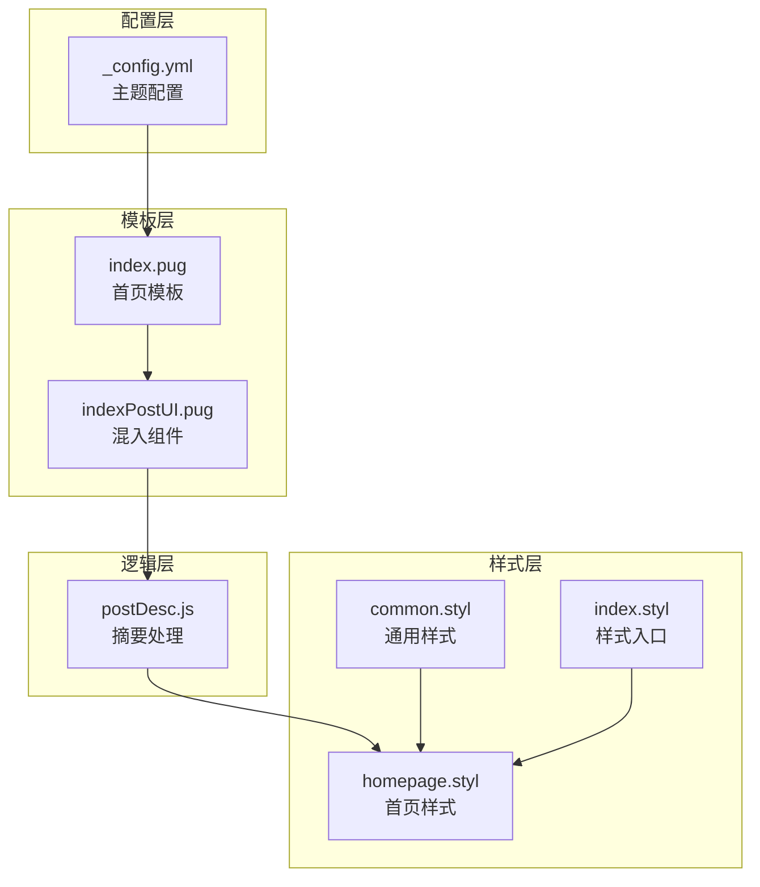
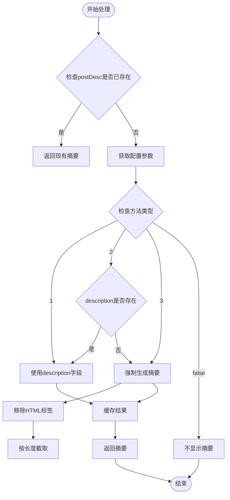
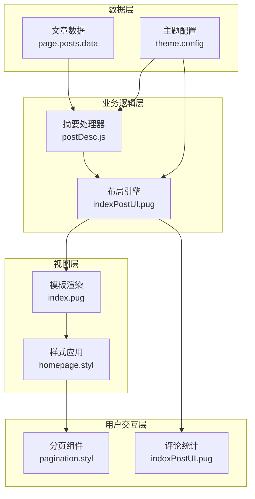
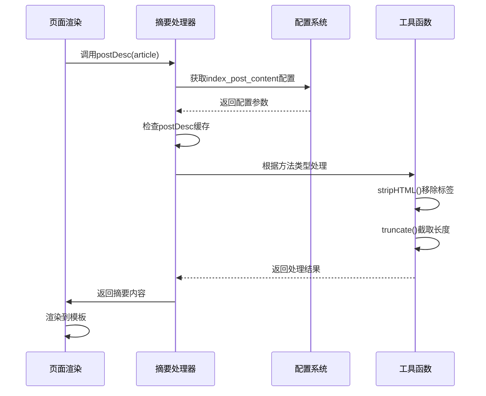
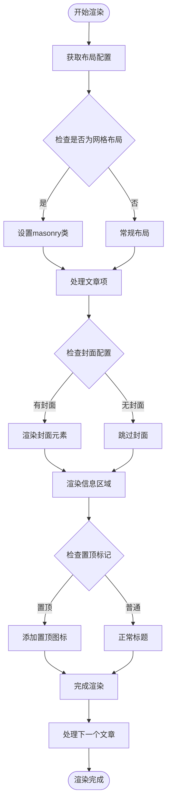
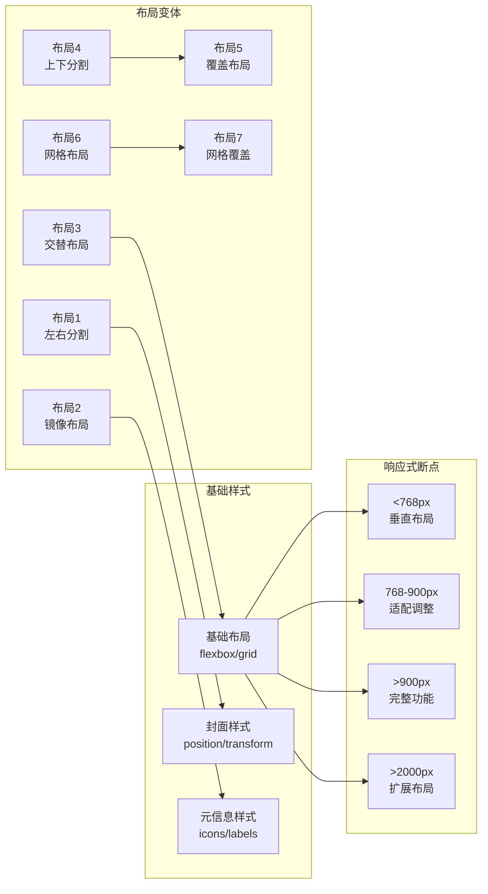
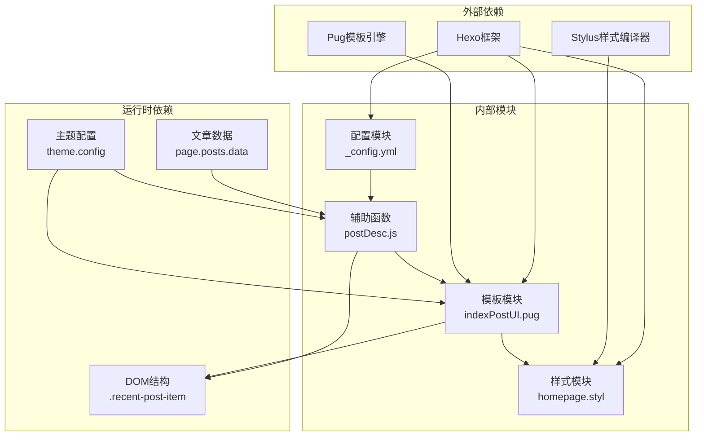

# 首页内容展示

<cite>
**本文档引用的文件**
- [_config.yml](file://themes/butterfly/_config.yml)
- [index.pug](file://themes/butterfly/layout/index.pug)
- [indexPostUI.pug](file://themes/butterfly/layout/includes/mixins/indexPostUI.pug)
- [postDesc.js](file://themes/butterfly/scripts/common/postDesc.js)
- [homepage.styl](file://themes/butterfly/source/css/_page/homepage.styl)
- [common.styl](file://themes/butterfly/source/css/_page/common.styl)
- [index.styl](file://themes/butterfly/source/css/index.styl)
</cite>

## 目录
1. [简介](#简介)
2. [项目结构](#项目结构)
3. [核心组件](#核心组件)
4. [架构概览](#架构概览)
5. [详细组件分析](#详细组件分析)
6. [依赖关系分析](#依赖关系分析)
7. [性能考虑](#性能考虑)
8. [故障排除指南](#故障排除指南)
9. [结论](#结论)

## 简介

本文档深入解析Hexo Butterfly主题的首页内容展示功能，重点分析以下配置项：
- `index_post_content`配置：控制文章摘要显示逻辑
- `index_layout`选项：定义文章卡片布局模式
- 自动摘要生成算法：基于`auto_excerpt`的智能截取机制

通过代码级分析，为用户提供完整的配置指导和最佳实践建议。

## 项目结构

Hexo Butterfly主题采用模块化架构设计，首页内容展示功能分布在多个层次：

**图表来源**
- [_config.yml:140-190](file://themes/butterfly/_config.yml#L140-L190)
- [index.pug:1-5](file://themes/butterfly/layout/index.pug#L1-L5)
- [indexPostUI.pug:1-119](file://themes/butterfly/layout/includes/mixins/indexPostUI.pug#L1-L119)
- [postDesc.js:1-38](file://themes/butterfly/scripts/common/postDesc.js#L1-L38)

**章节来源**
- [_config.yml:140-190](file://themes/butterfly/_config.yml#L140-L190)
- [index.pug:1-5](file://themes/butterfly/layout/index.pug#L1-L5)

## 核心组件

### index_post_content配置系统

`index_post_content`是控制首页文章摘要显示的核心配置，包含三个关键参数：

#### 方法选项详解

| 方法值 | 行为描述 | 适用场景 |
|--------|----------|----------|
| `1` | 仅显示手动描述字段 | 当文章有精确的摘要描述时使用 |
| `2` | 优先显示描述，不存在则自动生成 | 推荐默认配置，兼顾人工和自动摘要 |
| `3` | 强制自动生成摘要 | 当需要统一摘要风格时使用 |
| `false` | 不显示文章摘要 | 当不需要摘要信息时使用 |

#### 摘要长度控制

`length`参数用于限制自动生成摘要的最大字符数，默认值为500字符。该参数在方法2和3中生效，确保摘要内容适中且不影响页面加载性能。

#### 自动摘要算法

摘要生成算法采用多步骤处理流程：

**图表来源**
- [postDesc.js:12-35](file://themes/butterfly/scripts/common/postDesc.js#L12-L35)

**章节来源**
- [postDesc.js:1-38](file://themes/butterfly/scripts/common/postDesc.js#L1-L38)
- [_config.yml:180-189](file://themes/butterfly/_config.yml#L180-L189)

### index_layout布局系统

`index_layout`支持7种不同的布局模式，每种模式都有独特的视觉效果和适用场景：

#### 布局模式对比表

| 布局编号 | 名称 | 布局特点 | 适用场景 |
|----------|------|----------|----------|
| `1` | 左侧封面 | 封面在左，信息在右，固定比例 | 文章以图片为主的博客 |
| `2` | 右侧封面 | 封面在右，信息在左，固定比例 | 强调文字内容的博客 |
| `3` | 交替布局 | 奇偶行交替左右分布 | 大量文章的首页展示 |
| `4` | 上方封面 | 封面在上，信息在下，全宽布局 | 图片丰富的博客 |
| `5` | 封面上信息 | 信息直接叠加在封面上 | 视觉冲击力强的博客 |
| `6` | 砖石布局 | 网格布局，封面在上 | 现代化设计风格 |
| `7` | 砖石封面布局 | 网格布局，信息在封面上 | 现代化设计风格 |

#### 响应式布局特性

所有布局都具备响应式特性，在不同屏幕尺寸下自动调整：

- **移动端优化**：小屏幕设备自动切换为垂直布局
- **平板适配**：中等屏幕设备保持最佳阅读体验
- **桌面端增强**：大屏幕设备充分利用空间

**章节来源**
- [_config.yml:170-178](file://themes/butterfly/_config.yml#L170-L178)
- [homepage.styl:1-175](file://themes/butterfly/source/css/_page/homepage.styl#L1-L175)

## 架构概览

首页内容展示系统采用分层架构设计，确保功能模块的高内聚低耦合：

**图表来源**
- [indexPostUI.pug:1-119](file://themes/butterfly/layout/includes/mixins/indexPostUI.pug#L1-L119)
- [postDesc.js:1-38](file://themes/butterfly/scripts/common/postDesc.js#L1-L38)
- [homepage.styl:1-175](file://themes/butterfly/source/css/_page/homepage.styl#L1-L175)

## 详细组件分析

### 摘要处理组件

摘要处理组件是整个首页展示系统的核心逻辑单元，负责将原始文章内容转换为适合首页显示的摘要格式。

#### 核心处理流程

**图表来源**
- [postDesc.js:12-35](file://themes/butterfly/scripts/common/postDesc.js#L12-L35)
- [indexPostUI.pug:110-113](file://themes/butterfly/layout/includes/mixins/indexPostUI.pug#L110-L113)

#### 数据流分析

摘要处理的数据流遵循严格的输入输出规范：

1. **输入验证**：检查文章数据的有效性和加密状态
2. **配置读取**：动态获取当前主题配置
3. **算法选择**：根据方法类型执行相应处理策略
4. **结果缓存**：避免重复计算提升性能

**章节来源**
- [postDesc.js:1-38](file://themes/butterfly/scripts/common/postDesc.js#L1-L38)

### 布局渲染组件

布局渲染组件负责将处理后的文章数据转换为最终的HTML结构，支持多种布局模式的动态切换。

#### 动态布局算法

**图表来源**
- [indexPostUI.pug:6-25](file://themes/butterfly/layout/includes/mixins/indexPostUI.pug#L6-L25)

#### 响应式样式系统

样式系统采用CSS预处理器构建，支持复杂的媒体查询和条件样式：

**图表来源**
- [homepage.styl:1-175](file://themes/butterfly/source/css/_page/homepage.styl#L1-L175)
- [common.styl:1-61](file://themes/butterfly/source/css/_page/common.styl#L1-L61)

**章节来源**
- [indexPostUI.pug:1-119](file://themes/butterfly/layout/includes/mixins/indexPostUI.pug#L1-L119)
- [homepage.styl:1-175](file://themes/butterfly/source/css/_page/homepage.styl#L1-L175)

## 依赖关系分析

首页内容展示系统的依赖关系呈现清晰的单向数据流：

**图表来源**
- [_config.yml:140-190](file://themes/butterfly/_config.yml#L140-L190)
- [postDesc.js:1-38](file://themes/butterfly/scripts/common/postDesc.js#L1-L38)
- [indexPostUI.pug:1-119](file://themes/butterfly/layout/includes/mixins/indexPostUI.pug#L1-L119)

### 关键依赖链路

1. **配置依赖**：所有功能都依赖于主题配置的正确设置
2. **数据依赖**：摘要处理依赖于文章数据的完整性
3. **模板依赖**：布局渲染依赖于Pug模板的正确语法
4. **样式依赖**：视觉效果依赖于CSS预处理器的编译结果

**章节来源**
- [index.styl:1-15](file://themes/butterfly/source/css/index.styl#L1-L15)

## 性能考虑

### 缓存策略

系统实现了多层次的缓存机制以提升性能：

1. **摘要缓存**：处理后的摘要结果会缓存在文章对象中
2. **样式缓存**：编译后的CSS文件会被浏览器缓存
3. **模板缓存**：渲染后的HTML结构会被临时缓存

### 优化建议

- **合理设置摘要长度**：平衡内容完整性和页面加载速度
- **选择合适的布局**：根据文章数量和内容类型选择最优布局
- **启用懒加载**：对于大量图片的文章可考虑延迟加载策略

## 故障排除指南

### 常见问题及解决方案

#### 摘要不显示问题

**症状**：首页文章列表缺少摘要内容

**可能原因**：
1. `index_post_content.method`设置为`false`
2. 文章未设置description字段
3. 内容被加密无法处理

**解决方法**：
- 检查配置文件中的`index_post_content`设置
- 确保文章包含有效的description字段
- 验证文章内容未被加密

#### 布局显示异常

**症状**：文章卡片布局不符合预期

**可能原因**：
1. `index_layout`配置值超出范围
2. CSS样式文件加载失败
3. 屏幕尺寸导致的响应式变化

**解决方法**：
- 确认`index_layout`值在1-7范围内
- 检查CSS文件编译是否成功
- 测试不同屏幕尺寸下的显示效果

**章节来源**
- [postDesc.js:19-35](file://themes/butterfly/scripts/common/postDesc.js#L19-L35)
- [indexPostUI.pug:10-25](file://themes/butterfly/layout/includes/mixins/indexPostUI.pug#L10-L25)

## 结论

Hexo Butterfly主题的首页内容展示系统通过精心设计的配置架构和高效的处理算法，为用户提供了灵活而强大的首页定制能力。系统的主要优势包括：

1. **配置灵活性**：通过简单的配置即可实现复杂的展示效果
2. **性能优化**：多层缓存机制确保良好的用户体验
3. **响应式设计**：适配各种设备和屏幕尺寸
4. **可扩展性**：模块化的架构便于功能扩展和维护

建议用户根据自己的内容特点和设计需求，合理选择配置参数，以获得最佳的首页展示效果。