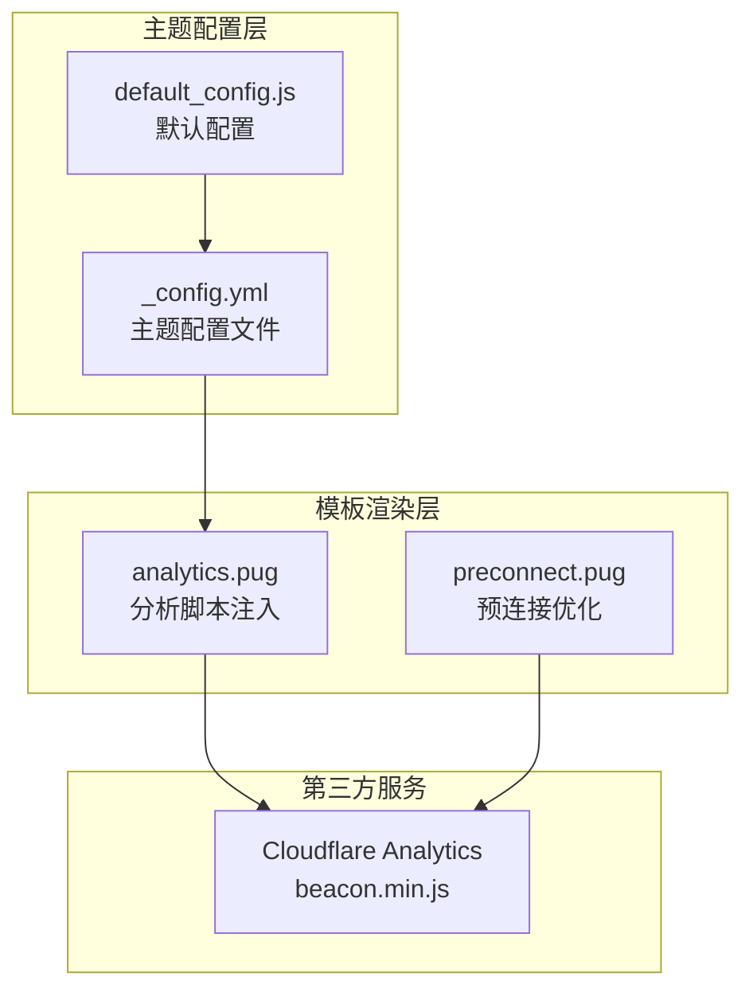
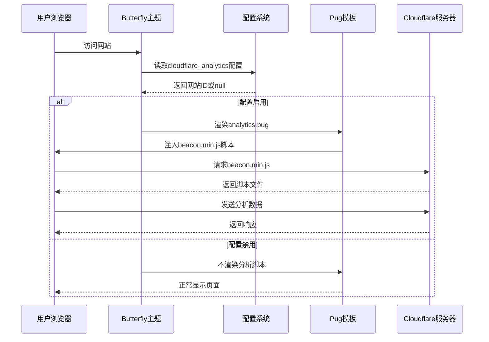
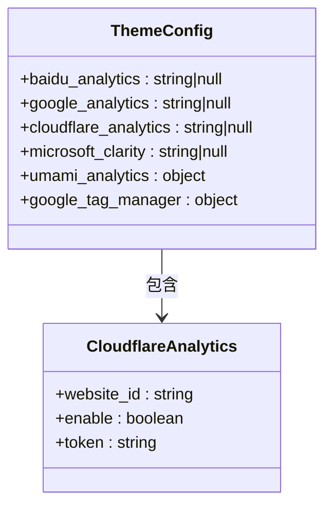
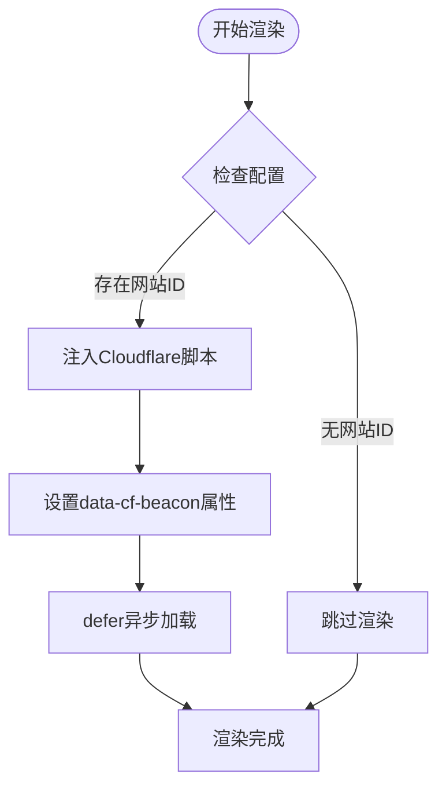
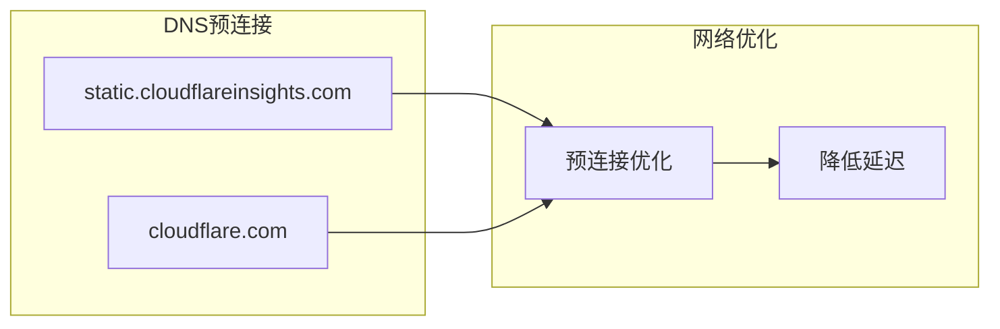
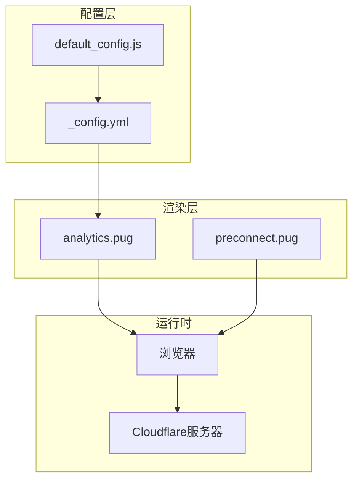

# Cloudflare Analytics集成

<cite>
**本文引用的文件**
- [analytics.pug](file://themes/butterfly/layout/includes/head/analytics.pug)
- [_config.yml](file://themes/butterfly/_config.yml)
- [default_config.js](file://themes/butterfly/scripts/common/default_config.js)
- [preconnect.pug](file://themes/butterfly/layout/includes/head/preconnect.pug)
- [umami_analytics.pug](file://themes/butterfly/layout/includes/third-party/umami_analytics.pug)
</cite>

## 目录
1. [简介](#简介)
2. [项目结构](#项目结构)
3. [核心组件](#核心组件)
4. [架构概览](#架构概览)
5. [详细组件分析](#详细组件分析)
6. [依赖关系分析](#依赖关系分析)
7. [性能考量](#性能考量)
8. [故障排除指南](#故障排除指南)
9. [结论](#结论)
10. [附录](#附录)

## 简介
本文档详细介绍了在Hexo Butterfly主题中集成Cloudflare Analytics的完整配置流程。Cloudflare Analytics是一个由Cloudflare提供的网站分析服务，具有隐私保护特性，不使用Cookie进行用户追踪。本文将深入解析配置方法、参数说明、隐私保护机制，并提供完整的配置示例和验证方法。

## 项目结构
Cloudflare Analytics集成主要涉及以下关键文件：
- 主题配置文件：用于定义分析工具的启用和参数
- Pug模板：负责在页面头部注入分析脚本
- 默认配置：提供配置项的默认值和结构
- 预连接优化：优化第三方资源的加载性能



**图表来源**
- [_config.yml:687-722](file://themes/butterfly/_config.yml#L687-L722)
- [analytics.pug:25-26](file://themes/butterfly/layout/includes/head/analytics.pug#L25-L26)
- [preconnect.pug:25-26](file://themes/butterfly/layout/includes/head/preconnect.pug#L25-L26)

**章节来源**
- [_config.yml:687-722](file://themes/butterfly/_config.yml#L687-L722)
- [analytics.pug:1-45](file://themes/butterfly/layout/includes/head/analytics.pug#L1-L45)
- [default_config.js:403-403](file://themes/butterfly/scripts/common/default_config.js#L403-L403)

## 核心组件
Cloudflare Analytics集成包含以下核心组件：

### 配置参数定义
在主题配置文件中，Cloudflare Analytics通过以下参数进行配置：
- `cloudflare_analytics`: 存储Cloudflare Analytics的网站ID
- 支持的值类型：字符串（网站ID）
- 默认值：null（禁用）

### 模板注入机制
Pug模板负责在页面头部动态注入Cloudflare Analytics脚本，使用defer属性确保异步加载，避免阻塞页面渲染。

### 预连接优化
通过预连接机制优化Cloudflare静态资源的加载性能，减少DNS查询和连接建立时间。

**章节来源**
- [_config.yml:696-698](file://themes/butterfly/_config.yml#L696-L698)
- [analytics.pug:25-26](file://themes/butterfly/layout/includes/head/analytics.pug#L25-L26)
- [preconnect.pug:25-26](file://themes/butterfly/layout/includes/head/preconnect.pug#L25-L26)

## 架构概览
Cloudflare Analytics集成的整体架构如下：



**图表来源**
- [analytics.pug:25-26](file://themes/butterfly/layout/includes/head/analytics.pug#L25-L26)
- [preconnect.pug:25-26](file://themes/butterfly/layout/includes/head/preconnect.pug#L25-L26)

## 详细组件分析

### 配置文件结构分析
Cloudflare Analytics配置位于主题配置文件的分析工具区域：



**图表来源**
- [_config.yml:687-722](file://themes/butterfly/_config.yml#L687-L722)
- [default_config.js:403-403](file://themes/butterfly/scripts/common/default_config.js#L403-L403)

### 模板渲染流程
Cloudflare Analytics脚本的渲染过程：



**图表来源**
- [analytics.pug:25-26](file://themes/butterfly/layout/includes/head/analytics.pug#L25-L26)

### 预连接优化机制
通过预连接机制优化Cloudflare资源的加载：



**图表来源**
- [preconnect.pug:25-26](file://themes/butterfly/layout/includes/head/preconnect.pug#L25-L26)

**章节来源**
- [analytics.pug:1-45](file://themes/butterfly/layout/includes/head/analytics.pug#L1-L45)
- [preconnect.pug:1-35](file://themes/butterfly/layout/includes/head/preconnect.pug#L1-L35)

## 依赖关系分析

### 组件耦合度
Cloudflare Analytics集成展现了良好的模块化设计：



**图表来源**
- [_config.yml:687-722](file://themes/butterfly/_config.yml#L687-L722)
- [analytics.pug:25-26](file://themes/butterfly/layout/includes/head/analytics.pug#L25-L26)
- [preconnect.pug:25-26](file://themes/butterfly/layout/includes/head/preconnect.pug#L25-L26)

### 外部依赖关系
- Cloudflare Analytics服务：提供无Cookie分析功能
- 静态资源CDN：加速脚本文件的分发
- 浏览器兼容性：支持现代浏览器的异步脚本加载

**章节来源**
- [analytics.pug:25-26](file://themes/butterfly/layout/includes/head/analytics.pug#L25-L26)
- [preconnect.pug:25-26](file://themes/butterfly/layout/includes/head/preconnect.pug#L25-L26)

## 性能考量
Cloudflare Analytics集成在性能方面具有以下特点：

### 异步加载优化
- 使用defer属性确保脚本异步加载
- 不阻塞页面内容的渲染
- 提升首屏加载速度

### 预连接机制
- 预先建立Cloudflare域名的DNS连接
- 减少请求时延
- 提升整体加载性能

### 资源压缩
- 使用Cloudflare的CDN进行资源分发
- 自动压缩和缓存静态资源
- 优化带宽使用

## 故障排除指南

### 常见配置问题

#### 1. 网站ID格式错误
**问题症状**：分析数据不显示或出现错误
**解决方法**：
- 确认网站ID格式正确（通常为36位UUID格式）
- 检查是否有多余的空格或特殊字符
- 验证网站ID与Cloudflare账户匹配

#### 2. 脚本加载失败
**问题症状**：控制台出现404错误或脚本未加载
**解决方法**：
- 检查网络连接是否正常
- 确认Cloudflare服务可用性
- 验证防火墙设置是否允许访问Cloudflare域名

#### 3. 预连接优化无效
**问题症状**：页面加载速度没有明显改善
**解决方法**：
- 检查浏览器是否支持预连接功能
- 确认DNS解析正常
- 验证CDN配置是否正确

### 验证方法

#### 1. 基础验证
- 打开浏览器开发者工具
- 在Network标签中查找beacon.min.js请求
- 确认请求状态码为200

#### 2. 功能验证
- 访问多个页面测试数据收集
- 检查Cloudflare Analytics仪表板中的实时数据
- 验证数据准确性

#### 3. 性能验证
- 使用Lighthouse或WebPageTest测试页面性能
- 对比启用和禁用分析脚本的性能差异
- 监控页面加载时间指标

**章节来源**
- [analytics.pug:25-26](file://themes/butterfly/layout/includes/head/analytics.pug#L25-L26)
- [preconnect.pug:25-26](file://themes/butterfly/layout/includes/head/preconnect.pug#L25-L26)

## 结论
Cloudflare Analytics集成在Butterfly主题中实现了优雅的隐私保护分析方案。通过无Cookie追踪机制和异步加载优化，该集成在提供有效分析数据的同时，最大限度地保护了用户隐私并保持了良好的性能表现。

主要优势包括：
- **隐私保护**：不使用Cookie进行用户追踪
- **性能优化**：异步加载和预连接机制
- **易于配置**：简洁的配置接口
- **可靠稳定**：基于Cloudflare的CDN基础设施

对于需要平衡数据分析需求和用户隐私保护的网站，Cloudflare Analytics是一个优秀的解决方案。

## 附录

### 完整配置示例
```yaml
# Cloudflare Analytics配置示例
cloudflare_analytics: "your-website-id-here"
```

### 参数说明
- **cloudflare_analytics**: 必填参数，Cloudflare Analytics的网站ID
- **数据类型**: 字符串
- **默认值**: null（禁用）
- **获取方式**: 登录Cloudflare控制台获取

### 最佳实践建议
1. **隐私优先**：Cloudflare Analytics天然支持隐私保护
2. **性能监控**：定期检查页面加载性能指标
3. **数据验证**：定期验证分析数据的准确性和完整性
4. **安全配置**：确保网站ID的安全存储和传输
5. **合规性**：遵守相关的数据保护法规要求