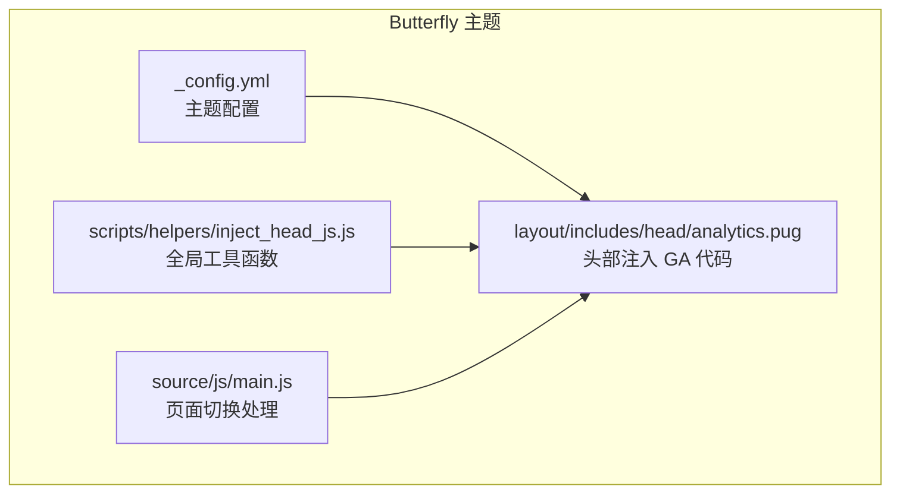
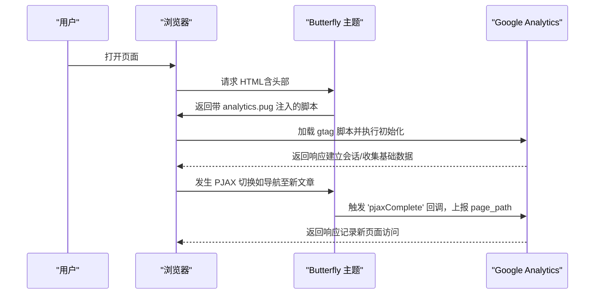
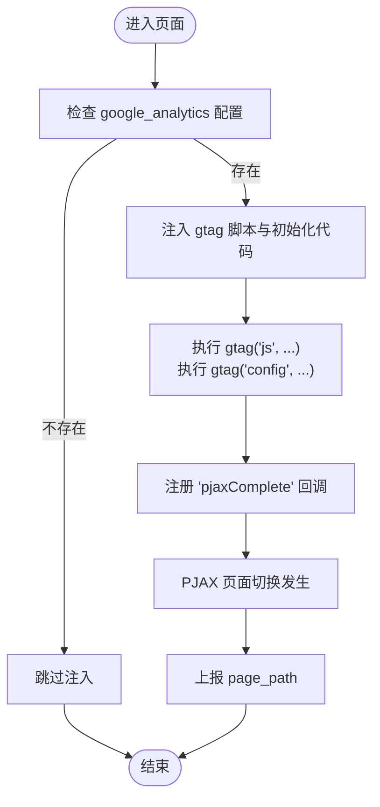
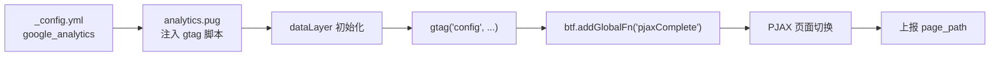

# Google Analytics集成

<cite>
**本文引用的文件**
- [analytics.pug](file://themes/butterfly/layout/includes/head/analytics.pug)
- [_config.yml（Butterfly主题）](file://themes/butterfly/_config.yml)
- [inject_head_js.js](file://themes/butterfly/scripts/helpers/inject_head_js.js)
- [main.js（Butterfly主题源码）](file://themes/butterfly/source/js/main.js)
- [README.md（Butterfly主题）](file://themes/butterfly/README.md)
</cite>

## 目录
1. [简介](#简介)
2. [项目结构](#项目结构)
3. [核心组件](#核心组件)
4. [架构总览](#架构总览)
5. [组件详解](#组件详解)
6. [依赖关系分析](#依赖关系分析)
7. [性能考量](#性能考量)
8. [故障排查指南](#故障排查指南)
9. [结论](#结论)
10. [附录](#附录)

## 简介
本文件面向使用 Butterfly 主题的 Hexo 博客作者，提供 Google Analytics 集成的完整配置与实现说明。内容覆盖：
- 获取测量 ID 的步骤与注意事项
- 在主题配置中的设置位置与参数说明
- 代码注入机制与用户行为跟踪流程
- 完整配置示例与验证方法
- 数据收集规则与隐私设置要点
- 常见问题与最佳实践

## 项目结构
与 Google Analytics 集成直接相关的文件主要分布在以下位置：
- 主题头部注入：analytics.pug
- 主题配置：_config.yml（Butterfly）
- 全局工具函数：inject_head_js.js
- 页面切换处理：main.js（Butterfly 源码）
- 功能概览：README.md（Butterfly）

图表来源
- [analytics.pug:14-23](file://themes/butterfly/layout/includes/head/analytics.pug#L14-L23)
- [_config.yml（Butterfly主题）:690-722](file://themes/butterfly/_config.yml#L690-L722)
- [inject_head_js.js:54-61](file://themes/butterfly/scripts/helpers/inject_head_js.js#L54-L61)
- [main.js（Butterfly主题源码）:891-975](file://themes/butterfly/source/js/main.js#L891-L975)

章节来源
- [analytics.pug:14-23](file://themes/butterfly/layout/includes/head/analytics.pug#L14-L23)
- [_config.yml（Butterfly主题）:690-722](file://themes/butterfly/_config.yml#L690-L722)
- [inject_head_js.js:54-61](file://themes/butterfly/scripts/helpers/inject_head_js.js#L54-L61)
- [main.js（Butterfly主题源码）:891-975](file://themes/butterfly/source/js/main.js#L891-L975)

## 核心组件
- 配置项与入口
  - 主题配置中提供 google_analytics 字段用于启用 GA4/gtag 注入。
  - 当配置存在时，analytics.pug 将动态注入 gtag 脚本与初始化代码。
- 代码注入机制
  - 使用 Pug 模板条件渲染脚本标签，并通过模板字符串注入测量 ID。
  - 初始化时调用 gtag('js', ...) 与 gtag('config', ...)。
- 页面切换与事件触发
  - 通过 inject_head_js.js 提供的 btf.addGlobalFn 注册生命周期回调。
  - 在 PJAX 页面切换完成后，再次调用 gtag('config', ..., {page_path}) 上报页面路径。

章节来源
- [analytics.pug:14-23](file://themes/butterfly/layout/includes/head/analytics.pug#L14-L23)
- [_config.yml（Butterfly主题）:690-722](file://themes/butterfly/_config.yml#L690-L722)
- [inject_head_js.js:54-61](file://themes/butterfly/scripts/helpers/inject_head_js.js#L54-L61)
- [main.js（Butterfly主题源码）:891-975](file://themes/butterfly/source/js/main.js#L891-L975)

## 架构总览
下图展示从配置到页面上报的整体流程：

图表来源
- [analytics.pug:14-23](file://themes/butterfly/layout/includes/head/analytics.pug#L14-L23)
- [inject_head_js.js:54-61](file://themes/butterfly/scripts/helpers/inject_head_js.js#L54-L61)
- [main.js（Butterfly主题源码）:891-975](file://themes/butterfly/source/js/main.js#L891-L975)

## 组件详解

### 配置项与参数说明
- 配置位置
  - 在主题配置文件中找到 analysis 分区，其中包含 google_analytics 字段。
- 参数说明
  - google_analytics：填写你的测量 ID（例如：G-XXXXXXXXXX）。当该字段存在时，主题会在页面头部注入 gtag 脚本与初始化代码。
- 注意事项
  - 仅支持 GA4（gtag），不包含 Universal Analytics（analytics.js）的自动注入逻辑。
  - 若需 Universal Analytics，请参考下方“替代方案”或自定义注入。

章节来源
- [_config.yml（Butterfly主题）:690-722](file://themes/butterfly/_config.yml#L690-L722)

### 代码注入机制
- 注入时机
  - 在页面头部，当检测到 google_analytics 配置时，动态生成并插入 gtag 脚本与初始化脚本。
- 初始化流程
  - 创建 dataLayer 数组。
  - 定义 gtag 函数并将调用推入 dataLayer。
  - 调用 gtag('js', new Date()) 与 gtag('config', measurement_id) 完成初始化。
- 生命周期绑定
  - 通过 btf.addGlobalFn 注册 'pjaxComplete' 回调，在 PJAX 页面切换后再次调用 gtag('config', ..., {page_path}) 上报当前路径。

图表来源
- [analytics.pug:14-23](file://themes/butterfly/layout/includes/head/analytics.pug#L14-L23)
- [inject_head_js.js:54-61](file://themes/butterfly/scripts/helpers/inject_head_js.js#L54-L61)

章节来源
- [analytics.pug:14-23](file://themes/butterfly/layout/includes/head/analytics.pug#L14-L23)
- [inject_head_js.js:54-61](file://themes/butterfly/scripts/helpers/inject_head_js.js#L54-L61)

### 用户行为跟踪
- 页面浏览跟踪
  - 通过 gtag('config', ..., {page_path}) 实现页面路径上报，满足单页应用式导航场景。
- 事件上报
  - 主题未内置通用事件上报封装；如需自定义事件，可在业务代码中调用 gtag('event', ...) 并结合 PJAX 生命周期进行触发。
- 第三方集成
  - 若同时启用了 Google Tag Manager（google_tag_manager），analytics.pug 会注入 GTM 容器脚本并在 PJAX 完成时推送自定义事件对象。

章节来源
- [analytics.pug:36-45](file://themes/butterfly/layout/includes/head/analytics.pug#L36-L45)
- [main.js（Butterfly主题源码）:891-975](file://themes/butterfly/source/js/main.js#L891-L975)

### 验证方法
- 浏览器开发者工具
  - 在 Network 面板过滤 gtag 或 analytics 相关请求，确认初始化与页面上报请求已发送。
- 实时报告
  - 登录 Google Analytics 后台查看实时报告，确认新页面访问被正确统计。
- 日志与断点
  - 在 'pjaxComplete' 回调处添加日志输出，验证回调是否按预期触发。

章节来源
- [analytics.pug:14-23](file://themes/butterfly/layout/includes/head/analytics.pug#L14-L23)
- [inject_head_js.js:54-61](file://themes/butterfly/scripts/helpers/inject_head_js.js#L54-L61)
- [main.js（Butterfly主题源码）:891-975](file://themes/butterfly/source/js/main.js#L891-L975)

### 替代方案：Universal Analytics（analytics.js）
- 现状
  - 当前主题未提供自动注入 Universal Analytics 的逻辑。
- 自定义注入思路
  - 在主题布局的自定义区域或通过第三方插件方式手动插入 analytics.js 脚本与初始化代码。
  - 注意：analytics.js 已停止接收新数据，建议优先使用 GA4。

章节来源
- [README.md（Butterfly主题）:107-111](file://themes/butterfly/README.md#L107-L111)

## 依赖关系分析
- 配置到注入
  - 主题配置 google_analytics 决定是否注入 GA 代码。
- 注入到运行时
  - analytics.pug 注入 gtag 脚本；inject_head_js.js 提供全局工具函数以注册生命周期回调。
- 运行时到上报
  - main.js 中的 PJAX 完成回调触发页面路径上报。

图表来源
- [analytics.pug:14-23](file://themes/butterfly/layout/includes/head/analytics.pug#L14-L23)
- [inject_head_js.js:54-61](file://themes/butterfly/scripts/helpers/inject_head_js.js#L54-L61)
- [main.js（Butterfly主题源码）:891-975](file://themes/butterfly/source/js/main.js#L891-L975)

章节来源
- [analytics.pug:14-23](file://themes/butterfly/layout/includes/head/analytics.pug#L14-L23)
- [inject_head_js.js:54-61](file://themes/butterfly/scripts/helpers/inject_head_js.js#L54-L61)
- [main.js（Butterfly主题源码）:891-975](file://themes/butterfly/source/js/main.js#L891-L975)

## 性能考量
- 脚本加载
  - gtag 脚本采用异步加载，避免阻塞页面渲染。
- 上报频率
  - 仅在 PJAX 完成时上报页面路径，减少不必要的网络请求。
- 本地化与缓存
  - 主题其他模块使用本地存储优化体验，但 GA 注入不涉及本地持久化。

章节来源
- [analytics.pug:15-23](file://themes/butterfly/layout/includes/head/analytics.pug#L15-L23)
- [inject_head_js.js:12-28](file://themes/butterfly/scripts/helpers/inject_head_js.js#L12-L28)

## 故障排查指南
- 未看到数据
  - 检查 google_analytics 配置是否正确填写且无拼写错误。
  - 确认浏览器未启用严格拦截（如广告拦截器）导致脚本被阻止。
  - 使用开发者工具查看 gtag 请求是否成功返回。
- 页面切换未上报
  - 确认 PJAX 已启用且正常工作。
  - 检查 'pjaxComplete' 回调是否被注册与执行。
- 多个分析服务冲突
  - 若同时启用 Google Tag Manager，注意其容器内的事件与变量配置，避免重复上报或命名冲突。

章节来源
- [analytics.pug:14-23](file://themes/butterfly/layout/includes/head/analytics.pug#L14-L23)
- [inject_head_js.js:54-61](file://themes/butterfly/scripts/helpers/inject_head_js.js#L54-L61)
- [main.js（Butterfly主题源码）:891-975](file://themes/butterfly/source/js/main.js#L891-L975)

## 结论
Butterfly 主题对 Google Analytics 的集成以 GA4（gtag）为核心，通过主题配置与 Pug 模板实现自动化注入，并借助全局工具函数与 PJAX 生命周期完成页面路径上报。对于需要 Universal Analytics 的场景，可采用自定义注入方式。建议优先使用 GA4 并结合隐私合规要求进行配置与验证。

## 附录

### 获取测量 ID 的步骤（GA4）
- 登录 Google Analytics 后台，选择数据流或属性设置。
- 创建数据流（如 GA4），复制“测量 ID”（格式通常为 G-XXXXXXXXXX）。
- 将该 ID 填入主题配置的 google_analytics 字段。

章节来源
- [_config.yml（Butterfly主题）:690-722](file://themes/butterfly/_config.yml#L690-L722)

### 配置示例（路径参考）
- 在主题配置文件中定位 analysis 分区，设置 google_analytics 字段。
- 示例路径参考：
  - [主题配置文件:690-722](file://themes/butterfly/_config.yml#L690-L722)

章节来源
- [_config.yml（Butterfly主题）:690-722](file://themes/butterfly/_config.yml#L690-L722)

### 数据收集规则与隐私设置
- 建议遵循 Google Analytics 官方隐私与合规指引，合理配置匿名化 IP、用户粘性与数据保留策略。
- 如需更细粒度的隐私控制，可在 GTM 或自定义脚本中增加开关与用户同意流程。

章节来源
- [README.md（Butterfly主题）:107-111](file://themes/butterfly/README.md#L107-L111)