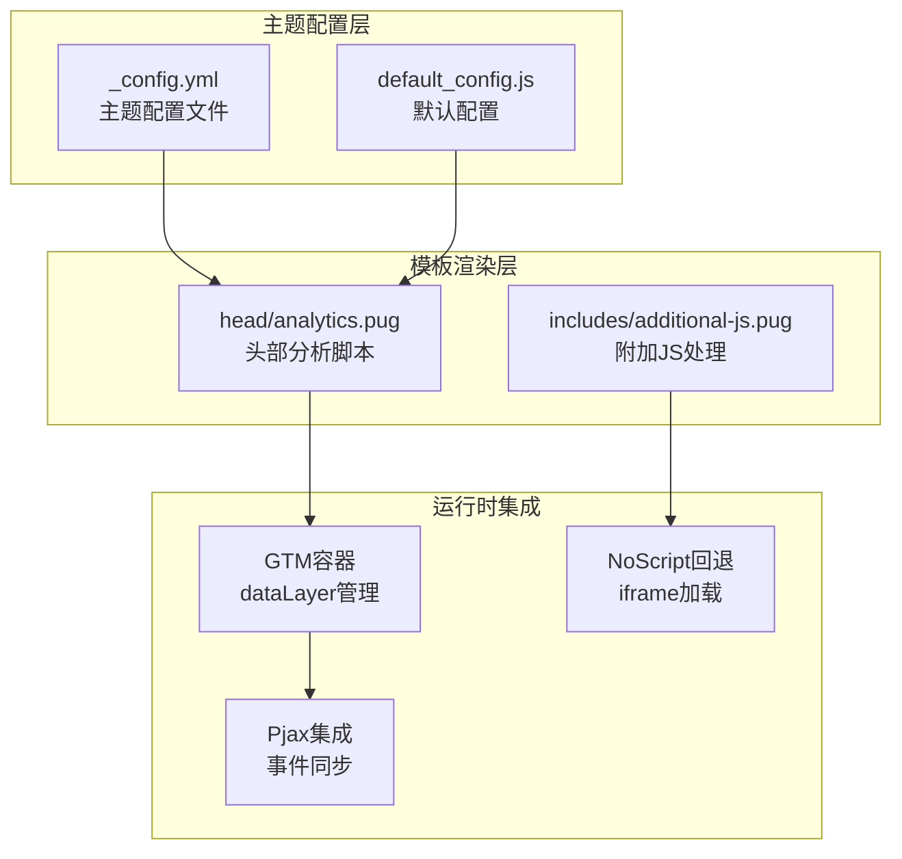
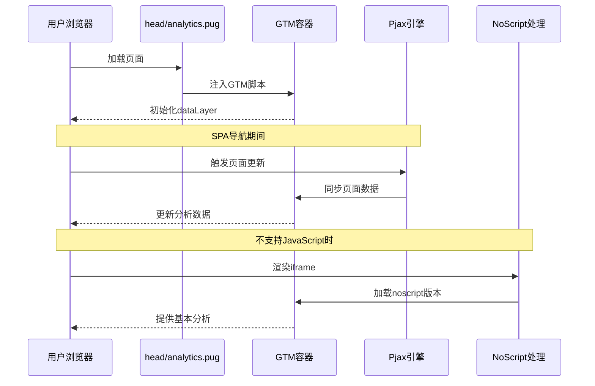
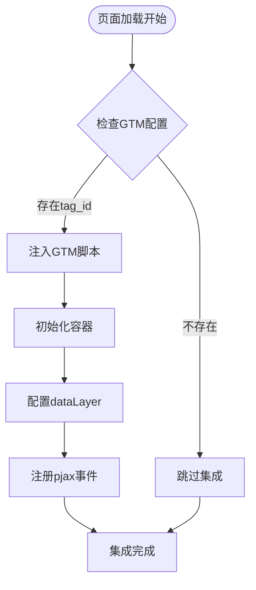
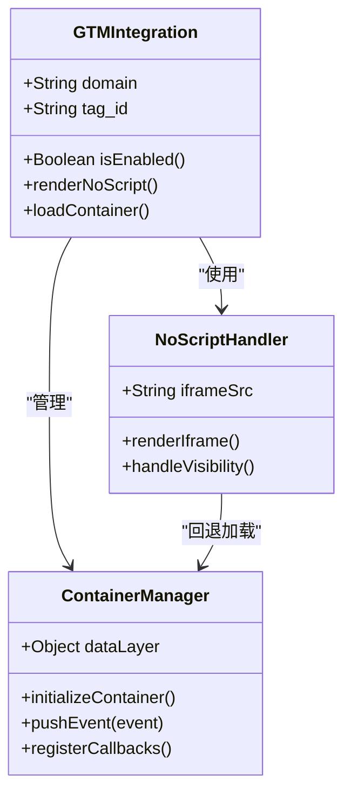
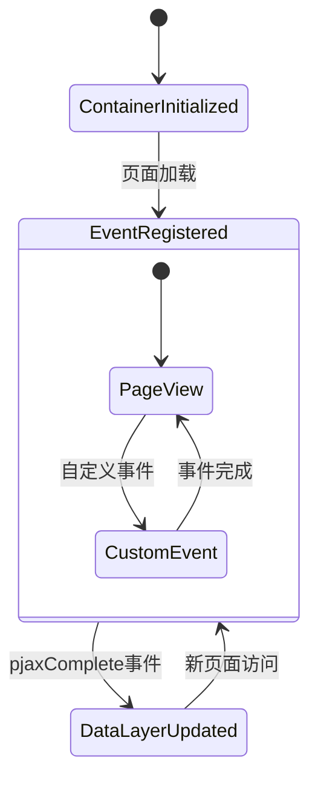
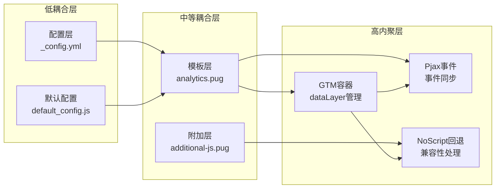

# Google Tag Manager集成

<cite>
**本文档中引用的文件**
- [_config.yml](file://themes/butterfly/_config.yml)
- [analytics.pug](file://themes/butterfly/layout/analytic.pug)
- [additional-js.pug](file://themes/butterfly/layout/includes/additional-js.pug)
- [default_config.js](file://themes/butterfly/scripts/common/default_config.js)
- [package.json](file://themes/butterfly/package.json)
</cite>

## 目录
1. [简介](#简介)
2. [项目结构](#项目结构)
3. [核心组件](#核心组件)
4. [架构概览](#架构概览)
5. [详细组件分析](#详细组件分析)
6. [依赖关系分析](#依赖关系分析)
7. [性能考虑](#性能考虑)
8. [故障排除指南](#故障排除指南)
9. [结论](#结论)

## 简介

Google Tag Manager（GTM）是一个强大的网站分析和营销标签管理工具，允许用户通过单一容器管理多个跟踪代码，而无需修改网站代码。在Hexo主题Butterfly中，GTM集成为用户提供了一个灵活且可扩展的分析解决方案，支持多标签管理和动态配置。

本集成方案提供了以下关键特性：
- 无代码修改的容器ID配置
- 支持自定义域名的GTM容器
- 与Pjax单页应用的无缝集成
- 完整的noscript回退机制
- 多种分析服务的统一管理

## 项目结构

Butterfly主题采用模块化架构设计，Google Tag Manager集成分布在多个关键文件中：

**图表来源**
- [_config.yml:717-722](file://themes/butterfly/_config.yml#L717-L722)
- [analytics.pug:36-45](file://themes/butterfly/layout/includes/head/analytics.pug#L36-L45)
- [additional-js.pug:59-61](file://themes/butterfly/layout/includes/additional-js.pug#L59-L61)

**章节来源**
- [_config.yml:717-722](file://themes/butterfly/_config.yml#L717-L722)
- [default_config.js:397-400](file://themes/butterfly/scripts/common/default_config.js#L397-L400)

## 核心组件

### 配置参数详解

Google Tag Manager集成的核心配置位于主题配置文件中，包含以下关键参数：

| 参数名称 | 类型 | 必需性 | 默认值 | 描述 |
|---------|------|--------|--------|------|
| `google_tag_manager.tag_id` | String | 必需 | null | GTM容器的唯一标识符 |
| `google_tag_manager.domain` | String | 可选 | 'https://www.googletagmanager.com' | 自定义GTM域名 |

### 配置文件位置

GTM配置在主题配置文件中的具体位置：
- **路径**: `themes/butterfly/_config.yml`
- **行号**: 717-722
- **分类**: Analysis部分下的google_tag_manager配置块

**章节来源**
- [_config.yml:717-722](file://themes/butterfly/_config.yml#L717-L722)

## 架构概览

Butterfly主题的Google Tag Manager集成采用分层架构设计，确保了良好的可维护性和扩展性：

**图表来源**
- [analytics.pug:36-45](file://themes/butterfly/layout/includes/head/analytics.pug#L36-L45)
- [additional-js.pug:59-61](file://themes/butterfly/layout/includes/additional-js.pug#L59-L61)

## 详细组件分析

### 模板渲染组件

#### 分析脚本模板 (analytics.pug)

该模板负责在页面头部注入Google Tag Manager脚本：

**图表来源**
- [analytics.pug:36-45](file://themes/butterfly/layout/includes/head/analytics.pug#L36-L45)

#### 附加JS处理 (additional-js.pug)

该组件处理noscript回退机制：

**图表来源**
- [additional-js.pug:59-61](file://themes/butterfly/layout/includes/additional-js.pug#L59-L61)
- [analytics.pug:36-45](file://themes/butterfly/layout/includes/head/analytics.pug#L36-L45)

**章节来源**
- [analytics.pug:36-45](file://themes/butterfly/layout/includes/head/analytics.pug#L36-L45)
- [additional-js.pug:59-61](file://themes/butterfly/layout/includes/additional-js.pug#L59-L61)

### 运行时集成机制

#### 数据层管理

GTM集成通过dataLayer实现事件驱动的数据传递：

#### Pjax事件同步

集成实现了与Pjax单页应用的深度集成：

| 事件类型 | 触发时机 | 数据内容 | 用途 |
|---------|----------|----------|------|
| `pjaxComplete` | SPA页面切换完成 | `{'event': 'pjaxComplete', 'page_title': document.title, 'page_location': location.href, 'page_path': window.location.pathname}` | 更新分析数据 |
| `gtm.js` | 容器初始化 | `{'gtm.start': new Date().getTime(), event:'gtm.js'}` | 标记容器启动 |

**章节来源**
- [analytics.pug:43-44](file://themes/butterfly/layout/includes/head/analytics.pug#L43-L44)

## 依赖关系分析

### 组件耦合度

Google Tag Manager集成展现了良好的模块化设计：

**图表来源**
- [default_config.js:397-400](file://themes/butterfly/scripts/common/default_config.js#L397-L400)
- [analytics.pug:36-45](file://themes/butterfly/layout/includes/head/analytics.pug#L36-L45)
- [additional-js.pug:59-61](file://themes/butterfly/layout/includes/additional-js.pug#L59-L61)

### 外部依赖

集成对外部系统的依赖关系：

| 依赖系统 | 用途 | 版本要求 | 配置方式 |
|---------|------|----------|----------|
| Google Tag Manager | 标签管理平台 | 最新稳定版 | 通过tag_id配置 |
| Google Analytics | 分析服务 | 兼容版本 | 通过gtag.js集成 |
| Pjax | 单页应用框架 | 3.x版本 | 主题内置支持 |
| JavaScript环境 | 运行时支持 | ES5+ | 浏览器原生支持 |

**章节来源**
- [package.json:25-30](file://themes/butterfly/package.json#L25-L30)

## 性能考虑

### 加载优化策略

Google Tag Manager集成采用了多种性能优化技术：

1. **异步加载**: GTM脚本采用异步加载模式，避免阻塞页面渲染
2. **条件加载**: 仅在配置存在时才加载GTM脚本
3. **缓存友好**: 使用CDN分发的GTM脚本，支持浏览器缓存
4. **降级处理**: 提供noscript回退机制，确保兼容性

### 内存管理

集成实现了高效的内存管理策略：

- **事件清理**: 在页面卸载时自动清理事件监听器
- **数据层优化**: 合理管理dataLayer中的事件队列
- **资源释放**: 及时释放不再使用的DOM元素引用

## 故障排除指南

### 常见配置问题

#### 1. 容器ID配置错误

**问题症状**:
- 控制台出现404错误
- 分析数据不显示
- GTM调试工具无法检测到容器

**解决方法**:
1. 确认容器ID格式正确（通常为GTM-XXXXXXX格式）
2. 检查容器ID是否与GTM控制台中的ID一致
3. 验证容器状态是否为"已发布"

#### 2. 域名配置问题

**问题症状**:
- 脚本加载失败
- CORS跨域错误
- 安全警告

**解决方法**:
1. 确认domain配置的URL格式正确
2. 验证域名是否支持HTTPS
3. 检查防火墙和代理设置

#### 3. Pjax事件同步问题

**问题症状**:
- SPA页面切换后分析数据未更新
- 事件统计不准确
- 页面浏览量异常

**解决方法**:
1. 检查Pjax配置是否启用
2. 验证pjaxComplete事件是否正常触发
3. 确认dataLayer.push调用成功

### 验证方法

#### 1. 基础验证

使用浏览器开发者工具进行基本验证：

1. **网络面板**: 检查GTM脚本是否成功加载
2. **控制台**: 查看是否有JavaScript错误
3. **源码**: 确认GTM脚本已正确注入到页面头部

#### 2. 高级验证

使用GTM调试工具进行深入验证：

1. **预览模式**: 在GTM控制台启用预览模式
2. **实时调试**: 使用GTM调试器监控事件
3. **变量检查**: 验证dataLayer中的变量值

#### 3. 功能测试

执行以下功能测试：

1. **页面加载测试**: 验证首页加载时的分析事件
2. **导航测试**: 检查SPA页面切换后的事件同步
3. **自定义事件测试**: 验证自定义事件的触发和处理

**章节来源**
- [analytics.pug:36-45](file://themes/butterfly/layout/includes/head/analytics.pug#L36-L45)
- [additional-js.pug:59-61](file://themes/butterfly/layout/includes/additional-js.pug#L59-L61)

## 结论

Butterfly主题的Google Tag Manager集成为Hexo博客提供了一个强大、灵活且高性能的分析解决方案。通过模块化的架构设计和完善的错误处理机制，该集成方案具有以下优势：

### 技术优势

1. **零代码修改**: 通过配置文件即可启用GTM集成
2. **高度可定制**: 支持自定义域名和高级配置选项
3. **性能优化**: 采用异步加载和缓存友好的设计
4. **兼容性强**: 提供完整的noscript回退机制

### 最佳实践建议

1. **配置验证**: 在生产环境中部署前进行充分的功能测试
2. **监控设置**: 建立数据分析监控，及时发现集成问题
3. **性能监控**: 定期检查GTM脚本的加载性能
4. **安全考虑**: 确保容器ID的安全存储和传输

### 扩展可能性

该集成方案为未来的功能扩展奠定了良好基础，可以轻松添加：
- 更多第三方分析服务的支持
- 自定义事件处理器
- 高级数据过滤和转换功能
- 实时数据同步机制

通过遵循本文档提供的配置指南和最佳实践，用户可以成功部署一个稳定可靠的Google Tag Manager集成，为博客提供全面的分析和监控能力。