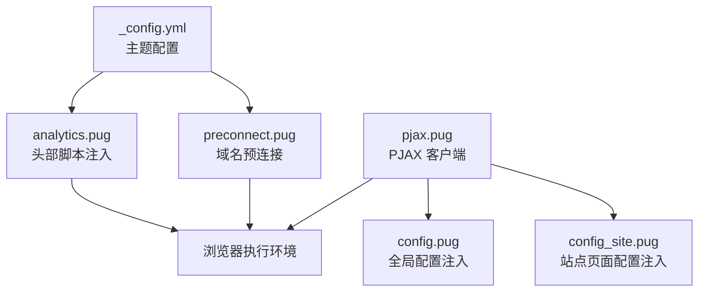
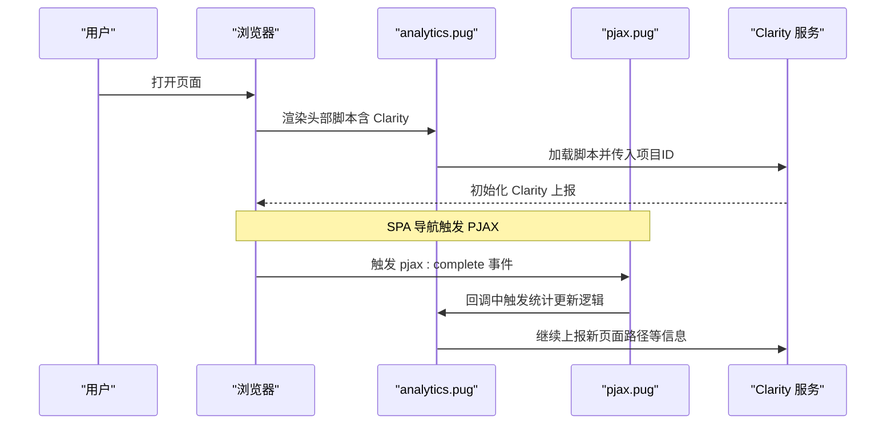
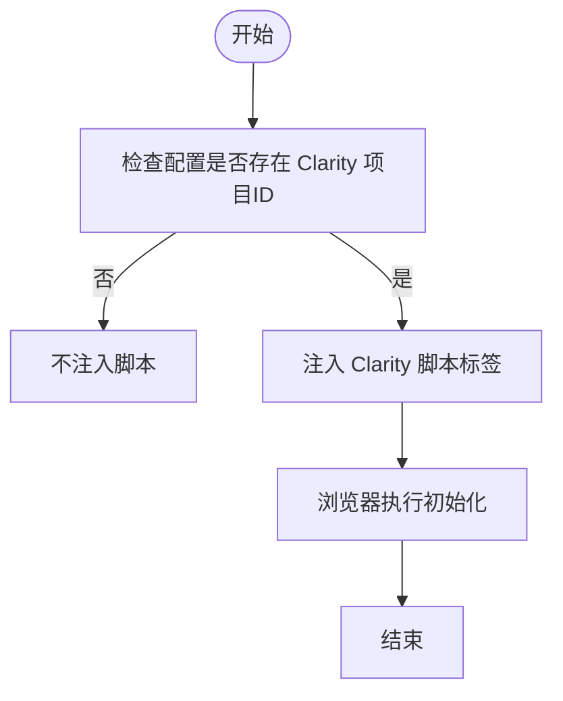
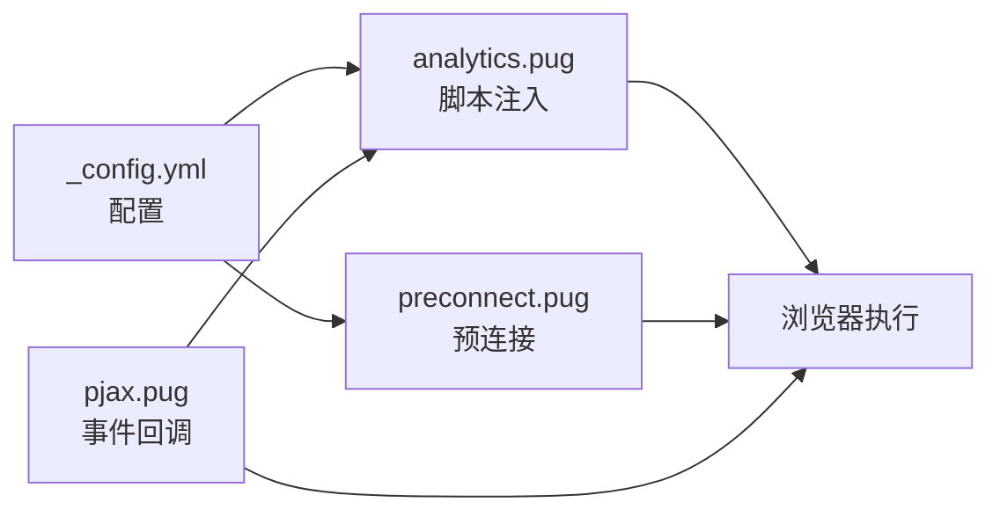

# Microsoft Clarity集成

<cite>
**本文引用的文件**
- [_config.yml](file://themes/butterfly/_config.yml)
- [analytics.pug](file://themes/butterfly/layout/includes/head/analytics.pug)
- [preconnect.pug](file://themes/butterfly/layout/includes/head/preconnect.pug)
- [pjax.pug](file://themes/butterfly/layout/includes/third-party/pjax.pug)
- [config.pug](file://themes/butterfly/layout/includes/head/config.pug)
- [config_site.pug](file://themes/butterfly/layout/includes/head/config_site.pug)
- [package.json](file://themes/butterfly/package.json)
</cite>

## 目录
1. [简介](#简介)
2. [项目结构](#项目结构)
3. [核心组件](#核心组件)
4. [架构总览](#架构总览)
5. [详细组件分析](#详细组件分析)
6. [依赖关系分析](#依赖关系分析)
7. [性能考量](#性能考量)
8. [故障排查指南](#故障排查指南)
9. [结论](#结论)
10. [附录](#附录)

## 简介
本文件面向在 Hexo 主题 Butterfly 中集成 Microsoft Clarity 的使用者，提供从配置到验证、从功能特性到隐私与数据处理规则的完整说明。文档基于仓库中已实现的 Clarity 集成点进行解析，并给出可操作的配置步骤、验证方法与常见问题排查建议。

## 项目结构
围绕 Clarity 的集成涉及以下关键文件：
- 主题配置：用于开启与传入 Clarity 项目 ID
- 头部注入：动态插入 Clarity 脚本与预连接
- 页面导航：通过 PJAX 在 SPA 场景下保持统计连续性

图表来源
- [_config.yml:699-701](file://themes/butterfly/_config.yml#L699-L701)
- [analytics.pug:28-34](file://themes/butterfly/layout/includes/head/analytics.pug#L28-L34)
- [preconnect.pug:28-29](file://themes/butterfly/layout/includes/head/preconnect.pug#L28-L29)
- [pjax.pug:17-28](file://themes/butterfly/layout/includes/third-party/pjax.pug#L17-L28)
- [config.pug:86-125](file://themes/butterfly/layout/includes/head/config.pug#L86-L125)
- [config_site.pug:19-25](file://themes/butterfly/layout/includes/head/config_site.pug#L19-L25)

章节来源
- [_config.yml:699-701](file://themes/butterfly/_config.yml#L699-L701)
- [analytics.pug:28-34](file://themes/butterfly/layout/includes/head/analytics.pug#L28-L34)
- [preconnect.pug:28-29](file://themes/butterfly/layout/includes/head/preconnect.pug#L28-L29)
- [pjax.pug:17-28](file://themes/butterfly/layout/includes/third-party/pjax.pug#L17-L28)
- [config.pug:86-125](file://themes/butterfly/layout/includes/head/config.pug#L86-L125)
- [config_site.pug:19-25](file://themes/butterfly/layout/includes/head/config_site.pug#L19-L25)

## 核心组件
- 主题配置项：在主题配置文件中新增 Clarity 开关与项目 ID 字段
- 头部脚本注入：当配置存在时，动态加载 Clarity 脚本并传入项目 ID
- 预连接声明：为 Clarity 域名建立预连接，降低首包延迟
- PJAX 支持：在单页应用场景下，通过事件回调确保统计连续性

章节来源
- [_config.yml:699-701](file://themes/butterfly/_config.yml#L699-L701)
- [analytics.pug:28-34](file://themes/butterfly/layout/includes/head/analytics.pug#L28-L34)
- [preconnect.pug:28-29](file://themes/butterfly/layout/includes/head/preconnect.pug#L28-L29)
- [pjax.pug:17-28](file://themes/butterfly/layout/includes/third-party/pjax.pug#L17-L28)

## 架构总览
下图展示 Clarity 在页面生命周期中的调用链路，包括配置注入、脚本加载、事件回调与 PJAX 场景下的持续跟踪。

图表来源
- [analytics.pug:28-34](file://themes/butterfly/layout/includes/head/analytics.pug#L28-L34)
- [pjax.pug:17-28](file://themes/butterfly/layout/includes/third-party/pjax.pug#L17-L28)

## 详细组件分析

### 配置项与参数说明
- 配置位置：主题配置文件中“分析”区域下新增 Clarity 选项
- 关键字段：
  - microsoft_clarity：用于存放项目 ID（字符串）
- 配置示例路径：见“附录-配置示例”

章节来源
- [_config.yml:699-701](file://themes/butterfly/_config.yml#L699-L701)

### 头部脚本注入流程
- 条件判断：当配置中存在 Clarity 项目 ID 时才注入脚本
- 注入内容：动态生成 Clarity 脚本标签，传入项目 ID
- 执行时机：页面渲染阶段完成

图表来源
- [analytics.pug:28-34](file://themes/butterfly/layout/includes/head/analytics.pug#L28-L34)

章节来源
- [analytics.pug:28-34](file://themes/butterfly/layout/includes/head/analytics.pug#L28-L34)

### 预连接声明
- 目的：提前与 Clarity 域名建立网络连接，减少首包时间
- 实现：在头部模板中添加域名预连接声明

章节来源
- [preconnect.pug:28-29](file://themes/butterfly/layout/includes/head/preconnect.pug#L28-L29)

### PJAX 场景支持
- 背景：主题使用 PJAX 进行 SPA 导航，避免整页刷新
- 支持方式：在 PJAX 完成事件中触发统计更新逻辑，保证多页访问被正确记录

章节来源
- [pjax.pug:17-28](file://themes/butterfly/layout/includes/third-party/pjax.pug#L17-L28)

### 全局配置注入
- 作用：向前端注入站点与页面级配置，供脚本与组件使用
- 影响：为 Clarity 的运行提供必要的上下文信息（如页面类型、标题等）

章节来源
- [config.pug:86-125](file://themes/butterfly/layout/includes/head/config.pug#L86-L125)
- [config_site.pug:19-25](file://themes/butterfly/layout/includes/head/config_site.pug#L19-L25)

## 依赖关系分析
- 配置依赖：Clarity 是否启用完全取决于主题配置项是否存在且非空
- 运行依赖：浏览器需能访问 Clarity 域名；若网络受限，可能影响初始化
- 事件依赖：PJAX 完成事件用于触发统计更新，确保 SPA 场景下的连续性

图表来源
- [_config.yml:699-701](file://themes/butterfly/_config.yml#L699-L701)
- [analytics.pug:28-34](file://themes/butterfly/layout/includes/head/analytics.pug#L28-L34)
- [preconnect.pug:28-29](file://themes/butterfly/layout/includes/head/preconnect.pug#L28-L29)
- [pjax.pug:17-28](file://themes/butterfly/layout/includes/third-party/pjax.pug#L17-L28)

章节来源
- [_config.yml:699-701](file://themes/butterfly/_config.yml#L699-L701)
- [analytics.pug:28-34](file://themes/butterfly/layout/includes/head/analytics.pug#L28-L34)
- [preconnect.pug:28-29](file://themes/butterfly/layout/includes/head/preconnect.pug#L28-L29)
- [pjax.pug:17-28](file://themes/butterfly/layout/includes/third-party/pjax.pug#L17-L28)

## 性能考量
- 预连接：通过预连接声明减少 DNS 查询与握手时间，提升首包速度
- 异步加载：脚本采用异步加载，避免阻塞页面渲染
- PJAX：在 SPA 场景下减少全量资源重新加载，有助于整体性能

章节来源
- [preconnect.pug:28-29](file://themes/butterfly/layout/includes/head/preconnect.pug#L28-L29)
- [analytics.pug:28-34](file://themes/butterfly/layout/includes/head/analytics.pug#L28-L34)
- [pjax.pug:17-28](file://themes/butterfly/layout/includes/third-party/pjax.pug#L17-L28)

## 故障排查指南
- 未看到数据上报
  - 检查配置项是否正确填写（项目 ID 非空）
  - 确认网络可访问 Clarity 域名
  - 在浏览器开发者工具 Network 面板确认脚本加载成功
- SPA 场景数据不连续
  - 确认 PJAX 已启用且正常工作
  - 检查 pjax 完成事件是否触发统计更新逻辑
- 跨域或 CSP 限制
  - 若部署在严格 CSP 环境，需允许 Clarity 域名的脚本执行

章节来源
- [analytics.pug:28-34](file://themes/butterfly/layout/includes/head/analytics.pug#L28-L34)
- [pjax.pug:17-28](file://themes/butterfly/layout/includes/third-party/pjax.pug#L17-L28)
- [preconnect.pug:28-29](file://themes/butterfly/layout/includes/head/preconnect.pug#L28-L29)

## 结论
Butterfly 主题对 Microsoft Clarity 的集成较为简洁：通过主题配置传入项目 ID，由头部模板在条件满足时注入脚本并建立预连接，同时借助 PJAX 事件保障 SPA 场景下的统计连续性。实际效果取决于网络可达性与配置正确性。

## 附录

### 获取项目 ID 的步骤（概述）
- 登录 Microsoft Clarity 控制台
- 创建或选择一个网站项目
- 复制项目 ID（通常显示在项目设置或脚本片段中）
- 将项目 ID 填入主题配置文件的对应字段

### 在主题配置中的设置位置与参数
- 设置位置：主题配置文件中“分析”区域下的 Clarity 选项
- 参数名称：microsoft_clarity
- 参数类型：字符串（项目 ID）
- 示例路径：见“章节来源”中配置文件路径

章节来源
- [_config.yml:699-701](file://themes/butterfly/_config.yml#L699-L701)

### 完整配置示例（路径）
- 示例参考路径：[配置文件示例:699-701](file://themes/butterfly/_config.yml#L699-L701)

### 验证方法
- 浏览器 Network 面板：确认 Clarity 脚本已加载
- 浏览器 Console：查看是否有脚本报错
- Clarity 控制台：确认项目中出现新的会话数据

### Clarity 会话重放与用户行为分析特性（概述）
- 会话重放：基于收集的交互事件回放用户浏览过程
- 用户行为分析：提供点击热力、滚动深度、入口/出口等维度的数据洞察
- 使用建议：结合业务目标设定关键事件与转化路径，定期复盘用户路径

### 隐私保护与数据处理规则（概述）
- 数据最小化：仅采集必要信息以达成分析目的
- 数据匿名化：避免直接识别个人身份的信息
- 合规要求：遵循所在地区的法律法规（如 GDPR、CCPA 等）
- 用户同意：在必要时提供透明度与撤回同意机制

### 常见配置问题与最佳实践
- 常见问题
  - 项目 ID 错误或拼写错误
  - 网络不可达导致脚本加载失败
  - CSP 或跨域策略阻止脚本执行
- 最佳实践
  - 在开发环境先验证脚本加载与数据上报
  - 使用预连接提升加载性能
  - 在 SPA 场景下确保 PJAX 事件回调生效
  - 对敏感站点，评估 CSP 与隐私合规要求后再启用