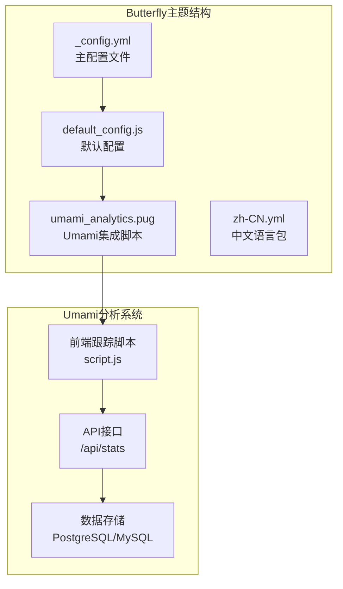
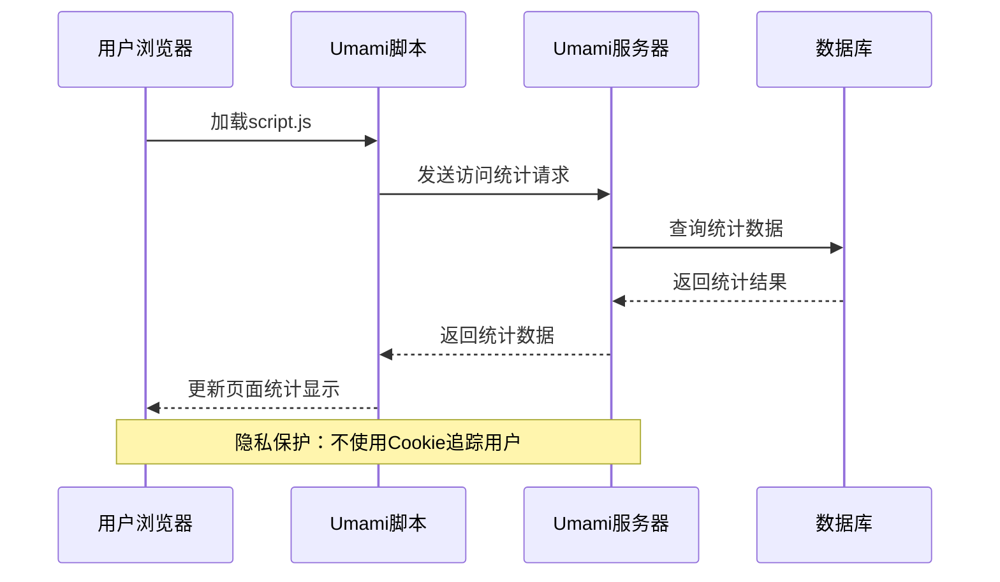
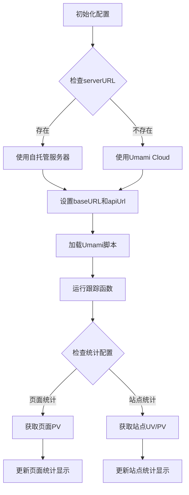
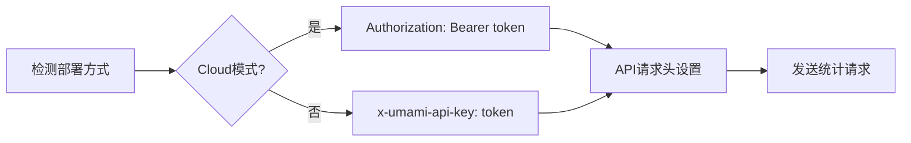
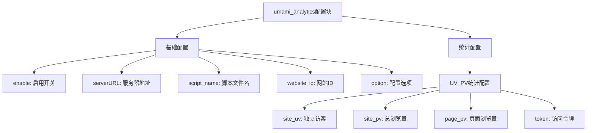
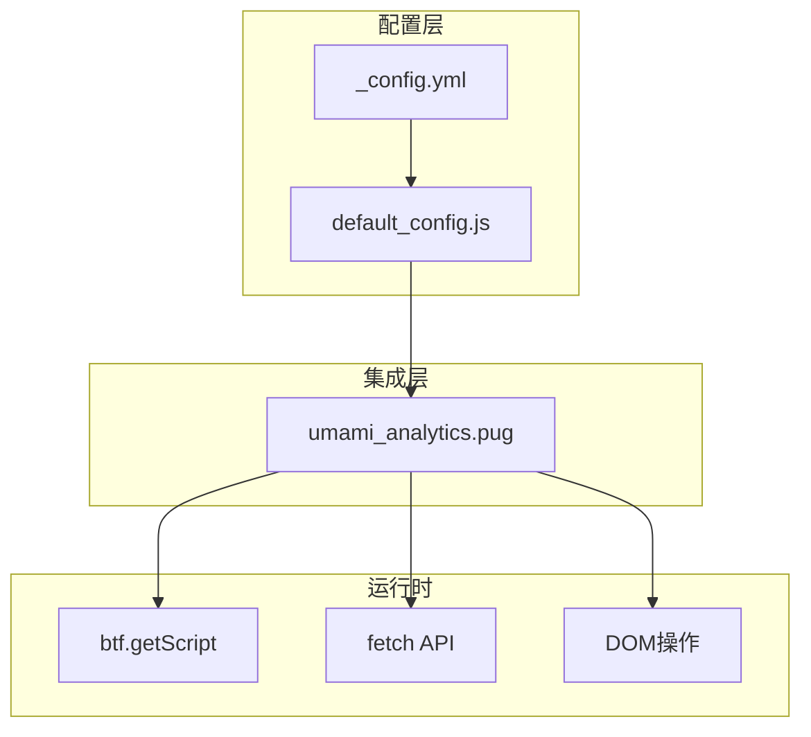

# Umami分析系统

<cite>
**本文档引用的文件**
- [umami_analytics.pug](file://themes/butterfly/layout/includes/third-party/umami_analytics.pug)
- [default_config.js](file://themes/butterfly/scripts/common/default_config.js)
- [_config.yml](file://themes/butterfly/_config.yml)
- [zh-CN.yml](file://themes/butterfly/languages/zh-CN.yml)
- [package.json](file://themes/butterfly/package.json)
</cite>

## 目录
1. [简介](#简介)
2. [项目结构](#项目结构)
3. [核心组件](#核心组件)
4. [架构概览](#架构概览)
5. [详细组件分析](#详细组件分析)
6. [依赖关系分析](#依赖关系分析)
7. [性能考虑](#性能考虑)
8. [故障排除指南](#故障排除指南)
9. [结论](#结论)

## 简介

Umami是一个开源的网站分析工具，提供隐私友好的分析解决方案。本项目基于Butterfly主题，集成了Umami分析系统，支持两种部署方式：自托管服务器和云端服务（Umami Cloud）。

Umami分析系统的主要特点：
- **隐私保护**：不使用Cookie，不追踪用户身份
- **开源免费**：完全开源，可自由部署
- **轻量级**：JavaScript文件大小仅约1KB
- **实时统计**：支持UV（独立访客）和PV（页面浏览量）统计
- **多语言支持**：支持多种语言界面

## 项目结构

Butterfly主题中的Umami集成采用模块化设计，主要包含以下组件：

**图表来源**
- [_config.yml:703-716](file://themes/butterfly/_config.yml#L703-L716)
- [default_config.js:405-417](file://themes/butterfly/scripts/common/default_config.js#L405-L417)
- [umami_analytics.pug:1-110](file://themes/butterfly/layout/includes/third-party/umami_analytics.pug#L1-L110)

**章节来源**
- [_config.yml:703-716](file://themes/butterfly/_config.yml#L703-L716)
- [default_config.js:405-417](file://themes/butterfly/scripts/common/default_config.js#L405-L417)

## 核心组件

### 配置参数详解

Umami分析系统的核心配置参数如下：

| 参数名称 | 类型 | 默认值 | 描述 |
|---------|------|--------|------|
| `enable` | boolean | false | 是否启用Umami分析 |
| `serverURL` | string | null | 自托管服务器地址（可选） |
| `script_name` | string | 'script.js' | 脚本文件名 |
| `website_id` | string | null | 网站标识符 |
| `option` | object | null | 额外配置选项 |
| `UV_PV` | object | {} | 统计配置对象 |

### UV_PV统计配置

UV_PV配置对象包含以下统计选项：

| 配置项 | 类型 | 默认值 | 描述 |
|-------|------|--------|------|
| `site_uv` | boolean | false | 显示站点独立访客数 |
| `site_pv` | boolean | false | 显示站点总浏览量 |
| `page_pv` | boolean | false | 显示页面浏览量 |
| `token` | string | null | 访问令牌或API密钥 |

**章节来源**
- [umami_analytics.pug:1-110](file://themes/butterfly/layout/includes/third-party/umami_analytics.pug#L1-L110)
- [_config.yml:710-716](file://themes/butterfly/_config.yml#L710-L716)

## 架构概览

Umami分析系统的整体架构分为三个层次：

**图表来源**
- [umami_analytics.pug:19-29](file://themes/butterfly/layout/includes/third-party/umami_analytics.pug#L19-L29)
- [umami_analytics.pug:31-57](file://themes/butterfly/layout/includes/third-party/umami_analytics.pug#L31-L57)

## 详细组件分析

### Umami集成脚本分析

Umami集成脚本实现了完整的分析功能，包括数据收集和统计展示。

#### 核心功能流程

**图表来源**
- [umami_analytics.pug:1-110](file://themes/butterfly/layout/includes/third-party/umami_analytics.pug#L1-L110)

#### 数据获取机制

脚本根据部署方式自动选择不同的认证机制：

**图表来源**
- [umami_analytics.pug:37-41](file://themes/butterfly/layout/includes/third-party/umami_analytics.pug#L37-L41)

**章节来源**
- [umami_analytics.pug:1-110](file://themes/butterfly/layout/includes/third-party/umami_analytics.pug#L1-L110)

### 配置文件结构

Butterfly主题提供了完整的Umami配置支持：

#### 主配置文件结构

**图表来源**
- [_config.yml:703-716](file://themes/butterfly/_config.yml#L703-L716)
- [default_config.js:405-417](file://themes/butterfly/scripts/common/default_config.js#L405-L417)

**章节来源**
- [_config.yml:703-716](file://themes/butterfly/_config.yml#L703-L716)
- [default_config.js:405-417](file://themes/butterfly/scripts/common/default_config.js#L405-L417)

## 依赖关系分析

### 组件依赖图

**图表来源**
- [umami_analytics.pug:19-29](file://themes/butterfly/layout/includes/third-party/umami_analytics.pug#L19-L29)
- [umami_analytics.pug:31-57](file://themes/butterfly/layout/includes/third-party/umami_analytics.pug#L31-L57)

### 外部依赖

Umami分析系统依赖于以下外部资源：

| 依赖项 | 版本要求 | 用途 |
|-------|----------|------|
| hexo-renderer-pug | ^3.0.0 | Pug模板渲染 |
| hexo-renderer-stylus | ^3.0.1 | Stylus样式处理 |
| hexo-util | ^4.0.0 | Hexo工具函数 |
| moment-timezone | ^0.6.0 | 时间处理 |

**章节来源**
- [package.json:25-30](file://themes/butterfly/package.json#L25-L30)

## 性能考虑

### 轻量级设计

Umami分析系统采用极简设计原则：

- **脚本大小**：约1KB，最小化网络传输开销
- **异步加载**：使用Promise和async/await避免阻塞页面渲染
- **条件加载**：仅在需要时加载统计脚本
- **缓存策略**：合理利用浏览器缓存机制

### 性能优化建议

1. **CDN加速**：建议使用CDN分发Umami脚本
2. **延迟加载**：在页面加载完成后异步加载统计脚本
3. **批量请求**：合并多个统计请求减少HTTP开销
4. **本地缓存**：对静态统计数据进行本地缓存

## 故障排除指南

### 常见配置问题

#### 1. 统计数据不显示

**可能原因**：
- `website_id`配置错误
- `token`配置不正确
- 网络连接问题

**解决方法**：
1. 验证`website_id`是否与Umami后台一致
2. 检查`token`格式是否正确
3. 确认网络连接正常

#### 2. 脚本加载失败

**可能原因**：
- `serverURL`配置错误
- 跨域问题
- CDN不可用

**解决方法**：
1. 检查`serverURL`格式（必须以`https://`开头）
2. 验证跨域设置
3. 更换CDN节点

#### 3. 统计准确性问题

**可能原因**：
- 缓存问题
- 多域名配置
- 预渲染问题

**解决方法**：
1. 清除浏览器缓存
2. 确保所有子域名使用相同`website_id`
3. 配置预渲染兼容性

### 调试技巧

1. **浏览器控制台**：查看Umami相关的JavaScript错误
2. **网络面板**：监控统计请求的响应状态
3. **开发者工具**：检查DOM元素是否正确更新

**章节来源**
- [umami_analytics.pug:14-16](file://themes/butterfly/layout/includes/third-party/umami_analytics.pug#L14-L16)
- [umami_analytics.pug:26-28](file://themes/butterfly/layout/includes/third-party/umami_analytics.pug#L26-L28)

## 结论

Umami分析系统为Butterfly主题提供了强大而隐私友好的分析能力。通过灵活的配置选项，用户可以根据需求选择最适合的部署方式。

### 主要优势

1. **隐私保护**：不使用Cookie追踪用户，符合GDPR要求
2. **开源免费**：完全开源，无隐藏费用
3. **易于部署**：支持一键安装和自托管部署
4. **性能优秀**：轻量级设计，不影响页面加载速度
5. **功能完整**：支持UV/PV统计、实时数据、多语言界面

### 最佳实践建议

1. **安全配置**：妥善保管`token`，定期更换
2. **性能监控**：定期检查统计脚本的加载性能
3. **数据备份**：定期备份Umami数据库
4. **合规审查**：确保符合当地法律法规要求

通过合理的配置和维护，Umami分析系统能够为网站提供准确可靠的访问统计信息，同时保护用户的隐私权益。