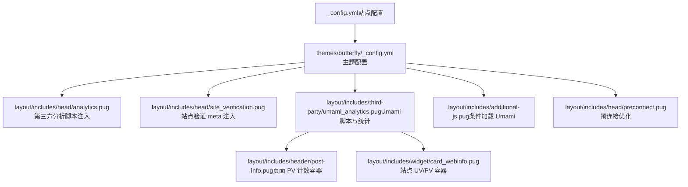
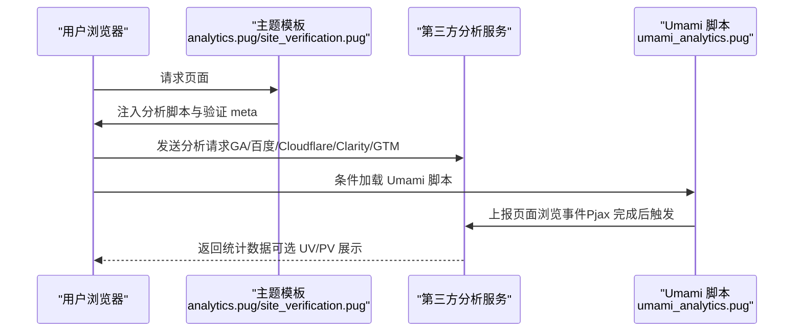
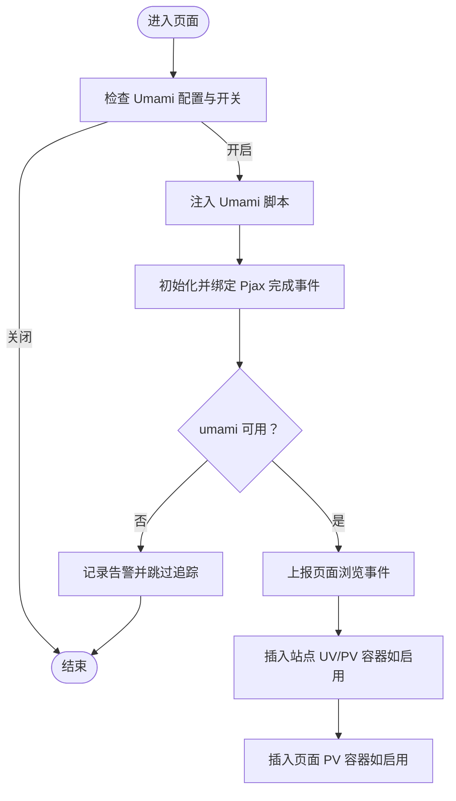
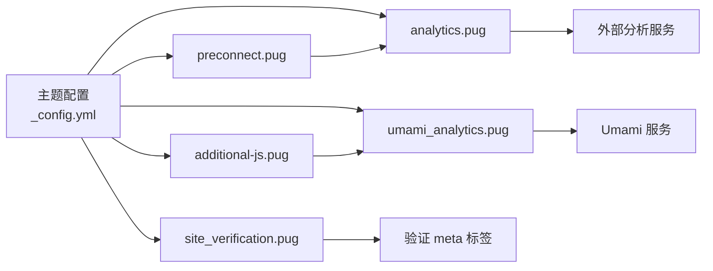

# 分析集成

<cite>
**本文引用的文件**
- [_config.yml](file://_config.yml)
- [themes/butterfly/_config.yml](file://themes/butterfly/_config.yml)
- [themes/butterfly/layout/includes/head/analytics.pug](file://themes/butterfly/layout/includes/head/analytics.pug)
- [themes/butterfly/layout/includes/head/site_verification.pug](file://themes/butterfly/layout/includes/head/site_verification.pug)
- [themes/butterfly/layout/includes/additional-js.pug](file://themes/butterfly/layout/includes/additional-js.pug)
- [themes/butterfly/layout/includes/third-party/umami_analytics.pug](file://themes/butterfly/layout/includes/third-party/umami_analytics.pug)
- [themes/butterfly/layout/includes/header/post-info.pug](file://themes/butterfly/layout/includes/header/post-info.pug)
- [themes/butterfly/layout/includes/widget/card_webinfo.pug](file://themes/butterfly/layout/includes/widget/card_webinfo.pug)
- [themes/butterfly/layout/includes/head/preconnect.pug](file://themes/butterfly/layout/includes/head/preconnect.pug)
</cite>

## 目录
1. [简介](#简介)
2. [项目结构](#项目结构)
3. [核心组件](#核心组件)
4. [架构总览](#架构总览)
5. [详细组件分析](#详细组件分析)
6. [依赖关系分析](#依赖关系分析)
7. [性能考量](#性能考量)
8. [故障排查指南](#故障排查指南)
9. [结论](#结论)
10. [附录](#附录)

## 简介
本文件面向使用 Butterfly 主题的 Hexo 博客，系统化梳理“分析集成”的配置与实现，覆盖以下能力：
- 第三方分析服务：百度统计、Google Analytics、Cloudflare Analytics、Microsoft Clarity、Google Tag Manager
- 站点验证工具：Google Site Verification、百度站点验证等
- Umami 分析系统：支持自托管与云端版本，含页面与站点级 PV/UV 展示
- 隐私与合规：脚本加载时机、Pjax 兼容、可选预连接优化
- 实施步骤与最佳实践：从配置到部署的完整流程

## 项目结构
与分析集成直接相关的文件主要位于主题目录的 includes 与 head 子目录中，以及站点根配置文件中。下图展示关键文件与其职责：

图表来源
- [themes/butterfly/_config.yml](file://themes/butterfly/_config.yml)
- [themes/butterfly/layout/includes/head/analytics.pug](file://themes/butterfly/layout/includes/head/analytics.pug)
- [themes/butterfly/layout/includes/head/site_verification.pug](file://themes/butterfly/layout/includes/head/site_verification.pug)
- [themes/butterfly/layout/includes/third-party/umami_analytics.pug](file://themes/butterfly/layout/includes/third-party/umami_analytics.pug)
- [themes/butterfly/layout/includes/additional-js.pug](file://themes/butterfly/layout/includes/additional-js.pug)
- [themes/butterfly/layout/includes/head/preconnect.pug](file://themes/butterfly/layout/includes/head/preconnect.pug)
- [themes/butterfly/layout/includes/header/post-info.pug](file://themes/butterfly/layout/includes/header/post-info.pug)
- [themes/butterfly/layout/includes/widget/card_webinfo.pug](file://themes/butterfly/layout/includes/widget/card_webinfo.pug)

章节来源
- [themes/butterfly/_config.yml](file://themes/butterfly/_config.yml)
- [_config.yml](file://_config.yml)

## 核心组件
- 主题配置项（analysis 与 verification）
  - 百度统计、Google Analytics、Cloudflare Analytics、Microsoft Clarity、Google Tag Manager、Umami Analytics、站点验证
- 前端注入与执行
  - analytics.pug：按配置动态注入各分析脚本
  - site_verification.pug：按配置注入 meta 验证标签
  - preconnect.pug：对 GA、百度、Cloudflare、Clarity 的域名进行预连接优化
  - additional-js.pug：条件加载 Umami 模块
  - umami_analytics.pug：实现 Umami 脚本加载、事件追踪、Pjax 兼容、UV/PV 展示
  - post-info.pug 与 card_webinfo.pug：用于页面与站点级 PV/UV 的 DOM 容器

章节来源
- [themes/butterfly/_config.yml](file://themes/butterfly/_config.yml)
- [themes/butterfly/layout/includes/head/analytics.pug](file://themes/butterfly/layout/includes/head/analytics.pug)
- [themes/butterfly/layout/includes/head/site_verification.pug](file://themes/butterfly/layout/includes/head/site_verification.pug)
- [themes/butterfly/layout/includes/head/preconnect.pug](file://themes/butterfly/layout/includes/head/preconnect.pug)
- [themes/butterfly/layout/includes/additional-js.pug](file://themes/butterfly/layout/includes/additional-js.pug)
- [themes/butterfly/layout/includes/third-party/umami_analytics.pug](file://themes/butterfly/layout/includes/third-party/umami_analytics.pug)
- [themes/butterfly/layout/includes/header/post-info.pug](file://themes/butterfly/layout/includes/header/post-info.pug)
- [themes/butterfly/layout/includes/widget/card_webinfo.pug](file://themes/butterfly/layout/includes/widget/card_webinfo.pug)

## 架构总览
下图展示“站点配置 → 主题模板 → 前端脚本注入 → 数据上报”的整体流程。

图表来源
- [themes/butterfly/layout/includes/head/analytics.pug](file://themes/butterfly/layout/includes/head/analytics.pug)
- [themes/butterfly/layout/includes/head/site_verification.pug](file://themes/butterfly/layout/includes/head/site_verification.pug)
- [themes/butterfly/layout/includes/third-party/umami_analytics.pug](file://themes/butterfly/layout/includes/third-party/umami_analytics.pug)

## 详细组件分析

### 百度统计
- 配置入口
  - 在主题配置中设置对应字段以启用
- 注入逻辑
  - 当配置存在时，模板注入百度统计脚本，并在 Pjax 完成后推送页面浏览事件
- 预连接
  - 对百度统计域名进行预连接优化
- 隐私与合规
  - 建议在部署前确认是否满足本地监管要求；如需更严格控制，可在模板层增加开关或条件判断

章节来源
- [themes/butterfly/_config.yml](file://themes/butterfly/_config.yml)
- [themes/butterfly/layout/includes/head/analytics.pug](file://themes/butterfly/layout/includes/head/analytics.pug)
- [themes/butterfly/layout/includes/head/preconnect.pug](file://themes/butterfly/layout/includes/head/preconnect.pug)

### Google Analytics
- 配置入口
  - 在主题配置中设置 ID 以启用
- 注入逻辑
  - 注入 gtag 脚本并初始化；Pjax 完成后再次调用配置以更新页面路径
- 预连接
  - 对 GA 域名进行预连接优化
- 隐私与合规
  - 建议结合站点隐私政策与 Cookie 合规策略，必要时在模板层增加“拒绝跟踪”逻辑

章节来源
- [themes/butterfly/_config.yml](file://themes/butterfly/_config.yml)
- [themes/butterfly/layout/includes/head/analytics.pug](file://themes/butterfly/layout/includes/head/analytics.pug)
- [themes/butterfly/layout/includes/head/preconnect.pug](file://themes/butterfly/layout/includes/head/preconnect.pug)

### Cloudflare Analytics
- 配置入口
  - 在主题配置中设置 Token 以启用
- 注入逻辑
  - 注入 Cloudflare Insights 脚本并传入 Token
- 预连接
  - 对 Cloudflare 域名进行预连接优化
- 隐私与合规
  - 建议评估数据收集范围与本地法规；如需限制，可在模板层增加条件判断

章节来源
- [themes/butterfly/_config.yml](file://themes/butterfly/_config.yml)
- [themes/butterfly/layout/includes/head/analytics.pug](file://themes/butterfly/layout/includes/head/analytics.pug)
- [themes/butterfly/layout/includes/head/preconnect.pug](file://themes/butterfly/layout/includes/head/preconnect.pug)

### Microsoft Clarity
- 配置入口
  - 在主题配置中设置 ID 以启用
- 注入逻辑
  - 注入 Clarity 脚本并传入 ID
- 预连接
  - 对 Clarity 域名进行预连接优化
- 隐私与合规
  - 建议明确告知用户并提供选择退出机制；必要时在模板层增加开关

章节来源
- [themes/butterfly/_config.yml](file://themes/butterfly/_config.yml)
- [themes/butterfly/layout/includes/head/analytics.pug](file://themes/butterfly/layout/includes/head/analytics.pug)
- [themes/butterfly/layout/includes/head/preconnect.pug](file://themes/butterfly/layout/includes/head/preconnect.pug)

### Google Tag Manager
- 配置入口
  - 在主题配置中设置 Tag ID 与可选域名
- 注入逻辑
  - 注入 GTM 脚本并在 Pjax 完成后推送自定义事件以同步页面信息
- 预连接
  - 对 GTM 域名进行预连接优化
- 隐私与合规
  - 建议通过容器策略限制数据收集范围；结合站点隐私政策实施用户同意机制

章节来源
- [themes/butterfly/_config.yml](file://themes/butterfly/_config.yml)
- [themes/butterfly/layout/includes/head/analytics.pug](file://themes/butterfly/layout/includes/head/analytics.pug)
- [themes/butterfly/layout/includes/head/preconnect.pug](file://themes/butterfly/layout/includes/head/preconnect.pug)

### Umami 分析系统
- 配置入口
  - enable：是否启用
  - serverURL：自托管实例地址（末尾斜杠会被移除）
  - script_name：脚本文件名（默认值见配置）
  - website_id：站点标识
  - option：透传给脚本的额外选项
  - UV_PV：站点级与页面级 UV/PV 开关与 token
- 注入与执行
  - additional-js.pug 条件加载 Umami 模块
  - umami_analytics.pug 动态拼接脚本 URL 与 API 地址，注入脚本并初始化
  - Pjax 完成后触发页面追踪；若未找到全局 umami 方法则记录警告
  - 支持通过 header 与 widget 组件插入站点级 UV/PV 与页面 PV 的 DOM 容器
- 自托管与云端
  - 未设置 serverURL 时，默认使用云端地址；设置后自动切换为自托管模式
  - token 字段在云端使用 API Key，在自托管使用访问令牌
- 隐私与合规
  - 建议在模板层增加“用户同意”开关；仅在同意后注入脚本
  - 可通过 option 控制数据收集粒度（如匿名化）

图表来源
- [themes/butterfly/layout/includes/additional-js.pug](file://themes/butterfly/layout/includes/additional-js.pug)
- [themes/butterfly/layout/includes/third-party/umami_analytics.pug](file://themes/butterfly/layout/includes/third-party/umami_analytics.pug)
- [themes/butterfly/layout/includes/header/post-info.pug](file://themes/butterfly/layout/includes/header/post-info.pug)
- [themes/butterfly/layout/includes/widget/card_webinfo.pug](file://themes/butterfly/layout/includes/widget/card_webinfo.pug)

章节来源
- [themes/butterfly/_config.yml](file://themes/butterfly/_config.yml)
- [themes/butterfly/layout/includes/additional-js.pug](file://themes/butterfly/layout/includes/additional-js.pug)
- [themes/butterfly/layout/includes/third-party/umami_analytics.pug](file://themes/butterfly/layout/includes/third-party/umami_analytics.pug)
- [themes/butterfly/layout/includes/header/post-info.pug](file://themes/butterfly/layout/includes/header/post-info.pug)
- [themes/butterfly/layout/includes/widget/card_webinfo.pug](file://themes/butterfly/layout/includes/widget/card_webinfo.pug)

### 站点验证工具
- 配置入口
  - site_verification：数组，每项包含 name 与 content
- 注入逻辑
  - 按配置生成多个 meta 标签，用于 Google Site Verification、百度站点验证等
- 使用建议
  - 将平台提供的验证内容填入 content，name 填写平台要求的名称

章节来源
- [themes/butterfly/_config.yml](file://themes/butterfly/_config.yml)
- [themes/butterfly/layout/includes/head/site_verification.pug](file://themes/butterfly/layout/includes/head/site_verification.pug)

## 依赖关系分析
- 配置依赖
  - 主题配置决定是否注入脚本与注入哪些脚本
- 模板依赖
  - analytics.pug 依赖主题配置中的各项 ID/Token
  - site_verification.pug 依赖主题配置中的验证列表
  - preconnect.pug 依赖 analytics.pug 中涉及的服务域名
  - additional-js.pug 依赖 Umami 配置开关
  - umami_analytics.pug 依赖 serverURL、website_id、token 等配置
- 运行时依赖
  - Pjax 完成事件驱动分析脚本的二次配置与事件上报
  - 页面与站点级 UV/PV 依赖对应的 DOM 容器存在

图表来源
- [themes/butterfly/_config.yml](file://themes/butterfly/_config.yml)
- [themes/butterfly/layout/includes/head/analytics.pug](file://themes/butterfly/layout/includes/head/analytics.pug)
- [themes/butterfly/layout/includes/head/site_verification.pug](file://themes/butterfly/layout/includes/head/site_verification.pug)
- [themes/butterfly/layout/includes/head/preconnect.pug](file://themes/butterfly/layout/includes/head/preconnect.pug)
- [themes/butterfly/layout/includes/additional-js.pug](file://themes/butterfly/layout/includes/additional-js.pug)
- [themes/butterfly/layout/includes/third-party/umami_analytics.pug](file://themes/butterfly/layout/includes/third-party/umami_analytics.pug)

## 性能考量
- 预连接优化
  - 对 GA、百度、Cloudflare、Clarity 的域名进行预连接，减少首包延迟
- 异步与 defer
  - GA 与 Cloudflare 脚本采用异步/延迟加载，避免阻塞渲染
- Pjax 兼容
  - 所有分析脚本在 Pjax 完成后重新初始化或上报，确保 SPA 场景下的数据连续性
- 资源体积
  - Umami 默认脚本名可配置，建议在自托管环境下使用压缩版本以降低体积

章节来源
- [themes/butterfly/layout/includes/head/preconnect.pug](file://themes/butterfly/layout/includes/head/preconnect.pug)
- [themes/butterfly/layout/includes/head/analytics.pug](file://themes/butterfly/layout/includes/head/analytics.pug)
- [themes/butterfly/layout/includes/third-party/umami_analytics.pug](file://themes/butterfly/layout/includes/third-party/umami_analytics.pug)

## 故障排查指南
- 百度统计/Google Analytics/Cloudflare/Clarity 无数据
  - 检查主题配置中的 ID/Token 是否正确
  - 确认 analytics.pug 已被渲染（即配置存在）
  - 查看浏览器网络面板是否存在脚本加载与请求
- Umami 无数据或告警
  - 检查 additional-js.pug 是否加载了 Umami 模块
  - 检查 umami_analytics.pug 是否注入了脚本且未出现“umami 不可用”的告警
  - 确认 Pjax 完成事件是否触发（可在控制台监听）
  - 若使用自托管，请确认 serverURL 与 token 正确
- 站点验证失败
  - 检查 site_verification 列表是否正确写入 name 与 content
  - 确认 meta 标签已注入到页面头部

章节来源
- [themes/butterfly/layout/includes/head/analytics.pug](file://themes/butterfly/layout/includes/head/analytics.pug)
- [themes/butterfly/layout/includes/third-party/umami_analytics.pug](file://themes/butterfly/layout/includes/third-party/umami_analytics.pug)
- [themes/butterfly/layout/includes/head/site_verification.pug](file://themes/butterfly/layout/includes/head/site_verification.pug)

## 结论
本主题提供了完善的第三方分析与站点验证集成能力，覆盖主流分析平台与 Umami 系统。通过主题配置即可快速启用或禁用相应功能，并在前端模板中完成脚本注入与事件上报。建议在部署前结合隐私与合规要求，对脚本加载与数据收集范围进行审慎控制。

## 附录

### 配置项速览与示例步骤
- 百度统计
  - 在主题配置中填写对应字段以启用
  - 部署后在百度统计后台核对数据
- Google Analytics
  - 在主题配置中填写 ID；如需域名单独指定，可配置域名
  - 部署后在 GA 后台核对数据
- Cloudflare Analytics
  - 在主题配置中填写 Token
  - 部署后在 Cloudflare Analytics 后台核对数据
- Microsoft Clarity
  - 在主题配置中填写 ID
  - 部署后在 Clarity 后台核对数据
- Google Tag Manager
  - 在主题配置中填写 Tag ID；如需使用自定义域名，可配置 domain
  - 部署后在 GTM 后台核对数据
- Umami
  - enable：true/false
  - serverURL：自托管地址（可选）
  - script_name：脚本文件名（可选）
  - website_id：站点标识
  - option：透传参数（可选）
  - UV_PV：site_uv/site_pv/page_pv 与 token（云端用 API Key，自托管用 token）
  - 部署后在 Umami 后台核对数据
- 站点验证
  - site_verification：数组，每项包含 name 与 content
  - 填写平台提供的验证内容后部署生效

章节来源
- [themes/butterfly/_config.yml](file://themes/butterfly/_config.yml)