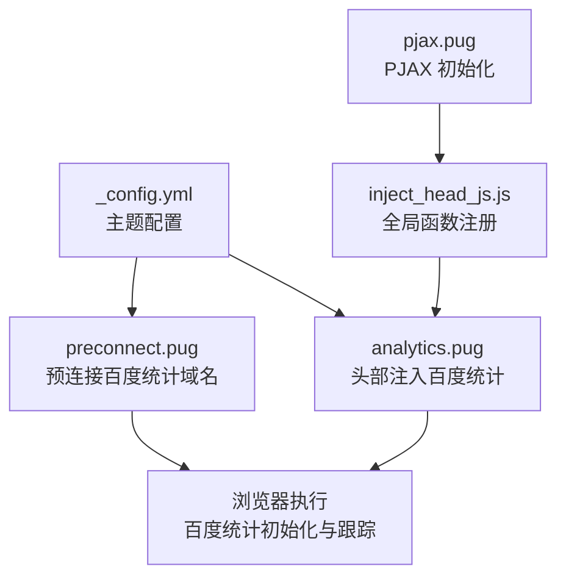
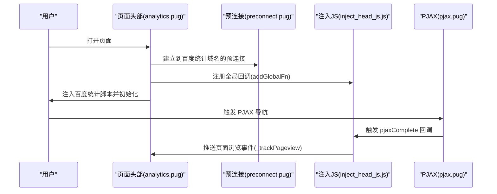
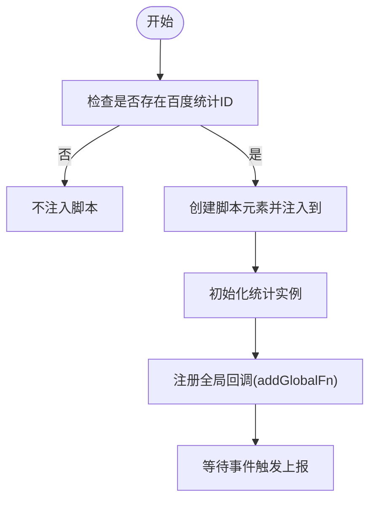
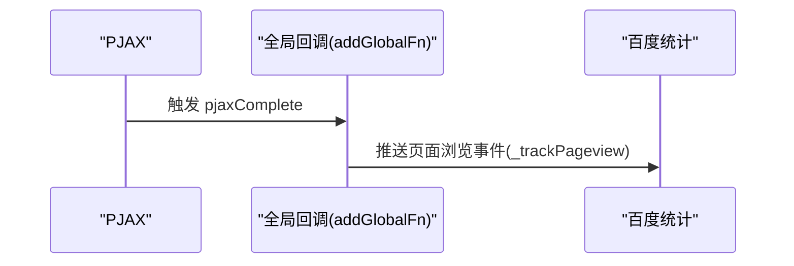
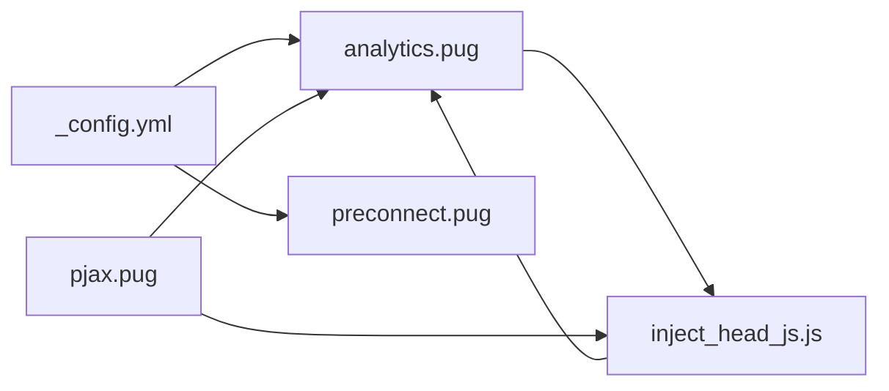

# 百度统计集成

<cite>
**本文引用的文件**
- [_config.yml](file://themes/butterfly/_config.yml)
- [analytics.pug](file://themes/butterfly/layout/includes/head/analytics.pug)
- [preconnect.pug](file://themes/butterfly/layout/includes/head/preconnect.pug)
- [pjax.pug](file://themes/butterfly/layout/includes/third-party/pjax.pug)
- [inject_head_js.js](file://themes/butterfly/scripts/helpers/inject_head_js.js)
- [README_CN.md](file://themes/butterfly/README_CN.md)
- [_config.yml](file://_config.yml)
</cite>

## 目录
1. [简介](#简介)
2. [项目结构](#项目结构)
3. [核心组件](#核心组件)
4. [架构总览](#架构总览)
5. [详细组件分析](#详细组件分析)
6. [依赖关系分析](#依赖关系分析)
7. [性能考量](#性能考量)
8. [故障排查指南](#故障排查指南)
9. [结论](#结论)
10. [附录](#附录)

## 简介
本文件面向在 Hexo + Butterfly 主题中集成百度统计的用户，提供从“获取统计 ID 到页面跟踪”的全流程说明，包括：
- 如何在主题配置中启用并填写百度统计 ID
- 百度统计代码注入机制与页面跟踪实现
- 完整配置示例与验证方法
- 与其他分析服务（如 Google Analytics、Cloudflare Analytics、Microsoft Clarity、Umami）的差异与优势
- 常见问题与最佳实践

## 项目结构
围绕百度统计集成的关键文件与职责如下：
- 主题配置文件：用于开启百度统计并填写统计 ID
- 头部注入模板：负责在页面头部注入百度统计脚本与初始化逻辑
- 预连接模板：为百度统计域名建立预连接，提升加载性能
- PJAX 模板：在单页应用切换时触发页面跟踪
- 注入 JS 助手：提供全局工具函数，支撑百度统计回调注册
- 主题文档：概述支持的分析服务类型

**图表来源**
- [_config.yml](file://themes/butterfly/_config.yml)
- [analytics.pug](file://themes/butterfly/layout/includes/head/analytics.pug)
- [preconnect.pug](file://themes/butterfly/layout/includes/head/preconnect.pug)
- [pjax.pug](file://themes/butterfly/layout/includes/third-party/pjax.pug)
- [inject_head_js.js](file://themes/butterfly/scripts/helpers/inject_head_js.js)

**章节来源**
- [_config.yml](file://themes/butterfly/_config.yml)
- [analytics.pug](file://themes/butterfly/layout/includes/head/analytics.pug)
- [preconnect.pug](file://themes/butterfly/layout/includes/head/preconnect.pug)
- [pjax.pug](file://themes/butterfly/layout/includes/third-party/pjax.pug)
- [inject_head_js.js](file://themes/butterfly/scripts/helpers/inject_head_js.js)
- [README_CN.md](file://themes/butterfly/README_CN.md)

## 核心组件
- 主题配置项：在主题配置中新增百度统计开关与 ID 字段，用于控制是否启用及注入哪个站点的统计脚本。
- 头部注入模板：条件性渲染百度统计脚本，并在页面加载完成后进行初始化；同时在 PJAX 完成事件中推送页面浏览事件。
- 预连接模板：对百度统计域名建立预连接，减少 DNS 查询与握手延迟。
- PJAX 模板：在 PJAX 页面切换时，通过全局回调机制触发百度统计的页面跟踪。
- 注入 JS 助手：提供 addGlobalFn 等工具，便于在不同生命周期注册回调。

**章节来源**
- [_config.yml](file://themes/butterfly/_config.yml)
- [analytics.pug](file://themes/butterfly/layout/includes/head/analytics.pug)
- [preconnect.pug](file://themes/butterfly/layout/includes/head/preconnect.pug)
- [pjax.pug](file://themes/butterfly/layout/includes/third-party/pjax.pug)
- [inject_head_js.js](file://themes/butterfly/scripts/helpers/inject_head_js.js)

## 架构总览
百度统计在 Butterfly 中的运行流程如下：
- 在主题配置中开启并填写百度统计 ID
- 构建阶段根据配置在页面头部注入百度统计脚本
- 预连接模板提前建立到百度统计域名的网络连接
- 页面首次加载时初始化百度统计
- 使用 PJAX 进行页面切换时，通过全局回调向百度统计上报页面浏览事件

**图表来源**
- [analytics.pug](file://themes/butterfly/layout/includes/head/analytics.pug)
- [preconnect.pug](file://themes/butterfly/layout/includes/head/preconnect.pug)
- [inject_head_js.js](file://themes/butterfly/scripts/helpers/inject_head_js.js)
- [pjax.pug](file://themes/butterfly/layout/includes/third-party/pjax.pug)

## 详细组件分析

### 获取统计 ID 与配置入口
- 在主题配置文件中找到“分析”区域，定位百度统计配置项。
- 填写统计 ID 后保存配置，构建后即可生效。

关键位置参考：
- 主题配置文件路径：themes/butterfly/_config.yml
- 分析区域注释与百度统计配置项所在行号：见下方“章节来源”

**章节来源**
- [_config.yml](file://themes/butterfly/_config.yml)

### 代码注入机制
- 条件注入：仅当配置中存在百度统计 ID 时才注入脚本。
- 初始化逻辑：创建脚本元素并插入到页面头部，确保统计脚本在 DOM 加载后可用。
- 全局回调注册：通过注入的全局工具函数注册 PJAX 完成后的回调，以便在 SPA 切换时自动上报。

关键实现参考：
- 头部注入模板：themes/butterfly/layout/includes/head/analytics.pug
- 注入 JS 助手：themes/butterfly/scripts/helpers/inject_head_js.js

**图表来源**
- [analytics.pug](file://themes/butterfly/layout/includes/head/analytics.pug)
- [inject_head_js.js](file://themes/butterfly/scripts/helpers/inject_head_js.js)

**章节来源**
- [analytics.pug](file://themes/butterfly/layout/includes/head/analytics.pug)
- [inject_head_js.js](file://themes/butterfly/scripts/helpers/inject_head_js.js)

### 页面跟踪与 PJAX 集成
- 预连接：在预连接模板中为百度统计域名建立预连接，降低后续请求延迟。
- PJAX 完成事件：在 PJAX 完成时，通过已注册的全局回调推送页面浏览事件，确保 SPA 场景下的页面访问统计准确。

关键实现参考：
- 预连接模板：themes/butterfly/layout/includes/head/preconnect.pug
- PJAX 模板：themes/butterfly/layout/includes/third-party/pjax.pug

**图表来源**
- [preconnect.pug](file://themes/butterfly/layout/includes/head/preconnect.pug)
- [pjax.pug](file://themes/butterfly/layout/includes/third-party/pjax.pug)
- [analytics.pug](file://themes/butterfly/layout/includes/head/analytics.pug)

**章节来源**
- [preconnect.pug](file://themes/butterfly/layout/includes/head/preconnect.pug)
- [pjax.pug](file://themes/butterfly/layout/includes/third-party/pjax.pug)
- [analytics.pug](file://themes/butterfly/layout/includes/head/analytics.pug)

### 配置示例与验证方法
- 配置示例：在主题配置文件中设置百度统计 ID，保存后重新构建站点。
- 验证方法：
  - 浏览器开发者工具 Network 面板确认百度统计脚本被成功加载。
  - 查看百度统计后台是否收到页面浏览事件。
  - 在 SPA 场景下切换页面，确认事件持续上报。

参考路径：
- 主题配置文件：themes/butterfly/_config.yml
- 构建命令：hexo clean && hexo g
- 部署命令：hexo d 或对应部署配置

**章节来源**
- [_config.yml](file://themes/butterfly/_config.yml)
- [_config.yml](file://_config.yml)

### 与其他分析服务的差异与优势
- 支持的服务类型：主题文档明确列出支持多种分析服务，包括百度统计、Google Analytics、Cloudflare Analytics、Microsoft Clarity、Umami 等。
- 差异点：
  - 百度统计：国内用户较多，与国内网络环境适配较好，适合国内站点。
  - Google Analytics：国际通用，生态完善，适合国际化站点。
  - Cloudflare Analytics：隐私友好，无 Cookie，适合注重隐私的场景。
  - Microsoft Clarity：行为可视化，适合用户体验研究。
  - Umami：开源可自托管，适合对数据主权有要求的场景。
- 优势选择：
  - 若主要受众在国内，优先考虑百度统计以获得更稳定的访问体验。
  - 若需国际通用性与生态能力，可考虑 Google Analytics。
  - 若强调隐私与合规，可考虑 Cloudflare Analytics 或 Umami。

**章节来源**
- [README_CN.md](file://themes/butterfly/README_CN.md)
- [_config.yml](file://themes/butterfly/_config.yml)

## 依赖关系分析
百度统计集成涉及以下模块间的耦合关系：
- 主题配置与头部注入模板：配置决定是否注入脚本。
- 预连接模板与头部注入模板：共同保障网络层面的性能优化。
- 注入 JS 助手与头部注入模板：前者提供回调注册能力，后者触发回调。
- PJAX 模板与注入 JS 助手：前者触发回调，后者承载回调逻辑。

**图表来源**
- [_config.yml](file://themes/butterfly/_config.yml)
- [analytics.pug](file://themes/butterfly/layout/includes/head/analytics.pug)
- [preconnect.pug](file://themes/butterfly/layout/includes/head/preconnect.pug)
- [inject_head_js.js](file://themes/butterfly/scripts/helpers/inject_head_js.js)
- [pjax.pug](file://themes/butterfly/layout/includes/third-party/pjax.pug)

**章节来源**
- [_config.yml](file://themes/butterfly/_config.yml)
- [analytics.pug](file://themes/butterfly/layout/includes/head/analytics.pug)
- [preconnect.pug](file://themes/butterfly/layout/includes/head/preconnect.pug)
- [inject_head_js.js](file://themes/butterfly/scripts/helpers/inject_head_js.js)
- [pjax.pug](file://themes/butterfly/layout/includes/third-party/pjax.pug)

## 性能考量
- 预连接：通过预连接模板对百度统计域名建立连接，有助于降低 DNS 解析与 TCP 握手时间，提升首屏与切换性能。
- 异步加载：注入的脚本采用异步加载策略，避免阻塞页面渲染。
- PJAX 事件：在 SPA 场景下仅在 PJAX 完成时触发上报，减少重复上报与无效请求。

**章节来源**
- [preconnect.pug](file://themes/butterfly/layout/includes/head/preconnect.pug)
- [analytics.pug](file://themes/butterfly/layout/includes/head/analytics.pug)
- [pjax.pug](file://themes/butterfly/layout/includes/third-party/pjax.pug)

## 故障排查指南
- 未看到统计数据：
  - 检查主题配置中是否正确填写了百度统计 ID。
  - 确认构建后站点已部署到线上，且域名已在百度统计中完成验证。
  - 使用浏览器开发者工具 Network 面板确认脚本加载成功。
- SPA 切换后无上报：
  - 确认 PJAX 已启用且未被排除。
  - 检查全局回调是否注册成功（由注入 JS 助手负责）。
- 加载缓慢或阻塞：
  - 确认已启用预连接。
  - 检查是否存在其他脚本阻塞主进程。

**章节来源**
- [analytics.pug](file://themes/butterfly/layout/includes/head/analytics.pug)
- [preconnect.pug](file://themes/butterfly/layout/includes/head/preconnect.pug)
- [pjax.pug](file://themes/butterfly/layout/includes/third-party/pjax.pug)
- [inject_head_js.js](file://themes/butterfly/scripts/helpers/inject_head_js.js)

## 结论
通过在主题配置中启用并填写百度统计 ID，结合头部注入模板、预连接与 PJAX 回调机制，可以在 Hexo + Butterfly 环境中实现稳定、高效的页面跟踪。对于国内用户较多的站点，百度统计具备良好的网络适配与稳定性；若站点具有国际化需求或对隐私有更高要求，可考虑其他分析服务作为补充或替代。

## 附录
- 配置文件路径与关键行号：
  - 主题配置文件：themes/butterfly/_config.yml
  - 分析区域注释与百度统计配置项所在行号：见下方“章节来源”
- 构建与部署命令参考：
  - 构建：hexo clean && hexo g
  - 部署：hexo d 或对应部署配置

**章节来源**
- [_config.yml](file://themes/butterfly/_config.yml)
- [_config.yml](file://_config.yml)