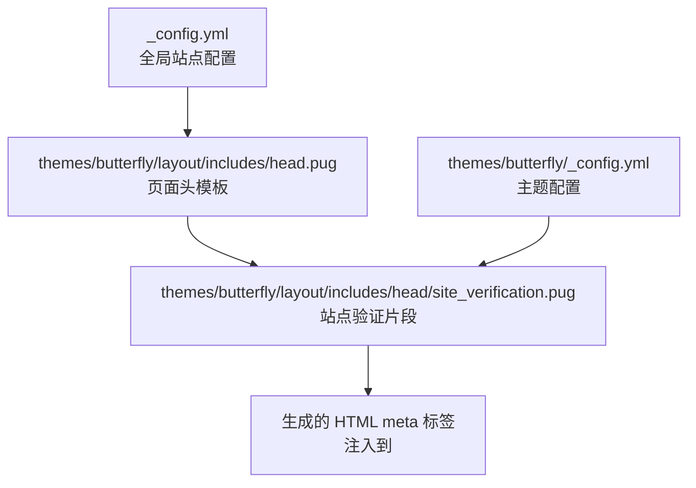
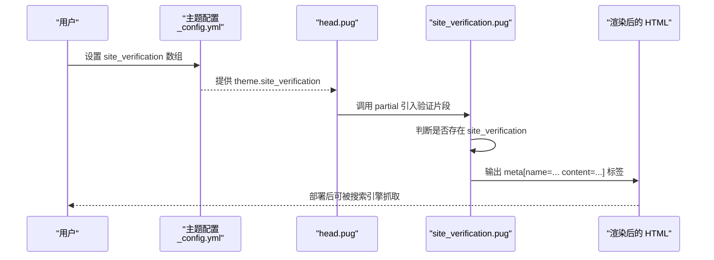
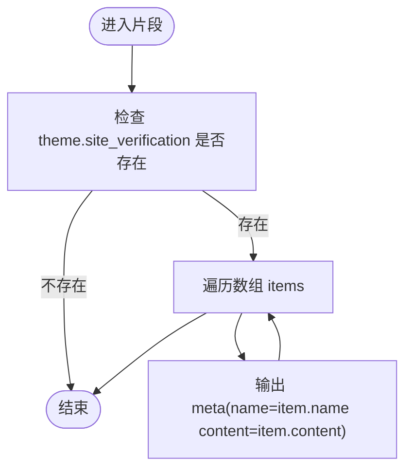
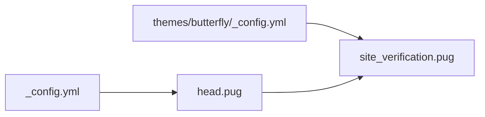

# 站点验证工具

<cite>
**本文引用的文件**
- [themes/butterfly/_config.yml](file://themes/butterfly/_config.yml)
- [themes/butterfly/layout/includes/head/site_verification.pug](file://themes/butterfly/layout/includes/head/site_verification.pug)
- [themes/butterfly/layout/includes/head.pug](file://themes/butterfly/layout/includes/head.pug)
- [themes/butterfly/layout/includes/head/Open_Graph.pug](file://themes/butterfly/layout/includes/head/Open_Graph.pug)
- [_config.yml](file://_config.yml)
</cite>

## 目录
1. [简介](#简介)
2. [项目结构](#项目结构)
3. [核心组件](#核心组件)
4. [架构总览](#架构总览)
5. [详细组件分析](#详细组件分析)
6. [依赖关系分析](#依赖关系分析)
7. [性能考虑](#性能考虑)
8. [故障排除指南](#故障排除指南)
9. [结论](#结论)
10. [附录](#附录)

## 简介
本文件面向使用 Hexo + Butterfly 主题的用户，系统性讲解“站点验证工具”的配置与使用，覆盖以下搜索引擎验证场景：
- Google Site Verification（谷歌站点验证）
- 百度站点验证（Baidu Site Verification）
- Yandex Webmasters（Yandex 网站管理员）

内容涵盖：
- 验证 meta 标签的添加方式与配置格式
- 完整的配置示例与验证步骤
- 验证的重要性与对 SEO 的影响
- 常见问题排查与最佳实践

## 项目结构
Hexo 使用主题渲染页面，站点验证通过主题配置注入到 HTML 的 head 区域。关键位置如下：
- 主题配置：`themes/butterfly/_config.yml` 中的 `site_verification` 字段
- 模板片段：`themes/butterfly/layout/includes/head/site_verification.pug` 负责输出 meta 标签
- 页面头模板：`themes/butterfly/layout/includes/head.pug` 引入验证片段
- 全局站点配置：`_config.yml` 控制站点基础信息与部署

图表来源
- [themes/butterfly/layout/includes/head.pug:43-44](file://themes/butterfly/layout/includes/head.pug#L43-L44)
- [themes/butterfly/layout/includes/head/site_verification.pug:1-3](file://themes/butterfly/layout/includes/head/site_verification.pug#L1-L3)
- [themes/butterfly/_config.yml:749-753](file://themes/butterfly/_config.yml#L749-L753)
- [_config.yml:1-107](file://_config.yml#L1-L107)

章节来源
- [themes/butterfly/layout/includes/head.pug:43-44](file://themes/butterfly/layout/includes/head.pug#L43-L44)
- [themes/butterfly/layout/includes/head/site_verification.pug:1-3](file://themes/butterfly/layout/includes/head/site_verification.pug#L1-L3)
- [themes/butterfly/_config.yml:749-753](file://themes/butterfly/_config.yml#L749-L753)
- [_config.yml:1-107](file://_config.yml#L1-L107)

## 核心组件
- 主题配置项：`site_verification`
  - 类型：数组，每个元素为对象，包含 `name` 和 `content` 键
  - 作用：在渲染时生成对应的 meta 标签
- 片段模板：`site_verification.pug`
  - 条件渲染：当存在 `theme.site_verification` 时才输出
  - 循环输出：遍历数组，逐个生成 meta 标签
- 页面头模板：`head.pug`
  - 引入验证片段：通过 partial 方式引入验证片段
  - 位置：在预解析链接之后、PWA 之前

章节来源
- [themes/butterfly/_config.yml:749-753](file://themes/butterfly/_config.yml#L749-L753)
- [themes/butterfly/layout/includes/head/site_verification.pug:1-3](file://themes/butterfly/layout/includes/head/site_verification.pug#L1-L3)
- [themes/butterfly/layout/includes/head.pug:43-44](file://themes/butterfly/layout/includes/head.pug#L43-L44)

## 架构总览
站点验证在构建阶段的工作流如下：
1. 用户在主题配置中设置 `site_verification` 数组
2. 渲染引擎在处理页面头模板时，调用验证片段
3. 验证片段根据配置生成 meta 标签并插入到 HTML 的 head 区域
4. 搜索引擎抓取页面后读取 meta 标签完成验证

图表来源
- [themes/butterfly/_config.yml:749-753](file://themes/butterfly/_config.yml#L749-L753)
- [themes/butterfly/layout/includes/head.pug:43-44](file://themes/butterfly/layout/includes/head.pug#L43-L44)
- [themes/butterfly/layout/includes/head/site_verification.pug:1-3](file://themes/butterfly/layout/includes/head/site_verification.pug#L1-L3)

## 详细组件分析

### 组件一：站点验证配置项（site_verification）
- 配置位置：`themes/butterfly/_config.yml`
- 结构要点：
  - 类型：数组
  - 成员对象字段：`name`（meta 标签的 name 属性）、`content`（meta 标签的 content 属性）
- 生效机制：
  - 当该数组存在且非空时，验证片段会循环输出多个 meta 标签
  - 每个 meta 标签对应一个搜索引擎的验证代码

章节来源
- [themes/butterfly/_config.yml:749-753](file://themes/butterfly/_config.yml#L749-L753)

### 组件二：验证片段模板（site_verification.pug）
- 文件路径：`themes/butterfly/layout/includes/head/site_verification.pug`
- 功能：
  - 条件判断：仅当 `theme.site_verification` 存在时执行
  - 循环输出：遍历数组，为每个元素生成 meta 标签
  - 标签属性：`name` 对应 `item.name`，`content` 对应 `item.content`

图表来源
- [themes/butterfly/layout/includes/head/site_verification.pug:1-3](file://themes/butterfly/layout/includes/head/site_verification.pug#L1-L3)

章节来源
- [themes/butterfly/layout/includes/head/site_verification.pug:1-3](file://themes/butterfly/layout/includes/head/site_verification.pug#L1-L3)

### 组件三：页面头模板集成（head.pug）
- 文件路径：`themes/butterfly/layout/includes/head.pug`
- 集成点：
  - 在“预解析”之后、“PWA”之前引入验证片段
  - 通过 partial 调用 `includes/head/site_verification`
- 影响范围：
  - 所有使用该头模板的页面都会包含验证 meta 标签

章节来源
- [themes/butterfly/layout/includes/head.pug:43-44](file://themes/butterfly/layout/includes/head.pug#L43-L44)

### 组件四：SEO 元标签补充（Open Graph）
- 文件路径：`themes/butterfly/layout/includes/head/Open_Graph.pug`
- 作用：
  - 可选启用 Open Graph 元标签
  - 或在未启用时自动生成 description 元标签
- 与站点验证的关系：
  - 同属 head 区域的 SEO 相关标签，共同提升搜索引擎友好度

章节来源
- [themes/butterfly/layout/includes/head/Open_Graph.pug:1-16](file://themes/butterfly/layout/includes/head/Open_Graph.pug#L1-L16)

## 依赖关系分析
- 配置依赖：
  - `site_verification` 依赖于主题配置文件中的同名字段
- 模板依赖：
  - `head.pug` 依赖 `site_verification.pug` 片段
  - `site_verification.pug` 不依赖外部数据，仅依赖主题配置
- 全局配置：
  - `_config.yml` 提供站点基础信息（如 url），影响 SEO 相关标签（如 canonical）

图表来源
- [themes/butterfly/_config.yml:749-753](file://themes/butterfly/_config.yml#L749-L753)
- [themes/butterfly/layout/includes/head/site_verification.pug:1-3](file://themes/butterfly/layout/includes/head/site_verification.pug#L1-L3)
- [themes/butterfly/layout/includes/head.pug:43-44](file://themes/butterfly/layout/includes/head.pug#L43-L44)
- [_config.yml:1-107](file://_config.yml#L1-L107)

章节来源
- [themes/butterfly/_config.yml:749-753](file://themes/butterfly/_config.yml#L749-L753)
- [themes/butterfly/layout/includes/head/site_verification.pug:1-3](file://themes/butterfly/layout/includes/head/site_verification.pug#L1-L3)
- [themes/butterfly/layout/includes/head.pug:43-44](file://themes/butterfly/layout/includes/head.pug#L43-L44)
- [_config.yml:1-107](file://_config.yml#L1-L107)

## 性能考虑
- 验证标签数量：建议仅配置必要的搜索引擎验证，避免无谓的 meta 标签增加体积
- 渲染开销：验证片段为纯模板逻辑，开销极低
- SEO 效果：验证标签本身不直接影响排名，但有助于搜索引擎正确抓取与索引

## 故障排除指南
- 症状：验证标签未出现在页面源码中
  - 排查：
    - 确认主题配置中已设置 `site_verification` 数组
    - 确认数组成员包含 `name` 和 `content` 字段
    - 确认 head 模板已引入验证片段（默认已集成）
- 症状：部署后仍无法通过验证
  - 排查：
    - 确认部署成功且访问地址与搜索引擎要求一致
    - 确认搜索引擎提供的验证代码完整无误
    - 如使用 GitHub Pages，请确认域名与 CNAME 配置正确
- 症状：多个验证标签冲突或重复
  - 处理：
    - 仅保留一个搜索引擎的验证代码
    - 若需多引擎验证，确保每个引擎的 name/content 对唯一

章节来源
- [themes/butterfly/_config.yml:749-753](file://themes/butterfly/_config.yml#L749-L753)
- [themes/butterfly/layout/includes/head/site_verification.pug:1-3](file://themes/butterfly/layout/includes/head/site_verification.pug#L1-L3)
- [themes/butterfly/layout/includes/head.pug:43-44](file://themes/butterfly/layout/includes/head.pug#L43-L44)

## 结论
通过 Butterfly 主题的 `site_verification` 配置与模板片段，可以便捷地为多个搜索引擎添加站点验证。遵循本文的配置格式与验证流程，即可快速完成验证并提升 SEO 友好度。建议按需配置，避免冗余标签，并结合 Canonical、Open Graph 等其他 SEO 元标签，形成完整的 SEO 基础设施。

## 附录

### A. 配置示例与验证步骤（以文本形式描述）
- Google Site Verification
  - 在主题配置中添加一条记录，`name` 为 `google-site-verification`，`content` 为从 Google 获取的验证代码
  - 部署后在 Google Search Console 中完成验证
- 百度站点验证
  - 在主题配置中添加一条记录，`name` 为 `baidu-site-verification`，`content` 为从百度站长平台获取的验证代码
  - 部署后在百度站长平台完成验证
- Yandex Webmasters
  - 在主题配置中添加一条记录，`name` 为 `yandex-verification`，`content` 为从 Yandex.Webmaster 获取的验证代码
  - 部署后在 Yandex.Webmaster 中完成验证

注意：
- 以上为通用流程说明；实际验证代码请以各平台官方指引为准
- 配置完成后需重新构建并部署站点

章节来源
- [themes/butterfly/_config.yml:749-753](file://themes/butterfly/_config.yml#L749-L753)

### B. 验证标签生成规则
- 输入：主题配置中的 `site_verification` 数组
- 输出：HTML head 区域的多个 meta 标签
- 规则：
  - 每个数组元素生成一个 meta 标签
  - meta 标签的 name 属性来自元素的 `name` 字段
  - meta 标签的 content 属性来自元素的 `content` 字段

章节来源
- [themes/butterfly/layout/includes/head/site_verification.pug:1-3](file://themes/butterfly/layout/includes/head/site_verification.pug#L1-L3)

### C. SEO 重要性与影响
- 站点验证是搜索引擎抓取与索引的基础前提之一
- 正确的 meta 标签（含验证标签）有助于：
  - 提升抓取效率
  - 减少索引错误
  - 支持后续的结构化数据与社交分享优化

章节来源
- [themes/butterfly/layout/includes/head/Open_Graph.pug:1-16](file://themes/butterfly/layout/includes/head/Open_Graph.pug#L1-L16)
- [themes/butterfly/layout/includes/head.pug:37-38](file://themes/butterfly/layout/includes/head.pug#L37-L38)