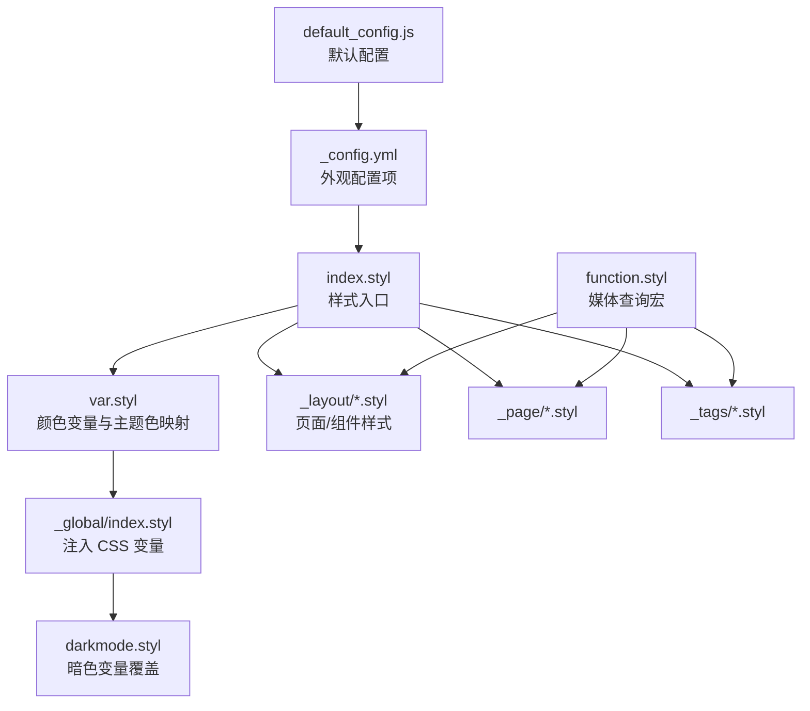
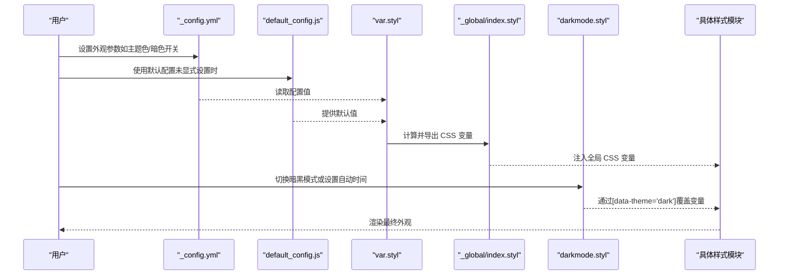
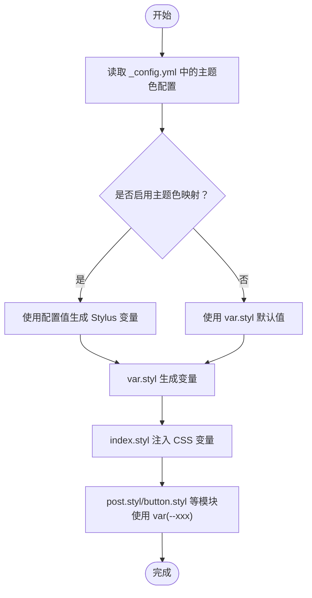
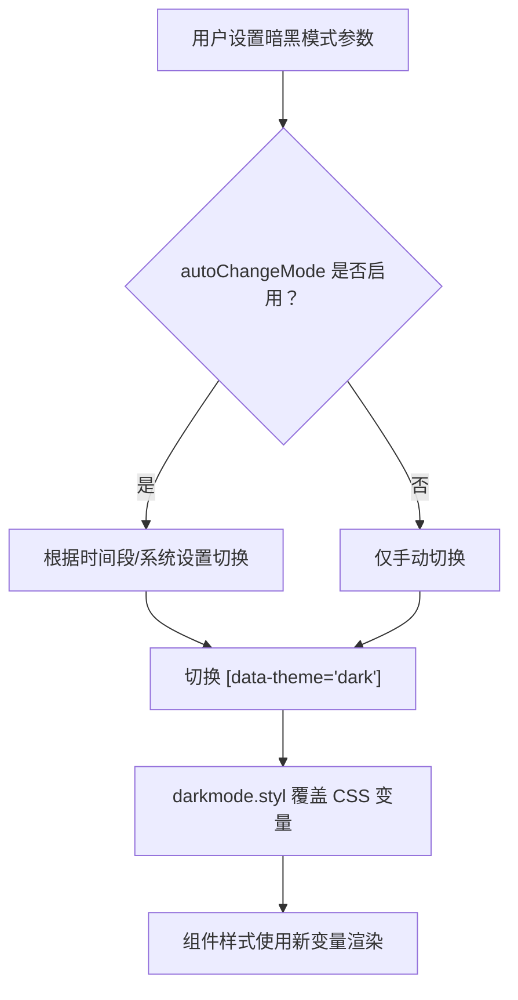
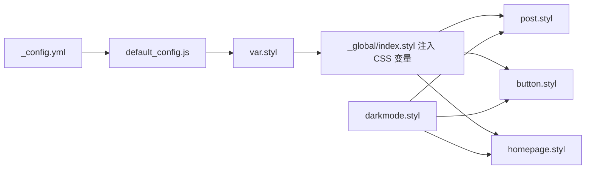

# 外观定制

<cite>
**本文引用的文件**
- [_config.yml](file://themes/butterfly/_config.yml)
- [var.styl](file://themes/butterfly/source/css/var.styl)
- [index.styl](file://themes/butterfly/source/css/index.styl)
- [index.styl（全局）](file://themes/butterfly/source/css/_global/index.styl)
- [darkmode.styl](file://themes/butterfly/source/css/_mode/darkmode.styl)
- [post.styl](file://themes/butterfly/source/css/_layout/post.styl)
- [button.styl](file://themes/butterfly/source/css/_tags/button.styl)
- [homepage.styl](file://themes/butterfly/source/css/_page/homepage.styl)
- [function.styl](file://themes/butterfly/source/css/_global/function.styl)
- [default_config.js](file://themes/butterfly/scripts/common/default_config.js)
</cite>

## 目录
1. [简介](#简介)
2. [项目结构](#项目结构)
3. [核心组件](#核心组件)
4. [架构总览](#架构总览)
5. [详细组件分析](#详细组件分析)
6. [依赖关系分析](#依赖关系分析)
7. [性能考量](#性能考量)
8. [故障排查指南](#故障排查指南)
9. [结论](#结论)
10. [附录](#附录)

## 简介
本指南面向需要深度定制 Hexo 主题 Butterfly 外观的用户，聚焦以下目标：
- 主题颜色系统：主题色、按钮悬停色、链接颜色、选中文字颜色等 CSS 变量的配置与映射机制
- 暗黑模式：自动切换时间、手动切换按钮、暗色变量覆盖与适配范围
- 视觉元素：背景图、头像、favicon 等资源位的配置方式
- 响应式与移动端：断点与布局策略、移动端适配建议
- 实战示例：提供可直接对照的配置路径与效果预期，帮助快速落地

## 项目结构
外观相关的核心文件分布如下：
- 主题配置：_config.yml 提供外观相关开关与资源位
- 样式入口：index.styl 组织样式模块导入
- 变量与主题色：var.styl 定义颜色变量与主题色映射
- 全局变量注入：_global/index.styl 将 Stylus 变量注入 CSS 自定义属性
- 暗黑模式：_mode/darkmode.styl 定义暗色主题变量与覆盖规则
- 页面与组件样式：_layout、_page、_tags 等模块化样式
- 响应式工具：_global/function.styl 提供媒体查询宏
- 默认配置：scripts/common/default_config.js 提供默认值与开关

**图表来源**
- [_config.yml](file://themes/butterfly/_config.yml)
- [index.styl](file://themes/butterfly/source/css/index.styl)
- [var.styl](file://themes/butterfly/source/css/var.styl)
- [index.styl（全局）](file://themes/butterfly/source/css/_global/index.styl)
- [darkmode.styl](file://themes/butterfly/source/css/_mode/darkmode.styl)
- [function.styl](file://themes/butterfly/source/css/_global/function.styl)
- [default_config.js](file://themes/butterfly/scripts/common/default_config.js)

**章节来源**
- [_config.yml](file://themes/butterfly/_config.yml)
- [index.styl](file://themes/butterfly/source/css/index.styl)
- [var.styl](file://themes/butterfly/source/css/var.styl)
- [index.styl（全局）](file://themes/butterfly/source/css/_global/index.styl)
- [darkmode.styl](file://themes/butterfly/source/css/_mode/darkmode.styl)
- [function.styl](file://themes/butterfly/source/css/_global/function.styl)
- [default_config.js](file://themes/butterfly/scripts/common/default_config.js)

## 核心组件
- 主题色系统
  - 通过配置启用主题色映射，var.styl 中将配置转换为 Stylus 变量，再由 _global/index.styl 注入到 CSS 变量，最终在各组件样式中以 var(--xxx) 使用
  - 关键变量包括：主题主色、分页器色、按钮悬停色、链接色、选中文本色、代码前景/背景、TOC 色、引用块边框/背景、滚动条色等
- 暗黑模式
  - 支持开启/关闭、手动切换按钮、自动切换时间段（起止小时）
  - 在 darkmode.styl 中以 [data-theme='dark'] 选择器覆盖大量 CSS 变量，实现整体暗色风格
- 视觉元素
  - favicon、头像、顶部横幅、主页副标题、背景图、封面图等均在 _config.yml 中配置
- 响应式与移动端
  - function.styl 提供常用断点宏；homepage.styl 展示了多断点下的布局行为

**章节来源**
- [var.styl](file://themes/butterfly/source/css/var.styl)
- [index.styl（全局）](file://themes/butterfly/source/css/_global/index.styl)
- [darkmode.styl](file://themes/butterfly/source/css/_mode/darkmode.styl)
- [_config.yml](file://themes/butterfly/_config.yml)
- [function.styl](file://themes/butterfly/source/css/_global/function.styl)
- [homepage.styl](file://themes/butterfly/source/css/_page/homepage.styl)

## 架构总览
外观定制的运行链路：
- 用户在 _config.yml 中设置外观参数
- scripts/common/default_config.js 提供默认值与开关
- var.styl 将配置转换为 Stylus 变量
- _global/index.styl 将 Stylus 变量注入 CSS 自定义属性
- 各样式模块（如 post.styl、button.styl、homepage.styl）通过 var(--xxx) 使用变量
- 暗黑模式通过 darkmode.styl 的 [data-theme='dark'] 选择器覆盖变量，实现深色覆盖

**图表来源**
- [_config.yml](file://themes/butterfly/_config.yml)
- [default_config.js](file://themes/butterfly/scripts/common/default_config.js)
- [var.styl](file://themes/butterfly/source/css/var.styl)
- [index.styl（全局）](file://themes/butterfly/source/css/_global/index.styl)
- [darkmode.styl](file://themes/butterfly/source/css/_mode/darkmode.styl)

## 详细组件分析

### 主题色系统与 CSS 变量映射
- 配置入口
  - 在 _config.yml 中启用主题色映射并设置各项颜色值（如主题主色、按钮悬停色、链接色、选中文字色等）
  - 若未设置，则使用 var.styl 中的默认值
- 变量计算
  - var.styl 将配置转换为 Stylus 变量（如 $theme-color、$button-hover-color 等）
- 注入全局
  - _global/index.styl 将 Stylus 变量映射为 CSS 自定义属性（如 --default-bg-color、--btn-hover-color 等）
- 组件使用
  - 各样式模块（如 post.styl、button.styl）通过 var(--xxx) 引用变量，确保统一风格

**图表来源**
- [_config.yml](file://themes/butterfly/_config.yml)
- [var.styl](file://themes/butterfly/source/css/var.styl)
- [index.styl（全局）](file://themes/butterfly/source/css/_global/index.styl)
- [post.styl](file://themes/butterfly/source/css/_layout/post.styl)
- [button.styl](file://themes/butterfly/source/css/_tags/button.styl)

**章节来源**
- [_config.yml](file://themes/butterfly/_config.yml)
- [var.styl](file://themes/butterfly/source/css/var.styl)
- [index.styl（全局）](file://themes/butterfly/source/css/_global/index.styl)
- [post.styl](file://themes/butterfly/source/css/_layout/post.styl)
- [button.styl](file://themes/butterfly/source/css/_tags/button.styl)

### 暗黑模式配置与覆盖
- 开关与按钮
  - enable 控制是否启用暗黑模式
  - button 控制是否显示手动切换按钮
- 自动切换
  - autoChangeMode 支持跟随系统或固定时间段（start/end，单位小时）
- 暗色覆盖
  - darkmode.styl 通过 [data-theme='dark'] 选择器重定义大量 CSS 变量，覆盖背景、文本、卡片、按钮、滚动条等颜色
  - 同时对代码块、评论区、标签云等第三方组件进行亮度调整，保证一致性

**图表来源**
- [_config.yml](file://themes/butterfly/_config.yml)
- [darkmode.styl](file://themes/butterfly/source/css/_mode/darkmode.styl)

**章节来源**
- [_config.yml](file://themes/butterfly/_config.yml)
- [darkmode.styl](file://themes/butterfly/source/css/_mode/darkmode.styl)

### 视觉元素配置（背景图/头像/favicon）
- 资源位
  - favicon：站点图标
  - avatar：作者头像及动画效果
  - background：网站背景（支持颜色、图片 URL 或数组随机）
  - 顶部横幅与主页副标题：index_img、default_top_img、subtitle 等
- 行为
  - 当配置存在时，index.styl（全局）会将背景应用到 #web_bg
  - 头像与副标题在页面头部区域渲染

**章节来源**
- [_config.yml](file://themes/butterfly/_config.yml)
- [index.styl（全局）](file://themes/butterfly/source/css/_global/index.styl)

### 响应式设计与移动端适配
- 断点宏
  - function.styl 提供 maxWidth768、minWidth768、maxWidth1024、minWidth900、maxWidth900 等媒体查询宏
- 布局适配
  - homepage.styl 展示了在不同断点下文章列表的布局变化（如 768px 下切换为纵向堆叠）
- 移动端建议
  - 针对窄屏优化字体大小、行高与间距
  - 控制阴影与圆角，避免过度渲染
  - 使用断点宏集中管理样式差异，保持维护性

**章节来源**
- [function.styl](file://themes/butterfly/source/css/_global/function.styl)
- [homepage.styl](file://themes/butterfly/source/css/_page/homepage.styl)

## 依赖关系分析
- 配置到变量
  - _config.yml → scripts/common/default_config.js → var.styl → _global/index.styl
- 样式到变量
  - _global/index.styl → 各样式模块（post.styl、button.styl、homepage.styl 等）
- 暗色覆盖
  - darkmode.styl 与 [data-theme='dark'] 选择器对全局变量进行覆盖

**图表来源**
- [_config.yml](file://themes/butterfly/_config.yml)
- [default_config.js](file://themes/butterfly/scripts/common/default_config.js)
- [var.styl](file://themes/butterfly/source/css/var.styl)
- [index.styl（全局）](file://themes/butterfly/source/css/_global/index.styl)
- [darkmode.styl](file://themes/butterfly/source/css/_mode/darkmode.styl)
- [post.styl](file://themes/butterfly/source/css/_layout/post.styl)
- [button.styl](file://themes/butterfly/source/css/_tags/button.styl)
- [homepage.styl](file://themes/butterfly/source/css/_page/homepage.styl)

**章节来源**
- [_config.yml](file://themes/butterfly/_config.yml)
- [default_config.js](file://themes/butterfly/scripts/common/default_config.js)
- [var.styl](file://themes/butterfly/source/css/var.styl)
- [index.styl（全局）](file://themes/butterfly/source/css/_global/index.styl)
- [darkmode.styl](file://themes/butterfly/source/css/_mode/darkmode.styl)
- [post.styl](file://themes/butterfly/source/css/_layout/post.styl)
- [button.styl](file://themes/butterfly/source/css/_tags/button.styl)
- [homepage.styl](file://themes/butterfly/source/css/_page/homepage.styl)

## 性能考量
- 样式体积控制
  - 合理使用断点宏，避免重复声明相同规则
  - 将通用变量集中在 _global/index.styl 注入，减少重复计算
- 渲染优化
  - 暗色模式仅在切换时生效，避免全站重绘
  - 图片懒加载与模糊过渡（若启用）可提升首屏体验
- 可维护性
  - 通过主题色映射集中管理颜色，降低修改成本

## 故障排查指南
- 主题色不生效
  - 检查 _config.yml 中主题色映射是否启用
  - 确认 var.styl 与 _global/index.styl 的变量注入是否正确
- 暗黑模式切换异常
  - 检查 autoChangeMode 与手动按钮配置
  - 确认 [data-theme='dark'] 选择器是否被正确应用
- 响应式布局错乱
  - 检查断点宏使用是否一致
  - 确认容器宽度与媒体查询条件匹配

**章节来源**
- [_config.yml](file://themes/butterfly/_config.yml)
- [var.styl](file://themes/butterfly/source/css/var.styl)
- [index.styl（全局）](file://themes/butterfly/source/css/_global/index.styl)
- [darkmode.styl](file://themes/butterfly/source/css/_mode/darkmode.styl)
- [function.styl](file://themes/butterfly/source/css/_global/function.styl)

## 结论
通过“配置 → 变量 → 注入 → 使用”的链路，Butterfly 的外观定制具备高度一致性与可维护性。主题色映射、暗黑模式覆盖与响应式断点宏共同构成了一套完善的外观体系。按本文提供的路径与建议进行配置，即可快速实现从浅色到深色、从桌面到移动端的一致体验。

## 附录
- 颜色定制示例（路径参考）
  - 启用主题色映射与设置主色：见 [_config.yml](file://themes/butterfly/_config.yml)
  - 查看变量映射与默认值：见 [var.styl](file://themes/butterfly/source/css/var.styl)
  - 查看 CSS 变量注入：见 [index.styl（全局）](file://themes/butterfly/source/css/_global/index.styl)
  - 查看暗色覆盖范围：见 [darkmode.styl](file://themes/butterfly/source/css/_mode/darkmode.styl)
- 视觉元素配置（路径参考）
  - favicon/头像/背景/顶部横幅：见 [_config.yml](file://themes/butterfly/_config.yml)
  - 背景应用逻辑：见 [index.styl（全局）](file://themes/butterfly/source/css/_global/index.styl)
- 响应式与移动端（路径参考）
  - 断点宏：见 [function.styl](file://themes/butterfly/source/css/_global/function.styl)
  - 布局适配示例：见 [homepage.styl](file://themes/butterfly/source/css/_page/homepage.styl)