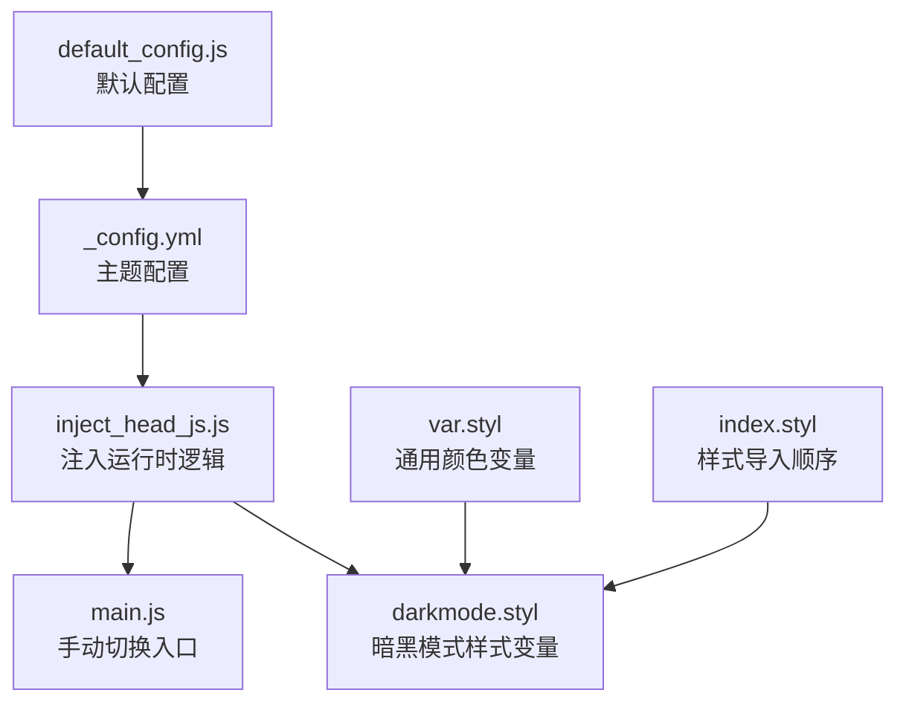
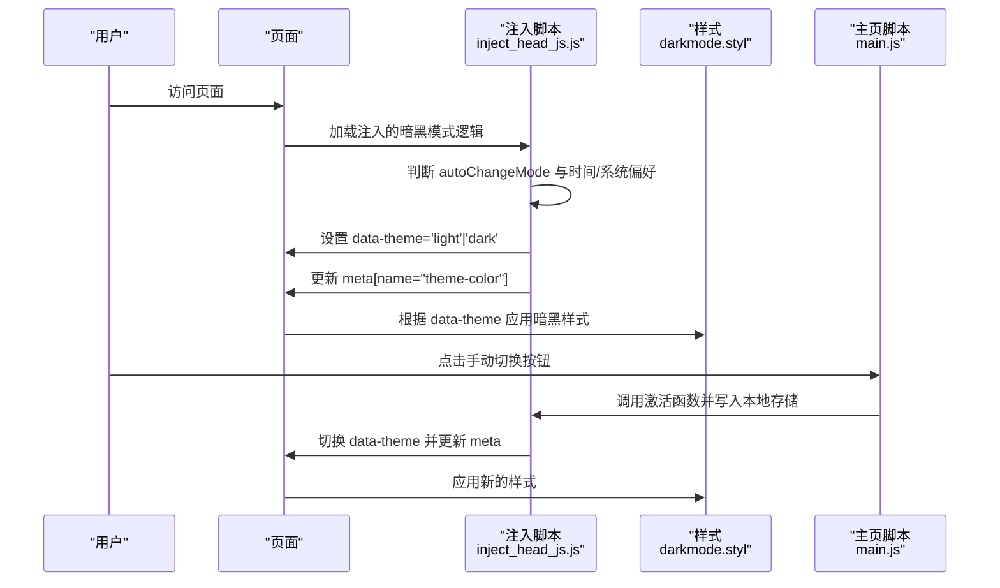
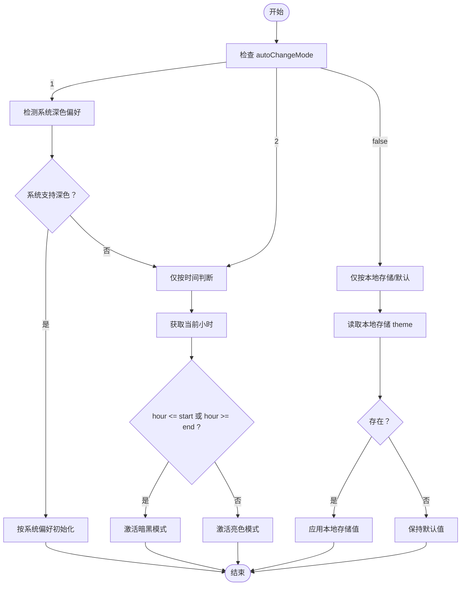
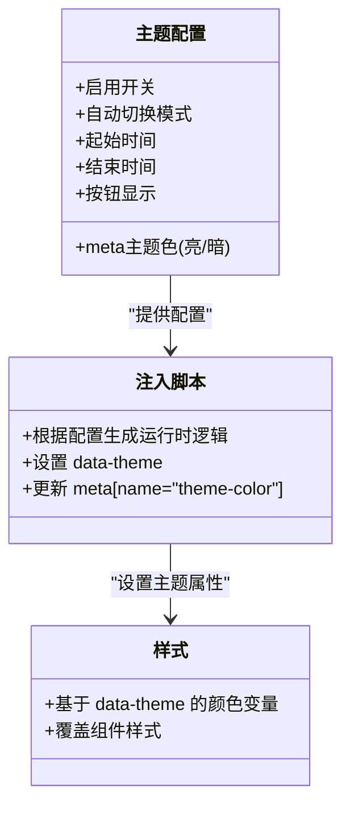
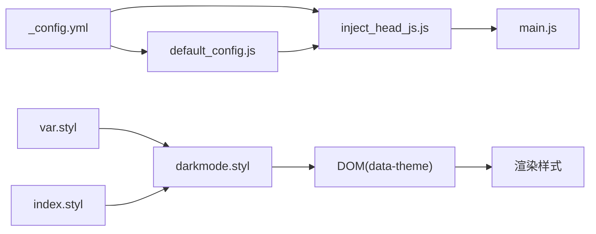

# 暗黑模式配置

<cite>
**本文引用的文件**
- [_config.yml](file://themes/butterfly/_config.yml)
- [default_config.js](file://themes/butterfly/scripts/common/default_config.js)
- [inject_head_js.js](file://themes/butterfly/scripts/helpers/inject_head_js.js)
- [darkmode.styl](file://themes/butterfly/source/css/_mode/darkmode.styl)
- [var.styl](file://themes/butterfly/source/css/var.styl)
- [index.styl](file://themes/butterfly/source/css/index.styl)
- [main.js](file://themes/butterfly/source/js/main.js)
</cite>

## 目录
1. [简介](#简介)
2. [项目结构](#项目结构)
3. [核心组件](#核心组件)
4. [架构总览](#架构总览)
5. [详细组件分析](#详细组件分析)
6. [依赖关系分析](#依赖关系分析)
7. [性能考量](#性能考量)
8. [故障排查指南](#故障排查指南)
9. [结论](#结论)
10. [附录](#附录)

## 简介
本指南面向使用 Butterfly 主题的用户，系统性讲解暗黑模式（Dark Mode）的完整配置方法，包括：
- 启用与禁用开关
- 自动切换模式（autoChangeMode）三种策略：跟随系统设置、固定时间段切换（18:00–6:00）、完全禁用自动切换
- 手动切换按钮（button）的显示与隐藏
- 时间设置（start/end）的24小时制配置与默认范围
- 主题颜色配置（meta_theme_color_dark 等暗色主题下的特殊颜色）
- 提供颜色对比示例与切换效果说明，帮助快速落地与验证

## 项目结构
与暗黑模式相关的配置与实现主要分布在以下位置：
- 主题配置文件：用于开启/关闭暗黑模式、设置自动切换模式与时间范围、控制按钮显示
- 默认配置脚本：定义暗黑模式字段的默认值
- 注入脚本：在页面头部注入运行时逻辑，负责根据配置与时间/系统偏好自动切换主题
- 样式文件：定义暗黑模式下的颜色变量与组件样式
- 主页脚本：提供手动切换函数与本地存储持久化

图表来源
- [_config.yml:382-395](file://themes/butterfly/_config.yml#L382-L395)
- [inject_head_js.js:64-126](file://themes/butterfly/scripts/helpers/inject_head_js.js#L64-L126)
- [default_config.js:219-225](file://themes/butterfly/scripts/common/default_config.js#L219-L225)
- [darkmode.styl:1-205](file://themes/butterfly/source/css/_mode/darkmode.styl#L1-L205)
- [var.styl:1-233](file://themes/butterfly/source/css/var.styl#L1-L233)
- [index.styl:1-15](file://themes/butterfly/source/css/index.styl#L1-L15)
- [main.js:663-675](file://themes/butterfly/source/js/main.js#L663-L675)

章节来源
- [_config.yml:382-395](file://themes/butterfly/_config.yml#L382-L395)
- [default_config.js:219-225](file://themes/butterfly/scripts/common/default_config.js#L219-L225)
- [inject_head_js.js:64-126](file://themes/butterfly/scripts/helpers/inject_head_js.js#L64-L126)
- [darkmode.styl:1-205](file://themes/butterfly/source/css/_mode/darkmode.styl#L1-L205)
- [var.styl:1-233](file://themes/butterfly/source/css/var.styl#L1-L233)
- [index.styl:1-15](file://themes/butterfly/source/css/index.styl#L1-L15)
- [main.js:663-675](file://themes/butterfly/source/js/main.js#L663-L675)

## 核心组件
- 主题配置（_config.yml）
  - 开关：enable
  - 自动切换：autoChangeMode（1=跟随系统；2=固定时间段；false=禁用）
  - 时间段：start（默认6）、end（默认18），单位为24小时制小时
  - 按钮：button（是否显示手动切换按钮）
- 默认配置（default_config.js）
  - 定义暗黑模式字段的默认值，确保未显式配置时有合理缺省
- 注入脚本（inject_head_js.js）
  - 依据配置生成运行时逻辑：根据系统深色模式偏好或当前时间自动切换，或直接按本地存储状态初始化
  - 动态设置 meta[name="theme-color"] 的内容以适配系统工具栏/地址栏颜色
- 样式（darkmode.styl）
  - 在[data-theme='dark']下定义全局与组件级颜色变量，覆盖背景、文字、边框、代码块、评论区等
- 主页脚本（main.js）
  - 提供手动切换函数，写入本地存储并触发主题变更回调

章节来源
- [_config.yml:382-395](file://themes/butterfly/_config.yml#L382-L395)
- [default_config.js:219-225](file://themes/butterfly/scripts/common/default_config.js#L219-L225)
- [inject_head_js.js:64-126](file://themes/butterfly/scripts/helpers/inject_head_js.js#L64-L126)
- [darkmode.styl:1-205](file://themes/butterfly/source/css/_mode/darkmode.styl#L1-L205)
- [main.js:663-675](file://themes/butterfly/source/js/main.js#L663-L675)

## 架构总览
暗黑模式从“配置—注入—渲染”三个层面协同工作：
- 配置层：_config.yml 与 default_config.js 决定初始状态与行为
- 注入层：inject_head_js.js 生成运行时脚本，处理自动切换与主题属性设置
- 渲染层：darkmode.styl 根据 data-theme='dark' 应用样式变量

图表来源
- [inject_head_js.js:64-126](file://themes/butterfly/scripts/helpers/inject_head_js.js#L64-L126)
- [darkmode.styl:1-205](file://themes/butterfly/source/css/_mode/darkmode.styl#L1-L205)
- [main.js:663-675](file://themes/butterfly/source/js/main.js#L663-L675)

## 详细组件分析

### 启用与禁用配置
- 在主题配置中设置开关：
  - enable: true/false 控制是否启用暗黑模式功能
- 默认配置提供缺省值，避免未配置导致的行为异常

章节来源
- [_config.yml:382-384](file://themes/butterfly/_config.yml#L382-L384)
- [default_config.js:219-225](file://themes/butterfly/scripts/common/default_config.js#L219-L225)

### 自动切换模式（autoChangeMode）
- 三种策略：
  - 1：跟随系统设置
    - 若系统支持深色模式，则优先使用系统偏好
    - 否则回退到固定时间段判断
  - 2：固定时间段切换（6pm–6am）
    - 不考虑系统偏好，仅根据当前小时数判断
  - false：完全禁用自动切换
    - 仅按本地存储的 theme 值或无存储时的默认值决定
- 时间参数（start/end）
  - 单位为24小时制小时
  - 缺省：start=6，end=18
  - 当前实现中，若当前小时小于等于 start 或大于等于 end，则判定为夜间，进入暗黑模式

图表来源
- [inject_head_js.js:87-123](file://themes/butterfly/scripts/helpers/inject_head_js.js#L87-L123)
- [_config.yml:388-391](file://themes/butterfly/_config.yml#L388-L391)
- [default_config.js:223-224](file://themes/butterfly/scripts/common/default_config.js#L223-L224)

章节来源
- [_config.yml:388-391](file://themes/butterfly/_config.yml#L388-L391)
- [default_config.js:223-224](file://themes/butterfly/scripts/common/default_config.js#L223-L224)
- [inject_head_js.js:87-123](file://themes/butterfly/scripts/helpers/inject_head_js.js#L87-L123)

### 手动切换按钮（button）
- 控制是否在右下角显示“切换明暗”的按钮
- 显示/隐藏由配置项 button 决定
- 点击后通过 main.js 中的函数切换主题，并将结果写入本地存储，短期有效（默认2天）

章节来源
- [_config.yml](file://themes/butterfly/_config.yml#L386)
- [main.js:663-675](file://themes/butterfly/source/js/main.js#L663-L675)

### 时间设置（start/end）
- 24小时制小时数，缺省值分别为6与18
- 实现逻辑中，当“当前小时小于等于 start 或大于等于 end”时视为夜间，进入暗黑模式
- 注意：若 start 大于 end（如 22:00–6:00），表示夜间时段为跨日区间

章节来源
- [_config.yml:392-394](file://themes/butterfly/_config.yml#L392-L394)
- [default_config.js:223-224](file://themes/butterfly/scripts/common/default_config.js#L223-L224)
- [inject_head_js.js:97-116](file://themes/butterfly/scripts/helpers/inject_head_js.js#L97-L116)

### 主题颜色配置（meta_theme_color_dark 等）
- 主题颜色总开关与各色域配置位于主题配置中
- 暗黑模式下的 meta 主题色可通过 meta_theme_color_dark 指定
- 亮色模式下的 meta 主题色可通过 meta_theme_color_light 指定
- 注入脚本会根据当前主题动态更新 meta[name="theme-color"] 的 content 值，使浏览器工具栏/地址栏颜色随主题变化

图表来源
- [_config.yml:759-779](file://themes/butterfly/_config.yml#L759-L779)
- [inject_head_js.js:70-78](file://themes/butterfly/scripts/helpers/inject_head_js.js#L70-L78)
- [darkmode.styl:1-205](file://themes/butterfly/source/css/_mode/darkmode.styl#L1-L205)

章节来源
- [_config.yml:759-779](file://themes/butterfly/_config.yml#L759-L779)
- [inject_head_js.js:70-78](file://themes/butterfly/scripts/helpers/inject_head_js.js#L70-L78)
- [darkmode.styl:1-205](file://themes/butterfly/source/css/_mode/darkmode.styl#L1-L205)

### 暗黑模式与亮色模式的颜色对比示例
- 暗黑模式下，整体背景、卡片、输入框、代码块等元素采用较深色调，文字与边框透明度降低，提升可读性
- 亮色模式下，背景与文字采用较浅色调，强调对比度与清晰度
- 注入脚本会在切换时同步更新 meta[name="theme-color"]，使系统 UI 元素颜色与主题一致

章节来源
- [darkmode.styl:1-205](file://themes/butterfly/source/css/_mode/darkmode.styl#L1-L205)
- [inject_head_js.js:70-78](file://themes/butterfly/scripts/helpers/inject_head_js.js#L70-L78)

### 切换效果演示（步骤说明）
- 页面加载：根据 autoChangeMode 与时间/系统偏好设置 data-theme
- 用户点击按钮：调用切换函数，写入本地存储，更新 data-theme 与 meta 主题色
- 样式生效：darkmode.styl 根据 data-theme 应用对应颜色变量

章节来源
- [inject_head_js.js:64-126](file://themes/butterfly/scripts/helpers/inject_head_js.js#L64-L126)
- [main.js:663-675](file://themes/butterfly/source/js/main.js#L663-L675)
- [darkmode.styl:1-205](file://themes/butterfly/source/css/_mode/darkmode.styl#L1-L205)

## 依赖关系分析
- 配置依赖
  - _config.yml 与 default_config.js 共同决定暗黑模式的初始状态
- 运行时依赖
  - inject_head_js.js 依赖配置与主题颜色配置，生成运行时脚本
  - main.js 依赖注入脚本提供的激活函数与本地存储
- 样式依赖
  - darkmode.styl 依赖 data-theme 属性与 var.styl 中的通用颜色变量
  - index.styl 统一导入 _mode 目录，确保暗黑样式被正确编译

图表来源
- [_config.yml:382-395](file://themes/butterfly/_config.yml#L382-L395)
- [default_config.js:219-225](file://themes/butterfly/scripts/common/default_config.js#L219-L225)
- [inject_head_js.js:64-126](file://themes/butterfly/scripts/helpers/inject_head_js.js#L64-L126)
- [main.js:663-675](file://themes/butterfly/source/js/main.js#L663-L675)
- [var.styl:1-233](file://themes/butterfly/source/css/var.styl#L1-L233)
- [index.styl:1-15](file://themes/butterfly/source/css/index.styl#L1-L15)
- [darkmode.styl:1-205](file://themes/butterfly/source/css/_mode/darkmode.styl#L1-L205)

章节来源
- [_config.yml:382-395](file://themes/butterfly/_config.yml#L382-L395)
- [default_config.js:219-225](file://themes/butterfly/scripts/common/default_config.js#L219-L225)
- [inject_head_js.js:64-126](file://themes/butterfly/scripts/helpers/inject_head_js.js#L64-L126)
- [main.js:663-675](file://themes/butterfly/source/js/main.js#L663-L675)
- [var.styl:1-233](file://themes/butterfly/source/css/var.styl#L1-L233)
- [index.styl:1-15](file://themes/butterfly/source/css/index.styl#L1-L15)
- [darkmode.styl:1-205](file://themes/butterfly/source/css/_mode/darkmode.styl#L1-L205)

## 性能考量
- 自动切换逻辑仅在页面加载时执行一次，后续通过用户交互或系统偏好事件触发，开销极低
- 使用本地存储短期保存主题选择，避免每次刷新都进行复杂判断
- 样式切换通过 data-theme 属性与 CSS 变量实现，无需重绘整个页面

## 故障排查指南
- 暗黑模式未生效
  - 检查开关 enable 是否为 true
  - 检查 autoChangeMode 是否被错误设为 false
  - 检查 start/end 是否导致当前时间不满足夜间条件
- 手动切换按钮无效
  - 确认按钮显示配置 button 为 true
  - 查看浏览器控制台是否存在脚本报错
- meta 主题色未更新
  - 确认主题配置中 meta_theme_color_light/meta_theme_color_dark 已正确设置
  - 检查注入脚本是否成功写入 meta[name="theme-color"]

章节来源
- [_config.yml:382-395](file://themes/butterfly/_config.yml#L382-L395)
- [inject_head_js.js:70-78](file://themes/butterfly/scripts/helpers/inject_head_js.js#L70-L78)
- [main.js:663-675](file://themes/butterfly/source/js/main.js#L663-L675)

## 结论
通过上述配置与实现机制，用户可以灵活地控制暗黑模式的启用、自动切换策略、时间范围以及按钮显示，并在不同主题下获得一致的视觉体验与系统集成（meta 主题色）。建议结合实际使用场景调整 start/end 与 autoChangeMode，以达到最佳的夜间阅读体验。

## 附录
- 快速对照表
  - 开关：enable → true/false
  - 自动切换：autoChangeMode → 1/2/false
  - 时间：start（默认6）、end（默认18），单位小时
  - 按钮：button → true/false
  - 主题色：meta_theme_color_light、meta_theme_color_dark