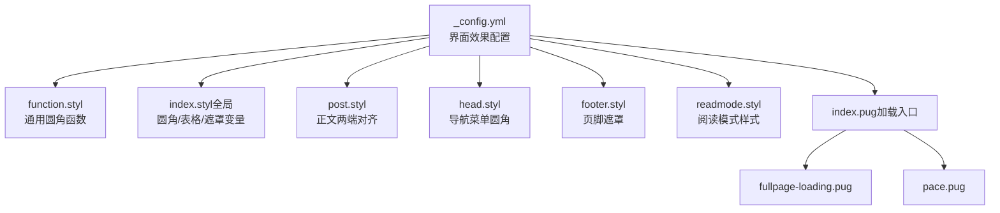
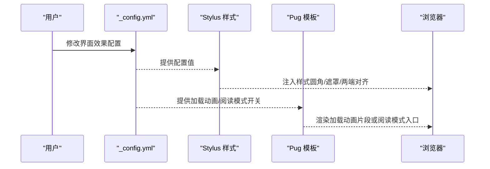
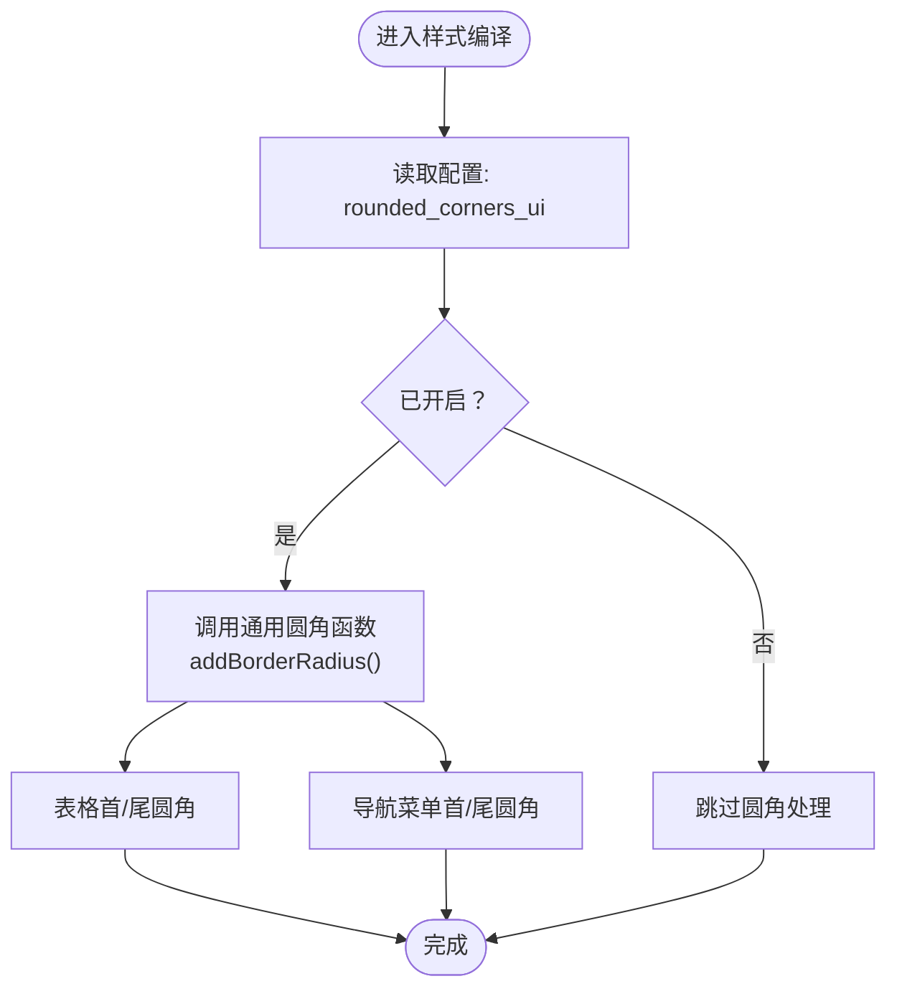
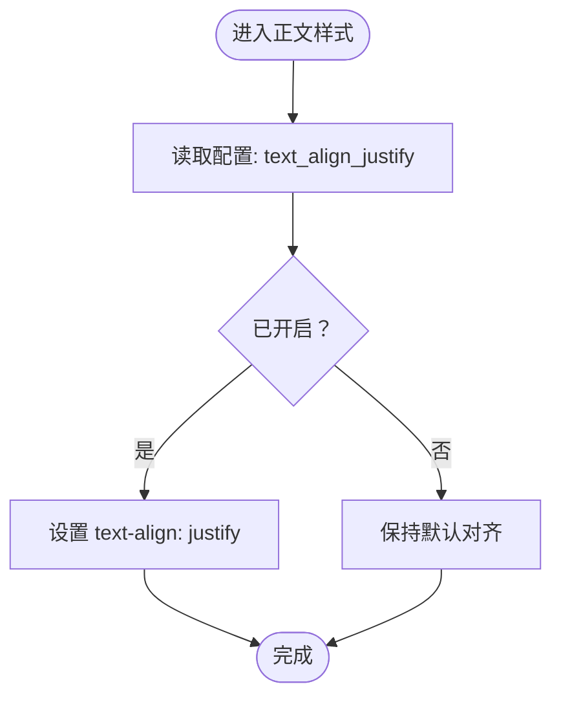
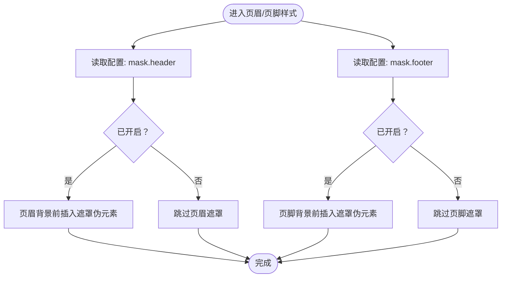
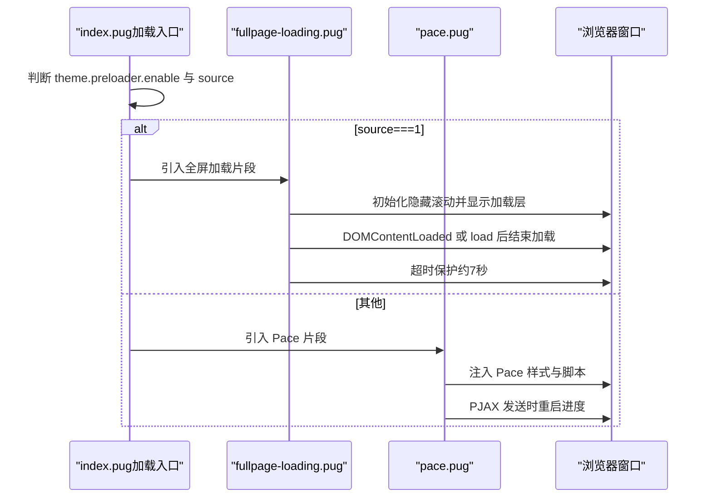
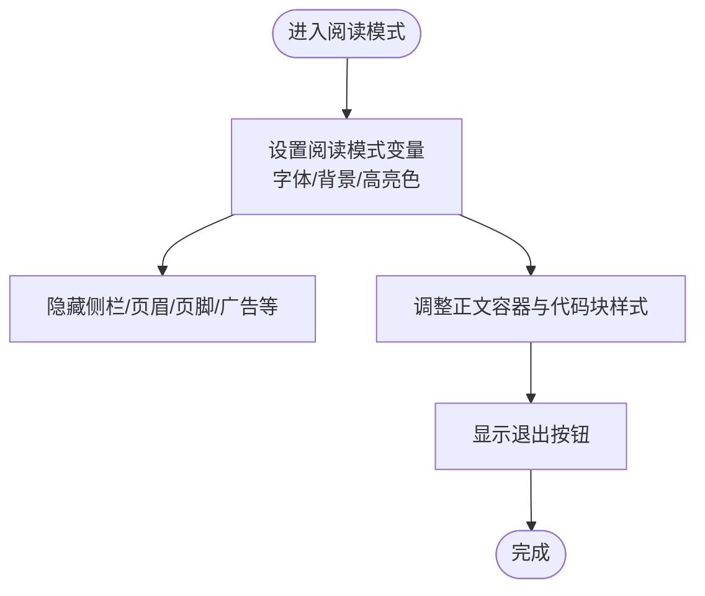
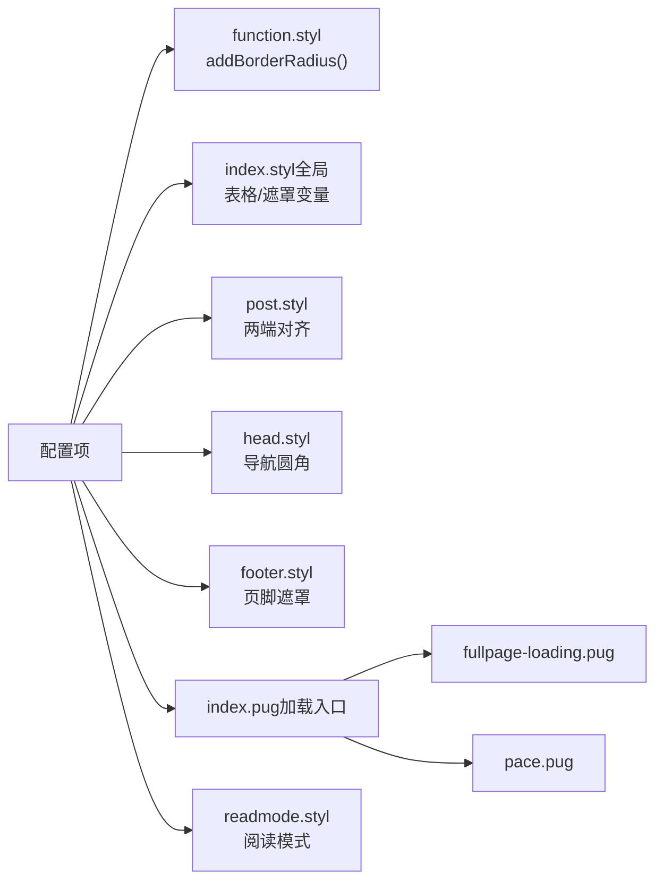

# 界面效果

<cite>
**本文引用的文件**   
- [_config.yml](file://themes/butterfly/_config.yml)
- [function.styl](file://themes/butterfly/source/css/_global/function.styl)
- [index.styl（全局）](file://themes/butterfly/source/css/_global/index.styl)
- [post.styl](file://themes/butterfly/source/css/_layout/post.styl)
- [head.styl](file://themes/butterfly/source/css/_layout/head.styl)
- [footer.styl](file://themes/butterfly/source/css/_layout/footer.styl)
- [readmode.styl](file://themes/butterfly/source/css/_mode/readmode.styl)
- [index.pug（加载动画入口）](file://themes/butterfly/layout/includes/loading/index.pug)
- [fullpage-loading.pug](file://themes/butterfly/layout/includes/loading/fullpage-loading.pug)
- [pace.pug](file://themes/butterfly/layout/includes/loading/pace.pug)
- [indexPostUI.pug](file://themes/butterfly/layout/includes/mixins/indexPostUI.pug)
</cite>

## 目录
1. [简介](#简介)
2. [项目结构与定位](#项目结构与定位)
3. [核心配置项总览](#核心配置项总览)
4. [架构概览](#架构概览)
5. [详细组件与配置解析](#详细组件与配置解析)
6. [依赖关系分析](#依赖关系分析)
7. [性能与体验考量](#性能与体验考量)
8. [故障排查指南](#故障排查指南)
9. [结论与选型建议](#结论与选型建议)

## 简介
本指南聚焦于 Hexo 主题 Butterfly 的“界面效果”配置，围绕以下主题展开：圆角边框（rounded_corners_ui）、文本两端对齐（text_align_justify）、遮罩（mask，含 header 与 footer）、加载动画（preloader）与阅读模式（readmode）。文档将从配置项入手，结合样式与模板实现，给出可视化流程图与使用建议，帮助你在不同场景下做出合适的选择。

## 项目结构与定位
- 配置文件集中于主题根目录的配置文件中，界面效果相关的关键项位于“Beautify / Effect”区域。
- 样式层通过 Stylus 文件实现条件化渲染，如圆角、遮罩、两端对齐等均以 hexo-config 条件包裹。
- 模板层通过 Pug 片段控制加载动画与阅读模式入口。

**图表来源**
- [_config.yml:786-800](file://themes/butterfly/_config.yml#L786-L800)
- [function.styl:18-24](file://themes/butterfly/source/css/_global/function.styl#L18-L24)
- [index.styl（全局）:169-188](file://themes/butterfly/source/css/_global/index.styl#L169-L188)
- [post.styl:76-78](file://themes/butterfly/source/css/_layout/post.styl#L76-L78)
- [head.styl:385-392](file://themes/butterfly/source/css/_layout/head.styl#L385-L392)
- [footer.styl:8-15](file://themes/butterfly/source/css/_layout/footer.styl#L8-L15)
- [readmode.styl:1-187](file://themes/butterfly/source/css/_mode/readmode.styl#L1-L187)
- [index.pug（加载动画入口）:1-5](file://themes/butterfly/layout/includes/loading/index.pug#L1-L5)
- [fullpage-loading.pug:1-42](file://themes/butterfly/layout/includes/loading/fullpage-loading.pug#L1-L42)
- [pace.pug:1-12](file://themes/butterfly/layout/includes/loading/pace.pug#L1-L12)

**章节来源**
- [_config.yml:786-800](file://themes/butterfly/_config.yml#L786-L800)
- [function.styl:18-24](file://themes/butterfly/source/css/_global/function.styl#L18-L24)
- [index.styl（全局）:169-188](file://themes/butterfly/source/css/_global/index.styl#L169-L188)
- [post.styl:76-78](file://themes/butterfly/source/css/_layout/post.styl#L76-L78)
- [head.styl:385-392](file://themes/butterfly/source/css/_layout/head.styl#L385-L392)
- [footer.styl:8-15](file://themes/butterfly/source/css/_layout/footer.styl#L8-L15)
- [readmode.styl:1-187](file://themes/butterfly/source/css/_mode/readmode.styl#L1-L187)
- [index.pug（加载动画入口）:1-5](file://themes/butterfly/layout/includes/loading/index.pug#L1-L5)
- [fullpage-loading.pug:1-42](file://themes/butterfly/layout/includes/loading/fullpage-loading.pug#L1-L42)
- [pace.pug:1-12](file://themes/butterfly/layout/includes/loading/pace.pug#L1-L12)

## 核心配置项总览
- 圆角边框（rounded_corners_ui）
  - 作用范围：通用圆角函数、表格圆角、导航菜单圆角、卡片等。
  - 默认值：true
- 文本两端对齐（text_align_justify）
  - 作用范围：正文容器的 text-align。
  - 默认值：false
- 遮罩（mask）
  - 头部遮罩（header）：在页眉背景上叠加半透明遮罩，提升可读性。
  - 底部遮罩（footer）：在页脚背景上叠加半透明遮罩。
  - 默认值：header=true, footer=true
- 加载动画（preloader）
  - 开关：enable=false
  - 源类型：source=1 使用全屏加载；否则使用 Pace 进度条。
  - 默认值：enable=false
- 阅读模式（readmode）
  - 开关：readmode=true
  - 默认值：true

**章节来源**
- [_config.yml:786-800](file://themes/butterfly/_config.yml#L786-L800)

## 架构概览
界面效果由“配置 → 样式条件判断 → 模板渲染”三部分协同完成：
- 配置层：在主题配置中声明开关与参数。
- 样式层：Stylus 中以 hexo-config 条件包裹，按需注入圆角、遮罩、两端对齐等规则。
- 模板层：Pug 片段根据配置决定是否引入加载动画或阅读模式入口。

**图表来源**
- [_config.yml:786-800](file://themes/butterfly/_config.yml#L786-L800)
- [function.styl:18-24](file://themes/butterfly/source/css/_global/function.styl#L18-L24)
- [index.styl（全局）:169-188](file://themes/butterfly/source/css/_global/index.styl#L169-L188)
- [post.styl:76-78](file://themes/butterfly/source/css/_layout/post.styl#L76-L78)
- [head.styl:385-392](file://themes/butterfly/source/css/_layout/head.styl#L385-L392)
- [footer.styl:8-15](file://themes/butterfly/source/css/_layout/footer.styl#L8-L15)
- [readmode.styl:1-187](file://themes/butterfly/source/css/_mode/readmode.styl#L1-L187)
- [index.pug（加载动画入口）:1-5](file://themes/butterfly/layout/includes/loading/index.pug#L1-L5)

## 详细组件与配置解析

### 圆角边框 rounded_corners_ui
- 功能说明
  - 通过统一的圆角函数为多种 UI 元素添加圆角，包括按钮、卡片、表格、导航菜单等。
- 关键实现
  - 通用圆角函数：在样式层定义带条件的圆角函数，当配置开启时生效。
  - 表格圆角：针对表头/表尾的左/右圆角进行精确处理。
  - 导航菜单圆角：对菜单列表的首/末元素分别应用顶部/底部圆角。
- 影响范围
  - 卡片、按钮、表格、导航菜单、侧栏菜单项等。
- 建议
  - 在现代设计中推荐开启，提升柔和感；若追求极简或需要强调几何线条，可关闭。

**图表来源**
- [function.styl:18-24](file://themes/butterfly/source/css/_global/function.styl#L18-L24)
- [index.styl（全局）:169-188](file://themes/butterfly/source/css/_global/index.styl#L169-L188)
- [head.styl:385-392](file://themes/butterfly/source/css/_layout/head.styl#L385-L392)

**章节来源**
- [function.styl:18-24](file://themes/butterfly/source/css/_global/function.styl#L18-L24)
- [index.styl（全局）:169-188](file://themes/butterfly/source/css/_global/index.styl#L169-L188)
- [head.styl:385-392](file://themes/butterfly/source/css/_layout/head.styl#L385-L392)

### 文本对齐 text_align_justify（两端对齐）
- 功能说明
  - 将正文容器的文本对齐方式设为两端对齐，使每行宽度一致，增强版式整齐感。
- 关键实现
  - 在正文样式中以条件判断注入 text-align: justify。
- 影响范围
  - 正文内容容器（文章页、页面等）。
- 建议
  - 中文排版通常不建议使用两端对齐，易产生字距不均；英文或双语内容可适度开启。若追求极简，保持默认关闭更稳妥。

**图表来源**
- [post.styl:76-78](file://themes/butterfly/source/css/_layout/post.styl#L76-L78)

**章节来源**
- [post.styl:76-78](file://themes/butterfly/source/css/_layout/post.styl#L76-L78)

### 遮罩 masks（header 与 footer）
- 功能说明
  - 在页眉与页脚背景之上叠加半透明遮罩，降低背景图片亮度，提升文字可读性。
- 关键实现
  - 页眉遮罩：在页眉背景上插入伪元素遮罩。
  - 页脚遮罩：在页脚背景上插入伪元素遮罩。
- 影响范围
  - 页眉与页脚区域。
- 建议
  - 当背景图片较亮或对比度不足时开启；若背景本身已足够深色，可关闭以减少层级。

**图表来源**
- [footer.styl:8-15](file://themes/butterfly/source/css/_layout/footer.styl#L8-L15)
- [head.styl:9-9](file://themes/butterfly/source/css/_layout/head.styl#L9-L9)

**章节来源**
- [footer.styl:8-15](file://themes/butterfly/source/css/_layout/footer.styl#L8-L15)
- [head.styl:9-9](file://themes/butterfly/source/css/_layout/head.styl#L9-L9)

### 加载动画 preloader
- 功能说明
  - 页面加载时显示加载动画，改善首屏等待体验；支持两种源：全屏加载与 Pace 进度条。
- 关键实现
  - 模板入口：根据开关与源类型选择加载片段。
  - 全屏加载：包含左右背景与旋转核心等结构，并通过 JS 控制显隐与超时保护。
  - Pace：注入 Pace 脚本与样式，支持 PJAX 场景下的重启。
- 影响范围
  - 首屏加载阶段的视觉反馈。
- 建议
  - 移动端或弱网环境建议开启；若站点资源较小或已采用其他优化策略，可关闭以减少额外开销。

**图表来源**
- [index.pug（加载动画入口）:1-5](file://themes/butterfly/layout/includes/loading/index.pug#L1-L5)
- [fullpage-loading.pug:1-42](file://themes/butterfly/layout/includes/loading/fullpage-loading.pug#L1-L42)
- [pace.pug:1-12](file://themes/butterfly/layout/includes/loading/pace.pug#L1-L12)

**章节来源**
- [index.pug（加载动画入口）:1-5](file://themes/butterfly/layout/includes/loading/index.pug#L1-L5)
- [fullpage-loading.pug:1-42](file://themes/butterfly/layout/includes/loading/fullpage-loading.pug#L1-L42)
- [pace.pug:1-12](file://themes/butterfly/layout/includes/loading/pace.pug#L1-L12)

### 阅读模式 readmode
- 功能说明
  - 专注阅读模式，降低干扰元素，突出正文内容，适配长文阅读。
- 关键实现
  - 样式层：定义阅读模式变量与规则，隐藏侧栏、页眉、页脚、代码高亮阴影等，调整背景与文字颜色。
  - 退出按钮：固定位置的退出按钮，便于快速返回。
- 影响范围
  - 文章页整体布局与元素显隐。
- 建议
  - 长文阅读场景强烈推荐开启；短文或需要交互的场景可关闭。

**图表来源**
- [readmode.styl:1-187](file://themes/butterfly/source/css/_mode/readmode.styl#L1-L187)

**章节来源**
- [readmode.styl:1-187](file://themes/butterfly/source/css/_mode/readmode.styl#L1-L187)

## 依赖关系分析
- 配置到样式的依赖
  - 圆角：function.styl 的通用函数被多处样式文件调用；表格与导航菜单圆角在 index.styl 与 head.styl 中分别处理。
  - 两端对齐：post.styl 直接依赖配置。
  - 遮罩：head.styl 与 footer.styl 分别依赖对应配置。
- 配置到模板的依赖
  - 加载动画：index.pug 根据开关与源类型选择引入 fullpage 或 pace 片段。
  - 阅读模式：在文章页模板中通过样式类触发（本节不展示具体模板路径）。

**图表来源**
- [_config.yml:786-800](file://themes/butterfly/_config.yml#L786-L800)
- [function.styl:18-24](file://themes/butterfly/source/css/_global/function.styl#L18-L24)
- [index.styl（全局）:169-188](file://themes/butterfly/source/css/_global/index.styl#L169-L188)
- [post.styl:76-78](file://themes/butterfly/source/css/_layout/post.styl#L76-L78)
- [head.styl:385-392](file://themes/butterfly/source/css/_layout/head.styl#L385-L392)
- [footer.styl:8-15](file://themes/butterfly/source/css/_layout/footer.styl#L8-L15)
- [index.pug（加载动画入口）:1-5](file://themes/butterfly/layout/includes/loading/index.pug#L1-L5)
- [fullpage-loading.pug:1-42](file://themes/butterfly/layout/includes/loading/fullpage-loading.pug#L1-L42)
- [pace.pug:1-12](file://themes/butterfly/layout/includes/loading/pace.pug#L1-L12)
- [readmode.styl:1-187](file://themes/butterfly/source/css/_mode/readmode.styl#L1-L187)

**章节来源**
- [_config.yml:786-800](file://themes/butterfly/_config.yml#L786-L800)
- [function.styl:18-24](file://themes/butterfly/source/css/_global/function.styl#L18-L24)
- [index.styl（全局）:169-188](file://themes/butterfly/source/css/_global/index.styl#L169-L188)
- [post.styl:76-78](file://themes/butterfly/source/css/_layout/post.styl#L76-L78)
- [head.styl:385-392](file://themes/butterfly/source/css/_layout/head.styl#L385-L392)
- [footer.styl:8-15](file://themes/butterfly/source/css/_layout/footer.styl#L8-L15)
- [index.pug（加载动画入口）:1-5](file://themes/butterfly/layout/includes/loading/index.pug#L1-L5)
- [fullpage-loading.pug:1-42](file://themes/butterfly/layout/includes/loading/fullpage-loading.pug#L1-L42)
- [pace.pug:1-12](file://themes/butterfly/layout/includes/loading/pace.pug#L1-L12)
- [readmode.styl:1-187](file://themes/butterfly/source/css/_mode/readmode.styl#L1-L187)

## 性能与体验考量
- 圆角边框
  - 开启会增加少量合成开销，现代设备基本无感；若对性能敏感，可在低端设备关闭。
- 两端对齐
  - 对中文排版可能带来字距不均问题，建议谨慎使用；英文内容可适度开启。
- 遮罩
  - 遮罩为伪元素叠加，开销极低；仅在背景图片较亮时开启。
- 加载动画
  - 全屏加载与 Pace 均有轻量实现；移动端建议开启以改善感知速度。
- 阅读模式
  - 隐藏大量元素，减少重绘；适合长文阅读，但切换时会有布局变化。

[本节为通用建议，无需特定文件来源]

## 故障排查指南
- 圆角未生效
  - 检查配置项是否开启；确认样式编译成功且未被覆盖。
- 两端对齐无效
  - 确认配置项已开启；检查目标容器是否正确命中。
- 遮罩不显示
  - 确认对应配置项已开启；检查页眉/页脚背景是否设置。
- 加载动画不出现
  - 检查开关与源类型；确保模板片段被正确引入；查看浏览器控制台是否有脚本错误。
- 阅读模式异常
  - 检查样式类是否正确应用；确认退出按钮可见且可点击。

**章节来源**
- [index.pug（加载动画入口）:1-5](file://themes/butterfly/layout/includes/loading/index.pug#L1-L5)
- [fullpage-loading.pug:1-42](file://themes/butterfly/layout/includes/loading/fullpage-loading.pug#L1-L42)
- [pace.pug:1-12](file://themes/butterfly/layout/includes/loading/pace.pug#L1-L12)
- [readmode.styl:1-187](file://themes/butterfly/source/css/_mode/readmode.styl#L1-L187)

## 结论与选型建议
- 圆角边框：现代设计推荐开启，提升柔和感；极简风格可关闭。
- 两端对齐：中文内容谨慎开启；英文或双语内容可适度开启。
- 遮罩：背景较亮时开启；背景已深色可关闭。
- 加载动画：移动端或弱网建议开启；资源小的站点可关闭。
- 阅读模式：长文阅读强烈推荐开启；短文或需要交互的场景可关闭。

[本节为总结性内容，无需特定文件来源]