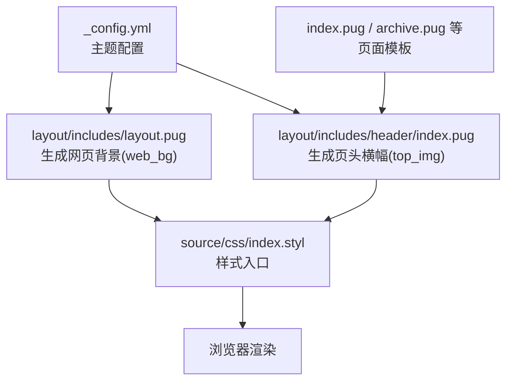
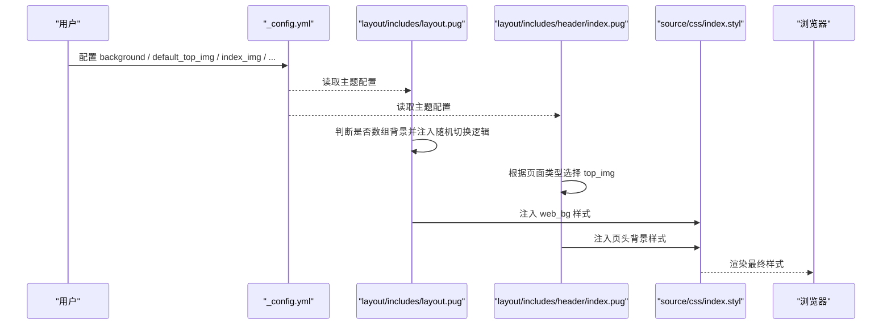
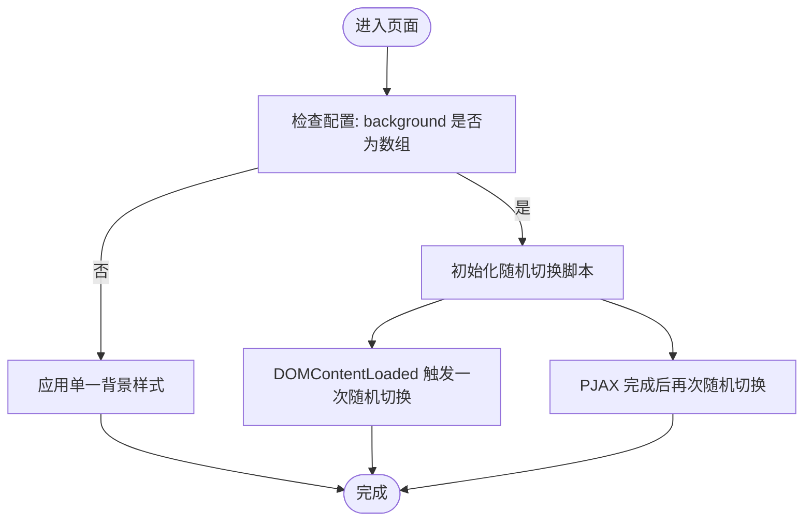
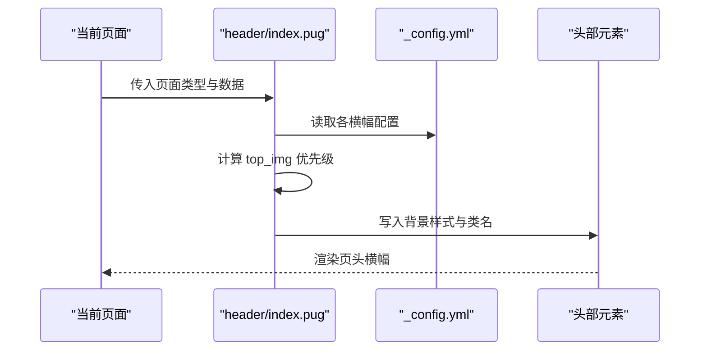
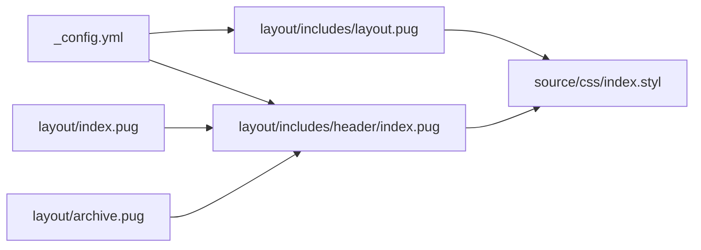

# 背景定制

<cite>
**本文引用的文件**
- [_config.yml](file://themes/butterfly/_config.yml)
- [layout.pug](file://themes/butterfly/layout/includes/layout.pug)
- [header/index.pug](file://themes/butterfly/layout/includes/header/index.pug)
- [index.pug](file://themes/butterfly/layout/index.pug)
- [archive.pug](file://themes/butterfly/layout/archive.pug)
- [index.styl](file://themes/butterfly/source/css/index.styl)
- [var.styl](file://themes/butterfly/source/css/var.styl)
- [homepage.styl](file://themes/butterfly/source/css/_page/homepage.styl)
</cite>

## 目录
1. [简介](#简介)
2. [项目结构](#项目结构)
3. [核心组件](#核心组件)
4. [架构总览](#架构总览)
5. [详细组件分析](#详细组件分析)
6. [依赖关系分析](#依赖关系分析)
7. [性能考量](#性能考量)
8. [故障排查指南](#故障排查指南)
9. [结论](#结论)
10. [附录](#附录)

## 简介
本指南聚焦于“背景定制”，围绕网站背景（网页主体背景、页头横幅背景、页脚背景）的多种配置方式进行系统化说明，涵盖：
- 纯色背景与图片背景的设置
- 多张图片随机背景的配置与实现机制
- 横幅图片（默认横幅、首页、归档、标签、分类）的独立配置与优先级
- 背景图片的 URL 设置、重复模式、定位、尺寸等 CSS 属性的使用路径
- 背景图片优化建议与加载性能考虑

## 项目结构
本主题通过配置文件集中定义背景与横幅参数，再由 Pug 布局在运行时生成内联样式或类名，最终由 Stylus 样式系统渲染为 CSS。

图表来源
- [_config.yml](file://themes/butterfly/_config.yml)
- [layout/includes/layout.pug](file://themes/butterfly/layout/includes/layout.pug)
- [layout/includes/header/index.pug](file://themes/butterfly/layout/includes/header/index.pug)
- [index.pug](file://themes/butterfly/layout/index.pug)
- [archive.pug](file://themes/butterfly/layout/archive.pug)
- [index.styl](file://themes/butterfly/source/css/index.styl)

章节来源
- [layout/includes/layout.pug:15-59](file://themes/butterfly/layout/includes/layout.pug#L15-L59)
- [layout/includes/header/index.pug:1-52](file://themes/butterfly/layout/includes/header/index.pug#L1-L52)
- [_config.yml:62-91](file://themes/butterfly/_config.yml#L62-L91)

## 核心组件
- 网页主体背景（web_bg）
  - 支持纯色值或图片 URL；支持数组形式开启随机背景
  - 随机背景通过客户端 JS 在 DOMContentLoaded 与 PJAX 完成后切换
- 页头横幅背景（top_img）
  - 默认横幅、首页、归档、标签、分类等页面可分别配置
  - 未显式设置时回退到默认横幅
- 页脚背景（footer）
  - 可选择继承页头横幅或独立配置

章节来源
- [layout/includes/layout.pug:15-39](file://themes/butterfly/layout/includes/layout.pug#L15-L39)
- [layout/includes/header/index.pug:8-28](file://themes/butterfly/layout/includes/header/index.pug#L8-L28)
- [_config.yml:62-91](file://themes/butterfly/_config.yml#L62-L91)

## 架构总览
下图展示从配置到渲染的关键流程：配置文件决定背景类型与来源，Pug 模板根据页面类型选择合适的横幅或主体背景，Stylus 将变量与样式合并输出。

图表来源
- [_config.yml](file://themes/butterfly/_config.yml)
- [layout/includes/layout.pug:15-39](file://themes/butterfly/layout/includes/layout.pug#L15-L39)
- [layout/includes/header/index.pug:8-28](file://themes/butterfly/layout/includes/header/index.pug#L8-L28)
- [index.styl:1-15](file://themes/butterfly/source/css/index.styl#L1-L15)

## 详细组件分析

### 网页主体背景（web_bg）
- 配置项
  - background：可设为颜色值或图片 URL；若为数组，则启用随机背景
- 实现机制
  - 若非数组：直接以内联样式应用背景
  - 若为数组：注入随机切换脚本，在页面加载与 PJAX 完成后随机选择一项
- 使用建议
  - 图片背景建议使用高分辨率但体积较小的格式（如 WebP），并控制尺寸以提升首屏性能
  - 颜色背景可减少网络请求，适合极简风格

图表来源
- [layout/includes/layout.pug:15-39](file://themes/butterfly/layout/includes/layout.pug#L15-L39)

章节来源
- [layout/includes/layout.pug:15-39](file://themes/butterfly/layout/includes/layout.pug#L15-L39)
- [_config.yml:93-97](file://themes/butterfly/_config.yml#L93-L97)

### 页头横幅背景（top_img）
- 配置项
  - disable_top_img：禁用所有横幅
  - default_top_img：默认横幅
  - index_img：首页横幅
  - archive_img：归档页横幅
  - tag_img：标签页横幅（整体）
  - tag_per_img：按标签单独配置
  - category_img：分类页横幅（整体）
  - category_per_img：按分类单独配置
- 选择优先级
  - post/page：优先使用页面 front-matter 中的 top_img 或 cover，否则回退到 default_top_img
  - tag：优先使用 tag_per_img 中对应标签的图片，否则回退到 tag_img，再回退到 default_top_img
  - category：优先使用 category_per_img 中对应分类的图片，否则回退到 category_img，再回退到 default_top_img
  - home/archive：home 回退到 index_img，archive 回退到 archive_img，均再回退到 default_top_img
- 类名与样式
  - 根据页面类型动态添加 full_page、post-bg、not-home-page 等类名，用于控制背景行为与叠加效果

图表来源
- [layout/includes/header/index.pug:8-28](file://themes/butterfly/layout/includes/header/index.pug#L8-L28)
- [_config.yml:62-91](file://themes/butterfly/_config.yml#L62-L91)

章节来源
- [layout/includes/header/index.pug:8-28](file://themes/butterfly/layout/includes/header/index.pug#L8-L28)
- [_config.yml:62-91](file://themes/butterfly/_config.yml#L62-L91)

### 页脚背景（footer）
- 配置项
  - footer_img：可设为布尔值或图片 URL；为 true 时继承页头背景，为 false 时不显示背景
- 实现
  - 通过内联样式将背景应用到页脚元素

章节来源
- [layout/includes/layout.pug:53-55](file://themes/butterfly/layout/includes/layout.pug#L53-L55)
- [_config.yml:90-91](file://themes/butterfly/_config.yml#L90-L91)

### CSS 属性映射与扩展
- 当前代码中未直接对背景图片的 repeat、position、size 进行显式注入
- 若需自定义 repeat/position/size，可在主题样式中扩展变量或新增样式规则，以覆盖默认行为
- 变量与样式入口
  - 样式入口：index.styl
  - 全局变量：var.styl
  - 首页布局样式：homepage.styl

章节来源
- [index.styl:1-15](file://themes/butterfly/source/css/index.styl#L1-L15)
- [var.styl:35-36](file://themes/butterfly/source/css/var.styl#L35-L36)
- [homepage.styl:1-175](file://themes/butterfly/source/css/_page/homepage.styl#L1-L175)

## 依赖关系分析
- 配置到模板
  - _config.yml 的 background、default_top_img、index_img、archive_img、tag_img、category_img 等字段被 layout.pug 与 header/index.pug 读取
- 模板到样式
  - Pug 通过内联样式或类名驱动 CSS 渲染
- 页面类型耦合
  - 不同页面模板（index.pug、archive.pug 等）影响横幅来源与回退策略

图表来源
- [_config.yml](file://themes/butterfly/_config.yml)
- [layout/includes/layout.pug](file://themes/butterfly/layout/includes/layout.pug)
- [layout/includes/header/index.pug](file://themes/butterfly/layout/includes/header/index.pug)
- [index.pug](file://themes/butterfly/layout/index.pug)
- [archive.pug](file://themes/butterfly/layout/archive.pug)
- [index.styl](file://themes/butterfly/source/css/index.styl)

章节来源
- [layout/includes/layout.pug:1-59](file://themes/butterfly/layout/includes/layout.pug#L1-L59)
- [layout/includes/header/index.pug:1-52](file://themes/butterfly/layout/includes/header/index.pug#L1-L52)
- [index.pug:1-5](file://themes/butterfly/layout/index.pug#L1-L5)
- [archive.pug:1-8](file://themes/butterfly/layout/archive.pug#L1-L8)

## 性能考量
- 背景图片优化
  - 优先使用现代格式（如 WebP）并压缩体积
  - 控制图片尺寸，避免超大图导致首屏渲染延迟
  - 对移动端采用更小尺寸或响应式处理
- 随机背景的加载
  - 数组背景会在 DOM 加载完成后随机切换，建议预热首屏背景以减少闪烁
- 减少重绘
  - 避免频繁变更背景尺寸与位置，尽量使用 cover/contain 等属性控制缩放
- 缓存与懒加载
  - 合理利用浏览器缓存与 CDN
  - 对非首屏背景可考虑懒加载策略

## 故障排查指南
- 横幅未显示
  - 检查 disable_top_img 是否被设为禁用
  - 确认页面是否设置了 top_img 或 cover，或是否存在默认横幅 fallback
- 随机背景不生效
  - 确认 background 为数组格式
  - 检查浏览器控制台是否有脚本报错
- 页脚背景异常
  - 若 footer_img 设为 true，请确认页头背景已正确生成
- 样式冲突
  - 若需要自定义 repeat/position/size，可在主题样式中增加覆盖规则，确保选择器权重足够

章节来源
- [layout/includes/layout.pug:15-39](file://themes/butterfly/layout/includes/layout.pug#L15-L39)
- [layout/includes/header/index.pug:8-28](file://themes/butterfly/layout/includes/header/index.pug#L8-L28)
- [_config.yml:62-91](file://themes/butterfly/_config.yml#L62-L91)

## 结论
- 网站背景可通过单一配置或数组配置实现纯色或随机图片背景
- 页头横幅支持多页面独立配置与回退策略，满足个性化需求
- 页脚背景可继承或独立配置
- 如需精细控制 repeat/position/size 等属性，建议在主题样式层进行扩展

## 附录
- 配置项速览
  - 网页背景：background
  - 默认横幅：default_top_img
  - 首页横幅：index_img
  - 归档页横幅：archive_img
  - 标签页横幅（整体/按标签）：tag_img、tag_per_img
  - 分类页横幅（整体/按分类）：category_img、category_per_img
  - 页脚背景：footer_img

章节来源
- [_config.yml:62-91](file://themes/butterfly/_config.yml#L62-L91)