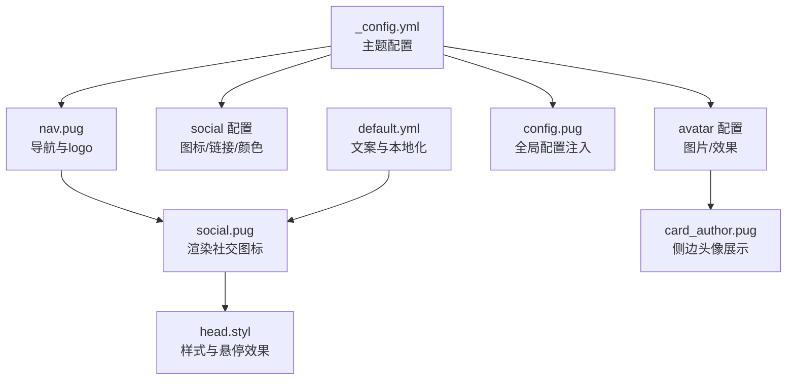
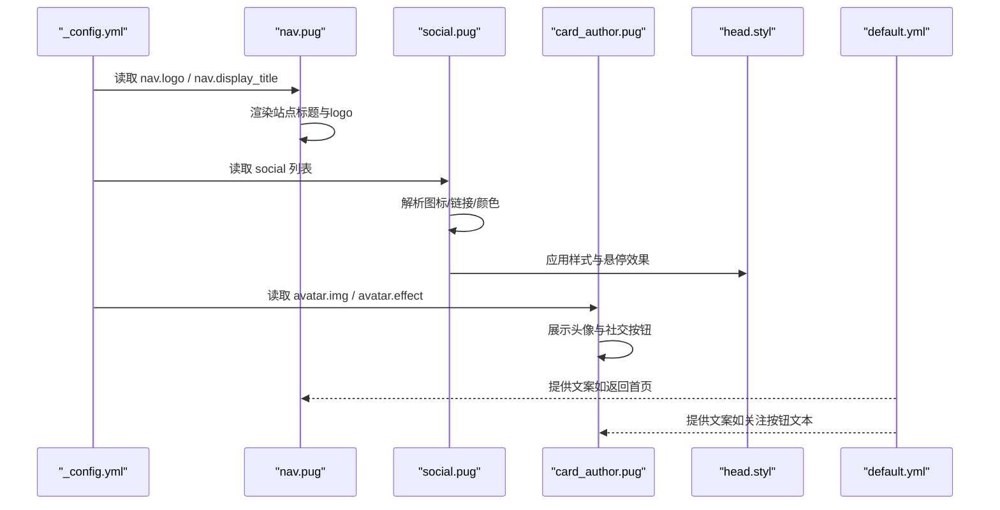
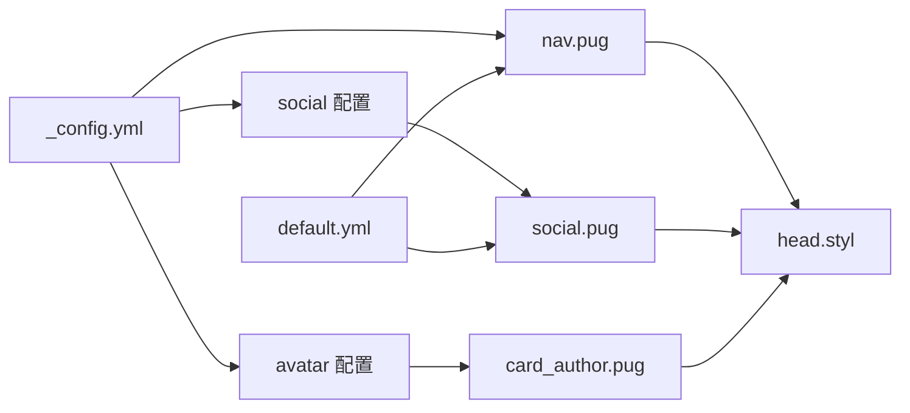

# 视觉元素配置

<cite>
**本文引用的文件**
- [_config.yml](file://themes/butterfly/_config.yml)
- [social.pug](file://themes/butterfly/layout/includes/header/social.pug)
- [nav.pug](file://themes/butterfly/layout/includes/header/nav.pug)
- [index.pug](file://themes/butterfly/layout/includes/header/index.pug)
- [card_author.pug](file://themes/butterfly/layout/includes/widget/card_author.pug)
- [head.styl](file://themes/butterfly/source/css/_layout/head.styl)
- [config.pug](file://themes/butterfly/layout/includes/head/config.pug)
- [default.yml](file://themes/butterfly/languages/default.yml)
</cite>

## 目录
1. [简介](#简介)
2. [项目结构](#项目结构)
3. [核心组件](#核心组件)
4. [架构总览](#架构总览)
5. [详细组件分析](#详细组件分析)
6. [依赖关系分析](#依赖关系分析)
7. [性能考量](#性能考量)
8. [故障排查指南](#故障排查指南)
9. [结论](#结论)
10. [附录](#附录)

## 简介
本指南聚焦于 Hexo 主题 Butterfly 的视觉元素配置，涵盖以下方面：
- favicon 图标：格式、尺寸与路径配置
- 头像（avatar）：图片路径、动画效果与显示行为
- 导航栏 logo：设置方法与显示规则
- 社交链接图标：Font Awesome 图标、链接地址、颜色与悬停效果
同时提供配置示例与最佳实践，包括图片格式推荐、文件大小限制与加载性能优化建议。

## 项目结构
与视觉元素相关的关键位置如下：
- 主题配置文件：themes/butterfly/_config.yml
- 头部与导航模板：themes/butterfly/layout/includes/header/*.pug
- 社交图标模板：themes/butterfly/layout/includes/header/social.pug
- 侧边作者卡片：themes/butterfly/layout/includes/widget/card_author.pug
- 样式定义：themes/butterfly/source/css/_layout/head.styl
- 国际化文案：themes/butterfly/languages/default.yml

图表来源
- [_config.yml](file://themes/butterfly/_config.yml)
- [nav.pug](file://themes/butterfly/layout/includes/header/nav.pug)
- [social.pug](file://themes/butterfly/layout/includes/header/social.pug)
- [card_author.pug](file://themes/butterfly/layout/includes/widget/card_author.pug)
- [head.styl](file://themes/butterfly/source/css/_layout/head.styl)
- [config.pug](file://themes/butterfly/layout/includes/head/config.pug)
- [default.yml](file://themes/butterfly/languages/default.yml)

章节来源
- [_config.yml](file://themes/butterfly/_config.yml)
- [nav.pug](file://themes/butterfly/layout/includes/header/nav.pug)
- [social.pug](file://themes/butterfly/layout/includes/header/social.pug)
- [card_author.pug](file://themes/butterfly/layout/includes/widget/card_author.pug)
- [head.styl](file://themes/butterfly/source/css/_layout/head.styl)
- [config.pug](file://themes/butterfly/layout/includes/head/config.pug)
- [default.yml](file://themes/butterfly/languages/default.yml)

## 核心组件
- favicon 图标
  - 路径：在主题配置中通过键位设置，用于浏览器标签页与收藏夹显示。
  - 参考路径：themes/butterfly/_config.yml 中的 favicon 键位。
- 头像（avatar）
  - 图片路径：在主题配置中设置；侧边作者卡片会读取该路径并进行容错处理。
  - 动画效果：支持开启/关闭，影响头像区域的交互表现。
  - 显示行为：在作者卡片中居中展示，并可配置社交按钮与描述。
- 导航栏 logo
  - 设置：在导航配置下设置 logo 图片路径；若存在则在站点标题前显示。
  - 显示规则：首页与文章页根据页面类型显示不同标题与返回链接。
- 社交链接图标
  - 图标来源：使用 Font Awesome 图标类名。
  - 链接与颜色：通过配置项提供链接、标题与颜色，模板中解析并渲染为可点击图标。
  - 悬停效果：由样式层控制，包含颜色变化与阴影等视觉反馈。

章节来源
- [_config.yml](file://themes/butterfly/_config.yml)
- [nav.pug](file://themes/butterfly/layout/includes/header/nav.pug)
- [social.pug](file://themes/butterfly/layout/includes/header/social.pug)
- [card_author.pug](file://themes/butterfly/layout/includes/widget/card_author.pug)
- [head.styl](file://themes/butterfly/source/css/_layout/head.styl)

## 架构总览
视觉元素的配置与渲染流程如下：
- 主题配置文件提供基础参数（favicon、avatar、nav.logo、social 列表等）。
- 模板根据配置动态生成 HTML 结构（导航、头像卡片、社交图标）。
- 样式层负责图标尺寸、颜色、悬停与响应式布局。
- 国际化文件提供文案支持（如“返回首页”等）。

图表来源
- [_config.yml](file://themes/butterfly/_config.yml)
- [nav.pug](file://themes/butterfly/layout/includes/header/nav.pug)
- [social.pug](file://themes/butterfly/layout/includes/header/social.pug)
- [card_author.pug](file://themes/butterfly/layout/includes/widget/card_author.pug)
- [head.styl](file://themes/butterfly/source/css/_layout/head.styl)
- [default.yml](file://themes/butterfly/languages/default.yml)

## 详细组件分析

### favicon 图标配置
- 配置位置
  - 在主题配置文件中设置 favicon 路径键位。
- 建议
  - 推荐格式：PNG 或 ICO；尺寸建议 32×32 或 16×16，以适配多端显示。
  - 路径：放置于站点 public 目录或主题静态资源目录，确保可被浏览器访问。
  - 性能：尽量压缩体积，避免影响首屏加载。
- 示例参考
  - 参见主题配置文件中的 favicon 键位与注释说明。

章节来源
- [_config.yml](file://themes/butterfly/_config.yml)

### 头像（avatar）配置
- 配置位置
  - 在主题配置文件中设置 avatar.img 与 avatar.effect。
- 模板行为
  - 侧边作者卡片读取 avatar.img，并在图片加载失败时回退到错误占位图。
  - 支持在作者卡片底部添加自定义按钮与社交图标。
- 建议
  - 图片格式：推荐 PNG 或 WebP，尺寸建议 120×120 以上以保证清晰度。
  - 文件大小：建议控制在 100KB 以内，结合懒加载提升性能。
  - 容错：保留错误占位图，确保头像加载失败时仍保持良好体验。
- 示例参考
  - 作者卡片模板与错误回退逻辑。

章节来源
- [_config.yml](file://themes/butterfly/_config.yml)
- [card_author.pug](file://themes/butterfly/layout/includes/widget/card_author.pug)

### 导航栏 logo 配置与显示规则
- 配置位置
  - 在导航配置中设置 logo 路径与标题显示开关。
- 显示规则
  - 若配置了 logo，则在站点标题前显示 logo 图片。
  - 文章页标题区会显示“返回首页”的可点击链接，便于快速回到主页。
- 建议
  - logo 尺寸：高度约 36px，与标题文字对齐。
  - 路径：使用相对路径，确保在不同部署环境下均可正确加载。
- 示例参考
  - 导航模板与文章页标题渲染逻辑。

章节来源
- [_config.yml](file://themes/butterfly/_config.yml)
- [nav.pug](file://themes/butterfly/layout/includes/header/nav.pug)
- [index.pug](file://themes/butterfly/layout/includes/header/index.pug)

### 社交链接图标配置
- 配置位置
  - 在主题配置中设置 social 列表，每项包含图标类名、链接、标题与颜色。
- 模板解析
  - 模板按固定分隔符解析配置，生成可点击的社交图标链接。
  - 支持在首页站点信息区与作者卡片中展示。
- 样式与交互
  - 样式层定义图标间距、颜色、阴影与悬停变色等效果。
  - 响应式设计在移动端会调整显示策略。
- 建议
  - 图标类名：使用 Font Awesome 类名，确保字体库已正确引入。
  - 颜色：提供与品牌一致的颜色值，注意对比度与可读性。
  - 链接：使用绝对 URL 或站点内路由，确保跳转正确。
- 示例参考
  - 社交图标模板与样式定义。

章节来源
- [_config.yml](file://themes/butterfly/_config.yml)
- [social.pug](file://themes/butterfly/layout/includes/header/social.pug)
- [head.styl](file://themes/butterfly/source/css/_layout/head.styl)

## 依赖关系分析
- 配置到模板
  - 主题配置文件为所有视觉元素提供数据源，模板通过读取配置生成最终 HTML。
- 模板到样式
  - 模板输出的 HTML 结构与类名由样式层统一控制，实现一致的视觉风格。
- 国际化到模板
  - 文案由国际化文件提供，模板在渲染时引用对应键值，确保多语言支持。

图表来源
- [_config.yml](file://themes/butterfly/_config.yml)
- [nav.pug](file://themes/butterfly/layout/includes/header/nav.pug)
- [social.pug](file://themes/butterfly/layout/includes/header/social.pug)
- [card_author.pug](file://themes/butterfly/layout/includes/widget/card_author.pug)
- [head.styl](file://themes/butterfly/source/css/_layout/head.styl)
- [default.yml](file://themes/butterfly/languages/default.yml)

章节来源
- [_config.yml](file://themes/butterfly/_config.yml)
- [social.pug](file://themes/butterfly/layout/includes/header/social.pug)
- [nav.pug](file://themes/butterfly/layout/includes/header/nav.pug)
- [card_author.pug](file://themes/butterfly/layout/includes/widget/card_author.pug)
- [head.styl](file://themes/butterfly/source/css/_layout/head.styl)
- [default.yml](file://themes/butterfly/languages/default.yml)

## 性能考量
- 图片优化
  - 使用现代格式（如 WebP）以降低体积；为不同 DPR 准备合适尺寸。
  - 对头像与 logo 进行压缩与懒加载，减少首屏压力。
- 字体与图标
  - Font Awesome 通过主题配置引入，确保只加载必要图标类别，避免全量引入造成体积膨胀。
- 样式与交互
  - 悬停与过渡效果应适度使用，避免在低端设备上造成卡顿。
- 资源路径
  - 所有静态资源采用相对路径或经 url_for 处理的绝对路径，确保多环境一致性。

## 故障排查指南
- favicon 未显示
  - 检查配置文件中的路径是否正确，确认文件存在于指定位置。
  - 浏览器缓存可能导致旧版本生效，尝试清理缓存或强制刷新。
- 头像不显示或空白
  - 确认 avatar.img 路径有效；检查错误回退图是否可用。
  - 检查图片格式与大小，避免过大导致加载缓慢或失败。
- 导航 logo 不显示
  - 确认 nav.logo 已配置且路径正确；检查标题显示开关。
- 社交图标不出现或颜色异常
  - 检查 social 列表格式是否符合解析规范（图标/链接/标题/颜色）。
  - 确认 Font Awesome 字体库已正确引入；检查颜色值格式。
- 文案缺失或显示异常
  - 检查国际化文件中对应键值是否存在；确认模板中引用的键名正确。

章节来源
- [_config.yml](file://themes/butterfly/_config.yml)
- [social.pug](file://themes/butterfly/layout/includes/header/social.pug)
- [card_author.pug](file://themes/butterfly/layout/includes/widget/card_author.pug)
- [head.styl](file://themes/butterfly/source/css/_layout/head.styl)
- [default.yml](file://themes/butterfly/languages/default.yml)

## 结论
通过主题配置文件集中管理视觉元素，配合模板与样式的协同作用，可以高效地实现 favicon、头像、导航栏 logo 与社交链接图标的统一配置与渲染。遵循本文提供的格式、尺寸与性能建议，可在保证视觉一致性的同时提升加载速度与用户体验。

## 附录
- 配置示例路径
  - favicon：参见主题配置文件中的 favicon 键位。
  - avatar：参见主题配置文件中的 avatar 键位。
  - 导航 logo：参见主题配置文件中的 nav.logo 键位。
  - 社交链接：参见主题配置文件中的 social 键位。
- 最佳实践摘要
  - 图片格式：优先 PNG/WebP；尺寸适中，体积控制在合理范围。
  - 路径：使用相对路径或经 url_for 处理的路径，确保跨环境兼容。
  - 字体与图标：仅引入必要图标类别，避免全量引入。
  - 样式：适度使用过渡与悬停效果，兼顾美观与性能。