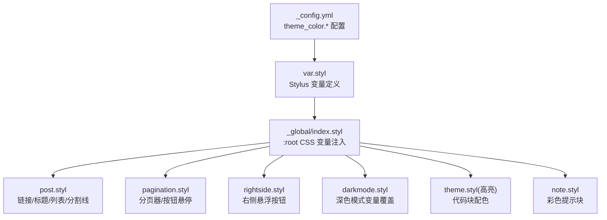
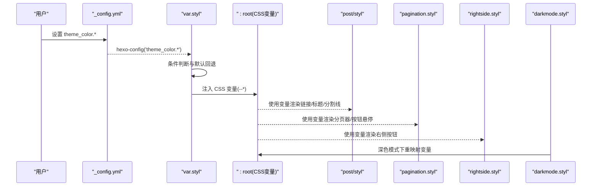
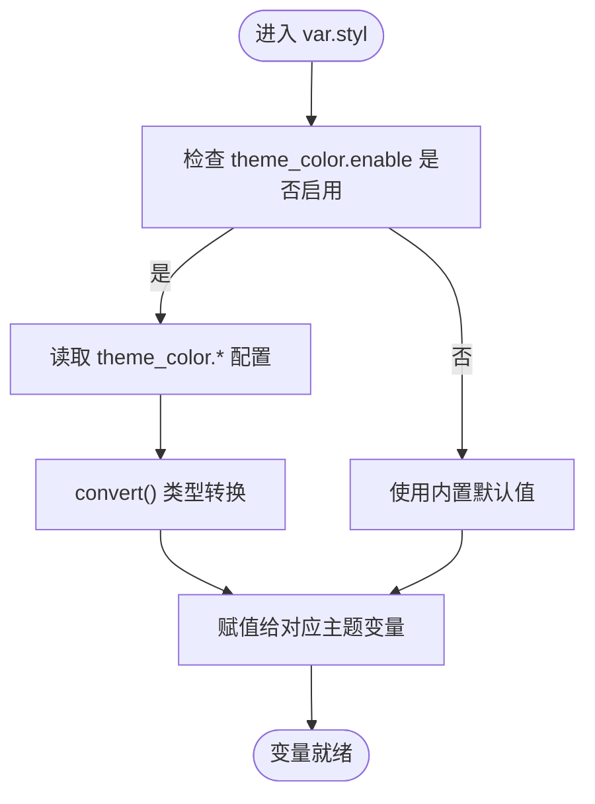
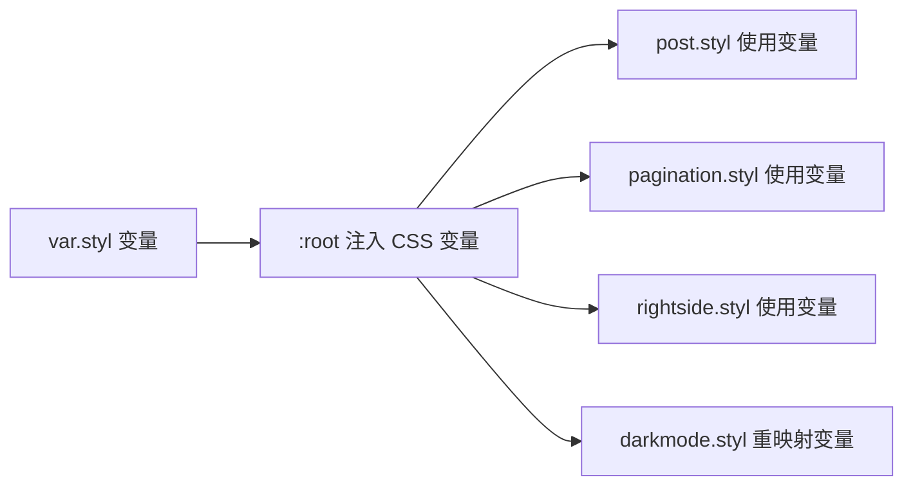
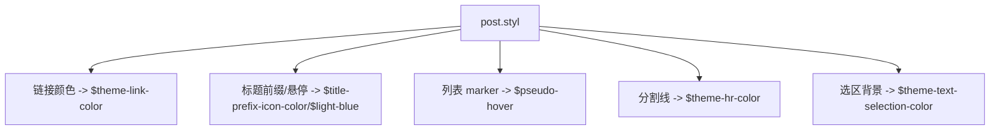
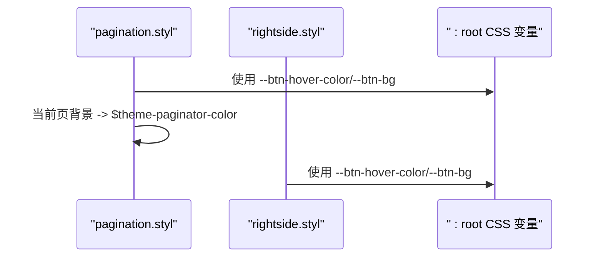
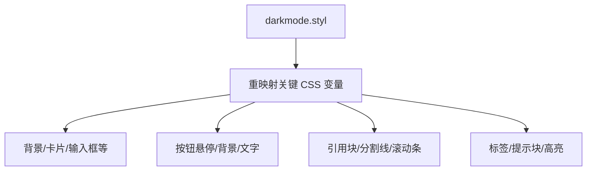
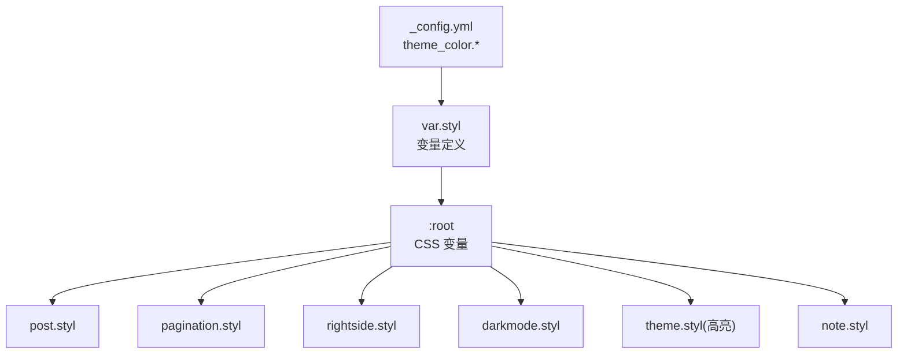

# 颜色主题系统

<cite>
**本文档引用的文件**
- [_config.yml](file://themes/butterfly/_config.yml)
- [var.styl](file://themes/butterfly/source/css/var.styl)
- [index.styl（全局）](file://themes/butterfly/source/css/_global/index.styl)
- [post.styl](file://themes/butterfly/source/css/_layout/post.styl)
- [pagination.styl](file://themes/butterfly/source/css/_layout/pagination.styl)
- [rightside.styl](file://themes/butterfly/source/css/_layout/rightside.styl)
- [darkmode.styl](file://themes/butterfly/source/css/_mode/darkmode.styl)
- [theme.styl（高亮）](file://themes/butterfly/source/css/_highlight/theme.styl)
- [note.styl](file://themes/butterfly/source/css/_tags/note.styl)
</cite>

## 目录
1. [简介](#简介)
2. [项目结构](#项目结构)
3. [核心组件](#核心组件)
4. [架构总览](#架构总览)
5. [详细组件分析](#详细组件分析)
6. [依赖关系分析](#依赖关系分析)
7. [性能考量](#性能考量)
8. [故障排查指南](#故障排查指南)
9. [结论](#结论)
10. [附录：配置与最佳实践](#附录配置与最佳实践)

## 简介
本指南聚焦于 Butterfly 主题的颜色主题系统，系统性解析主题颜色配置项、变量映射、CSS 自定义属性注入、深色模式适配以及代码高亮主题联动机制。读者可据此完成从基础配置到深度定制的全链路实践，涵盖主色调、分页器、按钮悬停、文本选择、链接、元数据、分割线、代码前景/背景、目录、引用块、滚动条、主题色与元主题色等完整配置项。

## 项目结构
围绕颜色主题的关键文件分布如下：
- 主题配置：_config.yml 中的 theme_color 节点
- 样式变量：var.styl 定义主题变量与默认回退值
- 全局注入：_global/index.styl 将变量映射为 CSS 变量供页面使用
- 组件样式：post.styl、pagination.styl、rightside.styl 等消费变量
- 深色模式：_mode/darkmode.styl 在[data-theme='dark']下重映射变量
- 代码高亮：_highlight/theme.styl 提供多套高亮主题
- 标签插件：_tags/note.styl 使用 CSS 变量实现彩色提示块

图表来源
- [_config.yml](file://themes/butterfly/_config.yml)
- [var.styl](file://themes/butterfly/source/css/var.styl)
- [index.styl（全局）](file://themes/butterfly/source/css/_global/index.styl)
- [post.styl](file://themes/butterfly/source/css/_layout/post.styl)
- [pagination.styl](file://themes/butterfly/source/css/_layout/pagination.styl)
- [rightside.styl](file://themes/butterfly/source/css/_layout/rightside.styl)
- [darkmode.styl](file://themes/butterfly/source/css/_mode/darkmode.styl)
- [theme.styl（高亮）](file://themes/butterfly/source/css/_highlight/theme.styl)
- [note.styl](file://themes/butterfly/source/css/_tags/note.styl)

章节来源
- [_config.yml](file://themes/butterfly/_config.yml)
- [var.styl](file://themes/butterfly/source/css/var.styl)
- [index.styl（全局）](file://themes/butterfly/source/css/_global/index.styl)

## 核心组件
- 主题变量层（Stylus）
  - 通过 hexo-config 读取 theme_color.* 配置，若未启用或缺省则回落到内置默认值
  - 关键变量包括：主题主色、分页器、按钮悬停、文本选择、链接、元数据、分割线、代码前景/背景、目录、引用块边框/背景、滚动条、元主题色(light/dark)
- CSS 变量层（:root）
  - 将 Stylus 变量统一注入为 CSS 变量，供 HTML/CSS 直接消费
- 组件层（各样式文件）
  - 文章内容、分页器、右侧按钮、深色模式、代码高亮、标签提示块等按需使用变量
- 深色模式层（data-theme='dark'）
  - 在深色模式下对关键变量进行亮度/透明度调整，确保对比度与可读性

章节来源
- [var.styl](file://themes/butterfly/source/css/var.styl)
- [index.styl（全局）](file://themes/butterfly/source/css/_global/index.styl)
- [darkmode.styl](file://themes/butterfly/source/css/_mode/darkmode.styl)

## 架构总览
颜色主题系统采用“配置 → Stylus 变量 → CSS 变量 → 组件消费”的分层架构。配置层支持启用/禁用与逐项覆盖；变量层提供默认值与类型转换；CSS 变量层实现跨组件共享；深色模式层在 data-theme='dark' 下进行二次映射。

图表来源
- [_config.yml](file://themes/butterfly/_config.yml)
- [var.styl](file://themes/butterfly/source/css/var.styl)
- [index.styl（全局）](file://themes/butterfly/source/css/_global/index.styl)
- [post.styl](file://themes/butterfly/source/css/_layout/post.styl)
- [pagination.styl](file://themes/butterfly/source/css/_layout/pagination.styl)
- [rightside.styl](file://themes/butterfly/source/css/_layout/rightside.styl)
- [darkmode.styl](file://themes/butterfly/source/css/_mode/darkmode.styl)

## 详细组件分析

### 主题变量与默认回退（var.styl）
- 启用开关：theme_color.enable 控制是否启用自定义主题色
- 逐项覆盖：当某项存在时使用 hexo-config 读取并 convert 转换，否则回落到内置默认值
- 默认值来源：内置色值常量（如 bright-blue、strong-cyan、light-orange、light-red 等）

图表来源
- [var.styl](file://themes/butterfly/source/css/var.styl)

章节来源
- [var.styl](file://themes/butterfly/source/css/var.styl)

### CSS 变量注入与消费（:root 与组件）
- 注入范围：:root 声明大量 CSS 变量，覆盖全局背景、字体、分割线、搜索、卡片、按钮、引用块、滚动条、默认主色等
- 消费方式：组件样式中直接使用 var(--*) 或内部 Stylus 变量（间接消费 CSS 变量）
- 示例覆盖点：
  - 分割线与图标：--hr-border、--hr-before-color
  - 按钮悬停与背景：--btn-hover-color、--btn-bg、--btn-color
  - 引用块：--blockquote-color、--blockquote-bg
  - 滚动条：--scrollbar-color
  - 默认主色：--default-bg-color

图表来源
- [index.styl（全局）](file://themes/butterfly/source/css/_global/index.styl)
- [post.styl](file://themes/butterfly/source/css/_layout/post.styl)
- [pagination.styl](file://themes/butterfly/source/css/_layout/pagination.styl)
- [rightside.styl](file://themes/butterfly/source/css/_layout/rightside.styl)
- [darkmode.styl](file://themes/butterfly/source/css/_mode/darkmode.styl)

章节来源
- [index.styl（全局）](file://themes/butterfly/source/css/_global/index.styl)

### 文章内容颜色体系（post.styl）
- 链接颜色：使用 $theme-link-color
- 标题前缀图标与悬停：标题前缀图标颜色、悬停态颜色
- 列表标记：列表 marker 颜色随伪悬停变量变化
- 分割线：继承全局分割线变量
- 选区背景：使用 $theme-text-selection-color

图表来源
- [post.styl](file://themes/butterfly/source/css/_layout/post.styl)
- [var.styl](file://themes/butterfly/source/css/var.styl)

章节来源
- [post.styl](file://themes/butterfly/source/css/_layout/post.styl)

### 分页器与按钮悬停（pagination.styl、rightside.styl）
- 分页器当前页：使用 $theme-paginator-color 作为背景色
- 按钮悬停：使用 var(--btn-hover-color) 与 var(--btn-color) 实现悬停态
- 右侧悬浮按钮：同理消费按钮相关 CSS 变量

图表来源
- [pagination.styl](file://themes/butterfly/source/css/_layout/pagination.styl)
- [rightside.styl](file://themes/butterfly/source/css/_layout/rightside.styl)
- [index.styl（全局）](file://themes/butterfly/source/css/_global/index.styl)

章节来源
- [pagination.styl](file://themes/butterfly/source/css/_layout/pagination.styl)
- [rightside.styl](file://themes/butterfly/source/css/_layout/rightside.styl)

### 深色模式适配（darkmode.styl）
- 在 [data-theme='dark'] 下，对背景、字体、分割线、卡片、按钮、引用块、滚动条、标签/提示块等变量进行亮度/透明度调整
- 保持高对比度与可读性，同时维持整体风格一致

图表来源
- [darkmode.styl](file://themes/butterfly/source/css/_mode/darkmode.styl)

章节来源
- [darkmode.styl](file://themes/butterfly/source/css/_mode/darkmode.styl)

### 代码高亮主题联动（theme.styl）
- 支持 darker、pale night、ocean、light、false 等主题
- 代码块背景、前景、工具栏、滚动条、行号等均基于所选主题生成
- 与主题色变量解耦，但可通过 CSS 变量影响代码块容器外观

章节来源
- [theme.styl（高亮）](file://themes/butterfly/source/css/_highlight/theme.styl)

### 标签提示块颜色（note.styl）
- 使用 CSS 变量实现彩色提示块，支持 default/primary/info/success/warning/danger 与 modern/flat/simple 等风格
- 彩色通道由 CSS 变量 --tags-*-color 系列控制

章节来源
- [note.styl](file://themes/butterfly/source/css/_tags/note.styl)

## 依赖关系分析
- 配置依赖：_config.yml 的 theme_color.* 是唯一入口
- 变量依赖：var.styl 依赖 hexo-config 读取配置并提供默认值
- 注入依赖：index.styl 将变量注入为 CSS 变量
- 组件依赖：post/styl、pagination/styl、rightside/styl、darkmode.styl、theme.styl、note.styl 依赖 CSS 变量
- 循环依赖：无直接循环，均为单向“配置 → 变量 → 注入 → 消费”

图表来源
- [_config.yml](file://themes/butterfly/_config.yml)
- [var.styl](file://themes/butterfly/source/css/var.styl)
- [index.styl（全局）](file://themes/butterfly/source/css/_global/index.styl)
- [post.styl](file://themes/butterfly/source/css/_layout/post.styl)
- [pagination.styl](file://themes/butterfly/source/css/_layout/pagination.styl)
- [rightside.styl](file://themes/butterfly/source/css/_layout/rightside.styl)
- [darkmode.styl](file://themes/butterfly/source/css/_mode/darkmode.styl)
- [theme.styl（高亮）](file://themes/butterfly/source/css/_highlight/theme.styl)
- [note.styl](file://themes/butterfly/source/css/_tags/note.styl)

章节来源
- [_config.yml](file://themes/butterfly/_config.yml)
- [var.styl](file://themes/butterfly/source/css/var.styl)
- [index.styl（全局）](file://themes/butterfly/source/css/_global/index.styl)

## 性能考量
- 变量复用：通过 CSS 变量集中管理颜色，减少重复计算与样式体积
- 深色模式：仅在切换主题时重映射关键变量，避免全量重绘
- 代码高亮：高亮主题独立于主题色变量，按需加载，不影响其他组件
- 建议：尽量使用 CSS 变量而非内联硬编码，便于维护与性能优化

## 故障排查指南
- 配置未生效
  - 确认 _config.yml 中 theme_color.enable 已开启
  - 确认各项颜色值格式正确（十六进制/RGBA），且被双引号包裹以避免解析错误
- 深色模式异常
  - 检查 data-theme='dark' 是否正确注入
  - 确认 darkmode.styl 中变量映射未被其他规则覆盖
- 代码高亮不匹配
  - 检查 _config.yml 中 code_blocks.theme 与 highlight 主题是否一致
  - 若使用 false，则高亮配色由主题色变量间接影响
- 滚动条颜色不一致
  - 确认 CSS 变量 --scrollbar-color 已注入且未被浏览器默认样式覆盖

章节来源
- [_config.yml](file://themes/butterfly/_config.yml)
- [darkmode.styl](file://themes/butterfly/source/css/_mode/darkmode.styl)

## 结论
该颜色主题系统以配置为中心，通过 Stylus 变量与 CSS 变量实现“配置 → 变量 → 注入 → 组件消费”的清晰链路，并在深色模式下提供完善的变量重映射。开发者可按需覆盖主题色变量，获得一致、可维护且高性能的视觉体验。

## 附录：配置与最佳实践

### 配置项一览（来自主题配置）
- theme_color.enable：启用/禁用自定义主题色
- theme_color.main：主题主色
- theme_color.paginator：分页器当前页背景色
- theme_color.button_hover：按钮悬停背景色
- theme_color.text_selection：文本选区背景色
- theme_color.link_color：链接颜色
- theme_color.meta_color：元数据颜色
- theme_color.hr_color：分割线颜色
- theme_color.code_foreground：代码前景色
- theme_color.code_background：代码背景色
- theme_color.toc_color：目录颜色
- theme_color.blockquote_padding_color：引用块左侧边框色
- theme_color.blockquote_background_color：引用块背景色（含透明度）
- theme_color.scrollbar_color：滚动条颜色
- theme_color.meta_theme_color_light：浅色模式 meta 主题色
- theme_color.meta_theme_color_dark：深色模式 meta 主题色

章节来源
- [_config.yml](file://themes/butterfly/_config.yml)

### 颜色值设置最佳实践
- 十六进制颜色：建议使用 6 位或 8 位（含透明度）十六进制，确保可读性与一致性
- RGBA 透明度：用于半透明背景或强调色，注意与深色模式对比度
- CSS 变量引用：优先通过 CSS 变量统一管理，便于跨组件共享与动态切换
- 回退策略：未设置时自动回退到内置默认值，避免样式断裂

### 实际应用与视觉对比
- 浅色模式：默认主色用于链接、按钮、分页器当前页等；分割线与引用块使用较浅的对比色
- 深色模式：整体色调偏暗，按钮悬停与引用块背景提升对比度；滚动条与分割线采用更高对比度色值
- 代码高亮：与主题色变量解耦，可在不同高亮主题间切换，同时保持整体风格一致

### 自定义颜色方案示例（步骤说明）
- 在 _config.yml 中启用 theme_color.enable
- 为各配置项设置目标颜色值（十六进制/RGBA）
- 清理缓存并重新构建站点，确认 CSS 变量已注入
- 在深色模式下测试关键组件（按钮、引用块、滚动条、分割线）对比度
- 如需微调，可在组件层增加局部覆盖（谨慎使用）