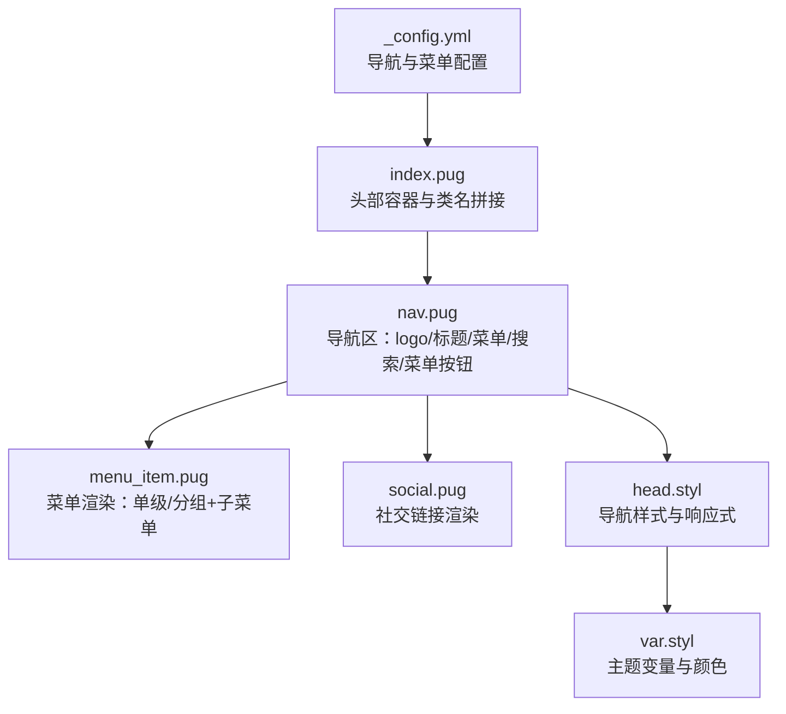
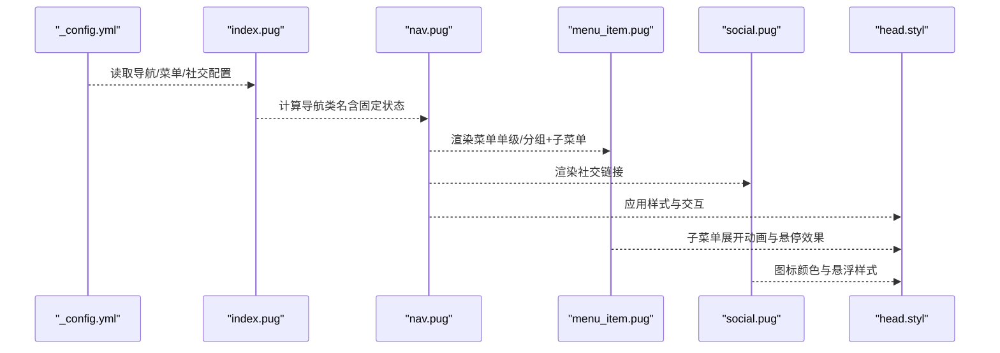
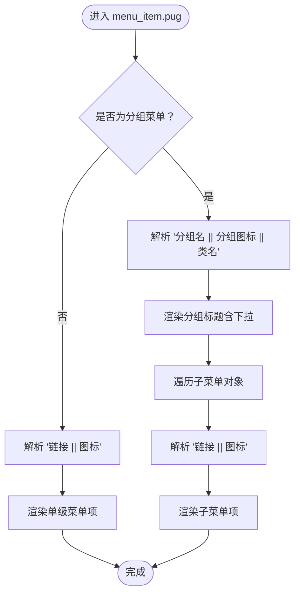
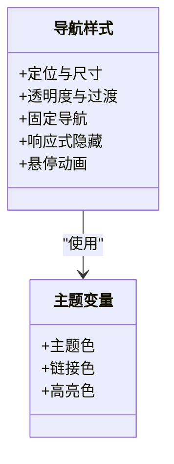
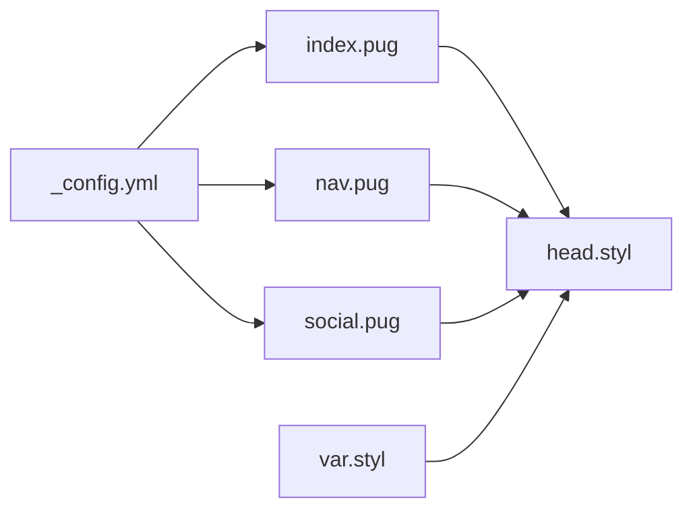

# 导航菜单配置

<cite>
**本文引用的文件**
- [_config.yml](file://themes/butterfly/_config.yml)
- [nav.pug](file://themes/butterfly/layout/includes/header/nav.pug)
- [menu_item.pug](file://themes/butterfly/layout/includes/header/menu_item.pug)
- [social.pug](file://themes/butterfly/layout/includes/header/social.pug)
- [index.pug](file://themes/butterfly/layout/includes/header/index.pug)
- [head.styl](file://themes/butterfly/source/css/_layout/head.styl)
- [var.styl](file://themes/butterfly/source/css/var.styl)
</cite>

## 目录
1. [简介](#简介)
2. [项目结构](#项目结构)
3. [核心组件](#核心组件)
4. [架构总览](#架构总览)
5. [详细组件分析](#详细组件分析)
6. [依赖关系分析](#依赖关系分析)
7. [性能考量](#性能考量)
8. [故障排查指南](#故障排查指南)
9. [结论](#结论)
10. [附录](#附录)

## 简介
本文件面向使用 Butterfly 主题的 Hexo 用户，系统化梳理“导航菜单”相关配置与实现细节，覆盖以下要点：
- 导航条基础配置：logo、标题显示、导航固定等
- 菜单项格式规范：图标、链接、分组与子菜单
- 社交链接配置方法与颜色定制
- 响应式行为与移动端菜单切换
- 自定义菜单项添加步骤与最佳实践
- 视觉定制与交互行为（悬停动画、下划线、展开动画等）

## 项目结构
导航菜单由主题配置驱动，前端通过 Pug 模板渲染，CSS 样式控制布局与交互。关键文件如下：
- 配置文件：themes/butterfly/_config.yml
- 头部模板：themes/butterfly/layout/includes/header/index.pug、nav.pug、menu_item.pug、social.pug
- 样式文件：themes/butterfly/source/css/_layout/head.styl、var.styl

图表来源
- [_config.yml](file://themes/butterfly/_config.yml)
- [index.pug](file://themes/butterfly/layout/includes/header/index.pug)
- [nav.pug](file://themes/butterfly/layout/includes/header/nav.pug)
- [menu_item.pug](file://themes/butterfly/layout/includes/header/menu_item.pug)
- [social.pug](file://themes/butterfly/layout/includes/header/social.pug)
- [head.styl](file://themes/butterfly/source/css/_layout/head.styl)
- [var.styl](file://themes/butterfly/source/css/var.styl)

章节来源
- [index.pug:1-52](file://themes/butterfly/layout/includes/header/index.pug#L1-L52)
- [nav.pug:1-26](file://themes/butterfly/layout/includes/header/nav.pug#L1-L26)
- [menu_item.pug:1-27](file://themes/butterfly/layout/includes/header/menu_item.pug#L1-L27)
- [social.pug:1-8](file://themes/butterfly/layout/includes/header/social.pug#L1-L8)
- [head.styl:180-379](file://themes/butterfly/source/css/_layout/head.styl#L180-L379)
- [head.styl:400-465](file://themes/butterfly/source/css/_layout/head.styl#L400-L465)
- [var.styl:1-233](file://themes/butterfly/source/css/var.styl#L1-L233)

## 核心组件
- 导航基础配置（_config.yml）
  - 导航条设置：logo 图片路径、是否显示站点标题、是否显示文章页标题、导航是否固定
  - 菜单配置：键名为菜单项名称，值为“链接 || 图标”的字符串；支持分组，分组键名格式为“分组名 || 分组图标 || 类名（可选）”
  - 社交链接：键为图标类名，值为“链接 || 描述 || 颜色”的字符串
- 渲染组件（Pug）
  - index.pug：根据配置决定导航是否固定，并拼接类名
  - nav.pug：渲染站点信息（logo/标题）、文章返回链接、搜索按钮、菜单与菜单按钮
  - menu_item.pug：解析菜单配置，渲染单级菜单或带子菜单的分组
  - social.pug：解析社交配置，渲染外链图标与颜色
- 样式组件（Stylus）
  - head.styl：导航定位、尺寸、透明度、悬停动画、移动端隐藏/显示逻辑、子菜单展开动画
  - var.styl：主题色、字体、间距等全局变量

章节来源
- [_config.yml:12-51](file://themes/butterfly/_config.yml#L12-L51)
- [index.pug:3-29](file://themes/butterfly/layout/includes/header/index.pug#L3-L29)
- [nav.pug:1-26](file://themes/butterfly/layout/includes/header/nav.pug#L1-L26)
- [menu_item.pug:1-27](file://themes/butterfly/layout/includes/header/menu_item.pug#L1-L27)
- [social.pug:1-8](file://themes/butterfly/layout/includes/header/social.pug#L1-L8)
- [head.styl:289-465](file://themes/butterfly/source/css/_layout/head.styl#L289-L465)
- [var.styl:1-110](file://themes/butterfly/source/css/var.styl#L1-L110)

## 架构总览
导航菜单从配置到渲染再到样式的完整流程如下：

图表来源
- [_config.yml](file://themes/butterfly/_config.yml)
- [index.pug](file://themes/butterfly/layout/includes/header/index.pug)
- [nav.pug](file://themes/butterfly/layout/includes/header/nav.pug)
- [menu_item.pug](file://themes/butterfly/layout/includes/header/menu_item.pug)
- [social.pug](file://themes/butterfly/layout/includes/header/social.pug)
- [head.styl](file://themes/butterfly/source/css/_layout/head.styl)

## 详细组件分析

### 导航基础配置（_config.yml）
- 导航条设置（nav）
  - logo：图片相对路径，用于显示站点图标
  - display_title：是否显示站点标题
  - display_post_title：在文章页时是否显示返回首页的标题链接
  - fixed：是否固定导航栏（滚动时吸顶）
- 菜单设置（menu）
  - 单级菜单：键为菜单名，值为“链接 || 图标”
  - 分组菜单：键为“分组名 || 分组图标 || 类名（可选）”，值为对象，对象内键为子菜单名，值为“链接 || 图标”
- 社交链接（social）
  - 键为图标类名（如 fab fa-github），值为“链接 || 描述 || 颜色”

章节来源
- [_config.yml:12-51](file://themes/butterfly/_config.yml#L12-L51)

### 导航渲染（index.pug 与 nav.pug）
- 固定导航逻辑
  - index.pug 依据配置生成类名，配合 head.styl 的 fixed 类实现吸顶
- 导航区内容
  - 站点信息：logo（可选）+ 标题（可选）；文章页时显示返回首页的标题链接
  - 搜索按钮：当开启搜索时显示
  - 菜单：调用 menu_item.pug 渲染
  - 菜单按钮：移动端切换菜单显示/隐藏

章节来源
- [index.pug:3-29](file://themes/butterfly/layout/includes/header/index.pug#L3-L29)
- [nav.pug:1-26](file://themes/butterfly/layout/includes/header/nav.pug#L1-L26)

### 菜单项渲染（menu_item.pug）
- 解析规则
  - 单级菜单：按“链接 || 图标”解析，生成 a 标签与图标
  - 分组菜单：分组标题带下拉箭头；子菜单遍历对象，同样按“链接 || 图标”解析
- 特殊类名
  - 分组键名可附加“|| hide”以隐藏该分组菜单

图表来源
- [menu_item.pug:1-27](file://themes/butterfly/layout/includes/header/menu_item.pug#L1-L27)

章节来源
- [menu_item.pug:1-27](file://themes/butterfly/layout/includes/header/menu_item.pug#L1-L27)

### 社交链接渲染（social.pug）
- 解析规则
  - 将值按“链接 || 描述 || 颜色”拆分，生成外链图标
  - 颜色可选，若提供则注入内联样式
- 使用建议
  - 图标类名遵循 Font Awesome 规范
  - 链接支持绝对 URL 或 mailto: 等协议

章节来源
- [social.pug:1-8](file://themes/butterfly/layout/includes/header/social.pug#L1-L8)

### 样式与交互（head.styl 与 var.styl）
- 导航基础样式
  - 定位、尺寸、内边距、字体大小、透明度与过渡
- 固定导航
  - fixed 类使导航吸顶；配合页面主体的 aside 元素上移
- 响应式行为
  - hide-menu 类隐藏菜单与搜索文字，仅保留按钮
  - 移动端隐藏菜单项，显示菜单按钮
- 交互效果
  - 菜单项悬停展开子菜单
  - 下划线动画：hover 时从左至右扩展
  - 文章页返回链接的悬停切换动画
- 主题变量
  - 主题色、链接色、高亮色等来自 var.styl，影响导航整体配色

图表来源
- [head.styl:289-465](file://themes/butterfly/source/css/_layout/head.styl#L289-L465)
- [var.styl:1-110](file://themes/butterfly/source/css/var.styl#L1-L110)

章节来源
- [head.styl:180-208](file://themes/butterfly/source/css/_layout/head.styl#L180-L208)
- [head.styl:289-465](file://themes/butterfly/source/css/_layout/head.styl#L289-L465)
- [var.styl:1-110](file://themes/butterfly/source/css/var.styl#L1-L110)

## 依赖关系分析
- 配置到模板
  - _config.yml 的 nav、menu、social 决定 nav.pug 与 social.pug 的渲染内容
  - index.pug 读取 nav.fixed 并拼接类名，影响 head.styl 的 fixed 样式应用
- 模板到样式
  - nav.pug 生成的 DOM 结构与类名由 head.styl 控制外观与交互
  - 菜单项的 hover 展开与下划线动画由 head.styl 实现
- 变量依赖
  - head.styl 中的颜色与动画依赖 var.styl 的主题变量

图表来源
- [_config.yml](file://themes/butterfly/_config.yml)
- [index.pug](file://themes/butterfly/layout/includes/header/index.pug)
- [nav.pug](file://themes/butterfly/layout/includes/header/nav.pug)
- [social.pug](file://themes/butterfly/layout/includes/header/social.pug)
- [head.styl](file://themes/butterfly/source/css/_layout/head.styl)
- [var.styl](file://themes/butterfly/source/css/var.styl)

章节来源
- [index.pug:3-29](file://themes/butterfly/layout/includes/header/index.pug#L3-L29)
- [nav.pug:1-26](file://themes/butterfly/layout/includes/header/nav.pug#L1-L26)
- [social.pug:1-8](file://themes/butterfly/layout/includes/header/social.pug#L1-L8)
- [head.styl:289-465](file://themes/butterfly/source/css/_layout/head.styl#L289-L465)
- [var.styl:1-110](file://themes/butterfly/source/css/var.styl#L1-L110)

## 性能考量
- 菜单缓存
  - menu_item.pug 在 nav.pug 中以 partial 方式渲染并启用缓存，减少重复计算
- 样式优化
  - 使用 translate3d/transform 与 opacity 动画，尽量避免强制重排
  - 固定导航仅在需要时启用，避免不必要的层级提升
- 响应式策略
  - 移动端默认隐藏菜单项，仅保留按钮，降低首屏渲染压力

章节来源
- [nav.pug:22](file://themes/butterfly/layout/includes/header/nav.pug#L22)
- [head.styl:180-208](file://themes/butterfly/source/css/_layout/head.styl#L180-L208)

## 故障排查指南
- 菜单不显示
  - 检查 _config.yml 中 menu 是否存在且格式正确（“链接 || 图标”）
  - 若为分组菜单，确认分组键名格式为“分组名 || 分组图标 || 类名（可选）”
- 图标不生效
  - 确认图标类名符合 Font Awesome 规范
  - 若使用自定义图标库，请确保对应 CSS 已加载
- 社交链接颜色无效
  - 检查“链接 || 描述 || 颜色”中颜色值格式是否正确
- 导航未固定
  - 确认 _config.yml 中 nav.fixed 设置为 true
  - 检查 head.styl 的 fixed 类是否被其他样式覆盖
- 移动端菜单不可见
  - 确认未误用 hide-menu 类
  - 检查屏幕宽度断点与样式是否匹配

章节来源
- [menu_item.pug:1-27](file://themes/butterfly/layout/includes/header/menu_item.pug#L1-L27)
- [social.pug:1-8](file://themes/butterfly/layout/includes/header/social.pug#L1-L8)
- [head.styl:180-208](file://themes/butterfly/source/css/_layout/head.styl#L180-L208)

## 结论
通过配置文件与模板/样式的协同，Butterfly 主题实现了灵活、可定制的导航菜单体系。遵循本文档的配置规范与最佳实践，可在桌面与移动端获得一致的视觉与交互体验。

## 附录

### 配置项速查
- 导航条（nav）
  - logo：图片路径
  - display_title：布尔
  - display_post_title：布尔
  - fixed：布尔
- 菜单（menu）
  - 单级：键为菜单名，值为“链接 || 图标”
  - 分组：键为“分组名 || 分组图标 || 类名（可选）”，值为子菜单对象
- 社交（social）
  - 键为图标类名，值为“链接 || 描述 || 颜色”

章节来源
- [_config.yml:12-51](file://themes/butterfly/_config.yml#L12-L51)