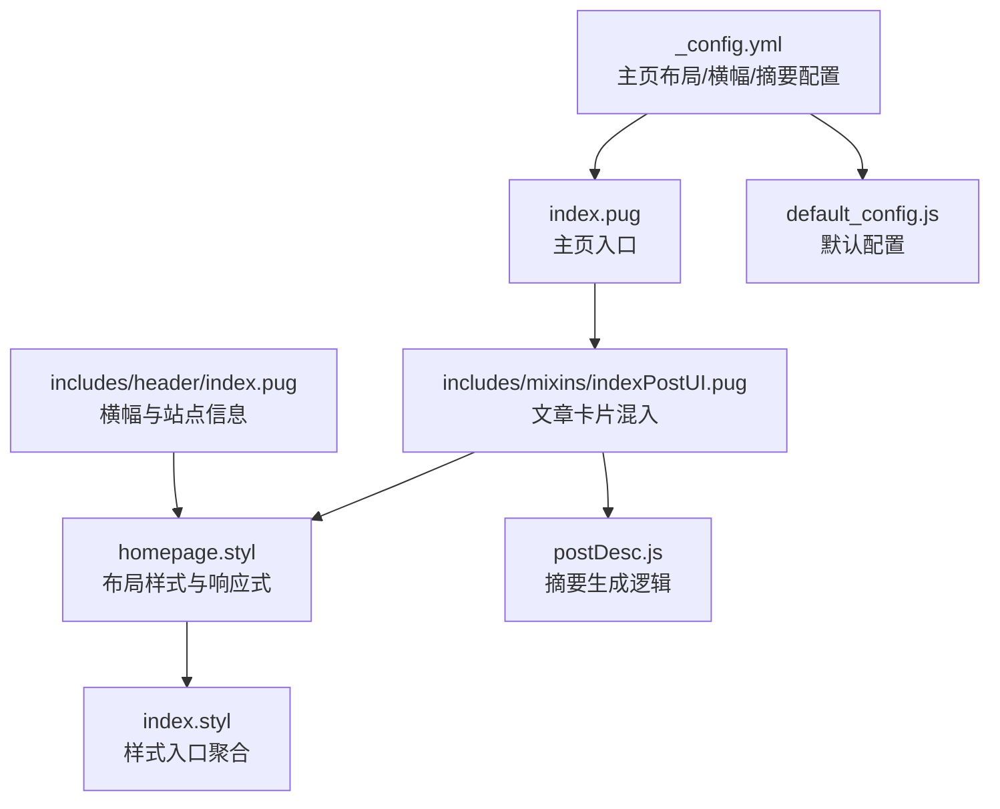
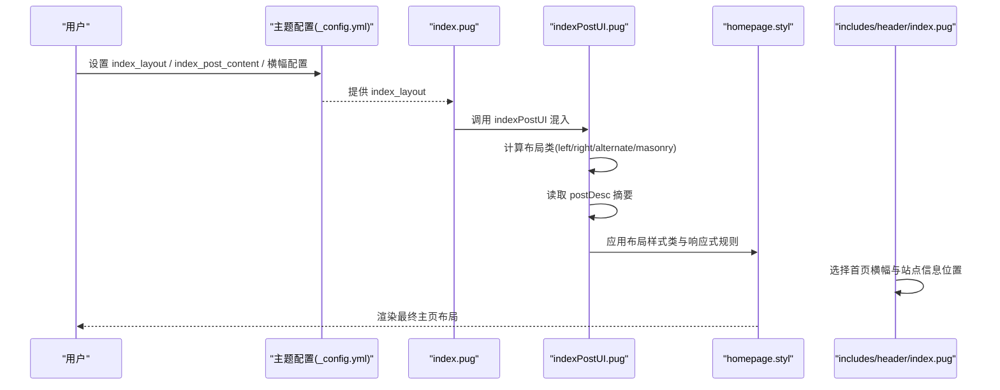
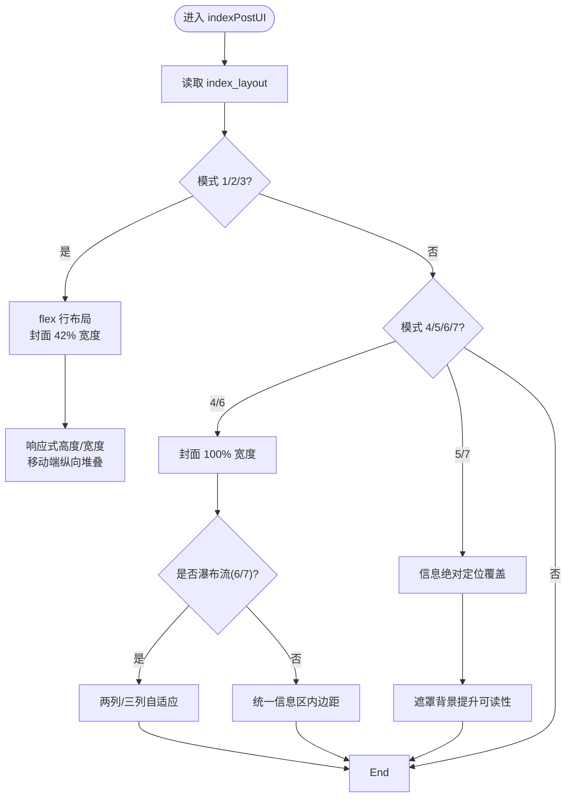
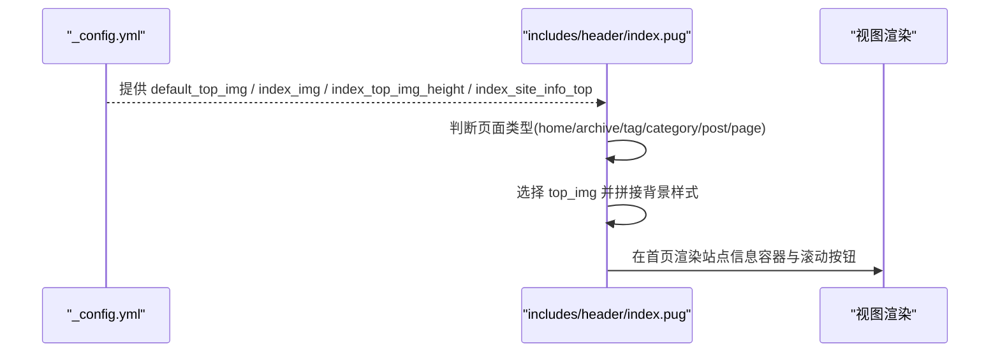
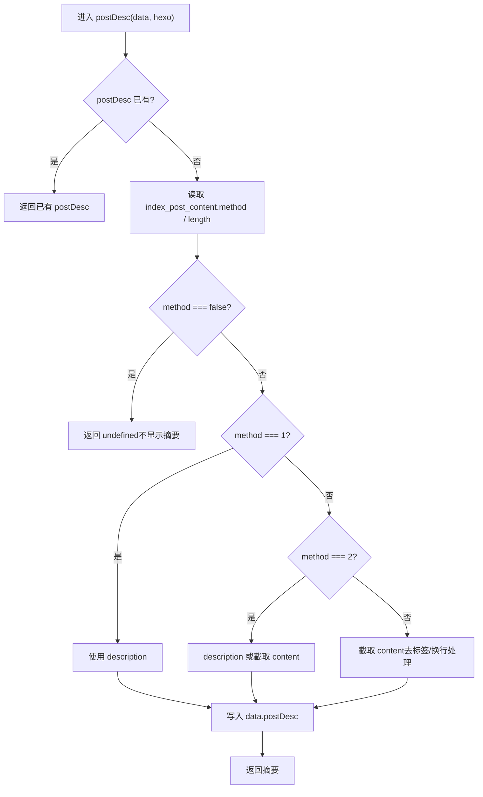
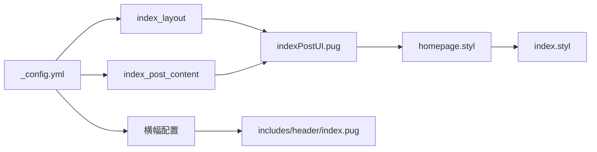

# 主页布局

<cite>
**本文引用的文件**
- [_config.yml](file://themes/butterfly/_config.yml)
- [index.pug](file://themes/butterfly/layout/index.pug)
- [indexPostUI.pug](file://themes/butterfly/layout/includes/mixins/indexPostUI.pug)
- [index.pug（头部）](file://themes/butterfly/layout/includes/header/index.pug)
- [homepage.styl](file://themes/butterfly/source/css/_page/homepage.styl)
- [default_config.js](file://themes/butterfly/scripts/common/default_config.js)
- [postDesc.js](file://themes/butterfly/scripts/common/postDesc.js)
- [index.styl](file://themes/butterfly/source/css/index.styl)
</cite>

## 目录
1. [简介](#简介)
2. [项目结构](#项目结构)
3. [核心组件](#核心组件)
4. [架构总览](#架构总览)
5. [详细组件分析](#详细组件分析)
6. [依赖关系分析](#依赖关系分析)
7. [性能考量](#性能考量)
8. [故障排查指南](#故障排查指南)
9. [结论](#结论)
10. [附录](#附录)

## 简介
本篇文档聚焦于 Butterfly 主题的“主页布局”配置与实现，系统解析主页文章布局的七种模式及其视觉呈现，详解主页横幅图片的配置项（默认横幅、高度、站点信息位置），并提供摘要显示方式的配置与自定义方法。通过模板、样式与脚本三者的协同，实现从数据到渲染的完整链路。

## 项目结构
围绕主页布局的关键文件分布如下：
- 配置层：主题配置文件中定义主页布局模式、横幅与摘要策略
- 模板层：主页入口与混入负责渲染文章卡片与元数据
- 样式层：根据布局模式动态生成 CSS 类与响应式规则
- 脚本层：摘要截取逻辑与默认配置

图表来源
- [_config.yml:140-189](file://themes/butterfly/_config.yml#L140-L189)
- [index.pug:1-5](file://themes/butterfly/layout/index.pug#L1-L5)
- [indexPostUI.pug:1-119](file://themes/butterfly/layout/includes/mixins/indexPostUI.pug#L1-L119)
- [homepage.styl:1-175](file://themes/butterfly/source/css/_page/homepage.styl#L1-L175)
- [default_config.js:79-83](file://themes/butterfly/scripts/common/default_config.js#L79-L83)
- [postDesc.js:12-35](file://themes/butterfly/scripts/common/postDesc.js#L12-L35)
- [index.styl:1-15](file://themes/butterfly/source/css/index.styl#L1-L15)
- [index.pug（头部）:1-52](file://themes/butterfly/layout/includes/header/index.pug#L1-L52)

章节来源
- [index.pug:1-5](file://themes/butterfly/layout/index.pug#L1-L5)
- [indexPostUI.pug:1-119](file://themes/butterfly/layout/includes/mixins/indexPostUI.pug#L1-L119)
- [homepage.styl:1-175](file://themes/butterfly/source/css/_page/homepage.styl#L1-L175)
- [_config.yml:140-189](file://themes/butterfly/_config.yml#L140-L189)
- [default_config.js:79-83](file://themes/butterfly/scripts/common/default_config.js#L79-L83)
- [postDesc.js:12-35](file://themes/butterfly/scripts/common/postDesc.js#L12-L35)
- [index.pug（头部）:1-52](file://themes/butterfly/layout/includes/header/index.pug#L1-L52)
- [index.styl:1-15](file://themes/butterfly/source/css/index.styl#L1-L15)

## 核心组件
- 主页入口模板：引入文章卡片混入，承载分页等通用结构
- 文章卡片混入：按布局模式输出封面与信息区域，注入元数据与摘要
- 布局样式：依据 index_layout 动态生成布局类与响应式尺寸
- 摘要生成脚本：基于配置决定使用 description、auto_excerpt 或两者结合
- 默认配置：提供 index_layout、index_post_content 等默认值
- 头部横幅：根据页面类型选择横幅图与站点信息位置

章节来源
- [index.pug:1-5](file://themes/butterfly/layout/index.pug#L1-L5)
- [indexPostUI.pug:1-119](file://themes/butterfly/layout/includes/mixins/indexPostUI.pug#L1-L119)
- [homepage.styl:1-175](file://themes/butterfly/source/css/_page/homepage.styl#L1-L175)
- [postDesc.js:12-35](file://themes/butterfly/scripts/common/postDesc.js#L12-L35)
- [default_config.js:79-83](file://themes/butterfly/scripts/common/default_config.js#L79-L83)
- [index.pug（头部）:1-52](file://themes/butterfly/layout/includes/header/index.pug#L1-L52)

## 架构总览
下图展示了主页布局从配置到渲染的关键流程：

图表来源
- [_config.yml:140-189](file://themes/butterfly/_config.yml#L140-L189)
- [index.pug:1-5](file://themes/butterfly/layout/index.pug#L1-L5)
- [indexPostUI.pug:1-119](file://themes/butterfly/layout/includes/mixins/indexPostUI.pug#L1-L119)
- [homepage.styl:1-175](file://themes/butterfly/source/css/_page/homepage.styl#L1-L175)
- [index.pug（头部）:1-52](file://themes/butterfly/layout/includes/header/index.pug#L1-L52)

## 详细组件分析

### 主页文章布局七种模式
- 模式 1：封面在左，信息在右
  - 特点：双栏布局，封面占宽高比固定；移动端切换为纵向堆叠
  - 适用场景：强调封面视觉、信息密度适中的内容列表
  - 样式要点：flex 行布局、封面宽度约 42%、响应式高度
- 模式 2：封面在右，信息在左
  - 特点：镜像布局，其余规则同模式 1
  - 适用场景：需要强调右侧信息或阅读节奏的排版
- 模式 3：左右交替
  - 特点：相邻文章交替左右，增强视觉动感
  - 实现：通过索引奇偶性计算 left/right 类名
- 模式 4：封面在上，信息在下
  - 特点：信息区独立，适合长标题与摘要并列
  - 样式要点：封面 100% 宽度，信息区统一内边距
- 模式 5：信息覆盖在封面之上
  - 特点：信息绝对定位居中，需配合遮罩背景提升可读性
  - 样式要点：绝对定位、居中变换、白字高对比色
- 模式 6：瀑布流（封面在上，信息在下）
  - 特点：两列/三列自适应，适合密集内容与高信息密度
  - 样式要点：calc(100%/2) 或 calc(100%/3)，媒体查询适配
- 模式 7：瀑布流（信息覆盖在封面之上）
  - 特点：瀑布流 + 信息覆盖，视觉冲击力强
  - 样式要点：同模式 5 的覆盖逻辑 + 瀑布流列宽

图表来源
- [indexPostUI.pug:1-119](file://themes/butterfly/layout/includes/mixins/indexPostUI.pug#L1-L119)
- [homepage.styl:1-175](file://themes/butterfly/source/css/_page/homepage.styl#L1-L175)

章节来源
- [indexPostUI.pug:1-119](file://themes/butterfly/layout/includes/mixins/indexPostUI.pug#L1-L119)
- [homepage.styl:1-175](file://themes/butterfly/source/css/_page/homepage.styl#L1-L175)
- [_config.yml:170-178](file://themes/butterfly/_config.yml#L170-L178)

### 主页横幅图片配置
- 默认横幅与首页横幅
  - 当页面未设置 top_img 时回退至 default_top_img
  - 首页横幅由 index_img 决定
- 横幅高度
  - index_top_img_height 支持 px/em/rem 等单位，用于控制全屏横幅高度
- 站点信息位置
  - index_site_info_top 可设置站点标题/副标题/社交图标等容器的垂直位置
- 头部渲染逻辑
  - 根据页面类型选择对应横幅图，并在首页渲染站点信息与滚动提示

图表来源
- [_config.yml:62-91](file://themes/butterfly/_config.yml#L62-L91)
- [_config.yml:144-148](file://themes/butterfly/_config.yml#L144-L148)
- [index.pug（头部）:1-52](file://themes/butterfly/layout/includes/header/index.pug#L1-L52)

章节来源
- [_config.yml:62-91](file://themes/butterfly/_config.yml#L62-L91)
- [_config.yml:144-148](file://themes/butterfly/_config.yml#L144-L148)
- [index.pug（头部）:1-52](file://themes/butterfly/layout/includes/header/index.pug#L1-L52)

### 主页文章摘要显示方式
- 配置项
  - index_post_content.method：1=仅描述；2=优先描述，否则自动摘取；3=自动摘取（默认）
  - index_post_content.length：自动摘取长度（字符数）
  - index_post_content 为 false：不显示摘要
- 生成逻辑
  - 若存在 postDesc 前置字段则直接使用
  - 否则根据 method 选择 description 或截取 content
  - 截取前会移除 HTML 标签并替换换行为单个空格
- 默认值
  - index_layout 默认 3（交替布局）
  - index_post_content.method 默认 3
  - index_post_content.length 默认 500

图表来源
- [postDesc.js:12-35](file://themes/butterfly/scripts/common/postDesc.js#L12-L35)
- [default_config.js:80-83](file://themes/butterfly/scripts/common/default_config.js#L80-L83)

章节来源
- [postDesc.js:12-35](file://themes/butterfly/scripts/common/postDesc.js#L12-L35)
- [default_config.js:79-83](file://themes/butterfly/scripts/common/default_config.js#L79-L83)
- [_config.yml:180-189](file://themes/butterfly/_config.yml#L180-L189)

### 模式与样式映射关系
- 模式 1/2/3：双栏 flex 布局，移动端纵向堆叠
- 模式 4/6：封面 100% 宽度，信息区统一内边距
- 模式 5/7：信息绝对定位覆盖，需遮罩背景
- 瀑布流（6/7）：两列/三列自适应，媒体查询适配

章节来源
- [homepage.styl:1-175](file://themes/butterfly/source/css/_page/homepage.styl#L1-L175)

## 依赖关系分析
- 配置依赖
  - index_layout 作为主开关，驱动模板与样式的分支逻辑
  - index_post_content 影响摘要生成与 DOM 输出
  - 横幅配置影响头部渲染与背景样式
- 模板依赖
  - index.pug 依赖 indexPostUI.pug 输出文章卡片
  - indexPostUI.pug 依赖 postDesc.js 生成摘要
- 样式依赖
  - homepage.styl 读取 index_layout 并生成相应类与规则
  - index.styl 聚合所有样式模块

图表来源
- [_config.yml:140-189](file://themes/butterfly/_config.yml#L140-L189)
- [indexPostUI.pug:1-119](file://themes/butterfly/layout/includes/mixins/indexPostUI.pug#L1-L119)
- [index.pug（头部）:1-52](file://themes/butterfly/layout/includes/header/index.pug#L1-L52)
- [homepage.styl:1-175](file://themes/butterfly/source/css/_page/homepage.styl#L1-L175)
- [index.styl:1-15](file://themes/butterfly/source/css/index.styl#L1-L15)

章节来源
- [_config.yml:140-189](file://themes/butterfly/_config.yml#L140-L189)
- [indexPostUI.pug:1-119](file://themes/butterfly/layout/includes/mixins/indexPostUI.pug#L1-L119)
- [index.pug（头部）:1-52](file://themes/butterfly/layout/includes/header/index.pug#L1-L52)
- [homepage.styl:1-175](file://themes/butterfly/source/css/_page/homepage.styl#L1-L175)
- [index.styl:1-15](file://themes/butterfly/source/css/index.styl#L1-L15)

## 性能考量
- 瀑布流模式（6/7）在大屏设备采用三列布局，建议控制文章数量与封面尺寸，避免过度重绘
- 信息覆盖模式（5/7）使用绝对定位与遮罩，注意在小屏设备的可读性与加载优化
- 自动摘取摘要涉及字符串处理与截断，建议合理设置 length，避免过长文本导致渲染压力
- 横幅背景图建议压缩与懒加载策略，结合响应式尺寸减少带宽占用

## 故障排查指南
- 横幅未显示
  - 检查 disable_top_img 是否为 true
  - 确认首页 index_img 或 default_top_img 是否正确配置
  - 确认页面 top_img 未被显式设为 false
- 摘要不显示
  - 检查 index_post_content.method 是否为 false
  - 确认文章存在 description 或 content 可供截取
- 布局异常
  - 检查 index_layout 数值是否在 1-7 之间
  - 确认 homepage.styl 中的媒体查询未被覆盖
- 移动端显示问题
  - 关注 flex/column 布局在窄屏下的表现
  - 确认信息覆盖模式在小屏的可读性

章节来源
- [_config.yml:62-91](file://themes/butterfly/_config.yml#L62-L91)
- [_config.yml:144-148](file://themes/butterfly/_config.yml#L144-L148)
- [_config.yml:180-189](file://themes/butterfly/_config.yml#L180-L189)
- [indexPostUI.pug:1-119](file://themes/butterfly/layout/includes/mixins/indexPostUI.pug#L1-L119)
- [homepage.styl:1-175](file://themes/butterfly/source/css/_page/homepage.styl#L1-L175)

## 结论
通过配置层的 index_layout 与 index_post_content、模板层的 indexPostUI 混入以及样式层的 homepage.styl，Butterfly 主题实现了灵活且可扩展的主页布局体系。结合头部横幅配置，可在不同设备与场景下获得一致而美观的阅读体验。建议根据内容特性选择合适模式，并在移动端与高密度内容场景下关注性能与可读性平衡。

## 附录
- 完整配置示例路径
  - 主页布局与摘要：[_config.yml:140-189](file://themes/butterfly/_config.yml#L140-L189)
  - 横幅与站点信息：[_config.yml:62-91](file://themes/butterfly/_config.yml#L62-L91), [_config.yml:144-148](file://themes/butterfly/_config.yml#L144-L148)
  - 默认配置参考：[default_config.js:79-83](file://themes/butterfly/scripts/common/default_config.js#L79-L83)
- 渲染流程参考
  - 主页入口：[index.pug:1-5](file://themes/butterfly/layout/index.pug#L1-L5)
  - 文章卡片混入：[indexPostUI.pug:1-119](file://themes/butterfly/layout/includes/mixins/indexPostUI.pug#L1-L119)
  - 摘要生成：[postDesc.js:12-35](file://themes/butterfly/scripts/common/postDesc.js#L12-L35)
  - 样式入口：[index.styl:1-15](file://themes/butterfly/source/css/index.styl#L1-L15)