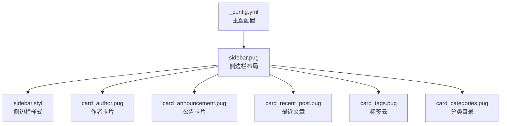
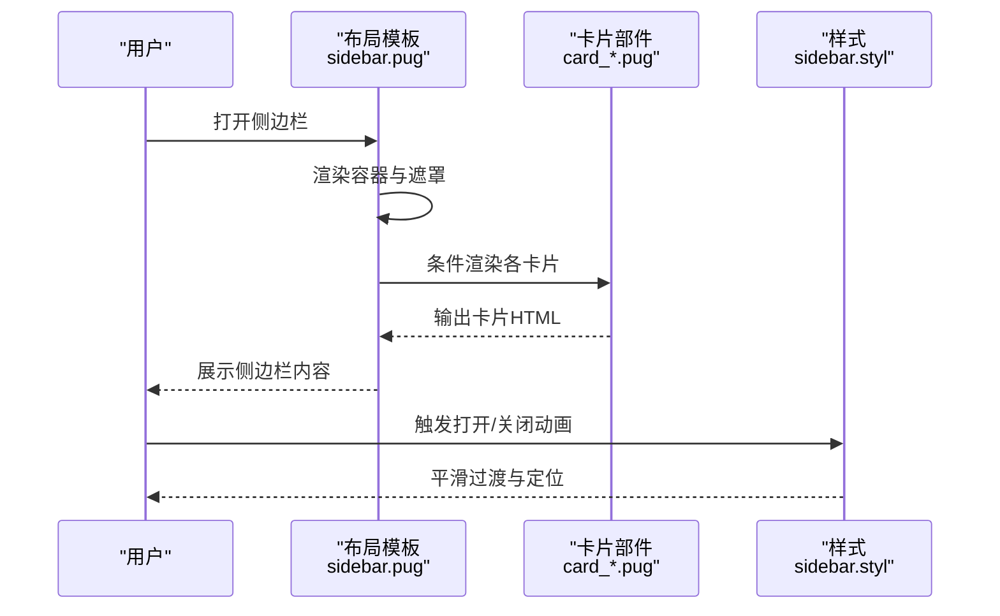
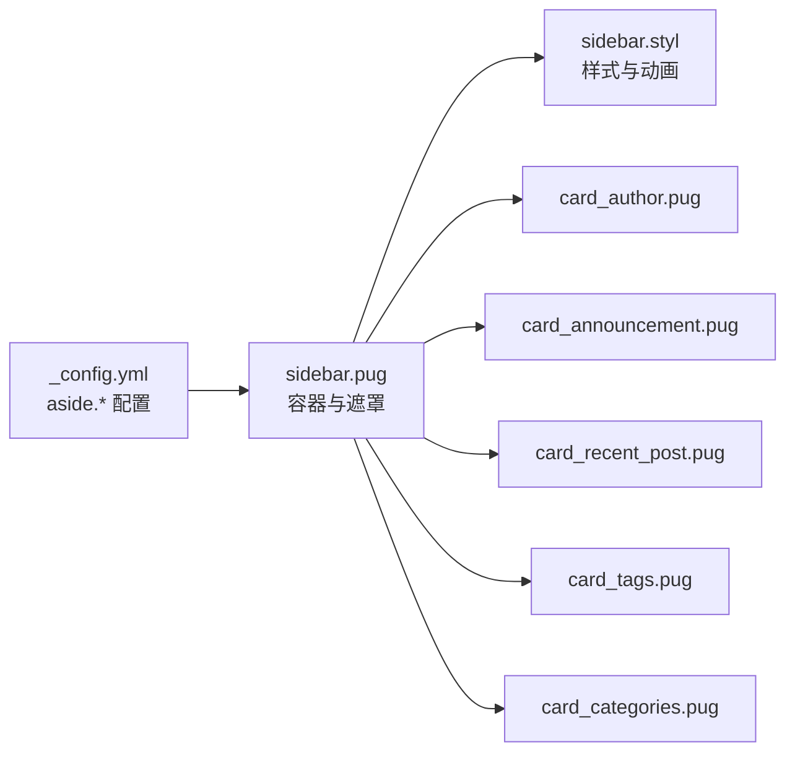

# 侧边栏配置

<cite>
**本文引用的文件**
- [_config.yml](file://themes/butterfly/_config.yml)
- [sidebar.pug](file://themes/butterfly/layout/includes/sidebar.pug)
- [sidebar.styl](file://themes/butterfly/source/css/_layout/sidebar.styl)
- [card_author.pug](file://themes/butterfly/layout/includes/widget/card_author.pug)
- [card_announcement.pug](file://themes/butterfly/layout/includes/widget/card_announcement.pug)
- [card_recent_post.pug](file://themes/butterfly/layout/includes/widget/card_recent_post.pug)
- [card_tags.pug](file://themes/butterfly/layout/includes/widget/card_tags.pug)
- [card_categories.pug](file://themes/butterfly/layout/includes/widget/card_categories.pug)
</cite>

## 目录
1. [简介](#简介)
2. [项目结构](#项目结构)
3. [核心组件](#核心组件)
4. [架构总览](#架构总览)
5. [详细组件分析](#详细组件分析)
6. [依赖关系分析](#依赖关系分析)
7. [性能考量](#性能考量)
8. [故障排查指南](#故障排查指南)
9. [结论](#结论)
10. [附录：完整定制示例与效果说明](#附录完整定制示例与效果说明)

## 简介
本文件系统性梳理 Butterfly 主题的侧边栏配置，覆盖以下方面：
- 侧边栏整体布局：显示位置（左侧/右侧）、是否固定、宽度与隐藏策略
- 侧边栏卡片组件：作者卡片、公告卡片、最近文章、标签云、分类目录、归档列表、网站信息等的独立开关与参数
- 页面级显示逻辑：首页、文章页、分类页、标签页的差异化控制
- 移动端与响应式行为：移动端可见性、按钮显隐、遮罩层交互
- 定制示例与效果说明：提供可直接参考的配置要点与预期效果

## 项目结构
侧边栏由“布局模板 + 样式 + 卡片部件”三部分构成：
- 布局模板：负责渲染侧边栏容器、遮罩、菜单项与卡片挂载点
- 样式：定义侧边栏定位、动画、宽度、移动端适配等
- 卡片部件：按需加载各类卡片，受统一的开关与参数控制

图表来源
- [_config.yml](file://themes/butterfly/_config.yml)
- [sidebar.pug](file://themes/butterfly/layout/includes/sidebar.pug)
- [sidebar.styl](file://themes/butterfly/source/css/_layout/sidebar.styl)
- [card_author.pug](file://themes/butterfly/layout/includes/widget/card_author.pug)
- [card_announcement.pug](file://themes/butterfly/layout/includes/widget/card_announcement.pug)
- [card_recent_post.pug](file://themes/butterfly/layout/includes/widget/card_recent_post.pug)
- [card_tags.pug](file://themes/butterfly/layout/includes/widget/card_tags.pug)
- [card_categories.pug](file://themes/butterfly/layout/includes/widget/card_categories.pug)

章节来源
- [sidebar.pug:1-18](file://themes/butterfly/layout/includes/sidebar.pug#L1-L18)
- [sidebar.styl:1-97](file://themes/butterfly/source/css/_layout/sidebar.styl#L1-L97)

## 核心组件
- 侧边栏容器与遮罩：通过布局模板生成，支持打开/关闭状态切换与遮罩层
- 侧边栏卡片集合：按配置逐个渲染，未启用的卡片不会输出
- 侧边栏样式：控制位置（右侧固定）、宽度、滚动条、过渡动画、移动端隐藏策略

章节来源
- [sidebar.pug:1-18](file://themes/butterfly/layout/includes/sidebar.pug#L1-L18)
- [sidebar.styl:10-25](file://themes/butterfly/source/css/_layout/sidebar.styl#L10-L25)

## 架构总览
下图展示侧边栏从配置到渲染的关键流程：

图表来源
- [sidebar.pug:1-18](file://themes/butterfly/layout/includes/sidebar.pug#L1-L18)
- [sidebar.styl:10-25](file://themes/butterfly/source/css/_layout/sidebar.styl#L10-L25)
- [card_author.pug:1-27](file://themes/butterfly/layout/includes/widget/card_author.pug#L1-L27)
- [card_announcement.pug:1-6](file://themes/butterfly/layout/includes/widget/card_announcement.pug#L1-L6)
- [card_recent_post.pug:1-27](file://themes/butterfly/layout/includes/widget/card_recent_post.pug#L1-L27)
- [card_tags.pug:1-15](file://themes/butterfly/layout/includes/widget/card_tags.pug#L1-L15)
- [card_categories.pug:1-5](file://themes/butterfly/layout/includes/widget/card_categories.pug#L1-L5)

## 详细组件分析

### 侧边栏整体布局配置
- 显示位置与固定：侧边栏默认位于右侧并支持固定定位；可通过样式调整位置与宽度
- 隐藏策略：支持在移动端显示、在桌面端隐藏；可通过按钮或遮罩点击关闭
- 动画与过渡：打开时使用平滑位移过渡，关闭时恢复原位
- 菜单与头像：侧边栏顶部包含头像、站点数据统计与菜单项

章节来源
- [sidebar.styl:10-25](file://themes/butterfly/source/css/_layout/sidebar.styl#L10-L25)
- [sidebar.pug:1-18](file://themes/butterfly/layout/includes/sidebar.pug#L1-L18)

### 侧边栏卡片组件配置
所有卡片均遵循“enable 开关 + 参数对象”的模式，卡片启用后才会渲染。

- 作者卡片（card_author）
  - 开关：theme.aside.card_author.enable
  - 描述：支持自定义描述
  - 关注按钮：可配置图标、文案与链接
  - 社交图标：可选显示
  - 数据统计：文章数、标签数、分类数

- 公告卡片（card_announcement）
  - 开关：theme.aside.card_announcement.enable
  - 内容：支持 HTML 片段

- 最近文章（card_recent_post）
  - 开关：theme.aside.card_recent_post.enable
  - 数量限制：limit（0 表示不限制）
  - 排序：按创建时间或更新时间排序
  - 封面：受全局 cover.aside_enable 控制

- 标签云（card_tags）
  - 开关：theme.aside.card_tags.enable
  - 数量限制：limit（0 表示全部）
  - 排序方式：orderby（如随机、名称、长度）
  - 排序方向：order（1 升序，-1 降序）
  - 颜色：可开启彩色标签云或自定义颜色范围

- 分类目录（card_categories）
  - 开关：theme.aside.card_categories.enable
  - 数量限制：limit（0 表示不限制）
  - 展开策略：expand（none/展开/折叠）

- 归档列表（card_archives）
  - 开关：theme.aside.card_archives.enable
  - 类型：monthly/yearly
  - 格式：format（如 “YYYY年MM月”）
  - 排序：order（1 升序，-1 降序）
  - 数量限制：limit（0 表示不限制）

- 网站信息（card_webinfo）
  - 开关：theme.aside.card_webinfo.enable
  - 统计项：文章总数、最后更新时间等
  - 运行时统计：可配置起始日期以计算运行天数

章节来源
- [_config.yml:274-357](file://themes/butterfly/_config.yml#L274-L357)
- [card_author.pug:1-27](file://themes/butterfly/layout/includes/widget/card_author.pug#L1-L27)
- [card_announcement.pug:1-6](file://themes/butterfly/layout/includes/widget/card_announcement.pug#L1-L6)
- [card_recent_post.pug:1-27](file://themes/butterfly/layout/includes/widget/card_recent_post.pug#L1-L27)
- [card_tags.pug:1-15](file://themes/butterfly/layout/includes/widget/card_tags.pug#L1-L15)
- [card_categories.pug:1-5](file://themes/butterfly/layout/includes/widget/card_categories.pug#L1-L5)

### 页面类型显示逻辑与差异化配置
- 首页（index）
  - 侧边栏默认启用（aside.enable），可选择隐藏按钮与移动端可见性
  - 可通过 display.* 控制首页显示的卡片集合（如归档、标签、分类）

- 文章页（post）
  - 侧边栏默认启用；封面显示策略受全局 cover.aside_enable 控制
  - 最近文章卡片可按更新时间排序，便于展示最新动态

- 分类页（category）
  - 侧边栏默认启用；分类目录卡片可限制数量与展开策略

- 标签页（tag）
  - 侧边栏默认启用；标签云卡片可配置排序与颜色

章节来源
- [_config.yml:274-357](file://themes/butterfly/_config.yml#L274-L357)
- [card_recent_post.pug:14-20](file://themes/butterfly/layout/includes/widget/card_recent_post.pug#L14-L20)
- [card_categories.pug:1-5](file://themes/butterfly/layout/includes/widget/card_categories.pug#L1-L5)

### 移动端与响应式行为
- 移动端可见性：mobile 字段控制移动端是否显示侧边栏
- 按钮显隐：button 字段控制底部右下角“显示侧边栏”按钮
- 遮罩层：点击遮罩可关闭侧边栏
- 定位与宽度：右侧固定定位，宽度由样式变量控制，打开时通过位移过渡显示

章节来源
- [_config.yml:274-281](file://themes/butterfly/_config.yml#L274-L281)
- [sidebar.styl:10-25](file://themes/butterfly/source/css/_layout/sidebar.styl#L10-L25)

## 依赖关系分析
侧边栏渲染依赖于主题配置与各卡片部件的条件判断，布局模板作为中枢协调样式与部件。

图表来源
- [_config.yml:274-357](file://themes/butterfly/_config.yml#L274-L357)
- [sidebar.pug:1-18](file://themes/butterfly/layout/includes/sidebar.pug#L1-L18)
- [sidebar.styl:10-25](file://themes/butterfly/source/css/_layout/sidebar.styl#L10-L25)
- [card_author.pug:1-27](file://themes/butterfly/layout/includes/widget/card_author.pug#L1-L27)
- [card_announcement.pug:1-6](file://themes/butterfly/layout/includes/widget/card_announcement.pug#L1-L6)
- [card_recent_post.pug:1-27](file://themes/butterfly/layout/includes/widget/card_recent_post.pug#L1-L27)
- [card_tags.pug:1-15](file://themes/butterfly/layout/includes/widget/card_tags.pug#L1-L15)
- [card_categories.pug:1-5](file://themes/butterfly/layout/includes/widget/card_categories.pug#L1-L5)

## 性能考量
- 卡片懒加载：卡片仅在启用时渲染，避免无用 DOM
- 列表限制：为最近文章、标签云、分类目录等提供 limit 参数，减少渲染压力
- 排序与缓存：卡片内部使用排序与缓存策略，降低重复计算
- 样式优化：过渡使用 transform 与 opacity，避免强制重排

## 故障排查指南
- 侧边栏不显示
  - 检查 aside.enable 是否开启
  - 检查移动端可见性与按钮显示设置
- 卡片未出现
  - 检查对应卡片的 enable 开关
  - 检查数据源是否存在（如标签云需存在标签）
- 封面不显示
  - 检查全局 cover.aside_enable 与卡片内封面逻辑
- 样式异常
  - 检查侧边栏定位与宽度变量
  - 检查遮罩层与打开状态类名

章节来源
- [_config.yml:274-357](file://themes/butterfly/_config.yml#L274-L357)
- [card_recent_post.pug:14-20](file://themes/butterfly/layout/includes/widget/card_recent_post.pug#L14-L20)

## 结论
通过统一的配置入口与模块化的卡片设计，侧边栏实现了灵活的布局与内容组合。建议根据站点需求选择必要的卡片，并合理设置数量与排序，以获得最佳的阅读体验与性能表现。

## 附录：完整定制示例与效果说明
以下示例基于配置文件中的字段进行说明，请将示例中的键值替换为你的实际配置。

- 基础布局
  - 位置与固定：position 设置为右侧固定
  - 宽度：通过样式变量控制
  - 隐藏策略：移动端可见、桌面端隐藏
  - 效果：侧边栏右侧固定，打开时平滑滑入，遮罩层点击可关闭

- 卡片启用清单
  - 作者卡片：开启后显示头像、站点统计与关注按钮
  - 公告卡片：开启后显示公告内容
  - 最近文章：开启后按创建/更新时间排序，可限制数量
  - 标签云：开启后按指定规则生成彩色标签云
  - 分类目录：开启后显示分类树，可限制数量与展开策略
  - 归档列表：开启后按月/年维度展示归档
  - 网站信息：开启后显示文章数、最后更新时间等

- 页面差异化
  - 首页：可选择显示归档、标签、分类卡片
  - 文章页：封面显示受全局控制，最近文章可按更新时间排序
  - 分类页：分类目录卡片生效，数量与展开策略可调
  - 标签页：标签云卡片生效，排序与颜色可配置

- 移动端与响应式
  - 移动端可见性：mobile 控制移动端是否显示
  - 底部按钮：button 控制右下角按钮是否显示
  - 遮罩层：点击遮罩关闭侧边栏

章节来源
- [_config.yml:274-357](file://themes/butterfly/_config.yml#L274-L357)
- [sidebar.styl:10-25](file://themes/butterfly/source/css/_layout/sidebar.styl#L10-L25)
- [card_author.pug:1-27](file://themes/butterfly/layout/includes/widget/card_author.pug#L1-L27)
- [card_announcement.pug:1-6](file://themes/butterfly/layout/includes/widget/card_announcement.pug#L1-L6)
- [card_recent_post.pug:1-27](file://themes/butterfly/layout/includes/widget/card_recent_post.pug#L1-L27)
- [card_tags.pug:1-15](file://themes/butterfly/layout/includes/widget/card_tags.pug#L1-L15)
- [card_categories.pug:1-5](file://themes/butterfly/layout/includes/widget/card_categories.pug#L1-L5)