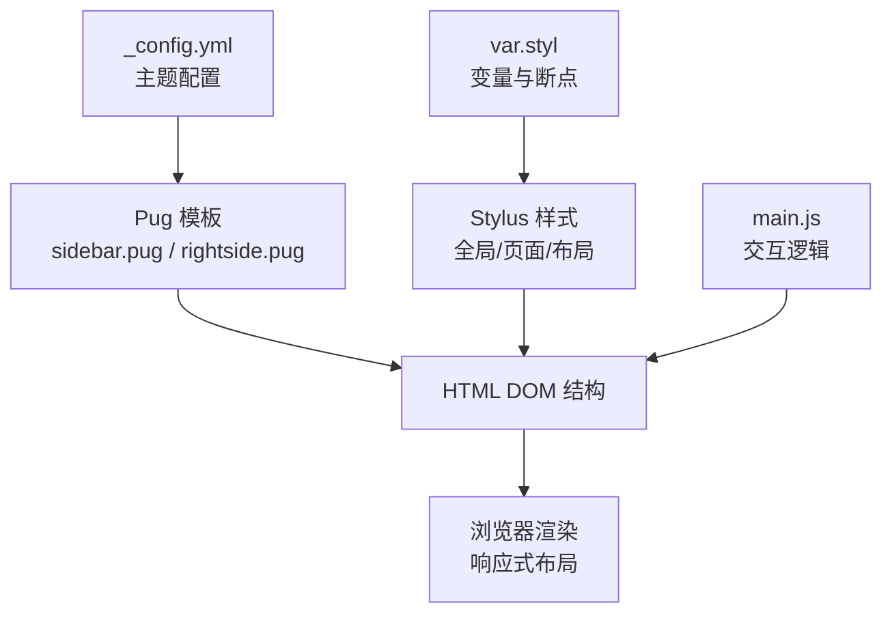
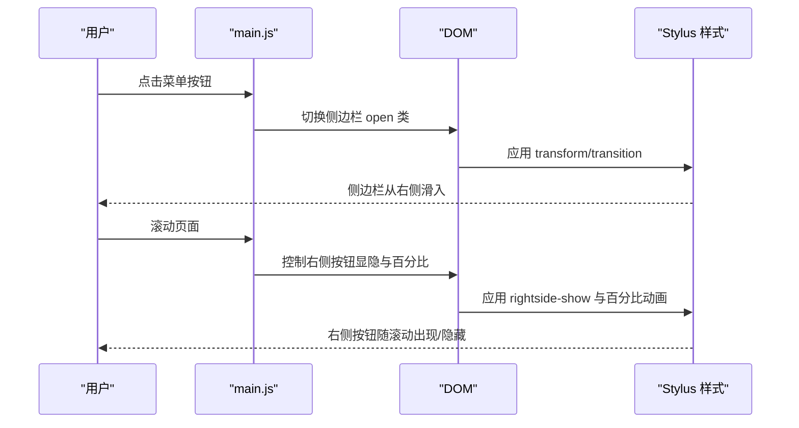
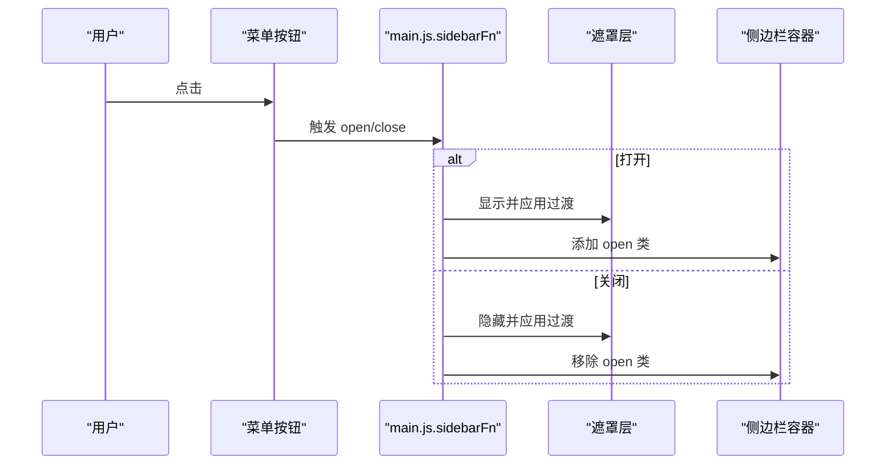
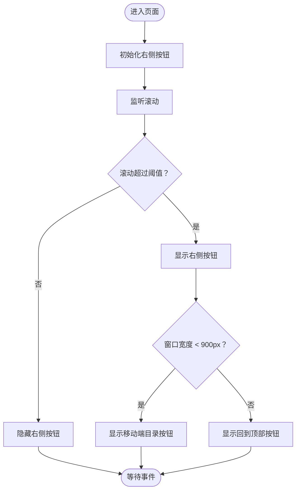
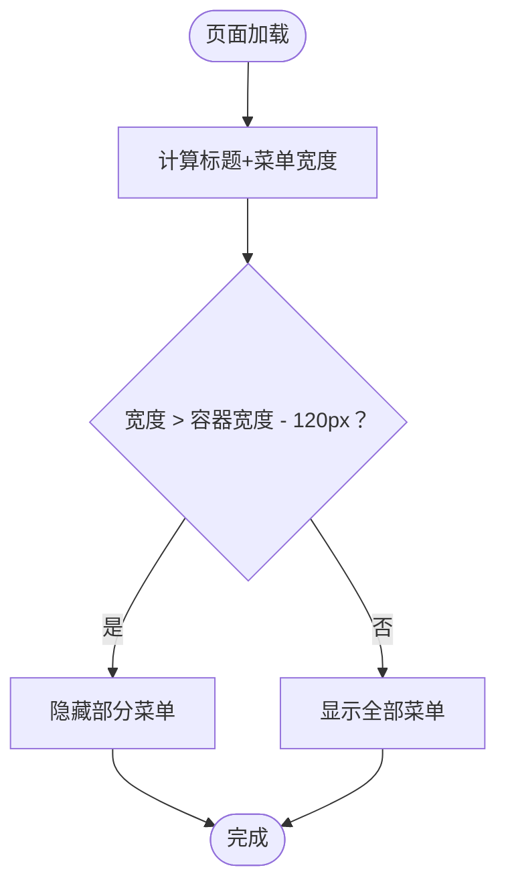
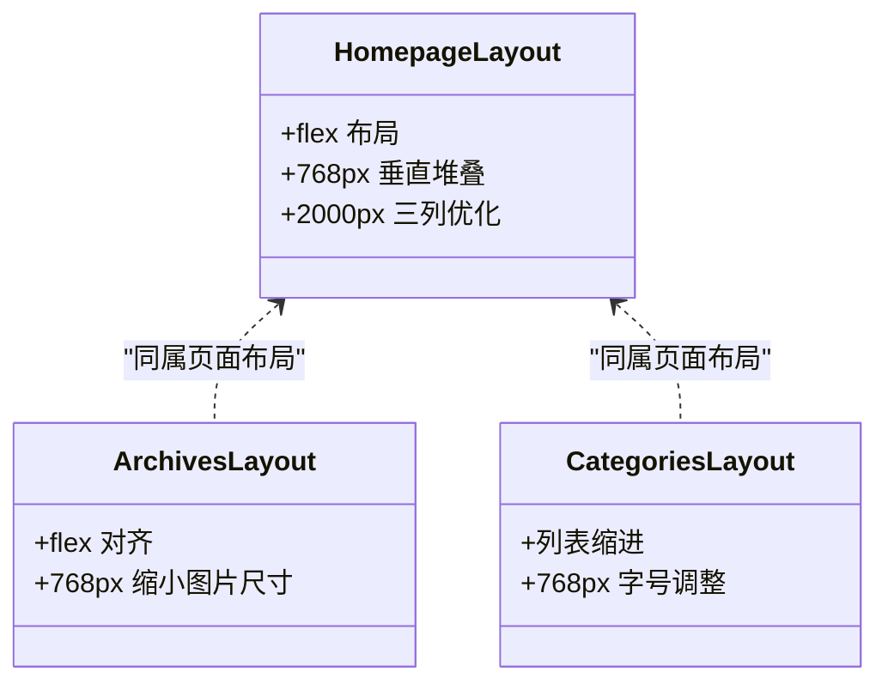
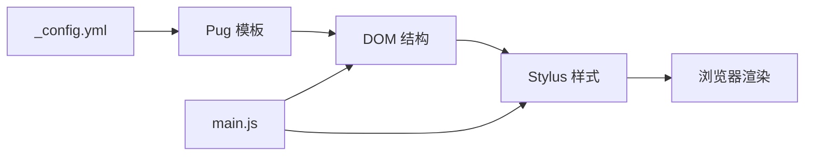

# 响应式设计

<cite>
**本文引用的文件**
- [_config.yml](file://themes/butterfly/_config.yml)
- [var.styl](file://themes/butterfly/source/css/var.styl)
- [index.styl（全局）](file://themes/butterfly/source/css/_global/index.styl)
- [sidebar.styl](file://themes/butterfly/source/css/_layout/sidebar.styl)
- [rightside.styl](file://themes/butterfly/source/css/_layout/rightside.styl)
- [main.js](file://themes/butterfly/source/js/main.js)
- [sidebar.pug](file://themes/butterfly/layout/includes/sidebar.pug)
- [rightside.pug](file://themes/butterfly/layout/includes/rightside.pug)
- [homepage.styl](file://themes/butterfly/source/css/_page/homepage.styl)
- [archives.styl](file://themes/butterfly/source/css/_page/archives.styl)
- [categories.styl](file://themes/butterfly/source/css/_page/categories.styl)
</cite>

## 目录
1. [简介](#简介)
2. [项目结构](#项目结构)
3. [核心组件](#核心组件)
4. [架构总览](#架构总览)
5. [详细组件分析](#详细组件分析)
6. [依赖关系分析](#依赖关系分析)
7. [性能考量](#性能考量)
8. [故障排查指南](#故障排查指南)
9. [结论](#结论)
10. [附录：断点与布局配置清单](#附录断点与布局配置清单)

## 简介
本文件系统性梳理 Butterfly 主题的响应式设计实现，聚焦以下目标：
- 解析桌面端、平板端、手机端的布局差异与显示逻辑
- 详解侧边栏在移动端的折叠/展开机制、隐藏按钮配置与交互行为
- 说明响应式断点设置、网格系统适配方案与移动端专用优化
- 提供不同屏幕尺寸下的布局效果示例与配置建议
- 给出移动端触摸交互的特殊配置与性能优化策略

## 项目结构
围绕响应式设计的关键文件分布如下：
- 配置层：主题配置文件用于控制导航、侧边栏、右侧悬浮按钮等行为
- 样式层：Stylus 变量与媒体查询定义，覆盖全局、页面与组件级样式
- 视图层：Pug 模板按需渲染侧边栏与右侧按钮区域
- 行为层：JavaScript 在运行时处理菜单、滚动、TOC、侧边栏开关等交互

**图表来源**
- [_config.yml](file://themes/butterfly/_config.yml)
- [sidebar.pug](file://themes/butterfly/layout/includes/sidebar.pug)
- [rightside.pug](file://themes/butterfly/layout/includes/rightside.pug)
- [var.styl](file://themes/butterfly/source/css/var.styl)
- [main.js](file://themes/butterfly/source/js/main.js)

**章节来源**
- [_config.yml](file://themes/butterfly/_config.yml)
- [sidebar.pug](file://themes/butterfly/layout/includes/sidebar.pug)
- [rightside.pug](file://themes/butterfly/layout/includes/rightside.pug)
- [var.styl](file://themes/butterfly/source/css/var.styl)
- [main.js](file://themes/butterfly/source/js/main.js)

## 核心组件
- 侧边栏（移动端折叠容器）
  - 结构：遮罩层与菜单容器，支持开合动画
  - 交互：点击菜单按钮触发开合；遮罩点击可关闭
  - 样式：固定定位、右滑入、过渡动画、子菜单展开/收起
- 右侧悬浮按钮区
  - 结构：隐藏/显示两组按钮，支持“设置”入口
  - 交互：根据滚动百分比显示/隐藏；移动端显示“目录”按钮
  - 样式：固定定位、右移显隐、按钮圆角、悬停态
- 导航自适应
  - 动态计算标题与菜单宽度，窄屏自动隐藏部分菜单项
- 页面网格与卡片布局
  - 首页多布局模式，配合媒体查询在不同断点切换
  - 文章列表、归档、分类等页面的响应式网格

**章节来源**
- [sidebar.styl](file://themes/butterfly/source/css/_layout/sidebar.styl)
- [rightside.styl](file://themes/butterfly/source/css/_layout/rightside.styl)
- [main.js](file://themes/butterfly/source/js/main.js)
- [homepage.styl](file://themes/butterfly/source/css/_page/homepage.styl)
- [archives.styl](file://themes/butterfly/source/css/_page/archives.styl)
- [categories.styl](file://themes/butterfly/source/css/_page/categories.styl)

## 架构总览
响应式设计由“配置 → 视图 → 样式 → 行为”的链路协同完成：
- 配置决定功能开关与默认行为（如侧边栏位置、按钮显示顺序）
- Pug 将配置映射为 HTML 结构
- Stylus 定义断点与布局规则，生成最终样式
- JavaScript 在运行时处理交互与动态行为

**图表来源**
- [main.js](file://themes/butterfly/source/js/main.js)
- [sidebar.styl](file://themes/butterfly/source/css/_layout/sidebar.styl)
- [rightside.styl](file://themes/butterfly/source/css/_layout/rightside.styl)

## 详细组件分析

### 侧边栏（移动端折叠/展开）
- 折叠容器
  - 遮罩层：全屏覆盖，点击可关闭
  - 菜单容器：固定定位，右侧滑入，支持子菜单分组展开/收起
- 交互流程
  - 打开：添加遮罩与 open 类，阻止背景滚动
  - 关闭：移除遮罩与 open 类，恢复背景滚动
- 移动端适配
  - 子菜单分组使用旋转图标指示展开状态
  - 支持移动端点击菜单项展开子项

**图表来源**
- [main.js](file://themes/butterfly/source/js/main.js)
- [sidebar.styl](file://themes/butterfly/source/css/_layout/sidebar.styl)
- [sidebar.pug](file://themes/butterfly/layout/includes/sidebar.pug)

**章节来源**
- [main.js](file://themes/butterfly/source/js/main.js)
- [sidebar.styl](file://themes/butterfly/source/css/_layout/sidebar.styl)
- [sidebar.pug](file://themes/butterfly/layout/includes/sidebar.pug)

### 右侧悬浮按钮区（移动端目录按钮）
- 按钮分组
  - 隐藏组：根据配置显示或隐藏（如阅读模式、深色模式、隐藏侧边栏）
  - 显示组：移动端显示“目录”按钮，桌面端显示“回到顶部”
- 交互行为
  - 滚动时根据阈值显示/隐藏
  - “目录”按钮在移动端打开 TOC 弹层
  - “回到顶部”按钮平滑滚动至顶部
- 样式要点
  - 固定定位，右移显隐
  - 按钮圆角、悬停态颜色变化
  - 百分比显示动画与图标切换

**图表来源**
- [rightside.styl](file://themes/butterfly/source/css/_layout/rightside.styl)
- [main.js](file://themes/butterfly/source/js/main.js)
- [rightside.pug](file://themes/butterfly/layout/includes/rightside.pug)

**章节来源**
- [rightside.styl](file://themes/butterfly/source/css/_layout/rightside.styl)
- [main.js](file://themes/butterfly/source/js/main.js)
- [rightside.pug](file://themes/butterfly/layout/includes/rightside.pug)

### 导航自适应（窄屏隐藏菜单）
- 计算逻辑
  - 初始化时统计标题与菜单宽度之和
  - 比较容器可用宽度，若超出则隐藏部分菜单
- 断点
  - 使用 768px 作为关键阈值，窄屏自动隐藏菜单
- 交互
  - 菜单宽度变化或窗口尺寸变化时重新计算

**图表来源**
- [main.js](file://themes/butterfly/source/js/main.js)

**章节来源**
- [main.js](file://themes/butterfly/source/js/main.js)

### 页面网格与卡片布局（首页、归档、分类）
- 首页布局模式
  - 多种布局（左右图文、上下图文、瀑布流等），配合媒体查询在不同断点切换
  - 768px 下转为纵向堆叠；2000px 上进一步优化列数
- 归档与分类
  - 使用弹性布局与断点规则，保证内容在窄屏下可读性与紧凑性

**图表来源**
- [homepage.styl](file://themes/butterfly/source/css/_page/homepage.styl)
- [archives.styl](file://themes/butterfly/source/css/_page/archives.styl)
- [categories.styl](file://themes/butterfly/source/css/_page/categories.styl)

**章节来源**
- [homepage.styl](file://themes/butterfly/source/css/_page/homepage.styl)
- [archives.styl](file://themes/butterfly/source/css/_page/archives.styl)
- [categories.styl](file://themes/butterfly/source/css/_page/categories.styl)

## 依赖关系分析
- 配置到视图
  - 通过 Pug 模板读取配置，渲染侧边栏与右侧按钮的可见性与顺序
- 视图到样式
  - DOM 类名（如 open、rightside-show、hide-aside）驱动样式切换
- 行为到视图
  - JavaScript 通过事件绑定与类名切换，驱动 UI 动画与交互
- 样式到断点
  - Stylus 中的媒体查询与变量统一管理断点与尺寸

**图表来源**
- [_config.yml](file://themes/butterfly/_config.yml)
- [sidebar.pug](file://themes/butterfly/layout/includes/sidebar.pug)
- [rightside.pug](file://themes/butterfly/layout/includes/rightside.pug)
- [main.js](file://themes/butterfly/source/js/main.js)
- [var.styl](file://themes/butterfly/source/css/var.styl)

**章节来源**
- [_config.yml](file://themes/butterfly/_config.yml)
- [sidebar.pug](file://themes/butterfly/layout/includes/sidebar.pug)
- [rightside.pug](file://themes/butterfly/layout/includes/rightside.pug)
- [main.js](file://themes/butterfly/source/js/main.js)
- [var.styl](file://themes/butterfly/source/css/var.styl)

## 性能考量
- 滚动节流与防抖
  - 滚动事件采用节流，减少重排与重绘频率
- 动画与过渡
  - 使用 transform/opacity 等 GPU 友好属性，避免强制同步布局
- 图片与代码块
  - 图片懒加载与模糊过渡，降低首屏阻塞
  - 代码块工具条仅在需要时渲染，避免无谓 DOM
- 事件委托与最小化 DOM 查询
  - 通过事件委托减少绑定数量，缓存常用节点引用

**章节来源**
- [main.js](file://themes/butterfly/source/js/main.js)
- [index.styl（全局）](file://themes/butterfly/source/css/_global/index.styl)

## 故障排查指南
- 侧边栏无法关闭
  - 检查遮罩层与容器类名是否正确切换
  - 确认背景滚动控制逻辑未被其他脚本覆盖
- 右侧按钮不显示
  - 确认滚动阈值与文档高度判断逻辑
  - 检查配置中“显示组”按钮是否启用
- 移动端目录按钮不可见
  - 确认窗口宽度小于断点阈值
  - 检查“显示组”中是否包含“目录”按钮
- 导航菜单被隐藏
  - 检查初始化时宽度计算与容器宽度比较逻辑
  - 窗口尺寸变化后是否重新计算

**章节来源**
- [main.js](file://themes/butterfly/source/js/main.js)
- [rightside.styl](file://themes/butterfly/source/css/_layout/rightside.styl)
- [sidebar.styl](file://themes/butterfly/source/css/_layout/sidebar.styl)

## 结论
本主题通过“配置驱动 + Pug 渲染 + Stylus 断点 + JavaScript 交互”的组合，实现了跨设备的一致体验。侧边栏与右侧按钮在移动端具备明确的折叠/展开与显隐策略；页面网格在不同断点下自动切换，兼顾可读性与空间利用。建议在实际部署中结合业务场景微调断点与交互细节，并持续关注滚动与动画性能。

## 附录：断点与布局配置清单
- 常用断点
  - 768px：移动端与平板端分界，常用于隐藏菜单、切换布局方向
  - 900px：移动端 TOC 按钮显隐分界
  - 2000px：超宽屏优化，如首页卡片列数增加
- 侧边栏与按钮
  - 侧边栏宽度：固定值，移动端通过 transform 实现滑入
  - 右侧按钮：固定定位，右移显隐；移动端显示“目录”按钮
- 页面布局
  - 首页：多种布局模式，配合媒体查询在不同断点切换
  - 归档/分类：弹性布局与断点规则，保证内容可读性
- 配置参考
  - 侧边栏位置、按钮显示顺序、TOC 开关等均在配置文件中集中管理

**章节来源**
- [var.styl](file://themes/butterfly/source/css/var.styl)
- [sidebar.styl](file://themes/butterfly/source/css/_layout/sidebar.styl)
- [rightside.styl](file://themes/butterfly/source/css/_layout/rightside.styl)
- [homepage.styl](file://themes/butterfly/source/css/_page/homepage.styl)
- [archives.styl](file://themes/butterfly/source/css/_page/archives.styl)
- [categories.styl](file://themes/butterfly/source/css/_page/categories.styl)
- [_config.yml](file://themes/butterfly/_config.yml)