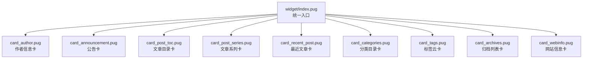
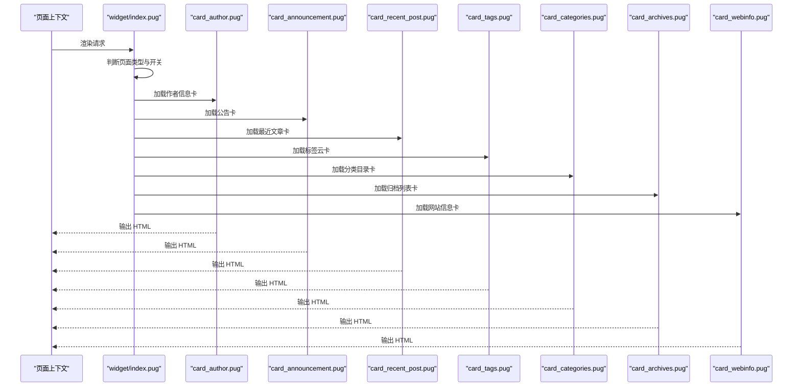
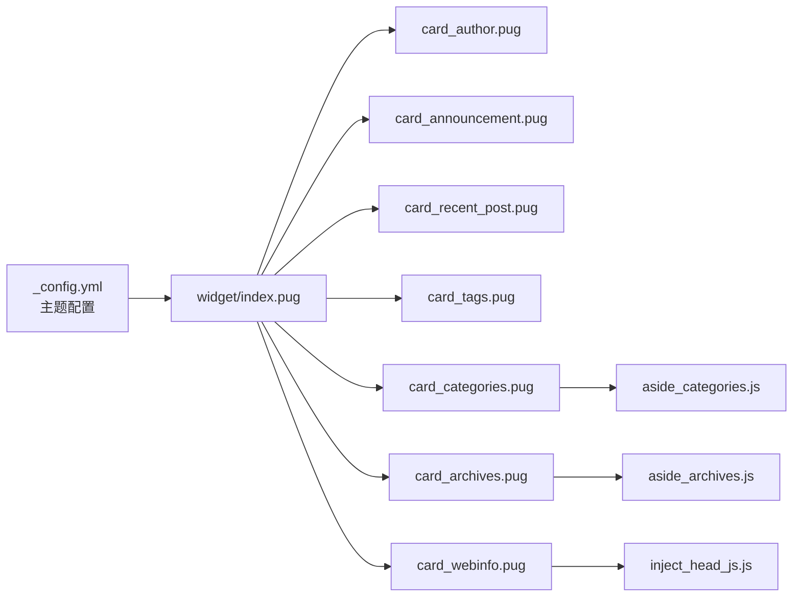

# 小部件组件

<cite>
**本文引用的文件**
- [widget/index.pug](file://themes/butterfly/layout/includes/widget/index.pug)
- [card_author.pug](file://themes/butterfly/layout/includes/widget/card_author.pug)
- [card_announcement.pug](file://themes/butterfly/layout/includes/widget/card_announcement.pug)
- [card_recent_post.pug](file://themes/butterfly/layout/includes/widget/card_recent_post.pug)
- [card_tags.pug](file://themes/butterfly/layout/includes/widget/card_tags.pug)
- [card_categories.pug](file://themes/butterfly/layout/includes/widget/card_categories.pug)
- [card_archives.pug](file://themes/butterfly/layout/includes/widget/card_archives.pug)
- [card_webinfo.pug](file://themes/butterfly/layout/includes/widget/card_webinfo.pug)
- [card_post_toc.pug](file://themes/butterfly/layout/includes/widget/card_post_toc.pug)
- [card_post_series.pug](file://themes/butterfly/layout/includes/widget/card_post_series.pug)
- [_config.yml](file://themes/butterfly/_config.yml)
- [aside_categories.js](file://themes/butterfly/scripts/helpers/aside_categories.js)
- [aside_archives.js](file://themes/butterfly/scripts/helpers/aside_archives.js)
- [inject_head_js.js](file://themes/butterfly/scripts/filters/inject_head_js.js)
</cite>

## 目录
1. [简介](#简介)
2. [项目结构](#项目结构)
3. [核心组件](#核心组件)
4. [架构总览](#架构总览)
5. [详细组件分析](#详细组件分析)
6. [依赖关系分析](#依赖关系分析)
7. [性能考量](#性能考量)
8. [故障排查指南](#故障排查指南)
9. [结论](#结论)
10. [附录](#附录)

## 简介
本文件聚焦于 Hexo 主题 Butterfly 中“侧边栏小部件”（Sidebar Widgets）的实现与使用，覆盖以下卡片类型：作者信息卡、公告卡、最近文章卡、标签云卡、分类目录卡、归档列表卡、网站信息卡等。文档从架构、数据流、配置参数、显示条件、样式定制到组合实践进行系统化梳理，帮助读者快速理解并高效配置这些小部件。

## 项目结构
小部件位于主题布局的 includes/widget 目录下，通过一个统一入口在页面渲染时按需加载。整体组织采用“按需启用 + 条件渲染”的模式，确保只输出用户开启的小部件。

图表来源
- [widget/index.pug:1-36](file://themes/butterfly/layout/includes/widget/index.pug#L1-L36)

章节来源
- [widget/index.pug:1-36](file://themes/butterfly/layout/includes/widget/index.pug#L1-L36)

## 核心组件
- 统一入口与控制流：根据页面类型（文章页或非文章页）决定加载哪些小部件；支持粘性布局与条件开关。
- 模块化设计：每个小部件独立成文件，具备独立的显示条件与渲染逻辑。
- 配置驱动：所有小部件均通过主题配置项控制开关、样式与数据行为。
- 数据来源：主要来自站点数据（如文章、标签、分类、归档），部分数据由脚本辅助生成（如分类树、归档列表）。

章节来源
- [widget/index.pug:1-36](file://themes/butterfly/layout/includes/widget/index.pug#L1-L36)

## 架构总览
小部件的渲染流程分为“入口选择 + 条件渲染 + 数据处理 + 视图输出”。

图表来源
- [widget/index.pug:1-36](file://themes/butterfly/layout/includes/widget/index.pug#L1-L36)
- [card_author.pug:1-27](file://themes/butterfly/layout/includes/widget/card_author.pug#L1-L27)
- [card_announcement.pug:1-6](file://themes/butterfly/layout/includes/widget/card_announcement.pug#L1-L6)
- [card_recent_post.pug:1-27](file://themes/butterfly/layout/includes/widget/card_recent_post.pug#L1-L27)
- [card_tags.pug:1-15](file://themes/butterfly/layout/includes/widget/card_tags.pug#L1-L15)
- [card_categories.pug:1-5](file://themes/butterfly/layout/includes/widget/card_categories.pug#L1-L5)
- [card_archives.pug:1-8](file://themes/butterfly/layout/includes/widget/card_archives.pug#L1-L8)
- [card_webinfo.pug:1-44](file://themes/butterfly/layout/includes/widget/card_webinfo.pug#L1-L44)

## 详细组件分析

### 作者信息卡（card_author）
- 功能概述
  - 展示头像、作者名、个人简介、社交链接入口。
  - 提供文章、标签、分类的数量统计。
  - 可选按钮跳转至自定义链接。
- 显示条件
  - 由主题配置项控制开关。
- 关键配置项
  - 头像图片、错误占位图、描述文本、按钮开关与链接。
  - 社交图标集合由公共 partial 引入。
- 数据来源
  - 站点配置作者名与描述；站点文章/标签/分类总数。
- 样式定制
  - 基于卡片容器类与内联样式的组合，可调整头像尺寸、间距与颜色。
- 最佳实践
  - 在文章页与首页保持一致的作者信息风格；按钮用于引导关注或联系。

章节来源
- [card_author.pug:1-27](file://themes/butterfly/layout/includes/widget/card_author.pug#L1-L27)

### 公告卡（card_announcement）
- 功能概述
  - 展示滚动公告或重要提示，支持富文本内容。
- 显示条件
  - 由主题配置项控制开关。
- 关键配置项
  - 开关、标题文案、公告内容。
- 样式定制
  - 可通过容器类与图标样式进行主题化。

章节来源
- [card_announcement.pug:1-6](file://themes/butterfly/layout/includes/widget/card_announcement.pug#L1-L6)

### 最近文章卡（card_recent_post）
- 功能概述
  - 展示最近文章列表，支持缩略图与发布时间。
- 显示条件
  - 由主题配置项控制开关。
- 关键配置项
  - 文章数量限制、排序方式（创建时间/更新时间）、缩略图开关。
- 数据处理
  - 对站点文章进行排序、截取与遍历输出。
- 样式定制
  - 缩略图占位与错误回退、无封面时的样式标记。
- 最佳实践
  - 合理设置数量与排序，避免信息过载；优先展示高质量文章。

章节来源
- [card_recent_post.pug:1-27](file://themes/butterfly/layout/includes/widget/card_recent_post.pug#L1-L27)

### 标签云卡（card_tags）
- 功能概述
  - 聚合站点标签，按权重/频率生成云状展示。
- 显示条件
  - 由主题配置项控制开关；仅当存在标签时渲染。
- 关键配置项
  - 限制数量、排序字段与方向、是否启用彩色、自定义颜色方案。
- 数据处理
  - 使用云函数生成带字号与颜色的标签云；支持自定义颜色范围。
- 样式定制
  - 字号单位、起止颜色、单位类型均可配置。
- 最佳实践
  - 控制标签数量上限，保证可读性；彩色模式提升视觉层次。

章节来源
- [card_tags.pug:1-15](file://themes/butterfly/layout/includes/widget/card_tags.pug#L1-L15)

### 分类目录卡（card_categories）
- 功能概述
  - 展示分类树形结构，支持展开/折叠与数量统计。
- 显示条件
  - 由主题配置项控制开关；仅当存在分类时渲染。
- 关键配置项
  - 限制数量、展开策略。
- 数据处理
  - 通过辅助脚本生成分类树与统计信息。
- 样式定制
  - 结合树形样式与层级缩进，突出主次关系。
- 最佳实践
  - 合理设置限制与展开策略，避免深层嵌套导致阅读困难。

章节来源
- [card_categories.pug:1-5](file://themes/butterfly/layout/includes/widget/card_categories.pug#L1-L5)
- [aside_categories.js](file://themes/butterfly/scripts/helpers/aside_categories.js)

### 归档列表卡（card_archives）
- 功能概述
  - 按月/年维度展示文章归档，支持排序与数量限制。
- 显示条件
  - 由主题配置项控制开关。
- 关键配置项
  - 类型（月度/年度）、格式、排序方向、数量限制。
- 数据处理
  - 通过辅助脚本生成归档列表与计数。
- 样式定制
  - 格式字符串可本地化，满足不同地区日期习惯。
- 最佳实践
  - 年度归档适合长线站点，月度归档便于日常追踪。

章节来源
- [card_archives.pug:1-8](file://themes/butterfly/layout/includes/widget/card_archives.pug#L1-L8)
- [aside_archives.js](file://themes/butterfly/scripts/helpers/aside_archives.js)

### 网站信息卡（card_webinfo）
- 功能概述
  - 展示站点统计信息，如文章总数、运行时长、字数统计、UV/PV 等。
- 显示条件
  - 由主题配置项控制开关；各子项可独立开关。
- 关键配置项
  - 是否显示文章数、运行天数、字数统计、访客统计（Umami 或不蒜子）、最后推送日期。
- 数据来源
  - 站点数据与第三方统计服务；部分数据通过前端定时刷新。
- 样式定制
  - 使用加载态图标与数值容器，提升交互体验。
- 最佳实践
  - 访客统计建议二选一（Umami 或不蒜子），避免重复统计；运行时长与最后推送日期可作为站点维护状态的可视化指标。

章节来源
- [card_webinfo.pug:1-44](file://themes/butterfly/layout/includes/widget/card_webinfo.pug#L1-L44)

### 文章目录卡（card_post_toc）
- 功能概述
  - 展示当前文章的目录结构，支持展开/折叠与编号显示。
- 显示条件
  - 由页面/主题配置控制开关；加密文章隐藏目录。
- 关键配置项
  - 是否显示编号、默认展开状态。
- 数据处理
  - 基于文章内容生成目录树。
- 样式定制
  - 容器类与展开状态类配合，实现折叠动画与层级缩进。
- 最佳实践
  - 长文建议开启编号与展开；短文可关闭以节省空间。

章节来源
- [card_post_toc.pug:1-15](file://themes/butterfly/layout/includes/widget/card_post_toc.pug#L1-L15)

### 文章系列卡（card_post_series）
- 功能概述
  - 展示同一系列的文章列表，支持缩略图与发布日期。
- 显示条件
  - 由主题配置项控制开关；依赖文章系列分组缓存。
- 关键配置项
  - 标题文案（可使用页面变量）。
- 数据处理
  - 使用片段缓存对系列文章进行分组与渲染。
- 样式定制
  - 缩略图与无封面样式标记保持一致性。
- 最佳实践
  - 系列文章应有明确的主题与顺序，便于读者连贯阅读。

章节来源
- [card_post_series.pug:1-22](file://themes/butterfly/layout/includes/widget/card_post_series.pug#L1-L22)

## 依赖关系分析
- 配置依赖：所有小部件均依赖主题配置项（如开关、样式、数据限制等）。
- 数据依赖：站点数据（文章、标签、分类、归档）与第三方统计服务（Umami/不蒜子）。
- 辅助脚本：分类树与归档列表由专用脚本生成，提升复用性与可维护性。
- 头部注入：部分统计脚本通过头部注入方式加载，确保统计埋点生效。

图表来源
- [widget/index.pug:1-36](file://themes/butterfly/layout/includes/widget/index.pug#L1-L36)
- [_config.yml](file://themes/butterfly/_config.yml)
- [aside_categories.js](file://themes/butterfly/scripts/helpers/aside_categories.js)
- [aside_archives.js](file://themes/butterfly/scripts/helpers/aside_archives.js)
- [inject_head_js.js](file://themes/butterfly/scripts/filters/inject_head_js.js)

章节来源
- [_config.yml](file://themes/butterfly/_config.yml)
- [aside_categories.js](file://themes/butterfly/scripts/helpers/aside_categories.js)
- [aside_archives.js](file://themes/butterfly/scripts/helpers/aside_archives.js)
- [inject_head_js.js](file://themes/butterfly/scripts/filters/inject_head_js.js)

## 性能考量
- 条件渲染：仅在配置开启时渲染对应小部件，减少 DOM 体积。
- 数据截断：为列表类小部件设置合理上限，避免一次性渲染过多节点。
- 缓存机制：系列文章分组使用片段缓存，降低重复计算成本。
- 图片懒加载：缩略图与头像提供错误回退，避免因资源异常阻塞渲染。
- 第三方统计：访客统计采用异步加载与占位符，不影响首屏渲染。

## 故障排查指南
- 小部件未显示
  - 检查对应开关是否开启；确认站点数据是否存在（如标签/分类/文章）。
- 缩略图不显示
  - 检查缩略图开关与资源路径；留意错误回退逻辑。
- 访客统计为空
  - 确认第三方统计服务已正确配置与启用；检查头部注入脚本是否生效。
- 分类/归档异常
  - 检查辅助脚本的参数与返回值；确认站点数据结构与时间格式。
- 目录不显示
  - 检查文章内容是否包含标题；确认加密文章的特殊处理逻辑。

章节来源
- [card_recent_post.pug:1-27](file://themes/butterfly/layout/includes/widget/card_recent_post.pug#L1-L27)
- [card_webinfo.pug:1-44](file://themes/butterfly/layout/includes/widget/card_webinfo.pug#L1-L44)
- [aside_categories.js](file://themes/butterfly/scripts/helpers/aside_categories.js)
- [aside_archives.js](file://themes/butterfly/scripts/helpers/aside_archives.js)
- [inject_head_js.js](file://themes/butterfly/scripts/filters/inject_head_js.js)

## 结论
小部件系统以“配置驱动 + 模块化 + 条件渲染”为核心设计原则，既保证了灵活性，又兼顾了性能与可维护性。通过合理配置与组合使用，可在不同页面形态下呈现一致且丰富的侧边栏信息，提升用户体验与信息密度。

## 附录
- 组合使用建议
  - 首页：作者信息卡 + 公告卡 + 最近文章卡 + 分类目录卡 + 标签云卡 + 归档列表卡 + 网站信息卡。
  - 文章页：作者信息卡 + 公告卡 + 文章目录卡（视长度而定）+ 最近文章卡 + 网站信息卡。
  - 内容较少时，可关闭部分统计类卡片以减轻负担。
- 样式定制要点
  - 使用卡片容器类与层级样式，统一间距与对齐。
  - 为缩略图与头像提供统一的尺寸与圆角策略。
  - 为加载态与错误态提供一致的占位风格。