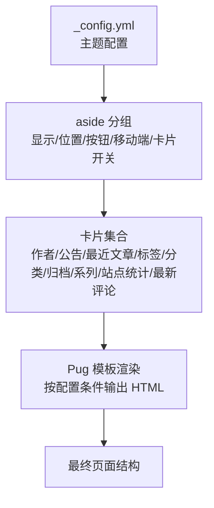
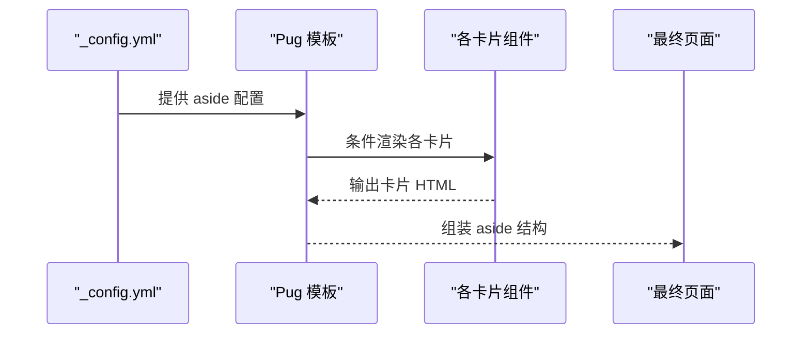
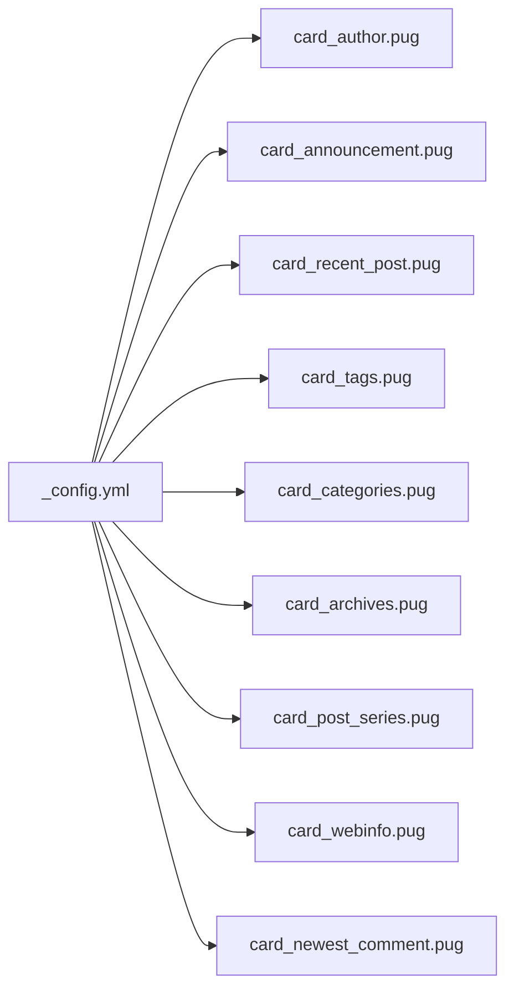

# 布局配置

<cite>
**本文引用的文件**
- [_config.yml](file://themes/butterfly/_config.yml)
- [layout/includes/sidebar.pug](file://themes/butterfly/layout/includes/sidebar.pug)
- [layout/includes/widget/card_author.pug](file://themes/butterfly/layout/includes/widget/card_author.pug)
- [layout/includes/widget/card_announcement.pug](file://themes/butterfly/layout/includes/widget/card_announcement.pug)
- [layout/includes/widget/card_recent_post.pug](file://themes/butterfly/layout/includes/widget/card_recent_post.pug)
- [layout/includes/widget/card_categories.pug](file://themes/butterfly/layout/includes/widget/card_categories.pug)
- [layout/includes/widget/card_tags.pug](file://themes/butterfly/layout/includes/widget/card_tags.pug)
- [layout/includes/widget/card_archives.pug](file://themes/butterfly/layout/includes/widget/card_archives.pug)
- [layout/includes/widget/card_post_series.pug](file://themes/butterfly/layout/includes/widget/card_post_series.pug)
- [layout/includes/widget/card_webinfo.pug](file://themes/butterfly/layout/includes/widget/card_webinfo.pug)
- [layout/includes/widget/card_newest_comment.pug](file://themes/butterfly/layout/includes/widget/card_newest_comment.pug)
</cite>

## 目录
1. [简介](#简介)
2. [项目结构](#项目结构)
3. [核心组件](#核心组件)
4. [架构总览](#架构总览)
5. [详细组件分析](#详细组件分析)
6. [依赖关系分析](#依赖关系分析)
7. [性能考量](#性能考量)
8. [故障排查指南](#故障排查指南)
9. [结论](#结论)
10. [附录](#附录)

## 简介
本文件系统性梳理 Butterfly 主题的布局配置，重点围绕 aside 侧边栏的显示位置、隐藏按钮、移动端适配以及各类侧边栏卡片（作者信息、公告、最近文章、标签云、分类目录、归档列表、系列文章、站点统计、最新评论）的启用与参数配置进行深入解析。同时覆盖主页文章布局模式的选择与配置方法，并提供移动端布局的特殊配置与响应式行为说明，帮助读者完成完整且可复现的布局定制。

## 项目结构
本主题采用 Pug 模板与 Stylus 样式组织页面结构，侧边栏相关内容主要分布在以下位置：
- 主题配置：_config.yml
- 侧边栏入口与菜单：layout/includes/sidebar.pug
- 各侧边栏卡片：layout/includes/widget/*.pug

图表来源
- [_config.yml](file://themes/butterfly/_config.yml)
- [layout/includes/sidebar.pug](file://themes/butterfly/layout/includes/sidebar.pug)

章节来源
- [_config.yml:271-357](file://themes/butterfly/_config.yml#L271-L357)
- [layout/includes/sidebar.pug:1-18](file://themes/butterfly/layout/includes/sidebar.pug#L1-L18)

## 核心组件
- aside 侧边栏总开关与基础行为
  - 总开关、是否隐藏、底部隐藏按钮、移动端显示、显示位置（左/右）、主页卡片显示清单
- 卡片组件
  - 作者卡片、公告卡片、最近文章、标签云、分类目录、归档列表、系列文章、站点统计、最新评论
- 主页文章布局模式
  - 多种封面与信息排列方式，支持封面默认图、限制长度等

章节来源
- [_config.yml:271-357](file://themes/butterfly/_config.yml#L271-L357)
- [_config.yml:170-189](file://themes/butterfly/_config.yml#L170-L189)

## 架构总览
下图展示了 aside 侧边栏在页面中的装配流程：主题配置驱动模板渲染，模板根据开关与参数决定输出哪些卡片与结构。

图表来源
- [_config.yml:271-357](file://themes/butterfly/_config.yml#L271-L357)
- [layout/includes/widget/card_author.pug:1-27](file://themes/butterfly/layout/includes/widget/card_author.pug#L1-L27)
- [layout/includes/widget/card_announcement.pug:1-6](file://themes/butterfly/layout/includes/widget/card_announcement.pug#L1-L6)
- [layout/includes/widget/card_recent_post.pug:1-27](file://themes/butterfly/layout/includes/widget/card_recent_post.pug#L1-L27)
- [layout/includes/widget/card_tags.pug:1-15](file://themes/butterfly/layout/includes/widget/card_tags.pug#L1-L15)
- [layout/includes/widget/card_categories.pug:1-5](file://themes/butterfly/layout/includes/widget/card_categories.pug#L1-L5)
- [layout/includes/widget/card_archives.pug:1-8](file://themes/butterfly/layout/includes/widget/card_archives.pug#L1-L8)
- [layout/includes/widget/card_post_series.pug:1-22](file://themes/butterfly/layout/includes/widget/card_post_series.pug#L1-L22)
- [layout/includes/widget/card_webinfo.pug:1-44](file://themes/butterfly/layout/includes/widget/card_webinfo.pug#L1-L44)
- [layout/includes/widget/card_newest_comment.pug:1-8](file://themes/butterfly/layout/includes/widget/card_newest_comment.pug#L1-L8)

## 详细组件分析

### aside 侧边栏总览与基础配置
- 显示控制
  - 总开关：控制 aside 是否渲染
  - 隐藏状态：初始是否隐藏
  - 底部隐藏按钮：是否显示“隐藏 aside”的悬浮按钮
  - 移动端显示：移动端是否显示 aside
  - 显示位置：左侧或右侧
  - 主页卡片显示清单：仅在首页显示指定卡片
- 影响范围
  - 控制 aside 的可见性、交互与布局方向
  - 与主页文章布局模式共同决定首页整体结构

章节来源
- [_config.yml:271-357](file://themes/butterfly/_config.yml#L271-L357)

### 作者卡片（card_author）
- 功能要点
  - 展示头像、作者名、个人描述
  - 展示文章数、标签数、分类数
  - 可选“关注”按钮与社交图标区域
- 关键参数
  - enable：启用/禁用
  - description：描述文本
  - button.enable/button.icon/button.text/button.link：关注按钮的启用、图标、文案与链接
- 渲染逻辑
  - 通过模板条件判断与变量拼接实现
  - 支持头像错误回退与社交模块局部渲染

章节来源
- [_config.yml:286-294](file://themes/butterfly/_config.yml#L286-L294)
- [layout/includes/widget/card_author.pug:1-27](file://themes/butterfly/layout/includes/widget/card_author.pug#L1-L27)

### 公告卡片（card_announcement）
- 功能要点
  - 展示站点公告内容
- 关键参数
  - enable：启用/禁用
  - content：公告文本
- 渲染逻辑
  - 使用国际化文案标题与富文本内容

章节来源
- [_config.yml:295-297](file://themes/butterfly/_config.yml#L295-L297)
- [layout/includes/widget/card_announcement.pug:1-6](file://themes/butterfly/layout/includes/widget/card_announcement.pug#L1-L6)

### 最近文章（card_recent_post）
- 功能要点
  - 展示最近文章列表，支持封面缩略图
- 关键参数
  - enable：启用/禁用
  - limit：显示数量（0 表示全部）
  - sort：排序依据（创建时间/更新时间）
- 渲染逻辑
  - 对文章集合按字段降序排序，截取 limit
  - 封面类型支持图片与纯色背景，错误时回退到占位图
  - 日期显示支持创建/更新两种模式

章节来源
- [_config.yml:298-303](file://themes/butterfly/_config.yml#L298-L303)
- [layout/includes/widget/card_recent_post.pug:1-27](file://themes/butterfly/layout/includes/widget/card_recent_post.pug#L1-L27)

### 标签云（card_tags）
- 功能要点
  - 展示标签云，支持彩色与自定义颜色
- 关键参数
  - enable：启用/禁用
  - limit：显示数量（0 表示全部）
  - color：是否启用彩色
  - custom_colors：自定义颜色映射
  - orderby：排序方式（随机/名称/长度）
  - order：升序/降序
- 渲染逻辑
  - 根据 color 决定使用带颜色的云或通用云组件
  - 支持自定义颜色与排序规则

章节来源
- [_config.yml:318-328](file://themes/butterfly/_config.yml#L318-L328)
- [layout/includes/widget/card_tags.pug:1-15](file://themes/butterfly/layout/includes/widget/card_tags.pug#L1-L15)

### 分类目录（card_categories）
- 功能要点
  - 展示分类列表
- 关键参数
  - enable：启用/禁用
  - limit：显示数量（0 表示全部）
  - expand：展开策略（none/布尔值）
- 渲染逻辑
  - 调用辅助函数生成分类树形结构（展开/折叠）

章节来源
- [_config.yml:311-318](file://themes/butterfly/_config.yml#L311-L318)
- [layout/includes/widget/card_categories.pug:1-5](file://themes/butterfly/layout/includes/widget/card_categories.pug#L1-L5)

### 归档列表（card_archives）
- 功能要点
  - 展示文章归档（按月/年）
- 关键参数
  - enable：启用/禁用
  - type：归档粒度（monthly/yearly）
  - format：格式化字符串
  - order：升序/降序
  - limit：显示数量（0 表示全部）
- 渲染逻辑
  - 调用辅助函数生成归档列表

章节来源
- [_config.yml:329-339](file://themes/butterfly/_config.yml#L329-L339)
- [layout/includes/widget/card_archives.pug:1-8](file://themes/butterfly/layout/includes/widget/card_archives.pug#L1-L8)

### 系列文章（card_post_series）
- 功能要点
  - 展示当前文章所属系列的文章列表
- 关键参数
  - enable：启用/禁用
  - series_title：是否以系列名作为标题
  - orderBy：排序字段（标题/日期）
  - order：升序/降序
- 渲染逻辑
  - 使用片段缓存分组数据
  - 遍历当前系列文章并输出列表项（含封面与日期）

章节来源
- [_config.yml:340-348](file://themes/butterfly/_config.yml#L340-L348)
- [layout/includes/widget/card_post_series.pug:1-22](file://themes/butterfly/layout/includes/widget/card_post_series.pug#L1-L22)

### 站点统计（card_webinfo）
- 功能要点
  - 展示站点统计信息（文章数、运行时长、字数统计、UV/PV、最后推送时间等）
- 关键参数
  - enable：启用/禁用
  - post_count：显示文章总数
  - last_push_date：显示最后推送时间
  - runtime_date：显示运行时长（需提供发布日期）
- 渲染逻辑
  - 条件显示各项指标；部分指标依赖插件（如统计服务）与脚本动态填充

章节来源
- [_config.yml:348-357](file://themes/butterfly/_config.yml#L348-L357)
- [layout/includes/widget/card_webinfo.pug:1-44](file://themes/butterfly/layout/includes/widget/card_webinfo.pug#L1-L44)

### 最新评论（card_newest_comments）
- 功能要点
  - 展示最新评论摘要（部分评论系统可用）
- 关键参数
  - enable：启用/禁用
  - limit：显示数量
  - storage：缓存时间（分钟）
  - avatar：是否显示头像
- 渲染逻辑
  - 仅在满足条件时渲染卡片；部分评论系统不支持该卡片

章节来源
- [_config.yml:304-311](file://themes/butterfly/_config.yml#L304-L311)
- [layout/includes/widget/card_newest_comment.pug:1-8](file://themes/butterfly/layout/includes/widget/card_newest_comment.pug#L1-L8)

### 主页文章布局模式
- 模式说明
  - 支持多种封面与信息排列方式（左/右交替、顶部信息、封面信息叠加、瀑布流等）
- 关键参数
  - index_layout：布局模式编号
  - index_post_content.method：主页摘要显示策略（描述/自动摘要/两者）
  - index_post_content.length：摘要长度
  - cover.aside_enable：是否在侧边栏卡片中显示封面
- 渲染逻辑
  - 不同模式影响文章块的排版与交互体验

章节来源
- [_config.yml:170-189](file://themes/butterfly/_config.yml#L170-L189)
- [_config.yml:98-106](file://themes/butterfly/_config.yml#L98-L106)

### 移动端布局与响应式行为
- aside 移动端显示
  - mobile：移动端是否显示 aside
- aside 位置与隐藏
  - position：左侧/右侧
  - button：底部隐藏按钮
  - hide：初始隐藏状态
- 侧边栏菜单入口
  - 侧边栏入口与菜单项由模板统一渲染，支持移动端抽屉式交互

章节来源
- [_config.yml:271-357](file://themes/butterfly/_config.yml#L271-L357)
- [layout/includes/sidebar.pug:1-18](file://themes/butterfly/layout/includes/sidebar.pug#L1-L18)

## 依赖关系分析
- 配置到模板的依赖
  - 侧边栏卡片均通过 Pug 模板内的条件判断渲染，依赖主题配置中的对应开关与参数
- 卡片间耦合
  - 各卡片相互独立，仅共享基础样式与容器结构
- 外部依赖
  - 站点统计中的 UV/PV 可能依赖第三方统计服务或插件
  - 最新评论卡片对评论系统的兼容性有限制

图表来源
- [_config.yml:271-357](file://themes/butterfly/_config.yml#L271-L357)
- [layout/includes/widget/*.pug](file://themes/butterfly/layout/includes/widget/card_author.pug)

## 性能考量
- 卡片渲染
  - 限制显示数量（limit）可减少 DOM 节点与循环开销
  - 标签云与分类树的排序与过滤应在合理范围内
- 封面加载
  - 封面图错误回退与懒加载策略可降低失败请求与首屏阻塞
- 统计与评论
  - 动态统计与评论加载建议延迟初始化，避免阻塞主流程

## 故障排查指南
- 卡片未显示
  - 检查对应 enable 开关是否开启
  - 检查首页卡片清单 display 中是否包含该卡片
- 封面不显示
  - 检查 cover.aside_enable 是否为 true
  - 检查文章 front-matter 中 cover 字段与类型
- 标签云无颜色
  - 检查 color 开关与自定义颜色配置
- 归档/分类为空
  - 检查 limit 设置是否过大导致截断
  - 检查 expand 展开策略
- 最新评论不可用
  - 检查所选评论系统是否支持该卡片
- 移动端 aside 不显示
  - 检查 mobile 开关与 position 设置

章节来源
- [_config.yml:271-357](file://themes/butterfly/_config.yml#L271-L357)
- [layout/includes/widget/card_recent_post.pug:1-27](file://themes/butterfly/layout/includes/widget/card_recent_post.pug#L1-L27)
- [layout/includes/widget/card_tags.pug:1-15](file://themes/butterfly/layout/includes/widget/card_tags.pug#L1-L15)
- [layout/includes/widget/card_categories.pug:1-5](file://themes/butterfly/layout/includes/widget/card_categories.pug#L1-L5)
- [layout/includes/widget/card_archives.pug:1-8](file://themes/butterfly/layout/includes/widget/card_archives.pug#L1-L8)
- [layout/includes/widget/card_newest_comment.pug:1-8](file://themes/butterfly/layout/includes/widget/card_newest_comment.pug#L1-L8)

## 结论
通过主题配置与 Pug 模板的配合，Butterfly 提供了灵活而强大的 aside 侧边栏布局能力。合理设置 aside 的显示与位置、启用合适的卡片、并结合主页布局模式与移动端策略，可以快速构建符合需求的阅读体验。建议在实际部署前先以最小化配置验证关键路径，再逐步扩展功能。

## 附录

### 布局定制示例与效果说明（步骤化）
- 示例一：精简作者信息 + 标签云 + 归档
  - 步骤
    - 打开 aside.enable 与 aside.mobile
    - 在 aside.display 中保留 tag 与 archive
    - 关闭其他卡片（如 recent_post、categories、webinfo、newest_comment）
    - 设置 aside.position 为右侧
  - 效果
    - 侧边栏仅保留作者信息、标签云与归档，界面更清爽
- 示例二：左侧布局 + 瀑布流主页
  - 步骤
    - aside.position 设为 left
    - index_layout 设为 6 或 7（瀑布流）
    - 适当提高 index_post_content.length 以提升信息密度
  - 效果
    - 左侧导航 + 流畅的瀑布流阅读体验
- 示例三：移动端优先
  - 步骤
    - aside.mobile 设为 true
    - aside.button 设为 true，便于快速隐藏
    - 在 aside.display 中仅保留必要卡片
  - 效果
    - 移动端占用空间更小，交互更便捷

章节来源
- [_config.yml:271-357](file://themes/butterfly/_config.yml#L271-L357)
- [_config.yml:170-189](file://themes/butterfly/_config.yml#L170-L189)