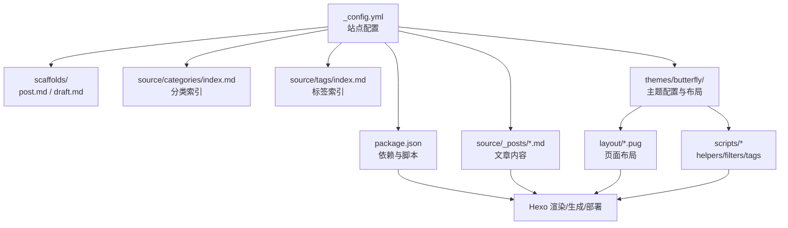
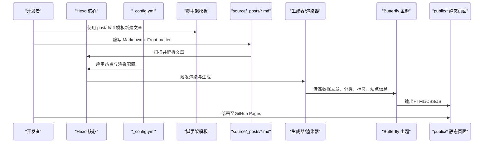
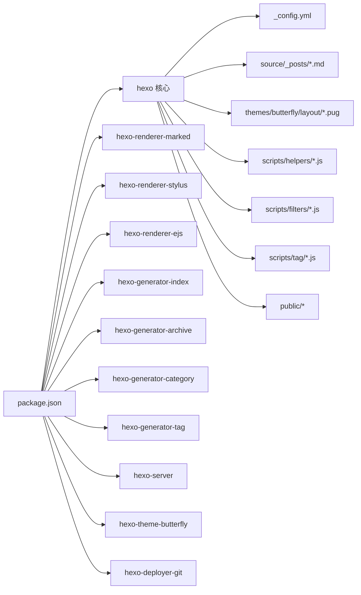

# 内容管理

<cite>
**本文引用的文件**
- [_config.yml](file://_config.yml)
- [package.json](file://package.json)
- [themes/butterfly/_config.yml](file://themes/butterfly/_config.yml)
- [scaffolds/post.md](file://scaffolds/post.md)
- [scaffolds/draft.md](file://scaffolds/draft.md)
- [themes/butterfly/layout/post.pug](file://themes/butterfly/layout/post.pug)
- [themes/butterfly/layout/index.pug](file://themes/butterfly/layout/index.pug)
- [themes/butterfly/scripts/helpers/aside_categories.js](file://themes/butterfly/scripts/helpers/aside_categories.js)
- [themes/butterfly/scripts/helpers/getArchiveLength.js](file://themes/butterfly/scripts/helpers/getArchiveLength.js)
- [themes/butterfly/scripts/filters/post_lazyload.js](file://themes/butterfly/scripts/filters/post_lazyload.js)
- [themes/butterfly/scripts/tag/note.js](file://themes/butterfly/scripts/tag/note.js)
- [source/categories/index.md](file://source/categories/index.md)
- [source/tags/index.md](file://source/tags/index.md)
- [source/_posts/Vscode-Github-Copilot接入MATLAB.md](file://source/_posts/Vscode-Github-Copilot接入MATLAB.md)
- [source/_posts/Windows系统如何删除nul文件.md](file://source/_posts/Windows系统如何删除nul文件.md)
</cite>

## 目录
1. [简介](#简介)
2. [项目结构](#项目结构)
3. [核心组件](#核心组件)
4. [架构总览](#架构总览)
5. [详细组件分析](#详细组件分析)
6. [依赖关系分析](#依赖关系分析)
7. [性能考量](#性能考量)
8. [故障排查指南](#故障排查指南)
9. [结论](#结论)
10. [附录](#附录)

## 简介
本文件面向dzc-blog的内容管理系统，围绕Hexo的内容创作与发布流程进行系统化说明。重点覆盖以下方面：
- Front-matter元数据配置与文章组织结构
- Markdown语法支持与图片/附件处理
- 分类与标签体系的使用与维护
- 文章模板（草稿/正式）与发布规范
- 内容渲染管道、URL生成规则与SEO相关配置
- 主题层对文章展示、导航、懒加载等能力的支持
- 实际代码路径示例与最佳实践建议

## 项目结构
该仓库采用标准Hexo站点结构，结合Butterfly主题实现内容渲染与页面展示。关键目录与文件职责如下：
- 根配置：站点基础配置、URL规则、分页、部署等
- 脚手架：post与draft模板，统一生成Front-matter字段
- 源内容：文章位于source/_posts，分类/标签索引页位于source/categories与source/tags
- 主题：Butterfly主题，包含布局、样式、脚本扩展与过滤器
- 依赖：通过package.json声明Hexo核心与渲染器、生成器、主题、部署器等

图表来源
- [_config.yml:1-107](file://_config.yml#L1-L107)
- [package.json:1-29](file://package.json#L1-L29)
- [scaffolds/post.md:1-7](file://scaffolds/post.md#L1-L7)
- [scaffolds/draft.md:1-5](file://scaffolds/draft.md#L1-L5)
- [source/_posts/Vscode-Github-Copilot接入MATLAB.md](file://source/_posts/Vscode-Github-Copilot接入MATLAB.md)
- [source/_posts/Windows系统如何删除nul文件.md](file://source/_posts/Windows系统如何删除nul文件.md)
- [source/categories/index.md:1-7](file://source/categories/index.md#L1-L7)
- [source/tags/index.md](file://source/tags/index.md)
- [themes/butterfly/_config.yml:1-800](file://themes/butterfly/_config.yml#L1-L800)
- [themes/butterfly/layout/post.pug:1-36](file://themes/butterfly/layout/post.pug#L1-L36)
- [themes/butterfly/layout/index.pug:1-5](file://themes/butterfly/layout/index.pug#L1-L5)
- [themes/butterfly/scripts/helpers/aside_categories.js:1-101](file://themes/butterfly/scripts/helpers/aside_categories.js#L1-L101)
- [themes/butterfly/scripts/helpers/getArchiveLength.js:1-47](file://themes/butterfly/scripts/helpers/getArchiveLength.js#L1-L47)
- [themes/butterfly/scripts/filters/post_lazyload.js:1-41](file://themes/butterfly/scripts/filters/post_lazyload.js#L1-L41)
- [themes/butterfly/scripts/tag/note.js:1-28](file://themes/butterfly/scripts/tag/note.js#L1-L28)

章节来源
- [_config.yml:1-107](file://_config.yml#L1-L107)
- [package.json:1-29](file://package.json#L1-L29)

## 核心组件
- 站点配置与URL规则
  - 站点标题、副标题、关键词、语言与时区
  - URL与永久链接规则、美化链接开关
  - 目录结构：source_dir、public_dir、归档/分类/标签目录
  - 写作参数：新文章命名、默认布局、外链打开方式、草稿渲染开关、资源文件夹开关
  - 高亮与排版：代码高亮、行号、自动检测、PrismJS设置
  - 首页分页与排序：每页数量、排序字段
  - 默认分类/标签映射
  - 更新时间策略：mtime/date/empty
  - 分页目录、包含/排除规则、忽略列表
  - 主题与部署：主题名、Git部署仓库与分支

- 渲染与生成
  - 渲染器：marked、stylus、ejs
  - 生成器：index、archive、category、tag
  - 服务器：本地开发服务

- 主题配置（Butterfly）
  - 导航、Logo、固定导航
  - 代码块主题、工具栏、Mac样式、高度限制、换行
  - 图标、头像、Banner图、背景、封面图
  - 文章元信息：首页/文章页日期类型、格式、分类/标签显示
  - 侧边栏卡片：作者、公告、近期文章、最新评论、分类、标签、归档、系列
  - 页脚、阅读模式、深色模式、底部按钮
  - 数学公式、搜索、分享、评论系统（多方案）、分析统计、广告位、站点验证

章节来源
- [_config.yml:5-107](file://_config.yml#L5-L107)
- [package.json:14-26](file://package.json#L14-L26)
- [themes/butterfly/_config.yml:1-800](file://themes/butterfly/_config.yml#L1-L800)

## 架构总览
下图展示了从内容到页面的端到端流程：Hexo读取配置与脚手架模板，扫描source/_posts中的Markdown文章，依据Front-matter与配置生成静态页面，并由Butterfly主题布局与脚本扩展完成最终输出。

图表来源
- [_config.yml:34-56](file://_config.yml#L34-L56)
- [package.json:14-26](file://package.json#L14-L26)
- [scaffolds/post.md:1-7](file://scaffolds/post.md#L1-L7)
- [scaffolds/draft.md:1-5](file://scaffolds/draft.md#L1-L5)
- [themes/butterfly/layout/post.pug:1-36](file://themes/butterfly/layout/post.pug#L1-L36)
- [themes/butterfly/layout/index.pug:1-5](file://themes/butterfly/layout/index.pug#L1-L5)

## 详细组件分析

### Front-matter 元数据与文章组织
- 模板字段
  - post模板包含title、date、tags、categories字段，便于统一初始化
  - draft模板包含title、date、tags，适合先保存草稿再完善
- 组织结构
  - 文章统一存放于source/_posts，按需可按子目录组织
  - 分类与标签索引页分别在source/categories与source/tags
- 发布流程
  - 新建：使用脚手架模板生成初始Front-matter
  - 草稿：草稿不参与渲染（render_drafts=false），完成后补充字段并移动或重命名
  - 正式：确保Front-matter完整，提交后触发生成与部署

章节来源
- [scaffolds/post.md:1-7](file://scaffolds/post.md#L1-L7)
- [scaffolds/draft.md:1-5](file://scaffolds/draft.md#L1-L5)
- [_config.yml:42-43](file://_config.yml#L42-L43)
- [source/categories/index.md:1-7](file://source/categories/index.md#L1-L7)
- [source/tags/index.md](file://source/tags/index.md)

### Markdown 语法支持与图片/附件处理
- 渲染器
  - 使用marked渲染器，支持标准Markdown语法
- 代码高亮
  - highlight.js与PrismJS双通道，可选择其一或同时启用
  - 行号、自动检测、制表符替换、包裹开关
- 图片懒加载
  - 主题提供懒加载过滤器，支持全局或仅文章页
  - 支持原生loading=lazy或占位图替换两种策略
- 自定义标签与富文本
  - note/subnote标签用于提示性内容，支持多种样式与图标

章节来源
- [_config.yml:46-56](file://_config.yml#L46-L56)
- [themes/butterfly/scripts/filters/post_lazyload.js:1-41](file://themes/butterfly/scripts/filters/post_lazyload.js#L1-L41)
- [themes/butterfly/scripts/tag/note.js:1-28](file://themes/butterfly/scripts/tag/note.js#L1-L28)

### 分类系统与标签体系
- 分类
  - 侧边栏分类卡片通过辅助函数生成，支持层级展开、计数显示、排序与限制
  - 分类页布局由主题提供，支持自定义Banner图
- 标签
  - 标签页索引页存在，主题提供标签卡片与颜色配置
  - 标签云支持随机/名称/长度等排序方式
- 默认分类
  - 未指定分类时归入默认分类（uncategorized）

章节来源
- [themes/butterfly/scripts/helpers/aside_categories.js:1-101](file://themes/butterfly/scripts/helpers/aside_categories.js#L1-L101)
- [themes/butterfly/_config.yml:318-328](file://themes/butterfly/_config.yml#L318-L328)
- [source/categories/index.md:1-7](file://source/categories/index.md#L1-L7)
- [source/tags/index.md](file://source/tags/index.md)
- [_config.yml:68-70](file://_config.yml#L68-L70)

### 文章模板与发布规范
- 模板使用
  - 使用脚手架模板快速生成文章骨架，减少重复配置
- 草稿管理
  - render_drafts=false表示草稿不参与生成；可在本地开启草稿预览后再发布
- 发布规范
  - 填充title、date、tags、categories等必要字段
  - 合理规划Front-matter以配合主题展示（如meta、top_img等）
  - 提交前检查链接、图片路径与高亮配置

章节来源
- [_config.yml:42-43](file://_config.yml#L42-L43)
- [scaffolds/post.md:1-7](file://scaffolds/post.md#L1-L7)
- [scaffolds/draft.md:1-5](file://scaffolds/draft.md#L1-L5)

### 内容渲染管道与URL生成
- 渲染阶段
  - marked负责Markdown到HTML
  - PrismJS/highlight.js负责代码高亮
  - EJS/Stylus负责主题模板与样式编译
- 生成阶段
  - index/archive/category/tag生成器产出对应页面
  - 主题布局（post.pug、index.pug等）消费数据并输出页面
- URL规则
  - permalink规则：:year/:month/:day/:title/
  - pretty_urls控制是否移除尾部index.html与.html
  - 分页目录：page
- 更新时间策略
  - updated_option支持mtime/date/empty，影响页面更新时间展示

章节来源
- [_config.yml:14-21](file://_config.yml#L14-L21)
- [_config.yml:62-65](file://_config.yml#L62-L65)
- [_config.yml:80-83](file://_config.yml#L80-L83)
- [package.json:17-24](file://package.json#L17-L24)
- [themes/butterfly/layout/post.pug:1-36](file://themes/butterfly/layout/post.pug#L1-L36)
- [themes/butterfly/layout/index.pug:1-5](file://themes/butterfly/layout/index.pug#L1-L5)

### SEO与页面元信息
- 站点元信息
  - title、subtitle、description、keywords、author、language
  - meta_generator开关控制是否注入generator meta
- 结构化数据与Open Graph
  - 主题包含head与结构化数据片段，便于搜索引擎识别
- 外链行为
  - 外链在新窗口打开，提升用户体验与安全性

章节来源
- [_config.yml:5-12](file://_config.yml#L5-L12)
- [_config.yml:72-74](file://_config.yml#L72-L74)
- [themes/butterfly/layout/includes/head.pug](file://themes/butterfly/layout/includes/head.pug)
- [themes/butterfly/layout/includes/head/structured_data.pug](file://themes/butterfly/layout/includes/head/structured_data.pug)
- [themes/butterfly/layout/includes/head/Open_Graph.pug](file://themes/butterfly/layout/includes/head/Open_Graph.pug)
- [_config.yml:37-40](file://_config.yml#L37-L40)

### 主题布局与展示逻辑
- 文章页布局
  - post.pug负责文章容器、过期提醒、版权、标签分享、打赏、分页、相关文章、评论等模块
- 首页布局
  - index.pug引入mixins实现不同布局风格与摘要展示
- 侧边栏与卡片
  - 分类、标签、归档、近期文章等卡片通过辅助函数动态生成

章节来源
- [themes/butterfly/layout/post.pug:1-36](file://themes/butterfly/layout/post.pug#L1-L36)
- [themes/butterfly/layout/index.pug:1-5](file://themes/butterfly/layout/index.pug#L1-L5)
- [themes/butterfly/scripts/helpers/aside_categories.js:1-101](file://themes/butterfly/scripts/helpers/aside_categories.js#L1-L101)

### 归档与统计
- 归档长度辅助函数
  - 根据年/月/日维度统计当前页面的博文数量，支持yearly/monthly/daily开关
- 侧边栏归档
  - 支持按月/年类型、格式化字符串与排序

章节来源
- [themes/butterfly/scripts/helpers/getArchiveLength.js:1-47](file://themes/butterfly/scripts/helpers/getArchiveLength.js#L1-L47)
- [themes/butterfly/_config.yml:329-339](file://themes/butterfly/_config.yml#L329-L339)

## 依赖关系分析
- Hexo核心与插件
  - 核心版本与渲染器、生成器、服务器、主题、部署器均在package.json中声明
- 主题与脚本
  - 主题配置集中于themes/butterfly/_config.yml
  - 辅助函数与过滤器位于scripts/helpers与scripts/filters
  - 标签扩展位于scripts/tag
- 页面与数据流
  - 文章数据经生成器与渲染器进入主题布局，最终输出静态页面

图表来源
- [package.json:14-26](file://package.json#L14-L26)
- [_config.yml:96-107](file://_config.yml#L96-L107)
- [themes/butterfly/_config.yml:1-800](file://themes/butterfly/_config.yml#L1-L800)

章节来源
- [package.json:1-29](file://package.json#L1-L29)

## 性能考量
- 图片懒加载
  - 在站点或文章级启用懒加载，降低首屏带宽与CPU占用
- 代码高亮
  - 合理选择highlight.js或PrismJS，避免同时开启造成体积增大
- 分页与摘要
  - 首页摘要长度与分页数量影响加载性能，建议根据内容密度调整
- 静态资源
  - 利用主题提供的CDN与缓存策略，减少外部依赖

## 故障排查指南
- 文章未出现在首页/分类/标签页
  - 检查Front-matter字段是否完整（title、date、categories、tags）
  - 确认render_drafts与post_asset_folder配置符合预期
- 分类/标签卡片为空
  - 确认分类/标签索引页存在且Front-matter包含type与layout
- URL异常或404
  - 检查permalink与pretty_urls配置，确认部署分支与repo地址正确
- 图片加载缓慢
  - 开启懒加载过滤器，或使用CDN托管图片
- 评论/统计/广告未生效
  - 检查主题配置中对应模块的开关与参数

章节来源
- [_config.yml:14-21](file://_config.yml#L14-L21)
- [_config.yml:42-43](file://_config.yml#L42-L43)
- [themes/butterfly/_config.yml:530-660](file://themes/butterfly/_config.yml#L530-L660)
- [themes/butterfly/scripts/filters/post_lazyload.js:1-41](file://themes/butterfly/scripts/filters/post_lazyload.js#L1-L41)
- [source/categories/index.md:1-7](file://source/categories/index.md#L1-L7)

## 结论
本仓库基于Hexo与Butterfly主题构建了完整的静态博客内容管理体系。通过标准化的Front-matter模板、清晰的分类/标签体系、完善的渲染与生成流程，以及主题层的丰富展示能力，能够高效支撑内容创作与发布。建议在实际使用中结合自身需求调整主题配置与生成参数，持续优化SEO与性能表现。

## 附录
- 示例文章路径
  - [Vscode-Github-Copilot接入MATLAB.md](file://source/_posts/Vscode-Github-Copilot接入MATLAB.md)
  - [Windows系统如何删除nul文件.md](file://source/_posts/Windows系统如何删除nul文件.md)
- 分类与标签索引页
  - [categories/index.md:1-7](file://source/categories/index.md#L1-L7)
  - [tags/index.md](file://source/tags/index.md)