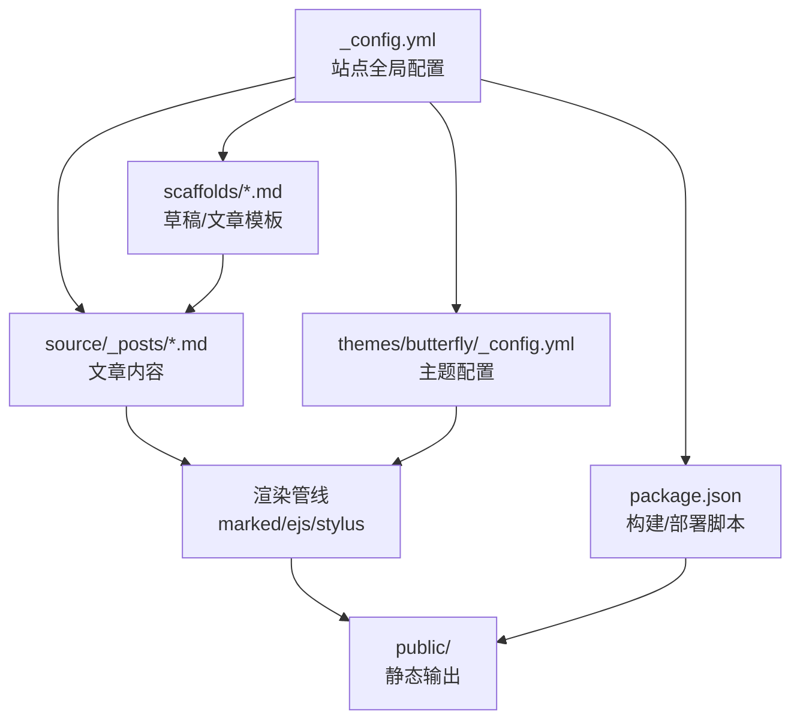
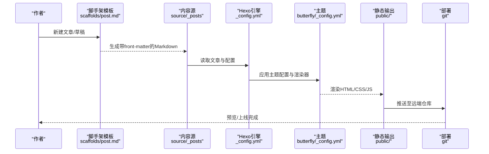
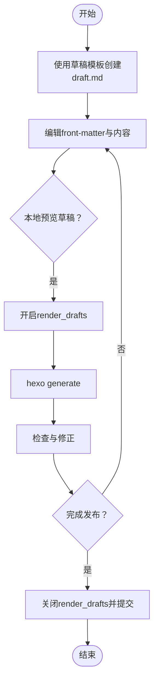
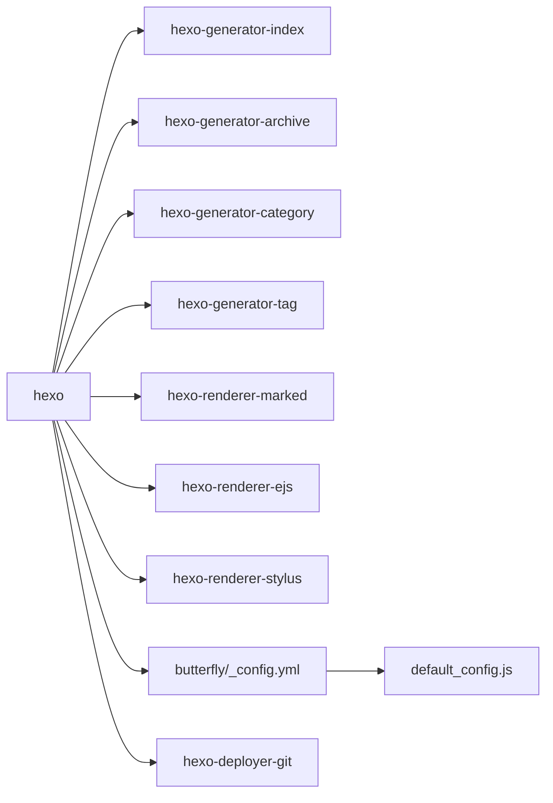

# 内容组织与管理

<cite>
**本文引用的文件**
- [_config.yml](file://_config.yml)
- [package.json](file://package.json)
- [scaffolds/draft.md](file://scaffolds/draft.md)
- [scaffolds/post.md](file://scaffolds/post.md)
- [source/_posts/Vscode-Github-Copilot接入MATLAB.md](file://source/_posts/Vscode-Github-Copilot接入MATLAB.md)
- [source/_posts/Windows系统如何删除nul文件.md](file://source/_posts/Windows系统如何删除nul文件.md)
- [source/categories/index.md](file://source/categories/index.md)
- [source/tags/index.md](file://source/tags/index.md)
- [themes/butterfly/_config.yml](file://themes/butterfly/_config.yml)
- [themes/butterfly/languages/zh-CN.yml](file://themes/butterfly/languages/zh-CN.yml)
- [themes/butterfly/scripts/common/default_config.js](file://themes/butterfly/scripts/common/default_config.js)
- [.gitignore](file://.gitignore)
- [.github/dependabot.yml](file://.github/dependabot.yml)
</cite>

## 目录
1. [简介](#简介)
2. [项目结构](#项目结构)
3. [核心组件](#核心组件)
4. [架构总览](#架构总览)
5. [详细组件分析](#详细组件分析)
6. [依赖关系分析](#依赖关系分析)
7. [性能考量](#性能考量)
8. [故障排查指南](#故障排查指南)
9. [结论](#结论)
10. [附录](#附录)

## 简介
本文件面向dzc-blog的内容组织与管理，围绕Hexo站点的目录结构、草稿管理、内容版本控制、主题配置与全局设置、内容渲染与URL生成、SEO优化以及自动化管理脚本展开，帮助读者建立规范化的内容创作与发布流程，并提供最佳实践与排障建议。

## 项目结构
- 站点根配置：_config.yml
- 主题配置：themes/butterfly/_config.yml
- 模板脚手架：scaffolds/*.md（post、draft等）
- 内容源文件：source/_posts/*.md
- 分类/标签页面：source/categories/index.md、source/tags/index.md
- 主题资源与国际化：themes/butterfly/languages/zh-CN.yml
- 构建与部署脚本：package.json scripts
- 忽略清单：.gitignore
- 自动化依赖更新：.github/dependabot.yml

图表来源
- [_config.yml](file://_config.yml)
- [themes/butterfly/_config.yml](file://themes/butterfly/_config.yml)
- [scaffolds/post.md](file://scaffolds/post.md)
- [package.json](file://package.json)

章节来源
- [_config.yml](file://_config.yml)
- [package.json](file://package.json)

## 核心组件
- 站点配置（_config.yml）
  - 站点元数据：title、subtitle、description、author、language、timezone
  - URL与永久链接：url、permalink、permalink_defaults、pretty_urls
  - 目录与渲染：source_dir、public_dir、tag_dir、archive_dir、category_dir、code_dir、i18n_dir、skip_render
  - 写作与草稿：new_post_name、default_layout、filename_case、render_drafts、post_asset_folder、future
  - 分页与排序：index_generator、per_page、pagination_dir、pagination_dir
  - 扩展与部署：theme、deploy（git类型）

- 主题配置（themes/butterfly/_config.yml）
  - 导航与菜单、代码块样式、图像与横幅、文章元信息、主页布局、目录与版权、侧边栏卡片、深色/阅读模式、数学公式、搜索、分享、评论系统、分析统计、广告验证、UI美化等

- 草稿与文章模板（scaffolds）
  - draft.md：提供基础front-matter模板（title、tags）
  - post.md：提供文章front-matter模板（title、date、tags、categories）

- 内容源文件（source/_posts）
  - 文章采用Markdown格式，front-matter定义标题、日期、分类、标签等元数据
  - 示例文章：Vscode-Github-Copilot接入MATLAB.md、Windows系统如何删除nul文件.md

- 分类/标签页面（source/categories/index.md、source/tags/index.md）
  - 通过type/layout指定页面类型，交由主题渲染

- 构建与部署（package.json）
  - scripts：build、clean、deploy、server
  - 依赖：hexo、hexo-deployer-git、hexo-generator-*、hexo-renderer-*、hexo-server

章节来源
- [_config.yml](file://_config.yml)
- [themes/butterfly/_config.yml](file://themes/butterfly/_config.yml)
- [scaffolds/draft.md](file://scaffolds/draft.md)
- [scaffolds/post.md](file://scaffolds/post.md)
- [source/_posts/Vscode-Github-Copilot接入MATLAB.md](file://source/_posts/Vscode-Github-Copilot接入MATLAB.md)
- [source/_posts/Windows系统如何删除nul文件.md](file://source/_posts/Windows系统如何删除nul文件.md)
- [source/categories/index.md](file://source/categories/index.md)
- [source/tags/index.md](file://source/tags/index.md)
- [package.json](file://package.json)

## 架构总览
Hexo内容组织与管理的端到端流程如下：

图表来源
- [_config.yml](file://_config.yml)
- [themes/butterfly/_config.yml](file://themes/butterfly/_config.yml)
- [scaffolds/post.md](file://scaffolds/post.md)
- [package.json](file://package.json)

## 详细组件分析

### 文章目录结构与命名规范
- 目录组织
  - source/_posts：存放所有文章，按日期与标题命名，便于索引与归档
  - source/categories/index.md、source/tags/index.md：分类与标签聚合页面
- 命名与front-matter
  - front-matter包含title、date、tags、categories等字段，用于渲染与SEO
  - 示例文章展示了标准结构与内容组织方式

章节来源
- [source/_posts/Vscode-Github-Copilot接入MATLAB.md](file://source/_posts/Vscode-Github-Copilot接入MATLAB.md)
- [source/_posts/Windows系统如何删除nul文件.md](file://source/_posts/Windows系统如何删除nul文件.md)
- [source/categories/index.md](file://source/categories/index.md)
- [source/tags/index.md](file://source/tags/index.md)

### 草稿管理机制
- 草稿模板
  - scaffolds/draft.md提供最小化front-matter，便于快速创建
- 草稿渲染开关
  - _config.yml中的render_drafts控制是否渲染草稿
- 工作流建议
  - 使用草稿模板创建初稿 → 逐步完善front-matter与内容 → 开启render_drafts本地预览 → 关闭后提交正式文章

图表来源
- [scaffolds/draft.md](file://scaffolds/draft.md)
- [_config.yml](file://_config.yml)

章节来源
- [scaffolds/draft.md](file://scaffolds/draft.md)
- [_config.yml](file://_config.yml)

### 内容版本控制与备份恢复
- 版本控制
  - 使用Git管理源码与内容，.gitignore排除node_modules、public、.deploy等
- 备份策略
  - 仅提交source/_posts与themes/butterfly/_config.yml等必要文件
  - 通过分支或标签标记重要版本，配合GitHub Dependabot保持依赖安全更新
- 恢复流程
  - 从远端仓库拉取最新源码 → 安装依赖 → 本地生成静态站点 → 验证无误后部署

章节来源
- [.gitignore](file://.gitignore)
- [.github/dependabot.yml](file://.github/dependabot.yml)

### Hexo配置文件结构与主题配置选项
- 站点配置（_config.yml）
  - 全局站点元数据、URL与永久链接、目录与渲染、写作与草稿、分页与排序、扩展与部署
- 主题配置（themes/butterfly/_config.yml）
  - 导航、代码块、图像与横幅、文章元信息、主页布局、侧边栏卡片、深色/阅读模式、数学公式、搜索、分享、评论系统、分析统计、广告验证、UI美化等
- 默认配置映射
  - themes/butterfly/scripts/common/default_config.js提供主题默认配置键值，便于理解与校验

章节来源
- [_config.yml](file://_config.yml)
- [themes/butterfly/_config.yml](file://themes/butterfly/_config.yml)
- [themes/butterfly/scripts/common/default_config.js](file://themes/butterfly/scripts/common/default_config.js)

### 内容渲染管道与URL生成规则
- 渲染器链路
  - 渲染器：hexo-renderer-marked、hexo-renderer-ejs、hexo-renderer-stylus
  - 生成器：hexo-generator-index、hexo-generator-archive、hexo-generator-category、hexo-generator-tag
- URL生成
  - permalink规则：基于日期与标题生成层级URL
  - pretty_urls：可控制是否移除尾部index.html与.html
- 分页与排序
  - index_generator与per_page控制首页分页；updated_option影响“最后更新”展示策略

章节来源
- [_config.yml](file://_config.yml)
- [package.json](file://package.json)

### SEO优化配置
- 元信息与结构化数据
  - Open Graph与结构化数据可通过主题配置启用
- 国际化与多语言
  - themes/butterfly/languages/zh-CN.yml提供中文文案，便于统一SEO文本
- 分析与验证
  - 支持百度统计、Google Analytics、Cloudflare Analytics、Microsoft Clarity、Umami等
  - site_verification提供搜索引擎验证配置入口

章节来源
- [themes/butterfly/_config.yml](file://themes/butterfly/_config.yml)
- [themes/butterfly/languages/zh-CN.yml](file://themes/butterfly/languages/zh-CN.yml)

### 自动化管理脚本
- 构建与部署
  - scripts：build（生成）、clean（清理）、deploy（部署）、server（本地服务）
- 依赖更新
  - .github/dependabot.yml每日扫描npm依赖，限制同时打开的PR数量，保障安全与稳定性

章节来源
- [package.json](file://package.json)
- [.github/dependabot.yml](file://.github/dependabot.yml)

## 依赖关系分析
- Hexo核心与主题
  - hexo为核心引擎，主题通过themes/butterfly/_config.yml与default_config.js进行配置
- 渲染与生成器
  - 渲染器负责Markdown/EJS/Stylus处理；生成器负责索引、归档、分类、标签页面
- 部署与脚本
  - hexo-deployer-git负责推送；package.json scripts提供一键构建/部署

图表来源
- [package.json](file://package.json)
- [themes/butterfly/_config.yml](file://themes/butterfly/_config.yml)
- [themes/butterfly/scripts/common/default_config.js](file://themes/butterfly/scripts/common/default_config.js)

章节来源
- [package.json](file://package.json)

## 性能考量
- 渲染性能
  - 合理设置per_page与index_generator.order_by，减少首页渲染压力
  - 控制图片与代码块大小，避免过长页面影响加载
- 分页与懒加载
  - 利用分页与侧边栏卡片减少首屏数据量
  - 适当启用图片懒加载与CDN优化
- 构建缓存
  - 使用hexo clean清理缓存，避免旧资源干扰
- 依赖与版本
  - 通过Dependabot定期更新依赖，平衡安全性与兼容性

## 故障排查指南
- 无法删除Windows保留设备名文件
  - 现象：nul等文件无法通过常规方式删除
  - 解决：使用cmd内核与底层路径前缀删除
- 本地预览异常
  - 检查render_drafts开关与front-matter完整性
  - 使用hexo clean后重新生成
- 部署失败
  - 核对deploy.repo与branch配置
  - 确认SSH/Token权限与网络连通性
- 评论/统计不可用
  - 检查主题配置中的评论系统与分析服务参数
  - 确认域名与验证配置正确

章节来源
- [source/_posts/Windows系统如何删除nul文件.md](file://source/_posts/Windows系统如何删除nul文件.md)
- [_config.yml](file://_config.yml)
- [themes/butterfly/_config.yml](file://themes/butterfly/_config.yml)

## 结论
通过对dzc-blog的配置与结构分析，可以形成一套标准化的内容组织与管理流程：以_scaffolds模板驱动内容创建，以_hexo配置与主题配置统一渲染与展示，以脚本与自动化工具实现高效构建与部署。结合版本控制与备份策略，可确保内容安全与可追溯；通过SEO与分析配置，提升内容可见性与用户洞察。

## 附录
- 最佳实践清单
  - 文件命名：使用英文或拼音，避免特殊字符；统一使用YYYY-MM-DD标题命名
  - 目录组织：按主题/领域划分分类，标签精炼且语义明确
  - 草稿管理：先draft后publish，开启render_drafts本地验证
  - 版本控制：仅提交必要文件，使用分支/标签管理版本
  - 备份恢复：定期导出配置与文章，测试恢复流程
  - SEO优化：完善front-matter与Open Graph，配置分析与验证
  - 自动化：使用scripts一键构建/部署，配合Dependabot维护依赖