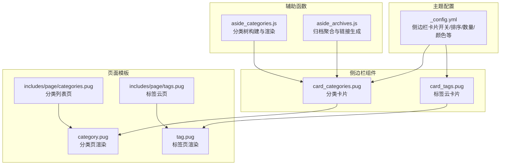
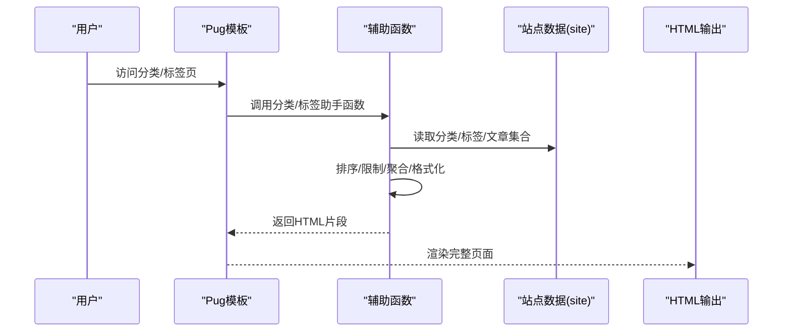
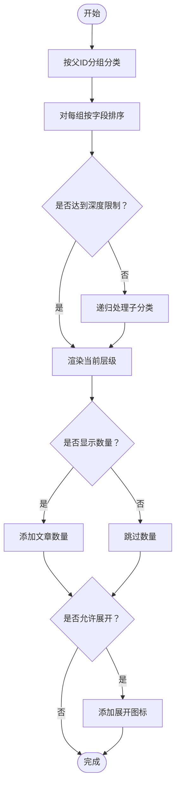
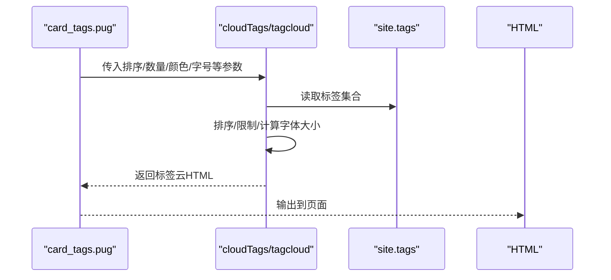
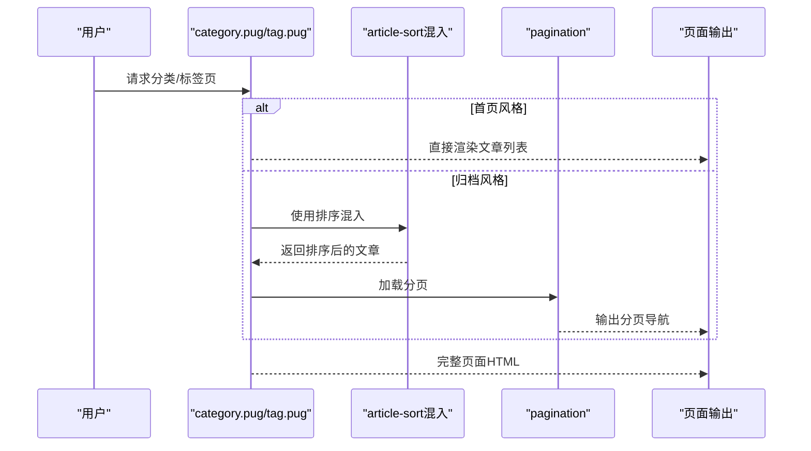
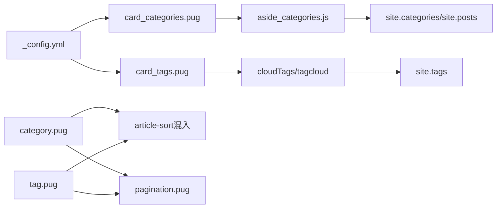

# 分类与标签系统

<cite>
**本文引用的文件**
- [themes/butterfly/_config.yml](file://themes/butterfly/_config.yml)
- [themes/butterfly/scripts/helpers/aside_categories.js](file://themes/butterfly/scripts/helpers/aside_categories.js)
- [themes/butterfly/scripts/helpers/aside_archives.js](file://themes/butterfly/scripts/helpers/aside_archives.js)
- [themes/butterfly/layout/includes/widget/card_categories.pug](file://themes/butterfly/layout/includes/widget/card_categories.pug)
- [themes/butterfly/layout/includes/widget/card_tags.pug](file://themes/butterfly/layout/includes/widget/card_tags.pug)
- [themes/butterfly/layout/includes/page/categories.pug](file://themes/butterfly/layout/includes/page/categories.pug)
- [themes/butterfly/layout/includes/page/tags.pug](file://themes/butterfly/layout/includes/page/tags.pug)
- [themes/butterfly/layout/category.pug](file://themes/butterfly/layout/category.pug)
- [themes/butterfly/layout/tag.pug](file://themes/butterfly/layout/tag.pug)
</cite>

## 目录
1. [简介](#简介)
2. [项目结构](#项目结构)
3. [核心组件](#核心组件)
4. [架构总览](#架构总览)
5. [详细组件分析](#详细组件分析)
6. [依赖关系分析](#依赖关系分析)
7. [性能考量](#性能考量)
8. [故障排查指南](#故障排查指南)
9. [结论](#结论)
10. [附录](#附录)

## 简介
本文件面向dzc-blog（基于Hexo与Butterfly主题）的分类与标签系统，系统性阐述以下内容：
- 分类系统的层级结构与渲染流程
- 标签云的生成机制与样式控制
- 侧边栏组件的启用、配置与动态加载
- 分类页与标签页的渲染逻辑与UI模式
- 归档功能的配置与展示
- 最佳实践：命名规范、层级设计、SEO优化
- 侧边栏组件的动态加载与缓存机制
- 实际配置示例与可扩展点

## 项目结构
围绕分类与标签的关键文件分布如下：
- 主题配置：用于开启/关闭侧边栏卡片、设置排序与数量等
- 辅助函数：负责构建分类树、标签云、归档列表
- 模板组件：侧边栏卡片与分类/标签页面模板
- 页面布局：分类页与标签页的渲染入口

图表来源
- [themes/butterfly/_config.yml](file://themes/butterfly/_config.yml)
- [themes/butterfly/scripts/helpers/aside_categories.js](file://themes/butterfly/scripts/helpers/aside_categories.js)
- [themes/butterfly/scripts/helpers/aside_archives.js](file://themes/butterfly/scripts/helpers/aside_archives.js)
- [themes/butterfly/layout/includes/widget/card_categories.pug](file://themes/butterfly/layout/includes/widget/card_categories.pug)
- [themes/butterfly/layout/includes/widget/card_tags.pug](file://themes/butterfly/layout/includes/widget/card_tags.pug)
- [themes/butterfly/layout/category.pug](file://themes/butterfly/layout/category.pug)
- [themes/butterfly/layout/tag.pug](file://themes/butterfly/layout/tag.pug)
- [themes/butterfly/layout/includes/page/categories.pug](file://themes/butterfly/layout/includes/page/categories.pug)
- [themes/butterfly/layout/includes/page/tags.pug](file://themes/butterfly/layout/includes/page/tags.pug)

章节来源
- [themes/butterfly/_config.yml](file://themes/butterfly/_config.yml)
- [themes/butterfly/layout/includes/widget/card_categories.pug](file://themes/butterfly/layout/includes/widget/card_categories.pug)
- [themes/butterfly/layout/includes/widget/card_tags.pug](file://themes/butterfly/layout/includes/widget/card_tags.pug)
- [themes/butterfly/layout/category.pug](file://themes/butterfly/layout/category.pug)
- [themes/butterfly/layout/tag.pug](file://themes/butterfly/layout/tag.pug)

## 核心组件
- 分类侧边栏卡片：通过辅助函数生成带层级的分类树，支持展开/折叠、数量统计、排序与限制数量
- 标签云侧边栏卡片：支持随机/按名称/按长度排序、字号范围、颜色方案与自定义颜色
- 分类/标签页面：根据配置选择首页风格或归档风格进行文章列表渲染
- 归档侧边栏：按月度/年度聚合文章，支持时区与本地化格式化

章节来源
- [themes/butterfly/scripts/helpers/aside_categories.js](file://themes/butterfly/scripts/helpers/aside_categories.js)
- [themes/butterfly/layout/includes/widget/card_categories.pug](file://themes/butterfly/layout/includes/widget/card_categories.pug)
- [themes/butterfly/layout/includes/widget/card_tags.pug](file://themes/butterfly/layout/includes/widget/card_tags.pug)
- [themes/butterfly/layout/category.pug](file://themes/butterfly/layout/category.pug)
- [themes/butterfly/layout/tag.pug](file://themes/butterfly/layout/tag.pug)
- [themes/butterfly/scripts/helpers/aside_archives.js](file://themes/butterfly/scripts/helpers/aside_archives.js)

## 架构总览
分类与标签系统由“配置驱动 + 辅助函数 + 模板渲染”三层组成：
- 配置层：在主题配置中开启卡片、设定排序与数量、颜色策略
- 助手层：辅助函数对站点数据进行聚合、排序与HTML输出
- 渲染层：Pug模板调用助手函数，生成最终HTML

图表来源
- [themes/butterfly/layout/includes/widget/card_categories.pug](file://themes/butterfly/layout/includes/widget/card_categories.pug)
- [themes/butterfly/layout/includes/widget/card_tags.pug](file://themes/butterfly/layout/includes/widget/card_tags.pug)
- [themes/butterfly/scripts/helpers/aside_categories.js](file://themes/butterfly/scripts/helpers/aside_categories.js)
- [themes/butterfly/scripts/helpers/aside_archives.js](file://themes/butterfly/scripts/helpers/aside_archives.js)

## 详细组件分析

### 分类系统与侧边栏卡片
- 层级结构：以Map按父ID组织子节点，递归构建层级树；支持深度限制与展开/折叠状态
- 排序与限制：支持按名称/长度/数量等字段排序，支持limit限制显示数量
- 数量统计：每个分类显示文章数量，便于快速了解内容规模
- 展开按钮：顶层分类存在子项时显示展开图标，点击切换展开/收起
- 渲染入口：侧边栏卡片模板调用助手函数，传入limit与expand参数

图表来源
- [themes/butterfly/scripts/helpers/aside_categories.js](file://themes/butterfly/scripts/helpers/aside_categories.js)

章节来源
- [themes/butterfly/scripts/helpers/aside_categories.js](file://themes/butterfly/scripts/helpers/aside_categories.js)
- [themes/butterfly/layout/includes/widget/card_categories.pug](file://themes/butterfly/layout/includes/widget/card_categories.pug)

### 标签云生成机制
- 数据源：使用站点标签集合，支持多种排序方式（随机/名称/长度）
- 字号与颜色：可配置最小/最大字号、单位、颜色区间或自定义颜色数组
- 限制数量：通过limit控制显示标签数，0表示不限制
- 渲染路径：侧边栏卡片模板根据color开关选择不同云生成器

图表来源
- [themes/butterfly/layout/includes/widget/card_tags.pug](file://themes/butterfly/layout/includes/widget/card_tags.pug)

章节来源
- [themes/butterfly/layout/includes/widget/card_tags.pug](file://themes/butterfly/layout/includes/widget/card_tags.pug)

### 分类页面与标签页面渲染逻辑
- 页面入口：category.pug与tag.pug分别作为分类与标签页的布局
- UI模式：根据主题配置选择“首页风格”或“归档风格”
- 文章排序：归档风格下使用统一的文章排序混入进行展示
- 分页：归档风格下包含分页组件

图表来源
- [themes/butterfly/layout/category.pug](file://themes/butterfly/layout/category.pug)
- [themes/butterfly/layout/tag.pug](file://themes/butterfly/layout/tag.pug)

章节来源
- [themes/butterfly/layout/category.pug](file://themes/butterfly/layout/category.pug)
- [themes/butterfly/layout/tag.pug](file://themes/butterfly/layout/tag.pug)

### 归档功能配置与展示
- 聚合粒度：支持按月度或年度聚合
- 本地化与时区：根据页面语言与配置时区格式化日期
- 排序与限制：支持升序/降序与数量限制
- 链接生成：生成对应年/月的归档链接

章节来源
- [themes/butterfly/scripts/helpers/aside_archives.js](file://themes/butterfly/scripts/helpers/aside_archives.js)

### 侧边栏组件的动态加载与缓存机制
- 动态加载：卡片模板仅在主题配置开启且有数据时渲染
- 参数传递：从主题配置读取limit、orderby、order、color等参数
- 缓存机制：归档助手内部使用Map进行聚合，避免重复计算；模板层面依赖Hexo渲染缓存

章节来源
- [themes/butterfly/layout/includes/widget/card_categories.pug](file://themes/butterfly/layout/includes/widget/card_categories.pug)
- [themes/butterfly/layout/includes/widget/card_tags.pug](file://themes/butterfly/layout/includes/widget/card_tags.pug)
- [themes/butterfly/scripts/helpers/aside_archives.js](file://themes/butterfly/scripts/helpers/aside_archives.js)

## 依赖关系分析
- 配置依赖：侧边栏卡片与页面渲染均依赖主题配置中的开关与参数
- 数据依赖：分类/标签/归档均依赖站点数据（site.categories/site.tags/site.posts）
- 模板依赖：页面模板依赖混入与分页组件
- 助手函数依赖：分类与归档助手函数依赖Hexo上下文与URL生成工具

图表来源
- [themes/butterfly/_config.yml](file://themes/butterfly/_config.yml)
- [themes/butterfly/layout/includes/widget/card_categories.pug](file://themes/butterfly/layout/includes/widget/card_categories.pug)
- [themes/butterfly/layout/includes/widget/card_tags.pug](file://themes/butterfly/layout/includes/widget/card_tags.pug)
- [themes/butterfly/scripts/helpers/aside_categories.js](file://themes/butterfly/scripts/helpers/aside_categories.js)
- [themes/butterfly/layout/category.pug](file://themes/butterfly/layout/category.pug)
- [themes/butterfly/layout/tag.pug](file://themes/butterfly/layout/tag.pug)

章节来源
- [themes/butterfly/_config.yml](file://themes/butterfly/_config.yml)
- [themes/butterfly/layout/includes/widget/card_categories.pug](file://themes/butterfly/layout/includes/widget/card_categories.pug)
- [themes/butterfly/layout/includes/widget/card_tags.pug](file://themes/butterfly/layout/includes/widget/card_tags.pug)
- [themes/butterfly/scripts/helpers/aside_categories.js](file://themes/butterfly/scripts/helpers/aside_categories.js)
- [themes/butterfly/layout/category.pug](file://themes/butterfly/layout/category.pug)
- [themes/butterfly/layout/tag.pug](file://themes/butterfly/layout/tag.pug)

## 性能考量
- 分类树构建：使用Map按父ID分组，时间复杂度近似O(n)，递归深度受层级限制
- 排序与限制：排序在内存中进行，limit减少DOM节点数量，提升渲染性能
- 标签云：排序与字体计算在服务端完成，前端仅渲染静态HTML
- 归档聚合：使用Map聚合，避免重复遍历；格式化与链接生成在渲染阶段完成
- 建议：合理设置limit与depth，避免一次性渲染过多节点；对大站点可考虑分页或懒加载

## 故障排查指南
- 分类/标签未显示
  - 检查主题配置中卡片开关与limit设置
  - 确认站点存在分类/标签数据
- 分类层级不正确
  - 检查分类parent字段是否正确设置
  - 调整depth与expand参数
- 标签云无颜色或字体异常
  - 检查color开关与自定义颜色配置
  - 确认orderby/order参数合法
- 归档日期格式错误
  - 检查format与时区配置
  - 确认页面语言与moment本地化映射

章节来源
- [themes/butterfly/_config.yml](file://themes/butterfly/_config.yml)
- [themes/butterfly/scripts/helpers/aside_categories.js](file://themes/butterfly/scripts/helpers/aside_categories.js)
- [themes/butterfly/scripts/helpers/aside_archives.js](file://themes/butterfly/scripts/helpers/aside_archives.js)

## 结论
本系统通过“配置驱动 + 助手函数 + 模板渲染”的清晰分层，实现了分类层级、标签云与归档的高效展示。借助合理的排序、限制与本地化支持，既保证了用户体验，也兼顾了SEO友好性。建议在大体量站点上结合limit与分页策略，进一步优化性能。

## 附录

### 配置示例与最佳实践
- 分类侧边栏
  - 开关与数量：在主题配置中开启分类卡片并设置limit
  - 展开行为：根据需要开启expand以支持层级展开
  - 排序：按name或length排序，确保层级清晰
- 标签云
  - 排序：优先使用random以增强多样性
  - 字号与颜色：设置合理的min/max字号与颜色区间
  - 自定义颜色：为重要标签设置自定义颜色，突出重点
- 归档
  - 聚合粒度：默认月度聚合，必要时改为年度
  - 本地化与时区：确保format与timezone匹配目标受众
- SEO优化
  - 分类/标签页面标题与描述：在front-matter中设置
  - 结构化数据：可结合Open Graph与结构化数据模板
  - 链接规范化：确保分类/标签/归档链接唯一且稳定

章节来源
- [themes/butterfly/_config.yml](file://themes/butterfly/_config.yml)
- [themes/butterfly/layout/includes/widget/card_categories.pug](file://themes/butterfly/layout/includes/widget/card_categories.pug)
- [themes/butterfly/layout/includes/widget/card_tags.pug](file://themes/butterfly/layout/includes/widget/card_tags.pug)
- [themes/butterfly/scripts/helpers/aside_archives.js](file://themes/butterfly/scripts/helpers/aside_archives.js)