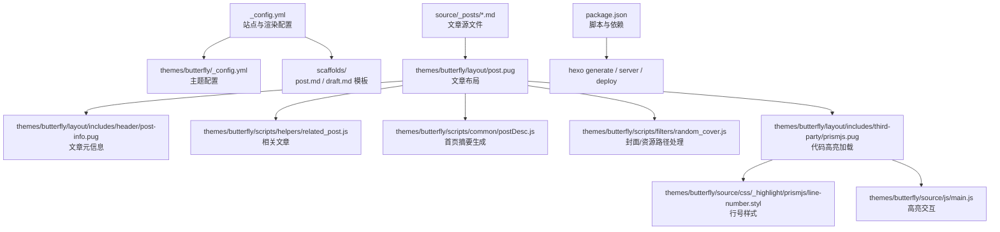
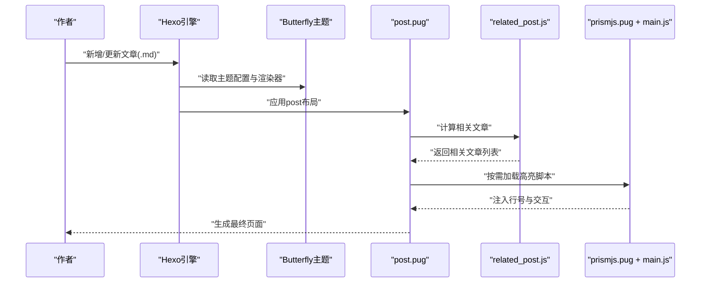
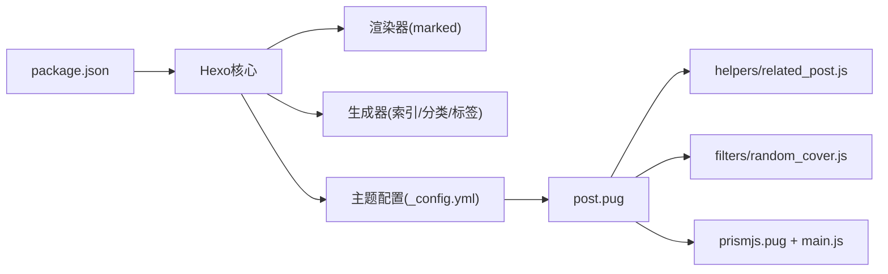

# 文章写作与发布

<cite>
**本文引用的文件**
- [_config.yml](file://_config.yml)
- [package.json](file://package.json)
- [scaffolds/post.md](file://scaffolds/post.md)
- [scaffolds/draft.md](file://scaffolds/draft.md)
- [source/_posts/Vscode-Github-Copilot接入MATLAB.md](file://source/_posts/Vscode-Github-Copilot接入MATLAB.md)
- [themes/butterfly/_config.yml](file://themes/butterfly/_config.yml)
- [themes/butterfly/layout/post.pug](file://themes/butterfly/layout/post.pug)
- [themes/butterfly/layout/includes/header/post-info.pug](file://themes/butterfly/layout/includes/header/post-info.pug)
- [themes/butterfly/scripts/helpers/related_post.js](file://themes/butterfly/scripts/helpers/related_post.js)
- [themes/butterfly/scripts/common/postDesc.js](file://themes/butterfly/scripts/common/postDesc.js)
- [themes/butterfly/scripts/filters/random_cover.js](file://themes/butterfly/scripts/filters/random_cover.js)
- [themes/butterfly/scripts/tag/inlineImg.js](file://themes/butterfly/scripts/tag/inlineImg.js)
- [themes/butterfly/layout/includes/third-party/prismjs.pug](file://themes/butterfly/layout/includes/third-party/prismjs.pug)
- [themes/butterfly/source/css/_highlight/prismjs/line-number.styl](file://themes/butterfly/source/css/_highlight/prismjs/line-number.styl)
- [themes/butterfly/source/js/main.js](file://themes/butterfly/source/js/main.js)
</cite>

## 目录
1. [简介](#简介)
2. [项目结构](#项目结构)
3. [核心组件](#核心组件)
4. [架构总览](#架构总览)
5. [详细组件分析](#详细组件分析)
6. [依赖关系分析](#依赖关系分析)
7. [性能考量](#性能考量)
8. [故障排查指南](#故障排查指南)
9. [结论](#结论)
10. [附录](#附录)

## 简介
本文件面向dzc-blog的作者与维护者，系统化阐述基于Hexo与Butterfly主题的文章写作与发布流程，重点覆盖：
- Front-matter元数据配置：title、date、tags、categories等字段的含义与最佳实践
- Markdown语法支持与代码高亮、内联图片等扩展标签
- 图片资源管理与附件处理策略
- 文章模板使用：post.md与draft.md模板的配置与自定义
- 发布流程、草稿管理与版本控制建议
- 实际示例与可操作步骤，帮助撰写高质量技术文章

## 项目结构
本项目采用标准Hexo目录组织，结合Butterfly主题的布局与脚本实现内容渲染与展示。

图表来源
- [_config.yml:1-107](file://_config.yml#L1-L107)
- [themes/butterfly/_config.yml:1-1140](file://themes/butterfly/_config.yml#L1-L1140)
- [scaffolds/post.md:1-7](file://scaffolds/post.md#L1-L7)
- [scaffolds/draft.md:1-5](file://scaffolds/draft.md#L1-L5)
- [themes/butterfly/layout/post.pug:1-36](file://themes/butterfly/layout/post.pug#L1-L36)
- [themes/butterfly/layout/includes/header/post-info.pug:1-149](file://themes/butterfly/layout/includes/header/post-info.pug#L1-L149)
- [themes/butterfly/scripts/helpers/related_post.js:1-92](file://themes/butterfly/scripts/helpers/related_post.js#L1-L92)
- [themes/butterfly/scripts/common/postDesc.js:1-38](file://themes/butterfly/scripts/common/postDesc.js#L1-L38)
- [themes/butterfly/scripts/filters/random_cover.js:1-90](file://themes/butterfly/scripts/filters/random_cover.js#L1-L90)
- [themes/butterfly/layout/includes/third-party/prismjs.pug:1-23](file://themes/butterfly/layout/includes/third-party/prismjs.pug#L1-L23)
- [themes/butterfly/source/css/_highlight/prismjs/line-number.styl:1-42](file://themes/butterfly/source/css/_highlight/prismjs/line-number.styl#L1-L42)
- [themes/butterfly/source/js/main.js:197-234](file://themes/butterfly/source/js/main.js#L197-L234)

章节来源
- [_config.yml:1-107](file://_config.yml#L1-L107)
- [package.json:1-29](file://package.json#L1-L29)

## 核心组件
- 站点配置与渲染
  - 站点标题、URL、分页、日期格式、高亮与PrismJS配置等由根配置文件统一管理
- 主题配置
  - 文章元信息展示、TOC、评论系统、封面与摘要策略等由主题配置决定
- 文章模板
  - post.md与draft.md模板定义Front-matter默认字段，便于快速生成
- 文章布局与辅助
  - post.pug负责文章容器与分享、打赏、分页、相关文章等模块拼装；post-info.pug负责日期、分类、标签、字数与阅读时长等元信息
- 代码高亮与交互
  - PrismJS按需加载与行号样式；前端脚本负责展开/收起、复制与懒加载

章节来源
- [_config.yml:33-83](file://_config.yml#L33-L83)
- [themes/butterfly/_config.yml:118-138](file://themes/butterfly/_config.yml#L118-L138)
- [themes/butterfly/layout/post.pug:1-36](file://themes/butterfly/layout/post.pug#L1-L36)
- [themes/butterfly/layout/includes/header/post-info.pug:1-149](file://themes/butterfly/layout/includes/header/post-info.pug#L1-L149)
- [themes/butterfly/layout/includes/third-party/prismjs.pug:1-23](file://themes/butterfly/layout/includes/third-party/prismjs.pug#L1-L23)
- [themes/butterfly/source/css/_highlight/prismjs/line-number.styl:1-42](file://themes/butterfly/source/css/_highlight/prismjs/line-number.styl#L1-L42)
- [themes/butterfly/source/js/main.js:197-234](file://themes/butterfly/source/js/main.js#L197-L234)

## 架构总览
下图展示从文章源文件到页面渲染的关键流程，涵盖Front-matter解析、主题布局、代码高亮与相关推荐等环节。

图表来源
- [themes/butterfly/layout/post.pug:1-36](file://themes/butterfly/layout/post.pug#L1-L36)
- [themes/butterfly/scripts/helpers/related_post.js:1-92](file://themes/butterfly/scripts/helpers/related_post.js#L1-L92)
- [themes/butterfly/layout/includes/third-party/prismjs.pug:1-23](file://themes/butterfly/layout/includes/third-party/prismjs.pug#L1-L23)
- [themes/butterfly/source/js/main.js:197-234](file://themes/butterfly/source/js/main.js#L197-L234)

## 详细组件分析

### Front-matter元数据配置
- 字段说明与建议
  - title：文章标题，建议简洁明确，避免过长或含特殊字符
  - date：发布时间，遵循站点日期格式；如需草稿，可暂时留空或使用未来时间
  - tags：标签数组，用于归类与索引，建议每个文章不超过3-5个核心标签
  - categories：分类，建议使用一个主分类，必要时配合主题的多级分类能力
- 示例参考
  - 可参考现有文章的Front-matter结构，确保字段齐全且格式一致
- 模板与默认值
  - post.md模板提供title、date、tags、categories字段占位
  - draft.md模板提供title、tags占位，便于先写后补全

章节来源
- [scaffolds/post.md:1-7](file://scaffolds/post.md#L1-L7)
- [scaffolds/draft.md:1-5](file://scaffolds/draft.md#L1-L5)
- [source/_posts/Vscode-Github-Copilot接入MATLAB.md:1-10](file://source/_posts/Vscode-Github-Copilot接入MATLAB.md#L1-L10)

### Markdown语法支持与扩展
- 渲染器
  - 使用marked渲染器，支持标准Markdown语法
- 代码高亮
  - 支持highlight.js与prismjs两种方案；当前配置启用PrismJS并开启行号
  - 行号样式通过Stylus文件控制，前端脚本负责交互（展开/收起、复制）
- 内联图片标签
  - 提供inlineImg标签，可在正文中插入指定高度的内联图片

章节来源
- [_config.yml:47-56](file://_config.yml#L47-L56)
- [themes/butterfly/layout/includes/third-party/prismjs.pug:1-23](file://themes/butterfly/layout/includes/third-party/prismjs.pug#L1-L23)
- [themes/butterfly/source/css/_highlight/prismjs/line-number.styl:1-42](file://themes/butterfly/source/css/_highlight/prismjs/line-number.styl#L1-L42)
- [themes/butterfly/source/js/main.js:197-234](file://themes/butterfly/source/js/main.js#L197-L234)
- [themes/butterfly/scripts/tag/inlineImg.js:1-19](file://themes/butterfly/scripts/tag/inlineImg.js#L1-L19)

### 图片资源管理与附件处理
- 资源路径策略
  - 若启用文章资源文件夹，图片等资源可与文章同目录管理；主题过滤器会自动为相对路径资源添加前缀
- 默认封面与随机轮换
  - 当未设置封面时，可启用随机封面；封面类型自动识别为图片或颜色
- 本地与外链图片
  - 外链图片（含协议）将直接使用；本地图片需确保路径正确

章节来源
- [_config.yml:43-43](file://_config.yml#L43-L43)
- [themes/butterfly/scripts/filters/random_cover.js:1-90](file://themes/butterfly/scripts/filters/random_cover.js#L1-L90)

### 文章模板使用指南
- post.md模板
  - 适用于正式发布的文章，包含title、date、tags、categories字段
  - 建议在新建文章时优先使用该模板，保证元数据完整
- draft.md模板
  - 适用于草稿阶段，仅包含title与tags，便于快速开始写作
  - 草稿发布前请补充date、categories等字段

章节来源
- [scaffolds/post.md:1-7](file://scaffolds/post.md#L1-L7)
- [scaffolds/draft.md:1-5](file://scaffolds/draft.md#L1-L5)

### 文章发布流程与草稿管理
- 新建文章
  - 使用模板生成Front-matter，填充title、date、tags、categories
  - 在source/_posts下编写正文，合理使用标题层级与列表
- 草稿管理
  - 草稿可保存在source/_posts，待完善后再发布
  - 如需在生成时包含草稿，请在配置中开启渲染草稿开关
- 生成与部署
  - 使用Hexo脚本进行本地预览与构建，确认无误后部署至目标仓库

章节来源
- [_config.yml:42-42](file://_config.yml#L42-L42)
- [package.json:5-10](file://package.json#L5-L10)

### 版本控制与协作
- 建议
  - 将source/_posts中的文章纳入版本控制，便于回溯与协作
  - 使用分支管理草稿与正式版本，合并前进行本地生成验证
- 注意
  - 避免提交大型二进制资源；如确需外部图床，请使用稳定链接

## 依赖关系分析
- Hexo核心与主题
  - Hexo版本与渲染器、生成器、服务器等依赖在package.json中声明
  - 主题配置集中于themes/butterfly/_config.yml，影响文章布局与展示细节
- 文章到页面的依赖
  - 文章源文件经Front-matter解析后，由post.pug布局装配各模块
  - 相关文章、摘要、封面等逻辑分别由helpers与filters提供

图表来源
- [package.json:1-29](file://package.json#L1-L29)
- [themes/butterfly/_config.yml:1-1140](file://themes/butterfly/_config.yml#L1-L1140)
- [themes/butterfly/layout/post.pug:1-36](file://themes/butterfly/layout/post.pug#L1-L36)
- [themes/butterfly/scripts/helpers/related_post.js:1-92](file://themes/butterfly/scripts/helpers/related_post.js#L1-L92)
- [themes/butterfly/scripts/filters/random_cover.js:1-90](file://themes/butterfly/scripts/filters/random_cover.js#L1-L90)
- [themes/butterfly/layout/includes/third-party/prismjs.pug:1-23](file://themes/butterfly/layout/includes/third-party/prismjs.pug#L1-L23)
- [themes/butterfly/source/js/main.js:197-234](file://themes/butterfly/source/js/main.js#L197-L234)

章节来源
- [package.json:1-29](file://package.json#L1-L29)
- [themes/butterfly/_config.yml:1-1140](file://themes/butterfly/_config.yml#L1-L1140)

## 性能考量
- 代码高亮
  - 启用行号与PrismJS时，建议控制代码块数量与长度，避免页面加载卡顿
- 图片与封面
  - 使用压缩后的图片；外链图片需考虑CDN与跨域策略
- 相关文章与摘要
  - 相关文章算法基于标签匹配，建议保持标签粒度适中，减少计算复杂度

## 故障排查指南
- 文章未出现在首页或分类页
  - 检查Front-matter是否完整，特别是date与categories
  - 确认生成器已启用：索引、分类、标签生成器均应在依赖中
- 代码高亮未生效
  - 确认PrismJS已启用且脚本加载成功；检查行号样式是否正确引入
- 图片无法显示
  - 若启用文章资源文件夹，确保资源路径与文章同目录；否则使用绝对路径或外链
- 相关文章为空
  - 确保文章至少有一个标签；相关文章基于标签交集计算

章节来源
- [themes/butterfly/scripts/helpers/related_post.js:1-92](file://themes/butterfly/scripts/helpers/related_post.js#L1-L92)
- [themes/butterfly/layout/includes/third-party/prismjs.pug:1-23](file://themes/butterfly/layout/includes/third-party/prismjs.pug#L1-L23)
- [themes/butterfly/scripts/filters/random_cover.js:1-90](file://themes/butterfly/scripts/filters/random_cover.js#L1-L90)

## 结论
通过规范的Front-matter配置、合理的模板使用与主题配置，结合Hexo的渲染与Butterfly的主题能力，可以高效地完成从写作到发布的全流程。建议在团队协作中统一模板与字段规范，并在发布前进行本地生成验证，确保页面质量与性能。

## 附录
- 快速检查清单
  - Front-matter：title、date、tags、categories
  - 正文：标题层级清晰、代码块标注语言、图片路径正确
  - 预览：本地generate与server验证
  - 部署：确认deploy配置与目标仓库分支