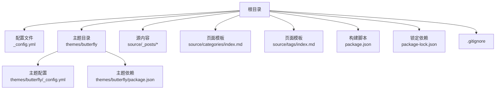
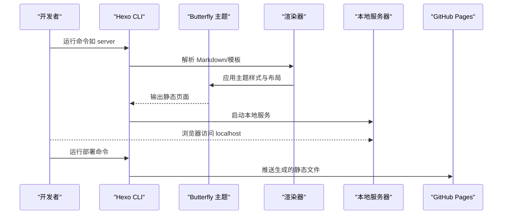
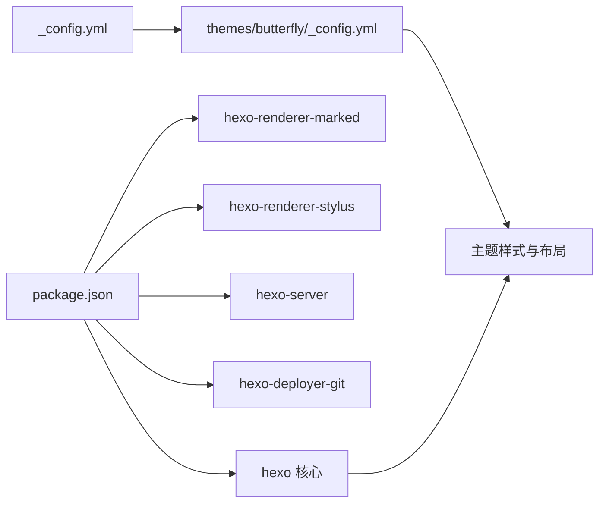

# 快速开始

<cite>
**本文引用的文件**
- [package.json](file://package.json)
- [_config.yml](file://_config.yml)
- [themes/butterfly/_config.yml](file://themes/butterfly/_config.yml)
- [themes/butterfly/package.json](file://themes/butterfly/package.json)
- [themes/butterfly/README_CN.md](file://themes/butterfly/README_CN.md)
- [.gitignore](file://.gitignore)
- [package-lock.json](file://package-lock.json)
- [source/_posts/Vscode-Github-Copilot接入MATLAB.md](file://source/_posts/Vscode-Github-Copilot接入MATLAB.md)
- [source/categories/index.md](file://source/categories/index.md)
- [source/tags/index.md](file://source/tags/index.md)
</cite>

## 目录
1. [简介](#简介)
2. [项目结构](#项目结构)
3. [核心组件](#核心组件)
4. [架构总览](#架构总览)
5. [详细组件分析](#详细组件分析)
6. [依赖关系分析](#依赖关系分析)
7. [性能与优化建议](#性能与优化建议)
8. [故障排除指南](#故障排除指南)
9. [结论](#结论)
10. [附录](#附录)

## 简介
本指南面向首次接触 dzz-blog 的用户，帮助你在约 30 分钟内完成环境准备、安装与本地预览，并掌握核心配置要点与常见问题排查方法。项目基于 Hexo 与 Butterfly 主题，采用 Markdown 写作、静态生成与部署到 GitHub Pages 的工作流。

## 项目结构
仓库采用 Hexo 标准目录组织，核心文件与主题配置如下：
- 根配置：站点基础配置与部署信息
- 主题：Butterfly（主题配置、样式、脚本、布局）
- 示例内容：文章、分类页、标签页
- 构建与依赖：package.json、package-lock.json、.gitignore

图表来源
- [_config.yml:1-107](file://_config.yml#L1-L107)
- [themes/butterfly/_config.yml:1-1140](file://themes/butterfly/_config.yml#L1-L1140)
- [themes/butterfly/package.json:1-35](file://themes/butterfly/package.json#L1-L35)
- [package.json:1-29](file://package.json#L1-L29)
- [package-lock.json:1-800](file://package-lock.json#L1-L800)
- [.gitignore:1-8](file://.gitignore#L1-L8)

章节来源
- [_config.yml:1-107](file://_config.yml#L1-L107)
- [themes/butterfly/_config.yml:1-1140](file://themes/butterfly/_config.yml#L1-L1140)
- [themes/butterfly/package.json:1-35](file://themes/butterfly/package.json#L1-L35)
- [package.json:1-29](file://package.json#L1-L29)
- [package-lock.json:1-800](file://package-lock.json#L1-L800)
- [.gitignore:1-8](file://.gitignore#L1-L8)

## 核心组件
- 站点配置（根配置）：定义站点标题、URL、分页、渲染器、主题、部署目标等
- 主题配置（Butterfly）：导航、代码块、社交、图片、首页布局、评论、统计、广告等
- 构建脚本：提供 build、server、deploy 等常用命令
- 示例内容：Markdown 文章与分类/标签页面模板

章节来源
- [_config.yml:1-107](file://_config.yml#L1-L107)
- [themes/butterfly/_config.yml:1-1140](file://themes/butterfly/_config.yml#L1-L1140)
- [package.json:5-10](file://package.json#L5-L10)

## 架构总览
Hexo 工作流概览：本地通过 npm/yarn 安装依赖，使用 hexo 命令生成静态资源，本地服务器预览，最终一键部署到 GitHub Pages。

图表来源
- [package.json:5-10](file://package.json#L5-L10)
- [themes/butterfly/_config.yml:1-1140](file://themes/butterfly/_config.yml#L1-L1140)
- [_config.yml:99-107](file://_config.yml#L99-L107)

## 详细组件分析

### 环境要求与安装步骤
- Node.js 版本：请确保已安装 Node.js（推荐使用 LTS 版本），Hexo 8.x 需要较新的 Node.js 版本
- 包管理器：项目声明使用 yarn（版本与哈希见 package.json），也可使用 npm
- 安装步骤
  1) 安装依赖：yarn 或 npm install
  2) 本地预览：yarn server 或 npm run server
  3) 生成静态文件：yarn build 或 npm run build
  4) 部署：yarn deploy 或 npm run deploy（需配置部署信息）

章节来源
- [package.json:11-28](file://package.json#L11-L28)
- [package.json:5-10](file://package.json#L5-L10)
- [_config.yml:101-107](file://_config.yml#L101-L107)

### 核心配置文件详解
- 根配置（_config.yml）
  - 站点信息：title、subtitle、description、author、language、timezone
  - URL 与链接：url、permalink、pretty_urls
  - 目录与渲染：source_dir、public_dir、render_drafts、highlight/prismjs
  - 分页与索引：per_page、pagination_dir、index_generator
  - 主题与部署：theme、deploy.type、deploy.repo、deploy.branch
- 主题配置（themes/butterfly/_config.yml）
  - 导航与菜单：nav、menu
  - 代码块：code_blocks.theme、copy、language、shrink、fullpage
  - 图片与封面：favicon、avatar、default_top_img、index_img、archive_img、tag_img、category_img
  - 首页与文章：index_site_info_top、index_top_img_height、index_layout、index_post_content.method/length
  - 侧边栏与卡片：aside.display、card_*、webinfo
  - 评论与统计：comments.use、giscus、baidu_analytics、google_analytics、umami_analytics
  - 搜索：search.use、local_search、algolia_search
  - 其他：toc、post_copyright、darkmode、readmode、广告、站点验证等

章节来源
- [_config.yml:5-107](file://_config.yml#L5-L107)
- [themes/butterfly/_config.yml:1-1140](file://themes/butterfly/_config.yml#L1-L1140)

### 本地开发流程
- 初始化与依赖安装
  - 使用 yarn 或 npm 安装依赖
  - 若缺少渲染器或主题依赖，按主题文档补充安装
- 本地预览
  - 运行 server 命令启动本地服务器
  - 浏览器访问默认地址（通常为 localhost:4000）
- 基本配置验证
  - 确认主题已启用（theme: butterfly）
  - 确认 URL 与部署仓库配置正确
  - 验证首页、分类页、标签页是否正常渲染
- 初次运行检查清单
  - 依赖安装是否报错
  - 本地服务器是否启动成功
  - 首页文章列表与分页是否正常
  - 评论、统计、搜索等可选功能是否按预期加载

章节来源
- [package.json:5-10](file://package.json#L5-L10)
- [_config.yml:99-107](file://_config.yml#L99-L107)
- [themes/butterfly/README_CN.md:30-71](file://themes/butterfly/README_CN.md#L30-L71)

### 示例内容与页面模板
- 示例文章：source/_posts/Vscode-Github-Copilot接入MATLAB.md 展示了 Front Matter（标题、日期、标签、分类）与正文结构
- 页面模板：categories/index.md、tags/index.md 定义了分类与标签页面的布局与类型

章节来源
- [source/_posts/Vscode-Github-Copilot接入MATLAB.md:1-69](file://source/_posts/Vscode-Github-Copilot接入MATLAB.md#L1-L69)
- [source/categories/index.md:1-7](file://source/categories/index.md#L1-L7)
- [source/tags/index.md:1-7](file://source/tags/index.md#L1-L7)

## 依赖关系分析
- 根配置依赖主题配置：theme 字段指向 butterfly；主题配置决定 UI 行为
- 构建脚本依赖 Hexo 与渲染器：scripts 中的 server/build/deploy 命令由 Hexo 提供
- 依赖锁定：package-lock.json 确保依赖版本一致性
- 忽略文件：.gitignore 控制哪些目录/文件不纳入版本控制（如 node_modules、public、.deploy）

图表来源
- [package.json:14-26](file://package.json#L14-L26)
- [_config.yml:99-107](file://_config.yml#L99-L107)
- [themes/butterfly/_config.yml:1-1140](file://themes/butterfly/_config.yml#L1-L1140)

章节来源
- [package.json:14-26](file://package.json#L14-L26)
- [_config.yml:99-107](file://_config.yml#L99-L107)
- [package-lock.json:1-800](file://package-lock.json#L1-L800)
- [.gitignore:1-8](file://.gitignore#L1-L8)

## 性能与优化建议
- 合理使用分页与摘要：调整 per_page 与 index_post_content.length，平衡加载性能与信息密度
- 代码高亮与行号：根据需要开启/关闭行号与自动检测，减少不必要的解析开销
- 图片懒加载与压缩：利用主题提供的懒加载与封面配置，提升首屏加载体验
- 本地搜索与 Algolia：按需启用，避免在大型站点上引入过多前端资源
- 部署前清理：使用 clean 命令清理旧产物，避免冗余文件影响构建时间

## 故障排除指南
- 依赖安装失败
  - 症状：安装过程中出现网络超时或权限错误
  - 处理：更换镜像源、检查代理设置、使用 yarn 并确认 package-manager 声明
- 本地服务器无法启动
  - 症状：server 命令报错或端口占用
  - 处理：确认端口未被占用、检查 Node.js 版本兼容性、重新安装依赖
- 主题未生效或样式异常
  - 症状：页面空白或样式缺失
  - 处理：确认 theme 字段已设置为 butterfly、检查渲染器依赖是否安装、核对主题配置文件路径
- 部署失败
  - 症状：deploy 报错或 GitHub Pages 未更新
  - 处理：检查 deploy.repo 与分支配置、确认 SSH/Token 权限、查看 CI 日志（如使用 GitHub Actions）
- 首页文章列表为空
  - 症状：首页只显示标题，无文章内容
  - 处理：确认 source_dir 与文章目录结构、检查 Front Matter 是否正确、验证渲染器与主题兼容性
- 评论/统计/搜索不可用
  - 症状：评论区空白、统计计数不更新、搜索无结果
  - 处理：核对 comments.use/search.use 配置、检查第三方服务密钥与域名、确认本地预览与生产环境差异

章节来源
- [package.json:11-28](file://package.json#L11-L28)
- [_config.yml:99-107](file://_config.yml#L99-L107)
- [themes/butterfly/_config.yml:475-508](file://themes/butterfly/_config.yml#L475-L508)

## 结论
通过本指南，你可以在 30 分钟内完成 dzz-blog 的环境准备、安装与本地预览，并掌握核心配置与常见问题的排查方法。建议在本地充分验证后再进行部署，确保线上效果符合预期。

## 附录
- 常用命令参考
  - 安装依赖：yarn 或 npm install
  - 本地预览：yarn server 或 npm run server
  - 生成静态文件：yarn build 或 npm run build
  - 清理缓存：yarn clean 或 npm run clean
  - 部署：yarn deploy 或 npm run deploy
- 参考文档
  - Hexo 官方文档：https://hexo.io/docs/
  - Butterfly 主题文档：https://butterfly.js.org/