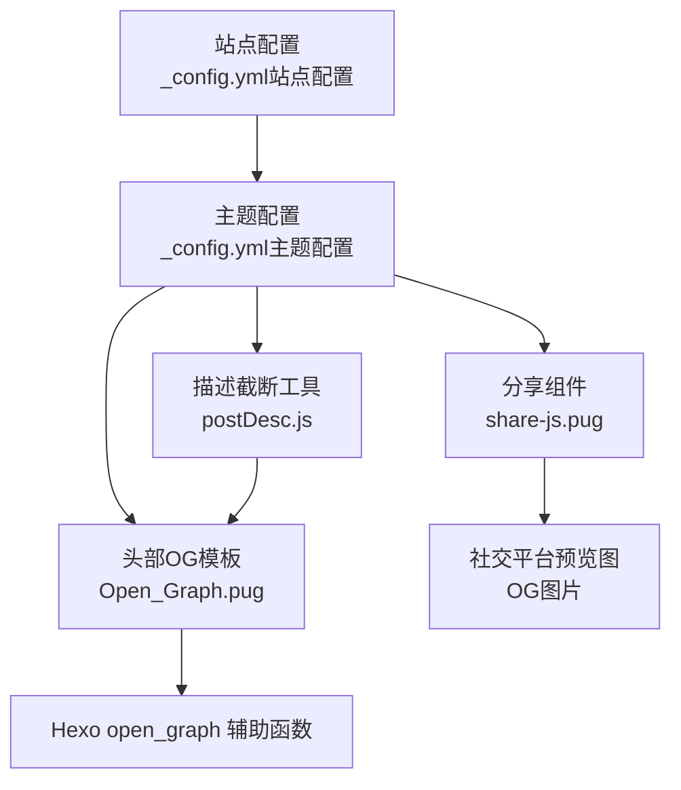
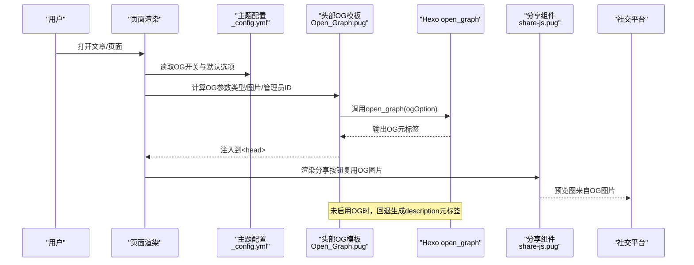
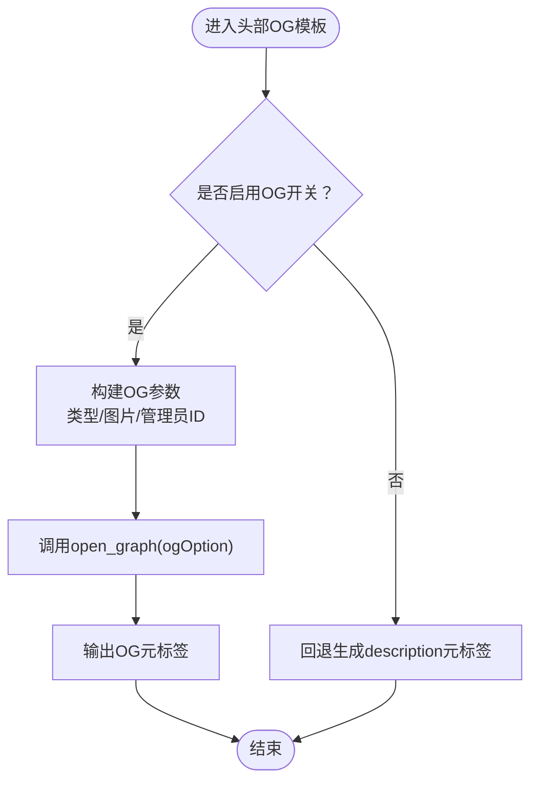
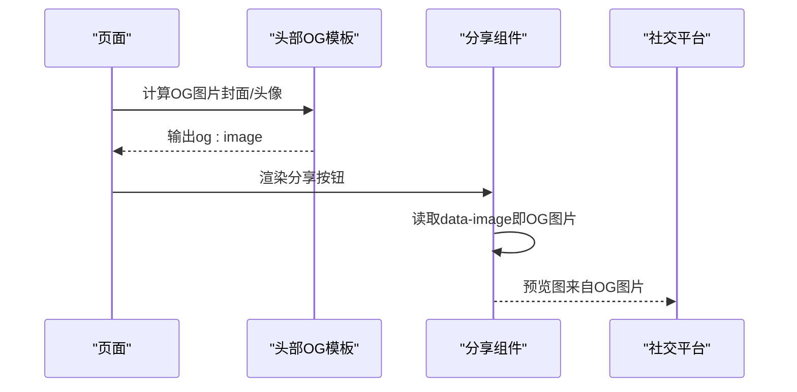
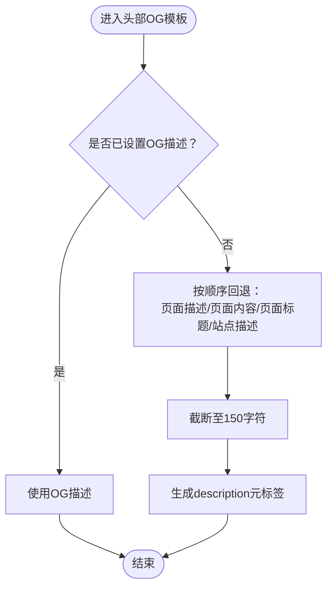
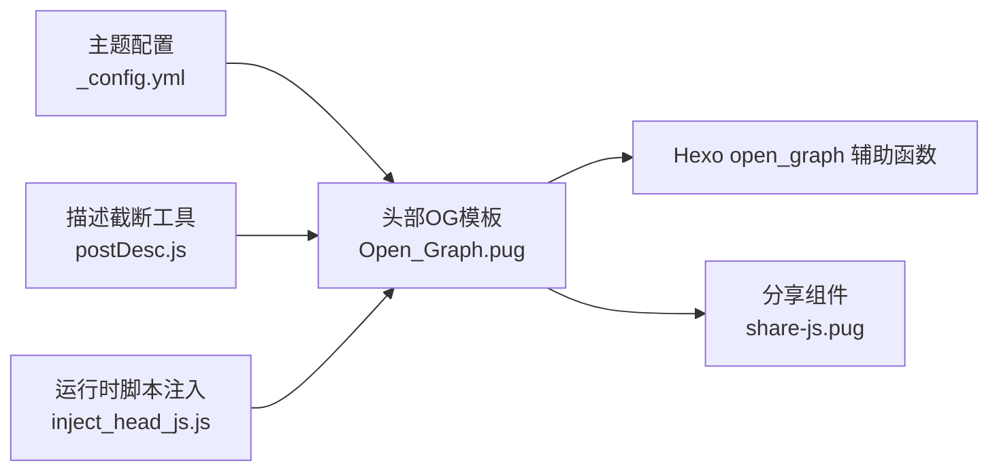

# Open Graph优化

<cite>
**本文引用的文件**
- [Open_Graph.pug](file://themes/butterfly/layout/includes/head/Open_Graph.pug)
- [_config.yml（主题配置）](file://themes/butterfly/_config.yml)
- [_config.yml（站点配置）](file://_config.yml)
- [share-js.pug](file://themes/butterfly/layout/includes/third-party/share/share-js.pug)
- [inject_head_js.js](file://themes/butterfly/scripts/helpers/inject_head_js.js)
- [postDesc.js](file://themes/butterfly/scripts/common/postDesc.js)
- [default_config.js](file://themes/butterfly/scripts/common/default_config.js)
- [facebook_comments.pug](file://themes/butterfly/layout/includes/third-party/comments/facebook_comments.pug)
</cite>

## 目录
1. [简介](#简介)
2. [项目结构](#项目结构)
3. [核心组件](#核心组件)
4. [架构总览](#架构总览)
5. [详细组件分析](#详细组件分析)
6. [依赖关系分析](#依赖关系分析)
7. [性能考量](#性能考量)
8. [故障排查指南](#故障排查指南)
9. [结论](#结论)
10. [附录](#附录)

## 简介
本指南围绕dzc-blog基于Hexo与Butterfly主题的Open Graph标签优化展开，系统讲解Open Graph协议在社交媒体分享中的作用、关键属性配置方法、图片尺寸与格式建议、缓存策略，以及针对文章、页面、分类等不同内容类型的OG标签设置策略。文档同时提供可直接参考的配置路径与实现依据，帮助你在不修改源码的前提下完成高质量的OG标签优化。

## 项目结构
本项目的Open Graph相关逻辑主要集中在Butterfly主题的头部模板与主题配置中：
- 头部OG标签生成：通过Pug模板调用Hexo的open_graph辅助函数输出OG元标签
- 主题配置：控制OG开关、默认选项、图片来源策略、Facebook应用与管理员ID等
- 分享组件：社交分享按钮会复用OG图片作为分享预览图
- 描述截断：当未显式设置OG描述时，自动从页面内容截断生成

图表来源
- [_config.yml（站点配置）:1-107](file://_config.yml#L1-L107)
- [_config.yml（主题配置）:1037-1048](file://themes/butterfly/_config.yml#L1037-L1048)
- [Open_Graph.pug:1-16](file://themes/butterfly/layout/includes/head/Open_Graph.pug#L1-L16)
- [share-js.pug:1-4](file://themes/butterfly/layout/includes/third-party/share/share-js.pug#L1-L4)
- [postDesc.js:1-37](file://themes/butterfly/scripts/common/postDesc.js#L1-L37)

章节来源
- [_config.yml（站点配置）:1-107](file://_config.yml#L1-L107)
- [_config.yml（主题配置）:1037-1048](file://themes/butterfly/_config.yml#L1037-L1048)
- [Open_Graph.pug:1-16](file://themes/butterfly/layout/includes/head/Open_Graph.pug#L1-L16)
- [share-js.pug:1-4](file://themes/butterfly/layout/includes/third-party/share/share-js.pug#L1-L4)
- [postDesc.js:1-37](file://themes/butterfly/scripts/common/postDesc.js#L1-L37)

## 核心组件
- OG标签生成器（Open_Graph.pug）
  - 负责根据页面类型与配置生成og:type、og:image、fb:admins、fb:app_id等OG元标签
  - 当未启用OG开关时，回退到生成标准description元标签
- 主题OG配置（_config.yml）
  - 控制是否启用OG、默认选项（如Twitter卡片、Facebook ID等）
  - 提供全局图片来源策略（优先使用文章封面，否则使用头像）
- 分享组件（share-js.pug）
  - 社交分享按钮会读取OG图片作为分享预览图
- 描述截断工具（postDesc.js）
  - 在未显式设置OG描述时，从页面内容截断生成150字符以内的描述

章节来源
- [Open_Graph.pug:1-16](file://themes/butterfly/layout/includes/head/Open_Graph.pug#L1-L16)
- [_config.yml（主题配置）:1037-1048](file://themes/butterfly/_config.yml#L1037-L1048)
- [share-js.pug:1-4](file://themes/butterfly/layout/includes/third-party/share/share-js.pug#L1-L4)
- [postDesc.js:1-37](file://themes/butterfly/scripts/common/postDesc.js#L1-L37)

## 架构总览
下图展示OG标签从配置到渲染的关键流程，包括图片选择策略、Facebook集成与回退机制。

图表来源
- [Open_Graph.pug:1-16](file://themes/butterfly/layout/includes/head/Open_Graph.pug#L1-L16)
- [_config.yml（主题配置）:1037-1048](file://themes/butterfly/_config.yml#L1037-L1048)
- [share-js.pug:1-4](file://themes/butterfly/layout/includes/third-party/share/share-js.pug#L1-L4)

## 详细组件分析

### 组件A：OG标签生成与回退机制
- 关键点
  - 启用条件：当主题配置开启OG开关时，才输出OG元标签；否则回退生成标准description元标签
  - 图片来源：优先使用文章封面，若无封面则回退到主题头像；最终通过全站URL拼接完整地址
  - 页面类型：根据全局页面类型决定og:type为article或website
  - Facebook集成：可注入fb:admins与fb:app_id，便于社交平台解析
- 实现依据
  - OG开关与默认选项：见主题配置中的OG开关与option字段
  - 图片选择策略：见头部OG模板中的封面/头像选择逻辑
  - 回退描述：见头部OG模板中的描述回退逻辑

图表来源
- [Open_Graph.pug:1-16](file://themes/butterfly/layout/includes/head/Open_Graph.pug#L1-L16)
- [_config.yml（主题配置）:1037-1048](file://themes/butterfly/_config.yml#L1037-L1048)

章节来源
- [Open_Graph.pug:1-16](file://themes/butterfly/layout/includes/head/Open_Graph.pug#L1-L16)
- [_config.yml（主题配置）:1037-1048](file://themes/butterfly/_config.yml#L1037-L1048)

### 组件B：OG图片策略与社交分享联动
- 关键点
  - 图片来源：优先使用文章封面；若封面为空则使用主题头像；最终通过全站URL拼接
  - 分享联动：社交分享按钮会读取OG图片作为分享预览图，确保分享一致性
- 实现依据
  - 图片来源策略：见头部OG模板中的封面/头像选择逻辑
  - 分享组件读取OG图片：见分享组件中的data-image绑定

图表来源
- [Open_Graph.pug:1-16](file://themes/butterfly/layout/includes/head/Open_Graph.pug#L1-L16)
- [share-js.pug:1-4](file://themes/butterfly/layout/includes/third-party/share/share-js.pug#L1-L4)

章节来源
- [Open_Graph.pug:1-16](file://themes/butterfly/layout/includes/head/Open_Graph.pug#L1-L16)
- [share-js.pug:1-4](file://themes/butterfly/layout/includes/third-party/share/share-js.pug#L1-L4)

### 组件C：OG描述回退与内容截断
- 关键点
  - 当未显式设置OG描述时，系统会尝试从页面描述、内容、标题或站点描述中截断生成
  - 截断长度：默认150字符，避免过长影响社交平台显示
- 实现依据
  - 回退逻辑：见头部OG模板中的描述回退判断
  - 截断工具：见postDesc.js中的内容截断与摘要生成

图表来源
- [Open_Graph.pug:12-16](file://themes/butterfly/layout/includes/head/Open_Graph.pug#L12-L16)
- [postDesc.js:1-37](file://themes/butterfly/scripts/common/postDesc.js#L1-L37)

章节来源
- [Open_Graph.pug:12-16](file://themes/butterfly/layout/includes/head/Open_Graph.pug#L12-L16)
- [postDesc.js:1-37](file://themes/butterfly/scripts/common/postDesc.js#L1-L37)

### 组件D：Facebook集成与OG属性扩展
- 关键点
  - 可通过主题配置注入fb:admins与fb:app_id，提升Facebook解析质量
  - Facebook评论插件会根据主题配置的语言与模式加载SDK
- 实现依据
  - Facebook配置：见主题配置中的Facebook评论相关字段
  - Facebook SDK加载：见Facebook评论模板中的SDK加载逻辑

章节来源
- [_config.yml（主题配置）:612-622](file://themes/butterfly/_config.yml#L612-L622)
- [facebook_comments.pug:1-64](file://themes/butterfly/layout/includes/third-party/comments/facebook_comments.pug#L1-L64)

## 依赖关系分析
- 模板依赖
  - Open_Graph.pug依赖主题配置中的OG开关与默认选项
  - share-js.pug依赖Open_Graph.pug输出的OG图片作为分享预览图
- 工具依赖
  - postDesc.js为头部OG模板提供内容截断能力
- 运行时依赖
  - inject_head_js.js提供运行时脚本注入能力，间接影响页面渲染与OG生效时机

图表来源
- [_config.yml（主题配置）:1037-1048](file://themes/butterfly/_config.yml#L1037-L1048)
- [Open_Graph.pug:1-16](file://themes/butterfly/layout/includes/head/Open_Graph.pug#L1-L16)
- [share-js.pug:1-4](file://themes/butterfly/layout/includes/third-party/share/share-js.pug#L1-L4)
- [postDesc.js:1-37](file://themes/butterfly/scripts/common/postDesc.js#L1-L37)
- [inject_head_js.js:1-156](file://themes/butterfly/scripts/helpers/inject_head_js.js#L1-L156)

章节来源
- [_config.yml（主题配置）:1037-1048](file://themes/butterfly/_config.yml#L1037-L1048)
- [Open_Graph.pug:1-16](file://themes/butterfly/layout/includes/head/Open_Graph.pug#L1-L16)
- [share-js.pug:1-4](file://themes/butterfly/layout/includes/third-party/share/share-js.pug#L1-L4)
- [postDesc.js:1-37](file://themes/butterfly/scripts/common/postDesc.js#L1-L37)
- [inject_head_js.js:1-156](file://themes/butterfly/scripts/helpers/inject_head_js.js#L1-L156)

## 性能考量
- 图片加载与缓存
  - 建议使用CDN加速OG图片，减少首屏加载时间
  - 对于大图，建议在源端进行压缩与裁剪，避免社交平台二次缩放导致的带宽浪费
- 渲染时机
  - OG标签应在<head>早期输出，避免社交平台抓取时出现延迟
- 内容截断
  - 描述截断在服务端完成，避免客户端重复计算

章节来源
- [Open_Graph.pug:1-16](file://themes/butterfly/layout/includes/head/Open_Graph.pug#L1-L16)
- [postDesc.js:1-37](file://themes/butterfly/scripts/common/postDesc.js#L1-L37)

## 故障排查指南
- 症状：社交平台分享无图或图片错误
  - 排查要点
    - 确认主题配置中已启用OG开关
    - 确认文章封面或主题头像存在且可访问
    - 确认OG图片URL为完整绝对地址（由模板内部处理）
  - 参考实现
    - OG开关与默认选项：见主题配置
    - 图片来源策略：见头部OG模板
- 症状：社交平台分享描述过长或不准确
  - 排查要点
    - 若未显式设置OG描述，系统会从页面内容截断生成
    - 建议在文章front-matter中显式设置description，以获得更可控的预览文案
  - 参考实现
    - 回退与截断逻辑：见头部OG模板与postDesc.js
- 症状：Facebook分享异常
  - 排查要点
    - 确认已正确配置Facebook应用ID与管理员ID
    - 确认语言与模式设置符合预期
  - 参考实现
    - Facebook配置与SDK加载：见主题配置与Facebook评论模板

章节来源
- [_config.yml（主题配置）:1037-1048](file://themes/butterfly/_config.yml#L1037-L1048)
- [Open_Graph.pug:1-16](file://themes/butterfly/layout/includes/head/Open_Graph.pug#L1-L16)
- [postDesc.js:1-37](file://themes/butterfly/scripts/common/postDesc.js#L1-L37)
- [_config.yml（主题配置）:612-622](file://themes/butterfly/_config.yml#L612-L622)
- [facebook_comments.pug:1-64](file://themes/butterfly/layout/includes/third-party/comments/facebook_comments.pug#L1-L64)

## 结论
通过合理配置主题的OG开关与默认选项、明确图片来源策略、在必要时显式设置描述，可以显著提升社交平台分享预览的质量与一致性。结合CDN与图片优化策略，可在保证加载性能的同时获得最佳的社交传播效果。

## 附录

### 不同内容类型的OG设置建议
- 文章页
  - 设置封面图作为og:image，确保图片比例与尺寸满足主流平台要求
  - 显式设置description，避免回退截断导致的语义偏差
  - 可选：设置twitter:card与twitter:image等扩展属性
- 页面（如分类、标签、归档）
  - 使用网站默认头像或站点Logo作为og:image
  - 描述建议使用页面摘要或站点描述
- 分类/标签页
  - 若有独立封面，优先使用；否则回退到头像
  - 描述建议体现该分类/标签的主题性内容

章节来源
- [Open_Graph.pug:1-16](file://themes/butterfly/layout/includes/head/Open_Graph.pug#L1-L16)
- [_config.yml（主题配置）:1037-1048](file://themes/butterfly/_config.yml#L1037-L1048)

### 图片尺寸与格式建议
- 尺寸
  - 推荐使用1200x630像素（常见社交平台推荐尺寸）
  - 纵向内容可考虑1200x1500像素
- 格式
  - JPEG适合照片类内容；PNG适合含透明度或矢量元素的场景
- 缓存策略
  - 使用CDN缓存静态资源，减少社交平台抓取时延
  - 对于动态生成的图片，建议添加ETag或Last-Modified头以便缓存更新

章节来源
- [Open_Graph.pug:1-16](file://themes/butterfly/layout/includes/head/Open_Graph.pug#L1-L16)
- [_config.yml（主题配置）:1037-1048](file://themes/butterfly/_config.yml#L1037-L1048)

### 社交平台适配方案
- Facebook
  - 建议配置fb:admins与fb:app_id，提升解析质量
  - 使用1200x630像素图片，支持横版布局
- Twitter
  - 可通过主题配置扩展twitter:card与twitter:image
  - 建议使用1200x600像素图片
- 微信/企业微信
  - 使用清晰的缩略图，避免文字过小
  - 建议使用PNG格式以支持透明背景

章节来源
- [_config.yml（主题配置）:1037-1048](file://themes/butterfly/_config.yml#L1037-L1048)
- [_config.yml（主题配置）:612-622](file://themes/butterfly/_config.yml#L612-L622)
- [default_config.js:291-299](file://themes/butterfly/scripts/common/default_config.js#L291-L299)