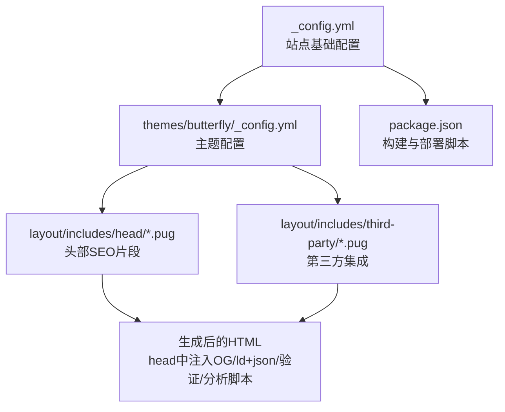
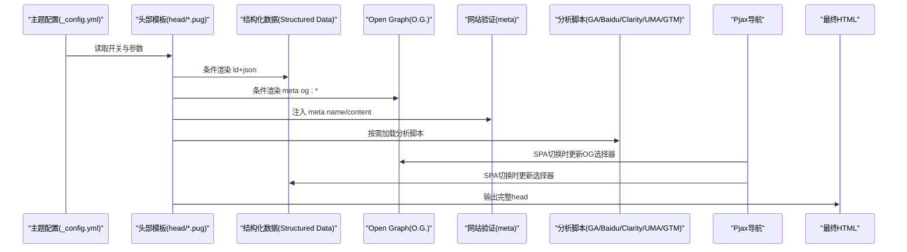
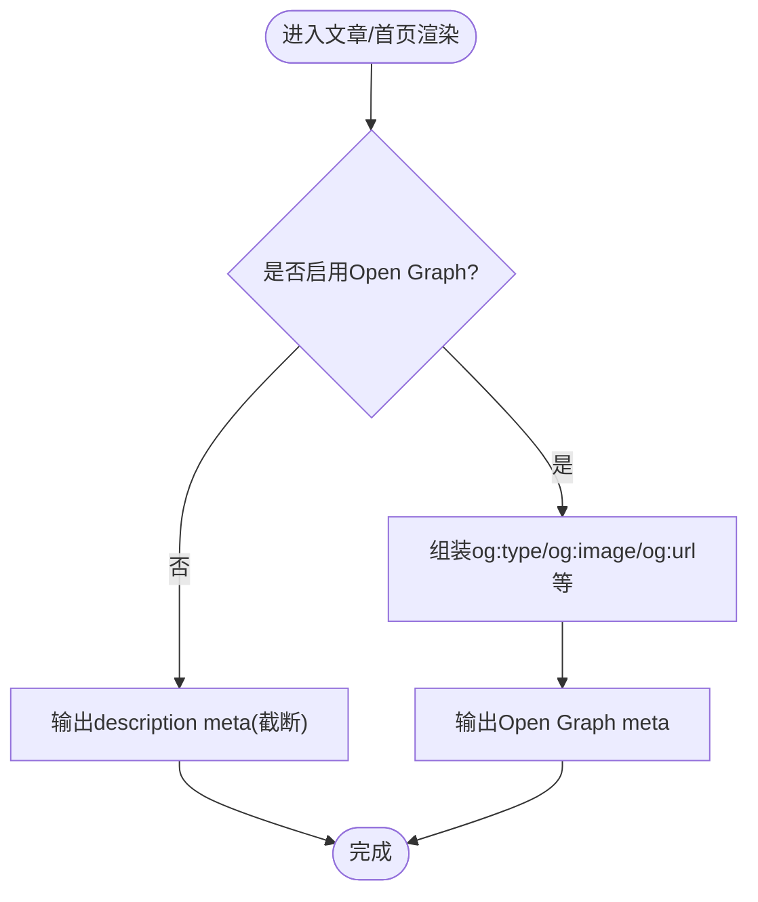
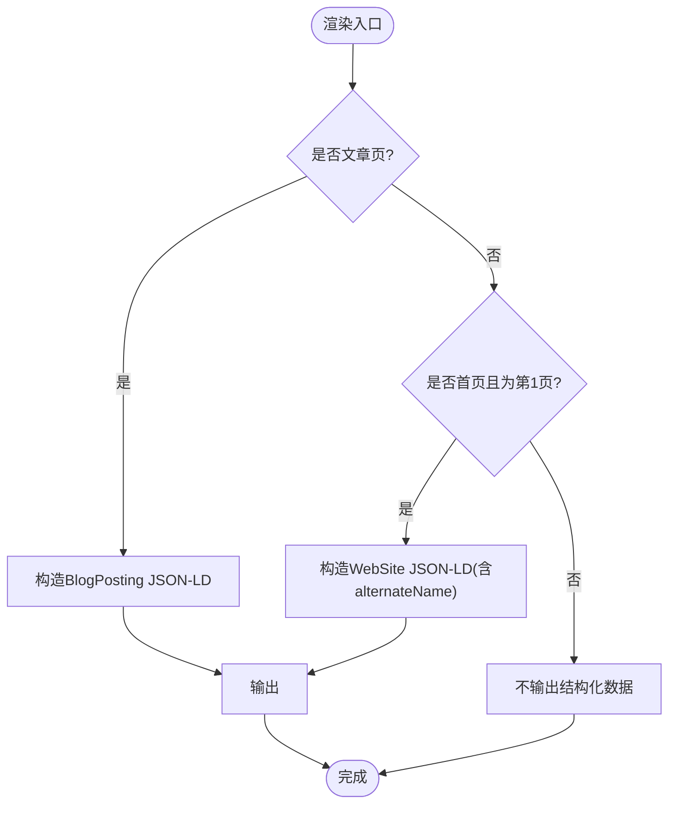
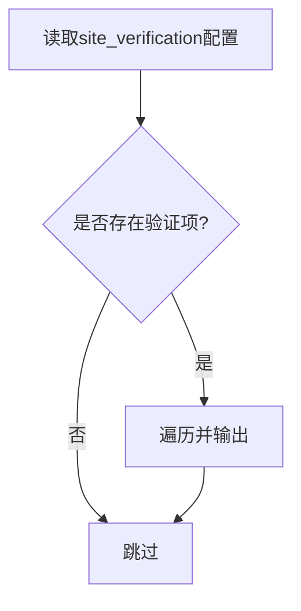
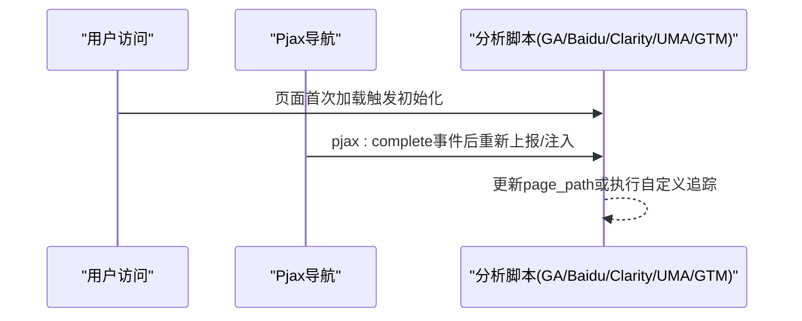
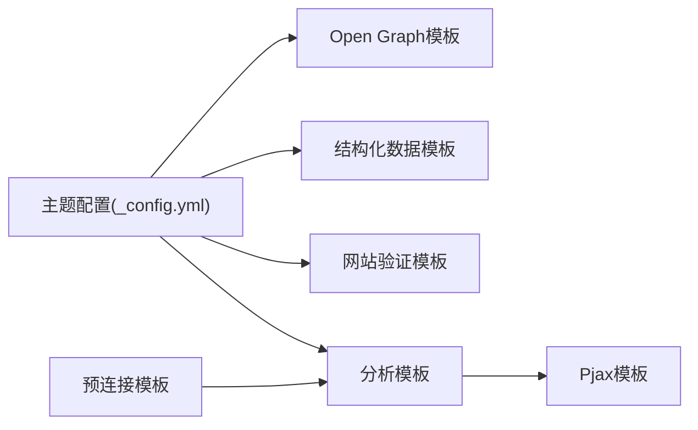

# SEO优化

<cite>
**本文引用的文件**
- [_config.yml](file://_config.yml)
- [package.json](file://package.json)
- [themes/butterfly/_config.yml](file://themes/butterfly/_config.yml)
- [themes/butterfly/layout/includes/head/Open_Graph.pug](file://themes/butterfly/layout/includes/head/Open_Graph.pug)
- [themes/butterfly/layout/includes/head/structured_data.pug](file://themes/butterfly/layout/includes/head/structured_data.pug)
- [themes/butterfly/layout/includes/head/site_verification.pug](file://themes/butterfly/layout/includes/head/site_verification.pug)
- [themes/butterfly/layout/includes/head/analytics.pug](file://themes/butterfly/layout/includes/head/analytics.pug)
- [themes/butterfly/layout/includes/head/preconnect.pug](file://themes/butterfly/layout/includes/head/preconnect.pug)
- [themes/butterfly/layout/includes/third-party/pjax.pug](file://themes/butterfly/layout/includes/third-party/pjax.pug)
- [themes/butterfly/layout/includes/third-party/umami_analytics.pug](file://themes/butterfly/layout/includes/third-party/umami_analytics.pug)
- [themes/butterfly/layout/includes/head/google_adsense.pug](file://themes/butterfly/layout/includes/head/google_adsense.pug)
</cite>

## 目录
1. [简介](#简介)
2. [项目结构](#项目结构)
3. [核心组件](#核心组件)
4. [架构总览](#架构总览)
5. [详细组件分析](#详细组件分析)
6. [依赖关系分析](#依赖关系分析)
7. [性能考量](#性能考量)
8. [故障排查指南](#故障排查指南)
9. [结论](#结论)
10. [附录](#附录)

## 简介
本指南面向dzc-blog（基于Hexo与Butterfly主题）的SEO优化实践，围绕以下目标展开：  
- Open Graph元标签配置与社交分享优化  
- 结构化数据（Schema.org/ld+json）标记  
- 网站验证（Google Search Console、百度站长平台等）  
- HTML头部优化（meta标签、description、关键词策略）  
- URL结构与可爬取性（永久链接、静态化）  
- 站点地图与robots.txt建议（与部署端配合）  
- 分析工具集成（Google Analytics、百度统计、Cloudflare、Microsoft Clarity、Google Tag Manager、Umami）  
- 实际测试方法与性能评估指标  

## 项目结构
本项目采用Hexo静态站点 + Butterfly主题的组合。SEO相关能力主要由主题模板在页面头部注入，结合Hexo配置控制URL结构与部署方式。

图表来源
- [_config.yml:14-21](file://_config.yml#L14-L21)
- [themes/butterfly/_config.yml:687-722](file://themes/butterfly/_config.yml#L687-L722)
- [themes/butterfly/layout/includes/head/Open_Graph.pug:1-16](file://themes/butterfly/layout/includes/head/Open_Graph.pug#L1-L16)
- [themes/butterfly/layout/includes/head/structured_data.pug:1-67](file://themes/butterfly/layout/includes/head/structured_data.pug#L1-L67)
- [themes/butterfly/layout/includes/head/site_verification.pug:1-3](file://themes/butterfly/layout/includes/head/site_verification.pug#L1-L3)
- [themes/butterfly/layout/includes/head/analytics.pug:1-45](file://themes/butterfly/layout/includes/head/analytics.pug#L1-L45)
- [themes/butterfly/layout/includes/third-party/pjax.pug:1-73](file://themes/butterfly/layout/includes/third-party/pjax.pug#L1-L73)

章节来源
- [_config.yml:14-21](file://_config.yml#L14-L21)
- [package.json:1-29](file://package.json#L1-L29)

## 核心组件
- Open Graph元标签：根据页面类型动态输出og:type、og:image、og:url等，或回退到description meta。
- 结构化数据：针对文章页输出BlogPosting，针对首页输出WebSite，增强搜索结果丰富展示。
- 网站验证：通过meta name/content键值对注入验证信息。
- 分析工具：支持百度统计、Google Analytics、Cloudflare、Microsoft Clarity、Google Tag Manager、Umami。
- 预连接优化：为CDN与分析服务建立预连接，提升首包速度。
- URL结构：由Hexo配置控制永久链接格式与静态化行为。

章节来源
- [themes/butterfly/layout/includes/head/Open_Graph.pug:1-16](file://themes/butterfly/layout/includes/head/Open_Graph.pug#L1-L16)
- [themes/butterfly/layout/includes/head/structured_data.pug:1-67](file://themes/butterfly/layout/includes/head/structured_data.pug#L1-L67)
- [themes/butterfly/layout/includes/head/site_verification.pug:1-3](file://themes/butterfly/layout/includes/head/site_verification.pug#L1-L3)
- [themes/butterfly/layout/includes/head/analytics.pug:1-45](file://themes/butterfly/layout/includes/head/analytics.pug#L1-L45)
- [themes/butterfly/layout/includes/head/preconnect.pug:1-35](file://themes/butterfly/layout/includes/head/preconnect.pug#L1-L35)
- [_config.yml:14-21](file://_config.yml#L14-L21)

## 架构总览
下图展示了从主题配置到页面渲染的关键流程：主题配置决定是否启用某项功能；模板在head中注入相应HTML片段；Pjax在SPA式导航时同步更新OG/ld+json等。

图表来源
- [themes/butterfly/_config.yml:687-722](file://themes/butterfly/_config.yml#L687-L722)
- [themes/butterfly/layout/includes/head/structured_data.pug:1-67](file://themes/butterfly/layout/includes/head/structured_data.pug#L1-L67)
- [themes/butterfly/layout/includes/head/Open_Graph.pug:1-16](file://themes/butterfly/layout/includes/head/Open_Graph.pug#L1-L16)
- [themes/butterfly/layout/includes/head/site_verification.pug:1-3](file://themes/butterfly/layout/includes/head/site_verification.pug#L1-L3)
- [themes/butterfly/layout/includes/head/analytics.pug:1-45](file://themes/butterfly/layout/includes/head/analytics.pug#L1-L45)
- [themes/butterfly/layout/includes/third-party/pjax.pug:6-16](file://themes/butterfly/layout/includes/third-party/pjax.pug#L6-L16)

## 详细组件分析

### Open Graph元标签配置
- 功能要点
  - 当开启Open Graph开关时，按页面类型输出og:type（文章/网站），并使用封面或头像作为og:image，必要时附加Facebook相关参数。
  - 若未开启，则回退输出description meta（截断至约150字符）。
- 关键路径
  - 开关与选项：[themes/butterfly/_config.yml:687-722](file://themes/butterfly/_config.yml#L687-L722)
  - 渲染逻辑：[themes/butterfly/layout/includes/head/Open_Graph.pug:1-16](file://themes/butterfly/layout/includes/head/Open_Graph.pug#L1-L16)

图表来源
- [themes/butterfly/layout/includes/head/Open_Graph.pug:1-16](file://themes/butterfly/layout/includes/head/Open_Graph.pug#L1-L16)

章节来源
- [themes/butterfly/layout/includes/head/Open_Graph.pug:1-16](file://themes/butterfly/layout/includes/head/Open_Graph.pug#L1-L16)
- [themes/butterfly/_config.yml:687-722](file://themes/butterfly/_config.yml#L687-L722)

### 结构化数据（Schema.org）
- 功能要点
  - 文章页：输出BlogPosting，包含标题、URL、图片、发布时间、修改时间、作者信息。
  - 首页（第一页）：当为根路径或子域名时，输出WebSite，包含备用名称（副标题、域名）。
  - 所有结构化数据以application/ld+json形式注入。
- 关键路径
  - 渲染逻辑：[themes/butterfly/layout/includes/head/structured_data.pug:1-67](file://themes/butterfly/layout/includes/head/structured_data.pug#L1-L67)

图表来源
- [themes/butterfly/layout/includes/head/structured_data.pug:1-67](file://themes/butterfly/layout/includes/head/structured_data.pug#L1-L67)

章节来源
- [themes/butterfly/layout/includes/head/structured_data.pug:1-67](file://themes/butterfly/layout/includes/head/structured_data.pug#L1-L67)

### 网站验证设置
- 功能要点
  - 支持在主题配置中以数组形式提供多个meta name/content键值对，用于Google Search Console、百度站长平台等验证。
- 关键路径
  - 配置项：[themes/butterfly/_config.yml:746-754](file://themes/butterfly/_config.yml#L746-L754)
  - 渲染逻辑：[themes/butterfly/layout/includes/head/site_verification.pug:1-3](file://themes/butterfly/layout/includes/head/site_verification.pug#L1-L3)

图表来源
- [themes/butterfly/layout/includes/head/site_verification.pug:1-3](file://themes/butterfly/layout/includes/head/site_verification.pug#L1-L3)
- [themes/butterfly/_config.yml:746-754](file://themes/butterfly/_config.yml#L746-L754)

章节来源
- [themes/butterfly/layout/includes/head/site_verification.pug:1-3](file://themes/butterfly/layout/includes/head/site_verification.pug#L1-L3)
- [themes/butterfly/_config.yml:746-754](file://themes/butterfly/_config.yml#L746-L754)

### HTML头部优化（meta标签、description、关键词）
- meta标签与描述
  - Open Graph开启时优先输出og:*；否则回退输出description meta（内容截断）。
- 关键词优化策略
  - 建议在文章front-matter中合理设置关键词，避免堆砌；与description形成互补。
  - 全局关键词列表可在站点配置中维护，但更推荐按文章粒度精细化。
- 关键路径
  - 描述回退逻辑：[themes/butterfly/layout/includes/head/Open_Graph.pug:12-16](file://themes/butterfly/layout/includes/head/Open_Graph.pug#L12-L16)
  - 站点关键词列表：[_config.yml](file://_config.yml#L9)

章节来源
- [themes/butterfly/layout/includes/head/Open_Graph.pug:12-16](file://themes/butterfly/layout/includes/head/Open_Graph.pug#L12-L16)
- [_config.yml](file://_config.yml#L9)

### URL结构优化
- 永久链接与静态化
  - 永久链接格式：支持按年/月/日/标题生成层级URL。
  - 静态化：可配置去除末尾“index.html”或“.html”，影响爬虫抓取与去重。
- 关键路径
  - 配置项：[_config.yml:17-21](file://_config.yml#L17-L21)

章节来源
- [_config.yml:17-21](file://_config.yml#L17-L21)

### 站点地图与robots.txt
- 站点地图
  - 推荐使用Hexo插件生成sitemap（如hexo-generator-sitemap），在主题或部署层输出至根目录。
- robots.txt
  - 建议在public目录或GitHub Pages根目录放置robots.txt，声明sitemap位置与爬取规则。
- 说明
  - 本仓库未包含上述文件，需在部署阶段补充。

[本节为通用实践说明，不直接分析具体文件，故无章节来源]

### 分析工具集成
- 支持的分析平台
  - 百度统计、Google Analytics、Cloudflare、Microsoft Clarity、Google Tag Manager、Umami。
- 集成方式
  - 在主题配置中填写对应ID；模板条件渲染脚本，并在Pjax切换后重新上报。
- 关键路径
  - 配置项：[themes/butterfly/_config.yml:687-722](file://themes/butterfly/_config.yml#L687-L722)
  - 渲染逻辑：[themes/butterfly/layout/includes/head/analytics.pug:1-45](file://themes/butterfly/layout/includes/head/analytics.pug#L1-L45)
  - Umami集成：[themes/butterfly/layout/includes/third-party/umami_analytics.pug:1-110](file://themes/butterfly/layout/includes/third-party/umami_analytics.pug#L1-L110)
  - Pjax联动：[themes/butterfly/layout/includes/third-party/pjax.pug:6-28](file://themes/butterfly/layout/includes/third-party/pjax.pug#L6-L28)

图表来源
- [themes/butterfly/layout/includes/head/analytics.pug:14-23](file://themes/butterfly/layout/includes/head/analytics.pug#L14-L23)
- [themes/butterfly/layout/includes/third-party/pjax.pug:19-64](file://themes/butterfly/layout/includes/third-party/pjax.pug#L19-L64)
- [themes/butterfly/layout/includes/third-party/umami_analytics.pug:99-100](file://themes/butterfly/layout/includes/third-party/umami_analytics.pug#L99-L100)

章节来源
- [themes/butterfly/layout/includes/head/analytics.pug:1-45](file://themes/butterfly/layout/includes/head/analytics.pug#L1-L45)
- [themes/butterfly/layout/includes/third-party/umami_analytics.pug:1-110](file://themes/butterfly/layout/includes/third-party/umami_analytics.pug#L1-L110)
- [themes/butterfly/layout/includes/third-party/pjax.pug:1-73](file://themes/butterfly/layout/includes/third-party/pjax.pug#L1-L73)

### 广告与SEO协同
- Google AdSense
  - 可按主题配置自动插入广告脚本与页面级广告开关。
- 注意事项
  - 广告位布局与加载时机需与分析脚本协调，避免阻塞首屏。
- 关键路径
  - [themes/butterfly/layout/includes/head/google_adsense.pug:1-9](file://themes/butterfly/layout/includes/head/google_adsense.pug#L1-L9)

章节来源
- [themes/butterfly/layout/includes/head/google_adsense.pug:1-9](file://themes/butterfly/layout/includes/head/google_adsense.pug#L1-L9)

## 依赖关系分析
- 主题配置驱动模板渲染：主题配置中的各项开关与参数直接影响head中OG、ld+json、验证、分析脚本的输出。
- Pjax与分析联动：Pjax在SPA导航时会重新注入脚本与更新OG/ld+json选择器，确保分析上报与元标签一致性。
- 预连接优化：针对CDN与分析服务建立预连接，减少DNS与TLS开销，提升首包速度。

图表来源
- [themes/butterfly/_config.yml:687-722](file://themes/butterfly/_config.yml#L687-L722)
- [themes/butterfly/layout/includes/head/Open_Graph.pug:1-16](file://themes/butterfly/layout/includes/head/Open_Graph.pug#L1-L16)
- [themes/butterfly/layout/includes/head/structured_data.pug:1-67](file://themes/butterfly/layout/includes/head/structured_data.pug#L1-L67)
- [themes/butterfly/layout/includes/head/site_verification.pug:1-3](file://themes/butterfly/layout/includes/head/site_verification.pug#L1-L3)
- [themes/butterfly/layout/includes/head/analytics.pug:1-45](file://themes/butterfly/layout/includes/head/analytics.pug#L1-L45)
- [themes/butterfly/layout/includes/head/preconnect.pug:1-35](file://themes/butterfly/layout/includes/head/preconnect.pug#L1-L35)
- [themes/butterfly/layout/includes/third-party/pjax.pug:6-16](file://themes/butterfly/layout/includes/third-party/pjax.pug#L6-L16)

章节来源
- [themes/butterfly/_config.yml:687-722](file://themes/butterfly/_config.yml#L687-L722)
- [themes/butterfly/layout/includes/head/preconnect.pug:1-35](file://themes/butterfly/layout/includes/head/preconnect.pug#L1-L35)
- [themes/butterfly/layout/includes/third-party/pjax.pug:6-16](file://themes/butterfly/layout/includes/third-party/pjax.pug#L6-L16)

## 性能考量
- 预连接（Preconnect）
  - 对CDN与分析服务建立预连接，降低DNS查询与TLS握手延迟。
  - 关键路径：[themes/butterfly/layout/includes/head/preconnect.pug:1-35](file://themes/butterfly/layout/includes/head/preconnect.pug#L1-L35)
- Pjax导航
  - 减少整页刷新，仅替换关键区域，提高交互流畅度；同时在pjax:complete事件中重新上报分析与更新OG/ld+json。
  - 关键路径：[themes/butterfly/layout/includes/third-party/pjax.pug:19-64](file://themes/butterfly/layout/includes/third-party/pjax.pug#L19-L64)
- 首屏加载
  - 将分析脚本置于非阻塞模式（defer/async），避免阻塞渲染。
  - 关键路径：[themes/butterfly/layout/includes/head/analytics.pug:14-23](file://themes/butterfly/layout/includes/head/analytics.pug#L14-L23)

章节来源
- [themes/butterfly/layout/includes/head/preconnect.pug:1-35](file://themes/butterfly/layout/includes/head/preconnect.pug#L1-L35)
- [themes/butterfly/layout/includes/third-party/pjax.pug:19-64](file://themes/butterfly/layout/includes/third-party/pjax.pug#L19-L64)
- [themes/butterfly/layout/includes/head/analytics.pug:14-23](file://themes/butterfly/layout/includes/head/analytics.pug#L14-L23)

## 故障排查指南
- Open Graph未生效
  - 检查主题配置中Open Graph开关是否开启，确认页面封面或头像可用。
  - 关键路径：[themes/butterfly/_config.yml:687-722](file://themes/butterfly/_config.yml#L687-L722)
- 结构化数据缺失
  - 确认当前页面类型与首页判断逻辑；仅在文章页与首页第1页输出。
  - 关键路径：[themes/butterfly/layout/includes/head/structured_data.pug:1-67](file://themes/butterfly/layout/includes/head/structured_data.pug#L1-L67)
- 分析脚本未上报
  - 检查Pjax是否正确注入选择器；确认pjax:complete事件回调是否执行。
  - 关键路径：[themes/butterfly/layout/includes/third-party/pjax.pug:19-64](file://themes/butterfly/layout/includes/third-party/pjax.pug#L19-L64)
- 验证失败
  - 确认site_verification配置项格式正确，meta name/content键值对与平台要求一致。
  - 关键路径：[themes/butterfly/layout/includes/head/site_verification.pug:1-3](file://themes/butterfly/layout/includes/head/site_verification.pug#L1-L3)

章节来源
- [themes/butterfly/layout/includes/head/structured_data.pug:1-67](file://themes/butterfly/layout/includes/head/structured_data.pug#L1-L67)
- [themes/butterfly/layout/includes/third-party/pjax.pug:19-64](file://themes/butterfly/layout/includes/third-party/pjax.pug#L19-L64)
- [themes/butterfly/layout/includes/head/site_verification.pug:1-3](file://themes/butterfly/layout/includes/head/site_verification.pug#L1-L3)

## 结论
通过合理配置主题与Hexo配置，dzc-blog已具备完善的SEO基础能力：OG元标签、结构化数据、网站验证与多平台分析工具集成。建议在部署阶段补充sitemap与robots.txt，并持续关注Pjax与分析脚本的联动效果，以获得更佳的搜索可见性与用户体验。

## 附录
- 实际测试方法
  - 使用浏览器开发者工具检查head中是否包含预期的meta/ld+json/验证/分析脚本。
  - 使用Google Rich Results Test、Facebook Sharing Debugger、Twitter Card Validator等工具验证结构化数据与OG效果。
  - 使用Google Search Console、百度搜索资源平台监控索引状态与覆盖率。
- 性能评估指标
  - 首字节时间（TTFB）、首屏渲染时间（FCP/LCP）、交互就绪时间（INP）。
  - 分析工具中的页面平均停留时长、跳出率、转化路径（如适用）。

[本节为通用实践说明，不直接分析具体文件，故无章节来源]