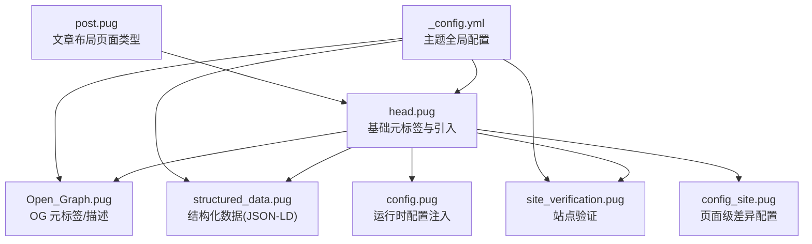
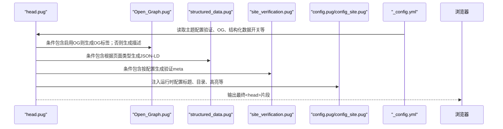
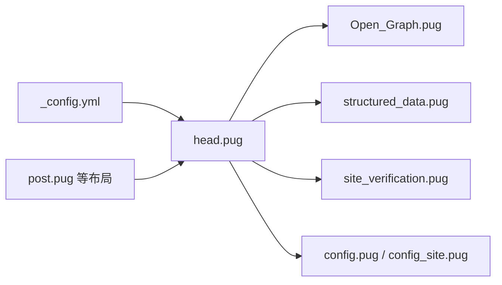

# 元标签配置

<cite>
**本文引用的文件**
- [head.pug](file://themes/butterfly/layout/includes/head.pug)
- [Open_Graph.pug](file://themes/butterfly/layout/includes/head/Open_Graph.pug)
- [structured_data.pug](file://themes/butterfly/layout/includes/head/structured_data.pug)
- [site_verification.pug](file://themes/butterfly/layout/includes/head/site_verification.pug)
- [_config.yml（主题）](file://themes/butterfly/_config.yml)
- [config.pug](file://themes/butterfly/layout/includes/head/config.pug)
- [config_site.pug](file://themes/butterfly/layout/includes/head/config_site.pug)
- [post.pug](file://themes/butterfly/layout/post.pug)
</cite>

## 目录
1. [简介](#简介)
2. [项目结构](#项目结构)
3. [核心组件](#核心组件)
4. [架构总览](#架构总览)
5. [详细组件分析](#详细组件分析)
6. [依赖关系分析](#依赖关系分析)
7. [性能考量](#性能考量)
8. [故障排查指南](#故障排查指南)
9. [结论](#结论)
10. [附录：Front-matter 覆盖与最佳实践](#附录front-matter-覆盖与最佳实践)

## 简介
本指南聚焦于 dzb-blog 使用的 Butterfly 主题中 HTML 头部元标签的配置与影响，涵盖基础元标签（字符集、视口、兼容性声明）、描述与关键词策略、搜索引擎抓取影响、不同页面类型的差异化配置、通过 Front-matter 覆盖全局配置的方法，以及跨浏览器兼容性处理建议。内容基于主题模板与配置文件的实际实现进行梳理，帮助读者在不直接阅读代码的前提下完成高质量的 SEO 与可访问性配置。

## 项目结构
与元标签配置直接相关的关键位置如下：
- 基础头部与通用元标签：themes/butterfly/layout/includes/head.pug
- Open Graph 与结构化数据：themes/butterfly/layout/includes/head/Open_Graph.pug、themes/butterfly/layout/includes/head/structured_data.pug
- 站点验证与站点地图：themes/butterfly/layout/includes/head/site_verification.pug
- 主题配置入口：themes/butterfly/_config.yml
- 页面级差异与运行时配置注入：themes/butterfly/layout/includes/head/config.pug、themes/butterfly/layout/includes/head/config_site.pug
- 文章布局（用于理解页面类型与元标签差异）：themes/butterfly/layout/post.pug

图表来源
- [head.pug:1-78](file://themes/butterfly/layout/includes/head.pug#L1-L78)
- [Open_Graph.pug:1-17](file://themes/butterfly/layout/includes/head/Open_Graph.pug#L1-L17)
- [structured_data.pug:1-68](file://themes/butterfly/layout/includes/head/structured_data.pug#L1-L68)
- [site_verification.pug:1-3](file://themes/butterfly/layout/includes/head/site_verification.pug#L1-L3)
- [config.pug:1-126](file://themes/butterfly/layout/includes/head/config.pug#L1-L126)
- [config_site.pug:1-26](file://themes/butterfly/layout/includes/head/config_site.pug#L1-L26)
- [_config.yml（主题）:1036-1056](file://themes/butterfly/_config.yml#L1036-L1056)
- [post.pug:1-36](file://themes/butterfly/layout/post.pug#L1-L36)

章节来源
- [head.pug:1-78](file://themes/butterfly/layout/includes/head.pug#L1-L78)
- [_config.yml（主题）:1036-1056](file://themes/butterfly/_config.yml#L1036-L1056)

## 核心组件
- 基础元标签（head.pug）
  - 字符集、视口、X-UA-Compatible、作者、版权、格式检测、主题色等
  - 引入 Open Graph、结构化数据、站点验证、PWA、分析脚本、字体与样式等
- Open Graph（Open_Graph.pug）
  - 控制是否启用主题内置 OG，或回退到自动生成 description
- 结构化数据（structured_data.pug）
  - 在首页根路径输出 WebSite，文章页输出 BlogPosting 的 JSON-LD
- 站点验证（site_verification.pug）
  - 将配置中的 name/content 对应生成 meta 验证标签
- 运行时配置（config.pug、config_site.pug）
  - 将主题配置与页面变量注入到前端 JS，支持页面级差异（如标题、目录显示、高亮收缩）

章节来源
- [head.pug:22-30](file://themes/butterfly/layout/includes/head.pug#L22-L30)
- [Open_Graph.pug:1-17](file://themes/butterfly/layout/includes/head/Open_Graph.pug#L1-L17)
- [structured_data.pug:1-68](file://themes/butterfly/layout/includes/head/structured_data.pug#L1-L68)
- [site_verification.pug:1-3](file://themes/butterfly/layout/includes/head/site_verification.pug#L1-L3)
- [config.pug:86-126](file://themes/butterfly/layout/includes/head/config.pug#L86-L126)
- [config_site.pug:19-26](file://themes/butterfly/layout/includes/head/config_site.pug#L19-L26)

## 架构总览
下图展示了页面渲染时元标签的生成流程与依赖关系：

图表来源
- [head.pug:31-78](file://themes/butterfly/layout/includes/head.pug#L31-L78)
- [Open_Graph.pug:1-17](file://themes/butterfly/layout/includes/head/Open_Graph.pug#L1-L17)
- [structured_data.pug:1-68](file://themes/butterfly/layout/includes/head/structured_data.pug#L1-L68)
- [site_verification.pug:1-3](file://themes/butterfly/layout/includes/head/site_verification.pug#L1-L3)
- [config.pug:86-126](file://themes/butterfly/layout/includes/head/config.pug#L86-L126)
- [config_site.pug:19-26](file://themes/butterfly/layout/includes/head/config_site.pug#L19-L26)
- [_config.yml（主题）:1036-1056](file://themes/butterfly/_config.yml#L1036-L1056)

## 详细组件分析

### 基础元标签（head.pug）
- 字符集与兼容性
  - charset 设置为 UTF-8
  - X-UA-Compatible 设为 IE=edge，确保以现代模式渲染
- 视口与主题色
  - viewport 含设备宽度、初始缩放与安全区域适配
  - theme-color 根据当前显示模式选择浅/深主题色
- 页面信息
  - author、copyright、format-detection（电话号码自动识别关闭）
  - canonical 链接与 favicon
- 组件化引入
  - OG、结构化数据、预连接、站点验证、PWA、样式、分析、广告、注入脚本等

章节来源
- [head.pug:22-30](file://themes/butterfly/layout/includes/head.pug#L22-L30)
- [head.pug:37-78](file://themes/butterfly/layout/includes/head.pug#L37-L78)

### Open Graph 与描述生成（Open_Graph.pug）
- OG 开关控制
  - 当开启时，使用主题提供的选项生成完整的 Open Graph 标签集合
  - 关闭时，回退到从页面描述、内容或标题截断生成 description（长度约 150 字符）
- 图片与类型
  - 文章页默认类型为 article，封面优先使用页面封面，否则回退到头像
  - 支持 Facebook 应用与管理员 ID 注入

章节来源
- [Open_Graph.pug:1-17](file://themes/butterfly/layout/includes/head/Open_Graph.pug#L1-L17)

### 结构化数据（structured_data.pug）
- 文章页（post）
  - 生成 BlogPosting JSON-LD，包含标题、URL、图片、发布时间、修改时间、作者信息
- 首页（根路径）
  - 生成 WebSite JSON-LD，名称为主题标题，备用名可包含副标题与域名
- 生成条件
  - 仅在主题配置启用且满足页面类型时输出

章节来源
- [structured_data.pug:1-68](file://themes/butterfly/layout/includes/head/structured_data.pug#L1-L68)

### 站点验证（site_verification.pug）
- 读取主题配置中的验证列表，逐项生成对应 meta 标签
- 常见用途：Google、百度、Bing、Yandex 等平台的站点所有权验证

章节来源
- [site_verification.pug:1-3](file://themes/butterfly/layout/includes/head/site_verification.pug#L1-L3)
- [_config.yml（主题）:746-756](file://themes/butterfly/_config.yml#L746-L756)

### 运行时配置注入（config.pug、config_site.pug）
- config.pug
  - 将搜索、翻译、复制版权、高亮、日期格式、主题 Snackbar 等配置注入到前端 JS 变量
- config_site.pug
  - 将页面标题、高亮收缩、目录显示、页面类型等注入到前端 SITE 配置

章节来源
- [config.pug:86-126](file://themes/butterfly/layout/includes/head/config.pug#L86-L126)
- [config_site.pug:19-26](file://themes/butterfly/layout/includes/head/config_site.pug#L19-L26)

## 依赖关系分析
- head.pug 是元标签生成的中枢，依赖以下模块：
  - Open Graph 或回退描述
  - 结构化数据（JSON-LD）
  - 站点验证
  - 分析与广告脚本（由其他模块引入）
  - 运行时配置注入
- 主题配置（_config.yml）决定上述模块的启用与参数
- 页面类型（来自 post.pug 等布局）影响目录显示、OG 类型等

图表来源
- [head.pug:31-78](file://themes/butterfly/layout/includes/head.pug#L31-L78)
- [Open_Graph.pug:1-17](file://themes/butterfly/layout/includes/head/Open_Graph.pug#L1-L17)
- [structured_data.pug:1-68](file://themes/butterfly/layout/includes/head/structured_data.pug#L1-L68)
- [site_verification.pug:1-3](file://themes/butterfly/layout/includes/head/site_verification.pug#L1-L3)
- [config.pug:86-126](file://themes/butterfly/layout/includes/head/config.pug#L86-L126)
- [config_site.pug:19-26](file://themes/butterfly/layout/includes/head/config_site.pug#L19-L26)
- [post.pug:1-36](file://themes/butterfly/layout/post.pug#L1-L36)
- [_config.yml（主题）:1036-1056](file://themes/butterfly/_config.yml#L1036-L1056)

## 性能考量
- 预连接与延迟加载
  - 预连接（preconnect）有助于加速第三方资源加载
  - 部分外部样式采用媒体查询延迟加载，减少阻塞
- 分析脚本异步与按需加载
  - Google Analytics、百度统计等脚本采用异步或延迟加载方式
- 结构化数据与验证标签体积小，对首屏影响有限

章节来源
- [head.pug:40-78](file://themes/butterfly/layout/includes/head.pug#L40-L78)
- [analytics.pug:14-45](file://themes/butterfly/layout/includes/head/analytics.pug#L14-L45)

## 故障排查指南
- 描述未生效
  - 若未启用 Open Graph，将回退到从页面描述、内容或标题截断生成 description
  - 检查页面是否存在 description 字段或内容足够长
- OG 标签缺失
  - 确认主题已开启 Open Graph，并检查封面字段是否正确
- 结构化数据无效
  - 确认主题已启用结构化数据，且页面类型符合生成条件（文章页/首页根路径）
- 验证标签未出现
  - 检查主题配置中的验证列表是否填写正确
- 主题色不生效
  - 确认主题配置了浅/深主题色，且页面处于相应显示模式

章节来源
- [Open_Graph.pug:12-16](file://themes/butterfly/layout/includes/head/Open_Graph.pug#L12-L16)
- [structured_data.pug:34-63](file://themes/butterfly/layout/includes/head/structured_data.pug#L34-L63)
- [site_verification.pug:1-3](file://themes/butterfly/layout/includes/head/site_verification.pug#L1-L3)
- [head.pug:18-29](file://themes/butterfly/layout/includes/head.pug#L18-L29)
- [_config.yml（主题）:1036-1056](file://themes/butterfly/_config.yml#L1036-L1056)

## 结论
本指南基于 Butterfly 主题的实现，系统梳理了 dzb-blog 中 HTML 头部元标签的生成逻辑与配置要点。通过合理设置基础元标签、OG 与结构化数据、站点验证，结合主题配置与页面级差异，可以有效提升搜索引擎抓取质量与跨浏览器兼容性。建议在不同页面类型中遵循差异化策略，并通过 Front-matter 覆盖必要字段，以获得更优的 SEO 与用户体验。

## 附录：Front-matter 覆盖与最佳实践

### 通过 Front-matter 覆盖全局配置
- 页面级差异
  - 标题、描述、封面、目录显示、高亮收缩等可通过页面 Front-matter 覆盖主题全局配置
  - 示例覆盖点（以路径代替具体代码）：
    - [config_site.pug:2-7](file://themes/butterfly/layout/includes/head/config_site.pug#L2-L7)：高亮收缩优先使用页面布尔值
    - [head.pug:14-16](file://themes/butterfly/layout/includes/head.pug#L14-L16)：页面标题与副标题组合
- 页面类型影响
  - 不同布局（文章、归档、分类、标签、404）会改变标题文案与部分元标签行为
  - 示例参考：
    - [head.pug:3-11](file://themes/butterfly/layout/includes/head.pug#L3-L11)
    - [post.pug:1-36](file://themes/butterfly/layout/post.pug#L1-L36)

章节来源
- [config_site.pug:2-7](file://themes/butterfly/layout/includes/head/config_site.pug#L2-L7)
- [head.pug:14-16](file://themes/butterfly/layout/includes/head.pug#L14-L16)
- [head.pug:3-11](file://themes/butterfly/layout/includes/head.pug#L3-L11)
- [post.pug:1-36](file://themes/butterfly/layout/post.pug#L1-L36)

### 基础元标签配置策略
- 字符集与兼容性
  - 建议保持 UTF-8 与 IE=edge，确保多语言与旧版 IE 的兼容性
- 视口
  - 建议保留初始缩放与安全区域适配，保证移动端体验
- 主题色
  - 建议为浅/深主题分别配置颜色，确保与品牌一致

章节来源
- [head.pug:22-29](file://themes/butterfly/layout/includes/head.pug#L22-L29)
- [_config.yml（主题）:759-780](file://themes/butterfly/_config.yml#L759-L780)

### description 与 keywords 设置策略
- description 生成策略
  - 启用 Open Graph 时，由主题生成完整 OG 标签
  - 关闭时，从页面描述、内容或标题截断生成（长度约 150 字符）
- keywords
  - 主题未内置 keywords 自动生成逻辑，建议在页面 Front-matter 中手动设置或通过插件扩展
- 对搜索引擎的影响
  - description 影响 SERP 展示与点击率
  - keywords 在现代搜索引擎中重要性降低，建议专注内容质量与结构化数据

章节来源
- [Open_Graph.pug:12-16](file://themes/butterfly/layout/includes/head/Open_Graph.pug#L12-L16)
- [_config.yml（主题）:1036-1056](file://themes/butterfly/_config.yml#L1036-L1056)

### 不同页面类型的元标签差异化配置
- 文章页（post）
  - 类型为 article，OG 图片优先使用文章封面
  - 输出 BlogPosting 结构化数据
- 首页（根路径）
  - 输出 WebSite 结构化数据，备用名为副标题与域名
- 归档/分类/标签/404
  - 标题文案按页面类型定制，OG 与结构化数据按规则生成

章节来源
- [Open_Graph.pug:4-11](file://themes/butterfly/layout/includes/head/Open_Graph.pug#L4-L11)
- [structured_data.pug:34-63](file://themes/butterfly/layout/includes/head/structured_data.pug#L34-L63)
- [head.pug:3-11](file://themes/butterfly/layout/includes/head.pug#L3-L11)

### 浏览器兼容性处理
- X-UA-Compatible
  - 保持 IE=edge，避免降级渲染
- 视口与主题色
  - 现代浏览器普遍支持，注意暗色模式下的主题色切换
- 第三方脚本
  - 分析与广告脚本采用异步加载，减少对主线程的影响

章节来源
- [head.pug:22-29](file://themes/butterfly/layout/includes/head.pug#L22-L29)
- [analytics.pug:14-45](file://themes/butterfly/layout/includes/head/analytics.pug#L14-L45)