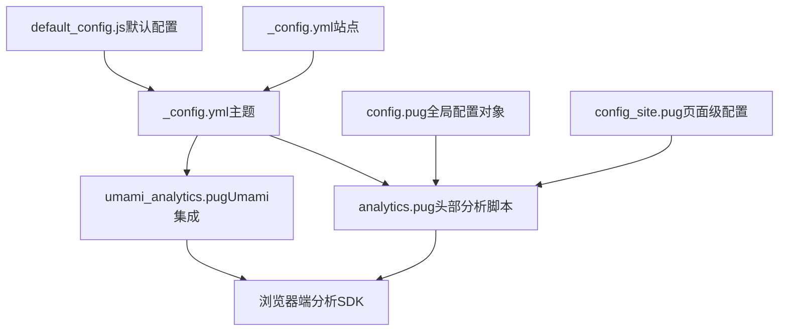
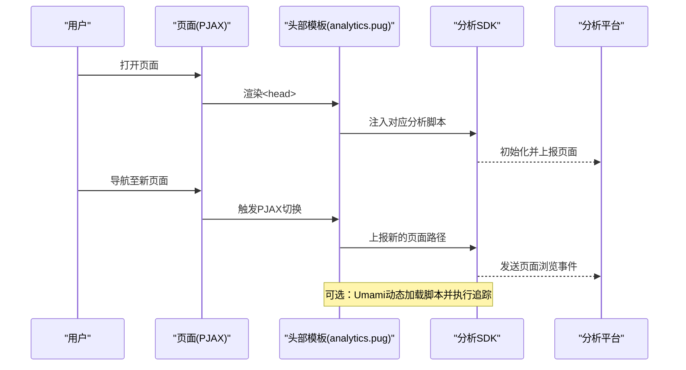
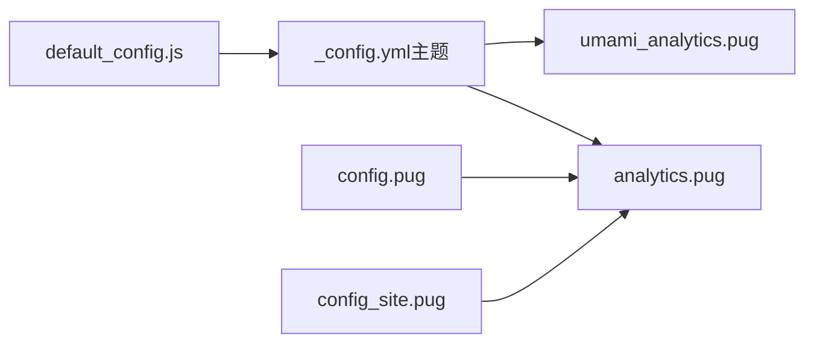

# 分析工具集成

<cite>
**本文引用的文件**
- [analytics.pug](file://themes/butterfly/layout/includes/head/analytics.pug)
- [umami_analytics.pug](file://themes/butterfly/layout/includes/third-party/umami_analytics.pug)
- [_config.yml（主题）](file://themes/butterfly/_config.yml)
- [_config.yml（站点）](file://_config.yml)
- [config.pug](file://themes/butterfly/layout/includes/head/config.pug)
- [config_site.pug](file://themes/butterfly/layout/includes/head/config_site.pug)
- [default_config.js](file://themes/butterfly/scripts/common/default_config.js)
- [structured_data.pug](file://themes/butterfly/layout/includes/head/structured_data.pug)
- [site_verification.pug](file://themes/butterfly/layout/includes/head/site_verification.pug)
</cite>

## 目录
1. [简介](#简介)
2. [项目结构](#项目结构)
3. [核心组件](#核心组件)
4. [架构总览](#架构总览)
5. [详细组件分析](#详细组件分析)
6. [依赖关系分析](#依赖关系分析)
7. [性能考量](#性能考量)
8. [故障排查指南](#故障排查指南)
9. [结论](#结论)
10. [附录](#附录)

## 简介
本指南面向dzc-blog（基于Butterfly主题）的分析工具集成，覆盖Google Analytics、百度统计、Cloudflare Analytics、Microsoft Clarity、Umami Analytics与Google Tag Manager的配置与使用。文档从配置参数、隐私保护、跨域跟踪、转化与事件跟踪、自定义变量、数据解读、SEO优化到性能影响进行系统化说明，并给出分析代码插入位置与加载时机优化策略。

## 项目结构
本项目的分析工具集成主要集中在Butterfly主题的头部模板与全局配置中：
- 头部分析脚本：在页面<head>中按条件注入各分析SDK
- 全局配置：主题配置文件提供各项分析工具的开关与参数
- 页面级配置：通过全局变量向分析脚本传递页面类型、标题等信息
- 结构化数据与站点验证：为SEO与搜索引擎验证提供支持

图表来源
- [analytics.pug:1-45](file://themes/butterfly/layout/includes/head/analytics.pug#L1-L45)
- [_config.yml（主题）:687-722](file://themes/butterfly/_config.yml#L687-L722)
- [config.pug:86-125](file://themes/butterfly/layout/includes/head/config.pug#L86-L125)
- [config_site.pug:19-25](file://themes/butterfly/layout/includes/head/config_site.pug#L19-L25)
- [default_config.js:397-417](file://themes/butterfly/scripts/common/default_config.js#L397-L417)

章节来源
- [analytics.pug:1-45](file://themes/butterfly/layout/includes/head/analytics.pug#L1-L45)
- [_config.yml（主题）:687-722](file://themes/butterfly/_config.yml#L687-L722)
- [config.pug:86-125](file://themes/butterfly/layout/includes/head/config.pug#L86-L125)
- [config_site.pug:19-25](file://themes/butterfly/layout/includes/head/config_site.pug#L19-L25)
- [default_config.js:397-417](file://themes/butterfly/scripts/common/default_config.js#L397-L417)

## 核心组件
- 分析脚本注入器（analytics.pug）
  - 条件性注入百度统计、Google Analytics、Cloudflare Analytics、Microsoft Clarity、Google Tag Manager
  - 在PJAX页面切换时触发页面路径上报
- Umami分析集成（umami_analytics.pug）
  - 支持云版与自托管版本，动态加载脚本并可选自动追踪
  - 提供站点/文章访问量展示的API调用与DOM更新
- 全局配置（config.pug、config_site.pug）
  - 构建GLOBAL_CONFIG与GLOBAL_CONFIG_SITE，向分析脚本传递页面类型、标题等信息
- 默认配置（default_config.js）
  - 定义各分析工具字段的默认值与结构，便于主题配置校验与扩展

章节来源
- [analytics.pug:1-45](file://themes/butterfly/layout/includes/head/analytics.pug#L1-L45)
- [umami_analytics.pug:1-110](file://themes/butterfly/layout/includes/third-party/umami_analytics.pug#L1-L110)
- [config.pug:86-125](file://themes/butterfly/layout/includes/head/config.pug#L86-L125)
- [config_site.pug:19-25](file://themes/butterfly/layout/includes/head/config_site.pug#L19-L25)
- [default_config.js:397-417](file://themes/butterfly/scripts/common/default_config.js#L397-L417)

## 架构总览
下图展示了分析工具在页面生命周期中的加载与上报流程，包括初始化、PJAX切换、事件追踪与数据展示。

图表来源
- [analytics.pug:10-23](file://themes/butterfly/layout/includes/head/analytics.pug#L10-L23)
- [umami_analytics.pug:19-29](file://themes/butterfly/layout/includes/third-party/umami_analytics.pug#L19-L29)

## 详细组件分析

### 百度统计（Baidu Analytics）
- 配置入口
  - 主题配置项：baidu_analytics
  - 启用后在<head>中注入百度统计脚本，并在PJAX完成后上报当前路径
- 参数与行为
  - 跟踪ID：通过配置项传入
  - 页面上报：在PJAX完成时调用_baidu_analytics的页面浏览上报
- 最佳实践
  - 将跟踪ID配置在主题配置中，避免硬编码
  - 若使用PJAX，确保PJAX回调中触发页面上报
- 隐私与合规
  - 建议在隐私政策中声明数据收集范围与目的
  - 如需GDPR/CCPA合规，考虑提供拒绝追踪选项或使用匿名化处理

章节来源
- [analytics.pug:1-12](file://themes/butterfly/layout/includes/head/analytics.pug#L1-L12)
- [_config.yml（主题）:690-692](file://themes/butterfly/_config.yml#L690-L692)

### Google Analytics（GA4）
- 配置入口
  - 主题配置项：google_analytics
  - 启用后注入gtag脚本并初始化
- 参数与行为
  - 跟踪ID：通过配置项传入
  - 初始化：设置dataLayer并调用config
  - PJAX：在PJAX完成后发送新的页面路径
- 最佳实践
  - 使用gtag而非传统Analytics以获得更好的兼容性
  - 在PJAX切换时显式上报page_path
- 隐私与合规
  - GA4默认启用匿名化IP（IP匿名化），可在平台侧进一步配置
  - 建议启用地区限制与数据保留策略

章节来源
- [analytics.pug:14-23](file://themes/butterfly/layout/includes/head/analytics.pug#L14-L23)
- [_config.yml（主题）:693-695](file://themes/butterfly/_config.yml#L693-L695)

### Cloudflare Analytics
- 配置入口
  - 主题配置项：cloudflare_analytics
  - 启用后注入beacon脚本，并通过data-cf-beacon传入token
- 参数与行为
  - Token：通过配置项传入
  - 加载方式：defer属性，避免阻塞渲染
- 最佳实践
  - 使用defer确保非阻塞加载
  - 若需跨域分析，确认域名与子域策略
- 隐私与合规
  - Cloudflare强调隐私，默认不追踪个人身份信息
  - 建议在隐私政策中说明数据处理原则

章节来源
- [analytics.pug:25-26](file://themes/butterfly/layout/includes/head/analytics.pug#L25-L26)
- [_config.yml（主题）:696-698](file://themes/butterfly/_config.yml#L696-L698)

### Microsoft Clarity
- 配置入口
  - 主题配置项：microsoft_clarity
  - 启用后注入Clarity脚本，并通过参数传入跟踪ID
- 参数与行为
  - 跟踪ID：通过配置项传入
  - 加载方式：同步脚本，注意对首屏性能的影响
- 最佳实践
  - 若对首屏性能敏感，可考虑延迟加载或使用异步加载替代
  - 与GA4配合使用时，注意事件重复上报
- 隐私与合规
  - Clarity会记录用户交互，需在隐私政策中披露

章节来源
- [analytics.pug:28-34](file://themes/butterfly/layout/includes/head/analytics.pug#L28-L34)
- [_config.yml（主题）:699-701](file://themes/butterfly/_config.yml#L699-L701)

### Google Tag Manager（GTM）
- 配置入口
  - 主题配置项：google_tag_manager（包含tag_id与可选domain）
  - 启用后注入GTM脚本，并在PJAX完成后推送自定义事件
- 参数与行为
  - Tag ID：必填
  - Domain：可选，用于自定义GTM容器域名
  - PJAX：推送包含页面标题、URL、路径的事件
- 最佳实践
  - 在GTM中配置触发器与标签，避免在页面直接写死逻辑
  - 利用PJAX事件统一上报，减少重复代码
- 隐私与合规
  - 在GTM中配置数据层与隐私控制，确保符合法规要求

章节来源
- [analytics.pug:36-45](file://themes/butterfly/layout/includes/head/analytics.pug#L36-L45)
- [_config.yml（主题）:717-722](file://themes/butterfly/_config.yml#L717-L722)
- [default_config.js:397-400](file://themes/butterfly/scripts/common/default_config.js#L397-L400)

### Umami Analytics
- 配置入口
  - 主题配置项：umami_analytics（enable、serverURL、script_name、website_id、option、UV_PV）
  - 启用后动态加载脚本，支持云版与自托管
- 参数与行为
  - 动态加载：根据serverURL选择脚本与API地址
  - 自动追踪：可禁用自动追踪，手动通过runTrack触发
  - 数据展示：通过API获取站点/文章访问量并在DOM中更新
  - PJAX：在PJAX完成后执行追踪与数据刷新
- 最佳实践
  - 自托管时配置serverURL与token；云版配置API密钥
  - 通过option传入自定义脚本属性（如data-do-not-track）
  - 在文章页使用page_pv，首页使用site_uv/site_pv
- 隐私与合规
  - Umami支持禁用追踪（如data-do-not-track），建议在option中开启
  - 自托管可完全控制数据存储与处理

章节来源
- [umami_analytics.pug:1-110](file://themes/butterfly/layout/includes/third-party/umami_analytics.pug#L1-L110)
- [_config.yml（主题）:702-716](file://themes/butterfly/_config.yml#L702-L716)
- [default_config.js:405-417](file://themes/butterfly/scripts/common/default_config.js#L405-L417)

### 页面级配置与数据传递
- 全局配置对象（GLOBAL_CONFIG）
  - 提供根路径、搜索配置、翻译、高亮、日期格式等信息
- 页面级配置对象（GLOBAL_CONFIG_SITE）
  - 提供页面标题、是否显示目录、页面类型等
- 作用
  - 为分析脚本提供上下文信息，便于事件追踪与数据展示

章节来源
- [config.pug:86-125](file://themes/butterfly/layout/includes/head/config.pug#L86-L125)
- [config_site.pug:19-25](file://themes/butterfly/layout/includes/head/config_site.pug#L19-L25)

## 依赖关系分析
- 模板依赖
  - analytics.pug依赖主题配置项与全局配置对象
  - umami_analytics.pug依赖主题配置与全局配置对象
- 运行时依赖
  - 分析SDK在浏览器端运行，依赖页面生命周期（首次加载与PJAX切换）
- 配置依赖
  - default_config.js为主题配置提供默认值与结构参考

图表来源
- [analytics.pug:1-45](file://themes/butterfly/layout/includes/head/analytics.pug#L1-L45)
- [umami_analytics.pug:1-110](file://themes/butterfly/layout/includes/third-party/umami_analytics.pug#L1-L110)
- [config.pug:86-125](file://themes/butterfly/layout/includes/head/config.pug#L86-L125)
- [config_site.pug:19-25](file://themes/butterfly/layout/includes/head/config_site.pug#L19-L25)
- [default_config.js:397-417](file://themes/butterfly/scripts/common/default_config.js#L397-L417)

## 性能考量
- 加载时机
  - Cloudflare Analytics使用defer，避免阻塞渲染
  - Umami脚本通过动态加载，可在需要时再执行追踪
- 首屏影响
  - 同步加载的Clarity可能影响首屏性能，建议评估是否必需
  - GA4与百度统计脚本体积较小，通常影响有限
- PJAX与事件上报
  - 在PJAX切换时仅上报必要信息，避免重复初始化
- 缓存与CDN
  - 分析脚本建议使用CDN，减少本地资源体积
- 资源优化
  - 对于多分析工具并存的情况，优先使用GTM集中管理，减少重复加载

## 故障排查指南
- 跟踪ID未生效
  - 检查主题配置项是否正确填写且未被注释
  - 确认PJAX回调是否触发页面路径上报
- 数据不准确
  - 确认PJAX切换时是否推送了正确的页面路径
  - 检查是否存在多个分析脚本同时上报导致重复计数
- Umami数据展示异常
  - 检查serverURL与token配置是否正确
  - 确认API返回状态与权限头设置
- 隐私与合规问题
  - 在隐私政策中明确数据收集与处理规则
  - 对于GDPR/CCPA，提供拒绝追踪选项或匿名化处理

章节来源
- [analytics.pug:10-23](file://themes/butterfly/layout/includes/head/analytics.pug#L10-L23)
- [umami_analytics.pug:31-57](file://themes/butterfly/layout/includes/third-party/umami_analytics.pug#L31-L57)

## 结论
dzc-blog通过Butterfly主题实现了对主流分析工具的灵活集成，支持多种分析方案与加载策略。结合PJAX事件与全局配置对象，能够在保证性能的同时提供准确的数据采集。建议根据业务需求选择合适的分析工具组合，并在隐私与合规方面做好充分准备。

## 附录

### 配置参数速查表
- 百度统计
  - 字段：baidu_analytics
  - 作用：设置百度统计跟踪ID
- Google Analytics
  - 字段：google_analytics
  - 作用：设置GA4跟踪ID
- Cloudflare Analytics
  - 字段：cloudflare_analytics
  - 作用：设置Cloudflare Analytics Token
- Microsoft Clarity
  - 字段：microsoft_clarity
  - 作用：设置Clarity跟踪ID
- Google Tag Manager
  - 字段：google_tag_manager.tag_id、google_tag_manager.domain
  - 作用：设置GTM容器ID与可选域名
- Umami Analytics
  - 字段：umami_analytics.enable、umami_analytics.serverURL、umami_analytics.script_name、umami_analytics.website_id、umami_analytics.option、umami_analytics.UV_PV
  - 作用：启用Umami、配置脚本与API、设置站点ID与追踪选项、配置数据展示

章节来源
- [_config.yml（主题）:690-722](file://themes/butterfly/_config.yml#L690-L722)
- [default_config.js:397-417](file://themes/butterfly/scripts/common/default_config.js#L397-L417)

### 插入位置与加载时机
- 插入位置
  - 分析脚本位于<head>中，随页面模板渲染注入
- 加载时机
  - 首次加载：随页面初始化
  - PJAX切换：在回调中触发页面路径上报或数据刷新

章节来源
- [analytics.pug:1-45](file://themes/butterfly/layout/includes/head/analytics.pug#L1-L45)
- [umami_analytics.pug:99-110](file://themes/butterfly/layout/includes/third-party/umami_analytics.pug#L99-L110)

### 转化跟踪、事件跟踪与自定义变量
- 转化跟踪
  - 建议在GTM中配置转化触发器，结合页面事件与自定义变量
- 事件跟踪
  - 在PJAX切换时推送自定义事件（如页面切换事件）
  - Umami可通过runTrack自定义事件属性
- 自定义变量
  - 通过GLOBAL_CONFIG与GLOBAL_CONFIG_SITE向分析脚本传递页面标题、类型等信息
  - 在GTM中映射为自定义维度或指标

章节来源
- [analytics.pug:43-45](file://themes/butterfly/layout/includes/head/analytics.pug#L43-L45)
- [umami_analytics.pug:11-17](file://themes/butterfly/layout/includes/third-party/umami_analytics.pug#L11-L17)
- [config.pug:86-125](file://themes/butterfly/layout/includes/head/config.pug#L86-L125)
- [config_site.pug:19-25](file://themes/butterfly/layout/includes/head/config_site.pug#L19-L25)

### SEO优化建议
- 结构化数据
  - 使用结构化数据模板生成Schema.org数据，提升搜索可见性
- 站点验证
  - 通过site_verification配置搜索引擎验证元标签
- 内容与链接
  - 确保页面标题、描述与URL规范，利于搜索引擎抓取

章节来源
- [structured_data.pug:1-68](file://themes/butterfly/layout/includes/head/structured_data.pug#L1-L68)
- [site_verification.pug:1-3](file://themes/butterfly/layout/includes/head/site_verification.pug#L1-L3)
- [_config.yml（站点）:14-21](file://_config.yml#L14-L21)