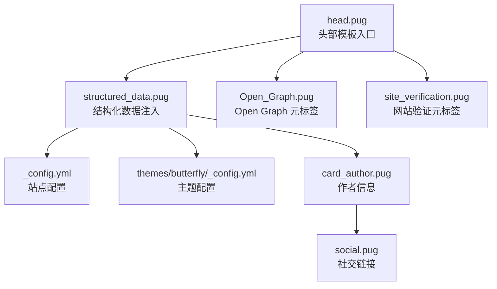
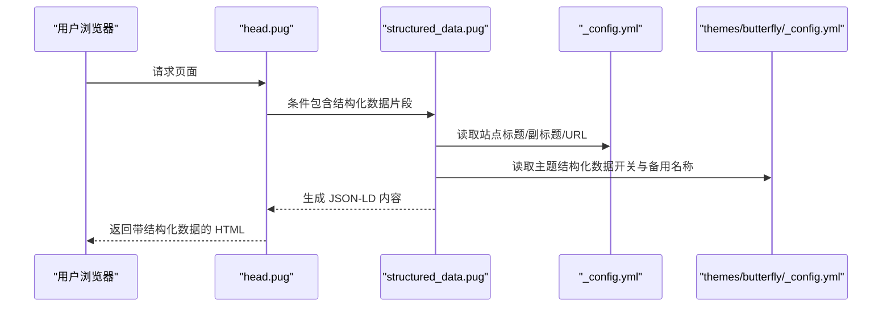
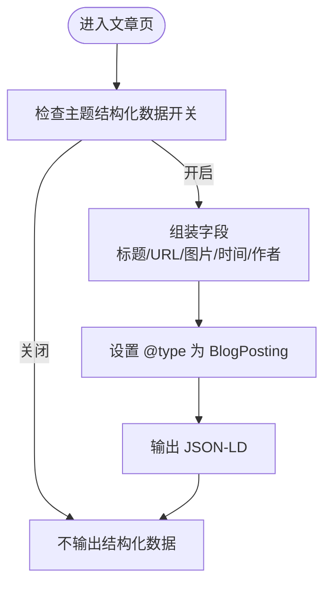
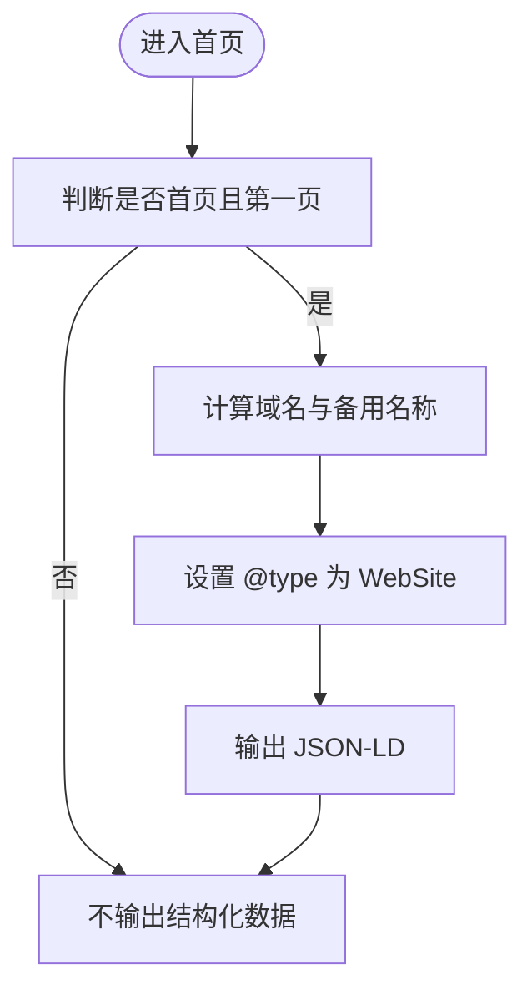
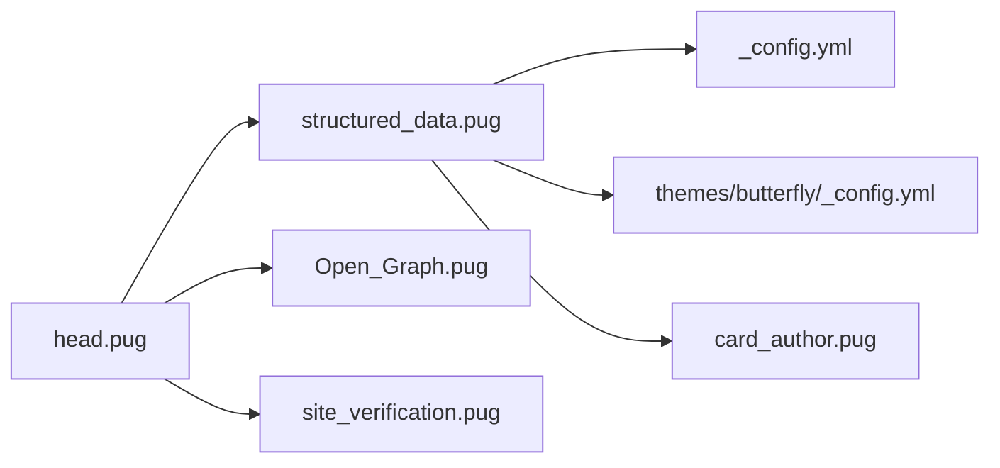

# 结构化数据标记

<cite>
**本文引用的文件**
- [themes/butterfly/layout/includes/head/structured_data.pug](file://themes/butterfly/layout/includes/head/structured_data.pug)
- [themes/butterfly/layout/includes/head.pug](file://themes/butterfly/layout/includes/head.pug)
- [themes/butterfly/_config.yml](file://themes/butterfly/_config.yml)
- [_config.yml](file://_config.yml)
- [themes/butterfly/layout/includes/widget/card_author.pug](file://themes/butterfly/layout/includes/widget/card_author.pug)
- [themes/butterfly/layout/includes/head/Open_Graph.pug](file://themes/butterfly/layout/includes/head/Open_Graph.pug)
- [themes/butterfly/layout/includes/head/site_verification.pug](file://themes/butterfly/layout/includes/head/site_verification.pug)
- [themes/butterfly/layout/includes/header/social.pug](file://themes/butterfly/layout/includes/header/social.pug)
- [source/_posts/Vscode-Github-Copilot接入MATLAB.md](file://source/_posts/Vscode-Github-Copilot接入MATLAB.md)
- [source/_posts/Windows系统如何删除nul文件.md](file://source/_posts/Windows系统如何删除nul文件.md)
</cite>

## 目录
1. [简介](#简介)
2. [项目结构](#项目结构)
3. [核心组件](#核心组件)
4. [架构总览](#架构总览)
5. [详细组件分析](#详细组件分析)
6. [依赖关系分析](#依赖关系分析)
7. [性能考量](#性能考量)
8. [故障排除指南](#故障排除指南)
9. [结论](#结论)
10. [附录](#附录)

## 简介
本指南围绕 ddddzc’s blog 的结构化数据标记展开，重点讲解 Schema.org 标准与结构化数据在 SEO 中的重要性，结合项目现有实现，系统说明如何为博客文章、作者信息、网站导航等元素添加结构化数据。文档提供 JSON-LD 实现思路与验证工具使用方法，并解释结构化数据对搜索结果丰富展示的影响。

## 项目结构
该项目基于 Hexo + Butterfly 主题，结构化数据由主题的头部模板注入。关键位置如下：
- 头部结构化数据注入：themes/butterfly/layout/includes/head/structured_data.pug
- 头部模板入口：themes/butterfly/layout/includes/head.pug
- 主题配置（含结构化数据开关与备用名称）：themes/butterfly/_config.yml
- 站点配置（站点标题、副标题、URL 等）：_config.yml
- 作者卡片与社交链接：themes/butterfly/layout/includes/widget/card_author.pug、themes/butterfly/layout/includes/header/social.pug
- Open Graph 元标签（补充 SEO）：themes/butterfly/layout/includes/head/Open_Graph.pug
- 网站验证元标签：themes/butterfly/layout/includes/head/site_verification.pug
- 示例文章：source/_posts/*.md

**图表来源**
- [themes/butterfly/layout/includes/head.pug:34-35](file://themes/butterfly/layout/includes/head.pug#L34-L35)
- [themes/butterfly/layout/includes/head/structured_data.pug:1-67](file://themes/butterfly/layout/includes/head/structured_data.pug#L1-L67)
- [themes/butterfly/layout/includes/head/Open_Graph.pug:1-16](file://themes/butterfly/layout/includes/head/Open_Graph.pug#L1-L16)
- [themes/butterfly/layout/includes/head/site_verification.pug:1-3](file://themes/butterfly/layout/includes/head/site_verification.pug#L1-L3)
- [themes/butterfly/layout/includes/widget/card_author.pug:1-27](file://themes/butterfly/layout/includes/widget/card_author.pug#L1-L27)
- [themes/butterfly/layout/includes/header/social.pug:1-8](file://themes/butterfly/layout/includes/header/social.pug#L1-L8)
- [_config.yml:6-16](file://_config.yml#L6-L16)
- [themes/butterfly/_config.yml:1050-1056](file://themes/butterfly/_config.yml#L1050-L1056)

**章节来源**
- [themes/butterfly/layout/includes/head.pug:1-78](file://themes/butterfly/layout/includes/head.pug#L1-L78)
- [themes/butterfly/layout/includes/head/structured_data.pug:1-67](file://themes/butterfly/layout/includes/head/structured_data.pug#L1-L67)
- [themes/butterfly/_config.yml:1050-1056](file://themes/butterfly/_config.yml#L1050-L1056)
- [_config.yml:6-16](file://_config.yml#L6-L16)

## 核心组件
- 结构化数据注入器（structured_data.pug）
  - 条件渲染：仅当主题配置开启且当前页面为文章页或首页第一页时生效
  - 文章页：输出 BlogPosting JSON-LD，包含标题、URL、封面图、发布时间、修改时间、作者信息
  - 首页（根或子域名）：输出 WebSite JSON-LD，包含站点名称、备用名称（来自主题配置与副标题、域名）
- 头部模板（head.pug）
  - 引入 Open Graph、结构化数据、网站验证、PWA、统计等模块
- 主题配置（_config.yml）
  - structured_data.enable 控制是否启用结构化数据
  - structured_data.alternate_name 提供备用名称数组
- 站点配置（_config.yml）
  - title、subtitle、url 等影响 JSON-LD 字段
- 作者与社交（card_author.pug、social.pug）
  - 作者头像、描述、社交链接可作为结构化数据的补充来源

**章节来源**
- [themes/butterfly/layout/includes/head/structured_data.pug:1-67](file://themes/butterfly/layout/includes/head/structured_data.pug#L1-L67)
- [themes/butterfly/layout/includes/head.pug:34-35](file://themes/butterfly/layout/includes/head.pug#L34-L35)
- [themes/butterfly/_config.yml:1050-1056](file://themes/butterfly/_config.yml#L1050-L1056)
- [_config.yml:6-16](file://_config.yml#L6-L16)
- [themes/butterfly/layout/includes/widget/card_author.pug:1-27](file://themes/butterfly/layout/includes/widget/card_author.pug#L1-L27)
- [themes/butterfly/layout/includes/header/social.pug:1-8](file://themes/butterfly/layout/includes/header/social.pug#L1-L8)

## 架构总览
结构化数据在页面渲染阶段由主题模板动态生成 JSON-LD，并以内联脚本形式插入到 HTML 的 head 区域。其触发条件与字段来源如下：

**图表来源**
- [themes/butterfly/layout/includes/head.pug:34-35](file://themes/butterfly/layout/includes/head.pug#L34-L35)
- [themes/butterfly/layout/includes/head/structured_data.pug:1-67](file://themes/butterfly/layout/includes/head/structured_data.pug#L1-L67)
- [_config.yml:6-16](file://_config.yml#L6-L16)
- [themes/butterfly/_config.yml:1050-1056](file://themes/butterfly/_config.yml#L1050-L1056)

## 详细组件分析

### 组件一：文章页结构化数据（BlogPosting）
- 触发条件：page.layout === 'post' 且主题配置开启
- 关键字段来源：
  - 标题、URL：page.title、page.permalink
  - 图片：优先使用文章封面，否则回退为主题头像
  - 发布与修改时间：ISO 时间字符串
  - 作者：优先使用文章版权作者，其次回退站点作者；作者链接优先使用文章版权链接，其次主题作者链接，最后回退站点 URL
- 输出类型：BlogPosting，包含 headline、url、image、datePublished、dateModified、author（Person）

**图表来源**
- [themes/butterfly/layout/includes/head/structured_data.pug:2-31](file://themes/butterfly/layout/includes/head/structured_data.pug#L2-L31)
- [themes/butterfly/layout/includes/widget/card_author.pug:4-5](file://themes/butterfly/layout/includes/widget/card_author.pug#L4-L5)
- [_config.yml:10-16](file://_config.yml#L10-L16)

**章节来源**
- [themes/butterfly/layout/includes/head/structured_data.pug:2-31](file://themes/butterfly/layout/includes/head/structured_data.pug#L2-L31)
- [themes/butterfly/layout/includes/widget/card_author.pug:4-5](file://themes/butterfly/layout/includes/widget/card_author.pug#L4-L5)
- [_config.yml:10-16](file://_config.yml#L10-L16)

### 组件二：首页结构化数据（WebSite）
- 触发条件：is_home() 且为第一页，且当前路径为根或子域名
- 关键字段来源：
  - 名称：站点标题
  - 备用名称：主题备用名称数组 + 副标题 + 域名（主机名）
  - URL：根路径
- 输出类型：WebSite，包含 name、alternateName、url

**图表来源**
- [themes/butterfly/layout/includes/head/structured_data.pug:34-63](file://themes/butterfly/layout/includes/head/structured_data.pug#L34-L63)
- [_config.yml:6-16](file://_config.yml#L6-L16)
- [themes/butterfly/_config.yml:1050-1056](file://themes/butterfly/_config.yml#L1050-L1056)

**章节来源**
- [themes/butterfly/layout/includes/head/structured_data.pug:34-63](file://themes/butterfly/layout/includes/head/structured_data.pug#L34-L63)
- [_config.yml:6-16](file://_config.yml#L6-L16)
- [themes/butterfly/_config.yml:1050-1056](file://themes/butterfly/_config.yml#L1050-L1056)

### 组件三：作者与社交信息（补充）
- 作者卡片与社交链接可用于丰富作者信息与站点社交属性，便于在结构化数据中引用或作为外部验证的一部分
- 社交链接与作者头像在 Open Graph 片段中也有体现，有助于统一 SEO 表现

**章节来源**
- [themes/butterfly/layout/includes/widget/card_author.pug:1-27](file://themes/butterfly/layout/includes/widget/card_author.pug#L1-L27)
- [themes/butterfly/layout/includes/header/social.pug:1-8](file://themes/butterfly/layout/includes/header/social.pug#L1-L8)
- [themes/butterfly/layout/includes/head/Open_Graph.pug:1-16](file://themes/butterfly/layout/includes/head/Open_Graph.pug#L1-L16)

## 依赖关系分析
- structured_data.pug 依赖：
  - head.pug：作为头部模板的一部分被包含
  - _config.yml：站点标题、副标题、URL
  - themes/butterfly/_config.yml：结构化数据开关与备用名称
  - card_author.pug：作者头像与站点作者名
- Open Graph 与网站验证：
  - Open_Graph.pug：补充 OG 元标签
  - site_verification.pug：注入网站验证 meta

**图表来源**
- [themes/butterfly/layout/includes/head.pug:34-35](file://themes/butterfly/layout/includes/head.pug#L34-L35)
- [themes/butterfly/layout/includes/head/structured_data.pug:1-67](file://themes/butterfly/layout/includes/head/structured_data.pug#L1-L67)
- [_config.yml:6-16](file://_config.yml#L6-L16)
- [themes/butterfly/_config.yml:1050-1056](file://themes/butterfly/_config.yml#L1050-L1056)
- [themes/butterfly/layout/includes/widget/card_author.pug:1-27](file://themes/butterfly/layout/includes/widget/card_author.pug#L1-L27)
- [themes/butterfly/layout/includes/head/Open_Graph.pug:1-16](file://themes/butterfly/layout/includes/head/Open_Graph.pug#L1-L16)
- [themes/butterfly/layout/includes/head/site_verification.pug:1-3](file://themes/butterfly/layout/includes/head/site_verification.pug#L1-L3)

**章节来源**
- [themes/butterfly/layout/includes/head.pug:34-35](file://themes/butterfly/layout/includes/head.pug#L34-L35)
- [themes/butterfly/layout/includes/head/structured_data.pug:1-67](file://themes/butterfly/layout/includes/head/structured_data.pug#L1-L67)

## 性能考量
- 条件渲染：仅在满足条件时生成 JSON-LD，避免对非目标页面造成额外负担
- 字段来源：优先使用已存在的页面与配置变量，减少额外计算
- 建议：保持主题配置简洁，避免在备用名称中加入过多冗余条目

[本节为通用指导，无需特定文件来源]

## 故障排除指南
- 未看到结构化数据
  - 检查主题配置中结构化数据开关是否开启
  - 确认当前页面为文章页或首页第一页
  - 确认站点 URL、标题、副标题配置正确
- 作者信息不正确
  - 文章页优先使用文章版权作者与链接，其次回退主题与站点配置
  - 检查作者卡片与社交链接配置是否正确
- 验证失败
  - 使用 Google Rich Results Test 进行在线验证
  - 确保 JSON-LD 位于 head 区域内，且无语法错误

**章节来源**
- [themes/butterfly/_config.yml:1050-1056](file://themes/butterfly/_config.yml#L1050-L1056)
- [themes/butterfly/layout/includes/head/structured_data.pug:1-67](file://themes/butterfly/layout/includes/head/structured_data.pug#L1-L67)
- [_config.yml:6-16](file://_config.yml#L6-L16)
- [themes/butterfly/layout/includes/widget/card_author.pug:1-27](file://themes/butterfly/layout/includes/widget/card_author.pug#L1-L27)

## 结论
本项目已在 Butterfly 主题中实现了针对文章页（BlogPosting）与首页（WebSite）的结构化数据注入，遵循 Schema.org 标准并通过 JSON-LD 形式输出。结合 Open Graph 与网站验证元标签，整体 SEO 基础较为完善。建议在后续迭代中：
- 明确启用结构化数据的开关与默认值
- 在文章 Front Matter 中补充作者与图片字段，提升数据完整性
- 使用 Google Rich Results Test 定期验证结构化数据质量

[本节为总结性内容，无需特定文件来源]

## 附录

### Schema.org 核心数据类型与标记要点
- Article（文章）
  - 适用场景：博客文章、新闻文章等
  - 关键字段：headline、datePublished、dateModified、author、publisher、image、articleBody
- BlogPosting（博客文章）
  - 适用场景：博客文章页
  - 关键字段：headline、url、image、datePublished、dateModified、author
- WebSite（网站）
  - 适用场景：首页
  - 关键字段：name、alternateName、url
- Organization（组织）
  - 适用场景：站点主体信息
  - 关键字段：name、logo、sameAs（社交链接）、url
  - 注：可在 WebSite 或 BlogPosting 的 publisher 中引用 Person/Organization

[本节为概念性说明，无需特定文件来源]

### JSON-LD 实现要点与示例路径
- 文章页（BlogPosting）
  - 触发条件与字段来源参考：[structured_data.pug:2-31](file://themes/butterfly/layout/includes/head/structured_data.pug#L2-L31)
  - 作者信息来源参考：[card_author.pug:4-5](file://themes/butterfly/layout/includes/widget/card_author.pug#L4-L5)
- 首页（WebSite）
  - 触发条件与字段来源参考：[structured_data.pug:34-63](file://themes/butterfly/layout/includes/head/structured_data.pug#L34-L63)
  - 备用名称来源参考：[_config.yml:6-16](file://_config.yml#L6-L16)、[themes/butterfly/_config.yml:1050-1056](file://themes/butterfly/_config.yml#L1050-L1056)

[本节提供路径指引，不展示具体代码内容]

### 验证工具与使用方法
- Google Rich Results Test
  - 访问：https://search.google.com/test/rich-results
  - 输入目标页面 URL，提交后查看结构化数据报告
  - 关注“结构化数据”部分，确认 JSON-LD 是否被识别、字段是否完整
- 本地验证建议
  - 确认 JSON-LD 位于 <head> 区域
  - 使用 JSON 校验工具检查 JSON-LD 语法
  - 在不同页面（首页、文章页）分别测试

[本节为通用指导，无需特定文件来源]

### 实际应用示例（路径指引）
- 示例文章一：[Vscode-Github-Copilot接入MATLAB.md](file://source/_posts/Vscode-Github-Copilot接入MATLAB.md)
- 示例文章二：[Windows系统如何删除nul文件.md](file://source/_posts/Windows系统如何删除nul文件.md)

[本节提供路径指引，不展示具体代码内容]